# Deploy Lab using Oracle Resource Manager

## Introduction

This optional lab lets you skip the manual prerequisite work in Lab 1 by deploying the underlying network (VCN, three subnets, Internet Gateway, custom Route Tables, and Security Lists) with a single Terraform stack through Oracle Resource Manager (ORM).

If you would rather build the prerequisites by hand to understand each component, skip this lab and create them before starting Lab 1. If you want the fastest path to the Palo Alto deployment, use the stack provided here.

Estimated time: 10 minutes

### Objectives

In this lab, you will:
1. Create a Resource Manager stack from a Terraform configuration `.zip` file.
2. Run an `Apply` job to provision the VCN and supporting network resources.
3. Verify that the VCN, subnets, Internet Gateway, route tables, and security lists are present and ready for the Palo Alto VM-Series deployment.

### Prerequisites

Before you begin, ensure you have the following:
- An active OCI tenancy.
- A compartment in which you can create networking resources (this lab uses a compartment named `Iwan`; replace it with your own compartment).
- Permissions to use Resource Manager and to create VCNs, subnets, gateways, route tables, and security lists.
- Download the [livelabs.zip](files/livelabs.zip) Terraform configuration before continuing.

> **Note:** The stack deploys the network only. Palo Alto VM-Series deployment and configuration are covered in Lab 2 onwards.

## Task 1: Login and Create Stack using Resource Manager

- Log in to the **OCI Console** and select the **OCI Region** you want to deploy the lab in (this example uses **Germany Central (Frankfurt)**).
1. Click on the **hamburger menu** in the top left corner.
2. Click on **Developer Services**.
3. Under **Resource Manager**, click on **Stacks**.

    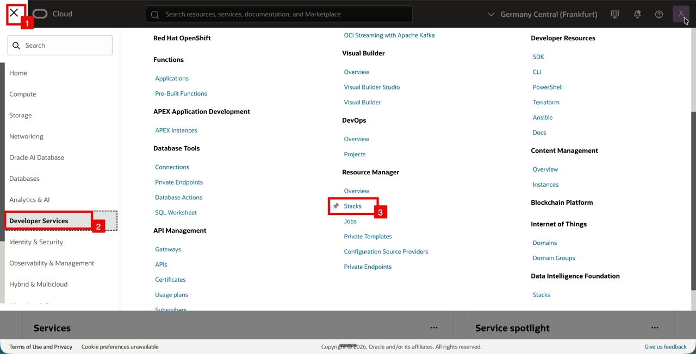

    - On the **Stacks** page, make sure the **compartment** is set to the one you want to deploy into.
    - Click on **Create Stack**.

    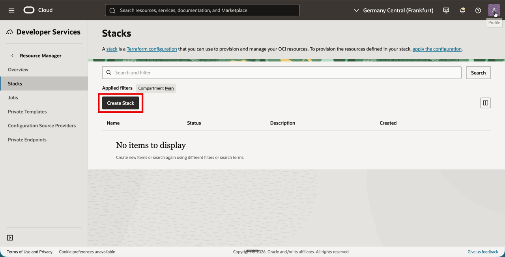

    - You are now in the **Stack information** step.

<!-- -->

1. For the **origin** of the Terraform configuration, select **My configuration**.
2. For the **Terraform configuration source**, select **.Zip file**.
3. Click on **Browse** and select the `livelabs.zip` file you downloaded.
4. Confirm the file appears in the upload area (here shown as `livelabs.zip`).
5. Click on the **Next** button.

    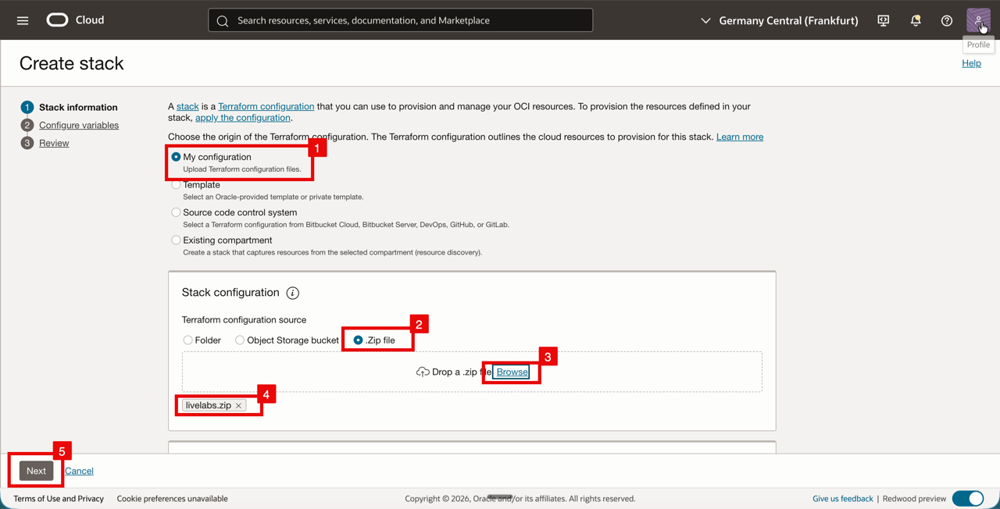

    - You are now in the **Configure variables** step. The stack exposes a few variables for the deployment.

<!-- -->

1. For **Region**, select the region you want to deploy into (here `eu-frankfurt-1`).
2. For **Compartment**, select the compartment where the VCN and related resources will be created (here `Iwan`).
    - Leave the VCN CIDR Block at `172.16.0.0/24` and the VCN DNS Label at `vcn` (or change them if needed).
3. Click on the **Next** button.

    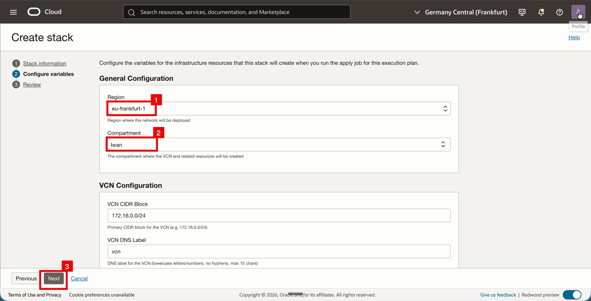

- You are now in the **Review** step.
- Review the **Stack information** and **General Configuration**.

> **Note:** Leave **Run apply on the created stack?** unchecked. You will run the `Apply` job manually in the next task so you can watch the deployment progress.

- Click on the **Create** button.

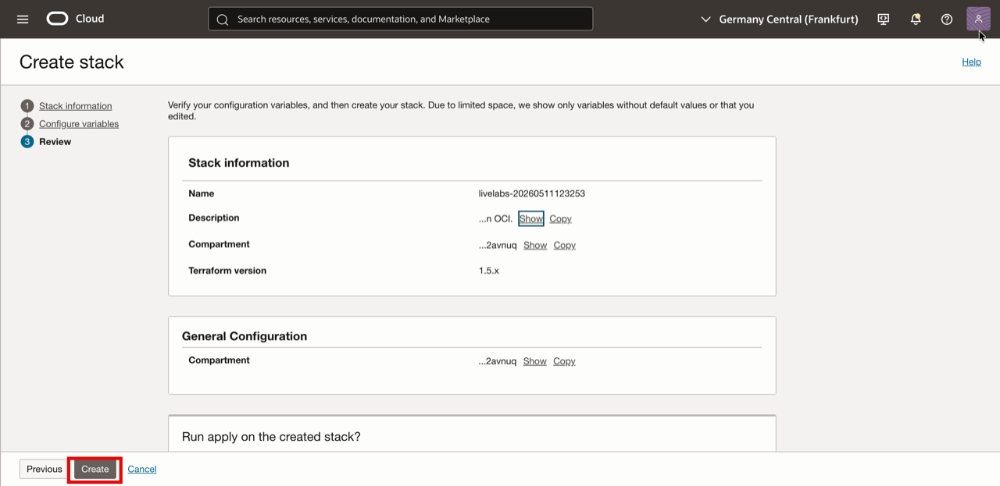

## Task 2: Terraform Plan and Apply

- The stack has been created and is now in the **Active** state.

1. Notice the stack status is **Active**.
2. Click on the **Actions** dropdown.
3. Click on **Apply**.

    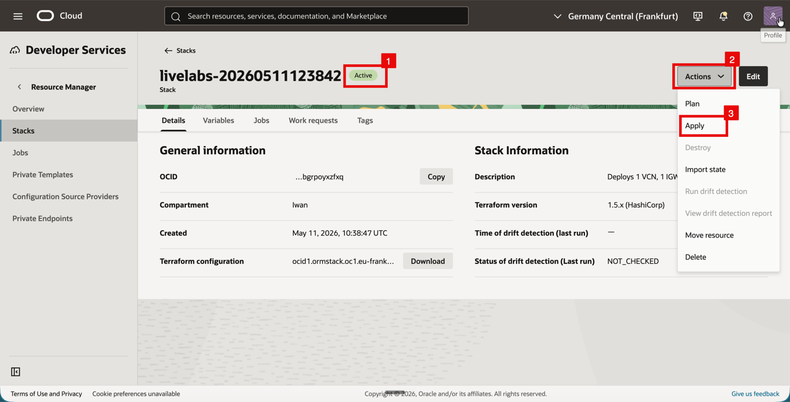

- An **Apply** job dialog opens.
- Leave the default **Name** and the **Apply job plan resolution** set to **Automatically approved**.
- Notice the warning that resources will be deployed immediately.
- Click on the **Apply** button at the bottom right.

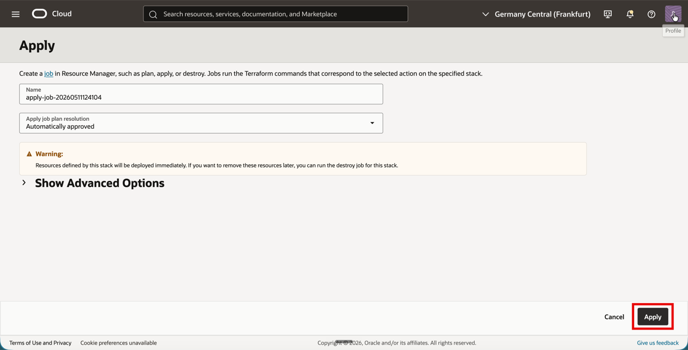

- The job is created and starts in the **Accepted** state.

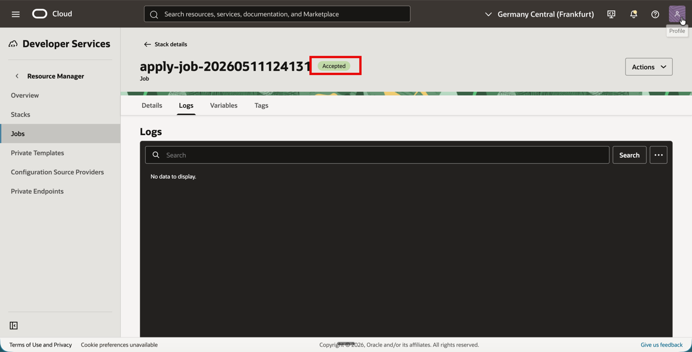

- After a few seconds, the job moves to the **In Progress** state. Terraform is now creating the resources.

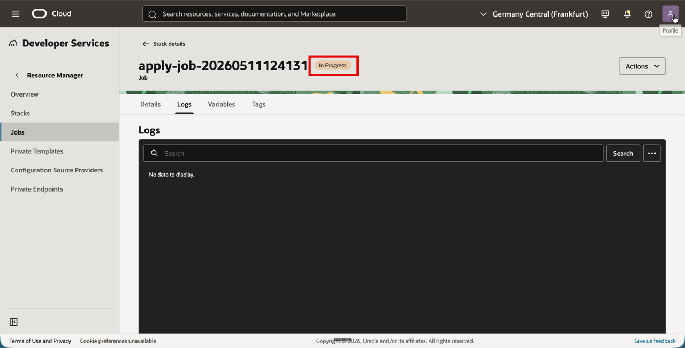

- When the job is finished, the status changes to **Succeeded**.

> **Note:** If the job ends in **Failed**, click on the **Logs** tab to see what went wrong. The most common causes are missing permissions on the selected compartment or a CIDR collision with an existing VCN.

## Task 3: Verify the deployment

- First, verify the resources from the **Job** page, then double-check them from the **Networking** console.

1. On the stack page, click on **Stacks** in the left navigation if needed.
2. Click on the **Jobs** tab.
3. Confirm that the **Apply** job shows **Succeeded**.
4. Click on the **job name** (for example `apply-job-...`) to open it.

    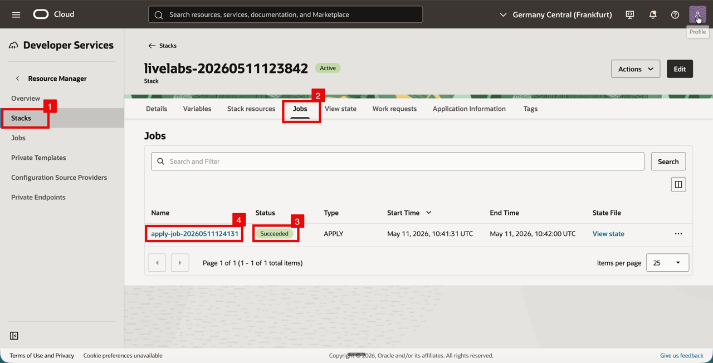

<!-- -->

1. On the job page, click on the **Job resources** tab.
2. Confirm that the expected resources have been created. You should see the **Internet Gateway**, the three **Route Tables** (`Management_Subnet_RT`, `Trust_Subnet_RT`, `Untrust_Subnet_RT`), the three **Security Lists** (`Management_Subnet_SL`, `Trust_Subnet_SL`, `Untrust_Subnet_SL`), the **VCN**, and the three **Subnets**.

    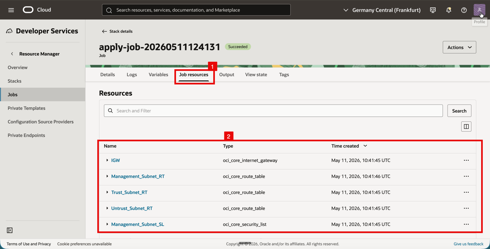

    - Now verify the same resources from the Networking console.

<!-- -->

1. Click on the **hamburger menu** in the top left corner.
2. Click on **Networking**.
3. Click on **Virtual cloud networks**.

    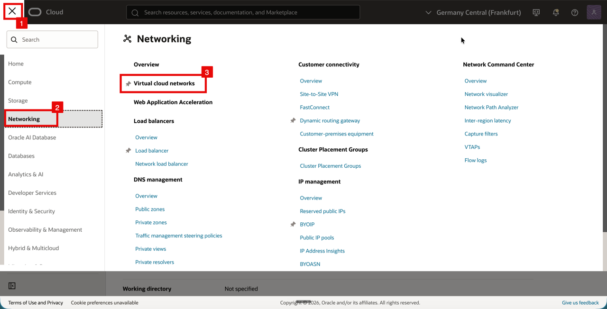

    - The **Virtual Cloud Networks** list opens.
    - Confirm the compartment filter matches the one you used in the stack (here `Iwan`).
    - Click on the **VCN** (`172.16.0.0/24`).

    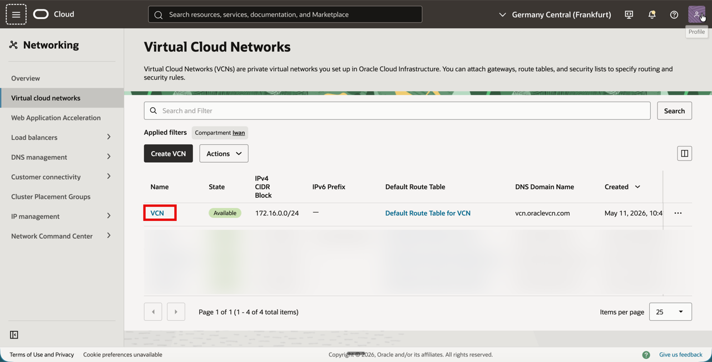

<!-- -->

1. Click on the **Subnets** tab.
2. Confirm the three subnets are present:

    | Subnet | CIDR | Subnet Access |
    | --- | --- | --- |
    | `Management_Subnet` | `172.16.0.0/28` | Public (Regional) |
    | `Untrust_Subnet` | `172.16.0.16/28` | Public (Regional) |
    | `Trust_Subnet` | `172.16.0.32/28` | Private (Regional) |

    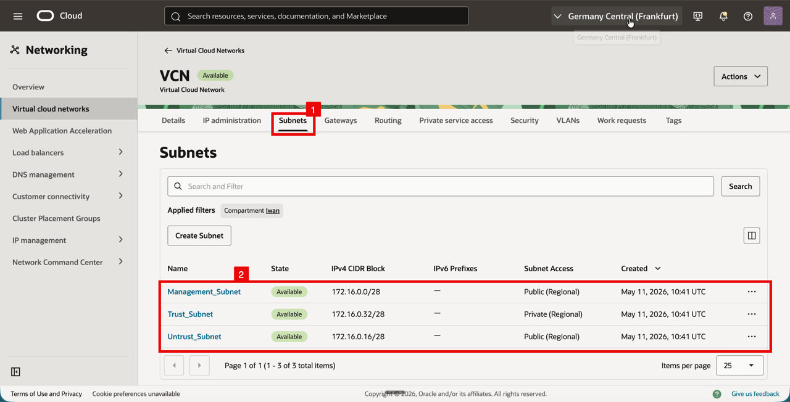

<!-- -->

1. Click on the **Gateways** tab.
2. Confirm that **IGW** (Internet Gateway) is present and **Available**.

    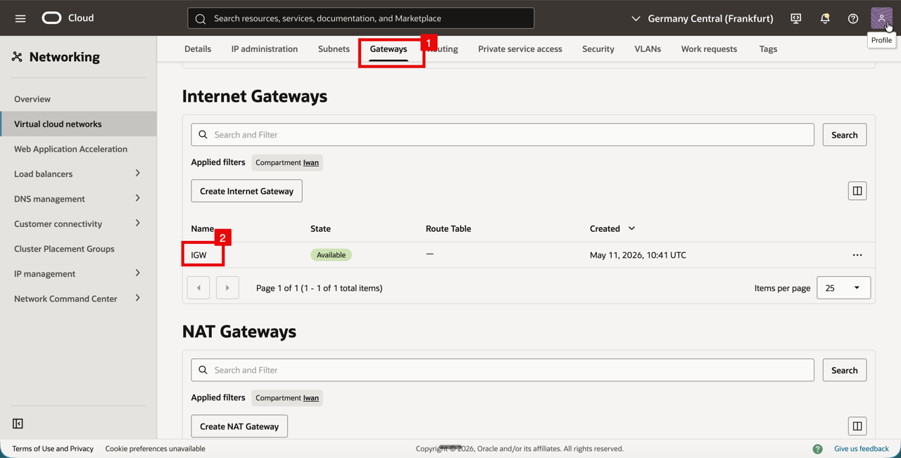

<!-- -->

1. Click on the **Routing** tab.
2. Confirm that the three custom route tables (`Management_Subnet_RT`, `Trust_Subnet_RT`, `Untrust_Subnet_RT`) are present alongside the **Default Route Table for VCN**. The Management route table has one route rule (the default route to the Internet Gateway).

    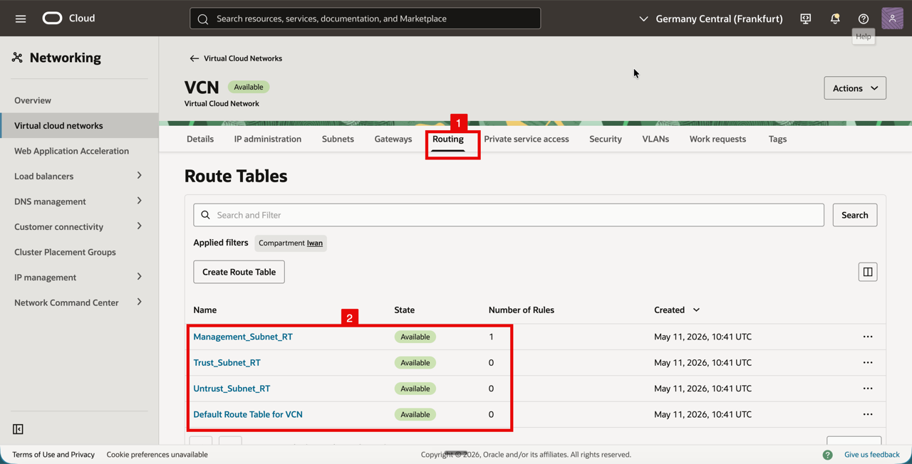

<!-- -->

1. Click on the **Security** tab.
2. Confirm that the three custom security lists (`Management_Subnet_SL`, `Trust_Subnet_SL`, `Untrust_Subnet_SL`) are present alongside the **Default Security List for VCN**.

    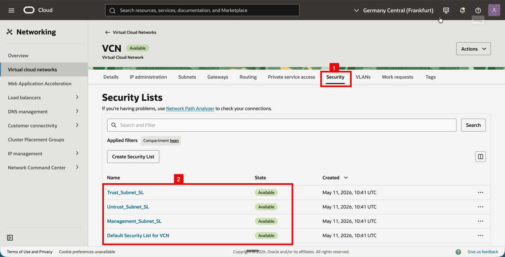

    - Finally, spot-check that a subnet is wired up to its custom route table and security list.

<!-- -->

1. Click on the **Subnets** tab.
2. Click on the `Management_Subnet`.

    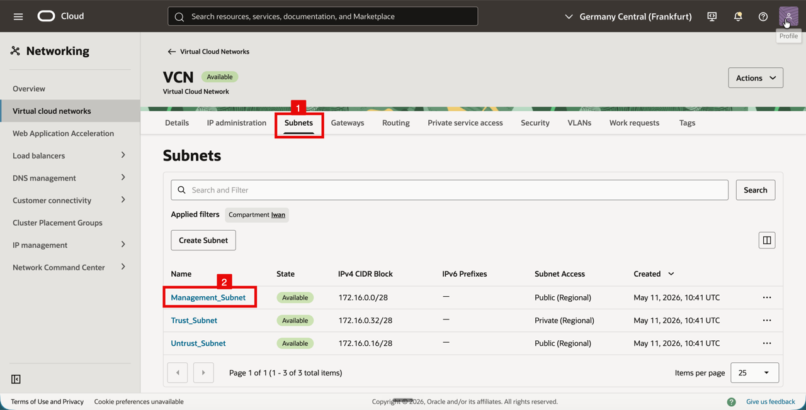

<!-- -->

1. On the **Details** tab, scroll down to the **Route Table** field.
2. Confirm the Route Table is set to `Management_Subnet_RT`.

    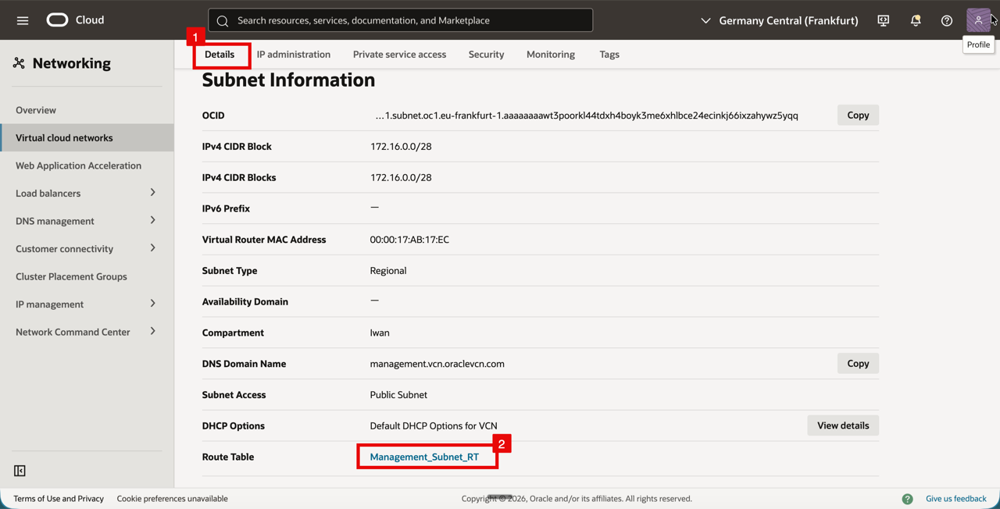

<!-- -->

1. Click on the **Security** tab.
2. Confirm that `Management_Subnet_SL` is associated with the subnet.

    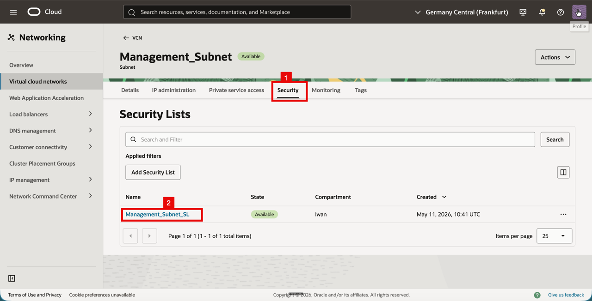

> **Note:** The Trust and Untrust subnets follow the same wiring (each subnet has its own custom Route Table and Security List). You can repeat the spot-check on them if you want.

Continue to Lab 1 to review the prerequisite networking configuration.

## Learn More

- [OCI Resource Manager and Terraform](https://docs.oracle.com/en-us/iaas/Content/ResourceManager/Concepts/resourcemanager.htm)

## Acknowledgements

- **Authors** - Anas Abdallah, Iwan Hoogendoorn (Cloud Networking Black Belts)
- **Contributor** - Antonio Gámir (Cloud Networking Black Belt)
- **Last Updated By/Date** - Anas Abdallah, August 2026

You may now **proceed to the next lab**.
