# Review VCN Routing & Security (Prerequisites)

## Introduction

This lab reviews the OCI networking prerequisites for the standalone Palo Alto firewall deployment, including the VCN, subnets, route tables, security lists, and Internet Gateway.

Estimated time: 10 minutes

### Objectives

In this lab, you will:
- Verify that the required VCN networking components are in place.
- Review the routing and security configuration for the management, untrust, and trust subnets.

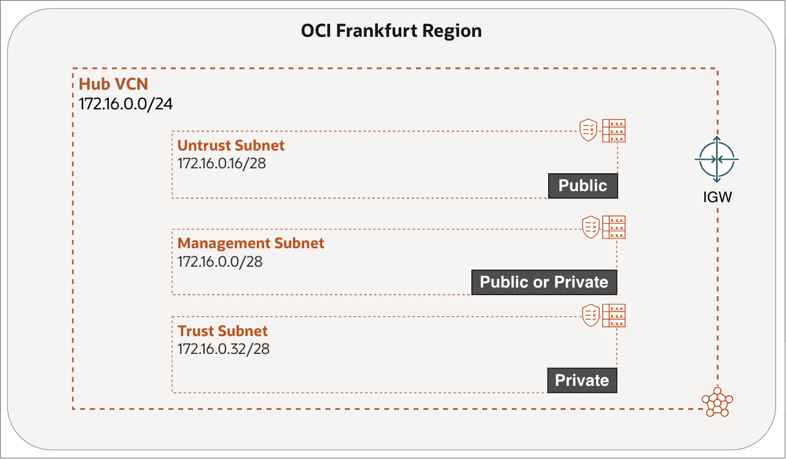

### Prerequisites

No prerequisite lab is required. Complete Lab 0 if you want to deploy the required VCN networking components using Terraform; otherwise, create them manually before starting this lab.

## Task 1: Review VCN Routing

Review the VCN route tables to confirm that the management and untrust subnets can reach the internet through the Internet Gateway.

1. Select the **OCI Region** you want to deploy the Firewall in.
2. Click on the **hamburger menu** in the top left corner.

    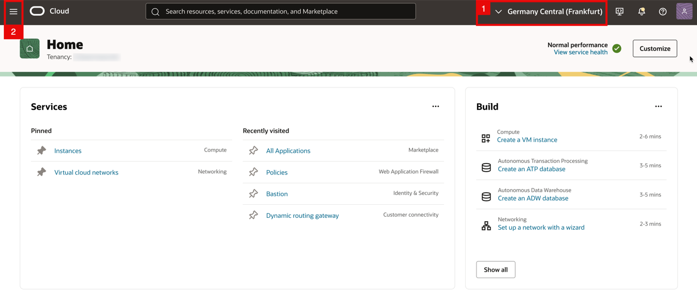

<!-- -->

1. Click on **Networking**.
2. Click on **Virtual cloud networks**.

    

    - Make sure the VCN is created as part of your prerequisites. Click on the **Hub VCN**.

    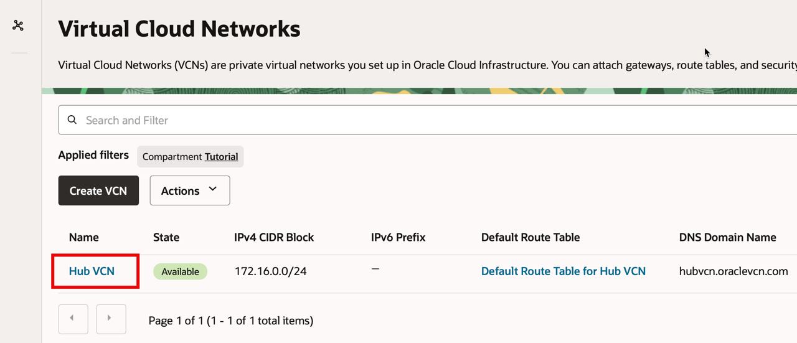

<!-- -->

1. Click on **Subnets**.
2. Make sure the Subnets are created and that each one has its own custom Route Table and Security List assigned as part of your prerequisites.

    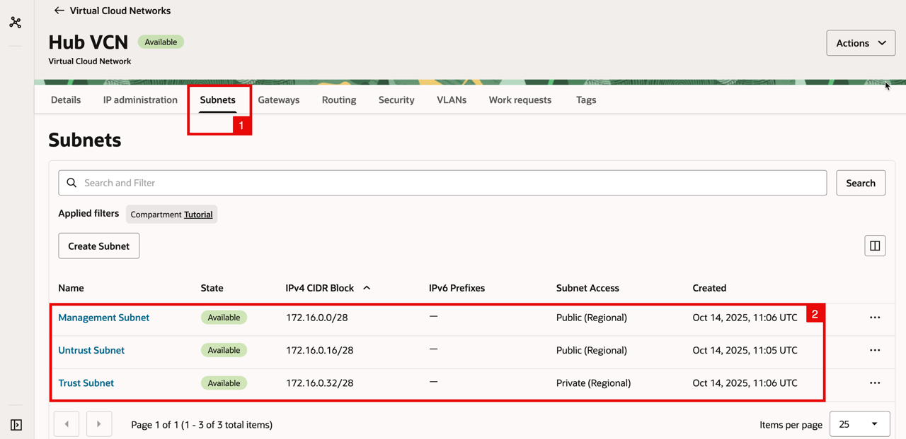

<!-- -->

1. Click on **Gateways**.
2. Make sure the Internet Gateway is created as part of your prerequisites.

    

<!-- -->

1. Click on **Routing**.
2. The default VCN Routing Table will be available (we will not be using this).
3. Make sure the custom Routing Tables are created as part of your prerequisites.

    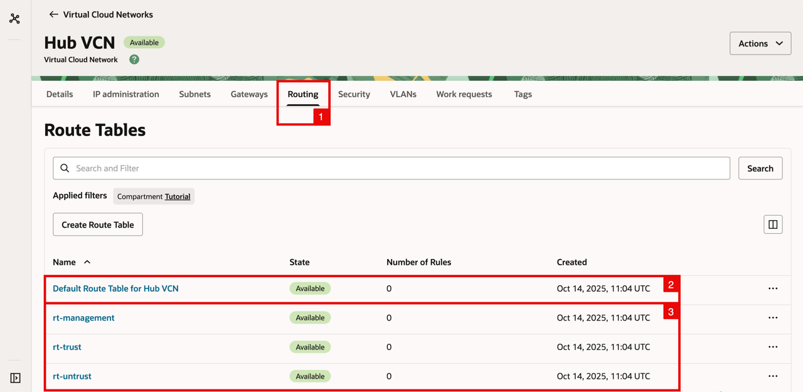

    - Click on the **rt-management** **Routing Table**.

    

<!-- -->

1. Click on the **Route Rules**.
2. Make sure you have the following route rule configured:

    | Destination | Target Type      | Target | Route Type |
    | ----------- | ---------------- | ------ | ---------- |
    | 0.0.0.0/0   | Internet Gateway | IGW    | Static     |

3. Go Back to the Hub VCN overview.

    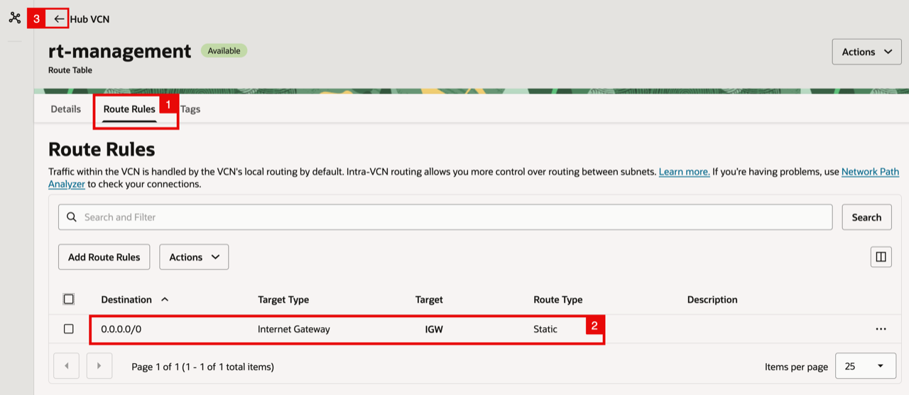

    - Click on the **rt-untrust** **Routing Table**.

    

<!-- -->

1. Click on the **Route Rules**.
2. Make sure you have the following route rule configured:

    | Destination | Target Type      | Target | Route Type |
    | ----------- | ---------------- | ------ | ---------- |
    | 0.0.0.0/0   | Internet Gateway | IGW    | Static     |

3. Go Back to the Hub VCN overview.

    

## Task 2: Review VCN Security

Review the security lists to confirm that PAN-OS management access and the required trust and untrust traffic are allowed.

1. Click on **Security**.
2. Notice the **default VCN Security List** will be available (we will not be using this).
3. Make sure the **custom Security Lists** are created as part of your prerequisites.

    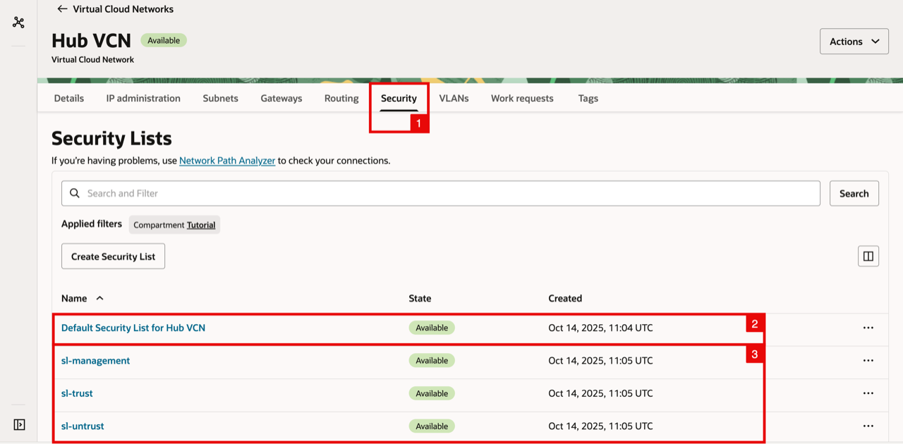

    - Click on the **sl-management Security List** (for the Management Subnet).

    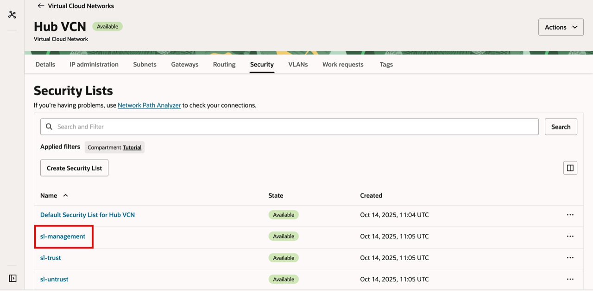

    - Click on **Security rules**.

    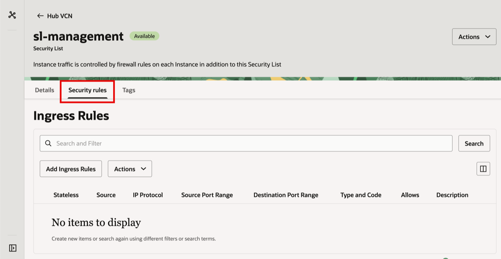

<!-- -->

1. Make sure to add in an **Ingress rule** to allow traffic from all sources (`0.0.0.0/0`) to port `TCP/22` (SSH).
2. Make sure to add in an **Ingress rule** to allow traffic from all sources (`0.0.0.0/0`) to port `TCP/443` (HTTPS).

> **Note:** Opening SSH/HTTPS to `0.0.0.0/0` is not a best practice. For better security, restrict access to your own public IP or another trusted range.

- Scroll down for the **Egress rules**.
- Make sure you add in an **Egress rule** to allow traffic to all destinations (`0.0.0.0/0`) for `All Protocols`.

- Go back to the **Security List Overview**.

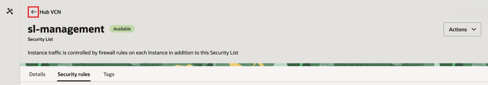

- Click on the **sl-trust Security List** (for the Trusted Subnet).

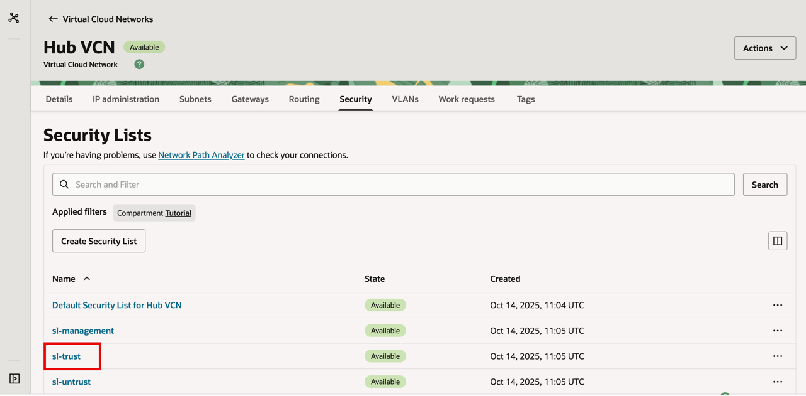

- Click on **Security Rules**.

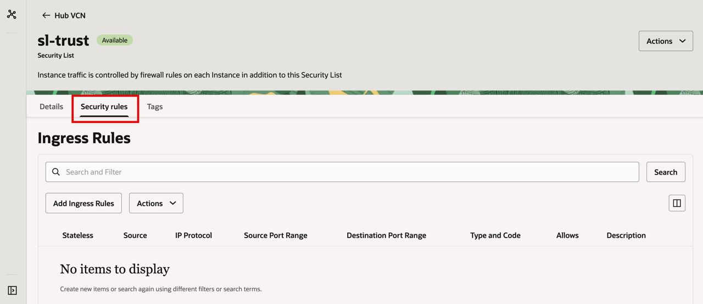

- Make sure you add in an **Ingress rule** to allow traffic from all sources (`0.0.0.0/0`) for `All Protocols`.

> **Note:** Allowing **All Protocols (Ingress)** from `0.0.0.0/0` is not a best practice. We are only doing it here only for simplicity and to avoid extra troubleshooting as we move into the later workshops in this series. In real deployments, allow only what you actually need.

- Scroll down for the **Egress rules**.
- Make sure you add in an **Egress rule** to allow traffic to all destinations (`0.0.0.0/0`) for `All Protocols`.

- Go back to the **Security List Overview**.

- Click on the **sl-untrust Security List** (for the Untrusted Subnet).

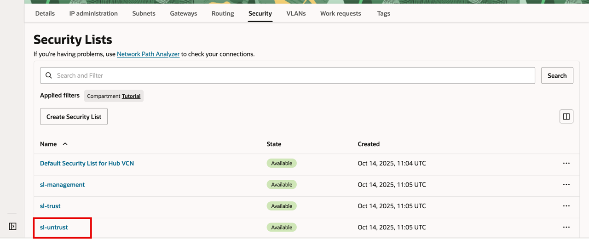

- Click on **Security Rules**.

- Make sure you add in an **Ingress rule** to allow traffic from all sources (`0.0.0.0/0`) for `All Protocols`.

> **Note:** Allowing **All Protocols (Ingress)** from `0.0.0.0/0` is not a best practice. We are only doing it here only for simplicity and to avoid extra troubleshooting as we move into the later workshops in this series. In real deployments, allow only what you actually need.

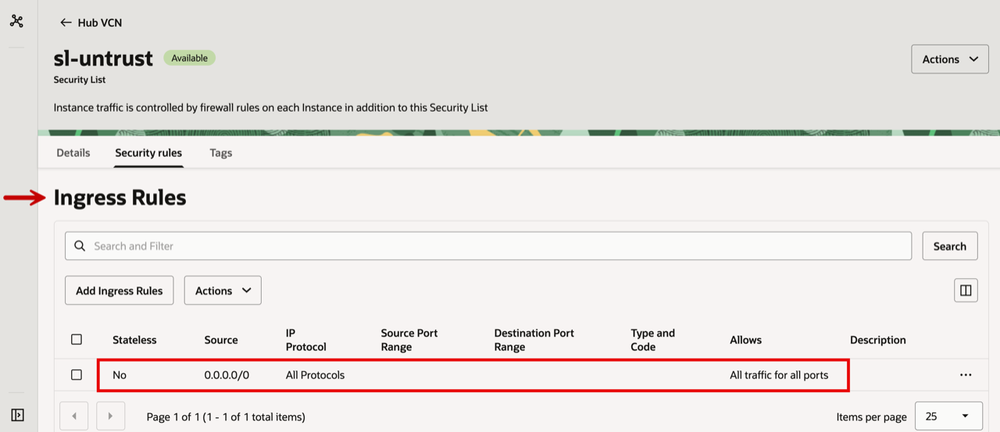

- Scroll down for the **Egress rules**.
- Make sure you add in an **Egress rule** to allow traffic to all destinations (`0.0.0.0/0`) for `All Protocols`.

## Learn More

- [VCN and Subnet Management](https://docs.oracle.com/en-us/iaas/Content/Network/Tasks/managingVCNs.htm)
- [VCN Route Tables](https://docs.oracle.com/en-us/iaas/Content/Network/Tasks/managingroutetables.htm)
- [Security Lists](https://docs.oracle.com/en-us/iaas/Content/Network/Concepts/securitylists.htm)

## Acknowledgements

- **Authors** - Anas Abdallah, Iwan Hoogendoorn (Cloud Networking Black Belts)
- **Contributor** - Antonio Gámir (Cloud Networking Black Belt)
- **Last Updated By/Date** - Anas Abdallah, August 2026

You may now **proceed to the next lab**.
