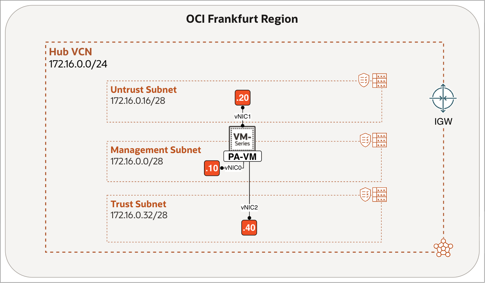
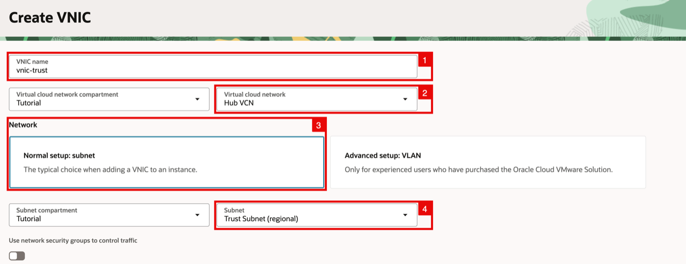
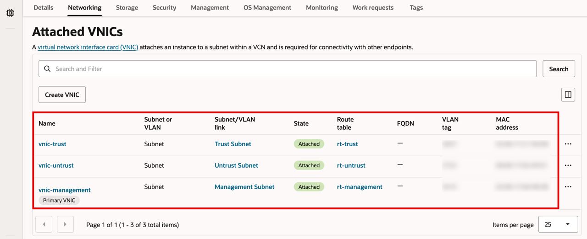

# Create Data VNICs (Trust and Untrust)

## Introduction

When you launch a Palo Alto VM-Series instance from Oracle Cloud Marketplace, it initially has only a management VNIC. That interface is used to administer PAN-OS; it does not carry the workload traffic that the firewall must inspect.

This lab focuses on the OCI side of the deployment, where you attach two data VNICs to the firewall instance. The trust VNIC connects the firewall to private workloads. It receives traffic from those workloads, sends internet-bound traffic to the untrust side, and supports inspected private-to-private traffic, such as traffic between spoke VCNs. The untrust VNIC connects the firewall to the public network and carries traffic to and from the internet. Together, these VNICs prepare the firewall for traffic inspection and security policy enforcement in the following labs.

Estimated time: 5 minutes

### Objectives

In this lab, you will create the trust and untrust VNICs in the OCI Console.

### Prerequisites

Before you begin, ensure you have completed the preceding required labs in this workshop.

## Task 1: Create Untrust VNIC

Create the untrust VNIC for the Palo Alto VM and assign it the private IPv4 address `172.16.0.20`.

1. Within the Compute Instance (PA-VM) page, click on the **Networking** tab (Scroll down to the Attached VNICs section).
2. Rename **management interface** to be vnic-management (if this is not already done).
3. Click on the **Create VNIC** button (to create the untrusted VNIC).

    

<!-- -->

1. Specify the **name** for the untrusted VNIC.
2. Select your **VCN**.
3. Make sure the **Network** subnet is set to Normal.
4. Select the **Untrust Subnet**.

    - Scroll down.

    

<!-- -->

1. Enable **Skip source/destination check**.
2. For the **Private IPv4 address** select **Manually assign private IPv4 address**.
3. Specify an **IP address** (`172.16.0.20`).
4. Enable **Automatically assign public IPv4 address** (as this interface will access the Internet).
5. Click on the **Submit** button.

    

## Task 2: Create Trust VNIC

Create the trust VNIC for the Palo Alto VM and assign it the private IPv4 address `172.16.0.40`.

1. Notice the new untrusted VNIC has been added.
2. Click on the **Create VNIC** button (to create the trusted VNIC).

    

<!-- -->

1. Specify the **name** for the trusted VNIC.
2. Select your **VCN**.
3. Make sure the **Network** subnet is set to Normal.
4. Select the **Trust Subnet**.

    - Scroll down.

    

<!-- -->

1. Enable **Skip source/destination check**.
2. For the **Private IPv4 address** select **Manually assign private IPv4 address**.
3. Specify an **IP address** (`172.16.0.40`).
4. **Automatically assign public IPv4 address** will be disabled by default as this is a private subnet.
5. Click on the **Submit** button.

    

- Notice the new trusted VNIC has been added, and the other VNICs (management and untrusted) are also present, and ready to be used by the instance.

## Learn More

- [Virtual Network Interface Cards (VNICs)](https://docs.oracle.com/en-us/iaas/Content/Network/Tasks/managingVNICs.htm)
- [Creating and Attaching a Secondary VNIC](https://docs.oracle.com/en-us/iaas/Content/Network/Tasks/managingvnics_tasks-attach.htm)

## Acknowledgements

- **Authors** - Anas Abdallah, Iwan Hoogendoorn (Cloud Networking Black Belts)
- **Contributor** - Antonio Gámir (Cloud Networking Black Belt)
- **Last Updated By/Date** - Anas Abdallah, August 2026

You may now **proceed to the next lab**.
