# Access the Palo Alto and Perform Initial Setup

## Introduction

This lab moves from OCI resource deployment to PAN-OS configuration. You access the firewall, configure its trust and untrust interfaces, and security zones, then create the initial security policy that controls traffic through the firewall.

Estimated time: 20 minutes

### Objectives

In this lab, you will:
- Access the Palo Alto management interface.
- Set the `admin` password.
- Configure the management, trust, and untrust interfaces and their security zones.
- Create a security policy for the firewall.
- Commit the initial PAN-OS configuration.

### Prerequisites

Before you begin, ensure you have completed the preceding required labs in this workshop.

## Task 1: Access via SSH and Set Admin Password

Now that the Palo Alto Firewall is deployed you are ready to access it.

- For macOS:
1. Set up an SSH connection using your private SSH key and your public IP address with the following command: `ssh -i <your private key> admin@ <your public IP address>`.
2. Type `yes` to confirm that you want to connect.
3. Notice the `Welcome admin` message, that indicate that you are logged in.
4. Type in `configure` to enter the  configuration mode.
5. Type in `set mgt-config users admin password` to configure the password for the `admin` user.
6. Enter a secure `password`, and confirm the password.

    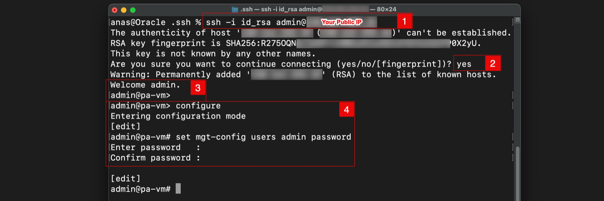

- Refer to the initial steps in the following [workshop](https://docs.oracle.com/en/learn/oci-openvpn-part1/index.html#task-52-access-openvpn-vm-from-putty-and-complete-the-initial-setup) to learn how to access from Windows using PuTTY.

## Task 2: Access via GUI and Configure the Interfaces

Use the web interface to configure the firewall data-plane interfaces and security zones.

1. Open a **web browser** and use your public IP address to connect to the management web interface of the Palo Alto Firewall. 
2. Depending on your browser (settings) you might need to allow the connection as the Palo Alto Firewall does not have a signed certificate deployed yet. Click on **Advanced**.

    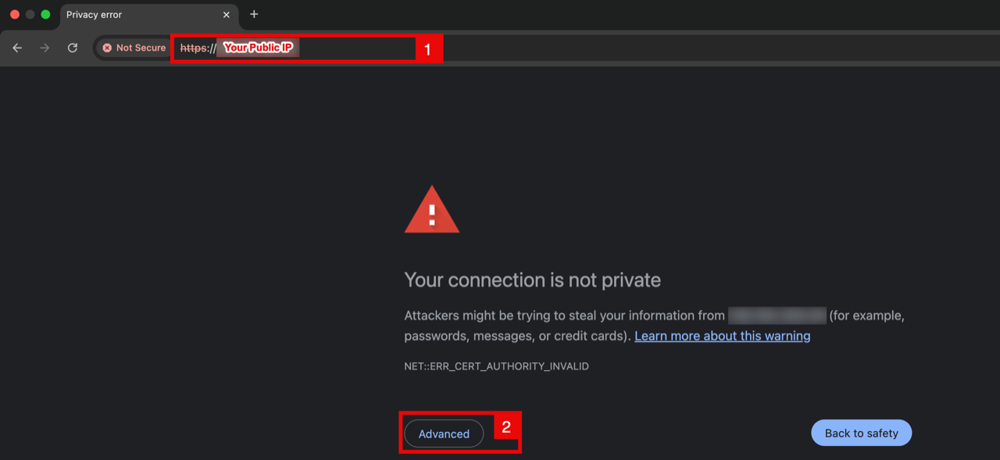

    - Click on **Proceed**.

    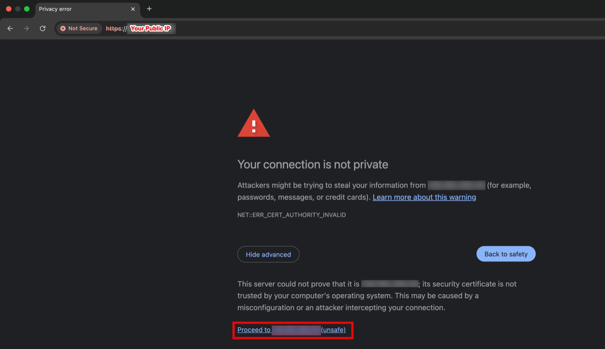

<!-- -->

1. Type in your username: `admin`.
2. Type in your password (you just created).
3. Click in the **Log In** button.

    

<!-- -->

1. You will be welcomed with the Welcome screen, Check the **Do not show again** check box.
2. Click on the **Close** button.

    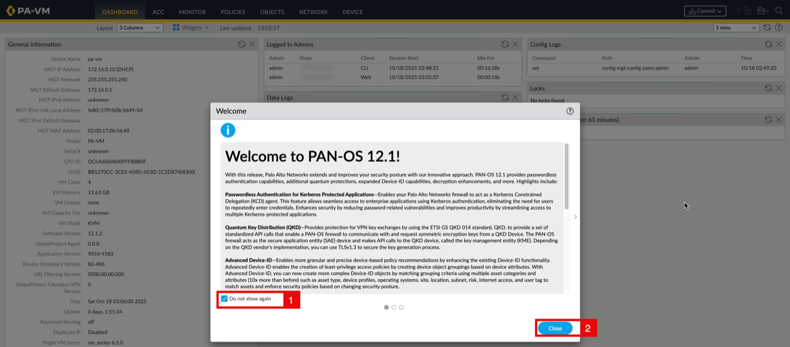

    - A message about Telemetry Data Connection will show up, and you can modify these settings later. For now click on the **OK** button.

    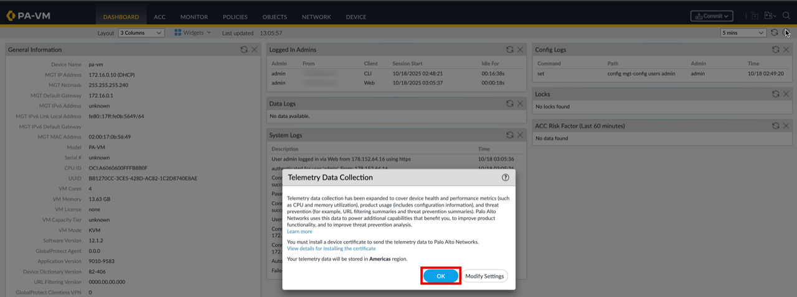

    - In Palo Alto Networks, **Address Objects** are reusable representations of IP hosts, subnets, IP ranges, or FQDNs. Creating them once and referencing them in policies and rules improves configuration clarity, consistency, and maintenance. They are optional, but are a recommended practice. This lab creates the initial objects; later examples may use direct values where that keeps the configuration focused.
    - Click on **Objects**.

    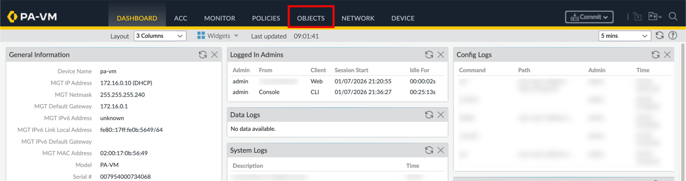

    - Click on **Addresses**.

    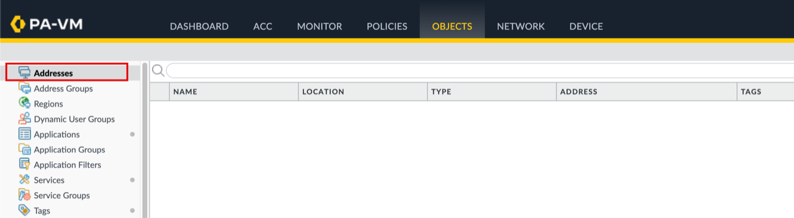

    - Click on **Add**.

    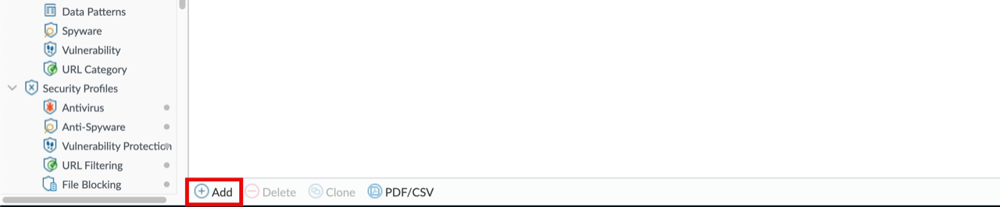

<!-- -->

1. Provide a **name** for the address, we are going to begin with **Trust vNIC Private IP**.
2. Specify the type as **IP Netmask**.
3. Type Trust vNIC Private IP `172.16.0.40/28`.
4. Click on **OK**.

    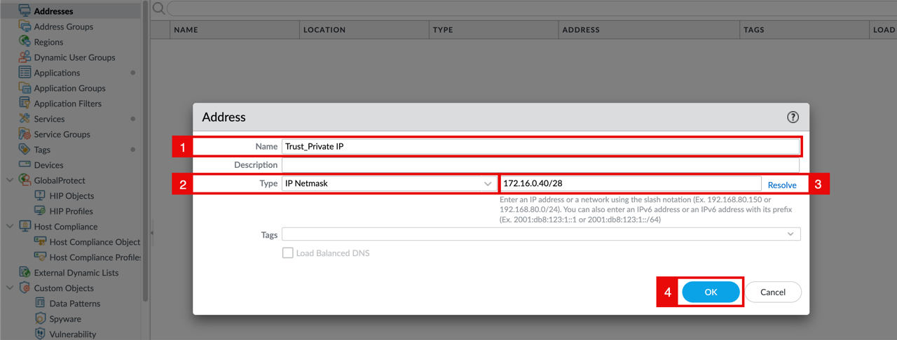

    - Repeat the same steps to add the rest of addresses.

    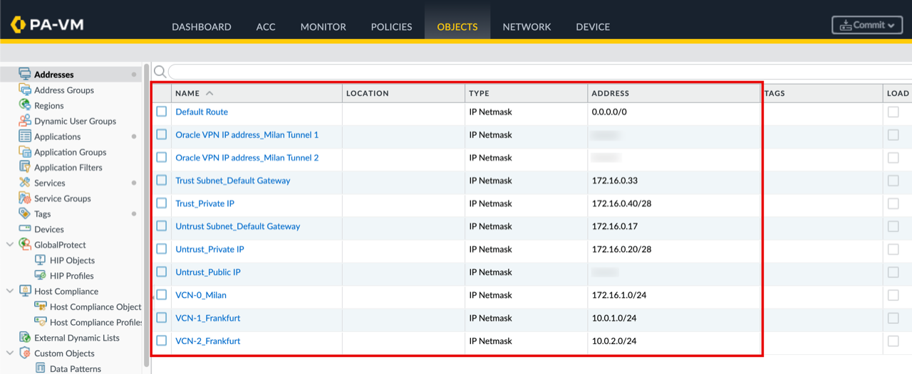

    - Whenever you need to add an address (for example, during interface configuration, virtual router setup, or security policy creation), you can select it from the address objects you have already created.

    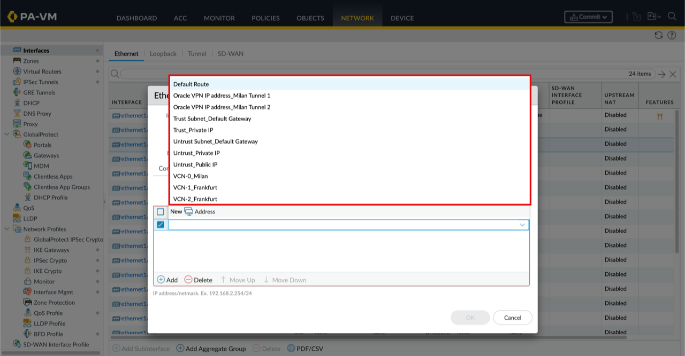

    - This concludes the **optional** address objects part. We will now continue with the main configuration.
    - Navigate to the **Network** tab.

    

<!-- -->

1. Click on **Interfaces**. 
2. Click on interface **ethernet 1/1**.

    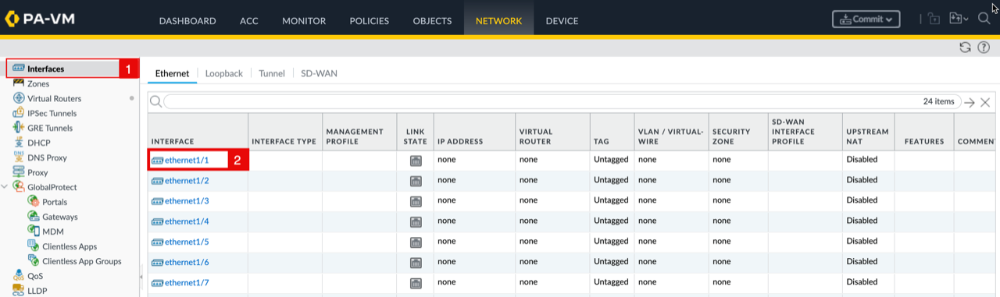

<!-- -->

1. Set the **Interface Type** to Layer3.
2. Click on **Config**.

    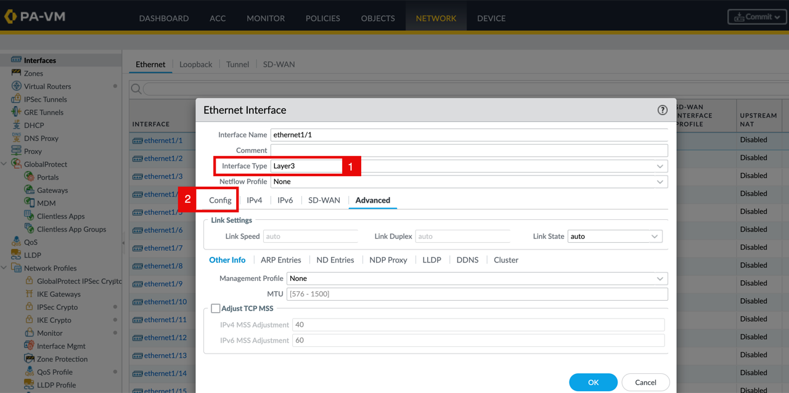

<!-- -->

1. Set the **Virtual Router** to default.
2. Select the **Security Zone**.
3. In the pull down menu select **New Zone** (Untrusted).

    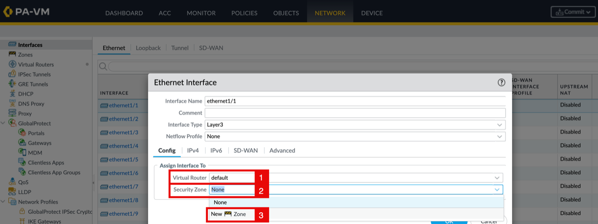

<!-- -->

1. Specify a **name** for the new (Untrusted) zone.
2. Click on the **OK** button.

    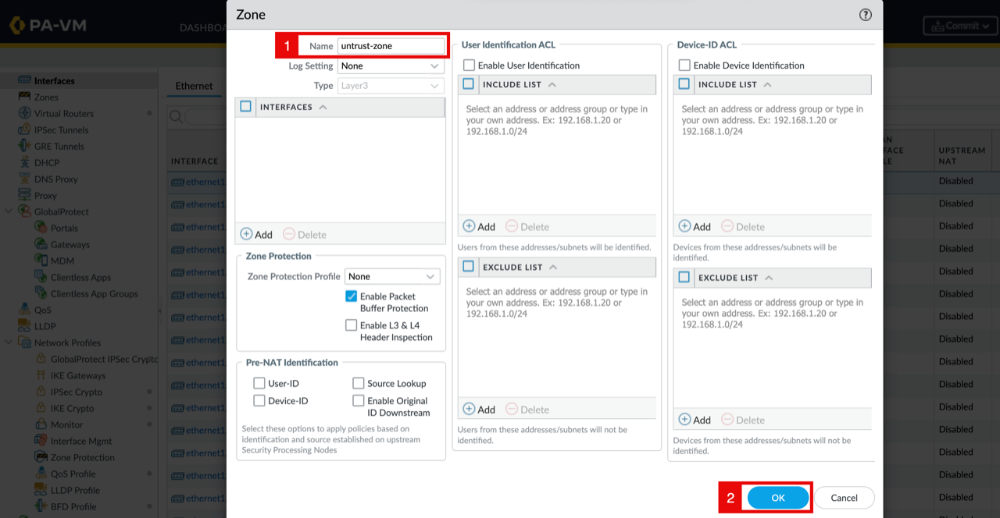

    - Make sure the (new) **Untrusted Zone** is selected for interface ethernet 1/1.

    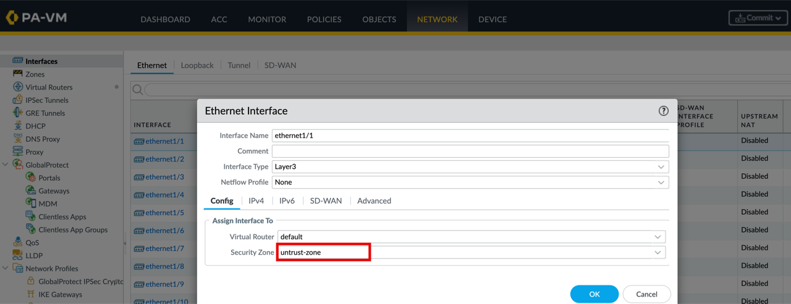

<!-- -->

1. Click on **IPv4** (make sure you **Static** is selected).
2. Click on the **Add** button to add an IP address.
3. Specify an **IP address** for the (Untrusted) interface ethernet 1/1. We have used `172.16.0.20/28` (Make sure this IP is in the same subnet as your Untrusted OCI subnet CIDR block).
4. Click on the **OK** button.

    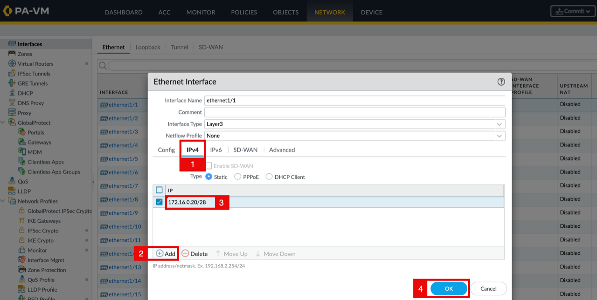

    - Notice that the (Untrusted) interface ethernet 1/1 is now configured.

    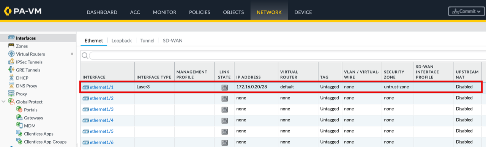

    - Click on interface **ethernet 1/2**.

    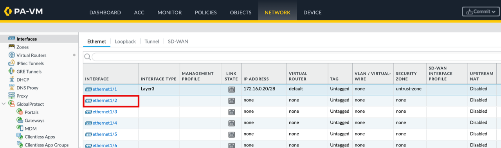

<!-- -->

1. Set the **Interface Type** to Layer3.
2. Click on **Config**.

    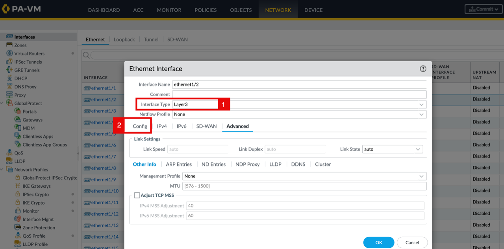

<!-- -->

1. Set the **Virtual Router** to default.
2. Select the **Security Zone**.
3. In the pull down menu select **New Zone** (Trusted).

    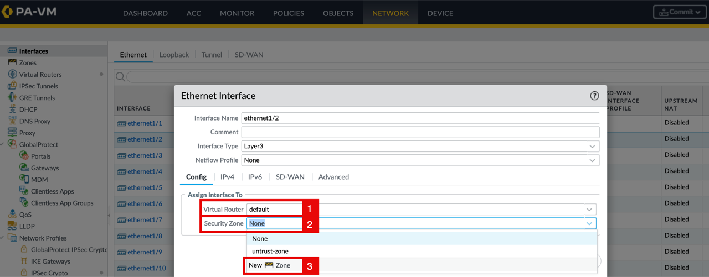

<!-- -->

1. Specify a **name** for the new (Trusted) zone.
2. Click on the **OK** button.

    

    - Make sure the (new) **Trusted Zone** is selected for interface ethernet 1/2.

    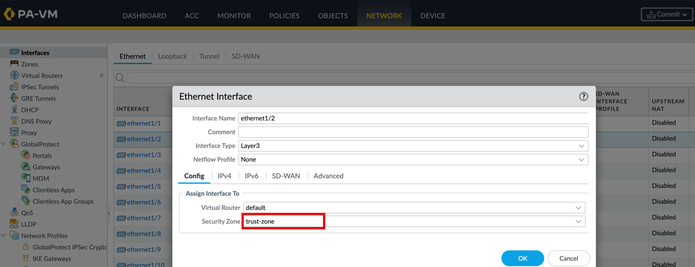

<!-- -->

1. Click on **IPv4** (make sure you **Static** is selected).
2. Click on the **Add** button to add an IP address.
3. Specify an **IP address** for the (Trusted) interface ethernet 1/2. We have used `172.16.0.40/28` (Make sure this IP is in the same subnet as your Trusted OCI subnet CIDR block).
4. Click on the **OK** button.

    

    - Notice that the (Trusted) interface ethernet 1/2 is now configured.

    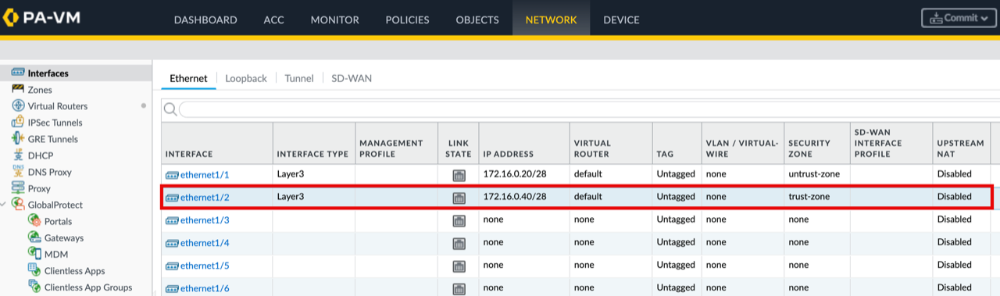

<!-- -->

1. Notice that the **Link state** is grey (and not green).
2. Click on the **Commit** button.

    > **Note:** You can **commit** after each configuration you make (safer, easier to troubleshoot), or you can wait and commit once after completing all steps (faster, fewer commits).

    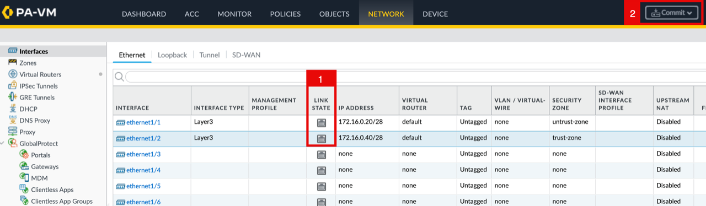

<!-- -->

1. Notice the message that commit will overwrite the running configuration.
2. Click on the **Commit** button.

    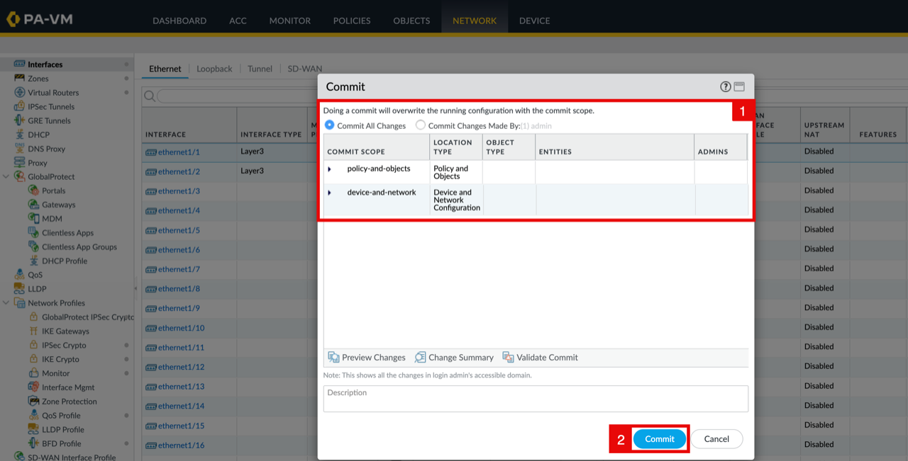

    - Wait for the **Commit** to complete.

    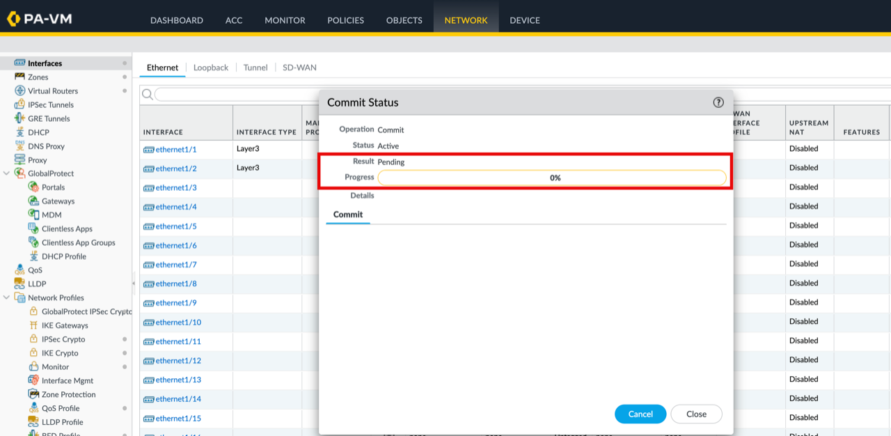

<!-- -->

1. Notice that the **Commit** has completed.
2. Click on the **Close** button.

    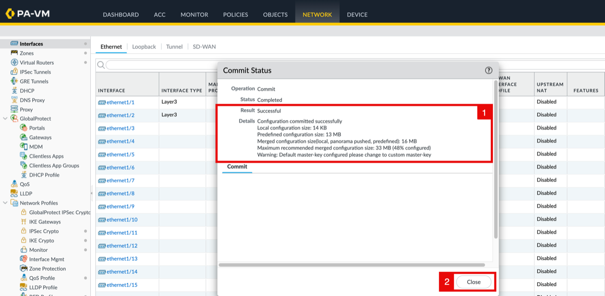

- Notice that the **Link state** is now green out (and not grey anymore).

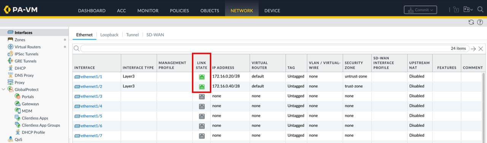

> **Note:** If the link state is still red, reboot the instance from the OCI Console and check again.

## Task 3: Create a Network Security Policy

The firewall interfaces are now in place. Create a security policy that controls which traffic may traverse the standalone firewall.

> **Note:** Palo Alto firewalls include two default read-only security policies: **intrazone-default**, which allows traffic within the same zone, and **interzone-default**, which blocks traffic between zones. Logging is disabled on both by default. For this workshop, create an `allow-all-temp` policy to simplify the later validation steps. In a production deployment, allow only the traffic that you require.

1. Navigate to the **Policies** tab.
2. Click on **Security**.
3. Notice the **default policy rules**.

    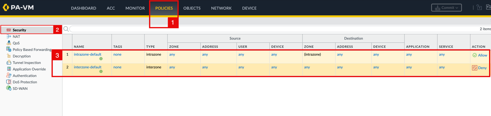

    - Click on the **Add** button.

    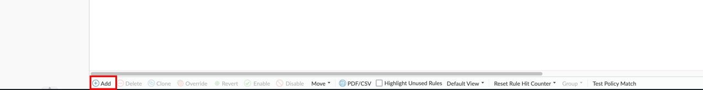

<!-- -->

1. Navigate to the **General** tab.
2. Specify a **name** for the new policy rule.
3. Set the **rule type** to **Universal**.

    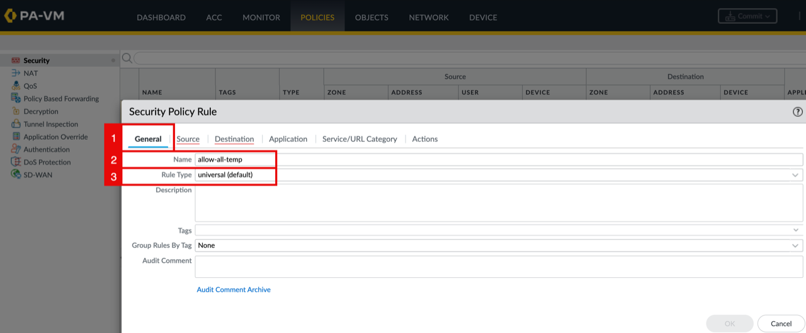

<!-- -->

1. Navigate to the **Source** tab.
2. In the **Source Zone** section, select **Any**.

    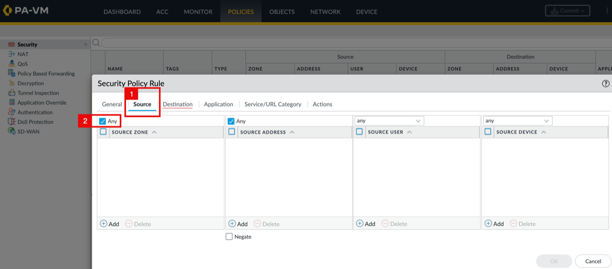

<!-- -->

1. Navigate to the **Destination** tab.
2. In the **Destination Zone** section, select **Any**.

    

<!-- -->

1. Navigate to the **Application** tab.
2. In the **Applications** section, select **Any**.

    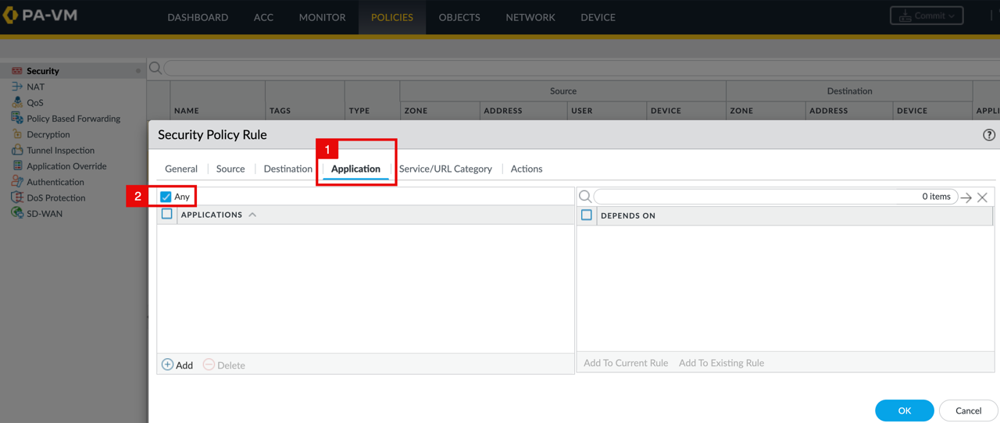

<!-- -->

1. Navigate to the **Service/URL Category** tab.
2. In the **Service** section, select **Any**.

    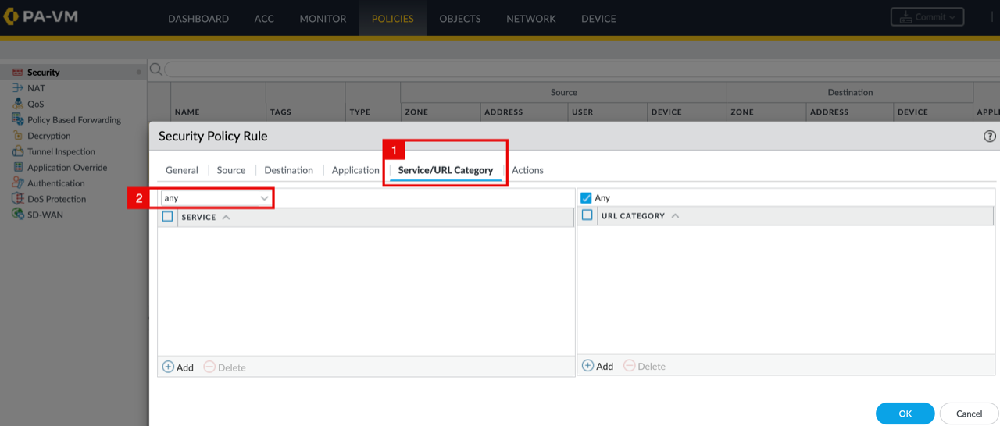

<!-- -->

1. Navigate to the **Actions** tab.
2. In the **Action Settings** section, select **Allow**.
3. In the **Log Settings** section, select **Log at Session End**.
4. Click **OK**.

    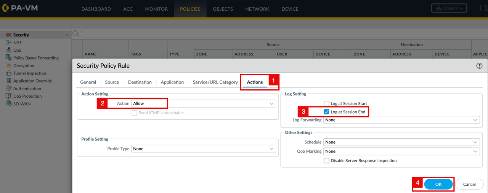

<!-- -->

1. Confirm that the new security policy is listed.
2. Click **Commit**.

    

<!-- -->

1. When warned that the commit overwrites the running configuration.
2. Click **Commit**.

    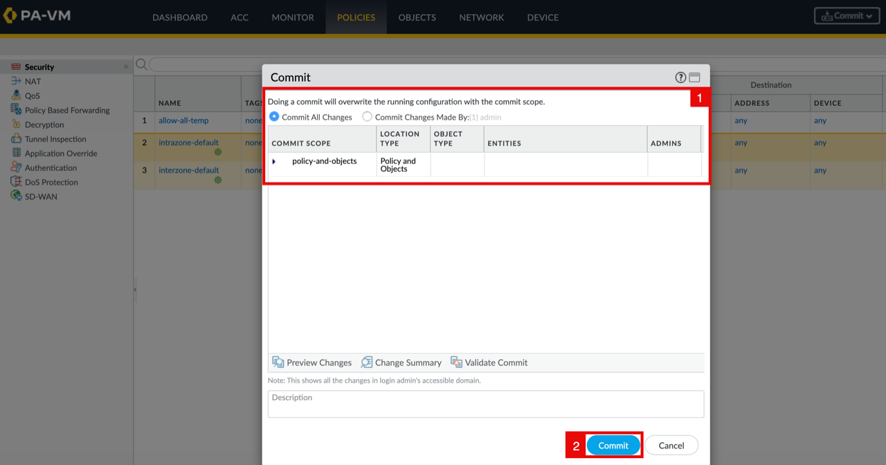

- Wait for the commit to complete.

    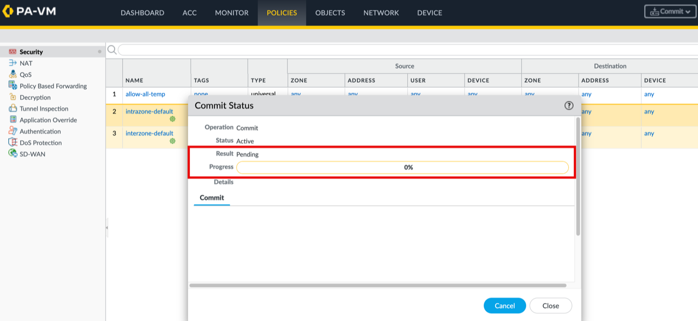

- Confirm that the commit completed successfully.

    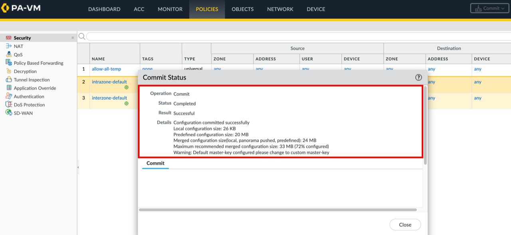

## Learn More

- [Configure Layer 3 Interfaces (PAN-OS)](https://docs.paloaltonetworks.com/ngfw/networking/configure-interfaces/layer-3-interfaces/configure-layer-3-interfaces)
- [Policy Objects](https://docs.paloaltonetworks.com/network-security/security-policy/administration/objects)

## Acknowledgements

- **Authors** - Anas Abdallah, Iwan Hoogendoorn (Cloud Networking Black Belts)
- **Contributor** - Antonio Gámir (Cloud Networking Black Belt)
- **Last Updated By/Date** - Anas Abdallah, August 2026

You may now **proceed to the next lab**.
