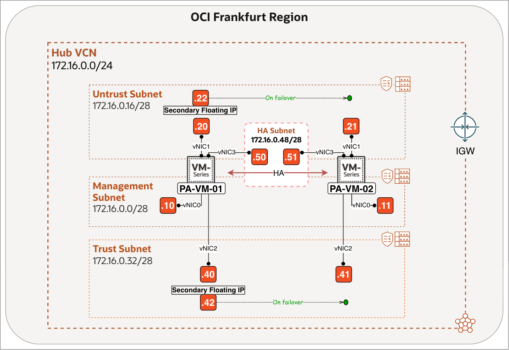

# Introduction

## About this Workshop

This workshop provides a comprehensive, step-by-step guide on deploying a Palo Alto Networks Next-Generation Firewall (NGFW) pair within Oracle Cloud Infrastructure (OCI) configured for an Active/Passive High Availability (HA) architecture.

This configuration is essential for maintaining business continuity and ensuring uninterrupted network security policy enforcement, even during component failure or routine maintenance.

We will focus on the deployment topology that utilizes OCI's Virtual Cloud Network (VCN) features, including multiple Subnets, Route Tables, and secondary IP addresses, which are critical for the seamless failover mechanism between the Active and Passive firewall instances. Upon completion, you will have a resilient, stateful security perimeter protecting your workloads in OCI.

Estimated Workshop Time: 140 minutes

### Objectives

In this workshop, you will:
1. Deploy and initialise two Palo Alto Networks VM-Series firewall instances on OCI.
2. Configure network interfaces and subnets for management, untrusted (public), trusted (private), and High Availability (HA) .
3. Access and implement baseline firewall configuration, including security policies.
4. Implement the necessary HA configuration on both Palo Alto firewall instances, specifically configuring the HA links and setting up the floating/secondary IP address management for transparent failover.
5. Verify the health and synchronization status of the Active and Passive firewall pair, and test the failover mechanism to ensure traffic correctly redirects to the new Active device.

This knowledge will help you design and implement secure OCI network topologies that incorporate third-party firewall appliances, adhering to best practices for segmentation and observability.

### Prerequisites

Before you begin, ensure you have the following:

#### OCI Environment

- An active OCI tenancy with required permissions to create VCNs, subnets, route tables, and compute instances.
- A VCN with at least four subnets (Management, Untrust, Trust, and HA).
- Access to public Internet for the management interface, or a private Bastion host to reach it securely.

> **Note:** If you select the BYOL image, each VM-Series firewall requires outbound internet access to Palo Alto Networks licensing services to activate an authorization code and retrieve its licenses. Offline licensing is supported, but it is not covered in this workshop.

Ensure that each subnet is associated with its own route table and security list, as shown below.

|                   | Route Table     | Security List   |
| ----------------- | --------------- | --------------- |
| Management Subnet | `rt-management` | `sl-management` |
| Untrust Subnet    | `rt-untrust`    | `sl-untrust`    |
| Trust Subnet      | `rt-trust`      | `sl-trust`      |
| HA Subnet         | `rt-ha`         | `sl-ha`         |

#### Palo Alto Resources

- A valid Palo Alto Networks support account (for licensing and activation).
- Access to the Palo Alto Networks VM-Series image in the Oracle Cloud Marketplace.

## Learn More

- [Overview of VCNs and Subnets](https://docs.oracle.com/en-us/iaas/Content/Network/Tasks/Overview_of_VCNs_and_Subnets.htm)
- [Set Up Palo Alto Active/Passive HA (Overview)](https://docs.paloaltonetworks.com/pan-os/11-1/pan-os-admin/high-availability/set-up-activepassive-ha)
- [How to Configure Palo Alto Active/Passive HA on OCI](https://docs.paloaltonetworks.com/vm-series/11-0/vm-series-deployment/set-up-the-vm-series-firewall-on-oracle-cloud-infrastructure/configure-activepassive-ha-on-oci)

## Acknowledgements

- **Authors** - Anas Abdallah, Iwan Hoogendoorn (Cloud Networking Black Belts)
- **Contributor** - Antonio Gámir (Cloud Networking Black Belt)
- **Last Updated By/Date** - Anas Abdallah, August 2026
