# Review VCN Routing & Security (Prerequisites)

## Introduction

An Active/Passive pair needs additional OCI networking resources beyond a standalone firewall. This lab reviews the VCN, subnets, route tables, and security lists that support the HA design before the firewalls are deployed.

Estimated time: 10 minutes

### Objectives

In this lab, you will:
- Verify the OCI VCN, subnet, routing, and security prerequisites for Active/Passive HA.
- Review the routing and security configuration for the management, untrust, trust, and HA subnets.

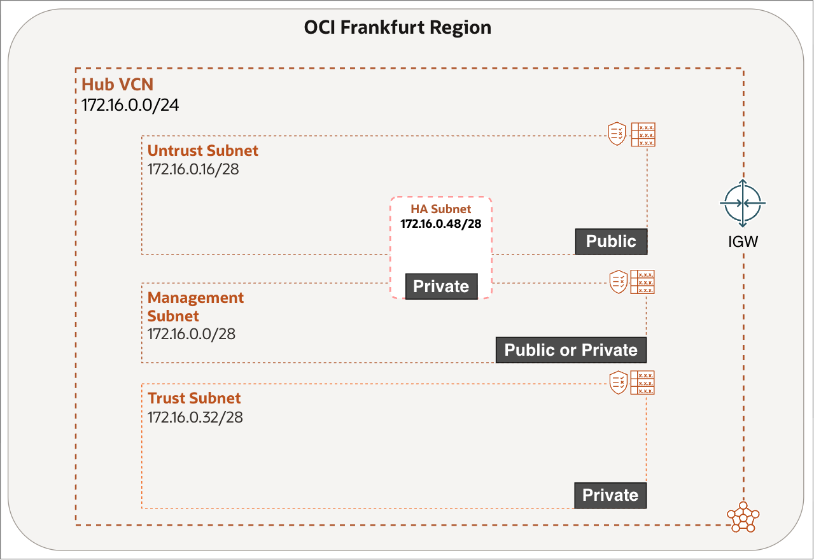

### Prerequisites

No prerequisite lab is required. Complete Lab 0 if you want to deploy the required VCN networking components using Terraform; otherwise, deploy them manually in this lab.

## Task 1: Review VCN Routing

Review the VCN route tables to confirm that the management and untrust subnets can reach the internet through the Internet Gateway.

1. Select the **OCI Region** you want to deploy the Firewall in.
2. Click on the **hamburger menu** in the top left corner.

    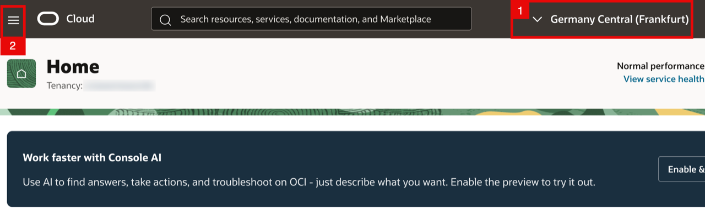

<!-- -->

1. Click on **Networking**.
2. Click on **Virtual cloud networks**.

    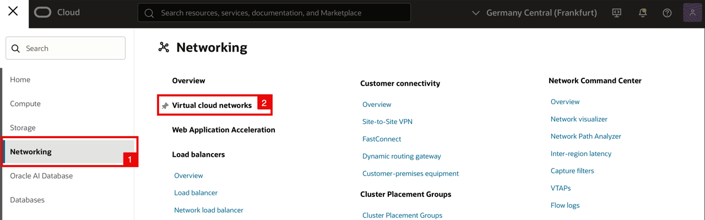

    - Make sure the VCN is created as part of your prerequisites.
    - Click on the **VCN**.

    

<!-- -->

1. Click on **Subnets**.
2. Make sure the Subnets are created and that each one has its own custom Route Table and Security List assigned as part of your prerequisites.

    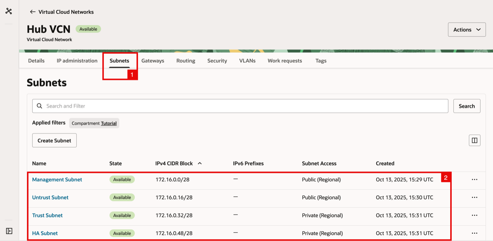

<!-- -->

1. Click on **Gateways**.
2. Make sure the Internet Gateway is created as part of your prerequisites.

    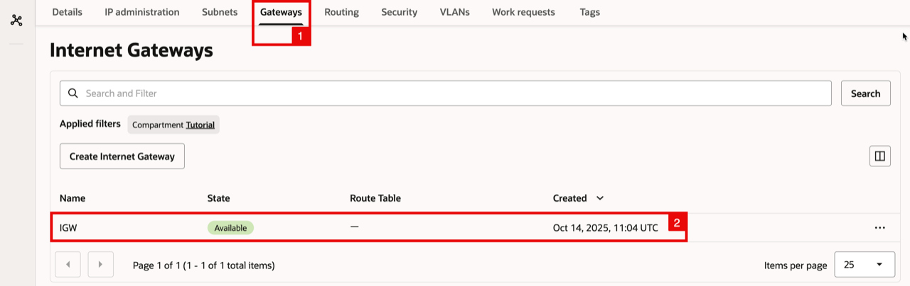

<!-- -->

1. Click on **Routing**.
2. The default VCN Routing Table will be available (we will not be using this).
3. Make sure the custom Routing Tables are created as part of your prerequisites.

    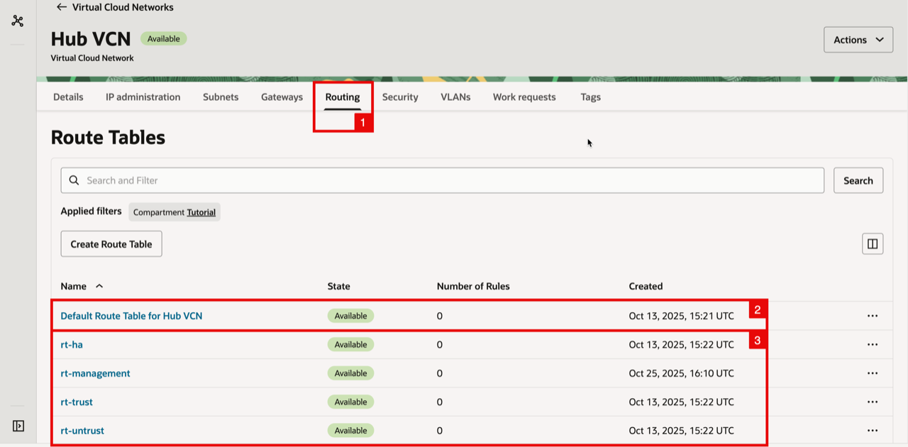

    - Click on the **rt-management** **Routing Table**.

    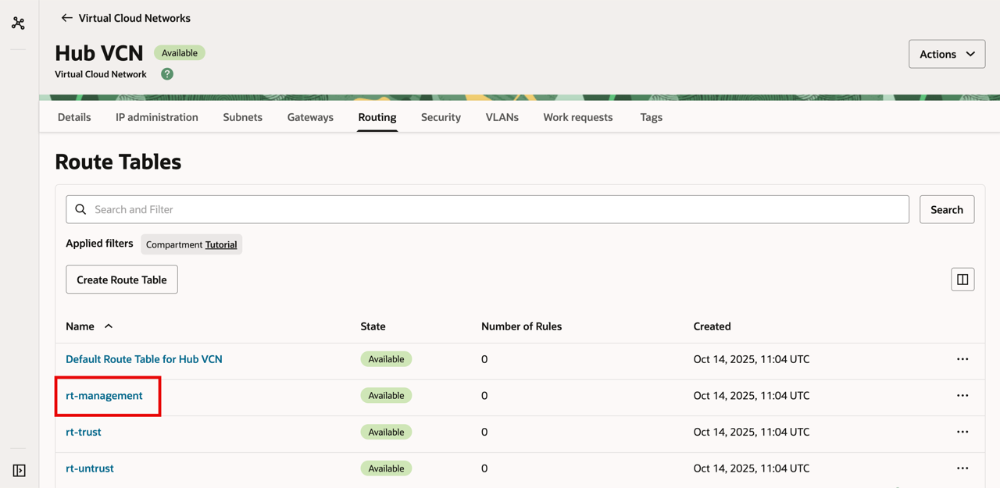

<!-- -->

1. Click on the **Route Rules**.
2. Make sure you have the following route rule configured:

    | Destination | Target Type      | Target | Route Type |
    | ----------- | ---------------- | ------ | ---------- |
    | 0.0.0.0/0   | Internet Gateway | IGW    | Static     |

3. Go Back to the Hub VCN overview.

    

    - Click on the **rt-untrust** **Routing Table**.

    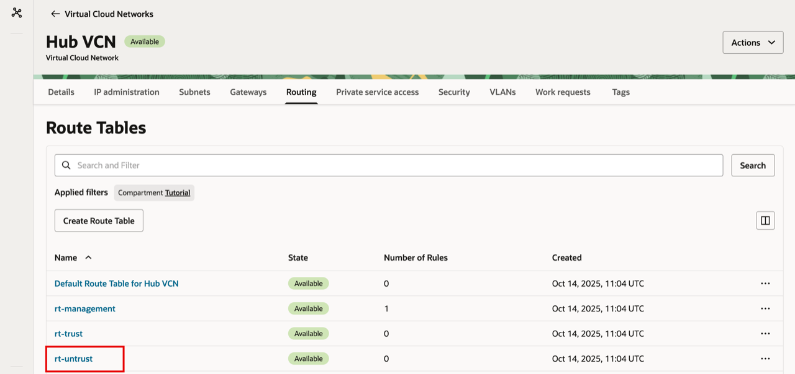

<!-- -->

1. Click on the **Route Rules**.
2. Make sure you have the following route rule configured:

    | Destination | Target Type      | Target | Route Type |
    | ----------- | ---------------- | ------ | ---------- |
    | 0.0.0.0/0   | Internet Gateway | IGW    | Static     |

3. Go Back to the Hub VCN overview.

    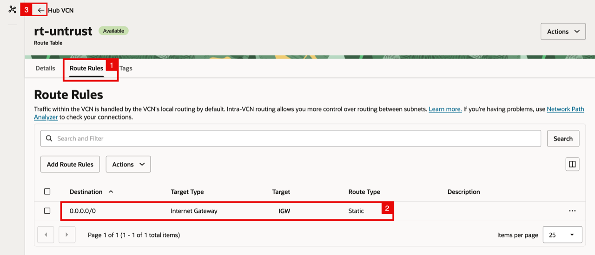

## Task 2: Review VCN Security

Review the security lists to confirm management access, high-availability communication, and the required trust and untrust traffic are allowed.

1. Click on **Security**.
2. Notice the **default VCN Security List** will be available (we will not be using this).
3. Make sure the **custom Security Lists** are created as part of your prerequisites.

    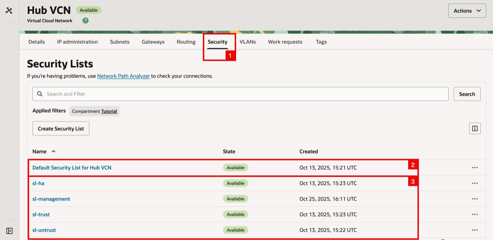

    - Click on the **sl-ha Security List** (for the HA Subnet).

    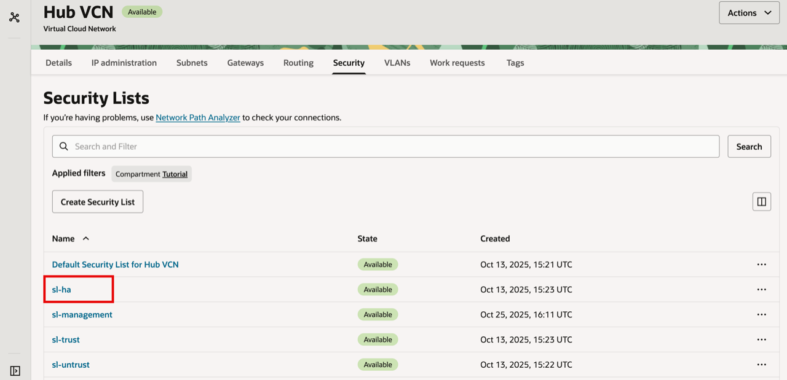

    - Click on **Security Rules**.

    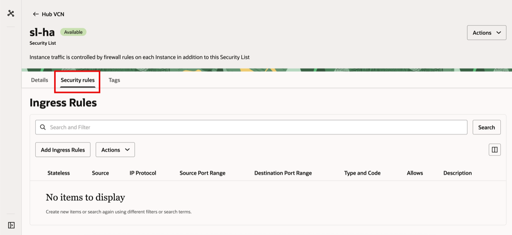

    - Make sure you add in an **Ingress rule** to allow traffic from source (`172.16.0.48/28`) for `All Protocols` (HA Requirements).

    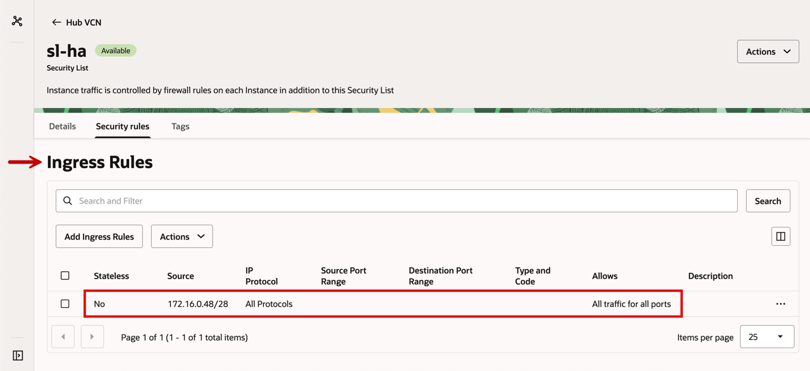

    - Scroll down for the **Egress rules**.
    - Make sure you add in an **Egress rule** to allow traffic to (`172.16.0.48/28`) for `All Protocols` (HA Requirements).

    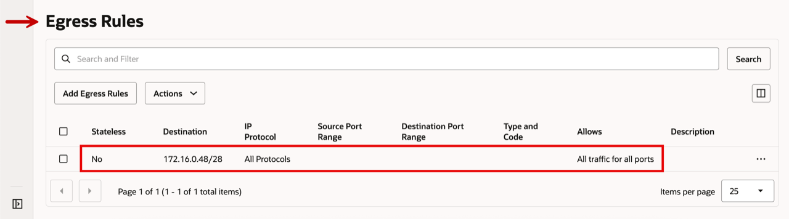

    - Go back to the **Security List Overview**.

    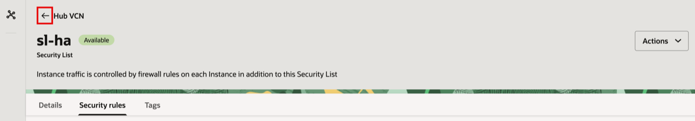

    - Click on the **sl-management Security List** (for the Management Subnet).

    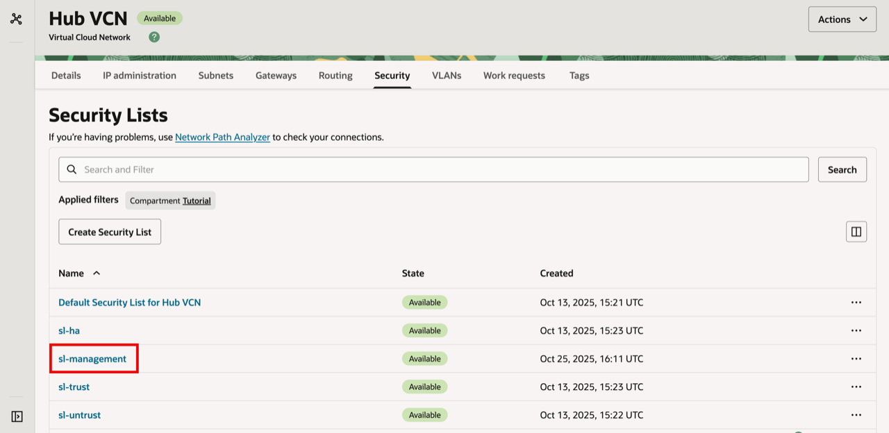

    - Click on **Security rules**.

    

<!-- -->

1. Make sure to add in an **Ingress rule** to allow traffic from all sources (`0.0.0.0/0`) to port `TCP/22` (SSH).
2. Make sure to add in an **Ingress rule** to allow traffic from all sources (`0.0.0.0/0`) to port `TCP/443` (HTTPS).
3. Make sure to add in an **Ingress rule** to allow traffic from source (`172.16.0.0/28`) to port `TCP/28260` and `TCP/28769`  (HA Requirements).
4. Make sure to add in an **Ingress rule** to allow traffic from source (`172.16.0.0/28`) to `ICMP` Type Code `8`  (HA Requirements).
5. Optional: IF encryption is enabled on your VM-Series firewall for the HA1 link, add an additional **Ingress rule** to allow traffic from source (`172.16.0.0/28`) to `TCP/28`.

> **Note:** Opening SSH/HTTPS to `0.0.0.0/0` is not a best practice. For better security, restrict access to your own public IP or another trusted range.

- Scroll down for the **Egress rules**.
- Make sure you add in an **Egress rule** to allow traffic to all destinations (`0.0.0.0/0`) for `All Protocols`.

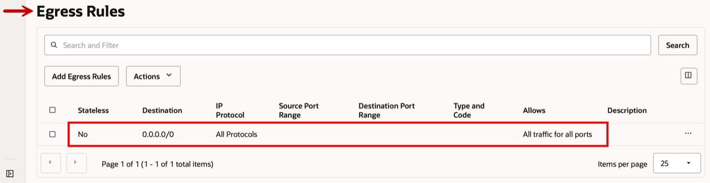

- Go back to the **Security List Overview**.

- Click on the **sl-trust Security List** (for the Trusted Subnet).

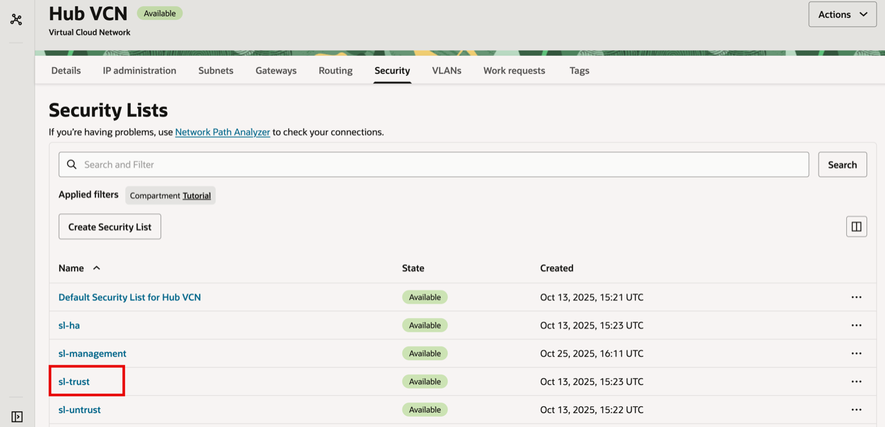

- Click on **Security Rules**.

- Make sure you add in an **Ingress rule** to allow traffic from all sources (`0.0.0.0/0`) for `All Protocols`.

> **Note:** Allowing **All Protocols (Ingress)** from `0.0.0.0/0` is not a best practice. We are only doing it here only for simplicity and to avoid extra troubleshooting as we move into the later workshops in this series. In real deployments, allow only what you actually need.

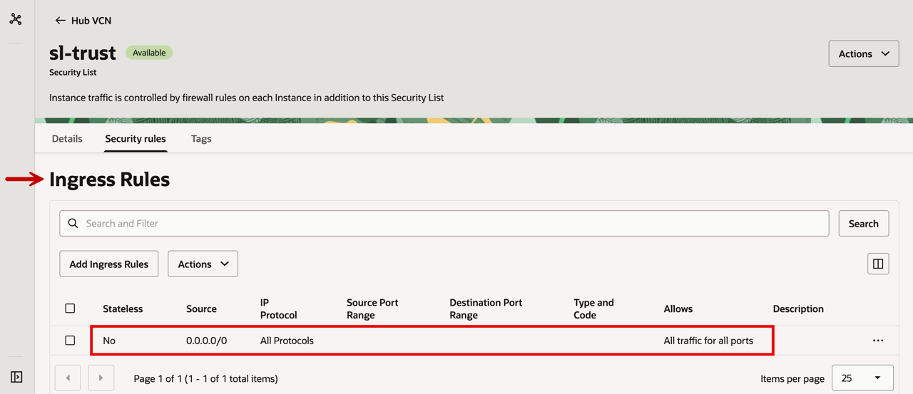

- Scroll down for the **Egress rules**.
- Make sure you add in an **Egress rule** to allow traffic from all sources (`0.0.0.0/0`) for `All Protocols`.

- Go back to the **Security List Overview**.

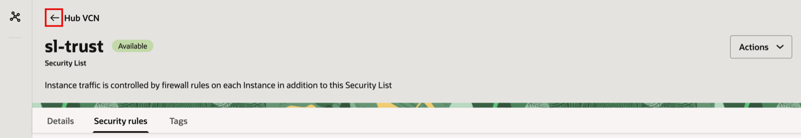

- Click on the **sl-untrust Security List** (for the Untrusted Subnet).

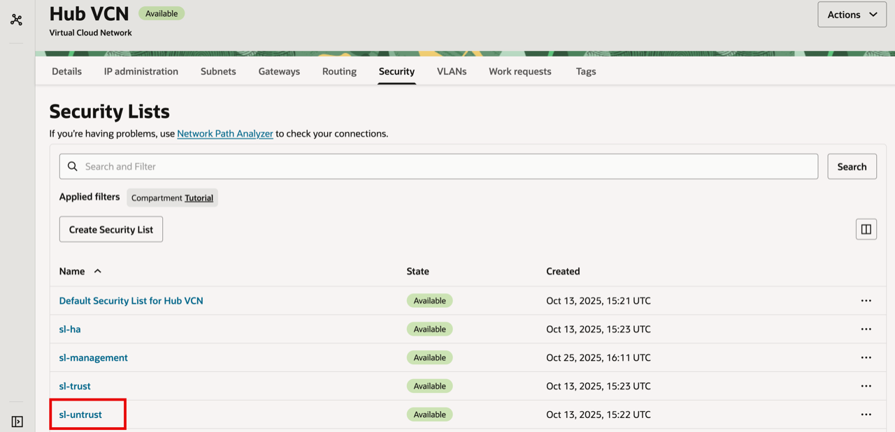

- Click on **Security Rules**.

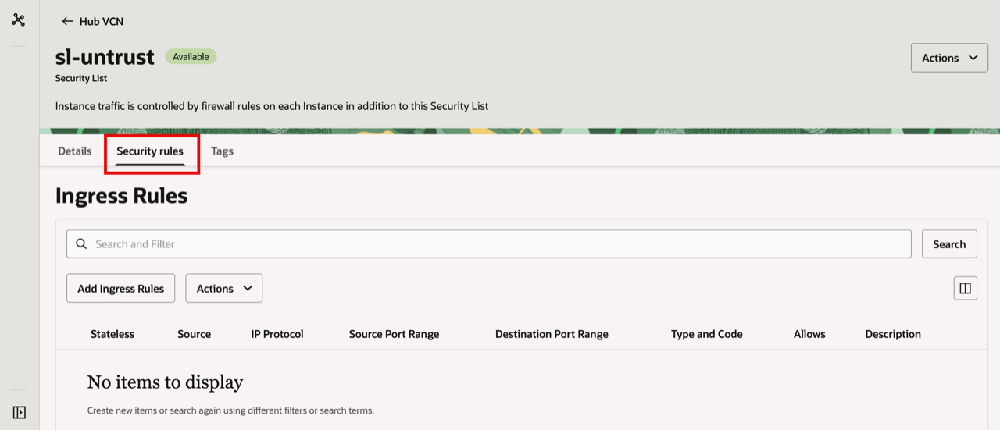

- Make sure you add in an **Ingress rule** to allow traffic from all sources (`0.0.0.0/0`) for `All Protocols`.

> **Note:** Allowing **All Protocols (Ingress)** from `0.0.0.0/0` is not a best practice. We are only doing it here only for simplicity and to avoid extra troubleshooting as we move into the later workshops in this series. In real deployments, allow only what you actually need.

- Scroll down for the **Egress rules**.
- Make sure you add in an **Egress rule** to allow traffic to all destinations (`0.0.0.0/0`) for `All Protocols`.

## Learn More

- [VCN and Subnet Management](https://docs.oracle.com/en-us/iaas/Content/Network/Tasks/managingVCNs.htm)
- [VCN Route Tables](https://docs.oracle.com/en-us/iaas/Content/Network/Tasks/managingroutetables.htm)
- [Security Lists](https://docs.oracle.com/en-us/iaas/Content/Network/Concepts/securitylists.htm)
- [How to Configure Palo Alto Active/Passive HA on OCI](https://docs.paloaltonetworks.com/vm-series/11-0/vm-series-deployment/set-up-the-vm-series-firewall-on-oracle-cloud-infrastructure/configure-activepassive-ha-on-oci)

## Acknowledgements

- **Authors** - Anas Abdallah, Iwan Hoogendoorn (Cloud Networking Black Belts)
- **Contributor** - Antonio Gámir (Cloud Networking Black Belt)
- **Last Updated By/Date** - Anas Abdallah, August 2026

You may now **proceed to the next lab**.
