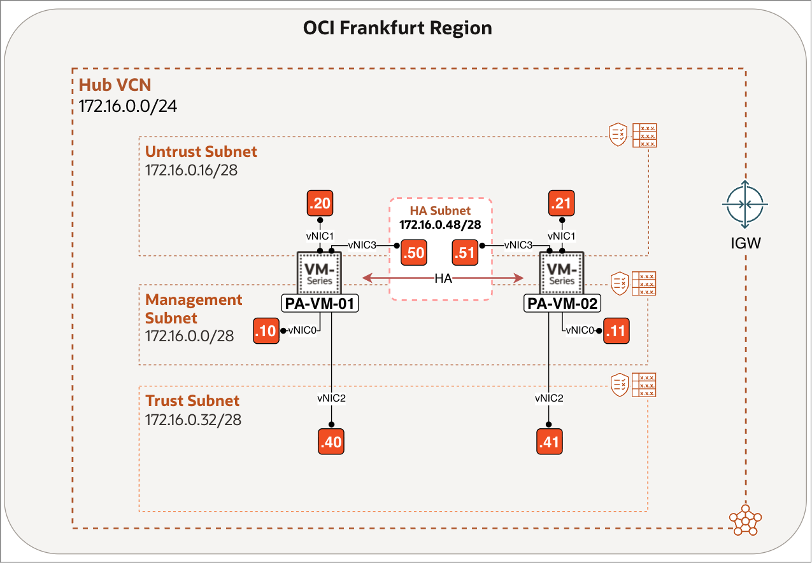
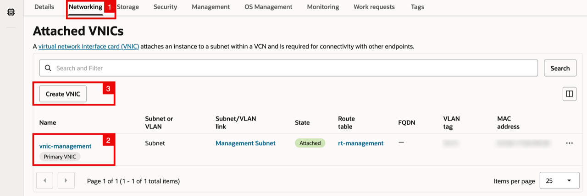
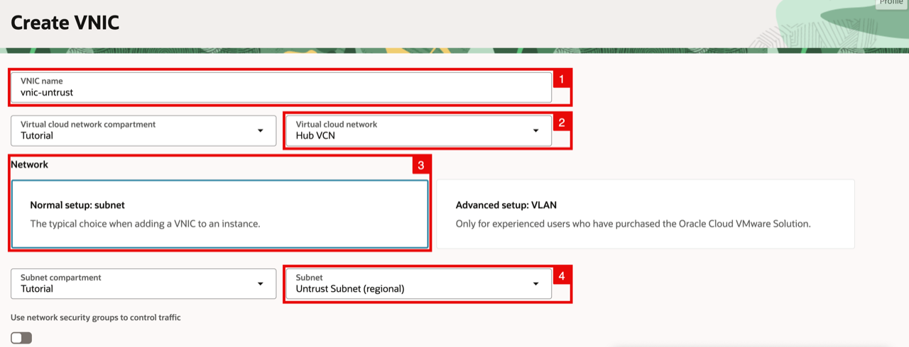
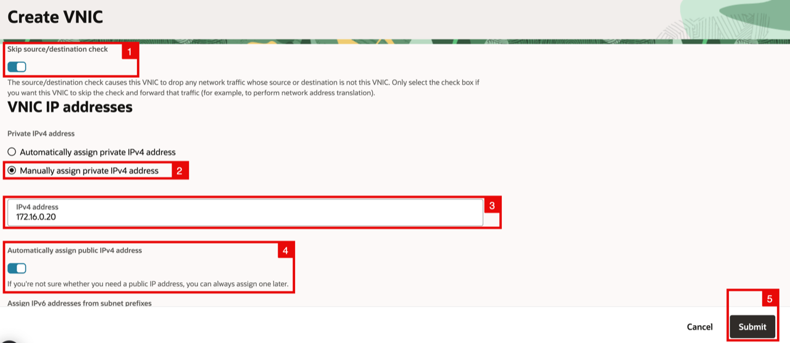
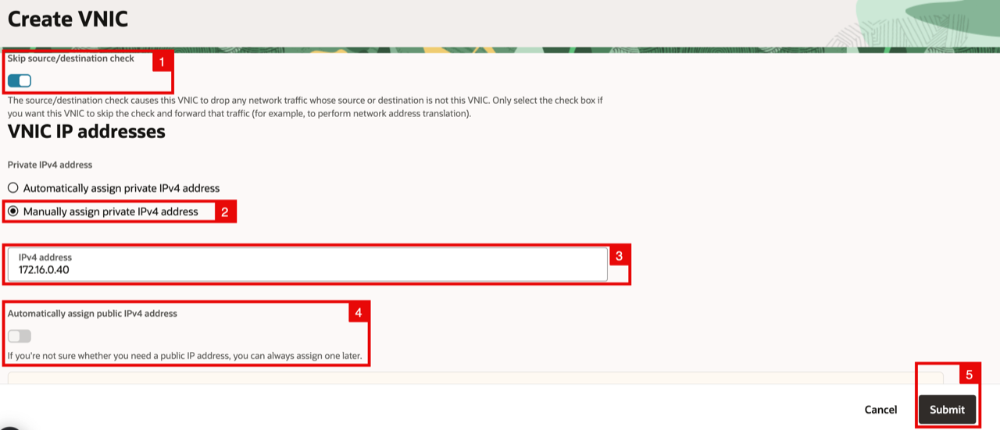
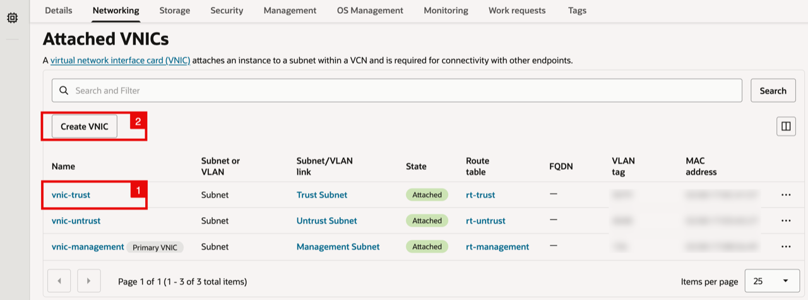
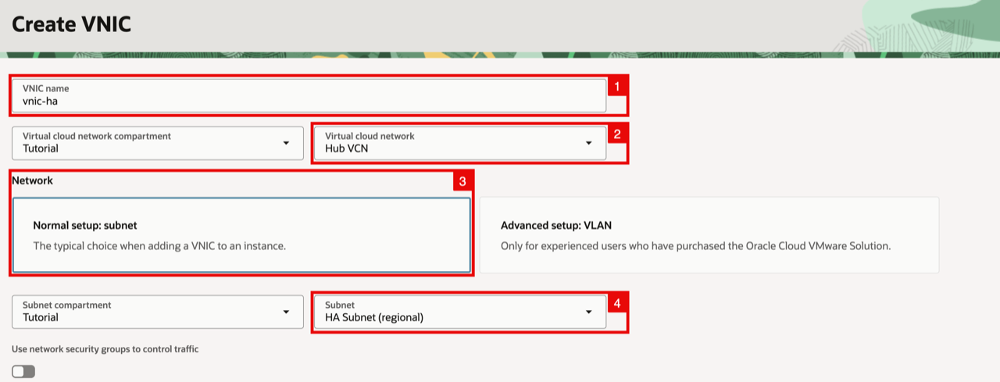
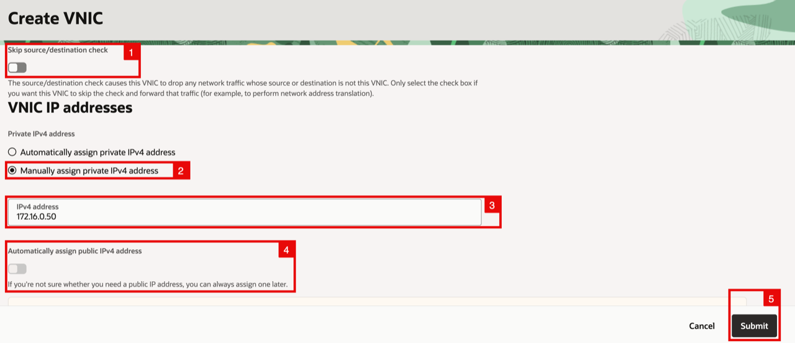
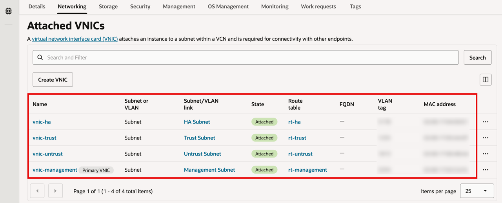

# Create HA and Data VNICs (Trust and Untrust)

## Introduction

When you launch the two Palo Alto VM-Series instances from Oracle Cloud Marketplace, each instance initially has only a management VNIC. That interface is used to administer PAN-OS and carry HA1 control communication; it does not carry the workload traffic that the firewall must inspect.

This lab focuses on the OCI side of the Active/Passive deployment, where you attach trust, untrust, and HA VNICs to both firewall instances. The trust VNIC connects the active firewall to private workloads, while the untrust VNIC connects it to the public network. The dedicated HA VNIC carries HA2 session synchronization between the peers so the passive firewall can take over with the required state during failover. Together, these VNICs prepare the pair for traffic inspection, stateful failover, and the floating-address configuration in the next lab.

Estimated time: 10 minutes

### Objectives

In this lab, you will create the HA, trust, and untrust VNICs in the OCI Console.

### Prerequisites

Before you begin, ensure you have completed the preceding required labs in this workshop.

Begin with **PA-VM-01** (Tasks 1-3), then repeat for **PA-VM-02** (Task 4).

## Task 1: Create Untrust VNIC

Create its untrust VNIC and assign it the private IPv4 address `172.16.0.20`. This is the firewall’s outside-facing interface, used to receive traffic from and send traffic back to external networks.

1. Within the Compute Instance (PA-VM-01) page, click on the **Networking** tab (Scroll down to the Attached VNICs section).
2. Rename **management interface** to be vnic-management (if this is not already done).
3. Click on the **Create VNIC** button (to create the untrusted VNIC).

    

<!-- -->

1. Specify the **name** for the untrusted VNIC.
2. Select your **VCN**.
3. Make sure the **Network** subnet is set to Normal.
4. Select the **Untrust Subnet**.

    - Scroll down.

    

<!-- -->

1. Enable **Skip source/destination check**.
2. For the **Private IPv4 address** select **Manually assign private IPv4 address**.
3. Specify an **IP address** (`172.16.0.20`).
4. Disable **Automatically assign public IPv4 address**.
5. Click on the **Submit** button.

    

## Task 2: Create Trust VNIC

Create the trust VNIC for **PA-VM-01** and assign it the private IPv4 address `172.16.0.40`. This is the firewall’s inside-facing interface, used to forward permitted traffic to private applications and workloads.

1. Notice the new untrusted VNIC has been added.
2. Click on the **Create VNIC** button (to create the trusted VNIC).

    

<!-- -->

1. Specify the **name** for the trusted VNIC.
2. Select your **VCN**.
3. Make sure the **Network** subnet is set to Normal.
4. Select the **Trust Subnet**.

    - Scroll down.

    

<!-- -->

1. Enable **Skip source/destination check**.
2. For the **Private IPv4 address** select **Manually assign private IPv4 address**.
3. Specify an **IP address** (`172.16.0.40`).
4. **Automatically assign public IPv4 address** will be disabled by default as this is a private subnet.
5. Click on the **Submit** button.

    

## Task 3: Create HA VNIC

Create the dedicated HA VNIC on PA-VM-01 for communication between the firewall peers. This is a private link between the two firewalls that keeps their active sessions synchronized for failover.

1. Notice the new trusted VNIC has been added.
2. Click on the **Create VNIC** button (to create the HA VNIC).

    

<!-- -->

1. Specify the **name** for the HA VNIC.
2. Select your **VCN**.
3. Make sure the **Network** subnet is set to Normal.
4. Select the HA **Subnet**.

    - Scroll down.

    

<!-- -->

1. Disable **Skip source/destination check**.
2. For the **Private IPv4 address** select **Manually assign private IPv4 address**.
3. Specify an **IP address** (`172.16.0.50`).
4. **Automatically assign public IPv4 address** will be disabled by default as this is a private subnet.
5. Click on the **Submit** button.

    

    - Notice the new HA VNIC has been added, and the other VNICs (management, untrusted, and trusted) are also present, and ready to be used by the instance.

    

## Task 4: Create VNICs for PA-VM-02

Repeat Tasks 1 through 3 for **PA-VM-02**, creating the untrust, trust, and HA VNICs with the following private IPv4 addresses.

| VNIC    | Private IPv4 address | Public IPv4 address |
| ------- | -------------------- | ------------------- |
| Untrust | `172.16.0.21`        | No                  |
| Trust   | `172.16.0.41`        | No                  |
| HA      | `172.16.0.51`        | No                  |

> **Note:** No public IPv4 address is assigned to the Untrust VNIC at this stage. In the next lab, you assign a reserved public IP to the floating secondary private IP on the active firewall's Untrust VNIC, so that public address can move during failover.

## Learn More

- [OCI Virtual Network Interface Cards (VNICs)](https://docs.oracle.com/en-us/iaas/Content/Network/Tasks/managingVNICs.htm)
- [Creating and Attaching a Secondary VNIC](https://docs.oracle.com/en-us/iaas/Content/Network/Tasks/managingvnics_tasks-attach.htm)
- [How to Configure Palo Alto Active/Passive HA on OCI](https://docs.paloaltonetworks.com/vm-series/11-0/vm-series-deployment/set-up-the-vm-series-firewall-on-oracle-cloud-infrastructure/configure-activepassive-ha-on-oci)

## Acknowledgements

- **Authors** - Anas Abdallah, Iwan Hoogendoorn (Cloud Networking Black Belts)
- **Contributor** - Antonio Gámir (Cloud Networking Black Belt)
- **Last Updated By/Date** - Anas Abdallah, August 2026

You may now **proceed to the next lab**.
