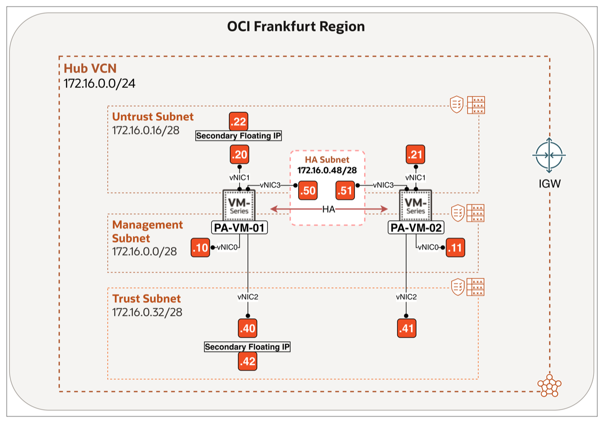
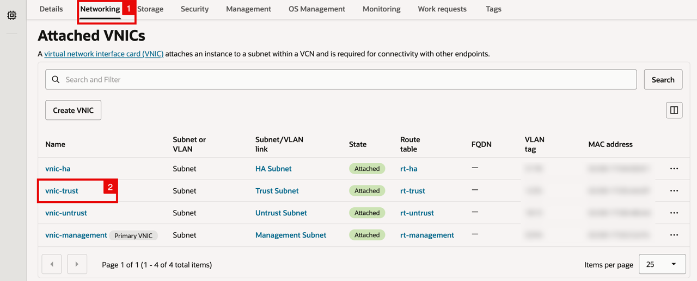
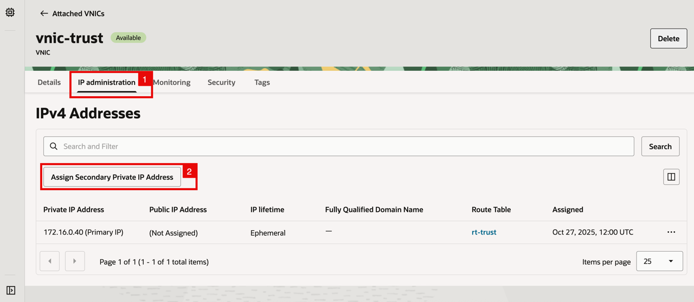
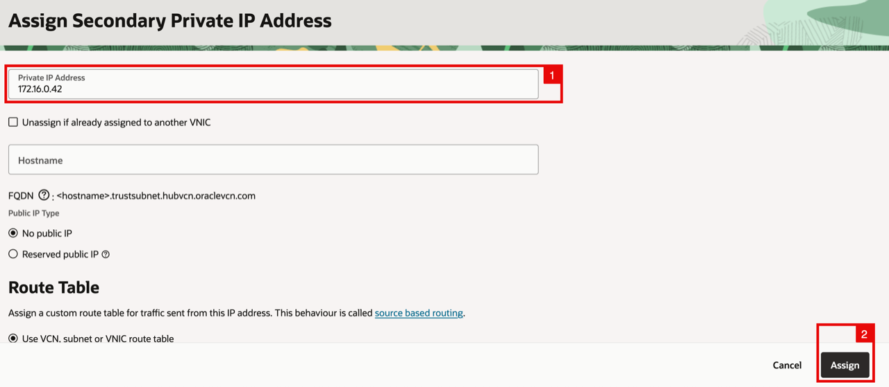
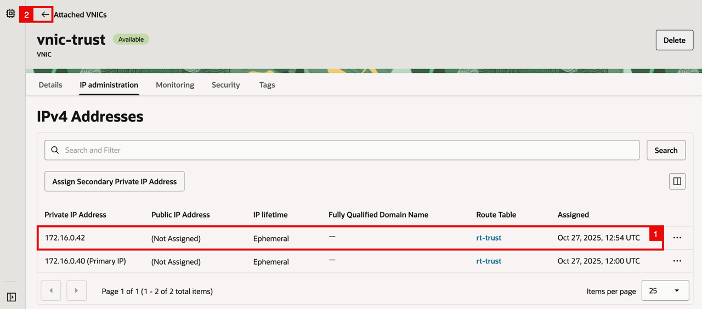
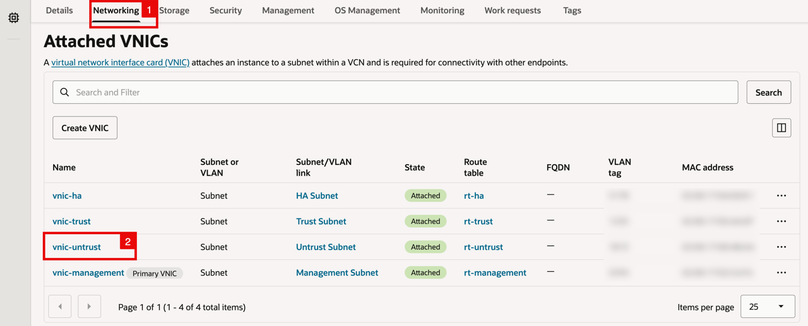
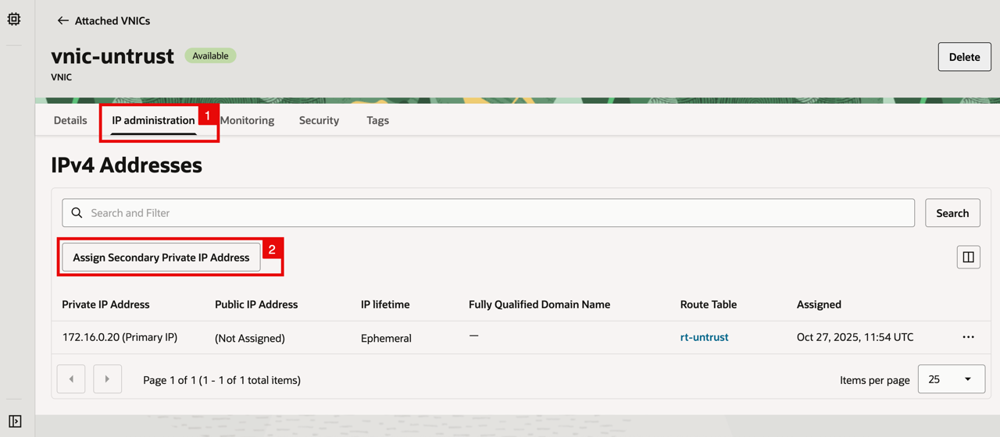
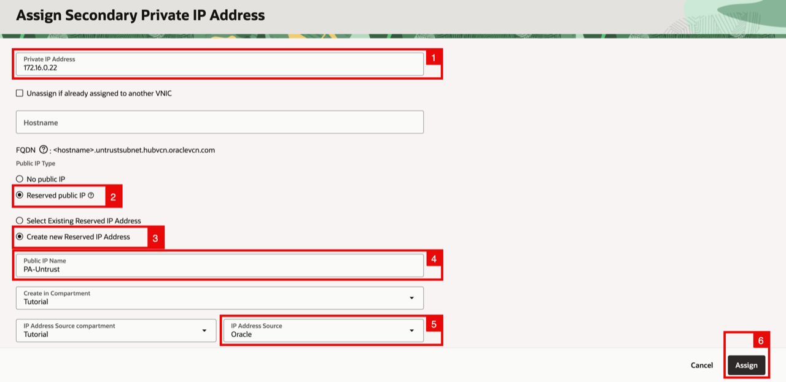
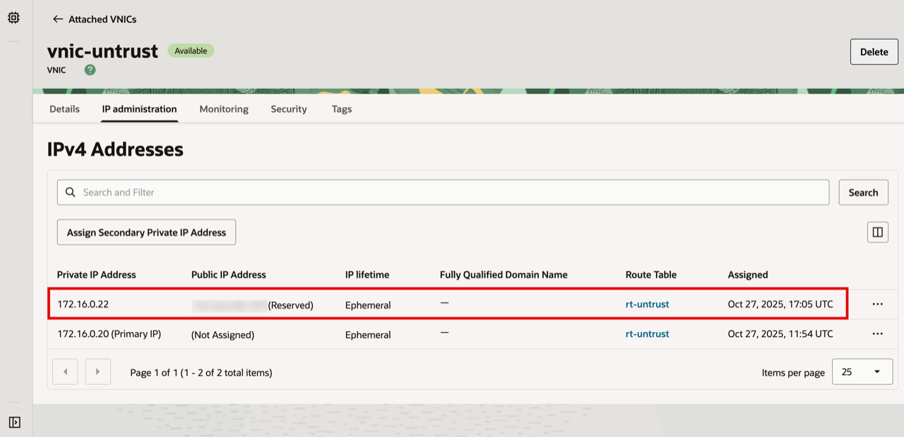

# Add Secondary (Floating) IP addresses to Data VNICs

## Introduction

Active/Passive failover relies on secondary private addresses that can move between peers. This lab assigns the floating trust and untrust IP addresses used by the active firewall.

Estimated time: 5 minutes

### Objectives

In this lab, you will assign secondary floating IP addresses to the trust and untrust data VNICs.

### Prerequisites

Before you begin, ensure you have completed the preceding required labs in this workshop.

Complete both tasks on **PA-VM-01** only. This is the primary firewall for the initial deployment.

## Task 1: Add Secondary (Floating) IP addresses to Trust VNIC

Assign the floating private address that the active firewall uses for trusted workloads traffic.

1. Within the Compute Instance (PA-VM-01) page, click on the **Networking** tab (Scroll down to the Attached VNICs section).
2. Select the **trust VNIC**.

    

<!-- -->

1. Click on the **IP Administration** tab.
2. Click on the **Assign Secondary Private IP Address** button.

    

<!-- -->

1. Specify an **IP address** (`172.16.0.42`). Leave the other settings default.
2. Click on the **Assign** button.

    

<!-- -->

1. Notice that the new (secondary) IP address (`172.16.0.42`) is now configured on the Trusted VNIC.
2. Click on the **back** button.

    

## Task 2: Add Secondary (Floating) IP addresses to Untrust VNIC

Assign the floating private address and its reserved public IP for internet-facing traffic.

1. Click on the **Networking** tab (Scroll down to the Attached VNICs section).
2. Select the **untrust VNIC**.

    

<!-- -->

1. Click on the **IP Administration** tab.
2. Click on the **Assign Secondary Private IP Address** button.

    

<!-- -->

1. Specify an **IP address** (`172.16.0.22`).
2. Select the **Reserved public IP** option.
3. Select the **Create new Reserved IP Address** option.
4. Provide a **Name**.
5. Select the **IP Address Source** to be Oracle.
6. Click on the **Assign** button.

    

    - Notice that the new (secondary) IP address (`172.16.0.22`) is now configured on the Untrusted VNIC.

    

## Learn More

- [Assigning a New Secondary Private IP to a VNIC](https://docs.oracle.com/en-us/iaas/Content/Network/Tasks/private-ip-create.htm)
- [How to Configure Palo Alto Active/Passive HA on OCI](https://docs.paloaltonetworks.com/vm-series/11-0/vm-series-deployment/set-up-the-vm-series-firewall-on-oracle-cloud-infrastructure/configure-activepassive-ha-on-oci)

## Acknowledgements

- **Authors** - Anas Abdallah, Iwan Hoogendoorn (Cloud Networking Black Belts)
- **Contributor** - Antonio Gámir (Cloud Networking Black Belt)
- **Last Updated By/Date** - Anas Abdallah, August 2026

You may now **proceed to the next lab**.
