# Setup Identity and Access Management (IAM) Components

## Introduction

During a failover, the firewall that becomes active must make OCI-side changes so traffic continues to reach it. These changes include moving the floating private IP addresses between the firewall peers and managing the related network resources. OCI does not allow Compute instances to perform these actions by default.

This lab authorizes that automation securely. You create an Identity and Access Management (IAM) dynamic group that identifies both firewall instances, then create an IAM policy that grants the group only the network and compute permissions required for HA operations. This allows the firewall pair to complete failover without user credentials or broad administrator access.

Estimated time: 10 minutes

### Objectives

In this lab, you will:
- Create the IAM dynamic group for the Active/Passive firewall instances.
- Create the IAM policies required to manage the HA-related OCI resources.

### Prerequisites

Before you begin, ensure you have completed the preceding required labs in this workshop.

## Task 1: Create the Dynamic Group

- To create the Dynamic Group, in the OCI console:

1. Click on the main menu.
2. Select **Identity & Security**.
3. Under Identity, select **Domains**.

    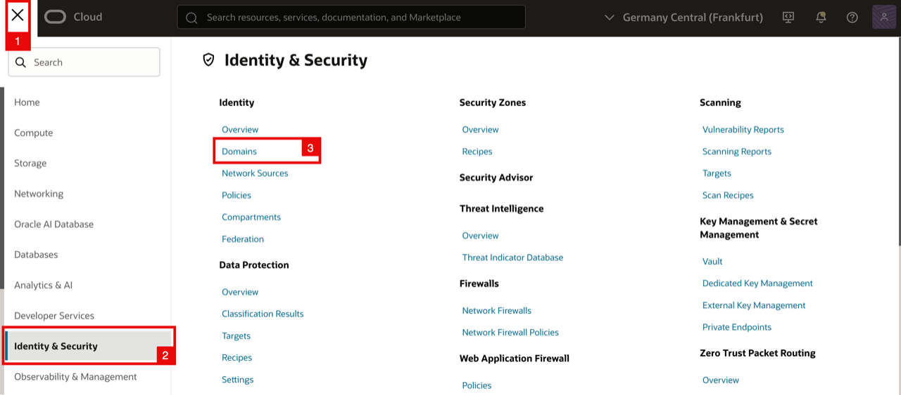

    - Change the compartment to the root compartment
    - Click on **OracleIdentityCloudService** (or the identity domain you are using).

    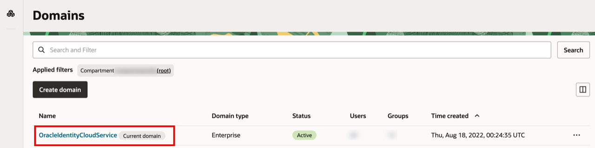

<!-- -->

1. Click on the **Dynamic groups** tab.
2. Click on the **Create dynamic group** button.

    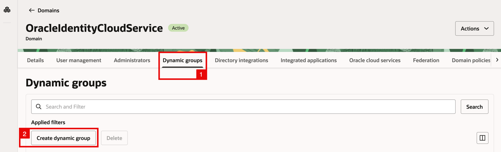

<!-- -->

1. Specify the **name** for the dynamic group.
2. Specify the **description** for the dynamic group.

    - Scroll down.

    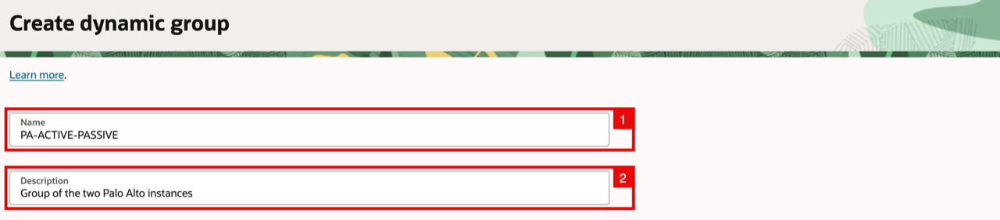

    - Click on the **Rule builder** button.

    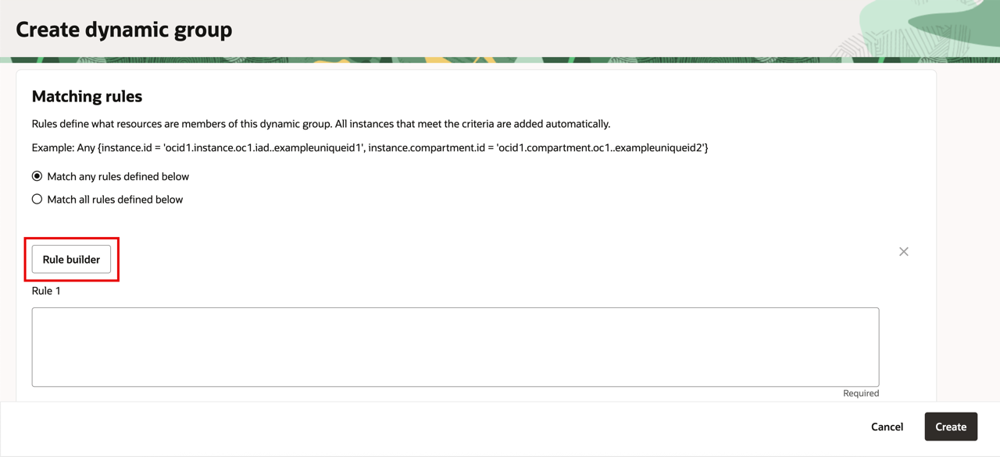

<!-- -->

1. Select **Any of the following instances** to match.
2. Match the Instance OCID with the PA-VM-01.
3. Match the Instance OCID with the PA-VM-02.
4. Click on the **Add rule** button.

    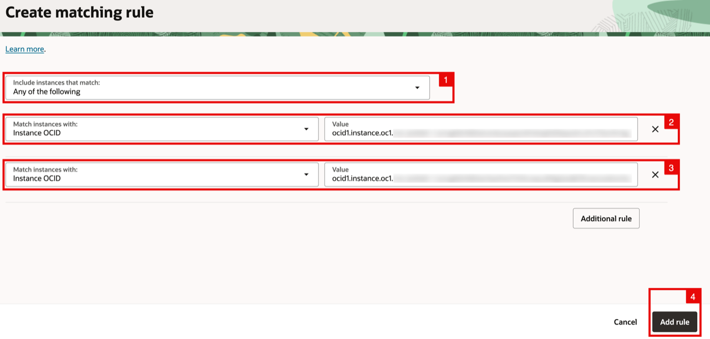

    - Click on the **Create** button.

    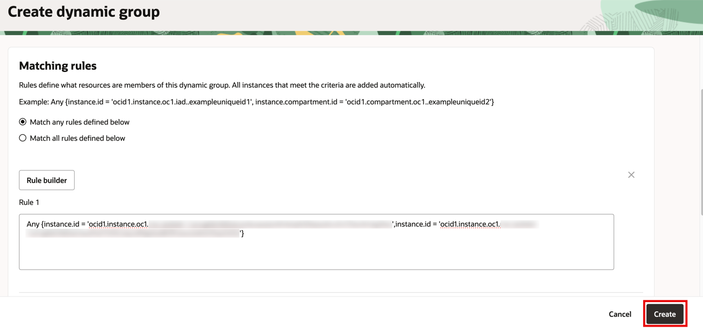

    - Notice the **dynamic group** has been created.

    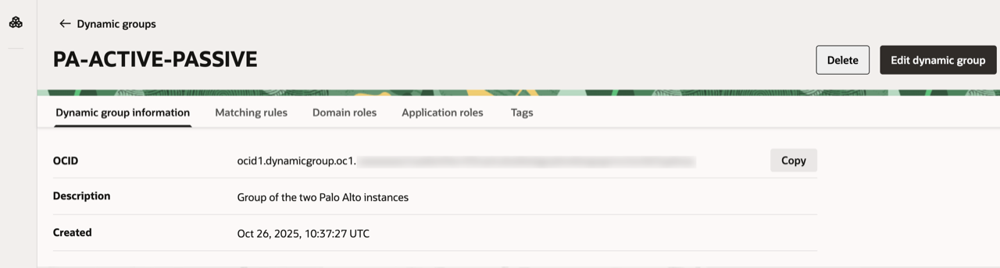

## Task 2: Create the IAM Policy

Create an IAM policy that grants the dynamic group the permissions required for HA operations. In this workshop, create the policy in the `Tutorial` compartment, where the Palo Alto VM instances are deployed. In other deployments, you can create the policy in the root compartment or in the compartment that contains the firewall instances and resources covered by the policy.

1. On the OCI console Select the main menu.
2. Click on **Identity & Security**.
3. Click on Policies.

    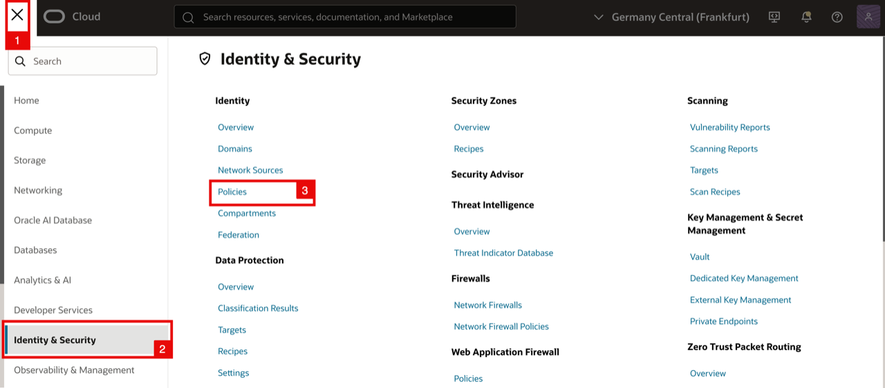

    - On the **filter** button select the compartment where you want to create the policy.
    - Click on the **Create Policy** button.

    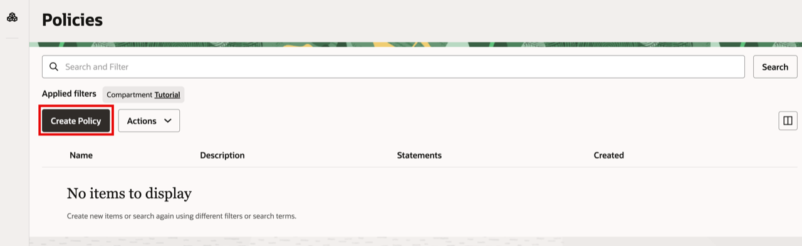

<!-- -->

1. Specify the **name** for the policy.
2. Specify the **description** for the policy.
3. Select the right **compartment**.

    - Scroll down.

    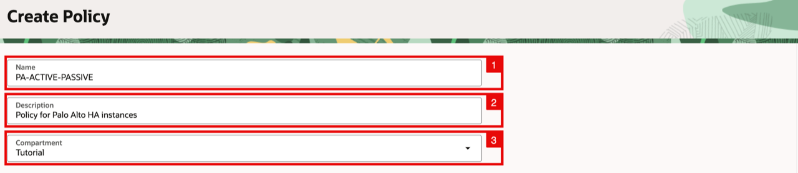

    - Click on the **Show manual editor** button.

    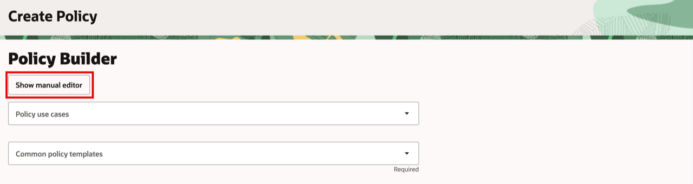

<!-- -->

1. Next, we will create an **IAM Policy** that grants the Dynamic Group the necessary permissions to manage network and instance resources required for Palo Alto HA fail-over operations.

    ```
    <copy>
    allow dynamic-group 'OracleIdentityCloudService'/'PA-ACTIVE-PASSIVE' to use virtual-network-family in compartment Tutorial
    allow dynamic-group 'OracleIdentityCloudService'/'PA-ACTIVE-PASSIVE' to use instance-family in compartment Tutorial
    </copy>
    ```

2. Click on the **Create** button.

    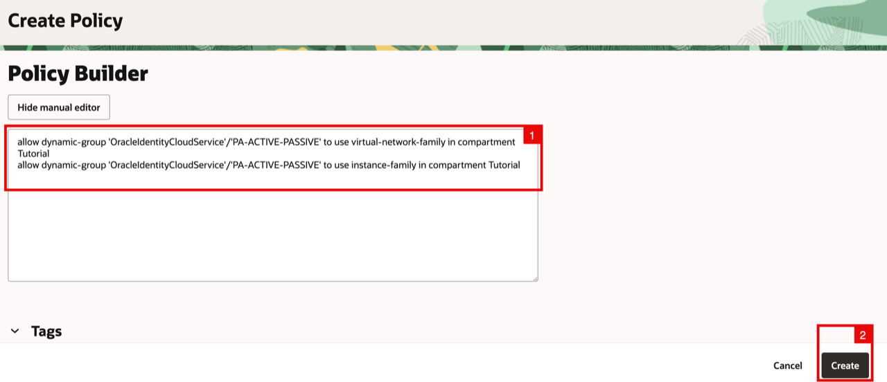

    - Notice the **policy** has been created.

    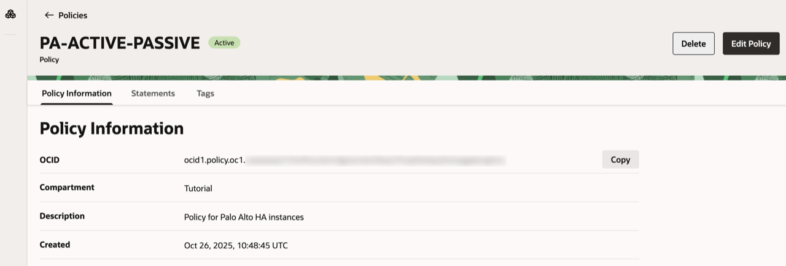

## Learn More

- [Managing Dynamic Groups](https://docs.oracle.com/en-us/iaas/Content/Identity/Tasks/managingdynamicgroups.htm)
- [How to Configure Palo Alto Active/Passive HA on OCI](https://docs.paloaltonetworks.com/vm-series/11-0/vm-series-deployment/set-up-the-vm-series-firewall-on-oracle-cloud-infrastructure/configure-activepassive-ha-on-oci)

## Acknowledgements

- **Authors** - Anas Abdallah, Iwan Hoogendoorn (Cloud Networking Black Belts)
- **Contributor** - Antonio Gámir (Cloud Networking Black Belt)
- **Last Updated By/Date** - Anas Abdallah, August 2026

You may now **proceed to the next lab**.
