# Configure High Availability (HA)

## Introduction

An Active/Passive HA pair uses two communication paths between the firewalls. HA1 is the control link for peer health, state, and configuration synchronization. HA2 is the data link that synchronizes session state so the passive firewall can take over active traffic during failover.

This deployment reuses the existing management interface for HA1, so no fifth interface is required. HA2 uses the dedicated fourth VNIC, mapped to `ethernet1/3` on each firewall.

Estimated time: 20 minutes

### Objectives

In this lab, you will:
- Configure the HA1 control link over the management interfaces.
- Configure the HA2 data link over `ethernet1/3`.
- Verify that the firewalls can communicate and synchronize as an HA pair.

### Prerequisites

Before you begin, ensure you have completed the preceding required labs in this workshop.

## Task 1: Configure HA1 (Control Link)

HA1 is the control link between the firewalls. It carries heartbeats, hello messages, HA state, and configuration synchronization information. If HA1 is down or misconfigured, coordinated failover can be affected and, in some failure scenarios, split-brain behavior can occur.

For the HA1 connectivity you have two design options:

- **Option 1 – Dedicated HA1 interface:**
    You create an extra, dedicated HA1 interface on each firewall (this becomes the fifth interface in our design), placed in a small /30 or /29 “HA” subnet. This cleanly separates HA control traffic from management and data traffic.
- **Option 2 – Reuse the management interface for HA1 (our design):**
    You use the existing management interface as the HA1 transport. This reduces the number of interfaces/subnets you need and simplifies the network design, but you must make sure that management interfaces of both firewalls can reach each other (IP connectivity, routing, and security rules) and that this traffic is protected and restricted.

In this guide, we use **Option 2**. Ensure that the management interfaces can communicate reliably and securely and that HA1 traffic is not blocked.

### PA-VM-01

- SSH to the PA-VM-01 instance

1. Issue the command `show interface management` to verify the IP assignment type.
2. Notice the IP assignment is set to `dhcp-client`.

    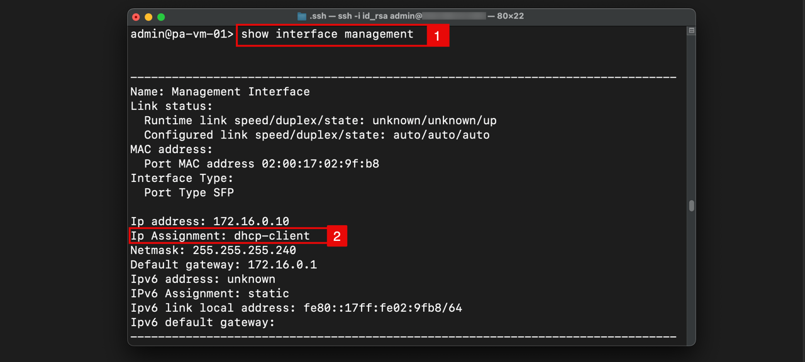

    - Now let's change this to static.

<!-- -->

1. Issue the command `configure` to enter configuration mode.
2. `set deviceconfig system type static` to change the IP assignment method to static.
3. `set deviceconfig system ip-address 172.16.0.10` to set the IP address.
4. `set deviceconfig system netmask 255.255.255.240` to set the subnet mask.
5. `set deviceconfig system default-gateway 172.16.0.1` to set the default gateway.
6. `commit` to commit the changes.
7. Notice that the changes are committed successfully.
8. `exit` to exit configuration mode.

    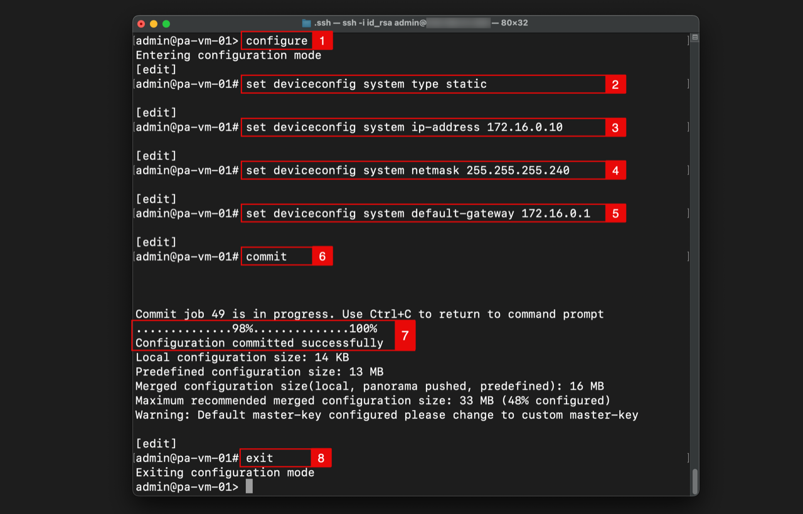

<!-- -->

1. Issue the command `show interface management` to verify the IP assignment type again.
2. Notice the IP assignment is now set to `static`.

    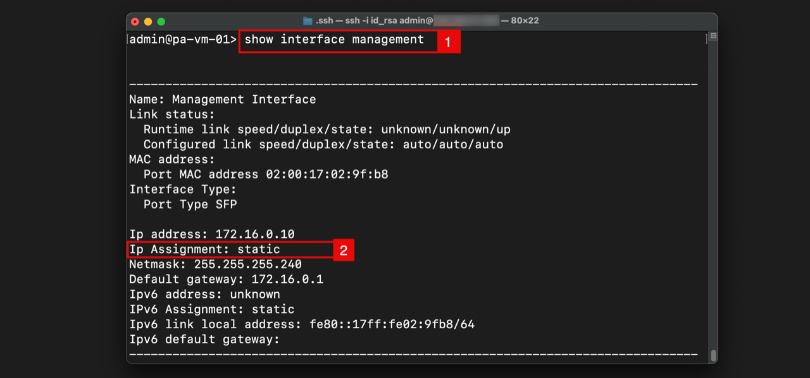

<!-- -->

1. Issue the command `configure` to enter configuration mode.
2. `show deviceconfig system dns-setting servers` to verify what DNS servers are configured.
3. Notice there are no DNS servers configured.

    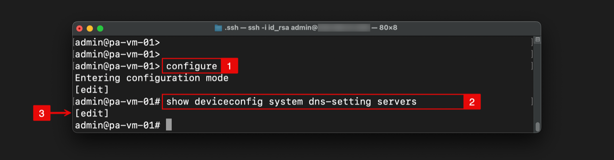

<!-- -->

1. Configure OCI's primary DNS server with: `set deviceconfig system dns-setting servers primary 169.254.169.254`.
2. `commit` to commit the changes.
3. Notice that the changes are committed successfully.

    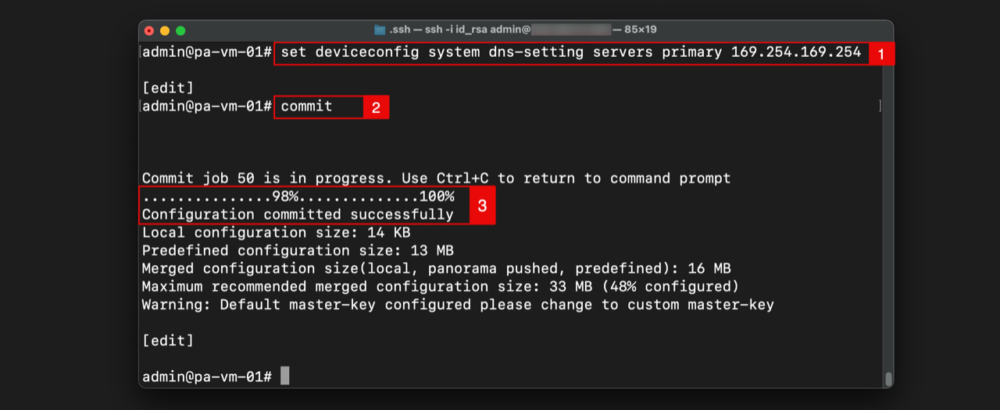

    > **Note:** In Oracle Cloud Infrastructure (OCI), `169.254.169.254` is a link-local IP address used to access the **Instance Metadata Service** (IMDS) from within a compute instance. This service provides information about the instance, such as its OCID, display name, and custom tags. It is also used for other internal OCI services, including the default DNS resolver, and is a reliable source for an NTP server for Oracle Linux instances.

<!-- -->

1. `show deviceconfig system dns-setting servers` to verify what DNS servers are configured again.
2. Notice there is one DNS server (169.254.169.254) configured.

    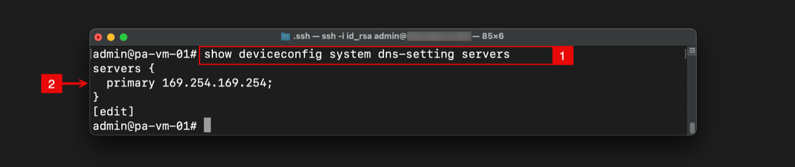

### PA-VM-02

Repeat the same steps above for PA-VM-02 instance:

- Connect to the PA-VM-02 instance with SSH.
- Issue the command `configure` to enter configuration mode.
- `set deviceconfig system type static` to change the IP assignment method to static.
- `set deviceconfig system ip-address 172.16.0.11` to set the IP address.
- `set deviceconfig system netmask 255.255.255.240` to set the subnet mask.
- `set deviceconfig system default-gateway 172.16.0.1` to set the default gateway.
- `set deviceconfig system dns-setting servers primary 169.254.169.254` to set the OCI DNS server.
- `commit` to commit the changes.
- `exit` to exit configuration mode.

### PA-VM-01

- Navigate to the **PA-VM-01** WEB GUI.
1. Click on **Device**.
2. Click on **High Availability**.
3. Click on **General**.
4. Click on the **setup wheel in the HA Pair Settings** section.

    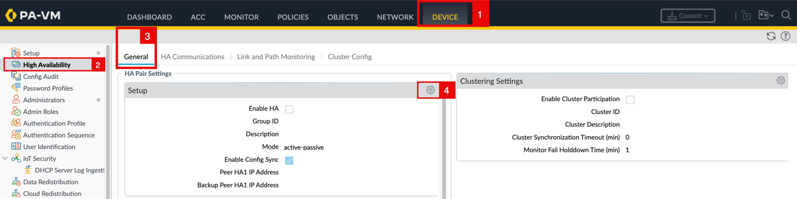

<!-- -->

1. Check the **Enable HA** checkbox.
2. Set the **Group ID** to 1.
3. Set the **Mode** to Active Passive.
4. Check the **Enable Config Sync** checkbox.
5. Specify the Peer HA1 IP address to be `172.16.0.11` (PA-VM-02 management IP address).
6. Click the **OK** button.

    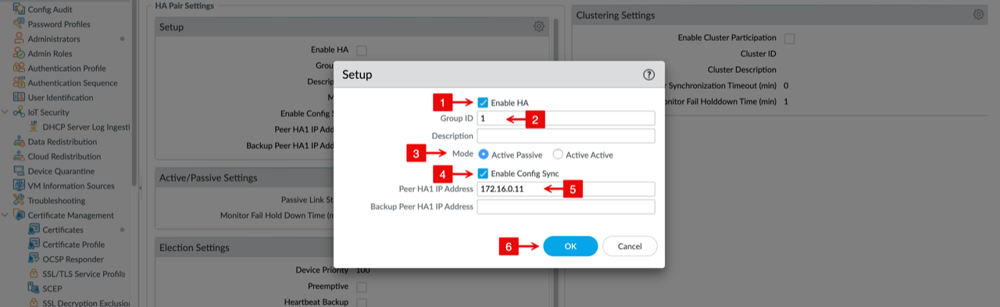

    - Click on **Commit**.

    > **Note:** You can **commit** after each configuration you make (safer, easier to troubleshoot), or you can wait and commit once after completing all steps (faster, fewer commits).

    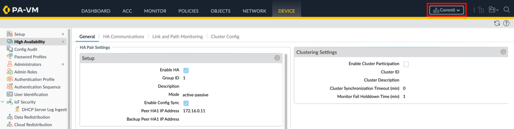

<!-- -->

1. Notice the message that commit will overwrite the running configuration.
2. Click on the **Commit** button.

    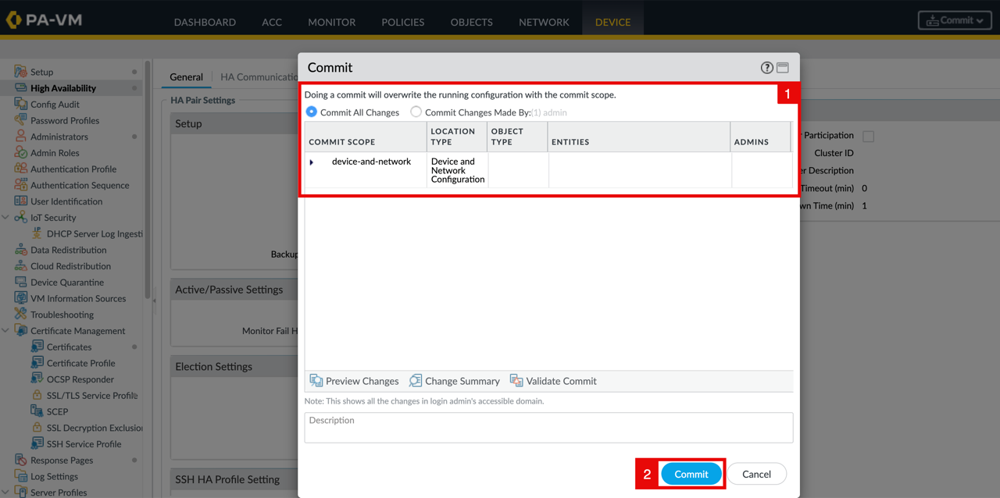

    - Wait for the **Commit** to complete.

    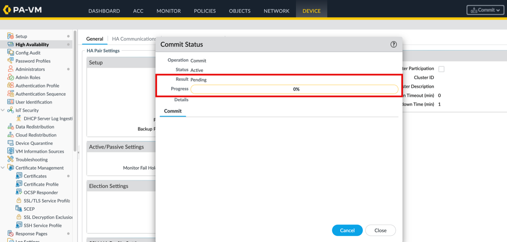

<!-- -->

1. Notice that the **Commit** has completed.
2. Click on the **Close** button.

    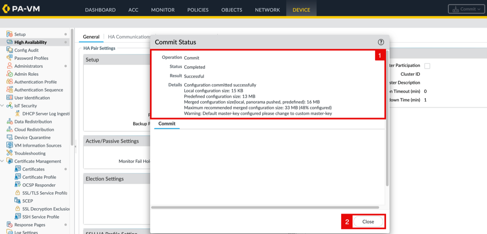

- HA1 configuration is completed successfully on **PA-VM-01**.

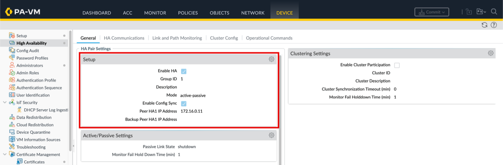

### PA-VM-02

- Navigate to the **PA-VM-02** WEB GUI and repeat the same steps above.
- Make sure the Peer HA1 IP address to be `172.16.0.10` (PA-VM-01 management IP address).

## Task 2: Configure HA2 (Data Link)

 HA2 synchronizes session and runtime state between the two Palo Alto firewalls. While HA1 carries peer health, HA state, and configuration synchronization, HA2 synchronizes session tables, forwarding tables, IPSec SAs, and ARP tables.

This allows the passive firewall to take over ongoing traffic with the required state during failover. Without HA2, failover is more disruptive and stateful failover cannot be guaranteed.
 
### PA-VM-01

- Navigate to the **PA-VM-01** WEB GUI.
1. Click on **Device**.
2. Click on **High Availability**.
3. Click on **HA Communications**.
4. Click on the **setup wheel in the Data Links Settings** section.

    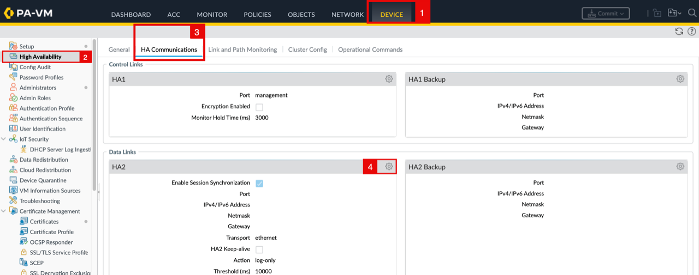

<!-- -->

1. Check the **Enable Session Synchronisation** checkbox.
2. Specify the **port** to be `ethernet 1/3`.
3. Specify the **IPv4 address** to be `172.16.0.50`.
4. Specify the **Netmask** to be `255.255.255.240`.
5. Specify the **Gateway** to be `172.16.0.49`.
6. Specify the **Transport** to be `ip`.
7. Click the **OK** button.

    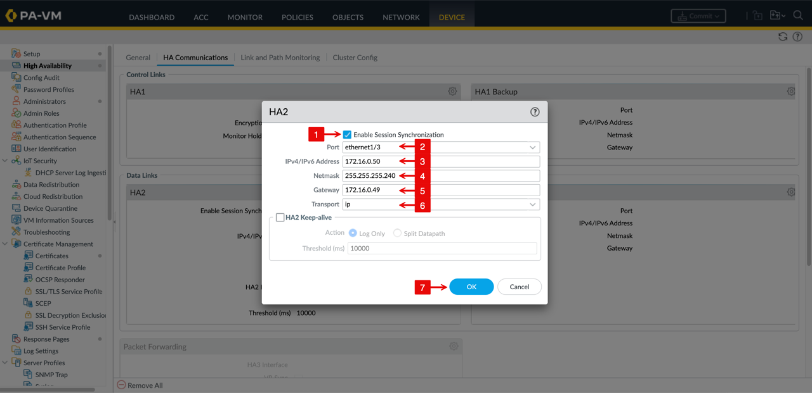

    - Click on **Commit**.

    > **Note:** You can **commit** after each configuration you make (safer, easier to troubleshoot), or you can wait and commit once after completing all steps (faster, fewer commits).

    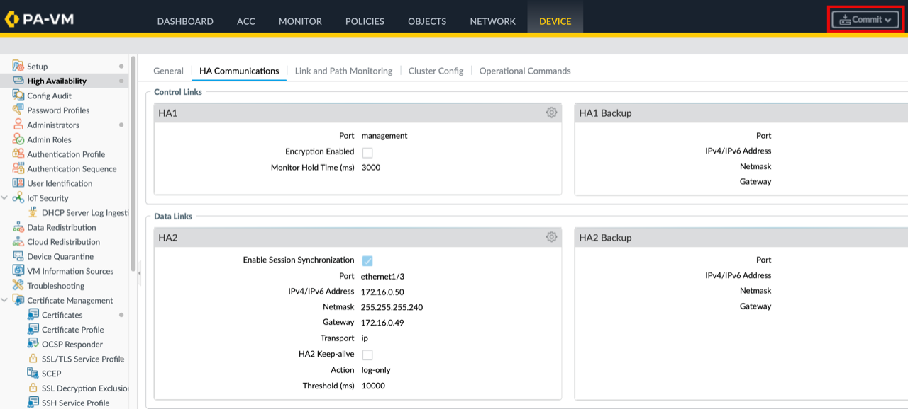

<!-- -->

1. Notice the message that commit will overwrite the running configuration.
2. Click on the **Commit** button.

    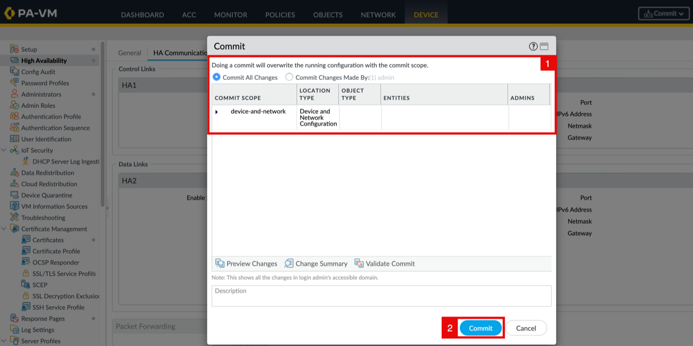

    - Wait for the **Commit** to complete.

    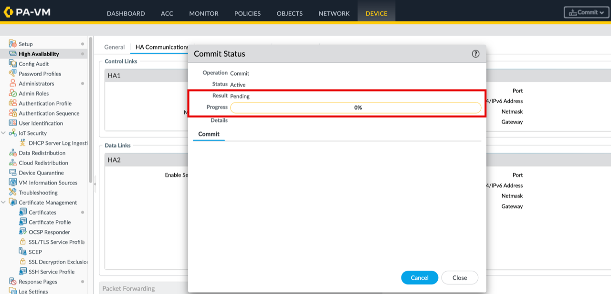

<!-- -->

1. Notice that the **Commit** has completed.
2. Click on the **Close** button.

    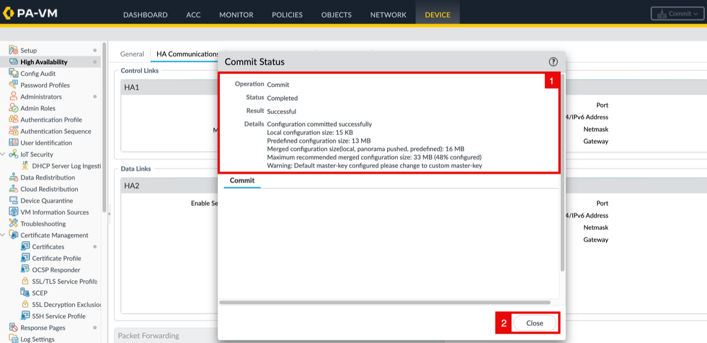

- HA2 configuration is completed successfully on **PA-VM-01**.

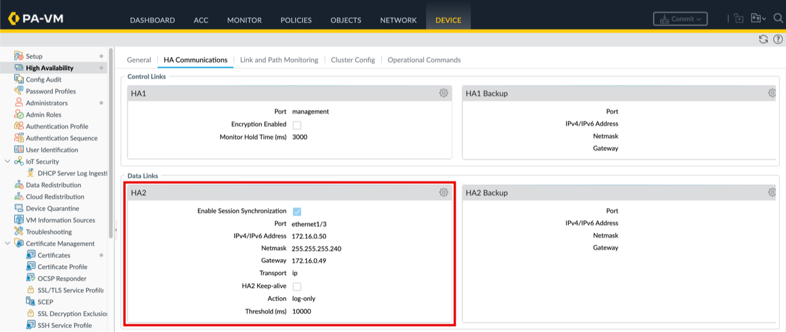

### PA-VM-02

- Navigate to the **PA-VM-02** WEB GUI and repeat the same steps above.
- Make sure the **IPv4 address** is `172.16.0.51`.

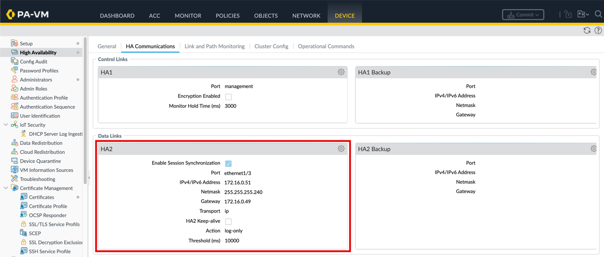

After applying the configuration on PA-VM-02, the trust and untrust interfaces will appear down (red). This is expected because the passive device remains inactive until failover.

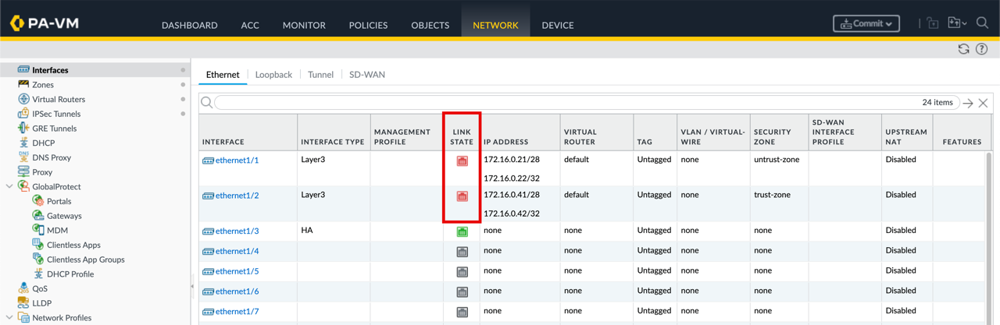

## Learn More

- [Configure Active/Passive HA on OCI](https://docs.paloaltonetworks.com/vm-series/11-0/vm-series-deployment/set-up-the-vm-series-firewall-on-oracle-cloud-infrastructure/configure-activepassive-ha-on-oci)
- [How to Configure Palo Alto Active/Passive HA on OCI](https://docs.paloaltonetworks.com/vm-series/11-0/vm-series-deployment/set-up-the-vm-series-firewall-on-oracle-cloud-infrastructure/configure-activepassive-ha-on-oci)

## Acknowledgements

- **Authors** - Anas Abdallah, Iwan Hoogendoorn (Cloud Networking Black Belts)
- **Contributor** - Antonio Gámir (Cloud Networking Black Belt)
- **Last Updated By/Date** - Anas Abdallah, August 2026

You may now **proceed to the next lab**.
