# Test Synchronization and Failover

## Introduction

This lab validates the purpose of the Active/Passive design. You confirm configuration synchronization, trigger a controlled failover, and verify that the peer becomes active.

Estimated time: 20 minutes

### Objectives

In this lab, you will:
- Verify configuration synchronization between the HA peers.
- Perform a controlled failover and confirm that the peer firewall becomes active.
- Validate traffic continuity after failover.

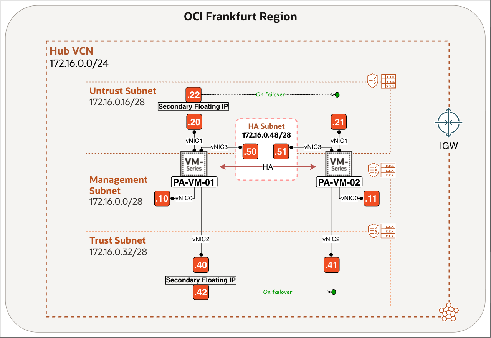

### Prerequisites

Before you begin, ensure you have completed the preceding required labs in this workshop.

## Task 1: Add the High Availability Widget and Sync to Peer

### PA-VM-01

- Navigate to the **PA-VM-01** WEB GUI.
1. Click on **Dashboard**.
2. Click on **Widgets**.
3. Click on **System**.
4. Click on **High Availability**.

    

    - Notice that the **High Availability Widget** is now visible.

    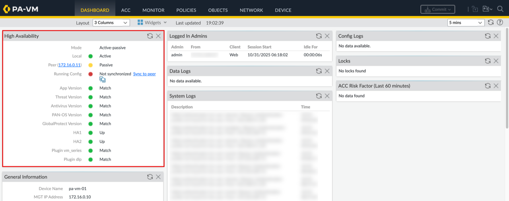

<!-- -->

1. Notice the **mode** (active/passive), this local **node** is active and the **peer** is passive.
2. Notice the additional information and **status indicators** all showing up as green, meaning that everything is set for the initial sync and HA operation.
3. Click on **Sync to peer**.

    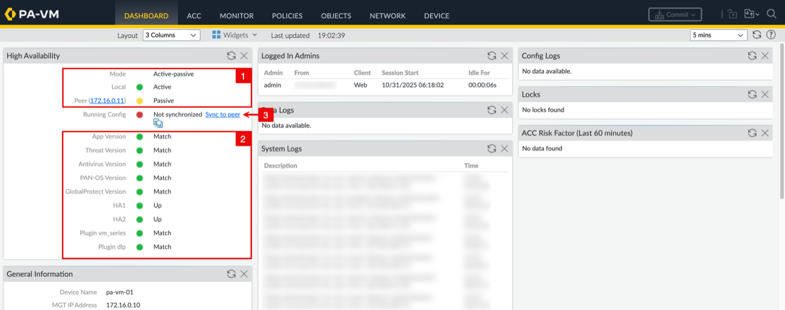

    - Click on the **Yes** Button to allow to overwrite the peers configuration.

    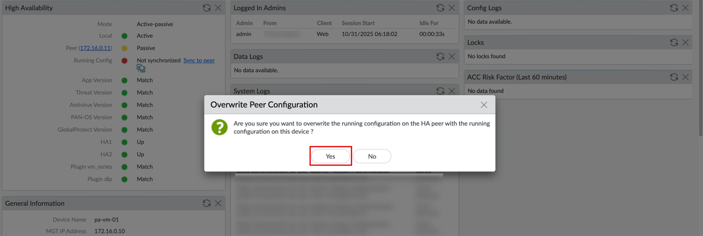

    - Notice that the **Running Config** Synchronization is in progress to PA-VM-02.

    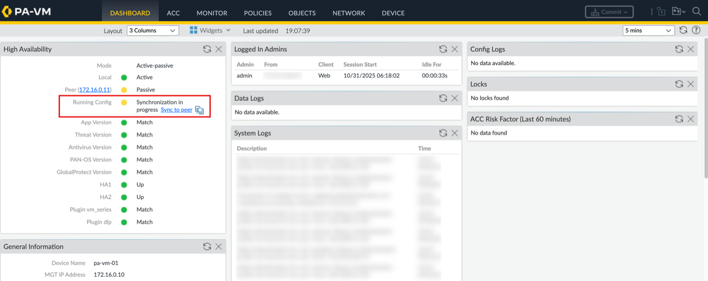

    - Notice that the **Running Config** Synchronization is fully synchronized to PA-VM-02.

    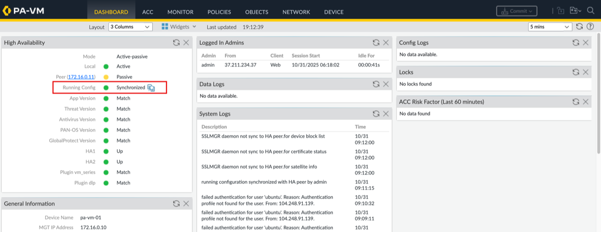

### PA-VM-02

- Navigate to the **PA-VM-02** WEB GUI.
1. Click on **Dashboard**.
2. Click on **Widgets**.
3. Click on **System**.
4. Click on **High Availability**.

    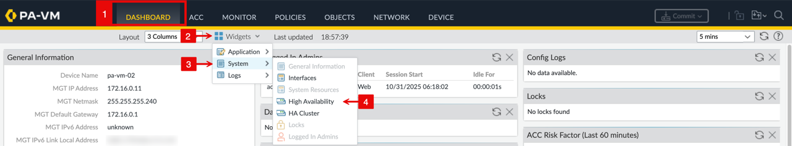

    - Notice that the **High Availability Widget** is now visible. Also, notice that the running config is shown synced here as well.

    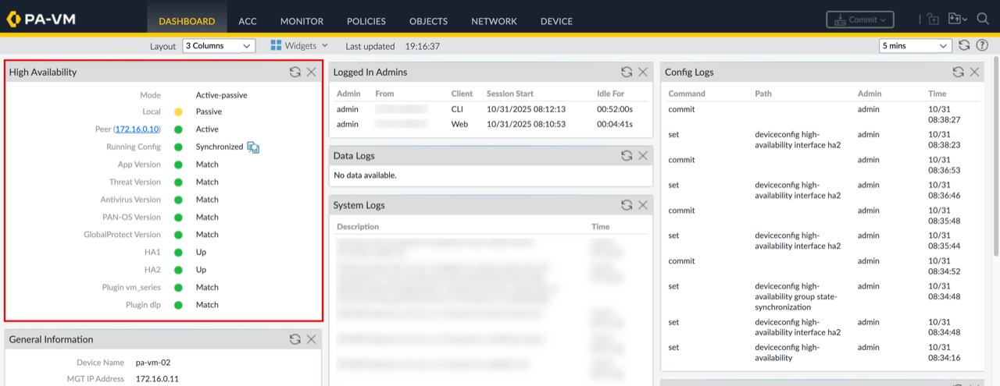

<!-- -->

1. Click on **Network**.
2. Click on **Interfaces**.
3. Notice that PA-VM-01 primary **IP Addresses** are synchronized to PA-VM-02.

    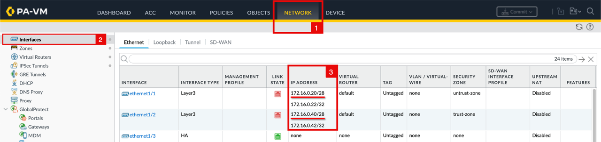

<!-- -->

1. Click on **Policies**.
2. Notice that the security policy we created in the previous task is synchronized to PA-VM-02.

    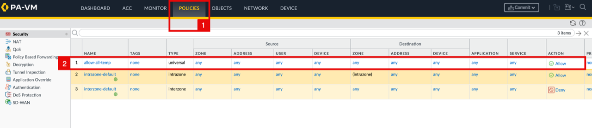

    > **Note:** Any future configuration changes made on PA-VM-01 will be automatically synchronized to PA-VM-02, without any manual intervention.

## Task 2: Test Failover

### Verify Floating IP Addresses Before Failover

Before you trigger failover, verify that **PA-VM-01**, the active firewall, holds both its primary and floating private IP addresses. The floating Untrust IP address is associated with a reserved public IP address for internet reachability.

**PA-VM-01 Untrust VNIC**

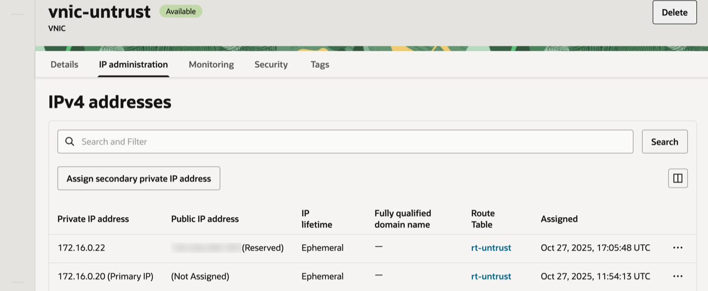

**PA-VM-01 Trust VNIC**

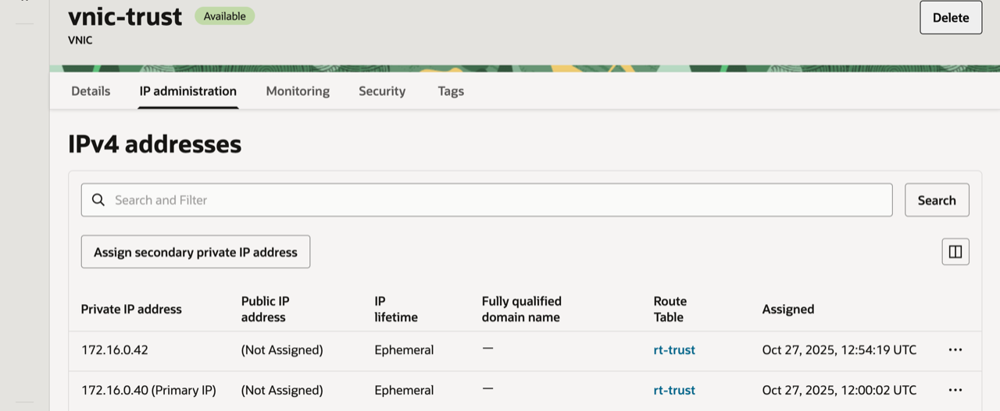

**PA-VM-02** is passive before failover and holds only its primary private IP addresses. It does not hold either floating IP address.

**PA-VM-02 Untrust VNIC**

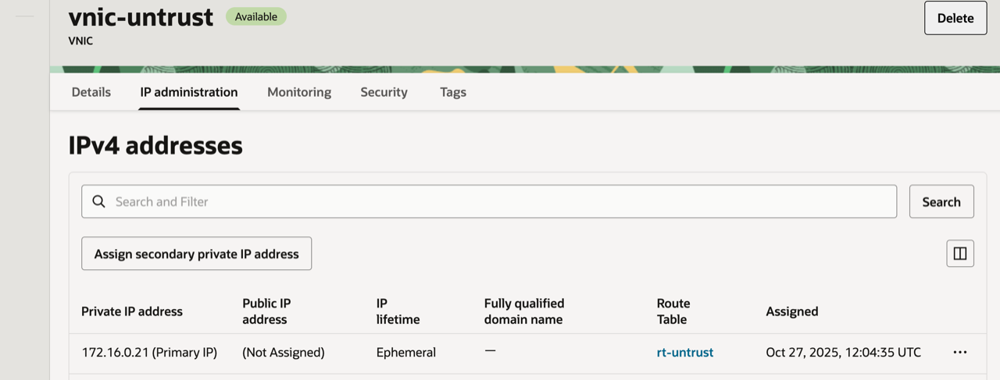

**PA-VM-02 Trust VNIC**

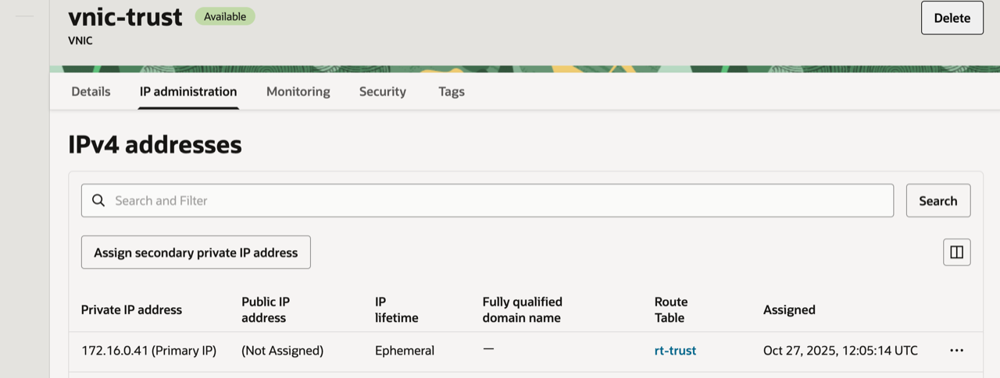

### PA-VM-01

- Login to the **OCI Console**, and navigate to the **PA-VM-01** instance.

1. Click on the **Actions** drop down menu.
2. Click on Reboot, to test the failover.

    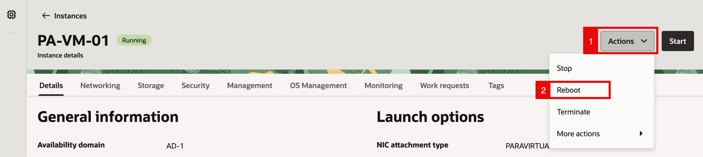

    - Click on the **Reboot Instance** button.

    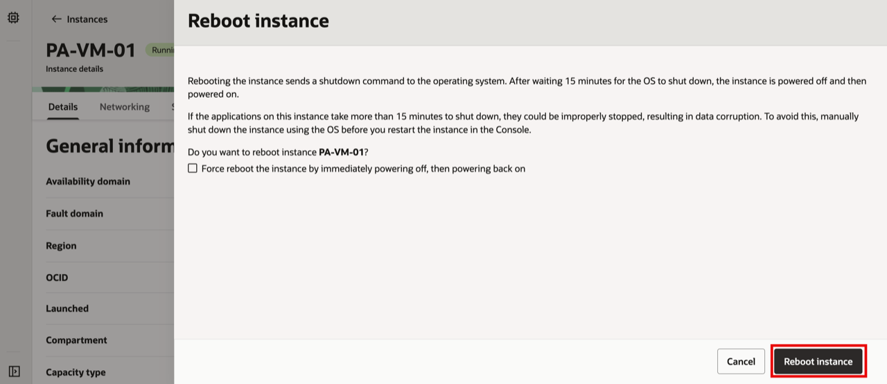

    - Notice that the PA-VM-01 Instance state will change to **Stopping**.

    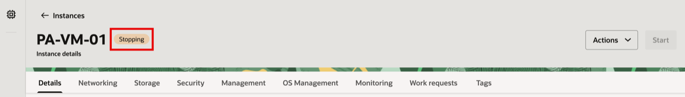

    - Notice that the PA-VM-01 Instance state will change to **Running**.

    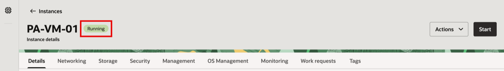

### PA-VM-01

- Navigate to the **PA-VM-01** WEB GUI.
- Notice that the **local** high availability status of PA-VM-01 changed to **passive** state.

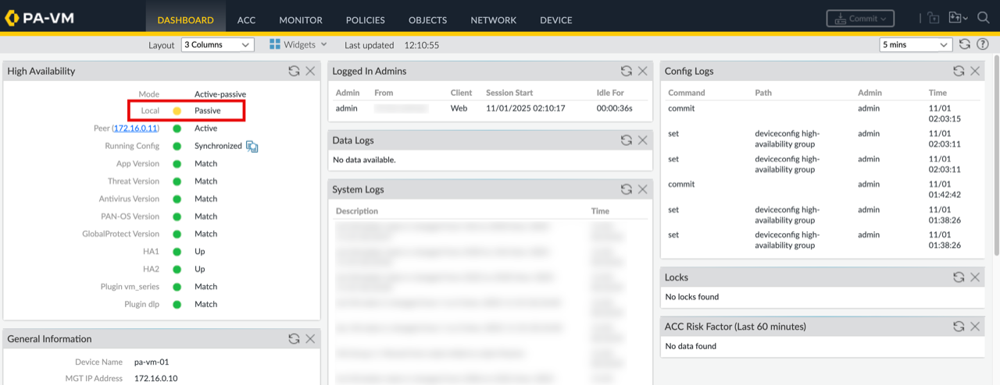

<!-- -->

1. Click on **Network**.
2. Click on **Interfaces**.
3. Notice that the color of the interfaces are red on the PA-VM-01.

    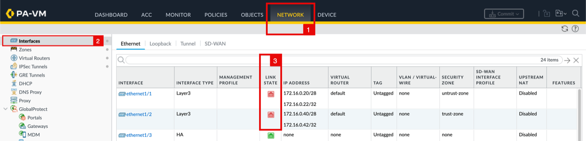

### PA-VM-02

- Navigate to the **PA-VM-02** WEB GUI.
- Notice that the **local** high availability status of PA-VM-02 changed to **active** state.

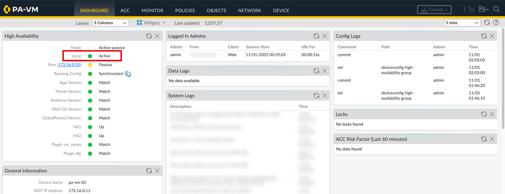

<!-- -->

1. Click on **Network**.
2. Click on **Interfaces**.
3. Notice that the color of the interfaces are green on the PA-VM-02.

    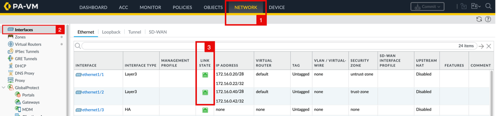

When PA-VM-01 came back online, it did not automatically resume the Active role from PA-VM-02. This is expected behavior because preemption is disabled by default in Palo Alto HA.

If you want the originally designated primary firewall (PA-VM-01) to automatically take back the Active role once it recovers, you need to configure Election Settings and enable Preemptive mode (next optional lab).

### Verify Floating IP Addresses After Failover

After PA-VM-01 fails over, **PA-VM-02** becomes the primary firewall and holds both floating private IP addresses.

**PA-VM-02 Untrust VNIC**

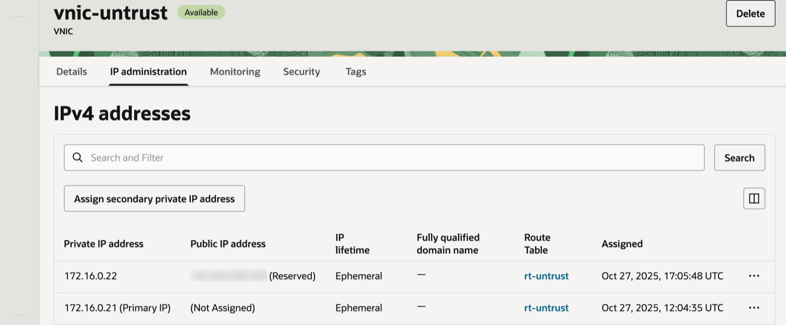

**PA-VM-02 Trust VNIC**

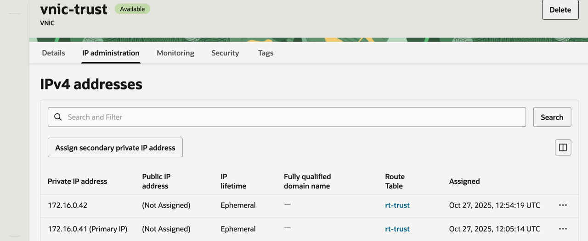

**PA-VM-01** is now passive and holds only its primary private IP addresses. It no longer holds either floating IP address.

**PA-VM-01 Untrust VNIC**

**PA-VM-01 Trust VNIC**

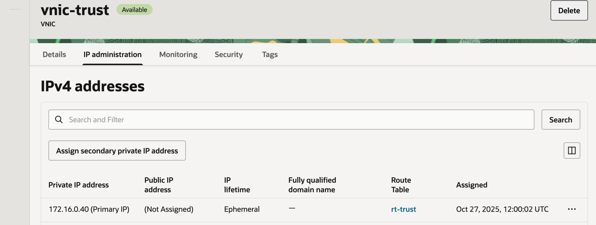

## Learn More

- [How to Configure Palo Alto Active/Passive HA on OCI](https://docs.paloaltonetworks.com/vm-series/11-0/vm-series-deployment/set-up-the-vm-series-firewall-on-oracle-cloud-infrastructure/configure-activepassive-ha-on-oci)
- [Moving a Secondary Private IP Address to a Different VNIC](https://docs.oracle.com/en-us/iaas/Content/Network/Tasks/private-ip-address-move-vnic.htm)

## Acknowledgements

- **Authors** - Anas Abdallah, Iwan Hoogendoorn (Cloud Networking Black Belts)
- **Contributor** - Antonio Gámir (Cloud Networking Black Belt)
- **Last Updated By/Date** - Anas Abdallah, August 2026

You may now **proceed to the next lab**.
