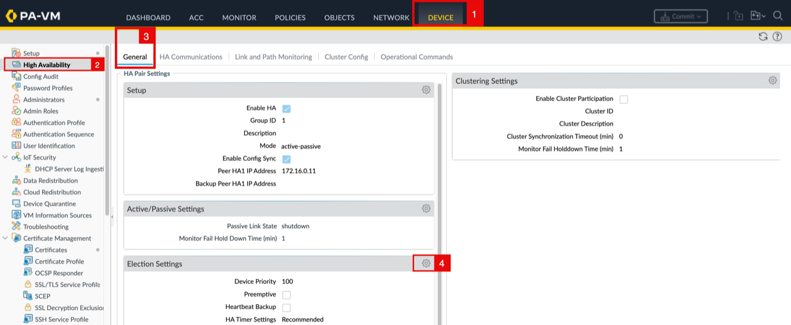
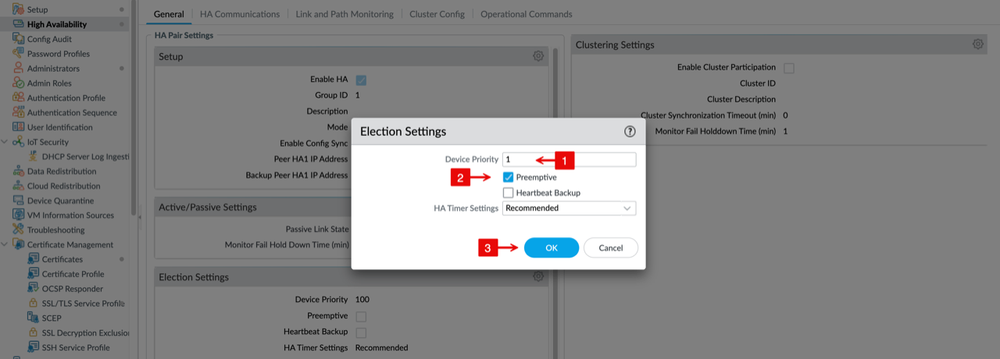
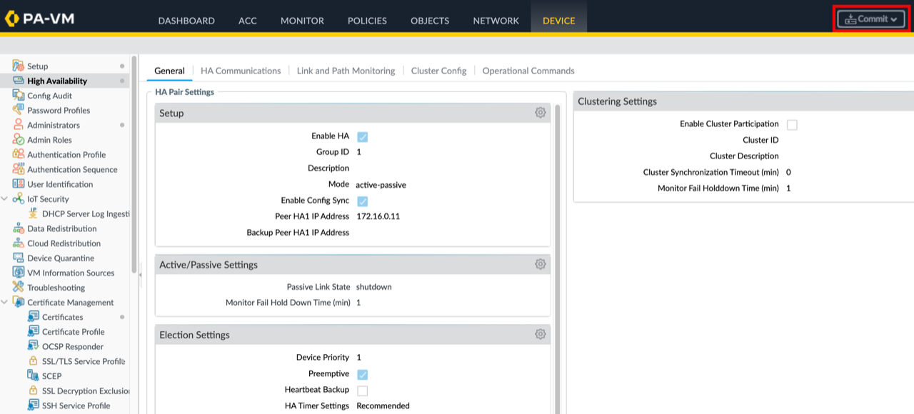
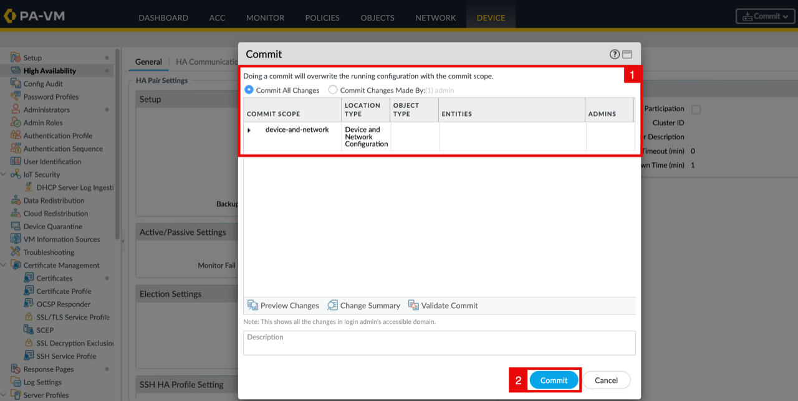
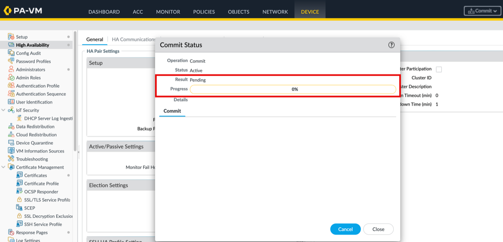
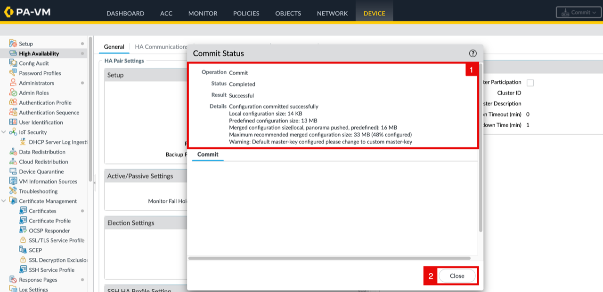
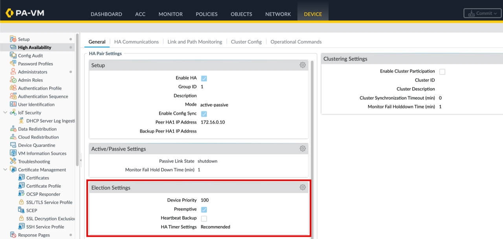
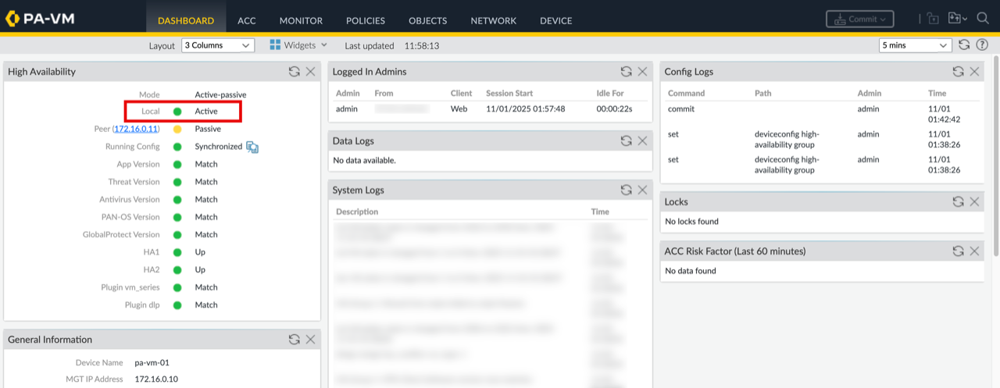
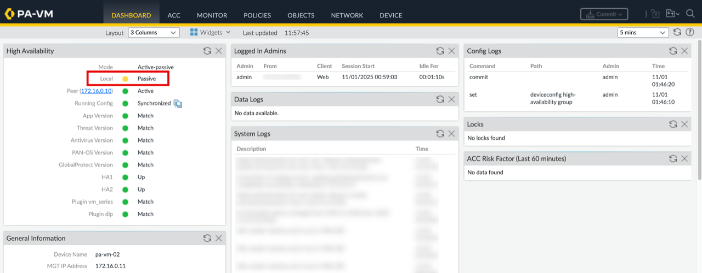

# Configure HA Election and Failback (Optional)

## Introduction

HA election settings determine which peer is preferred after recovery. This optional lab configures device priority and preemption so failback behavior matches the intended operating model.

Estimated time: 15 minutes

### Objectives

In this lab, you will:
- Configure HA device priority and election settings.
- Optionally enable preemption and verify the expected failback behavior.

### Prerequisites

Before you begin, ensure you have completed the preceding required labs in this workshop.

## Task 1: Configure HA Election and Failback (Optional)

> **Note:** This optional task demonstrates preemptive failback. Enable it only if PA-VM-01 must automatically reclaim the active role after recovery; otherwise, leave preemption disabled.

### PA-VM-01

- Navigate to the **PA-VM-01** WEB GUI.
1. Click on **Device**.
2. Click on **High Availability**.
3. Click on the **General** tab.
4. In the **Election Settings** section, click on the **settings wheel**.

    

<!-- -->

1. Set the **device priority** for PA-VM-01 to 1 so it will be the active firewall when available.
2. Check the **Preemptive** box.
3. Click on the **OK** button.

    

    - Click on **Commit**.

    > **Note:** You can **commit** after each configuration you make (safer, easier to troubleshoot), or you can wait and commit once after completing all steps (faster, fewer commits).

    

<!-- -->

1. Notice the message that commit will overwrite the running configuration.
2. Click on the **Commit** button.

    

    - Wait for the **Commit** to complete.

    

<!-- -->

1. Notice that the **Commit** has completed.
2. Click on the **Close** button.

    

### PA-VM-02

- Navigate to the **PA-VM-02** WEB GUI and repeat the same steps above.
- Keep the **device priority** at the default value of 100 so PA-VM-02 remains passive when available.

To perform an additional test, reboot PA-VM-01.

1. At this point, PA-VM-01 is active and PA-VM-02 is passive, so reboot PA-VM-01.
2. Wait for some time.
3. Unlike the previous test, PA-VM-01 will reclaim the active role after recovery.

### PA-VM-01

- Navigate to the **PA-VM-01** WEB GUI.
- Notice that the **local** high availability status of PA-VM-01 is now in **active** state.

### PA-VM-02

- Navigate to the **PA-VM-02** WEB GUI.
- Notice that the **local** high availability status of PA-VM-02 is now in **passive** state.

## Which Is Better: Enable or Disable Preemptive Mode?

**Recommended: _Disable Preemptive Mode_**

For most deployments, leave preemption disabled unless you require a specific firewall to automatically reclaim the active role after recovery.

Here’s why:
- **More stable failover behavior**
    - When preemptive mode is disabled, the firewall that becomes _active_ during a failover remains active until **another failure occurs**.
    - This avoids unnecessary role flipping.
- **Prevents “flapping” in cloud environments**
    - Cloud networks can experience brief latency or API delays.
    - Preemptive mode may interpret these as a failure and try to reclaim Active role, causing disruptive failovers.
- **Better for OCI where both nodes have equal operational capability**
    - In OCI, both firewalls are deployed identically (same shape, same configuration, same routing).
    - There is no strong requirement for a specific firewall (Primary) to always be Active.

**When to enable preemptive mode (rare cases):**
- You have a strict operational requirement that the **Primary firewall must always be Active** when healthy.
- Your environment has **LOCAL stable, low-latency, on-prem-like conditions**.
- You accept the risk of additional failover events.

## Learn More

- [Set Up Active/Passive HA](https://docs.paloaltonetworks.com/pan-os/11-1/pan-os-admin/high-availability/set-up-activepassive-ha)
- [Configure Active/Passive HA on OCI](https://docs.paloaltonetworks.com/vm-series/11-0/vm-series-deployment/set-up-the-vm-series-firewall-on-oracle-cloud-infrastructure/configure-activepassive-ha-on-oci)

## Acknowledgements

- **Authors** - Anas Abdallah, Iwan Hoogendoorn (Cloud Networking Black Belts)
- **Contributor** - Antonio Gámir (Cloud Networking Black Belt)
- **Last Updated By/Date** - Anas Abdallah, August 2026

You may now **proceed to the next lab**.
