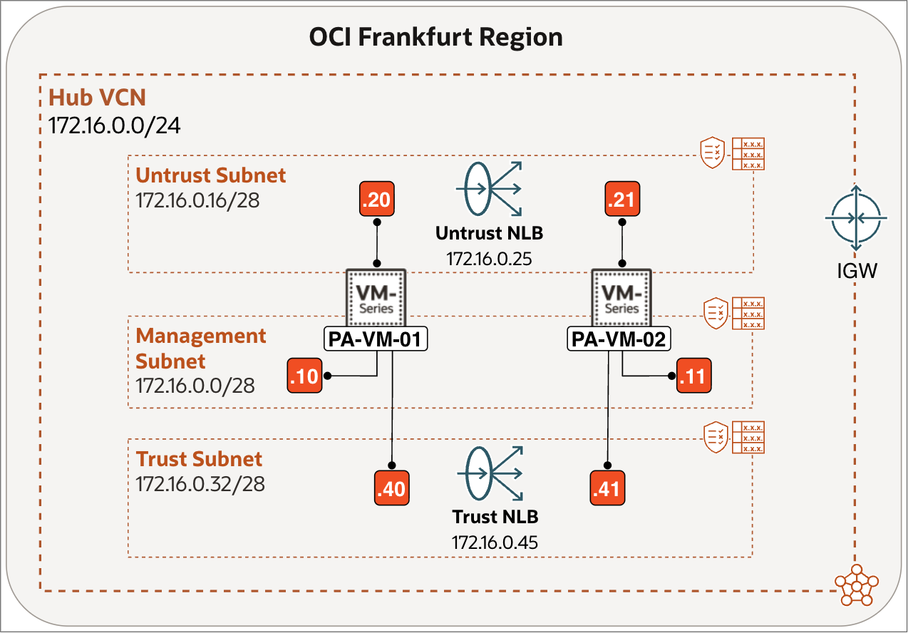
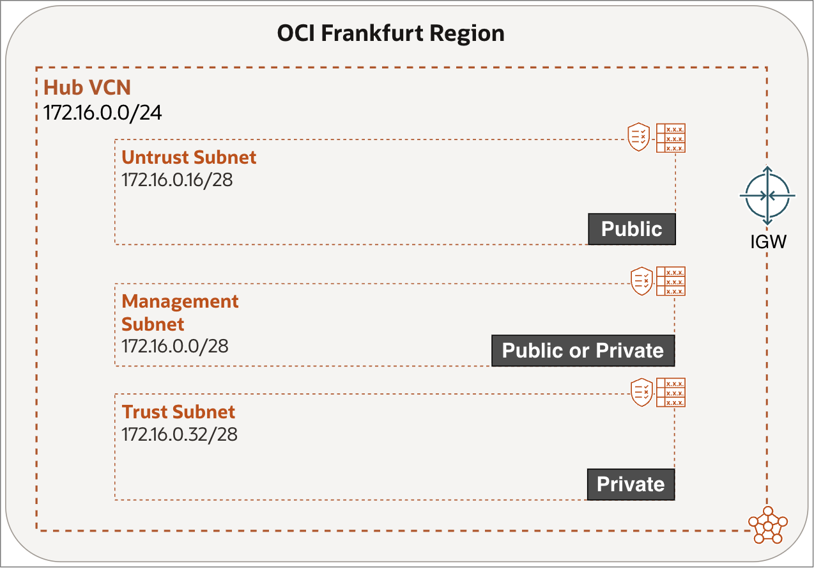

# Introduction

## About this Workshop

This workshop shows you how to deploy Palo Alto Networks Next-Generation Firewalls (NGFWs) in an active/active architecture on Oracle Cloud Infrastructure (OCI). The goal is to build a scalable, resilient inspection layer in which multiple firewall instances actively process traffic at the same time.

This architecture uses OCI Network Load Balancer (NLB) to distribute traffic symmetrically across two or more Palo Alto Networks Next-Generation Firewall (NGFW) instances. Unlike Layer-7 load balancing, the NLB operates at Layer 4, preserving source and destination IP information and enabling stateful inspection on the firewalls without breaking session consistency.

The active/active pattern is particularly relevant for high-throughput environments, shared firewall hubs, and designs where horizontal scaling is preferred over vertical sizing. It also aligns well with modern cloud principles, where failure is expected and capacity is added incrementally rather than pre-provisioned.

Estimated Workshop Time: 80 minutes

### Objectives

In this workshop, you will:
1. Deploy and initialise two Palo Alto Networks VM-Series firewall instances on OCI.
2. Configure the VCN, subnets, and dedicated management, untrust (public), and trust (private) interfaces for both firewall instances.
3. Access and implement the baseline firewall configuration and security policies on both firewall instances.
4. Configure OCI Network Load Balancers for the trust and untrust traffic paths.
5. Implement symmetric traffic flows that preserve firewall session state while distributing traffic across both firewall instances.
6. Verify that both firewall instances are registered as healthy backends on the trust and untrust Network Load Balancers.

This knowledge will help you design and implement secure OCI network topologies that incorporate third-party firewall appliances, adhering to best practices for segmentation and observability.

### Prerequisites

Before you begin, ensure you have the following:

#### OCI Environment

- An active OCI tenancy with required permissions to create VCNs, subnets, route tables, and compute instances.
- A VCN with at least three subnets (Management, Untrust, and Trust).
- Access to public Internet for the management interface, or a private Bastion host to reach it securely.

> **Note:** If you select the BYOL image, each VM-Series firewall requires outbound internet access to Palo Alto Networks licensing services to activate an authorization code and retrieve its licenses. Offline licensing is supported, but it is not covered in this workshop.

Ensure that each subnet is associated with its own route table and security list, as shown below.

|                   | Route Table     | Security List   |
| ----------------- | --------------- | --------------- |
| Management Subnet | `rt-management` | `sl-management` |
| Untrust Subnet    | `rt-untrust`    | `sl-untrust`    |
| Trust Subnet      | `rt-trust`      | `sl-trust`      |

#### Palo Alto Resources

- A valid Palo Alto Networks support account (for licensing and activation).
- Access to the Palo Alto Networks VM-Series image in the Oracle Cloud Marketplace.

## Learn More

- [Overview of VCNs and Subnets](https://docs.oracle.com/en-us/iaas/Content/Network/Tasks/Overview_of_VCNs_and_Subnets.htm)
- [Prepare to Set Up the VM-Series Firewall on OCI](https://docs.paloaltonetworks.com/vm-series/deployment/public-cloud/set-up-the-vm-series-firewall-on-oracle-cloud-infrastructure/prepare-to-set-up-the-vm-series-firewall-on-oci)
- [Introduction to Network Load Balancer](https://docs.oracle.com/en-us/iaas/Content/NetworkLoadBalancer/introduction.htm)

## Acknowledgements

- **Authors** - Anas Abdallah, Iwan Hoogendoorn (Cloud Networking Black Belts)
- **Contributor** - Antonio Gámir (Cloud Networking Black Belt)
- **Last Updated By/Date** - Anas Abdallah, August 2026
