# Deploy Two Palo Alto VM-Series from the Marketplace

## Introduction

With the VCN network in place, you now deploy the two Palo Alto VM-Series instances that will form the Active/Active pair from Oracle Cloud Marketplace. Their management interfaces provide the access point for the PAN-OS setup in the next labs.

Estimated time: 15 minutes

### Objectives

In this lab, you will:
- Deploy two Palo Alto VM-Series instances from Oracle Cloud Marketplace.
- Configure the instances and network settings needed for initial access.

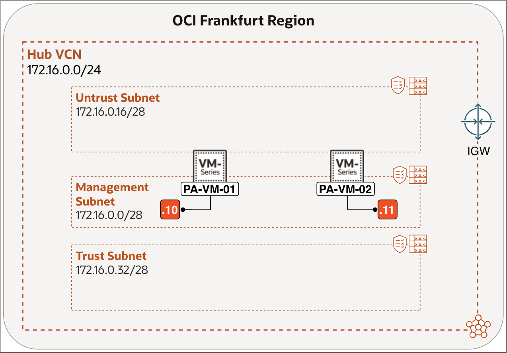

### Prerequisites

Before you begin, ensure you have completed the following:
- Complete the preceding required lab in this workshop.
- If you use BYOL, have a valid authorization code. Alternatively, you can select a PAYG image in Oracle Cloud Marketplace; no authorization code is required.

## Task 1: Deploy Two Palo Alto VM-Series from the Marketplace

When the VCN, the Subnets, Security Lists and Routing Tables are configured you can now deploy the Palo Alto Instances (VMs) from the OCI Marketplace.

Below is a table that contains the IP address information for the Instances.

|          | OCI Interface (VNIC) | OCI IPv4      | Palo Alto Interface | Palo Alto IPv4   |
| -------- | -------------------- | ------------- | ------------------- | ---------------- |
| PA-VM-01 | `vnic-management`    | `172.16.0.10` |                     | `172.16.0.10`    |
| PA-VM-01 | `vnic-untrust`       | `172.16.0.20` | ethernet1/1         | `172.16.0.20/28` |
| PA-VM-01 | `vnic-trust`         | `172.16.0.40` | ethernet1/2         | `172.16.0.40/28` |
|          |                      |               |                     |                  |
| PA-VM-02 | `vnic-management`    | `172.16.0.11` |                     | `172.16.0.11`    |
| PA-VM-02 | `vnic-untrust`       | `172.16.0.21` | ethernet1/1         | `172.16.0.21/28` |
| PA-VM-02 | `vnic-trust`         | `172.16.0.41` | ethernet1/2         | `172.16.0.41/28` |

Begin by deploying **PA-VM-01** from Oracle Cloud Marketplace.

1. Click on the **hamburger menu** in the top left corner.
2. Click on **Marketplace**.
3. Click on **All Applications**.

    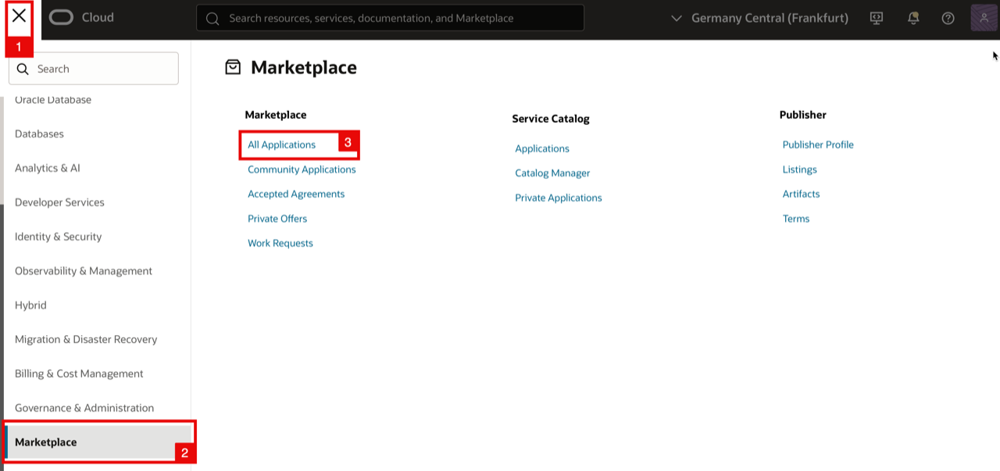

<!-- -->

1. Search for the **Palo Alto** Networks VM-Series Next Generation Firewall.
2. Click on the **Palo Alto Networks VM-Series Next Generation Firewall**. Make sure you select the BYOL image.

    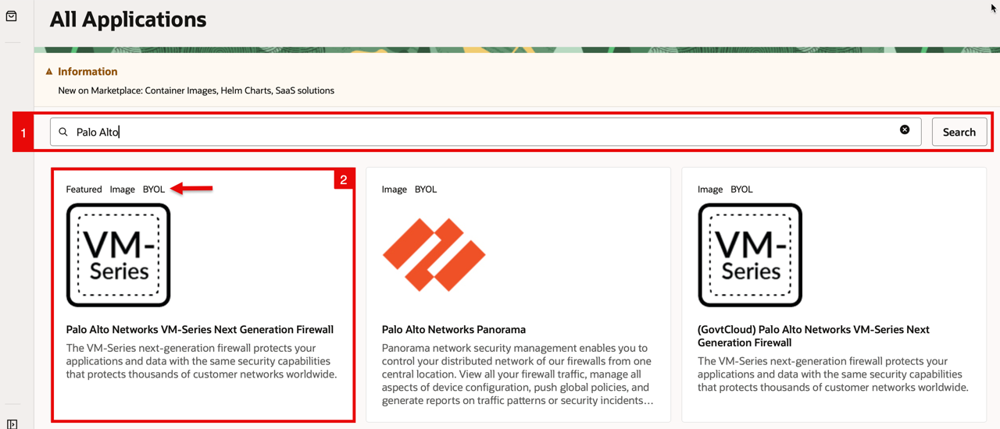

    > **Note:** This workshop demonstrates the BYOL deployment path, which uses an authorization code obtained from Palo Alto Networks. Alternatively, you can select a prelicensed PAYG image if usage-based licensing through OCI Marketplace is more suitable for you; PAYG does not require an authorization code.

    - Click on the **Launch Instance** button.

    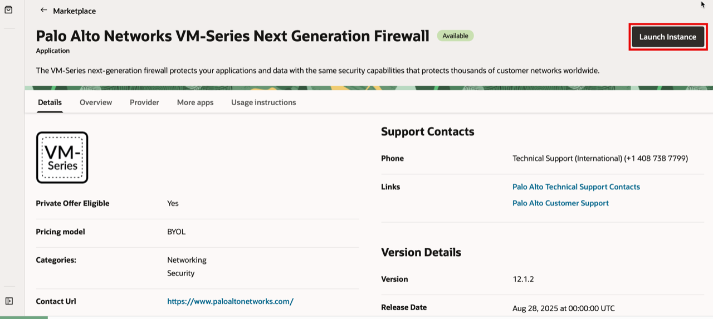

<!-- -->

1. Select a **version** (here we have selected 12.1.2).
2. Accept the **Oracle Terms of Use and Publisher terms and conditions**.
3. Click on the **Launch Instance** button.

    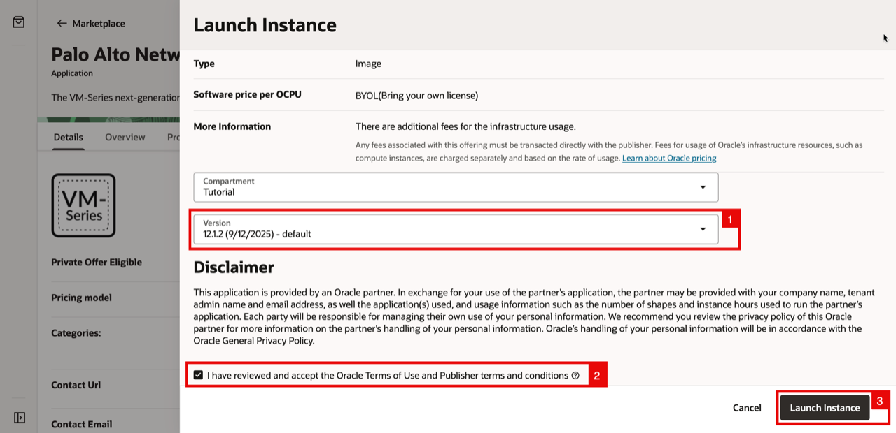

    - Notice you are in the **Basic information** section.
    - Specify a **name** for the Instance.

    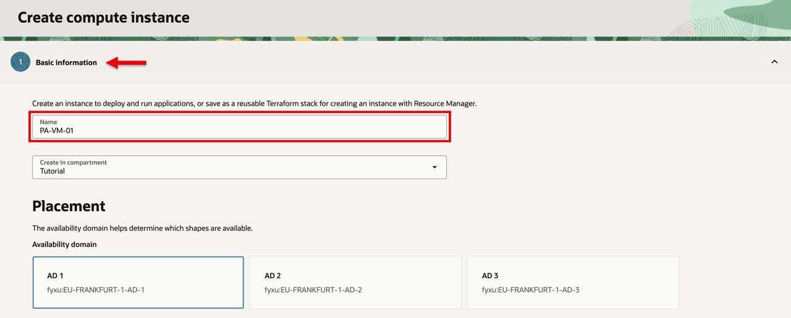

<!-- -->

1. Make sure the correct **image** is selected.
2. Select your **shape**.

    > **Note:** Choose a shape configuration that supports at least three VNICs. For the `VM.Optimized3.Flex` shape used in this workshop, select at least two OCPUs; this supports up to four VNICs. For other shapes, confirm the VNIC limit in the [OCI Compute Shapes documentation](https://docs.oracle.com/en-us/iaas/Content/Compute/References/computeshapes.htm).

    - In this example, I will select the Shape of the VM using an Intel processor **Optimized 3 Flex**.

    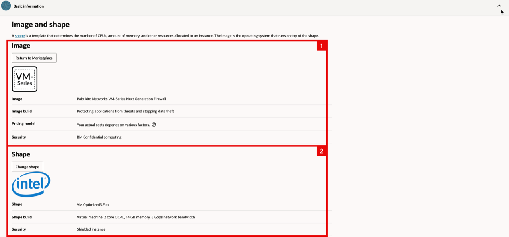

<!-- -->

1. Open the **advanced options** section.
2. For the initialization script, select **Paste cloud-init script** and paste the following:
    ```
    <copy>
    hostname=pa-vm-01
    authcodes=&lt;your palo alto authorization code&gt;
    </copy>
    ```

3. Click on the **Next** button.

    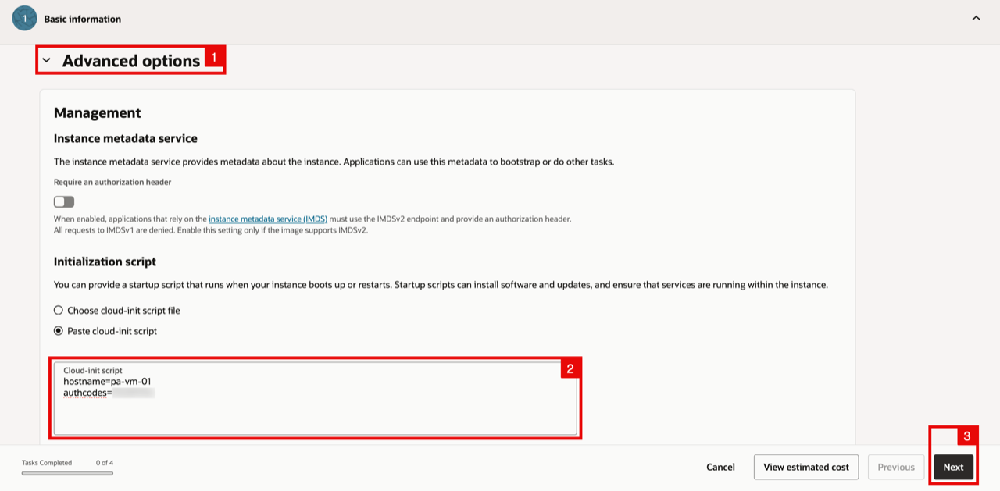

    - Notice you are in the **Security** section (keep everything default here).
    - Click on the **Next** button.

    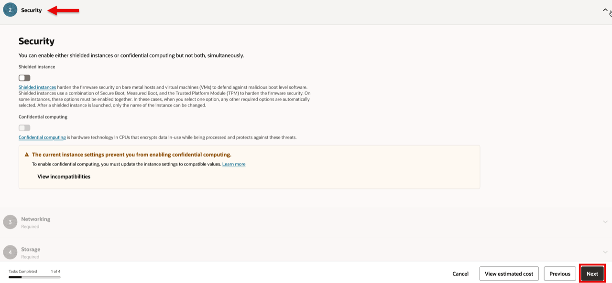

    - Notice you are in the **Networking** section.
<!-- -->

1. Specify a **VNIC name**.
2. For the **Primary network** select existing virtual network. 
3. Select the VCN called **Hub VCN**.
4. Select existing **Subnet**. 
5. Select the **Management Subnet**.

    - Scroll down.

    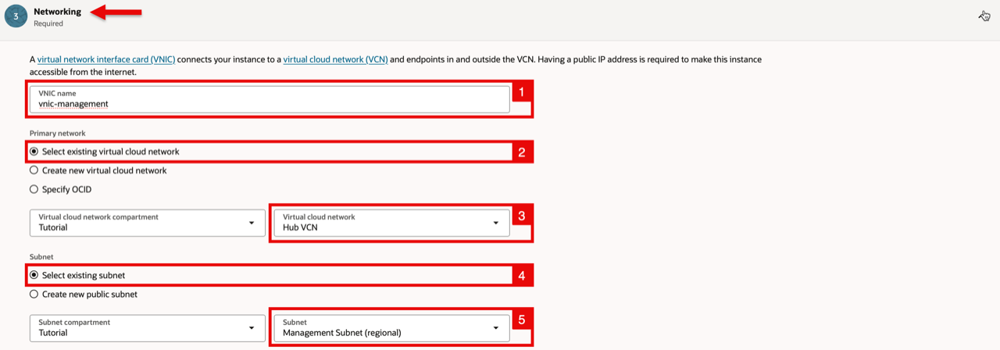

<!-- -->

1. For the **Private IPv4 address** select Manually assign private IPv4 address, and specify an IP address (**172.16.0.10**).
2. Enable **Automatically assign public IPv4 address**.

    - Scroll down

    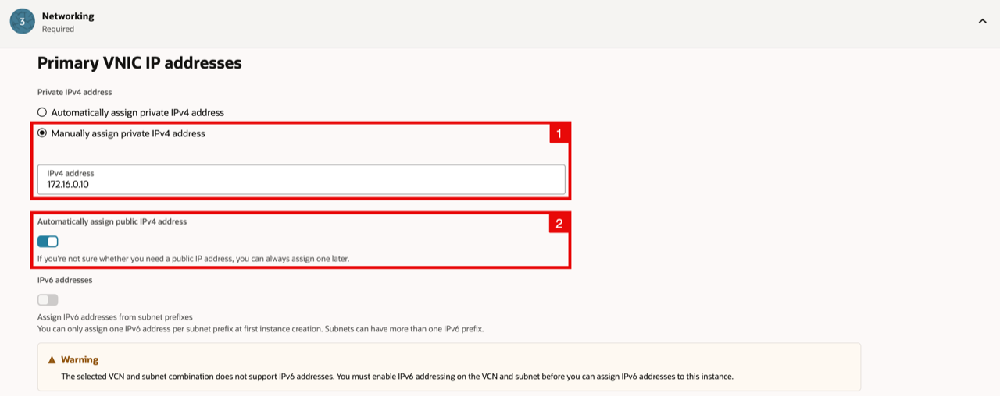

    - Generate an SSH key pair. An example using macOS is provided below.

    > **Note:** Use an RSA public/private key pair, not ECDSA.

<!-- -->

1. Create an RSA key pair with the command `ssh-keygen -t rsa`.
2. `Enter` to use the default path for the key pair storage.
3. `Enter` to not use a passphrase.
4. `Enter` (again) to not use a passphrase.
5. Notice that the key pair has been generated and stored.

    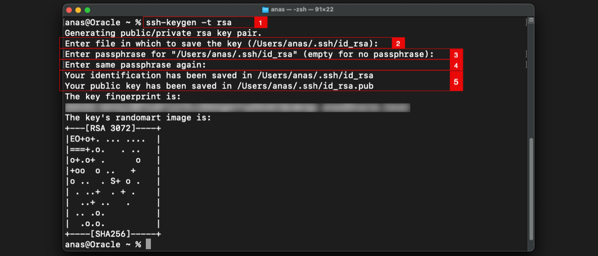

<!-- -->

1. Navigate to the directory using the command `cd .ssh`.
2. Make sure the files are present using the command `ls`.
3. Show the content of the public key with the command `cat id_rsa.pub`, and copy the content to your clipboard.

    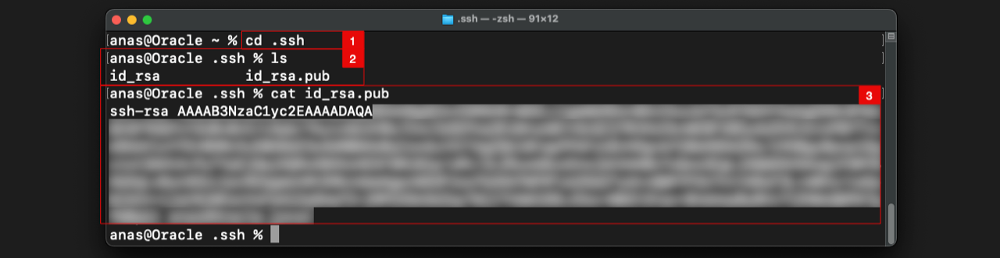

    - If you’re using Windows, you can generate the SSH key with PuTTY. Refer to this [workshop](https://docs.oracle.com/en/learn/oci-openvpn-part1/index.html#task-31-generate-ssh-key-pair-with-putty-key-generator-optional) for the steps.

<!-- -->

1. Back in the OCI Console. For the **SSH keys** select **Paste public key**.
2. Paste in the public key that you already have in your clipboard.
3. Click on the **Next** button.

    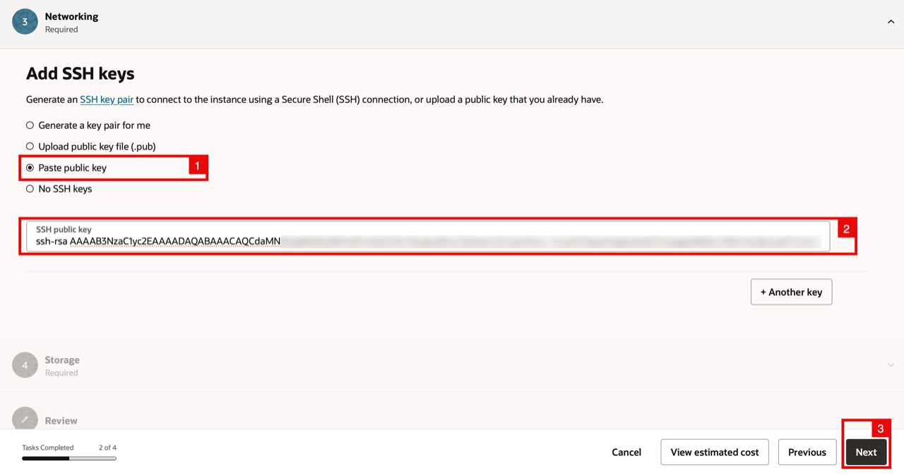

    - Notice you are in the **Storage** section (keep everything default here).
    - Click on the **Next** button.

    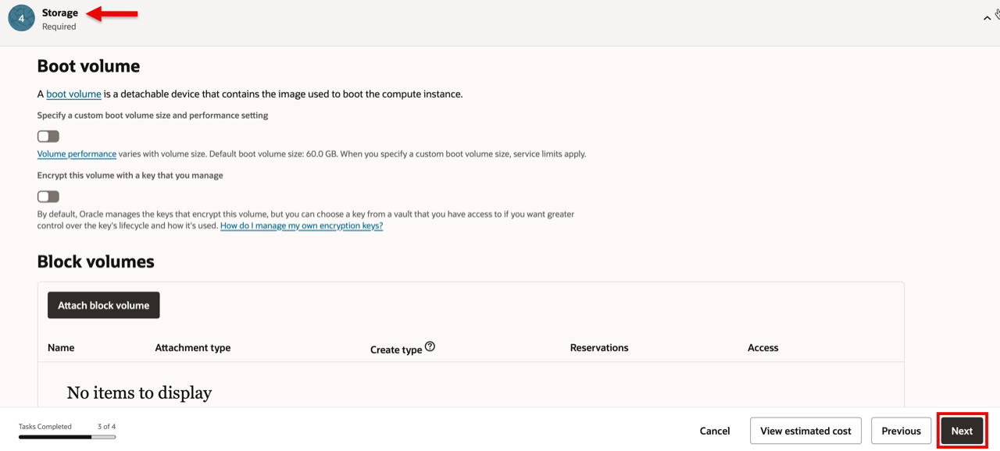

    - Notice you are in the **Review** section (review your settings and if you want to change anything click on the previous button).
    - Click on the **Create** button.

    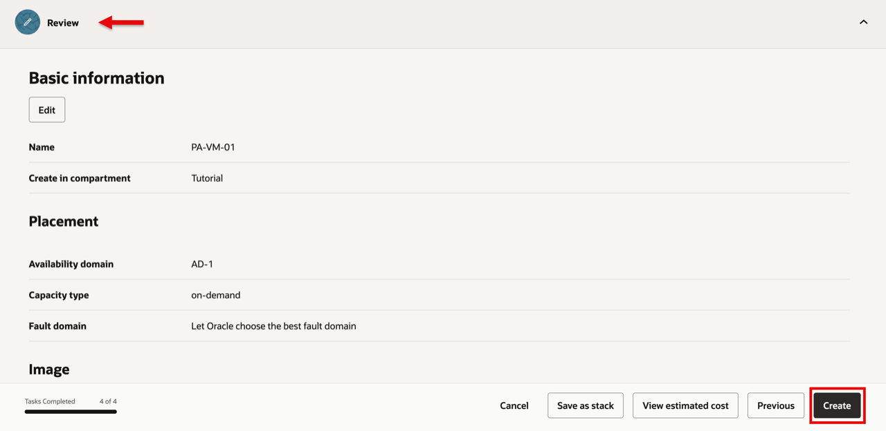

    - Notice that the Instance is **Provisioning** and the state is **In Progress**.
    - Wait for it to complete.

    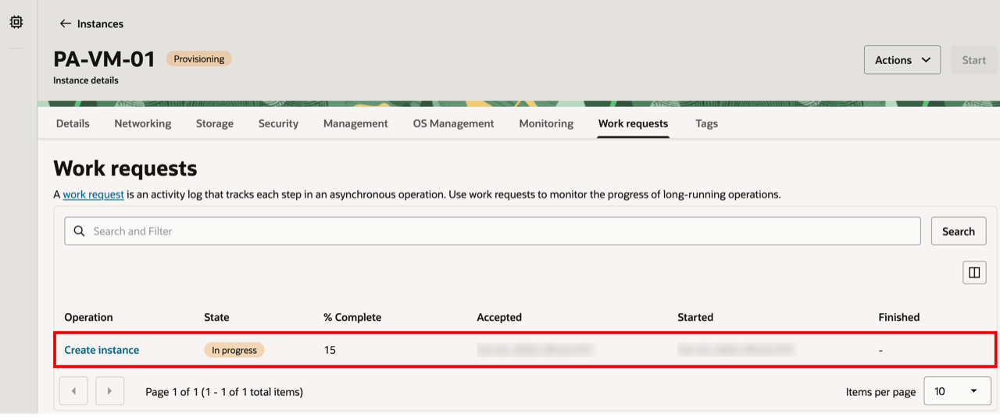

    - When the provisioning has been completed notice that the Instance is **Running** and the state is **Succeeded**.

    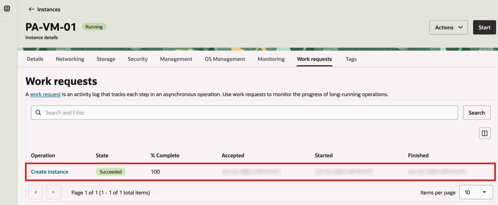

<!-- -->

1. Click on the **Networking** tab.
2. Notice the Public IPv4 address that OCI has assigned.
3. Notice the Private IPv4 address that you assigned.

    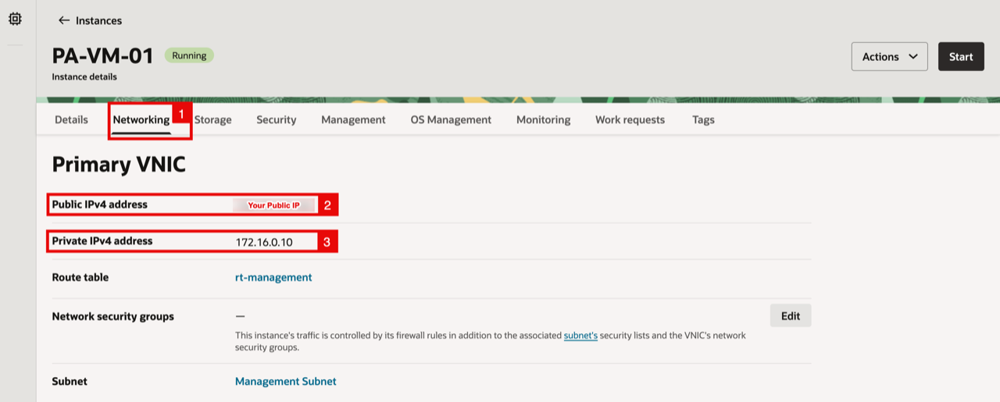

- Deploy a second Palo Alto VM (**PA-VM-02**) by repeating the exact steps shown above for the first Palo Alto VM deployment.
- Use the following parameters:
    - Instance Name: `PA-VM-02`.
    - Availability Domain: AD2 for HA (in case of deploying in a region with a single AD, then choose a different FD to achieve HA).
    - Hostname: `pa-vm-02`.
    - IP Address: `172.16.0.11`.

    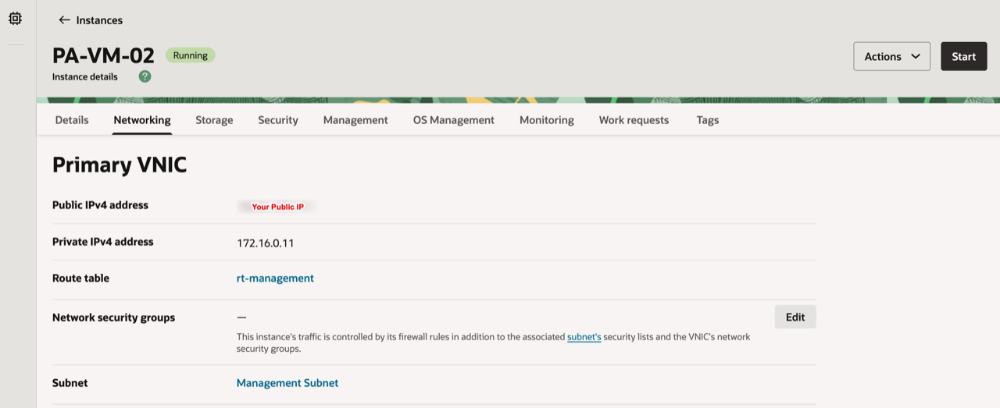

## Learn More

- [Launch an Instance from an Oracle Cloud Marketplace Image](https://docs.oracle.com/en-us/iaas/Content/Marketplace/Tasks/launch-instance.htm)
- [Deploy the VM-Series Firewall from the Oracle Cloud Marketplace](https://docs.paloaltonetworks.com/vm-series/deployment/public-cloud/set-up-the-vm-series-firewall-on-oracle-cloud-infrastructure/deploy-the-vm-series-firewall-on-oracle-cloud-marketplace)

## Acknowledgements

- **Authors** - Anas Abdallah, Iwan Hoogendoorn (Cloud Networking Black Belts)
- **Contributor** - Antonio Gámir (Cloud Networking Black Belt)
- **Last Updated By/Date** - Anas Abdallah, August 2026

You may now **proceed to the next lab**.
