# Configure Network Load Balancers (NLBs)

## Introduction

OCI Network Load Balancers (NLBs) distribute trust and untrust traffic across both Active/Active firewalls. This lab creates the private Trust and Untrust NLBs, registers the firewall data interfaces as backends, and configures the settings required for symmetric traffic flows.

The OCI NLB is a Layer 3/4 pass-through service that forwards traffic without terminating client connections, making it well suited to insert the VM-Series firewalls into the data path. With source/destination preservation enabled, the NLB retains the original packet headers and allows symmetric hashing to keep the forward and return packets of each flow on the same firewall backend. Without symmetric hashing, those packets can reach different firewalls; because the second firewall does not hold the session state, it can drop the traffic. Together, these settings maintain the session symmetry required for stateful inspection. For more detail, see the [Oracle Cloud Infrastructure blog on symmetric hashing](https://blogs.oracle.com/cloud-infrastructure/flexible-security-symmetric-hashing-oci-nlb).

Estimated time: 15 minutes

### Objectives

In this lab, you will:
- Configure the trust and untrust Network Load Balancers.
- Register both firewall data interfaces as NLB backends.
- Verify the NLB settings required for Active/Active traffic steering.

### Prerequisites

Before you begin, ensure you have completed the preceding required labs in this workshop.

## Task 1: Configure Trust Network Load Balancer (NLB)

Create the private **Trust NLB**, also referred to as the **internal NLB**. It provides the private-side inspection path and distributes traffic across the trust interfaces of both firewalls.

1. Select the correct **region**.
2. Click on the **hamburger menu** in the top left corner.

    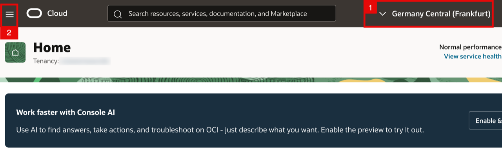

<!-- -->

1. Click on **Networking**.
2. Click on **Network load balancer**.

    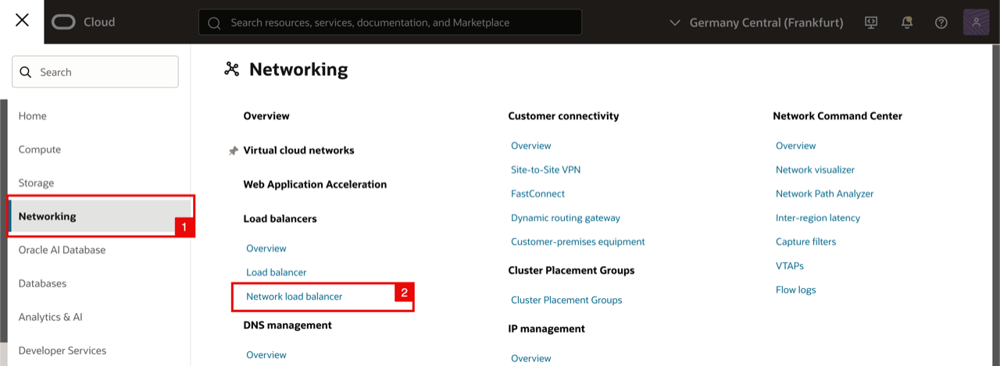

    - Click on the **Create network load balancer** button.

    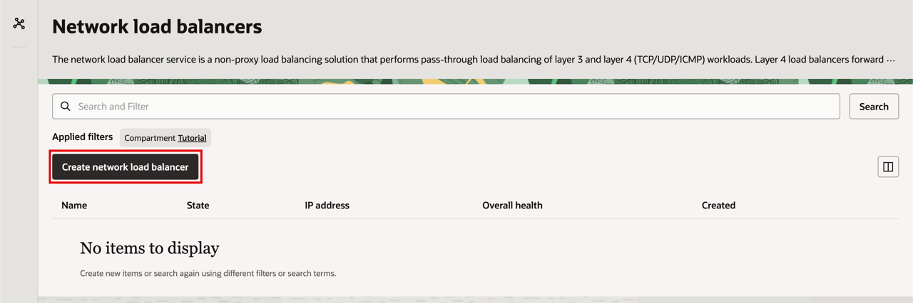

<!-- -->

1. Specify a **Network load balancer name**.
2. Select **Private**.

    

    - Scroll down.

<!-- -->

1. Enable **Source/destination header**.
2. Enable **Symmetric hashing**.

    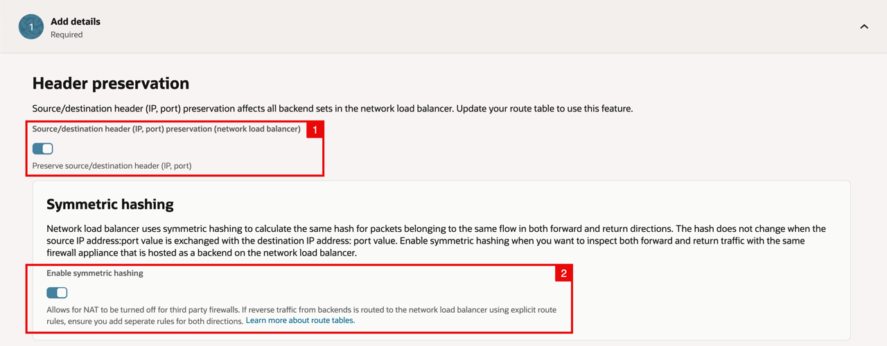

    - Scroll down.

<!-- -->

1. Select the VCN called **Hub VCN**.
2. Select existing (Trust) **Subnet**. 
3. Click on the **Next** button.

    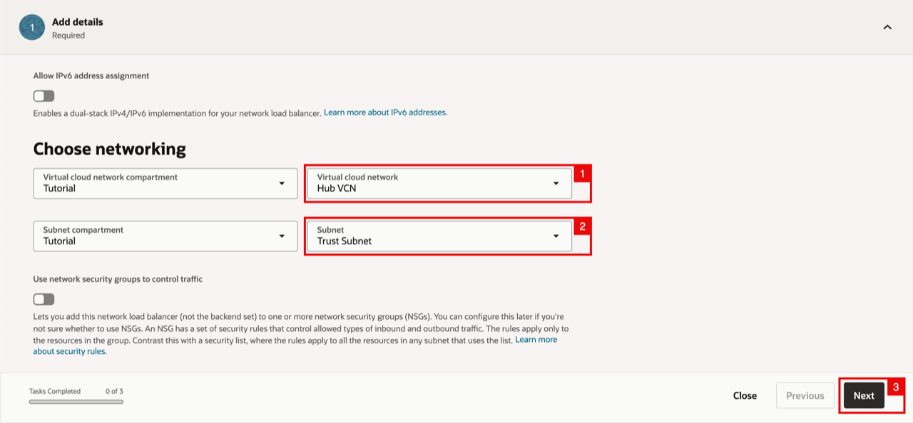

<!-- -->

1. Specify a **Listener name**.
2. Select UDP/TCP/ICMP for the **type of traffic the listener handles**.
3. Click on the **Next** button.

    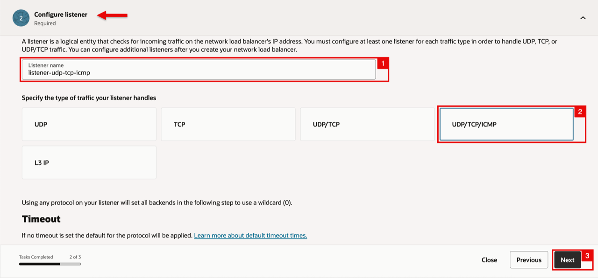

<!-- -->

1. Specify a **Backend set name**.
2. Select the **Default** mode.
3. Click the **Add backends** button. 

    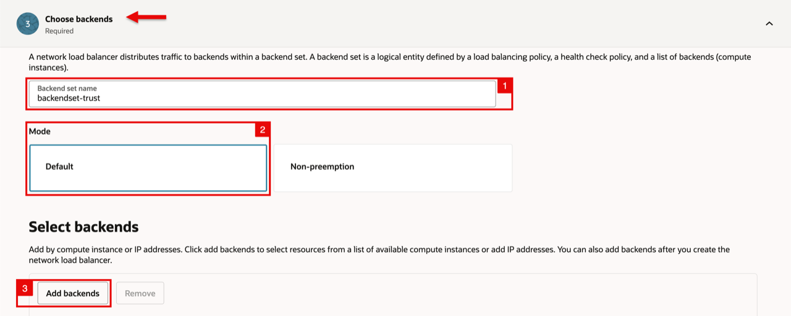

    - Select **Compute Instances**.

    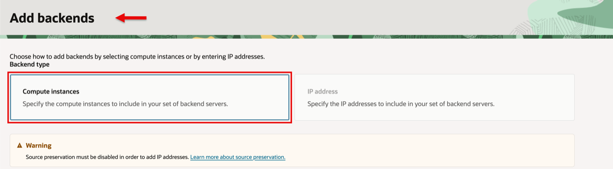

    - Scroll down.

<!-- -->

1. Select the first (PA-VM-01) **instance** as backend.
2. Select the (trusted) **IP address**.
3. Select the correct **Availability Domain** (AD1).
4. Select the **weight** (to be 1).
5. Click the **Add another backend** button. 

    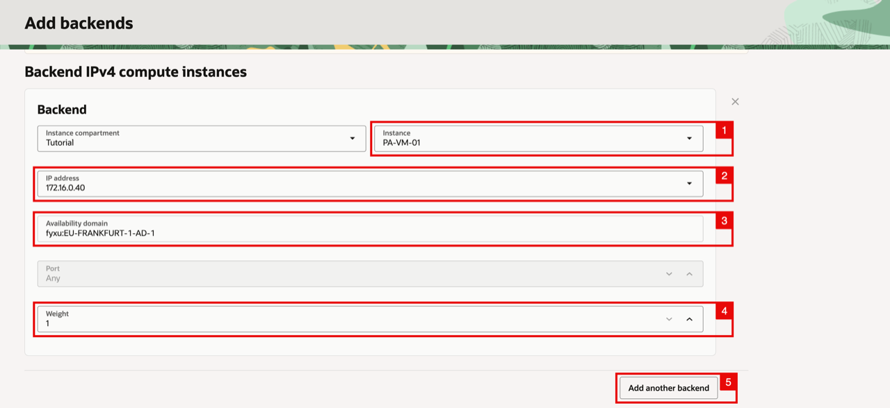

    - Scroll down.

<!-- -->

1. Select the second (PA-VM-02) **instance** as backend.
2. Select the (trusted) **IP address**.
3. Select the correct **Availability Domain** (AD2).
4. Select the **weight** (to be 1).
5. Click the **Add backends** button. 

    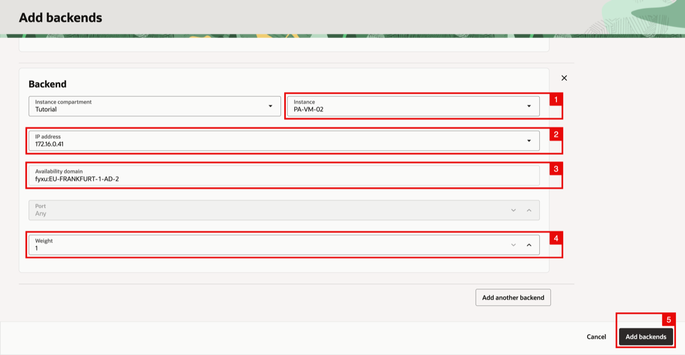

    - Notice that both Instances are added as a backend to the backend set.

    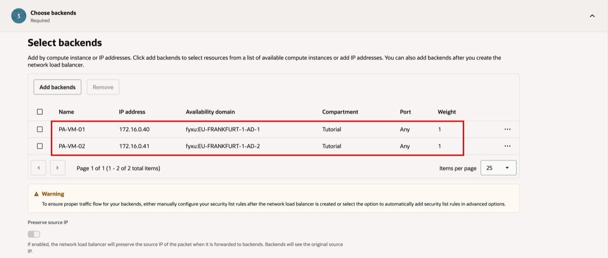

    - Scroll down to configure the health check policy.

<!-- -->

1. Select the **Protocol** to be HTTP.
2. Select the **Port** to be 80.
3. Select the **Interval in milliseconds** to be 10000 (default).
4. Select the **Timeout in milliseconds** to be 3000 (default).
5. Select the **Number of retries** to be 3 (default).

    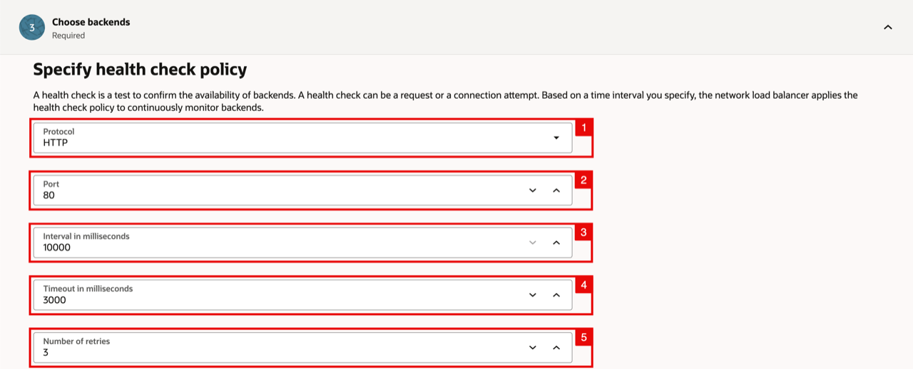

    - Scroll down.

<!-- -->

1. Select the **Status Code** to be 200 (default).
2. Select the **URL path (URI)** to be / (default).

    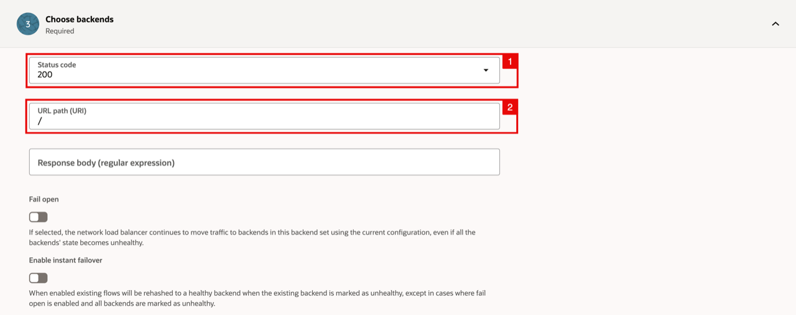

    - Scroll down.

<!-- -->

1. Select **Manually configure security list rules after the network load balancer is created**, because Lab 1 already configured the security list rules to allow all traffic.
2. Select the **policy** to be 5-tuple hash.
3. Click on the **Next** button.

    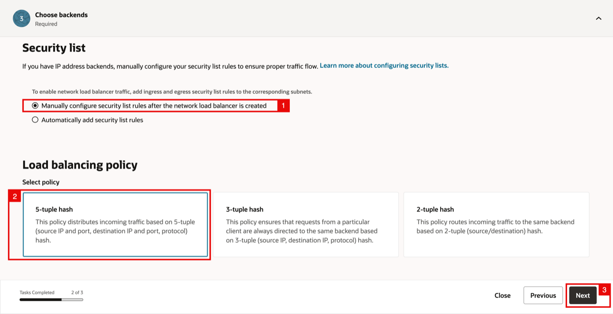

    - Notice you are in the **Review** section (review your settings and if you want to change anything click on the previous button).
    - Click on **Create network load balancer** button.

    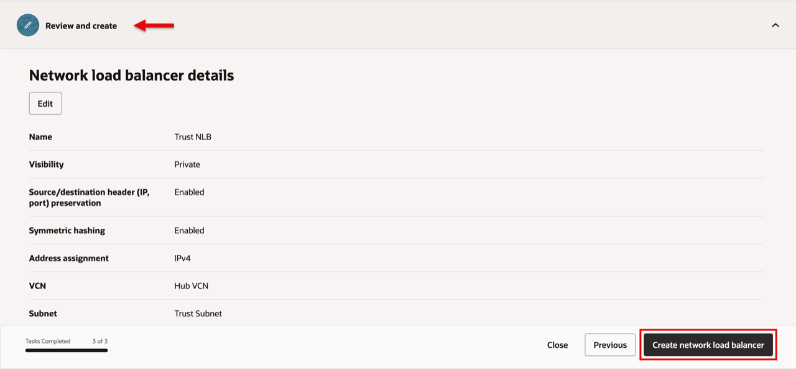

    - The Network Load Balancer is now being created.

    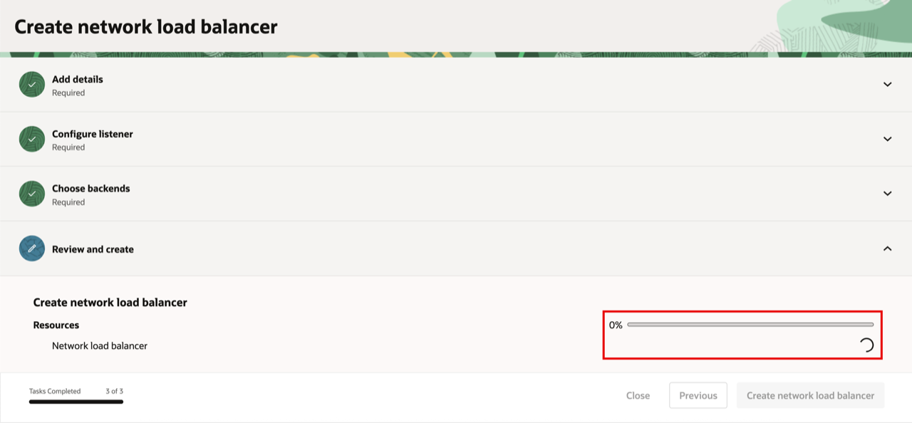

    - Notice that the **Overall health** will be Unknown in the beginning.

    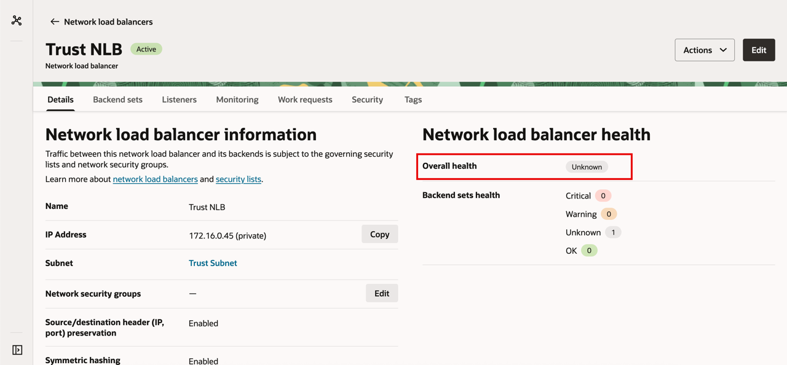

<!-- -->

1. After a few moments the **Overall health** will change form Unknown to OK.
2. Click on back to go **back** to the Network load balancer overview.

    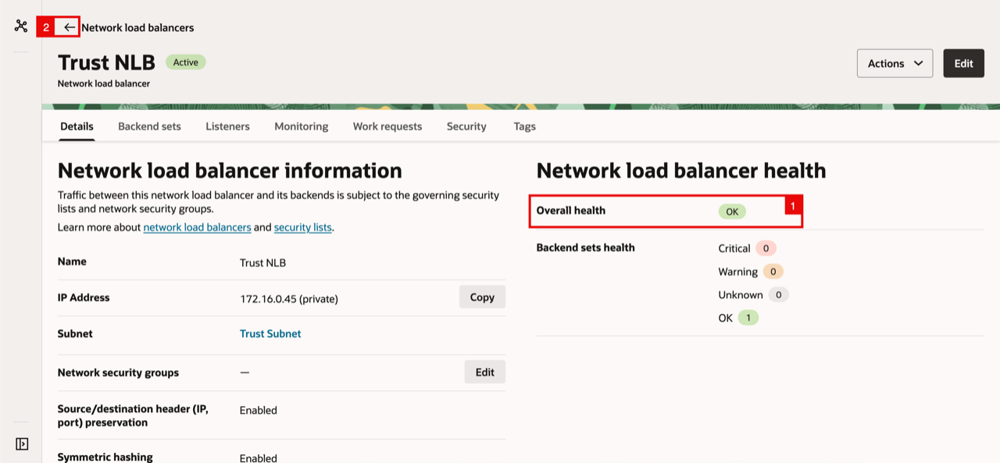

    > **Note:** Ensure that a management profile is created and assigned to the Trust interface (ethernet1/2) on both firewalls in Lab 4; otherwise, the Network Load Balancer health check will fail.

## Task 2: Configure Untrust Network Load Balancer (NLB)

Create the private **Untrust NLB**, also referred to as the **external NLB**. It provides the untrust-side inspection path and distributes traffic across the untrust interfaces of both firewalls.

- Click on the **Create network load balancer** button.

    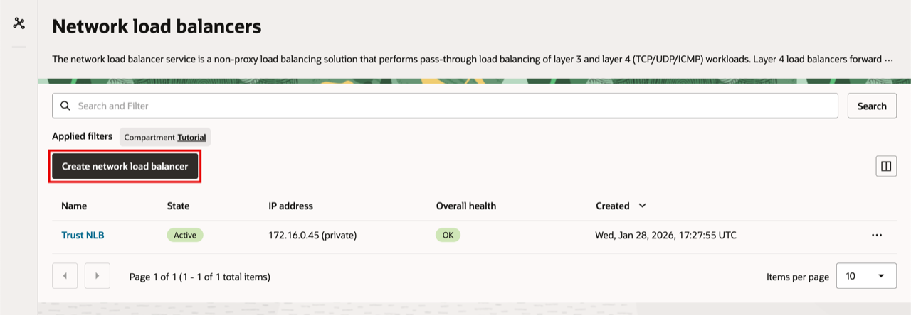

1. Specify a **Network load balancer name**.
2. Select **Private**.

    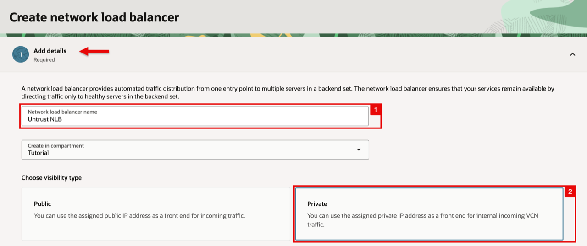

    - Scroll down.

<!-- -->

1. Enable **Source/destination header**.
2. Enable **Symmetric hashing**.

    

    - Scroll down.

<!-- -->

1. Select the VCN called **Hub VCN**.
2. Select existing (Untrust) **Subnet**. 
3. Click on the **Next** button.

    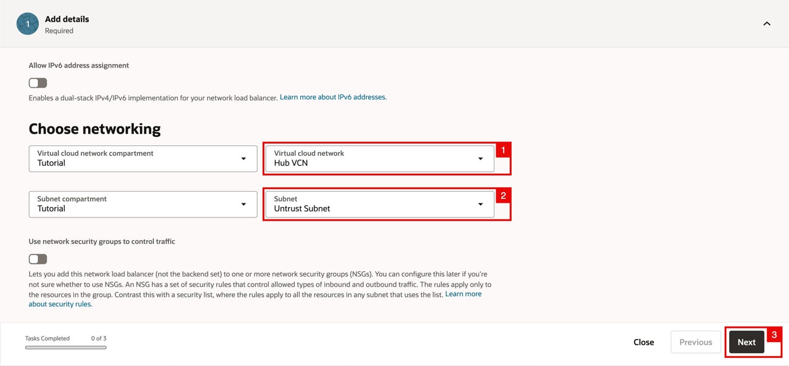

<!-- -->

1. Specify a **Listener name**.
2. Select UDP/TCP/ICMP for the **type of traffic the listener handles**.
3. Click on the **Next** button.

    

<!-- -->

1. Specify a **Backend set name**.
2. Select the **Default** mode.
3. Click the **Add backends** button. 

    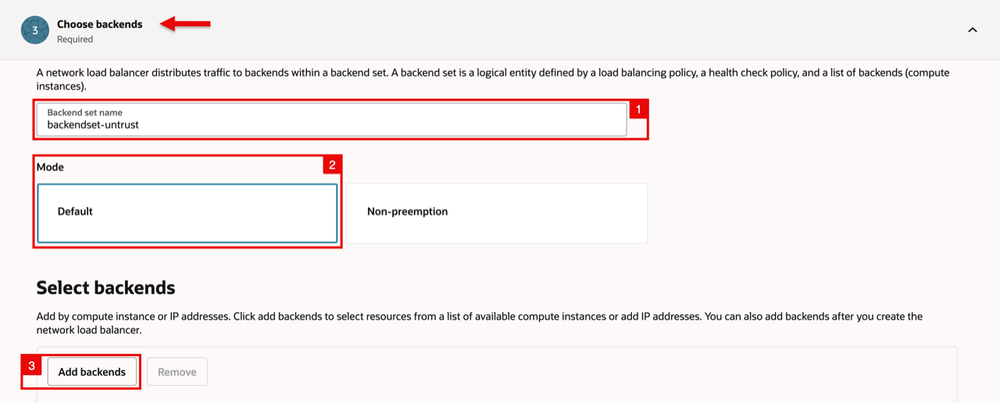

    - Select **Compute Instances**.

    

    - Scroll down.

<!-- -->

1. Select the first (PA-VM-01) **instance** as backend.
2. Select the (untrusted) **IP address**.
3. Select the correct **Availability Domain** (AD1).
4. Select the **weight** (to be 1).
5. Click the **Add another backend** button. 

    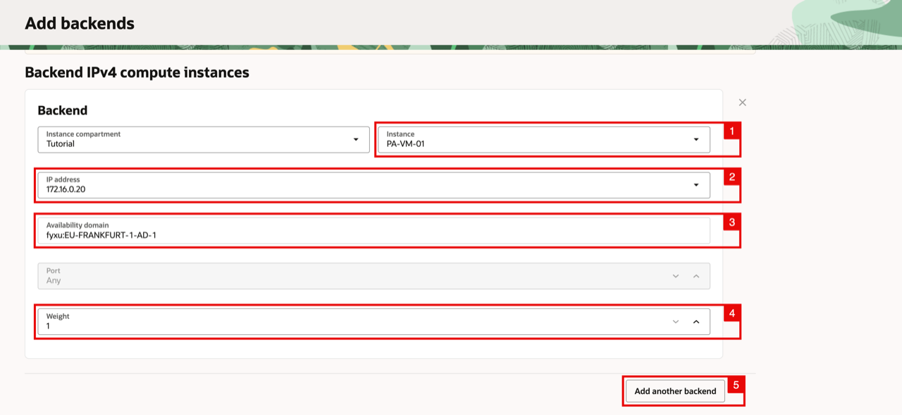

    - Scroll down.

<!-- -->

1. Select the second (PA-VM-02) **instance** as backend.
2. Select the (untrusted) **IP address**.
3. Select the correct **Availability Domain** (AD2).
4. Select the **weight** (to be 1).
5. Click the **Add backends** button. 

    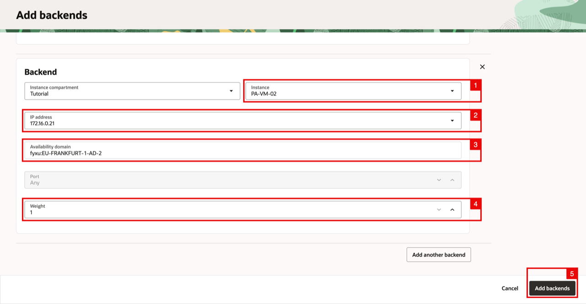

    - Notice that both Instances are added as a backend to the back end set.

    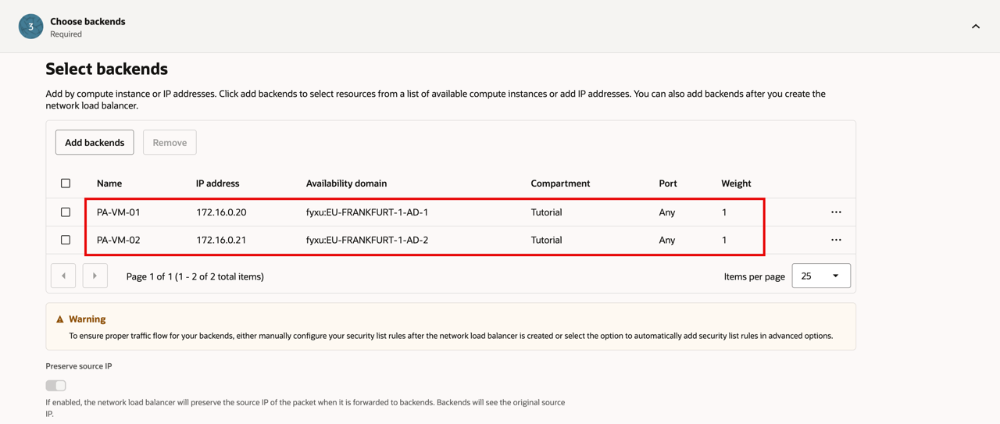

    - Scroll down to configure the health check policy.

<!-- -->

1. Select the **Protocol** to be HTTP.
2. Select the **Port** to be 80.
3. Select the **Interval in milliseconds** to be 10000 (default).
4. Select the **Timeout in milliseconds** to be 3000 (default).
5. Select the **Number of retries** to be 3 (default).

    

    - Scroll down.

<!-- -->

1. Select the **Status Code** to be 200 (default).
2. Select the **URL path (URI)** to be / (default).

    

    - Scroll down.

<!-- -->

1. Select **Manually configure security list rules after the network load balancer is created**, because Lab 1 already configured the security list rules to allow all traffic.
2. Select the **policy** to be 5-tuple hash.
3. Click on the **Next** button.

    

    - Notice you are in the **Review** section (review your settings and if you want to change anything click on the previous button).
    - Click on **Create network load balancer** button.

    

    - The Network Load Balancer is now being created.

    

    - Notice that the **Overall health** will be Unknown in the beginning.

    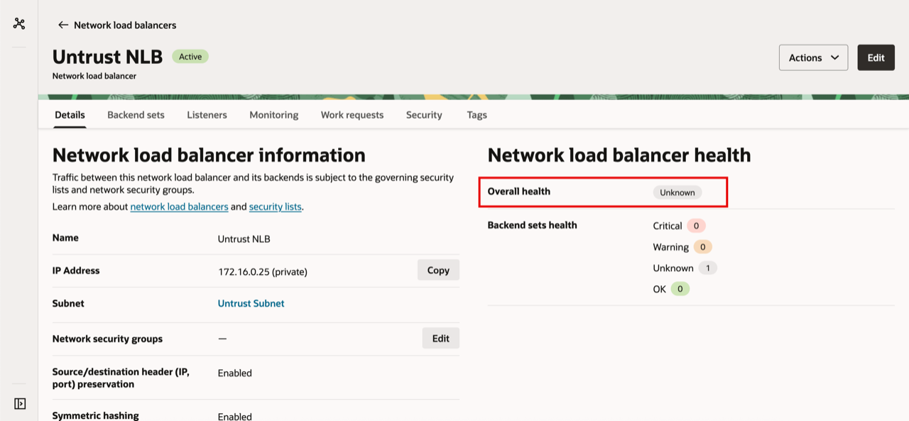

    - After a few moments the **Overall health** will change form Unknown to OK.

    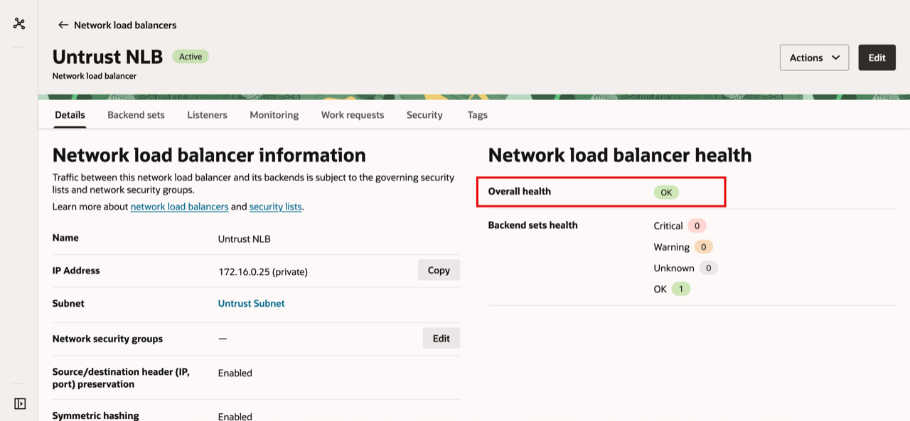

    > **Note:** Ensure that a management profile is created and assigned to the Untrust interface (ethernet1/1) on both firewalls in Lab 4; otherwise, the Network Load Balancer health check will fail.

## Learn More

- [Introduction to Network Load Balancer](https://docs.oracle.com/en-us/iaas/Content/NetworkLoadBalancer/introduction.htm)
- [Enabling Network Load Balancer Source/Destination Preservation](https://docs.oracle.com/en-us/iaas/Content/NetworkLoadBalancer/NetworkLoadBalancers/preserve-source-id.htm)
- [Creating a Network Load Balancer Backend Set](https://docs.oracle.com/en-us/iaas/Content/NetworkLoadBalancer/BackendSets/create-backend-set.htm)

## Acknowledgements

- **Authors** - Anas Abdallah, Iwan Hoogendoorn (Cloud Networking Black Belts)
- **Contributor** - Antonio Gámir (Cloud Networking Black Belt)
- **Last Updated By/Date** - Anas Abdallah, August 2026

You may now **proceed to the next lab**.
