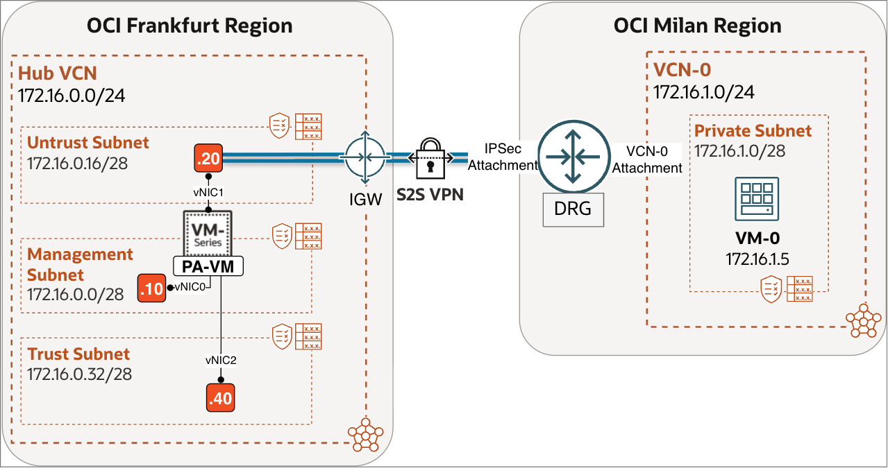
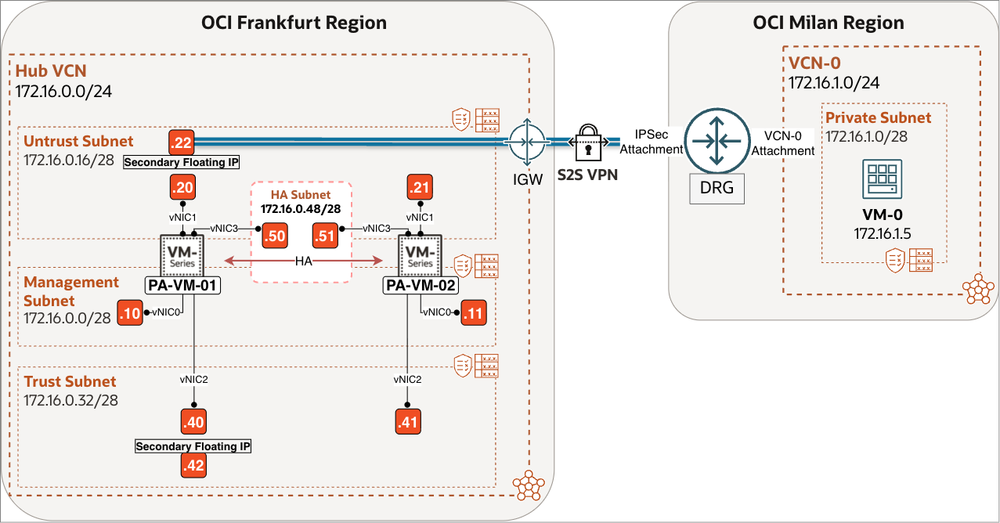
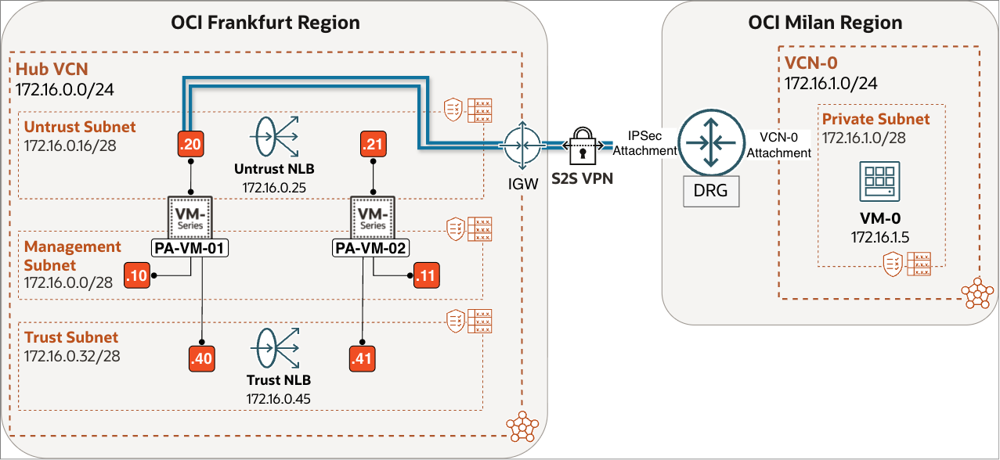
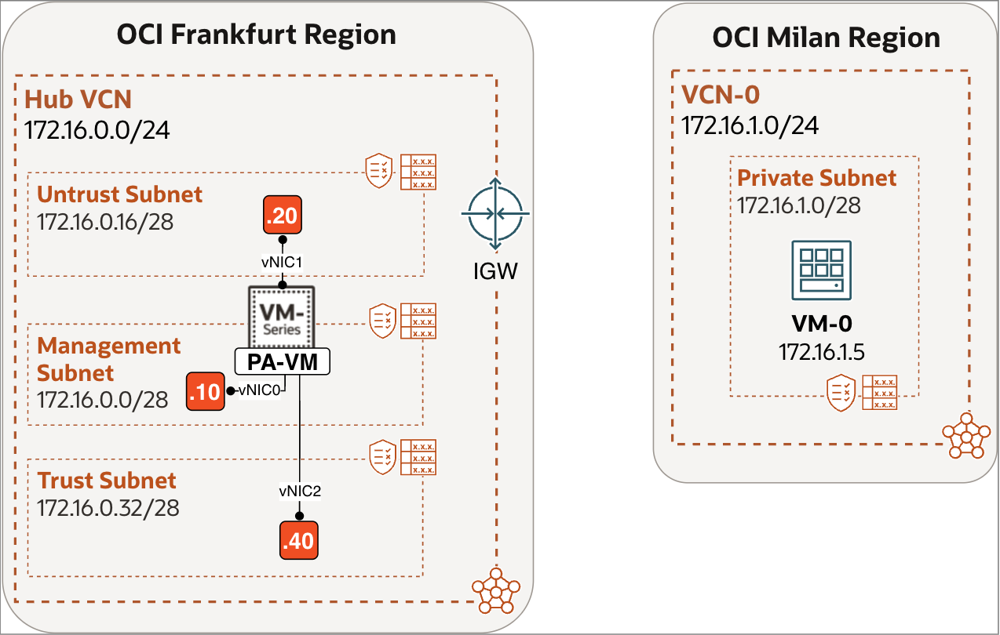
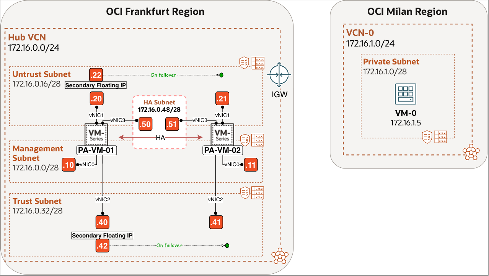
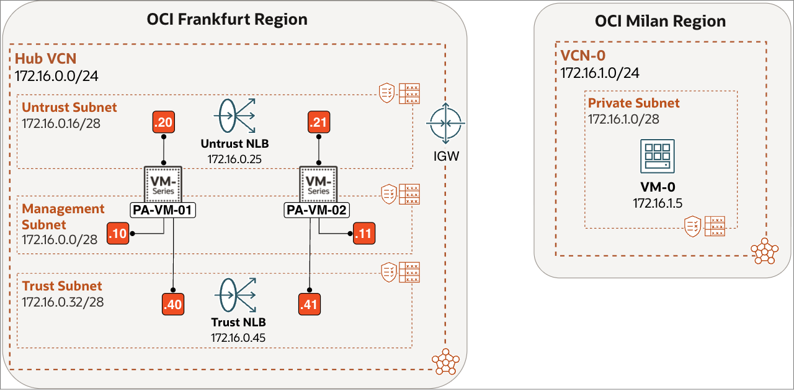

# Introduction

## About this Workshop

Organizations often need to connect OCI workloads securely to customer networks, branch locations, data centers, or other cloud environments. This workshop shows how to use a Palo Alto Networks Next-Generation Firewall (NGFW) in OCI as the Site-to-Site IPSec VPN endpoint for that connectivity. The outcome is a secure, working VPN on the Palo Alto firewall in Frankfurt, ready to connect OCI workloads to remote customer networks.

For the workshop demonstration, the remote peer is OCI-native Site-to-Site VPN in the Milan region, attached to a DRG. Milan is only a representative remote environment used to terminate and test the tunnel. In a customer deployment, that remote endpoint can instead be an on-premises network, another cloud provider, or a different OCI environment.

> **Note:** OCI inter-region traffic (via Remote Peering Connection over the DRG) already traverses the Oracle backbone and is encrypted using MACsec, so IPSec is not really needed for encryption between OCI regions.

The workshop explains how this connectivity is implemented for three Palo Alto deployment models in the Frankfurt region:
- **Single Instance Setup** – one standalone NGFW.
- **Active/Passive Setup** – two NGFW instances in high availability mode.
- **Active/Active Setup** – two NGFW instances forwarding traffic simultaneously.

Estimated Workshop Time: 75 minutes

### Objectives

In this workshop, you will:
- Configure a Palo Alto NGFW in **Frankfurt** as an IPSec VPN peer.
- Configure IKE/IPsec parameters, tunnel interfaces, and static routing on the firewall.
- Configure tunnel interfaces and static routing on the Palo Alto firewall.
- Create an OCI-native Site-to-Site VPN in **Milan** as the demonstration peer.
- Validate tunnel status and end-to-end workload connectivity.

#### **Demonstration Remote Site:**

In Milan Region, VCN-0 (172.16.1.0/24) is attached to Dynamic Routing Gateway (DRG). The DRG terminates the OCI-native Site-to-Site VPN and provides connectivity into the private subnet 172.16.1.0/28, where a sample workload VM (172.16.1.5) resides. The following sections show how the Frankfurt Palo Alto VPN endpoint is implemented differently for Single Instance, Active/Passive, and Active/Active deployments.

#### **Single Instance Setup:**

This Single Instance design represents the simplest functional topology. It is ideal for proof-of-concept environments, labs, and small production deployments where simplicity is prioritized over redundancy.

**OCI Frankfurt Region**
A single Palo Alto VM-Series firewall is deployed inside a Hub VCN (172.16.0.0/24) using a three-interface design:
- Management Subnet (172.16.0.0/28) – for firewall administration.
- Untrust Subnet (172.16.0.16/28) – facing the Internet Gateway (IGW) and used as the VPN tunnel endpoint. It provides external reachability for establishing the IPsec tunnel toward the OCI VPN endpoint in Milan.
- Trust Subnet (172.16.0.32/28) – facing internal workloads and routing toward protected networks.

#### **Active/Passive Setup:**

This Active/Passive design provides firewall high availability while keeping the VPN topology simple. One firewall terminates and forwards VPN traffic; the passive peer takes over if the active firewall fails.

**OCI Frankfurt Region**
Two Palo Alto VM-Series firewalls (PA-VM-01 and PA-VM-02) are deployed in a Hub VCN (172.16.0.0/24) as an HA pair. The active firewall uses floating addresses on the Untrust and Trust interfaces; these move to the passive firewall during failover to preserve the VPN endpoint and internal next-hop routing.

Each firewall uses a four-interface design:
- Management Subnet (172.16.0.0/28) – for firewall administration.
- Untrust Subnet (172.16.0.16/28) – facing the Internet Gateway (IGW) and used as the VPN tunnel endpoint. It provides external reachability for establishing the IPsec tunnel toward the OCI VPN endpoint in Milan.
- Trust Subnet (172.16.0.32/28) – facing internal workloads and routing toward protected networks.
- HA Subnet (172.16.0.48/28) – synchronization between the two firewalls

#### **Active/Active Setup:**

This Active/Active design allows both firewalls to forward traffic. Each firewall terminates its own IPSec tunnels directly on its Untrust interface; a single IPSec tunnel is not load-balanced through the OCI Network Load Balancer.

**OCI Frankfurt Region**
Two Palo Alto VM-Series firewalls (PA-VM-01 and PA-VM-02) are deployed in a Hub VCN (172.16.0.0/24) as an Active/Active pair. Each firewall maintains its own session state, so traffic must remain symmetric. Separate tunnel pairs provide VPN connectivity for each firewall.

Each firewall uses a three-interface design:
- Management Subnet (172.16.0.0/28) – for firewall administration.
- Untrust Subnet (172.16.0.16/28) – facing the Internet Gateway (IGW) and used as the VPN tunnel endpoint. It provides external reachability for establishing the IPsec tunnel toward the OCI VPN endpoint in Milan.
- Trust Subnet (172.16.0.32/28) – facing internal workloads and routing toward protected networks.

### Prerequisites

#### **Single Instance Setup:**

Before starting this lab, ensure the following prerequisites are completed:

1. Complete [Deploy Palo Alto NGFW in OCI (Standalone)](https://livelabs.oracle.com/ords/dbpm/r/livelabs/view-workshop?wid=4487). This workshop deploys the baseline Palo Alto VM-Series firewall in OCI Frankfurt, including the Hub VCN, subnets, Internet Gateway, and base firewall configuration.

2. Create a single test VM in the **OCI Milan region** inside a private subnet of **VCN-0**. Use the following settings:

    | Component     | Configuration                     |
    | ------------- | --------------------------------- |
    | Subnet        | Private Subnet (VCN-0)            |
    | CIDR          | 172.16.1.0/28                     |
    | Route Table   | `Default Route Table for VCN-0`   |
    | Security List | `Default Security List for VCN-0` |

    - This VM will be used to validate end-to-end connectivity across the Site-to-Site VPN.

3. Ensure you have:
    - OCI tenancy administrator or equivalent networking privileges
    - SSH access to the test VM in Milan
    - Administrative access to the Palo Alto firewall in Frankfurt

#### **Active/Passive Setup:**

Before starting this lab, ensure the following prerequisites are completed:

<!-- -->

1. Complete [Deploy Palo Alto NGFW in OCI with Active/Passive HA](https://livelabs.oracle.com/ords/dbpm/r/livelabs/view-workshop?wid=4492). This workshop deploys two Palo Alto VM-Series firewalls in OCI Frankfurt configured as an Active/Passive HA pair, in addition to the base firewall configuration.

2. Create a single test VM in the **OCI Milan region** inside a private subnet of **VCN-0**. Use the following settings:

    | Component     | Configuration                     |
    | ------------- | --------------------------------- |
    | Subnet        | Private Subnet (VCN-0)            |
    | CIDR          | 172.16.1.0/28                     |
    | Route Table   | `Default Route Table for VCN-0`   |
    | Security List | `Default Security List for VCN-0` |

    - This VM will be used to validate end-to-end connectivity across the Site-to-Site VPN.

3. Ensure you have:
    - OCI tenancy administrator or equivalent networking privileges
    - SSH access to the test VM in Milan
    - Administrative access to both Palo Alto firewalls in Frankfurt

#### **Active/Active Setup:**

Before starting this lab, ensure the following prerequisites are completed:

<!-- -->

1. Complete [Deploy Palo Alto NGFW in OCI with Active/Active HA](https://livelabs.oracle.com/ords/dbpm/r/livelabs/view-workshop?wid=4493). This workshop deploys two Palo Alto VM-Series firewalls in OCI Frankfurt configured as an **Active/Active HA pair**, in addition to the base firewall configuration.

2. Create a single test VM in the **OCI Milan region** inside a private subnet of **VCN-0**. Use the following settings:

    | Component     | Configuration                     |
    | ------------- | --------------------------------- |
    | Subnet        | Private Subnet (VCN-0)            |
    | CIDR          | 172.16.1.0/28                     |
    | Route Table   | `Default Route Table for VCN-0`   |
    | Security List | `Default Security List for VCN-0` |

    - This VM will be used to validate end-to-end connectivity across the Site-to-Site VPN.

3. Ensure you have:
    - OCI tenancy administrator or equivalent networking privileges
    - SSH access to the test VM in Milan
    - Administrative access to both Palo Alto firewalls in Frankfurt

## Learn More

- [Palo Alto Networks Site-to-Site VPN Overview](https://docs.paloaltonetworks.com/network-security/ipsec-vpn/administration/get-started-with-ipsec-vpn-site-to-site/site-to-site-vpn-overview)
- [OCI Site-to-Site VPN Overview](https://docs.oracle.com/en-us/iaas/Content/Network/Tasks/overviewIPsec.htm)
- [OCI Site-to-Site VPN (IPSec) Best Practices](https://docs.oracle.com/en-us/iaas/Content/Resources/Assets/whitepapers/ipsec-vpn-best-practices.pdf)
- [Setting Up Site-to-Site VPN in OCI (Overall Process)](https://docs.oracle.com/en-us/iaas/Content/Network/Tasks/settingupIPsec.htm)

## Acknowledgements

- **Authors** - Anas Abdallah, Iwan Hoogendoorn (Cloud Networking Black Belts)
- **Contributor** - Antonio Gámir (Cloud Networking Black Belt)
- **Last Updated By/Date** - Anas Abdallah, August 2026
