# Setup Site-to-Site VPN in Milan Region (OCI Native Service in Milan)

## Introduction

This lab prepares OCI Milan as a stand-in for a customer remote site. In a real deployment, that site would more commonly be an on-premises network or another cloud environment; Milan’s OCI-native Site-to-Site VPN is used here only as a convenient demonstration peer for the Palo Alto firewall in Frankfurt. If you already have another suitable remote VPN site, you can skip this lab and use it instead.

If your goal is only to learn how to establish an OCI native Site-to-Site IPSec VPN, you can complete this lab independently, without completing the other workshop labs.

Estimated time: 25 minutes

### Objectives

In this lab, you will:
- Configure the Milan VCN, DRG, and route tables, and enable ECMP on the DRG route table.
- Create the Customer-Premises Equipment (CPE) object for the Palo Alto firewall.
- Create the OCI IPSec connection and collect its tunnel information for the Palo Alto configuration.

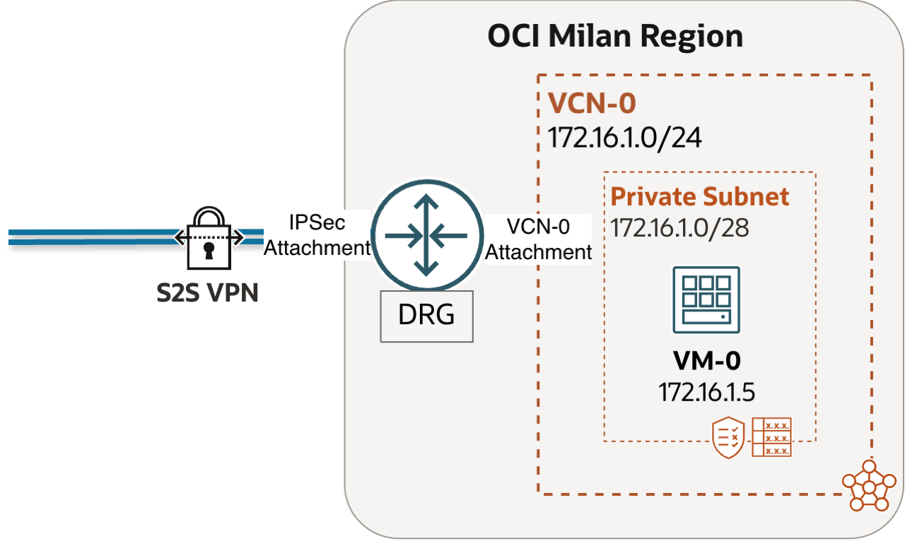

### Prerequisites

Before you begin, ensure you have the required OCI environment in Milan, as below.

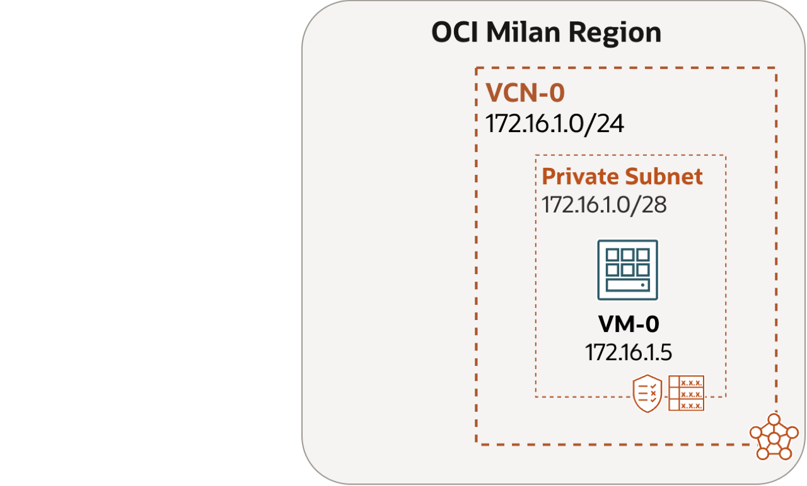

## Task 1: Create DRG and Validate Routing Configuration

You will start by creating a **Dynamic Routing Gateway (DRG)** and validating basic routing configuration to ensure traffic can correctly enter and exit the VCN. This step provides the baseline connectivity required for subsequent firewall integration, high-availability designs, and advanced routing scenarios later in the workshop.

1. Select the **OCI Region**.
2. Click on the **hamburger menu** in the top left corner.
    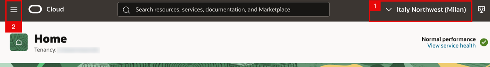

<!-- -->

1. Click on **Networking**.
2. Click on **Dynamic routing gateway**.
    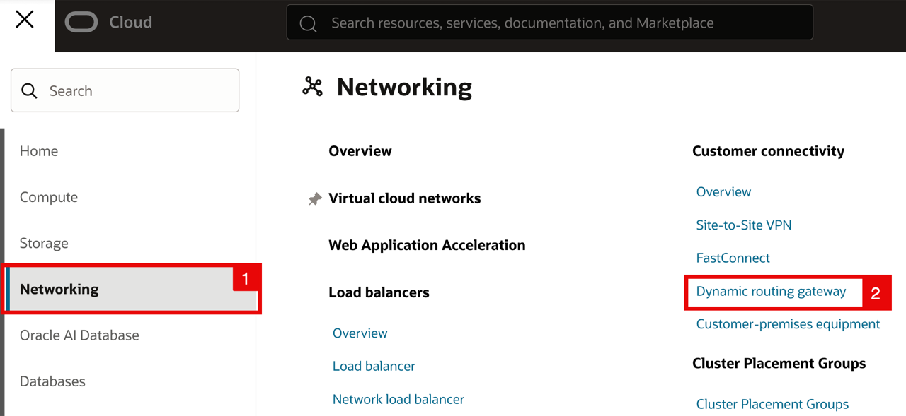

    - Click on the **Create dynamic routing gateway** button.

    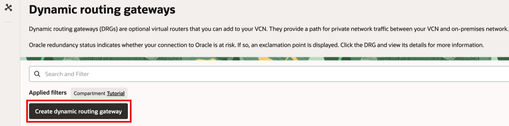

<!-- -->

1. Specify a **name** for the DRG.
2. Click on the **Create dynamic routing gateway** button.

    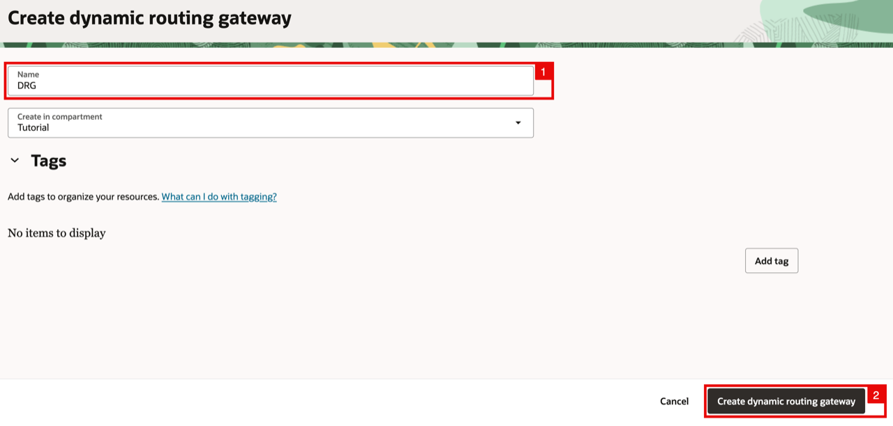

<!-- -->

1. Click on **Attachments**.
2. Click on the **Create virtual cloud network attachment** button.

    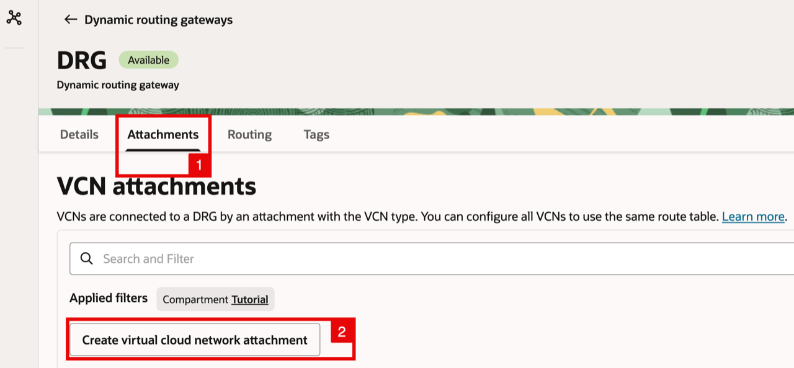

<!-- -->

1. Specify an **name** for the attachment.
2. Select the **Virtual cloud network** (VCN-0).
3. Leave the **DRG routing table** to the default autogenerated routing table.
4. Leave the **VCN routing table** to the default (none).
5. Click on the **Create VCN attachment** button.

    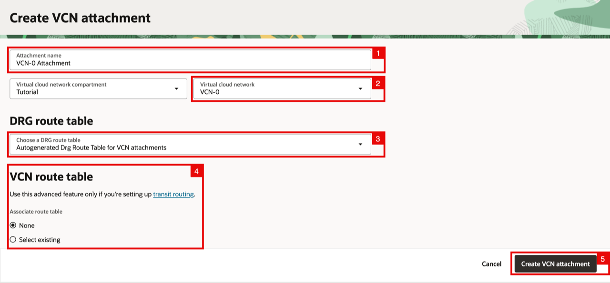

    - Notice that the VCN Attachment has been created.

    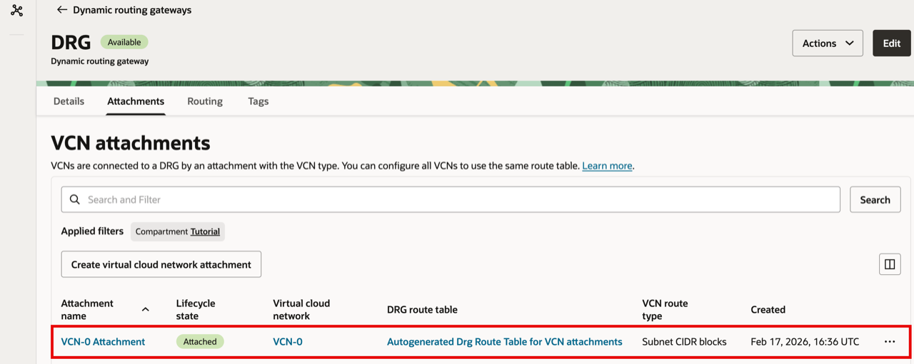

    - Click on the default Autogenerated DRG Routing table.

    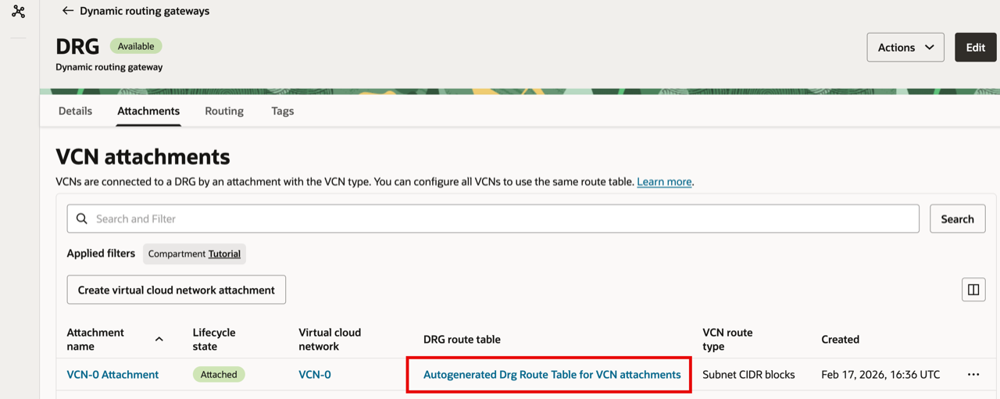

    Since the IPSec connection includes two tunnels, we will enable [ECMP (Equal-Cost Multi-Path)](https://docs.oracle.com/en-us/iaas/Content/Network/Tasks/managingDRGs.htm#overview) to load-balance traffic across the equal-cost paths and provide fast failover if one tunnel becomes unavailable. This setting is enabled on the DRG route table associated with the VCN attachment. It allows VCN traffic to use both IPSec tunnels as equal-cost paths.

<!-- -->

1. Notice that by default, **ECMP is disabled**.
2. Click on the **Actions** button.
3. Click on **Edit**.

    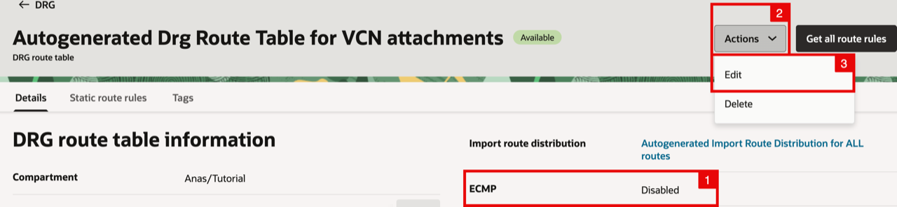

<!-- -->

1. Turn the switch on to **Enable ECMP**.
2. Click on the **Save changes** button.

    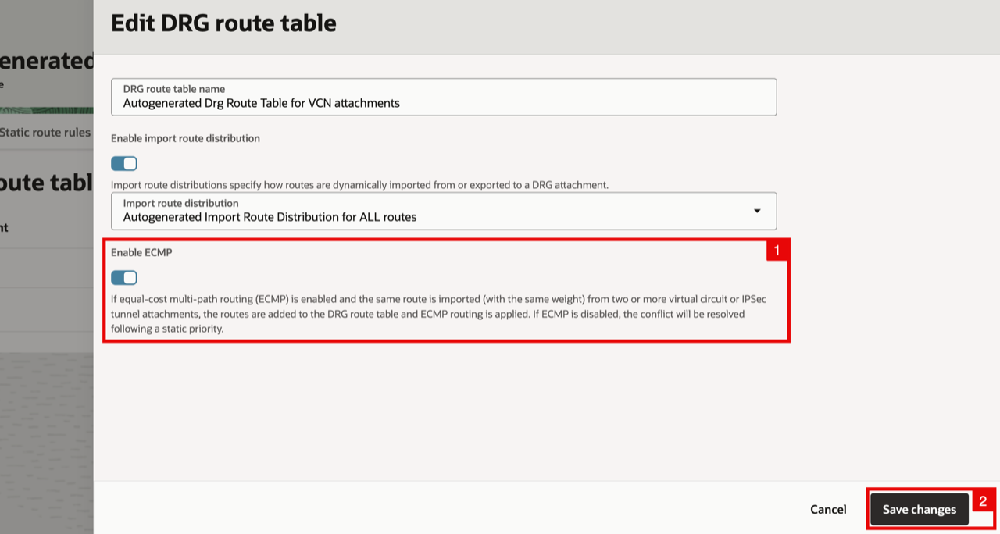

<!-- -->

1. Notice that **ECMP is enabled**.
2. Click on the **Get all route rules** button.
    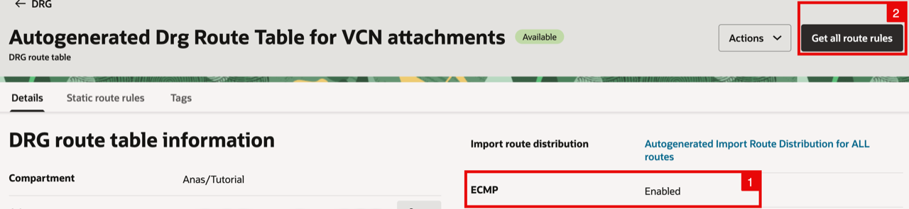

<!-- -->

1. Notice that at this stage there are no routes to on-premises, only the private subnet in VCN-0 is learned.
        - Frankfurt Hub network CIDRs will be populated once we finish IPSec creation successfully (Lab 2).
2. Click on the **Close** button.

    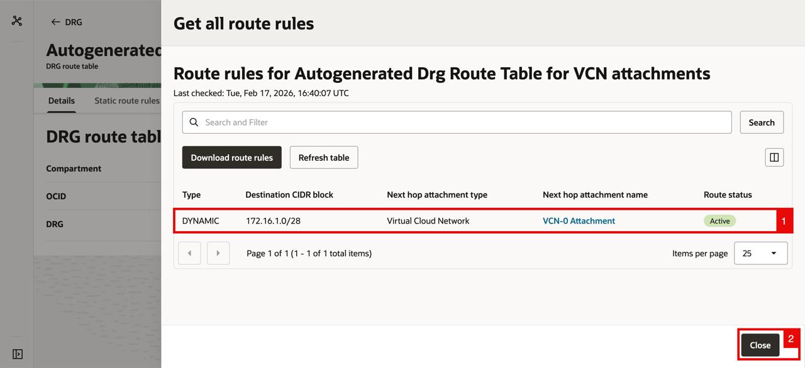

<!-- -->

1. Click on the hamburger menu in the upper left corner.
2. Click on **Networking**.
3. Click on **Virtual cloud networks**.
    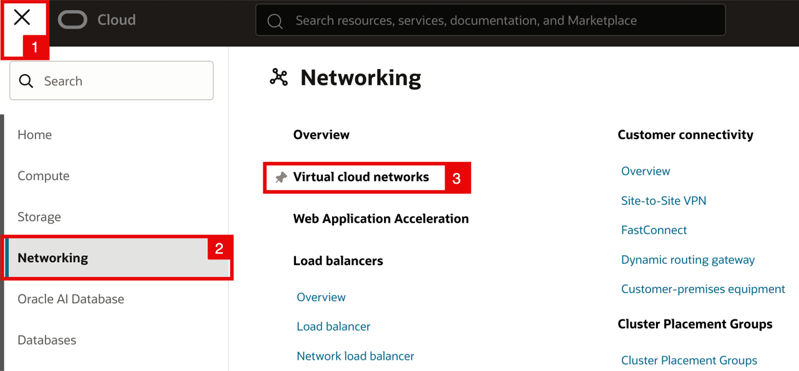

    - Click on the **Default Route Table** of VCN-0.

    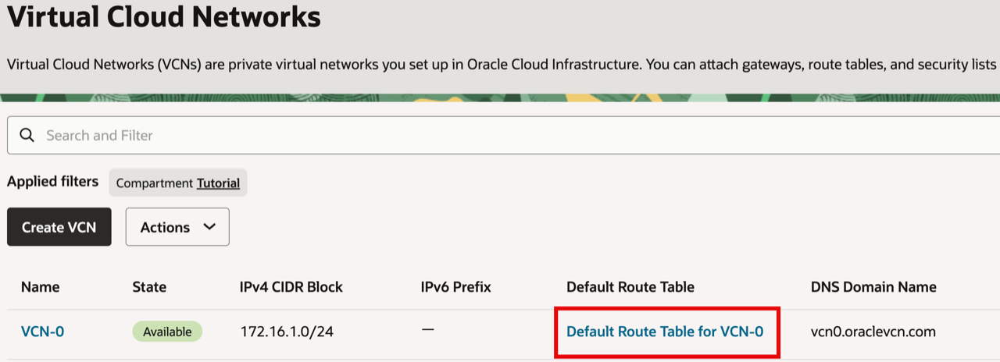

<!-- -->

1. Click on the **Route Rules**.
2. Make sure there is a route for `172.16.0.0/24` pointing to the `DRG`.
3. Make sure there is a route for the `Oracle Service Network` pointing to the `Service Gateway`. We used this only to enable OCI Bastion access to the private VM (SSH Managed session).
4. Click to go back to the VCN overview.
    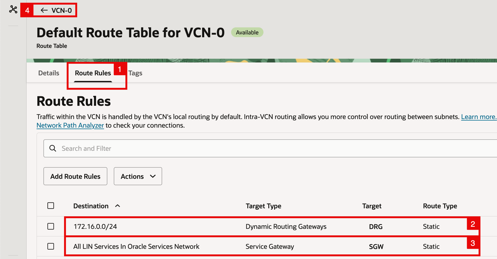

<!-- -->

1. Click on **Security**.
2. Click on the default **Security List**.

    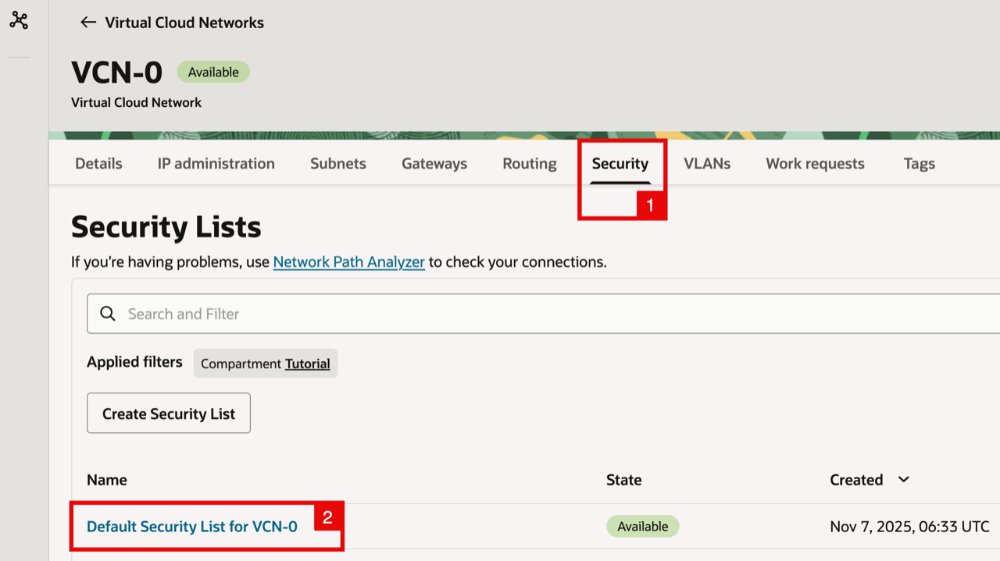

    - Click on the **Security rules**.

    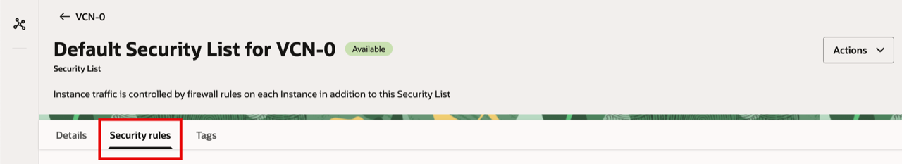

    - Scroll to the **Ingress rules**.
    - Make sure there is a rule in there to allow `ICMP (8)` from `172.16.0.0/24`.
        - This is for Frankfurt (PANW) to Ping VM-0, to test S2S VPN at the end in lab 3.

    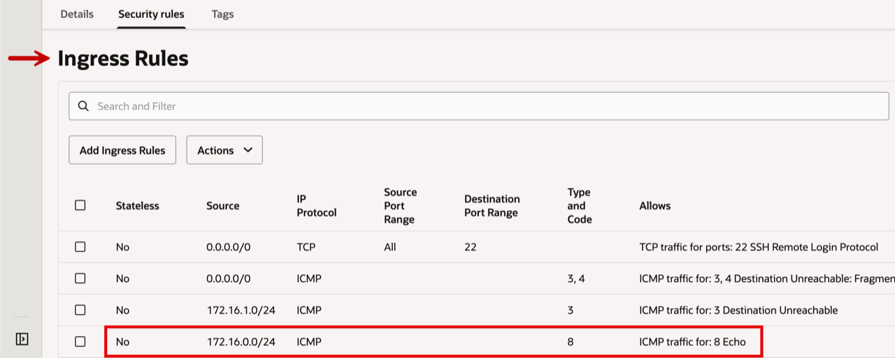

    - Scroll down for the **Egress rules**.
    - Make sure you add in an **Egress rule** to allow traffic to all destinations (`0.0.0.0/0`) for `All Protocols`.

    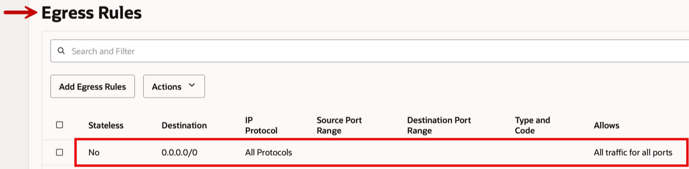

## Task 2: Create Customer-Premises Equipment (CPE)

In this task, you create the **Customer-Premises Equipment (CPE)** object in OCI for the remote VPN endpoint (on-premises or another cloud environment). The CPE provides the public IP address of the Palo Alto VM-Series firewall in Frankfurt, which OCI uses to establish the IPSec tunnels. You will use this CPE object to create the Site-to-Site VPN connection in the next task.

1. Click on the **hamburger menu** in the top left corner.
2. Click on **Networking**.
3. Click on **Customer-premises equipment**.

    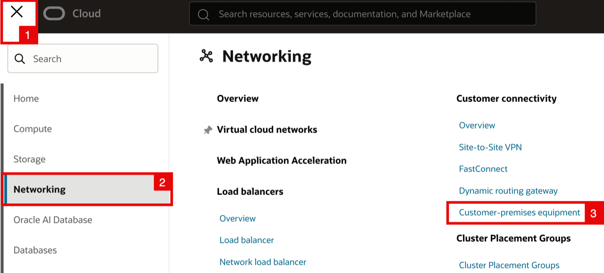

    - Click on the **Create CPE** button.

    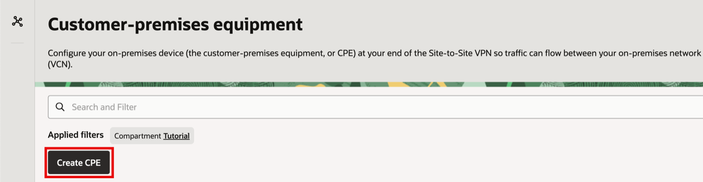

<!-- -->

1. Specify a **Name** for the CPE.
2. Specify the **public IP address** for PA untrusted interface in Frankfurt. The Public IP will depend on the setup you have:
    - **Single instance:** Public IP of the Untrust interface.
    - **Active/Passive:** Public IP of the secondary (floating) private IP on the Untrust interface.
    - **Active/Active:** Public IP of the Untrust interface of the firewall instance that will terminate the IPSec VPN.
3. Specify the **Vendor** to be Palo Alto.
4. Specify the **Platform/Version** to be PAN-OS 8.0.0.
5. Click on the **Create CPE** button.

    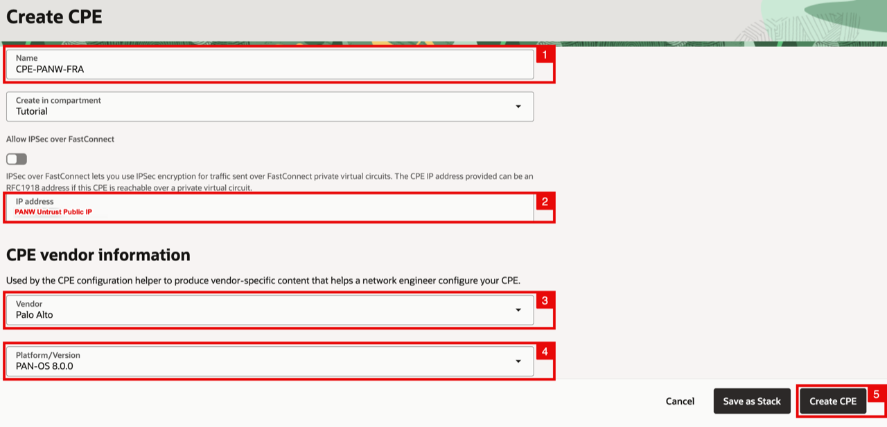

    - Notice that the CPE is created with the public IP address you specified.

    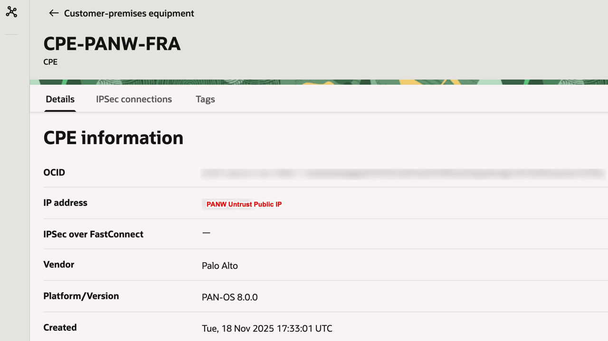

## Task 3: Create IPSec Connection

In this task, you create the **IPSec Site-to-Site VPN connection** between the previously created DRG and CPE. This defines the OCI side of the encrypted tunnels that will securely carry traffic between the remote network (Palo Alto in Frankfurt) and OCI Milan. You will review the tunnel parameters, routing type, and shared secrets that will later be configured on the Palo Alto firewall.

1. Click on the hamburger menu in the upper left corner.
2. Click on **Networking**.
3. Click on **Site-to-Site VPN**.

    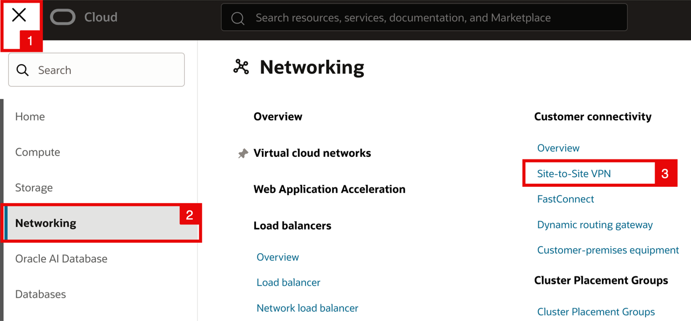

    - Click on the **Create IPSec connection** button.

    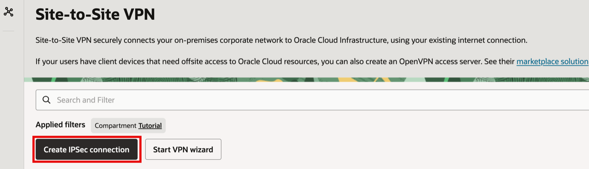

<!-- -->

1. Specify a **Name** of the IPSec connection.
2. Select the **CPE** you just created.
3. Keep the **CPE behind NAT device** option turned off.
4. Select the **DRG** where you want to terminate the tunnel on.
5. Specify the **Static routes** with the networks that are located on the remote side (OCI Frankfurt Hub VCN in this workshop).

    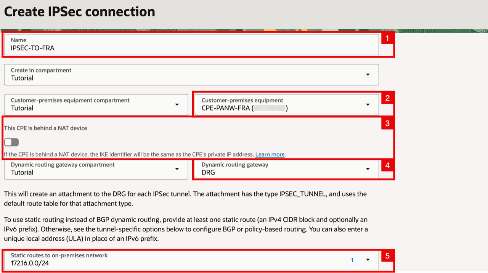

<!-- -->

1. Specify the **Name** for Tunnel 1.
2. Enable the switch to **Provide a custom shared secret** key, and specify the **shared secret key**.
3. Set the **IKE version** to IKEv2.

    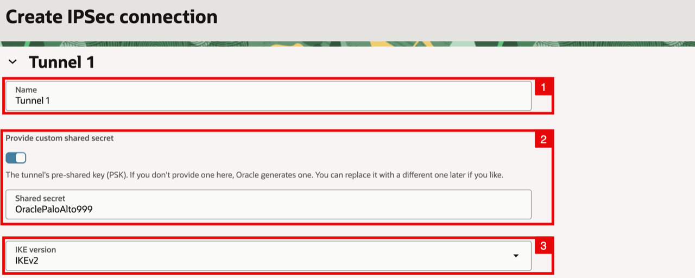

<!-- -->

1. For the **Routing type** select Static routing.
2. Do not use **inside tunnel interface** IP addresses.
    - Notice that we did not assign an IP address to the tunnel interfaces. For static routing, this is optional. For BGP deployments, assigning an IP address to each tunnel interface is mandatory.
    - As stated in [Palo Alto documentation](https://docs.paloaltonetworks.com/network-security/ipsec-vpn/administration/site-to-site-vpn-quick-configs/site-to-site-vpn-with-static-routing): “With static routes, the tunnel interface doesn’t require an IP address. Traffic destined to the specified subnet automatically uses the tunnel interface as the next hop. Consider assigning an IP address if you want to enable tunnel monitoring”.

    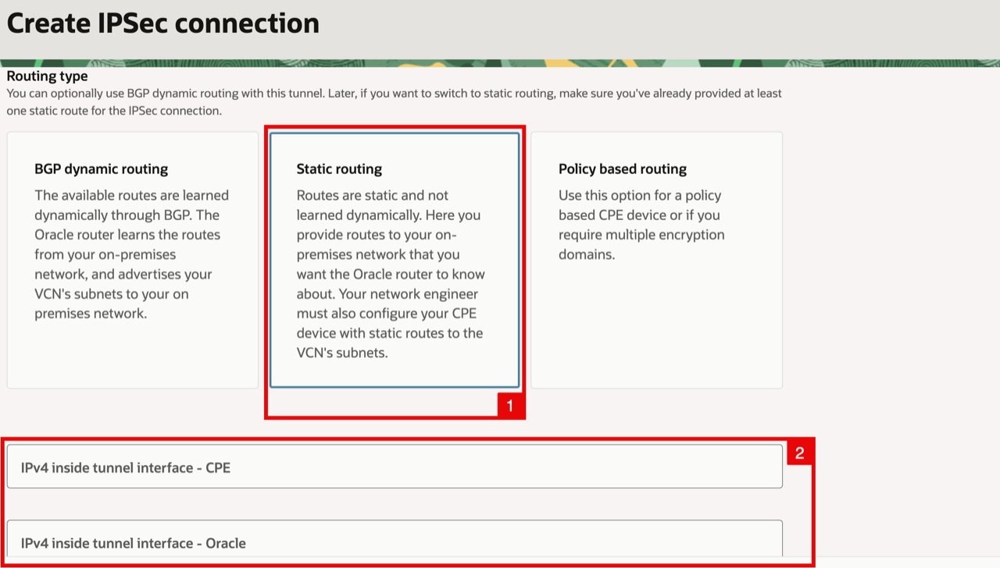

<!-- -->

1. Open the **Advanced options** for Tunnel 1.
2. Keep the default values.

    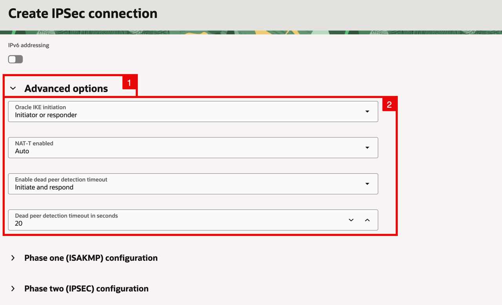

<!-- -->

1. Open the **Phase one (ISAKMP) configuration** for Tunnel 1.
2. Enable the switch to **Set custom configurations**.
3. For the **Custom encryption algorithm** select `AES_256_CBC`.
4. For the **Custom authentication algorithm** select `SHA2_384`.
5. For the **Custom Diffie-Hellman group** select `GROUP20`.
6. For the **IKE session key lifetime in seconds** select `28800`.

    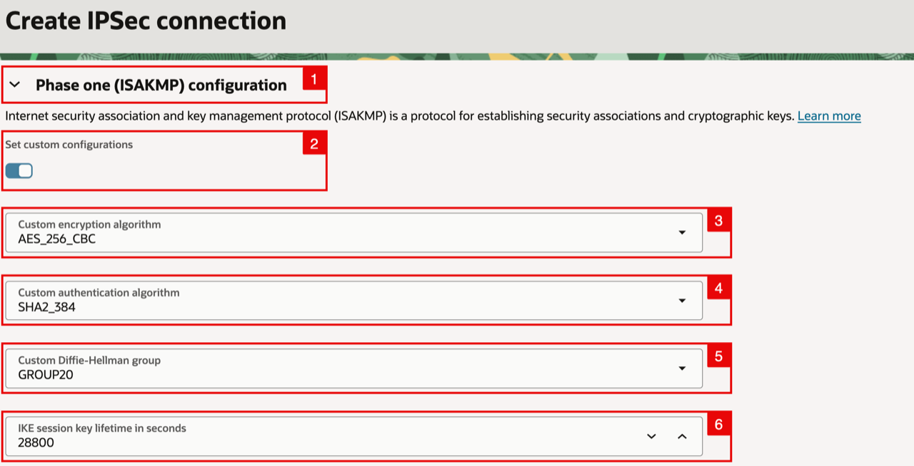

<!-- -->

1. Open the **Phase two (IPSEC) configuration** for Tunnel 1.
2. Enable the switch to **Set custom configurations**.
3. For the **Custom encryption algorithm** select `AES_256_GCM`.
4. For the **IPSEC key lifetime in seconds** select `3600`.
5. Enable the switch to **Enable perfect forward secrecy**.
6. For the **Perfect forward secrecy Diffie-Hellman group** select `GROUP5`.

    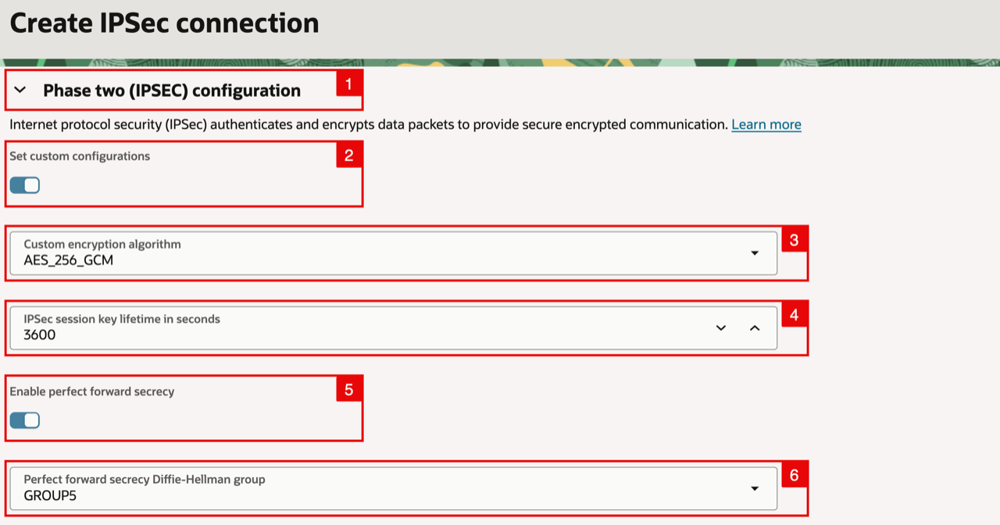

    > **Note:** For the list of supported IPSec parameters and configurations, refer to the [Oracle documentation](https://docs.oracle.com/en-us/iaas/Content/Network/Reference/supportedIPsecparams.htm). In this workshop, we used the recommended values to ensure compatibility and best practice alignment.

    - **Repeat the same steps with the same settings for Tunnel 2.**
    - Click on the **Create IPSec connection** button.

    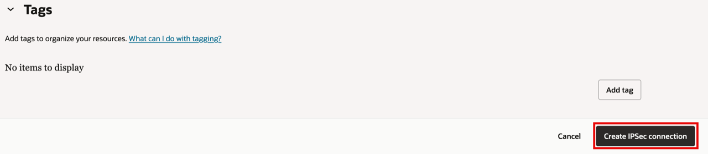

<!-- -->

1. Click on **Tunnels**.
2. Notice that two tunnels are created for HA. Write down both public IP addresses, as they will be used when configuring the CPE (Palo Alto) in Frankfurt region in Lab 2.

    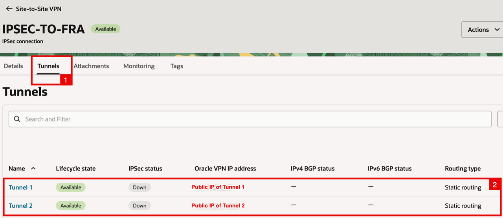

    > **Note:** At this stage, the tunnels will be **Down**, because the remote-side configuration has not been completed yet. The tunnels will come **Up** after configuring the IPSec settings on the Palo Alto firewall in lab 2.

    - Click on **Tunnel 1**.

    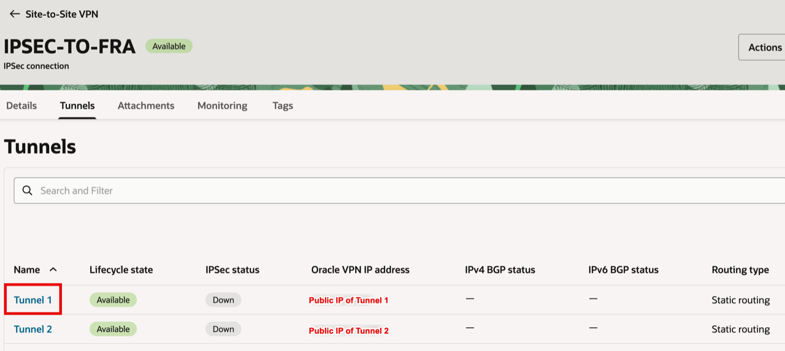

    - You are in Tunnel 1 page.

    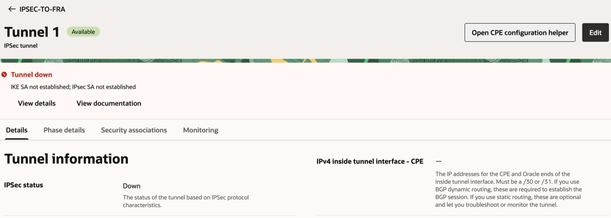

<!-- -->

1. Scroll down.
2. Click on the dots on the right of **Shared Secret**.
3. Click on **Edit**.

    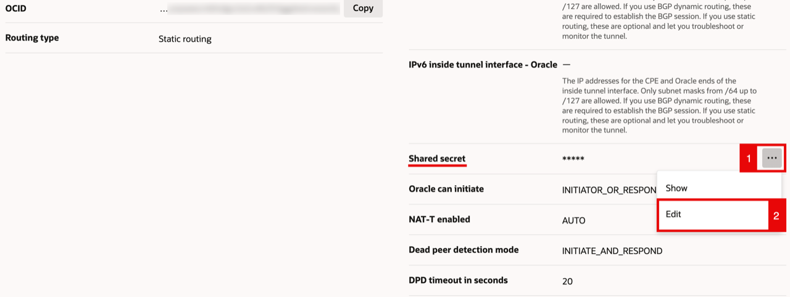

    - This is the shared secret we provided while creating the tunnels. If you did not provide one, Oracle will generate a shared secret for you.
    - You can change it if needed; in this lab, leave it as is.
    - Write down the shared secret of each tunnel, as you will use them in Palo Alto.

    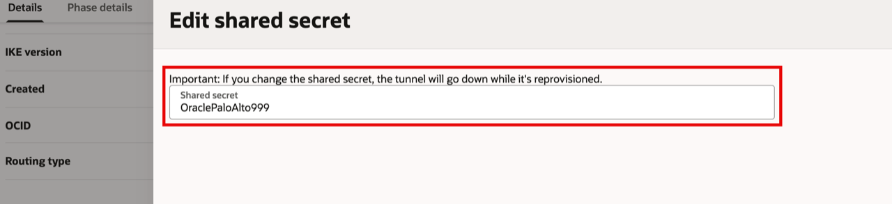

## Task 4: Collect needed information

Before getting into Palo Alto configuration side, make sure IPSec is created successfully in OCI (Task 3) and you collect all the information you need, we have consolidated everything in the below table:

|                                              | **Tunnel 1**              | **Tunnel 2**              |
| -------------------------------------------- | ------------------------- | ------------------------- |
| **Oracle VPN IP address**                    | `<Public IP of Tunnel 1>` | `<Public IP of Tunnel 2>` |
| **Shared Secret**                            | `OraclePaloAlto999`       | `OraclePaloAlto999`       |
| **Phase one (ISAKMP) configuration**         |                           |                           |
| Custom encryption algorithm                  | `AES_256_CBC`             | `AES_256_CBC`             |
| Custom authentication algorithm              | `SHA2_384`                | `SHA2_384`                |
| Custom Diffie-Hellman group                  | `GROUP20`                 | `GROUP20`                 |
| IKE session key lifetime in seconds          | `28800`                   | `28800`                   |
| **Phase two (IPSEC) configuration**          |                           |                           |
| Custom encryption algorithm                  | `AES_256_GCM`             | `AES_256_GCM`             |
| IPSEC key lifetime in seconds                | `3600`                    | `3600`                    |
| Perfect forward secrecy Diffie-Hellman group | `GROUP5`                  | `GROUP5`                  |

## Learn More

- [Dynamic Routing Gateways in OCI](https://docs.oracle.com/en-us/iaas/Content/Network/Tasks/managingDRGs.htm)
- [OCI Site-to-Site VPN Overview](https://docs.oracle.com/en-us/iaas/Content/Network/Tasks/overviewIPsec.htm)
- [OCI Site-to-Site VPN (IPSec) Best Practices](https://docs.oracle.com/en-us/iaas/Content/Resources/Assets/whitepapers/ipsec-vpn-best-practices.pdf)
- [Setting Up Site-to-Site VPN in OCI (Overall Process)](https://docs.oracle.com/en-us/iaas/Content/Network/Tasks/settingupIPsec.htm)

## Acknowledgements

- **Authors** - Anas Abdallah, Iwan Hoogendoorn (Cloud Networking Black Belts)
- **Contributor** - Antonio Gámir (Cloud Networking Black Belt)
- **Last Updated By/Date** - Anas Abdallah, August 2026

You may now **proceed to the next lab**.
