# Set Up Site-to-Site VPN in Frankfurt Region (Palo Alto NGFW in Frankfurt)

## Introduction

This lab configures the Frankfurt Palo Alto firewall to terminate the IPSec connection created in Milan.

Estimated time: 35 minutes

### Objectives

In this lab, you will:
- Create the two tunnel interfaces and configure the virtual router, static routing, and ECMP.
- Configure the IKE and IPSec crypto profiles, IKE gateways, and IPSec tunnels to establish connectivity with OCI Milan.

### Prerequisites

Before you begin, ensure you have completed the preceding required labs in this workshop.

> **Important:**
> 1) You can **commit** after each configuration you make (safer, easier to troubleshoot), or you can wait and commit once after completing all tasks (faster, fewer commits). In this lab, you will commit the configuration once at the end of Task 7.
> 2) The steps differ by deployment model:
> - **Standalone:** Apply these steps to the firewall that terminates the IPSec connection.
> - **Active/Passive:** Apply these steps to the primary firewall; HA replicates the configuration to the passive peer.
> - **Active/Active:** Apply these steps only to the firewall that terminates the IPSec connection.

## Task 1: Create tunnel interfaces

In this task, you create the required **tunnel interfaces** on the Palo Alto firewall. These logical interfaces will be used to bind IPSec tunnels and route traffic between OCI and the on-premises environment. Correct tunnel interface configuration is essential, as they form the foundation for IKE gateways, IPSec tunnels, and routing in the subsequent steps.

- Go to the management web GUI of the Palo Alto firewall.

1. Click on the **Network** tab.
2. Click on **Interfaces**.
3. Click on the **Tunnel** tab.

    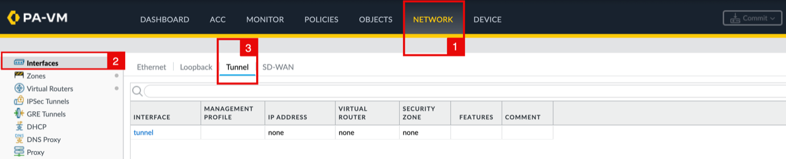

    - Click on the **Add** button.

    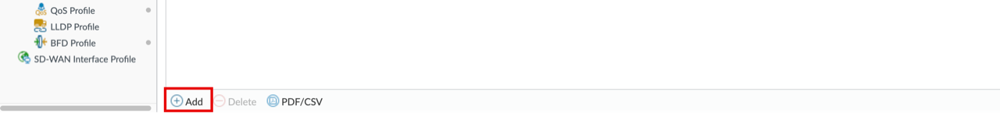

<!-- -->

1. Specify 1 to be the **number** of the tunnel.
2. Specify a **comment** / **description** of the tunnel.
3. Click on the **Config** tab.
4. Choose the default **Virtual Router**.
5. Click on the Security Zone.
6. Select the New Zone button.

    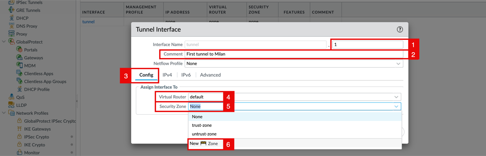

<!-- -->

1. Specify a **Name** for the new security zone.
2. Click on the **OK** button.

    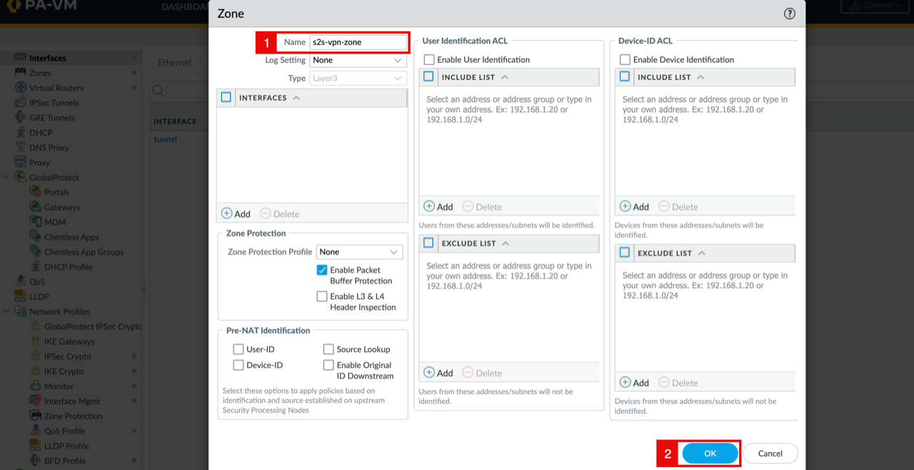

<!-- -->

1. Make sure the newly created **security zone** is selected.
2. Click on the **OK** button.

    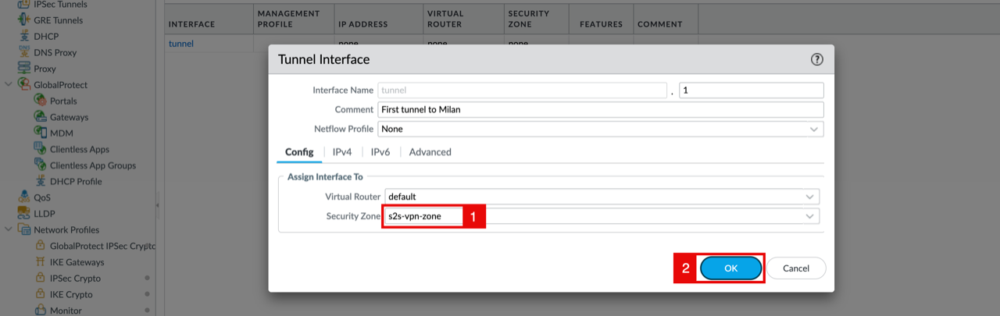

<!-- -->

1. Notice that the first tunnel is created successfully.
2. Click on the **Add** button (to create the second tunnel).

    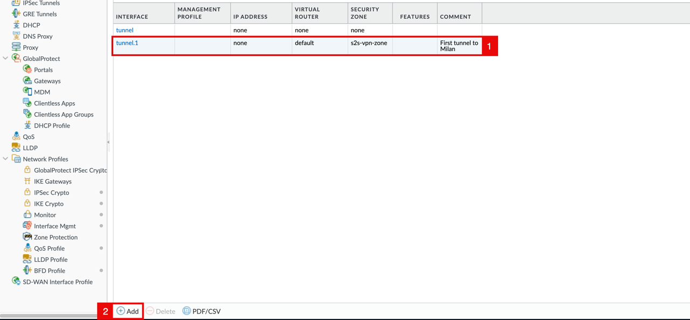

<!-- -->

1. Specify 2 to be the **number** of the tunnel.
2. Specify a **comment** / **description** of the tunnel.
3. Click on the **config** tab.
4. Choose the default **Virtual Router**.
5. Make sure the newly created **security zone i**s selected.
6. Click on the **OK** button.

    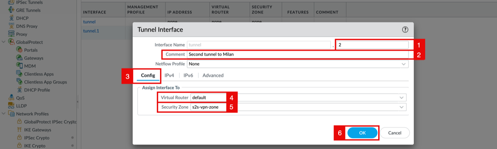

- Notice that the second tunnel is created successfully.

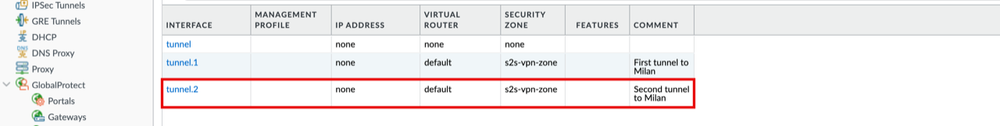

- Notice that we did not assign an IP address to the tunnel interfaces. For static routing, this is optional. For BGP deployments, assigning an IP address to each tunnel interface is mandatory.
- As stated in [Palo Alto documentation](https://docs.paloaltonetworks.com/network-security/ipsec-vpn/administration/site-to-site-vpn-quick-configs/site-to-site-vpn-with-static-routing): “With static routes, the tunnel interface doesn’t require an IP address. Traffic destined to the specified subnet automatically uses the tunnel interface as the next hop. Consider assigning an IP address if you want to enable tunnel monitoring”.

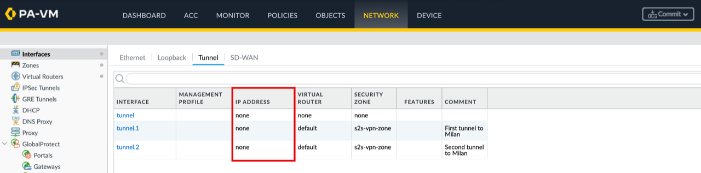

## Task 2: Create and Assign Management Profile to Untrust Interface

In this task, you create and assign an **Interface Management Profile** to the **untrust interface** on the Palo Alto firewall. Interface Management Profiles control which administrative and diagnostic services—such as HTTPS, SSH, or ICMP (ping)—are permitted on a given interface.

By default, data interfaces do not allow management traffic. Applying a management profile explicitly enables the required services while keeping others blocked, supporting a least-privilege security posture. In this workshop, the profile is used to **allow ICMP (ping) on the untrust interface** so that basic connectivity and reachability can be validated when testing the Site-to-Site VPN between the two regions.

- Navigate to the **Network** tab.

    

<!-- -->

1. Click on **Interface Mgmt**.
2. Click on the **Add** button.

    

<!-- -->

1. Specify a **Name** for the Interface Management Profile.
2. Check the **Ping** Network Services box.
3. Click on the **Add** button.
4. Specify the **CIDR block** or **IP address** that will be allowed to ping the firewall’s Untrust interface, which is **VM-0 (172.16.1.5)** -created in the prerequisites-.
5. Click on the **OK** button.

    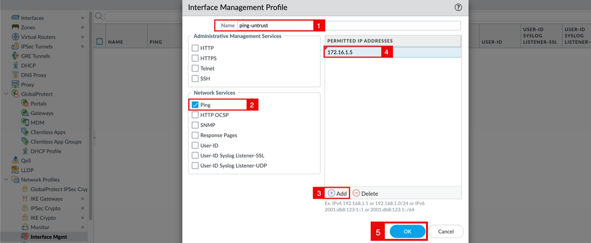

<!-- -->

1. Notice that the Interface Management Profile is now created.
2. Click on **Interfaces**.

    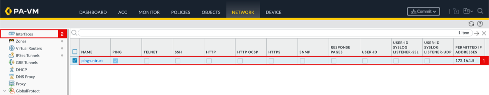

    - Click on interface **ethernet 1/1**.

    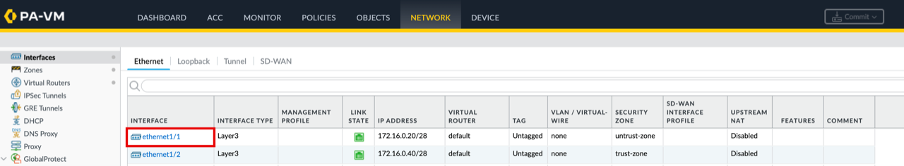

<!-- -->

1. Click on the **Advanced** tab.
2. Select the **Interface Management Profile** we just created.
3. Click on the **OK** button.

    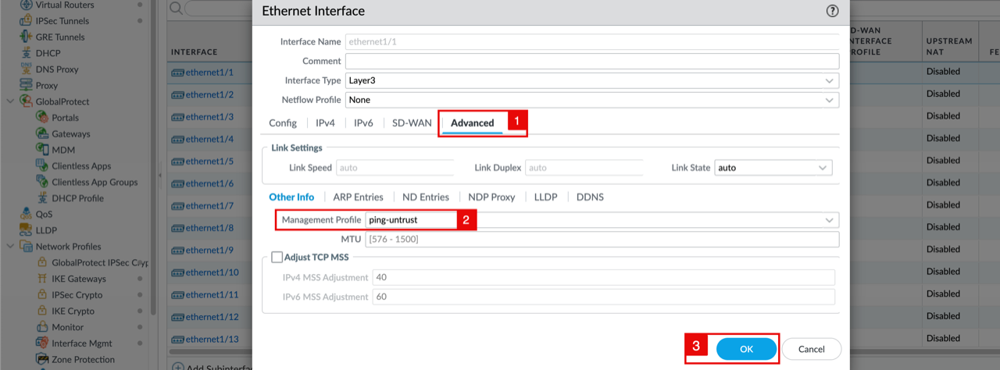

<!-- -->

- Notice that the **Interface Management Profile** is assigned to interface ethernet 1/1.

    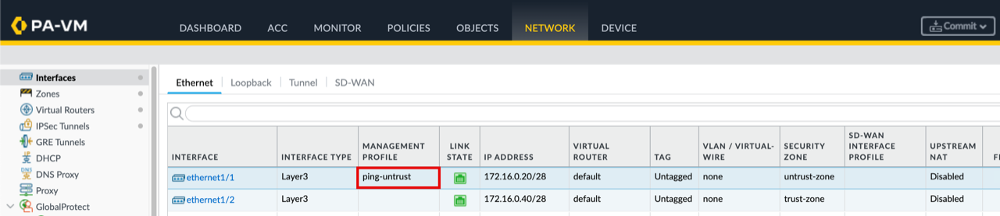

## Task 3: Configure Virtual Router and ECMP

In this task, you configure the **Virtual Router on the Palo Alto firewall** and enable **Equal-Cost Multi-Path (ECMP)** routing to support multiple active VPN tunnels simultaneously. The Virtual Router defines how traffic is routed between tunnel interfaces, internal networks, and OCI VCN subnets.

By enabling ECMP, traffic can be load-balanced across parallel IPSec tunnels, improving throughput and resiliency. This step ensures that the firewall can intelligently forward traffic over multiple VPN paths and provides the routing foundation required for high-availability and active/active VPN designs.

- Navigate to the **Network** tab.

    

1. Click on **Virtual Routers**.
2. Click on **default**.

    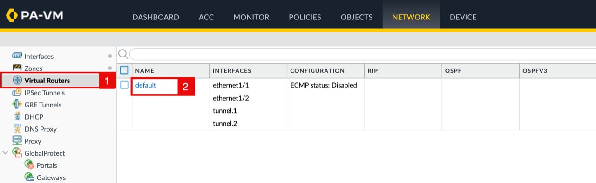

<!-- -->

1. Select the **General** tab
2. Notice that the interfaces ethernet 1/1 and 1/2 are added already, from the previous workshops where we provisioned the Palo Alto VMs.
3. Notice that the interfaces tunnel 1 and 2 are added already, from task 1.
4. Select the **ECMP** tab.

    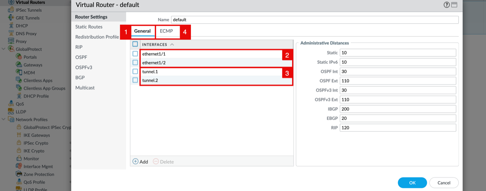

<!-- -->

1. Check the **Enable** box.
2. For the **Load Balance method** select Weighted Round Robin.
3. Click on **Static Routes**.

    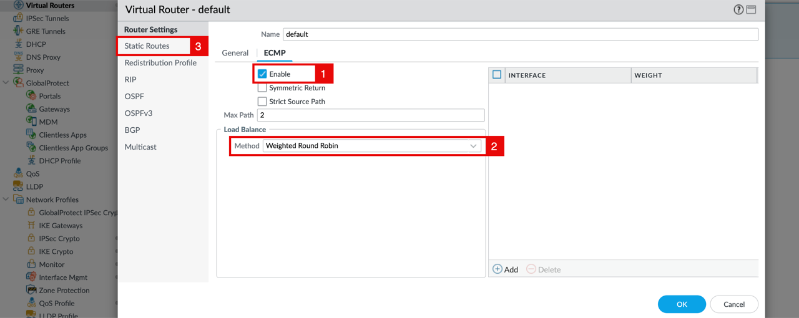

<!-- -->

1. Click on the **IPv4** tab.
2. Click on the **add** button.

    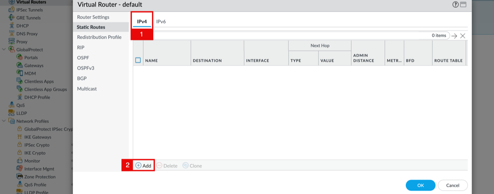

<!-- -->

1. Specify a **name** for the static route.
2. Specify a **destination** (the network on the other side) for the static route. In this workshop, it is VCN-0 in Milan.
3. Specify the tunnel 1 **interface** to select for the static route.
4. Leave the **next hop** to none.
5. Click on the **OK** button.

    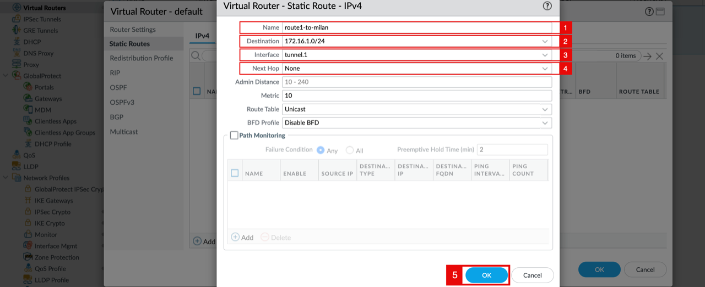

<!-- -->

1. Notice that the static route has been added.
2. Click on the **add** button.

    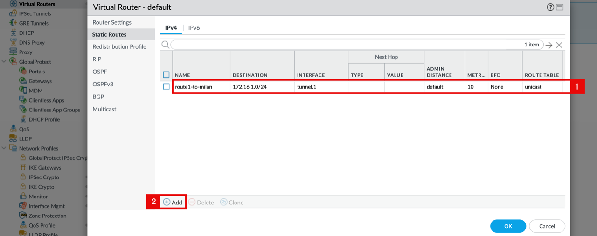

<!-- -->

1. Specify a **name** for the static route.
2. Specify a **destination** (the network on the other side) for the static route. In this workshop, it is VCN-0 in Milan.
3. Specify the tunnel 2 **interface** to select for the static route.
4. Leave the **next hop** to none.
5. Click on the **OK** button.

    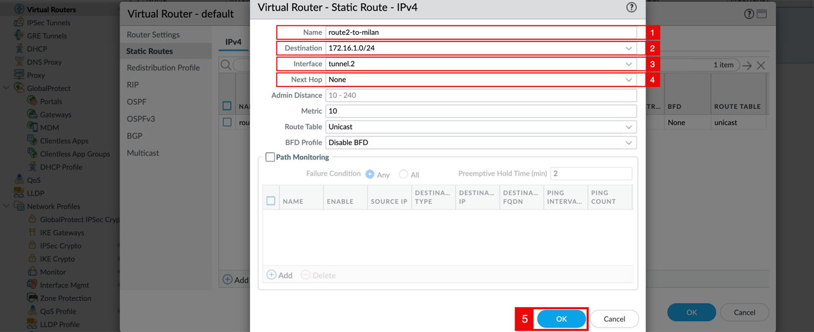

<!-- -->

1. Notice that the static route has been added.
2. Click on the **add** button.

    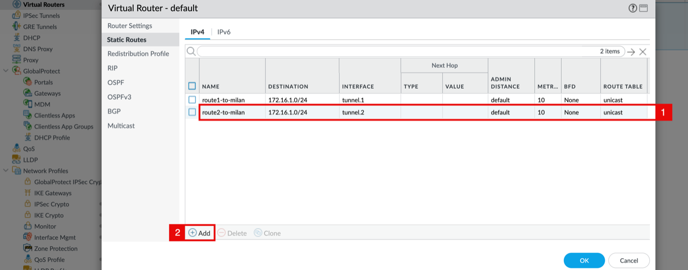

    > **Note:** You have two static routes pointing to the same destination (172.16.1.0/24). If ECMP is disabled, the commit will fail, so make sure that ECMP is enabled before committing.

<!-- -->

1. Specify a **name** for the static route.
2. Specify the **destination** (0.0.0.0/0) for the static route.
3. Specify the ethernet 1/1 **interface** to select for the static route.
4. Specify the **Next Hop** type as IP Address.
5. Enter the default gateway IP of the OCI Untrust subnet (**172.16.0.17**, the first IP in the subnet).
6. Click on the **OK** button.

    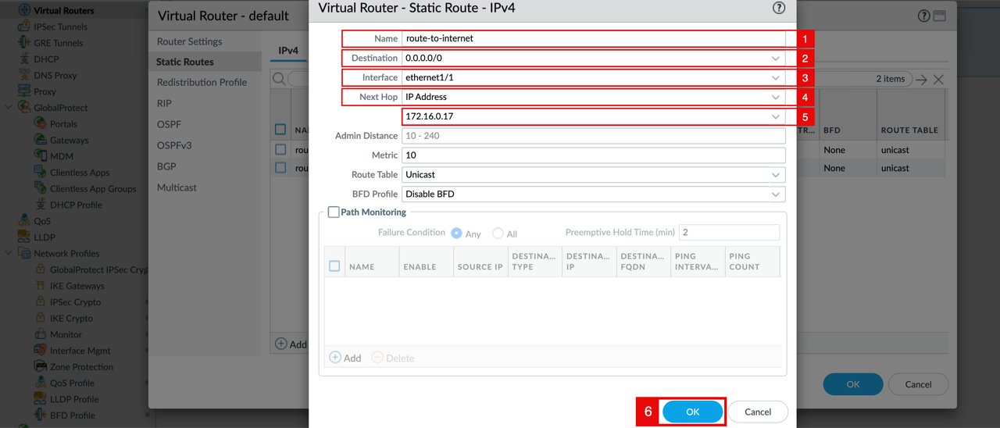

<!-- -->

1. Notice that the static route has been added.
2. Click on the **OK** button.

    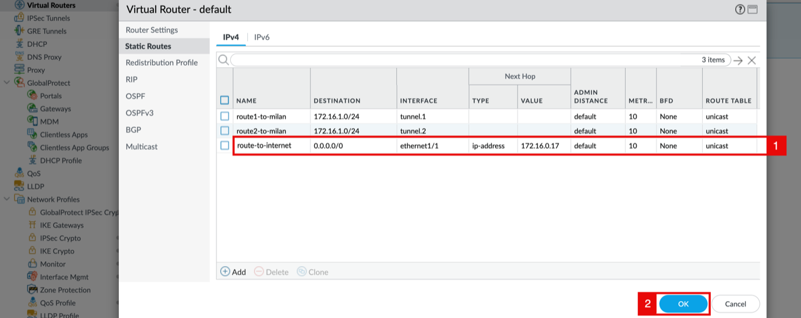

- Click on **Yes** on the ECMP Configuration Change warning.

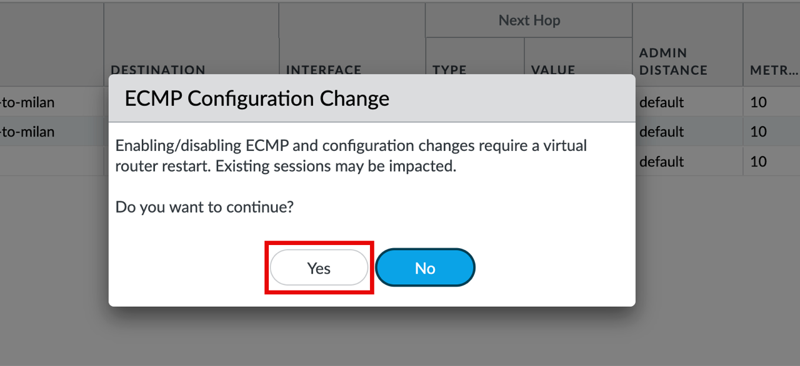

<!-- -->

- Routing config is completed (ECMP = enabled, 3 routes are added)

    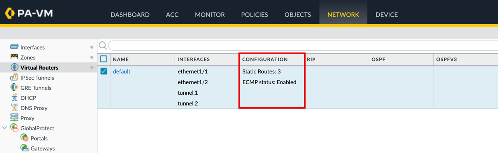

## Task 4: Create IKE Crypto Profile (Phase 1 Parameters)

In this task, you create an **IKE Crypto Profile** on the Palo Alto firewall that defines the **Phase 1 security parameters** used during IKE negotiation. This profile specifies the encryption algorithm, authentication method, Diffie-Hellman group, and lifetime values that determine how the initial secure channel is established with the remote peer.

A **single IKE Crypto Profile** will be created and reused for **both tunnels**, providing consistent Phase 1 security settings and simplifying the overall VPN configuration. This profile will later be referenced by the IKE Gateways.

- Navigate to the **Network** tab.

    

1. Click on **IKE Crypto**.
2. Click on the **add** button.

    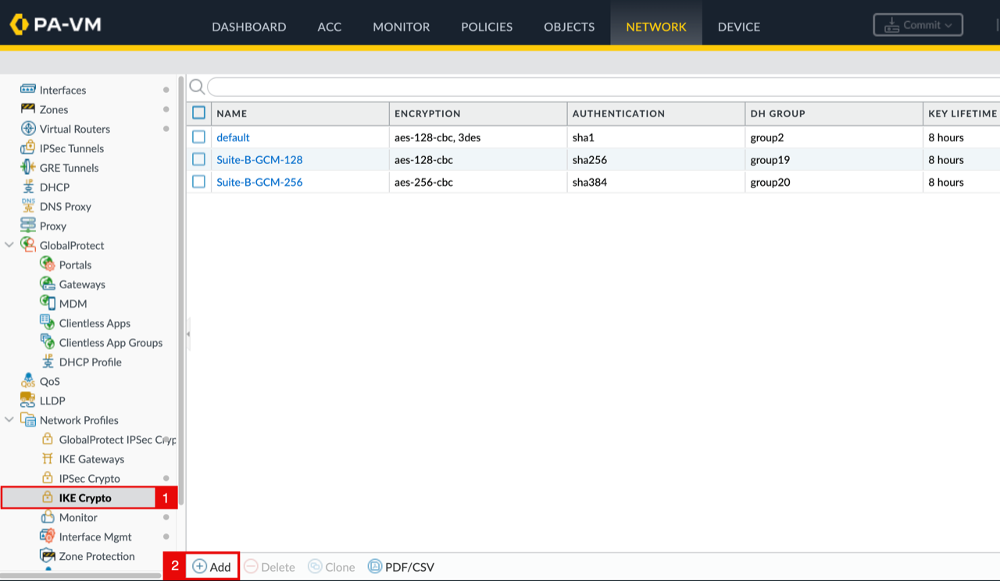

<!-- -->

1. Specify a **name** for the IKE Profile.
2. Set the **DH Group** to group20.
3. Set the **Authentication** to sha384.
4. Set the **Encryption** to aes-256-cbc.
5. Set the **Key Lifetime** to Seconds
6. Set it to the default which is 28800 seconds = 8 hours.
7. Click on the **OK** button.

    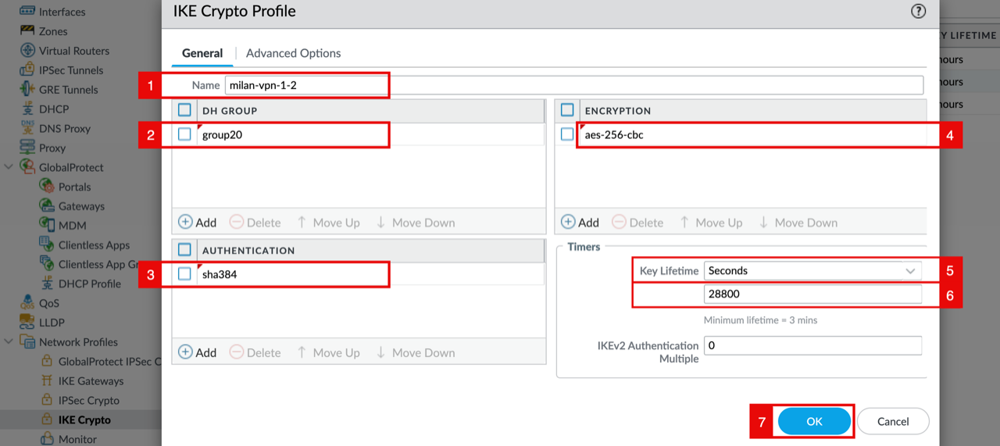

- Notice that the IKE Profile has been added.

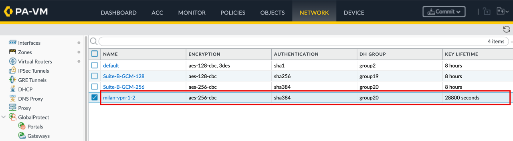

## Task 5: Create IPSec Crypto Profile (Phase 2 Parameters)

In this task, you create an **IPSec Crypto Profile** on the Palo Alto firewall that defines the **Phase 2 parameters** used to secure data traffic inside the VPN tunnels. This profile specifies the encryption algorithms, authentication methods, and security association lifetimes that protect packets after the IKE (Phase 1) negotiation has completed.

A **single IPSec Crypto Profile** will be created and reused for **both tunnels**, ensuring consistent security settings across the VPN connections and simplifying configuration and maintenance. This profile will later be referenced when creating the IPSec tunnels.

1. Click on **IPSec Crypto**.
2. Click on the **add** button.

    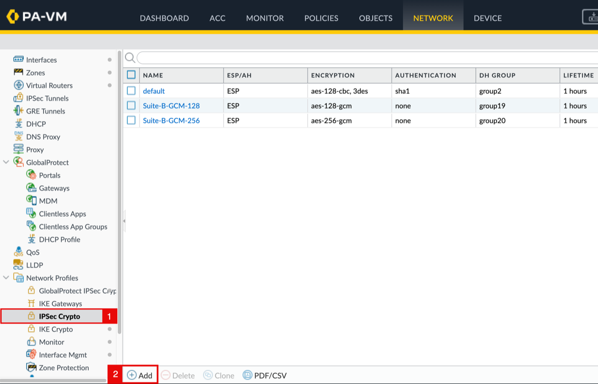

<!-- -->

1. Specify a **name** for the Crypto Profile.
2. Set the **IPSec Protocol** to ESP.
3. Set the **Encryption** to aes-256-gcm.
4. Set the **Authentication** to none, since the algorithm selected in the previous step already provides encryption, integrity, and authentication.
5. Set the **DH Group** to group5.
6. Set the **Lifetime** to Seconds.
7. Keep the default which is 3600 seconds = 1 hour.
8. Click on the **OK** button.

    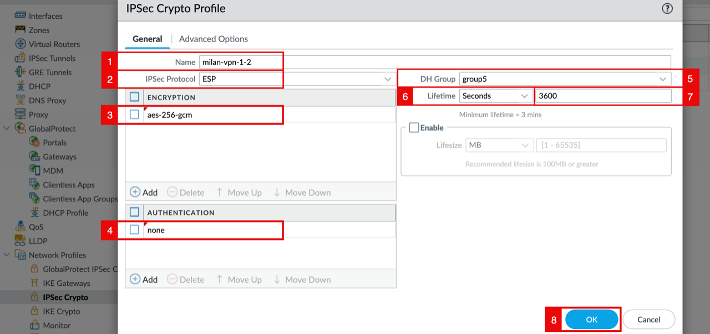

- Notice that the Crypto Profile has been added.

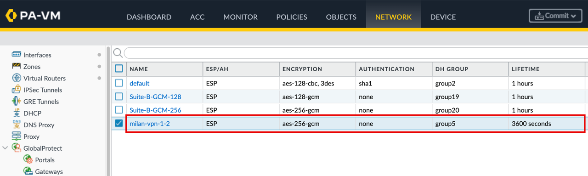

## Task 6: Create IKE Gateway

In this task, you create an **IKE Gateway on the Palo Alto firewall** that defines how the firewall establishes the IKE (Internet Key Exchange) session with the remote VPN peer. The IKE Gateway specifies the peer IP address or FQDN, pre-shared key, and local and peer identification values.

You will start by creating the IKE Gateway for the **first tunnel**, which will later be associated with an IPSec tunnel and a tunnel interface. This step is critical, as the IKE Gateway is responsible for negotiating security parameters and bringing up the control plane for the VPN connection.

1. Click on **IKE Gateways**.
2. Click on the **add** button (to create the **first** IKE Gateway).

    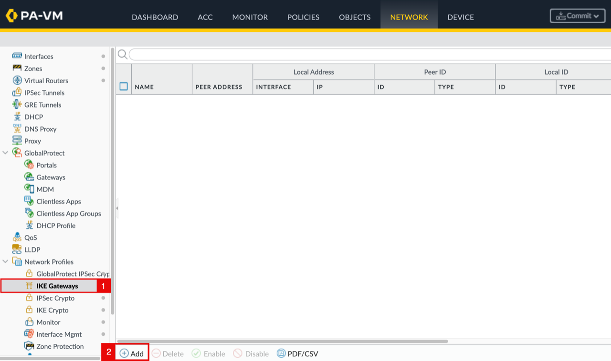

<!-- -->

1. Click on the **General** tab.
2. Specify a **Name** for the IKE Gateway.
3. Set the **Version** to IKEv2 only mode.
4. Set the **Address Type** to IPv4.
5. Set the **Interface** to ethernet 1/1.
6. Set the **Local IP Address** as follows:
    - **Standalone:** `172.16.0.20/28` (Untrust primary private IP).
    - **Active/Passive:** `172.16.0.22/32` (Untrust secondary/floating private IP).
    - **Active/Active:** `172.16.0.20/28` (Untrust primary private IP).
7. Set the **Peer IP address type** to IP.
8. Set the **Peer Address** to the public IP address of Tunnel 1 in Milan (the same IP specified in Lab 1).
9. Set the **Authentication** to Pre-Shared Key.
10. Specify the **Pre-Shared Key** (the same key specified in Lab 1).
11. **Confirm the Pre-Shared Key** (the same key specified in Lab 1).
12. Set the **Local Identification** to IP address.
13. Specify the untrusted public IP address of the Palo Alto Firewall.
    - **Standalone:** Untrust primary public IP.
    - **Active/Passive:** Untrust secondary/floating public IP.
    - **Active/Active:** Untrust primary public IP.
14. Set the **Peer Identification** to IP address.
15. Specify the remote public IP address of the **first** tunnel in Milan (the same IP specified in Lab 1).
16. Click on the **Advanced Options** tab.

    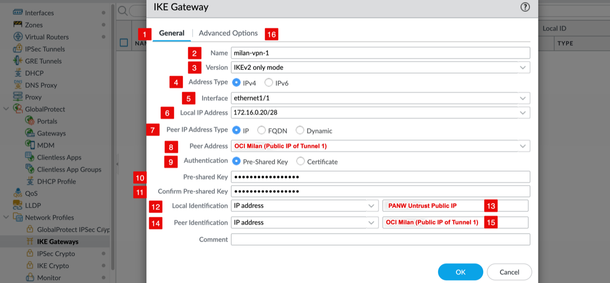

<!-- -->

1. Keep the **Passive Mode** disabled.
2. Keep the **NAT Traversal** disabled.
3. Select the **IKE Crypto Profile** we created earlier in Task 4.
4. Click on the **OK** button.

    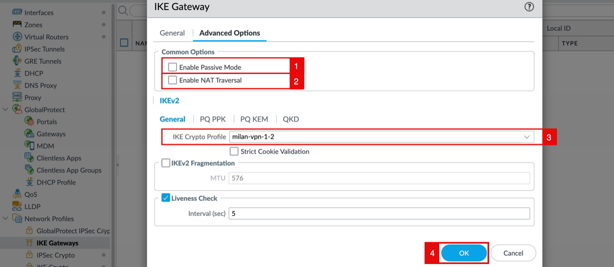

<!-- -->

1. Notice that the **first** IKE Gateway is created.
2. Click on the **add** button (to create the **second** IKE Gateway).

    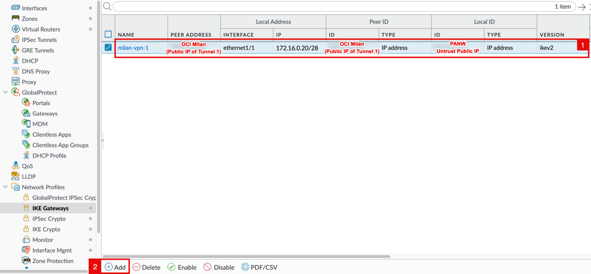

<!-- -->

1. Click on the **General** tab.
2. Specify a **Name** for the IKE Gateway.
3. Set the **Version** to IKEv2 only mode.
4. Set the **Address Type** to IPv4.
5. Set the **Interface** to ethernet 1/1.
6. Set the **Local IP Address** as follows:
    - **Standalone:** `172.16.0.20/28` (Untrust primary private IP).
    - **Active/Passive:** `172.16.0.22/32` (Untrust secondary/floating private IP).
    - **Active/Active:** `172.16.0.20/28` (Untrust primary private IP).
7. Set the **Peer IP address type** to IP.
8. Set the **Peer Address** to the public IP address of Tunnel 2 in Milan (the same IP specified in Lab 1).
9. Set the **Authentication** to Pre-Shared Key.
10. Specify the **Pre-Shared Key** (the same key specified in Lab 1).
11. **Confirm the Pre-Shared Key** (the same key specified in Lab 1).
12. Set the **Local Identification** to IP address.
13. Specify the untrusted public IP address of the Palo Alto Firewall.
    - **Standalone:** Untrust primary public IP.
    - **Active/Passive:** Untrust secondary/floating public IP.
    - **Active/Active:** Untrust primary public IP.
14. Set the **Peer Identification** to IP address.
15. Specify the remote public IP address of the **second** tunnel in Milan (the same IP specified in Lab 1).
16. Click on the **Advanced Options** tab.

    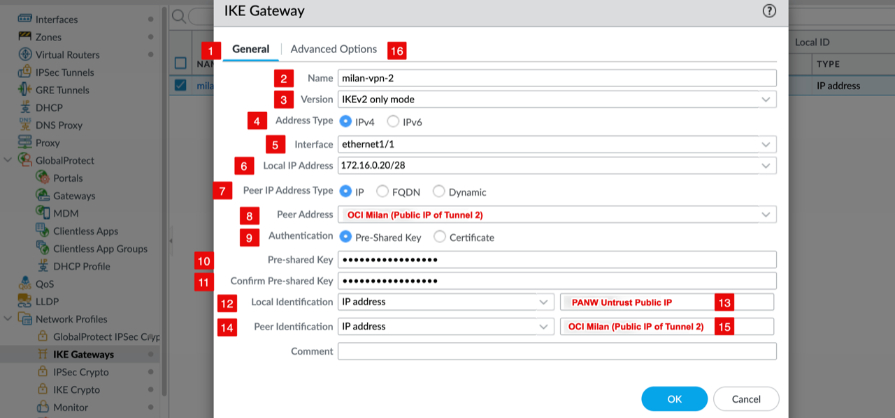

<!-- -->

1. Keep the **Passive Mode** disabled.
2. Keep the **NAT Traversal** disabled.
3. Select the **IKE Crypto Profile** we created earlier in Task 4.
4. Click on the **OK** button.

    

- Notice that the **second** IKE Gateway is created.

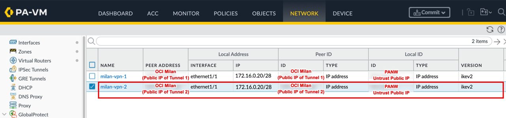

## Task 7: Create IPSec Tunnels

In this task, you create the **IPSec tunnels on the Palo Alto firewall** that establish the encrypted VPN connections toward the remote peer. These tunnels bind together the previously defined IKE gateways, crypto profiles, and tunnel interfaces.

You will configure the IPSec parameters, associate each tunnel with its corresponding tunnel interface, and verify tunnel status. Once completed, secure connectivity between the Palo Alto firewall and the remote VPN endpoint is established, allowing traffic to flow according to the routing and security policies configured in earlier tasks.

1. Click on **IPSec Tunnels**.
2. Click on the **add** button (to create the **first** tunnel).

    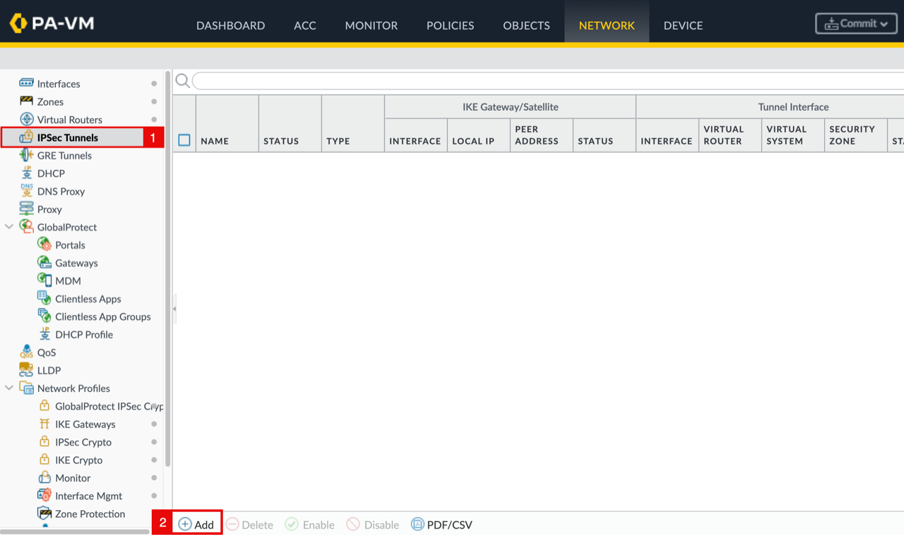

<!-- -->

1. Click on the **General** tab.
2. Specify a **Name** for the Tunnel.
3. Set the **Tunnel Interface** to tunnel.1.
4. Select the first **IKE Gateway** dedicated to tunnel 1.
5. Select the **IPSec Crypto Profile**.
6. Write down a **comment** dedicated to tunnel 1 if needed.
7. Click on the **Proxy IDs** tab.

    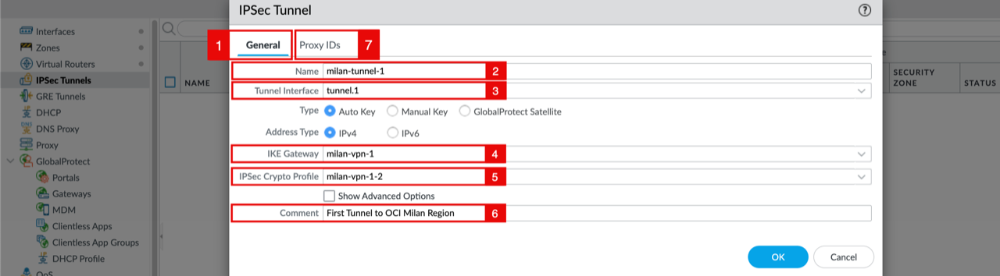

<!-- -->

1. Proxy IDs are used in policy-based IPSec VPNs to define the local and remote subnets allowed through the tunnel. Since we are using a route-based (static) VPN, leave it empty.
2. Click on the **OK** button.

    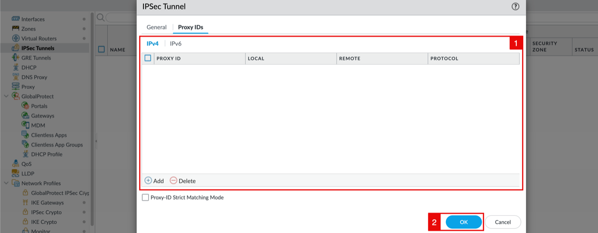

<!-- -->

1. Notice that the **first** IPSec Tunnel is created.
2. Click on the **add** button (to create the **second** tunnel).

    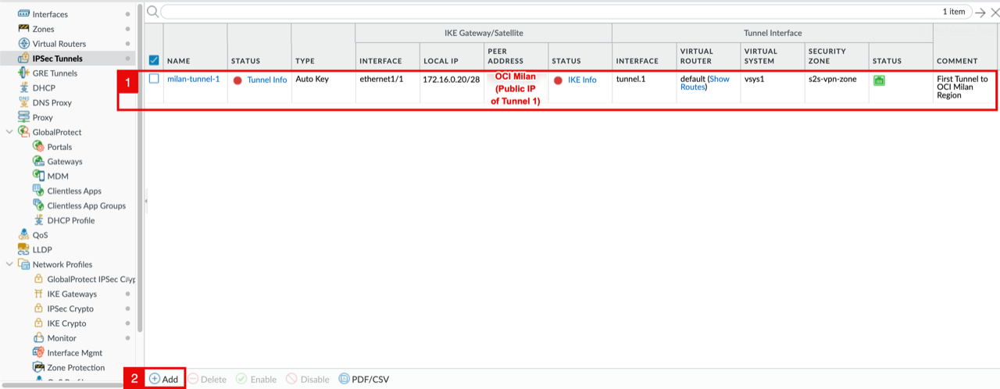

<!-- -->

1. Click on the **General** tab.
2. Specify a **Name** for the Tunnel.
3. Set the **Tunnel Interface** to tunnel.2.
4. Select the second **IKE Gateway** dedicated to tunnel 2.
5. Select the **IPSec Crypto Profile**.
6. Write down a **comment** dedicated to tunnel 2 if needed.
7. Click on the **Proxy IDs** tab.

    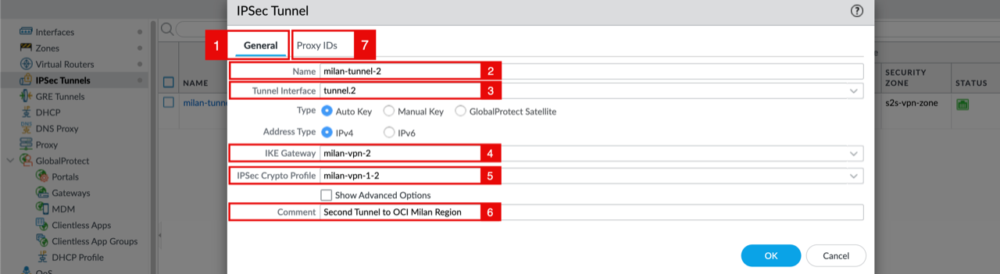

<!-- -->

1. Proxy IDs are used in policy-based IPSec VPNs to define the local and remote subnets allowed through the tunnel. Since we are using a route-based (static) VPN, leave it empty.
2. Click on the **OK** button.

    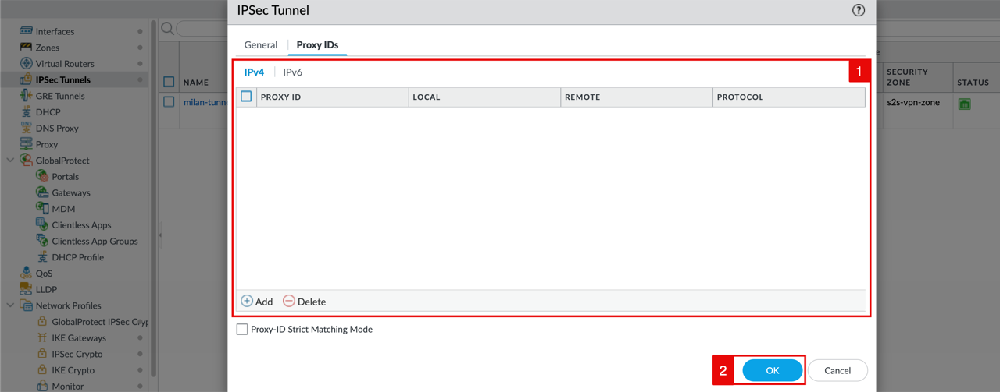

<!-- -->

1. Notice that the **second** IPSec Tunnel is created.
2. Click on the **Commit** button.

    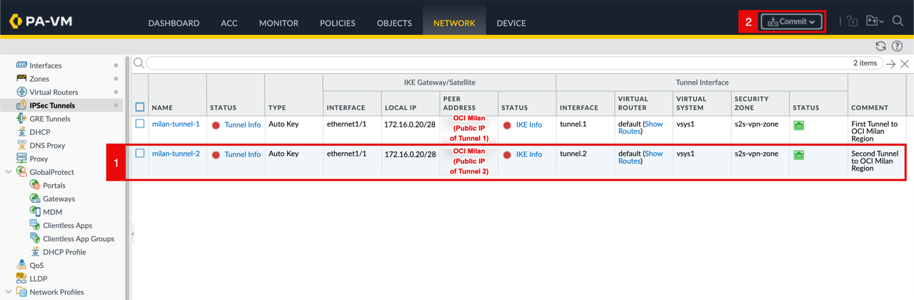

<!-- -->

1. Notice the message that commit will overwrite the running configuration.
2. Click on the **Commit** button.

    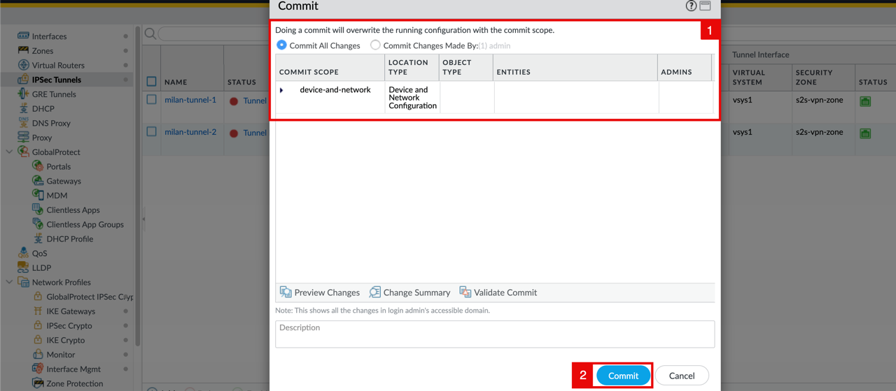

    - Wait for the **Commit** to complete.

    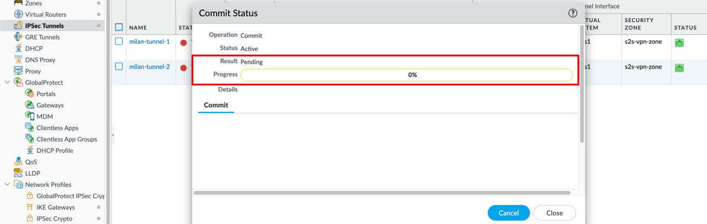

<!-- -->

1. Notice that the **Commit** has completed.
2. Click on the **Close** button.

    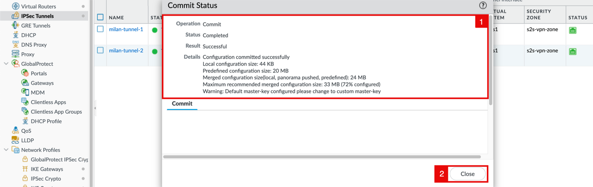

<!-- -->

1. Notice that Phase 1 (IKE) status is green (this can take few minutes).
2. Notice that Phase 2 (IPsec Tunnel) status is green (this can take few minutes).

    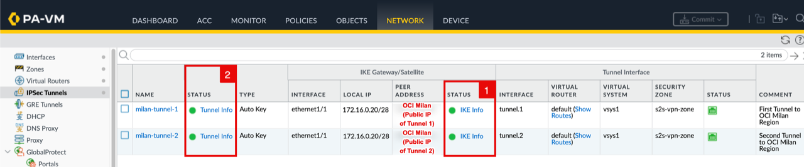

## Learn More

- [Site-to-Site VPN with Static Routing in Palo Alto](https://docs.paloaltonetworks.com/network-security/ipsec-vpn/administration/site-to-site-vpn-quick-configs/site-to-site-vpn-with-static-routing)
- [Supported IPSec Parameters in OCI](https://docs.oracle.com/en-us/iaas/Content/Network/Reference/supportedIPsecparams.htm)
- [OCI Site-to-Site VPN (IPSec) Best Practices](https://docs.oracle.com/en-us/iaas/Content/Resources/Assets/whitepapers/ipsec-vpn-best-practices.pdf)

## Acknowledgements

- **Authors** - Anas Abdallah, Iwan Hoogendoorn (Cloud Networking Black Belts)
- **Contributor** - Antonio Gámir (Cloud Networking Black Belt)
- **Last Updated By/Date** - Anas Abdallah, August 2026

You may now **proceed to the next lab**.
