# Verify and Validate the Site-to-Site IPSec VPN

## Introduction

In this lab, you confirm that the IPSec tunnels are up in the OCI native Site-to-Site VPN service in Milan. You then verify the DRG routes, test end-to-end connectivity, and review the traffic logs.

Estimated time: 10 minutes

### Objectives

In this lab, you will:

- Verify that the IPSec tunnels are established in the OCI native Site-to-Site VPN service in Milan.
- Verify that the DRG routes are active.
- Test end-to-end connectivity across the IPSec VPN.
- Review Palo Alto traffic logs for the validation traffic.

### Prerequisites

Before you begin, ensure you have completed the preceding required labs in this workshop.

## Task 1: Verify IPSec Status and DRG Routes

- Go back to the **OCI Console** and make sure you are in **Milan region**.
- Open the **hamburger menu** in the upper left corner.
- Go to **Networking** → **Site-to-Site VPN**.
- Select the **IPSec connection** that was created in **Lab 1.3**.
- Notice that both of the tunnels are **UP** as well.

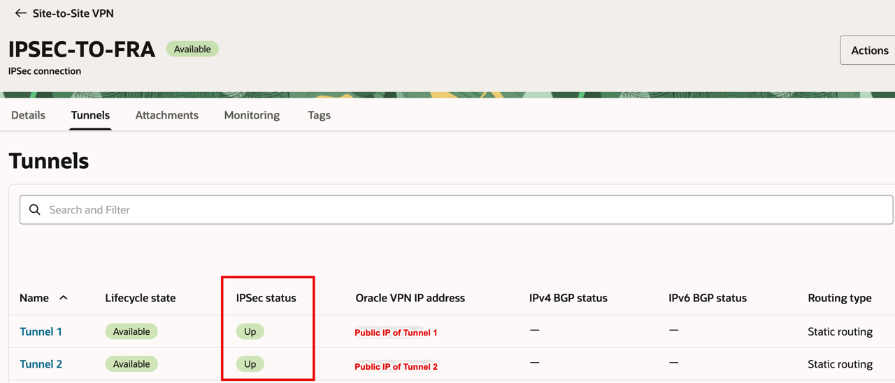

- Open the **hamburger menu** in the upper left corner.
- Go to **Networking** → **Dynamic Routing Gateway**.
- Select the **DRG**.
- Click on **Attachments**.
- Click on the **Autogenerated DRG Route Table for VCN attachments** (we reviewed this in Lab 1).

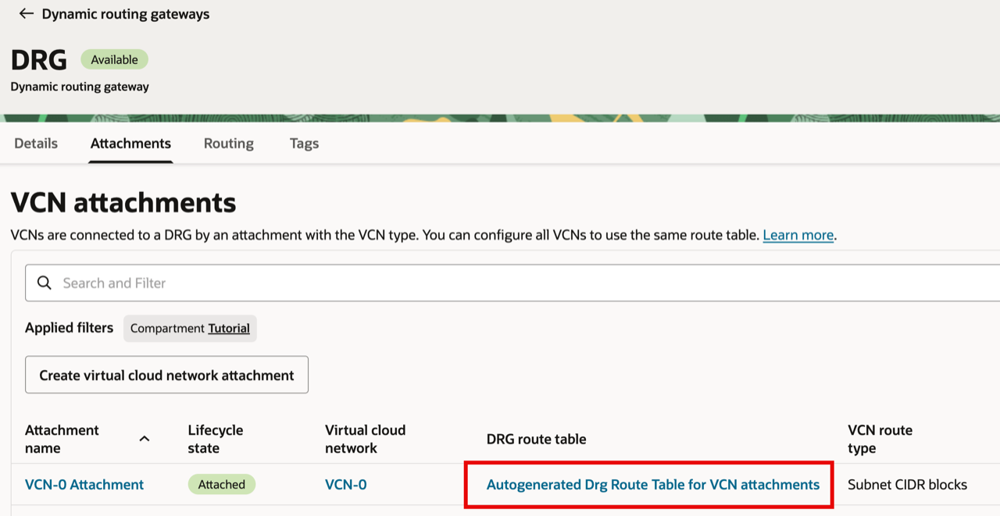

- Click on the **Get all route rules** button.

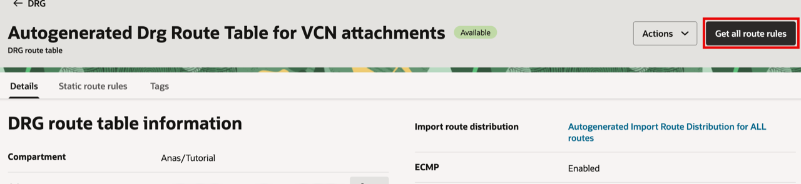

- Notice that routes to **Frankfurt** are now learned through the IPSec connection after the tunnel is established, and both routes are **Active** because **ECMP** is enabled.

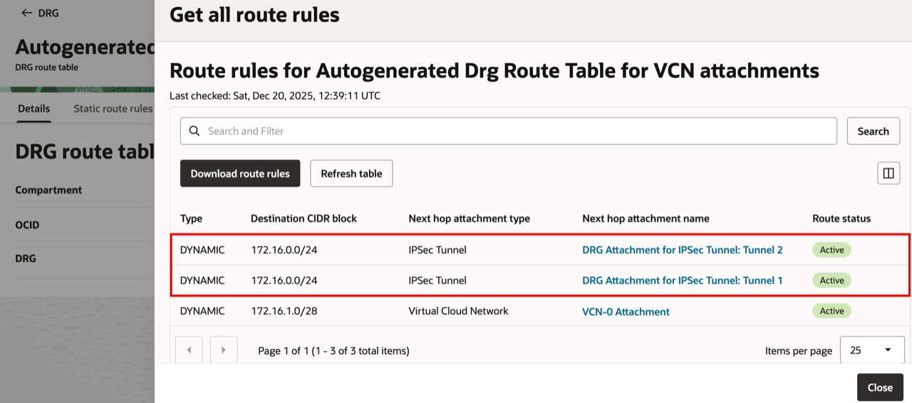

- If ECMP was disabled, one of the tunnels would show a **Conflict** status. However, since ECMP was enabled on the OCI Milan native VPN (Lab 1) and on the OCI Frankfurt Palo Alto (Lab 2), you should see both routes **Active**, similar to the screen above.

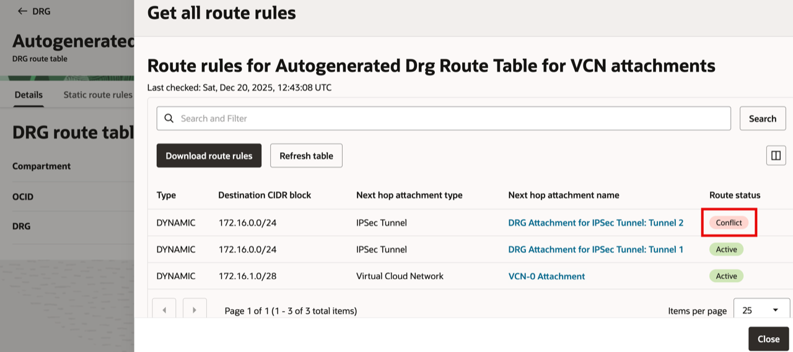

## Task 2: Test End-to-End Connectivity and Review Traffic Logs

**Single instance:**

- Access **VM-0 (172.16.1.5)** using its public IP, or via OCI Bastion/jump server if the instance is private.
- From VM-0, run a **ping** to the Untrust vNIC IP of the Palo Alto firewall **(172.16.0.20)**.

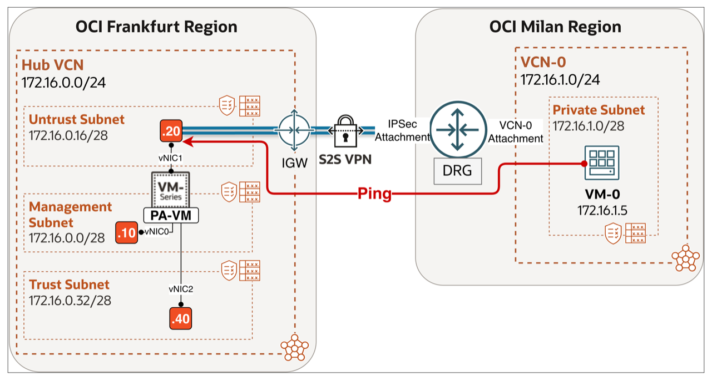

- A successful ping confirms that the Site-to-Site VPN is established and traffic is passing through the tunnels as expected.

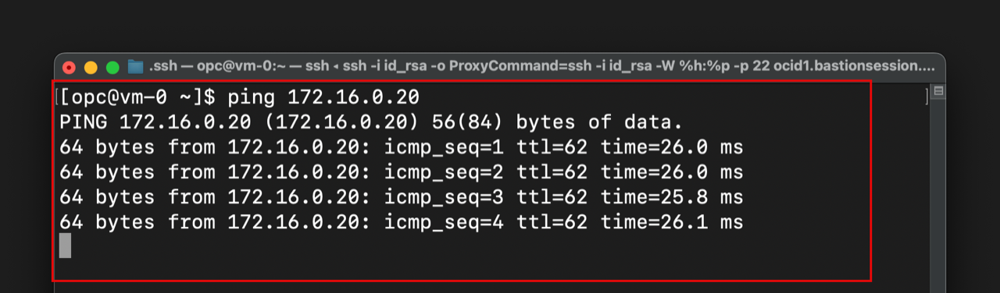

**Active/Passive:**

- Access **VM-0 (172.16.1.5)** using its public IP, or via OCI Bastion/jump server if the instance is private.
- From VM-0, run a **ping** to either Untrust vNIC primary or secondary (floating) IP of the Palo Alto firewall **(172.16.0.20 or 172.16.0.22)**.

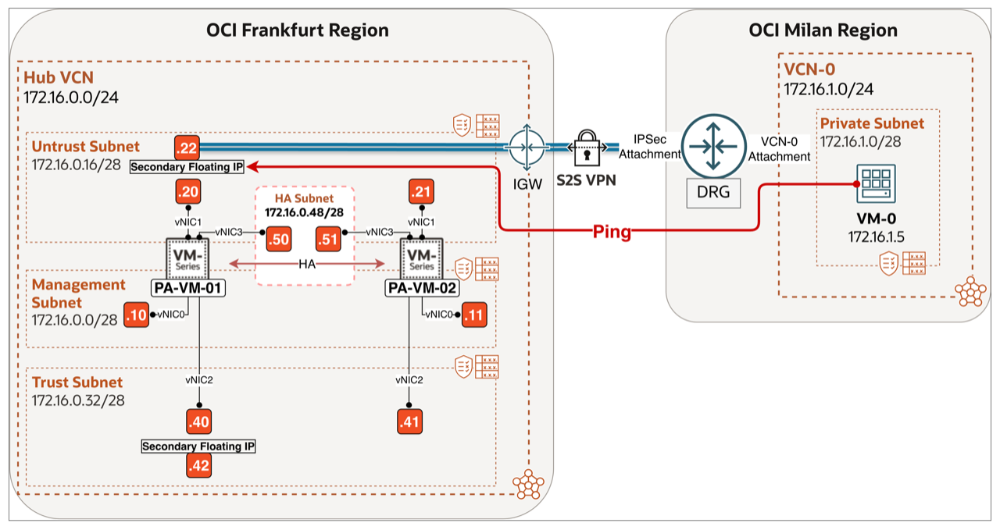

- A successful ping confirms that the Site-to-Site VPN is established and traffic is passing through the tunnels as expected.

**Active/Active:**

- Access **VM-0 (172.16.1.5)** using its public IP, or via OCI Bastion/jump server if the instance is private.
- From VM-0, run a **ping** to the Untrust vNIC IP of the Palo Alto firewall **(172.16.0.20)**.

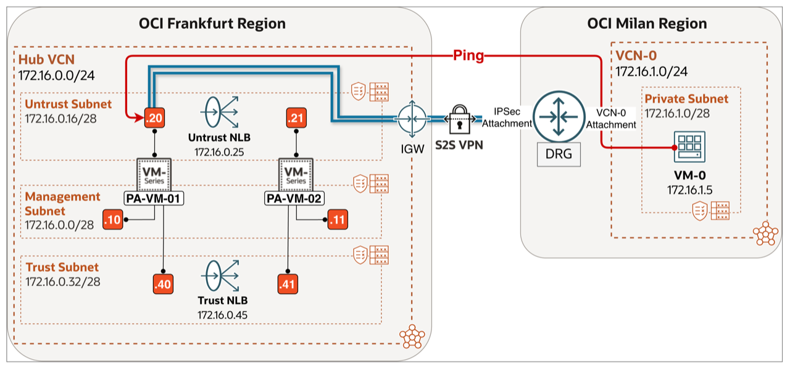

- A successful ping confirms that the Site-to-Site VPN is established and traffic is passing through the tunnels as expected.

- Return to the Palo Alto Web GUI and navigate to the logs to verify the traffic.

1. Click on **Monitor**.
2. Click on **Traffic**.
3. Notice that there is a log entry for the pings we just executed from VM-0.

    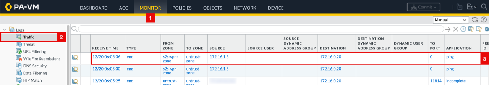

> **Note:** IPSec connectivity from Milan to Frankfurt can be validated by pinging a test VM in the Hub VCN or any Spoke VCN in Frankfurt once routing is correctly configured.
> In this workshop, validation is performed above by pinging the Palo Alto **Untrust (data) interface**. Ensure that a management profile allowing **ICMP** is applied to the Untrust interface (**Lab 2/Task 2**); otherwise, the test will fail, as data interfaces do not permit management traffic by default.
> Alternatively, you can validate connectivity in the opposite direction by logging in to the Palo Alto VM and pinging **VM-0**, as shown below.
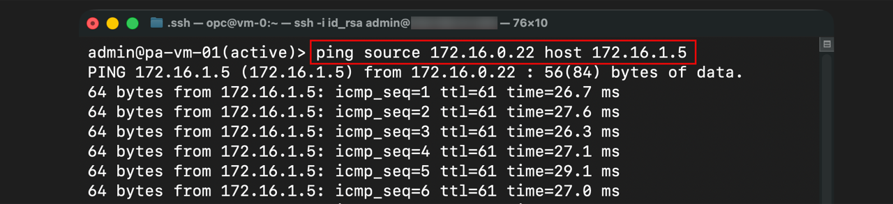

## Learn More

- [OCI Site-to-Site VPN Troubleshooting](https://docs.oracle.com/en-us/iaas/Content/Network/Troubleshoot/ipsectroubleshoot.htm)

## Acknowledgements

- **Authors** - Anas Abdallah, Iwan Hoogendoorn (Cloud Networking Black Belts)
- **Contributor** - Antonio Gámir (Cloud Networking Black Belt)
- **Last Updated By/Date** - Anas Abdallah, August 2026

You may now **proceed to the next lab**.
