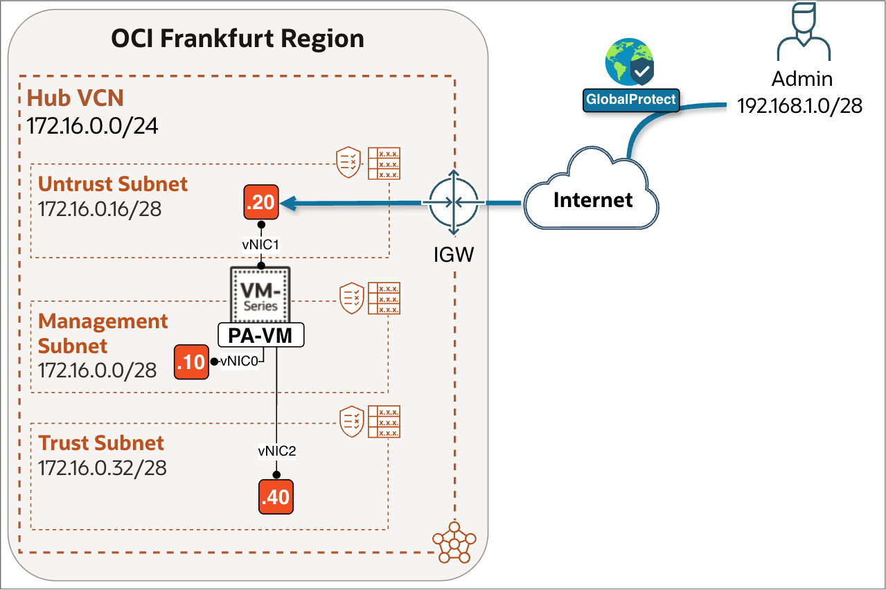
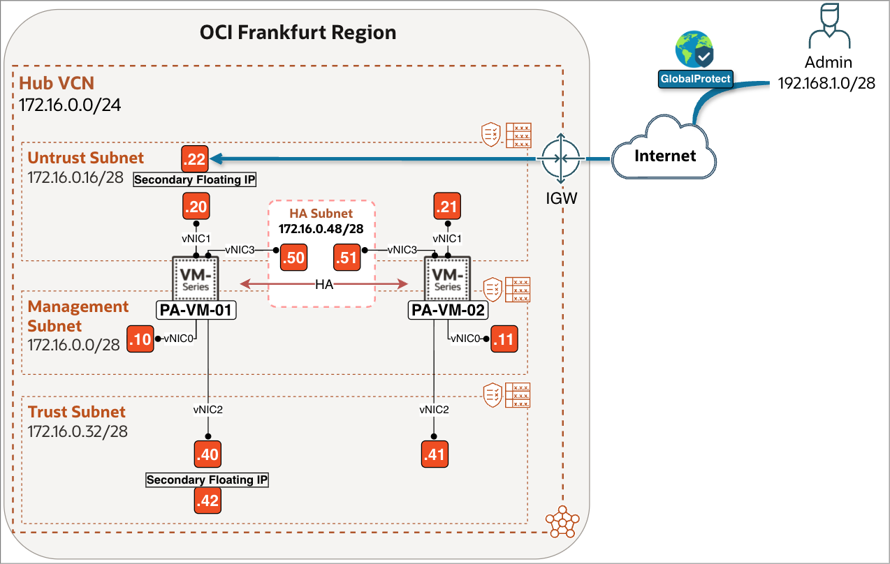
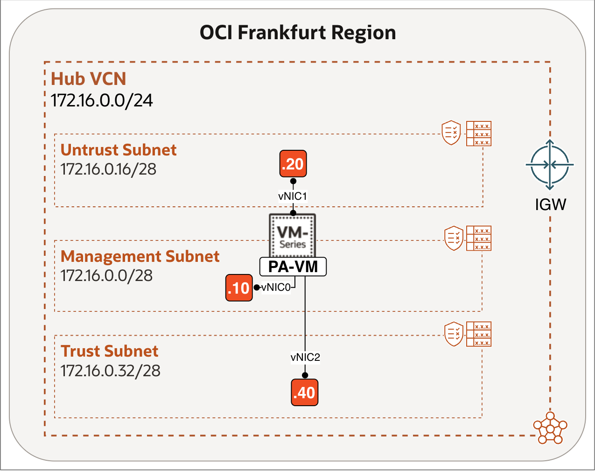
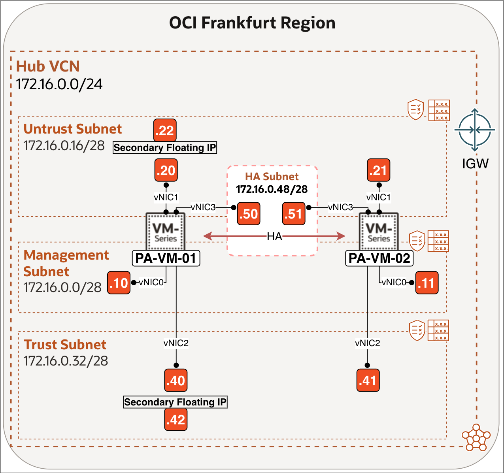
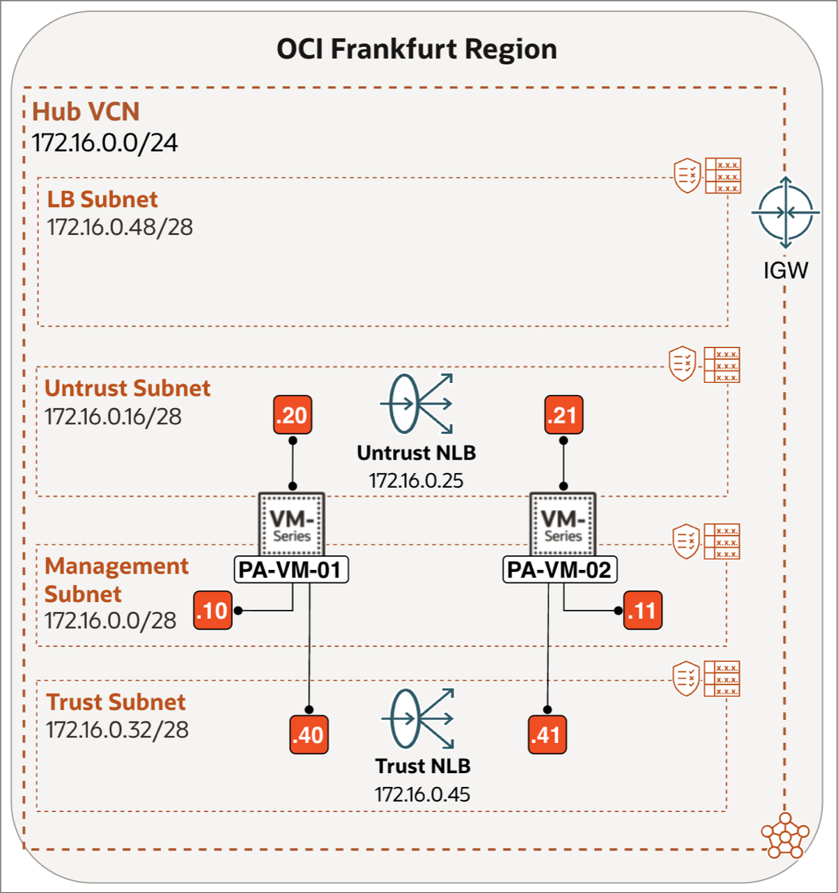

# Introduction

## About this Workshop

Organizations often need to provide secure access for remote users, such as administrators, employees, or support teams, to OCI-hosted resources. This workshop shows how to use GlobalProtect on a Palo Alto Next-Generation Firewall (NGFW) in OCI to provide remote-access VPN connectivity. The outcome is a working GlobalProtect portal and gateway that allows a remote user to establish an encrypted tunnel to the firewall.

For the workshop demonstration, a remote client is used to install the GlobalProtect agent, connect through the portal and gateway, and validate that the VPN tunnel is established successfully.

The workshop configures both the **GlobalProtect Portal**, which provides the client configuration, and the **GlobalProtect Gateway**, which terminates the VPN tunnel and assigns an IP address to the remote client.

The workshop explains how this connectivity is implemented for three Palo Alto deployment models in OCI:

- **Single Instance Setup** – one standalone NGFW.
- **Active/Passive Setup** – two NGFW instances in high availability mode.
- **Active/Active Setup** – two NGFW instances forwarding traffic simultaneously behind an OCI Network Load Balancer (NLB).

Estimated Workshop Time: 90 minutes

### Objectives

In this workshop, you will:
- Provision a tunnel interface and a security zone dedicated to remote VPN users.
- Generate a self-signed CA certificate and a server certificate for the Portal/Gateway.
- Configure an SSL/TLS Service Profile and a local user authentication profile.
- Configure the GlobalProtect Portal and Gateway, including the client IP pool.
- Download and activate the GlobalProtect Client software on the firewall and install the agent on a macOS device.
- Validate end-to-end Remote Access VPN connectivity and review traffic logs on the firewall.

#### **Single Instance Setup:**

This Single Instance design represents the simplest functional topology. It is ideal for proof-of-concept environments, labs, and small production deployments where simplicity is prioritized over redundancy.

In Frankfurt, a single Palo Alto VM-Series firewall is deployed inside a Hub VCN (172.16.0.0/24) using a three-interface design:
- Management Subnet (172.16.0.0/28) – for firewall administration.
- Untrust Subnet (172.16.0.16/28) – facing the Internet Gateway (IGW) and used as the GlobalProtect Portal and Gateway endpoint for remote-client connectivity.
- Trust Subnet (172.16.0.32/28) – facing internal workloads and routing toward protected networks.

Remote users connect from the Internet via the firewall's Untrust public IP. Once authenticated, GlobalProtect assigns them an IP from the address pool `192.168.1.0/28`, and traffic from the client is encapsulated in an SSL/IPSec tunnel back to the firewall.

#### **Active/Passive Setup:**

This Active/Passive design provides firewall high availability while keeping the VPN topology simple. One firewall terminates and forwards VPN traffic; the passive peer takes over if the active firewall fails.

In Frankfurt, two Palo Alto VM-Series firewalls (PA-VM-01 and PA-VM-02) are deployed in a Hub VCN (172.16.0.0/24) as an HA pair. The active firewall uses floating addresses on the Untrust and Trust interfaces; these move to the passive firewall during failover to preserve the VPN endpoint and internal next-hop routing.

Each firewall uses a four-interface design:
- Management Subnet (172.16.0.0/28) – for firewall administration.
- Untrust Subnet (172.16.0.16/28) – facing the Internet Gateway (IGW) and used as the GlobalProtect Portal and Gateway endpoint for remote-client connectivity.
- Trust Subnet (172.16.0.32/28) – facing internal workloads and routing toward protected networks.
- HA Subnet (172.16.0.48/28) – synchronization between the two firewalls.

Remote users connect from the Internet through the public IP associated with the floating Untrust address. Once authenticated, GlobalProtect assigns an address from the client IP pool and establishes an encrypted tunnel to the active firewall.

#### **Active/Active Setup:**

This Active/Active design allows both firewalls to accept and process GlobalProtect connections simultaneously. A dedicated public OCI Network Load Balancer (NLB) distributes remote-user connections to the firewalls and maintains client affinity, so each VPN session remains associated with the firewall that established it.

In Frankfurt, two Palo Alto VM-Series firewalls (PA-VM-01 and PA-VM-02) are deployed in a Hub VCN (172.16.0.0/24) as an Active/Active pair. Each firewall maintains its own session state, so traffic must remain symmetric. The GlobalProtect Portal and Gateway configuration must be applied consistently on both firewalls.

Each firewall uses a three-interface design:
- Management Subnet (172.16.0.0/28) – for firewall administration.
- Untrust Subnet (172.16.0.16/28) – facing the Internet Gateway (IGW) and used as the GlobalProtect Portal and Gateway endpoint for remote-client connectivity.
- Trust Subnet (172.16.0.32/28) – facing internal workloads and routing toward protected networks.

The GlobalProtect Portal and Gateway are bound to the primary private IP of the Untrust interface on each firewall, and remote users connect to the public IP of the VPN NLB, which then distributes the connection to one of the two firewalls.

### Prerequisites

#### **Single Instance Setup:**

Before starting this lab, ensure the following prerequisites are completed:

<!-- -->

1. Complete [Deploy Palo Alto NGFW in OCI (Standalone)](https://livelabs.oracle.com/ords/dbpm/r/livelabs/view-workshop?wid=4487). This workshop deploys the baseline Palo Alto VM-Series firewall in OCI Frankfurt, including the Hub VCN, subnets, Internet Gateway, and base firewall configuration.

2. Ensure you have:
    - OCI tenancy administrator or equivalent networking privileges.
    - Administrative access to the Palo Alto firewall in Frankfurt.
    - A valid GlobalProtect license on the firewall.
    - A local PC (Windows or Mac) used as the remote client to install the GlobalProtect agent and connect to the VPN.

#### **Active/Passive Setup:**

Before starting this lab, ensure the following prerequisites are completed:

<!-- -->

1. Complete [Deploy Palo Alto NGFW in OCI with Active/Passive HA](https://livelabs.oracle.com/ords/dbpm/r/livelabs/view-workshop?wid=4492). This workshop deploys two Palo Alto VM-Series firewalls in OCI Frankfurt configured as an Active/Passive HA pair, in addition to the base firewall configuration.

2. Ensure you have:
    - OCI tenancy administrator or equivalent networking privileges.
    - Administrative access to the Palo Alto firewalls in Frankfurt.
    - A valid GlobalProtect license on the firewall.
    - A local PC (Windows or Mac) used as the remote client to install the GlobalProtect agent and connect to the VPN.

#### **Active/Active Setup:**

Before starting this lab, ensure the following prerequisites are completed:

<!-- -->

1. Complete [Deploy Palo Alto NGFW in OCI with Active/Active HA](https://livelabs.oracle.com/ords/dbpm/r/livelabs/view-workshop?wid=4493). This workshop deploys two Palo Alto VM-Series firewalls in OCI Frankfurt configured as an Active/Active HA pair, in addition to the base firewall configuration.

2. Ensure you have:
    - OCI tenancy administrator or equivalent networking privileges.
    - Administrative access to the Palo Alto firewall in Frankfurt.
    - A valid GlobalProtect license on the firewalls.
    - A local PC (Windows or Mac) used as the remote client to install the GlobalProtect agent and connect to the VPN.
    - The Active/Active deployment from Part 3 already includes an Untrust NLB for inbound Internet traffic and a Trust NLB for OCI workload traffic toward the firewalls, including spoke-to-spoke traffic. In this workshop, you add a dedicated **VPN NLB** in front of the Untrust interfaces of both firewalls to load-balance inbound GlobalProtect traffic from the Internet (Lab 1). The VPN NLB needs its own subnet. Create an **LB Subnet (172.16.0.48/28)** with:
        - A security list that allows all ingress and egress traffic.
        - A custom route table with the following entry:

        | Destination | Target Type | Target      | Route Type |
        | ----------- | ----------- | ----------- | ---------- |
        | 0.0.0.0/0   | Private IP  | 172.16.0.25 | Static     |

> **Important:**
> 1) Allowing **All Protocols (Ingress)** in LB Subnet from `0.0.0.0/0` is not a best practice. We are only doing it here for simplicity and to avoid extra troubleshooting as we move into the later workshops in this series. In real deployments, allow only what you actually need.
> 2) You can **commit** after each configuration you make in Palo Alto (safer, easier to troubleshoot), or you can wait and commit once after completing all tasks (faster, fewer commits). In this workshop, you will commit the configuration once at the end of Task 2 in Lab 4.
> 3) The steps differ by deployment model:
> - **Standalone:** Apply these steps to the standalone firewall.
> - **Active/Passive:** Apply these steps to the active firewall; HA replicates the configuration to the passive peer.
> - **Active/Active:** Apply the GlobalProtect configuration consistently on both firewalls.

## Learn More

- [GlobalProtect Overview](https://docs.paloaltonetworks.com/globalprotect/getting-started/globalprotect-overview)
- [Create Interfaces and Zones for GlobalProtect](https://docs.paloaltonetworks.com/globalprotect/administration/get-started/create-interfaces-and-zones-for-globalprotect)
- [Introduction to OCI Network Load Balancer](https://docs.oracle.com/en-us/iaas/Content/NetworkLoadBalancer/introduction.htm)

## Acknowledgements

- **Authors** - Anas Abdallah, Iwan Hoogendoorn (Cloud Networking Black Belts)
- **Contributor** - Antonio Gámir (Cloud Networking Black Belt)
- **Last Updated By/Date** - Anas Abdallah, August 2026
