# Configure VPN Network Load Balancer (NLB) for Active/Active Setup

## Introduction

**This lab applies only to the Active/Active setup**. It configures a public OCI Network Load Balancer (NLB) as the highly available entry point for remote users, directing GlobalProtect traffic to both firewalls.

Estimated time: 10 minutes

### Objectives

In this lab, you will:
- Create and configure the VPN Network Load Balancer.
- Add both Active/Active firewalls as NLB backends for VPN traffic.

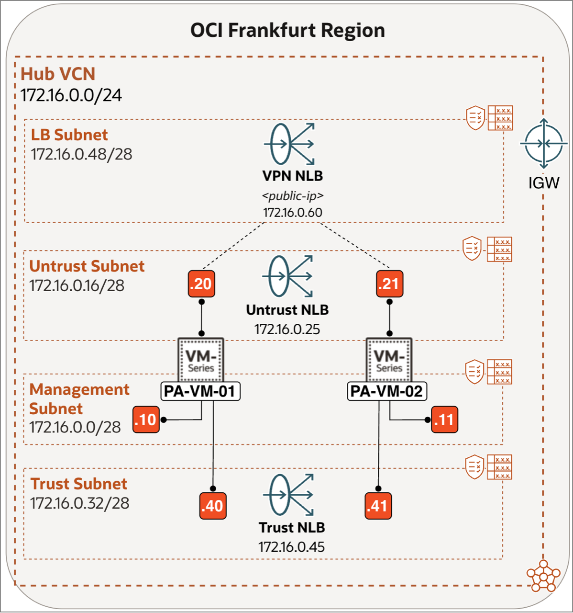

### Prerequisites

Before you begin, ensure you have completed the preceding required labs in this workshop.

## Task 1: Configure VPN Network Load Balancer (NLB) for Active/Active Setup

In an Active/Active setup, a Network Load Balancer (NLB) sits in front of both firewall nodes and distributes incoming traffic across them. For GlobalProtect, the NLB serves as the single entry point from the internet, clients connect to the NLB's public IP, and traffic is forwarded to one of the PA-VM instances based on a 2-tuple hash (source IP and destination IP), ensuring that a specific client always lands on the same firewall node for session consistency.

1. Select the correct **region**.
2. Click on the **hamburger menu** in the top left corner.

    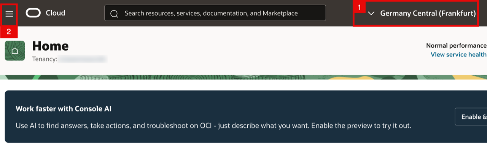

<!-- -->

1. Click on **Networking**.
2. Click on **Network load balancer**.

    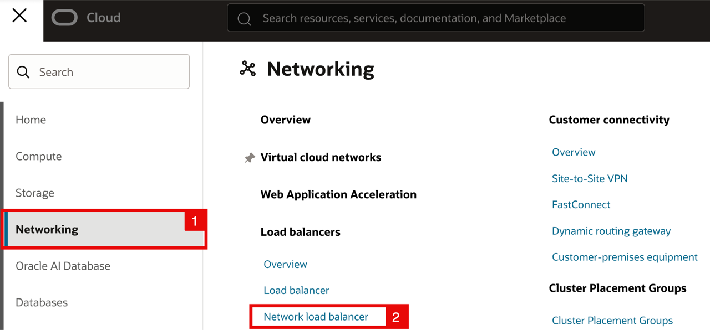

    - Click on the **Create network load balancer** button.

    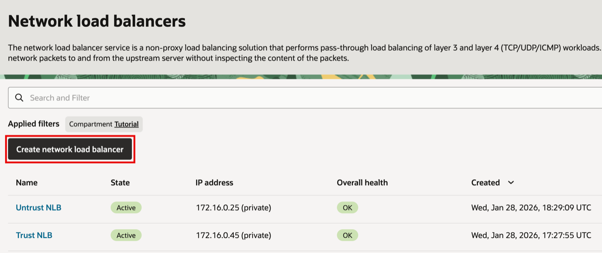

<!-- -->

1. Specify a **Network load balancer name** (e.g. `VPN NLB`).
2. Select **Public**.

    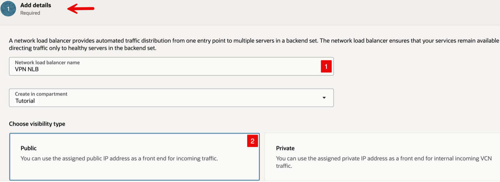

    - Scroll down.

<!-- -->

1. Select **Ephemeral IPv4 address**.
2. Select the VCN called **Hub VCN**.
3. Select existing (LB) **Subnet**.

    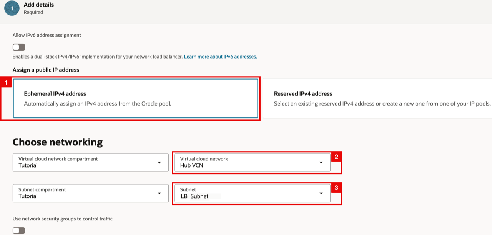

    - Scroll down.

<!-- -->

1. Select **Ephemeral private IPv4 address**.
2. Click on the **Next** button.

    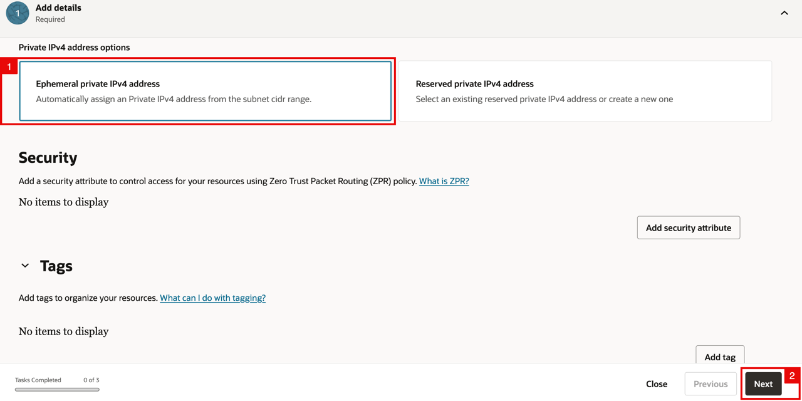

<!-- -->

1. Specify a **Listener name**.
2. Select **UDP/TCP** for the **type of traffic the listener handles**.

    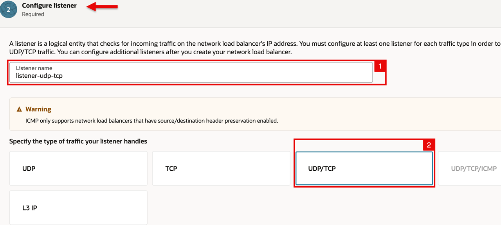

    - Scroll down.

<!-- -->

1. Select **Use any port**.
2. **Specify the maximum timeout for UDP in seconds** to 120.
3. **Specify the maximum timeout for TCP in seconds** to 360.
4. Click on the **Next** button.

    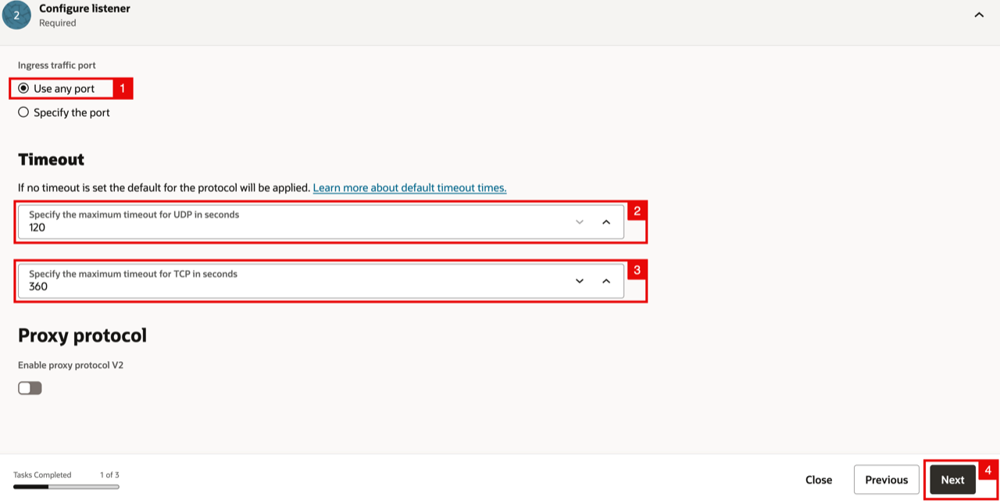

<!-- -->

1. Specify a **Backend set name**.
2. Select the **Default** mode.
3. Click the **Add backends** button.

    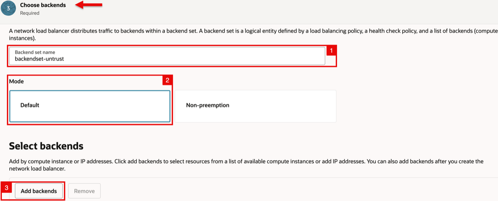

    - Select **Compute Instances**.

    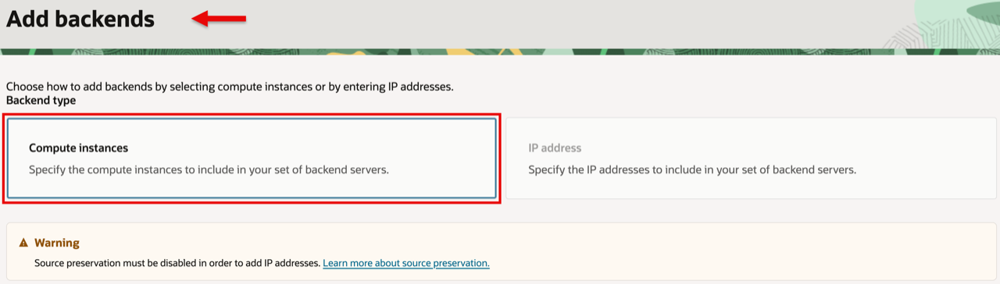

    - Scroll down.

<!-- -->

1. Select the first (PA-VM-01) **instance** as backend.
2. Select the (untrusted) **IP address**.
3. Select the correct **Availability Domain** (AD1).
4. Select the **weight** (to be 1).
5. Click the **Add another backend** button.

    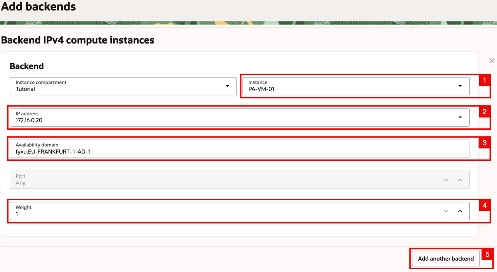

    - Scroll down.

<!-- -->

1. Select the first (PA-VM-02) **instance** as backend.
2. Select the (untrusted) **IP address**.
3. Select the correct **Availability Domain** (AD2).
4. Select the **weight** (to be 1).
5. Click the **Add backends** button.

    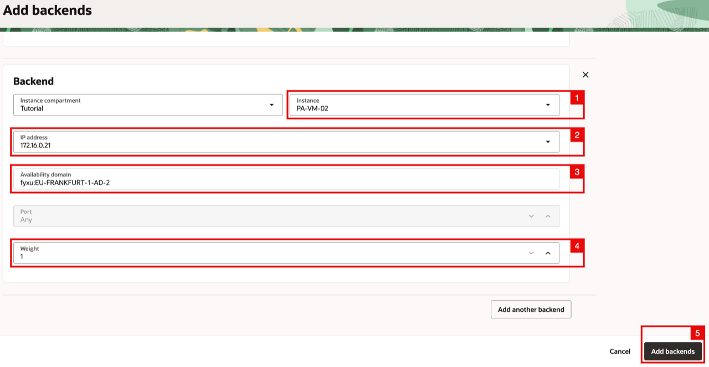

<!-- -->

1. Notice that both Instances are added as a backend to the backend set.
2. Enable **source IP preservation**.

    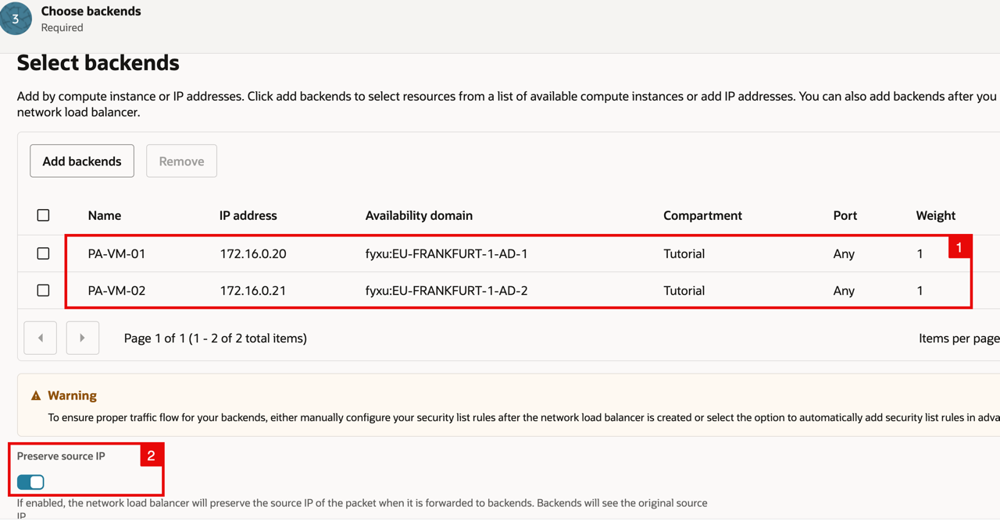

    - Scroll down to configure the **health check policy**.

<!-- -->

1. Select the **Protocol** to be HTTP.
2. Select the **Port** to be 80.
3. Select the **Interval in milliseconds** to be 10000 (default).
4. Select the **Timeout in milliseconds** to be 3000 (default).
5. Select the **Number of retries** to be 3 (default).

    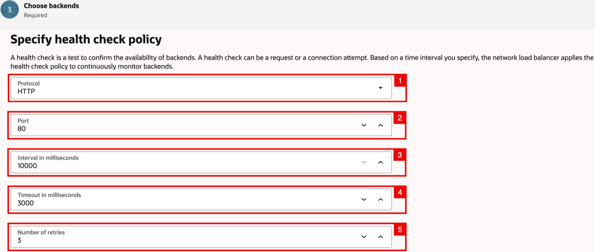

    - Scroll down.

<!-- -->

1. Select the **Status Code** to be 200 (default).
2. Select the **URL path (URI)** to be / (default).

    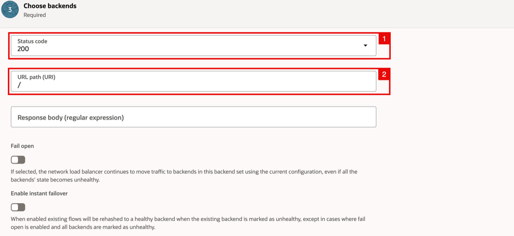

    - Scroll down.

<!-- -->

1. Select **Manually configure security list rules after the network load balancer is created**.
2. Select the **policy** to be **2-tuple hash**.
3. Click on the **Next** button.

    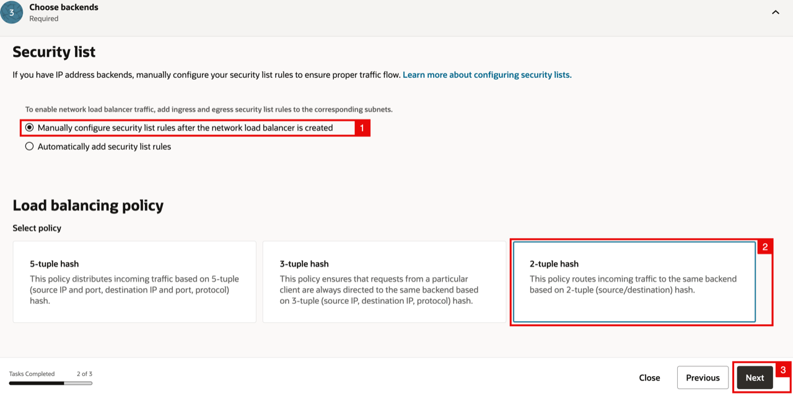

    - Notice you are in the **Review** section (review your settings and if you want to change anything click on the previous button).
    - Click on **Create network load balancer** button.

    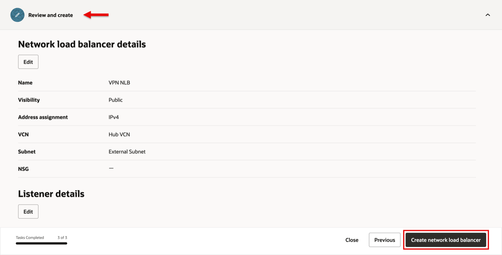

    - The Network Load Balancer is now being created.

    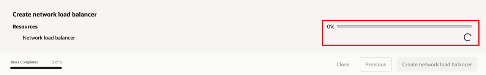

    - Notice that the **Overall health** will be Unknown in the beginning.

    

    - After a few moments the **Overall health** will change form Unknown to OK.

    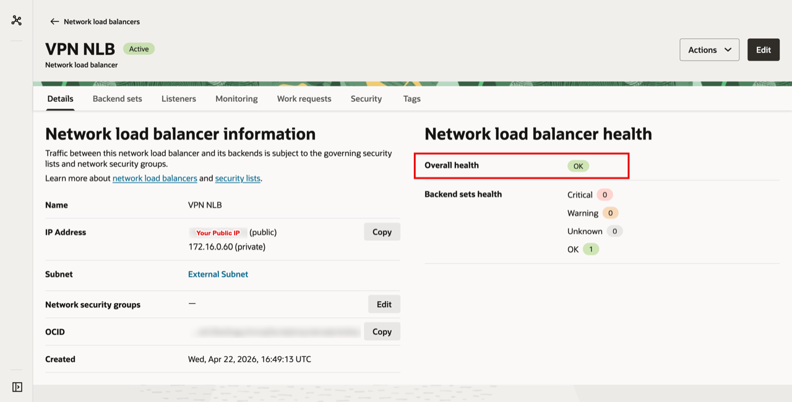

    > **Note:** Ensure you create and assign a management profile to the Untrust interface (ethernet1/1) on both firewalls in Lab 2; otherwise, the Network Load Balancer health check will fail.

## Learn More

- [Introduction to Network Load Balancer](https://docs.oracle.com/en-us/iaas/Content/NetworkLoadBalancer/introduction.htm)

## Acknowledgements

- **Authors** - Anas Abdallah, Iwan Hoogendoorn (Cloud Networking Black Belts)
- **Contributor** - Antonio Gámir (Cloud Networking Black Belt)
- **Last Updated By/Date** - Anas Abdallah, August 2026

You may now **proceed to the next lab**.
