# Prepare the Firewall for GlobalProtect

## Introduction

This lab prepares the Palo Alto firewall for GlobalProtect before you configure certificates, TLS, and the Portal/Gateway. You create the tunnel interface and Remote Access VPN security zone that terminate remote-user traffic, enable management access on the Untrust interface for the NLB health check, and configure the local user authentication components used by the portal and gateway. In an Active/Active deployment, apply the required firewall configuration on both peers so either node can serve remote users.

Estimated time: 15 minutes

### Objectives

In this lab, you will:
- Create the GlobalProtect tunnel interface and remote-VPN zone.
- Create and assign the Untrust interface management profile.
- Create the local user and authentication profile.

### Prerequisites

Before you begin, ensure you have completed the preceding required labs in this workshop.

## Task 1: Create tunnel interface

In this task, you create the required **tunnel interface** on the Palo Alto firewall. This logical interface will be used by the Remote Access VPN (GlobalProtect) to terminate VPN client connections and route traffic between remote users and resources in OCI. Correct tunnel interface configuration is essential, as it provides the Layer-3 interface used by the GlobalProtect gateway and allows the firewall to route traffic coming from connected VPN users.

- Go to the management web GUI of the Palo Alto firewall.

1. Click on the **Network** tab.
2. Click on **Interfaces**.
3. Click on the **Tunnel** tab.
4. Click on the **Add** button.

    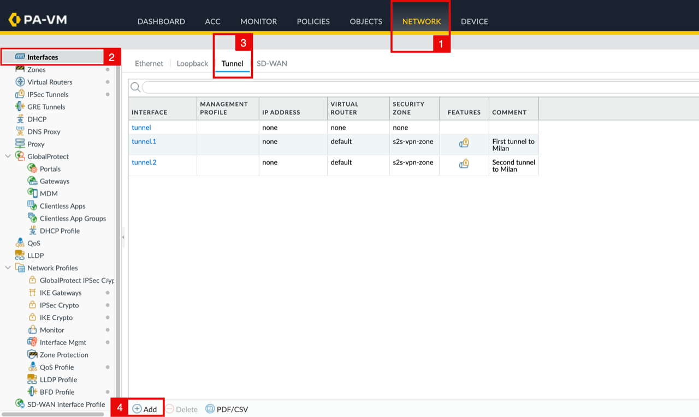

<!-- -->

1. Specify 3 to be the **number** of the tunnel.
2. Specify a **comment** / **description** of the tunnel.
3. Click on the **Config** tab.
4. Choose the default **Virtual Router**.
5. Click on the **Security Zone**.
6. Click on the **New Zone** button.

    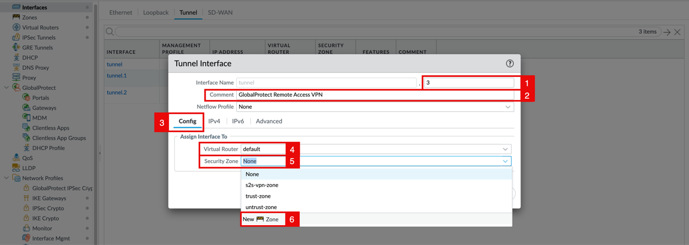

<!-- -->

1. Specify a **Name** for the new security zone.
2. Check **Enable User Identification** box. This maps traffic to usernames, so you can see which user is accessing OCI resources through GlobalProtect in your logs.
3. Click on the **OK** button.

    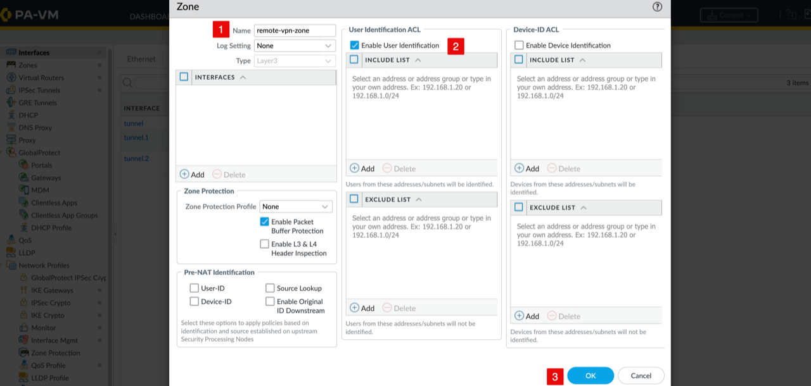

<!-- -->

1. Make sure the newly created **security zone** is selected.
2. Click on the **OK** button.

    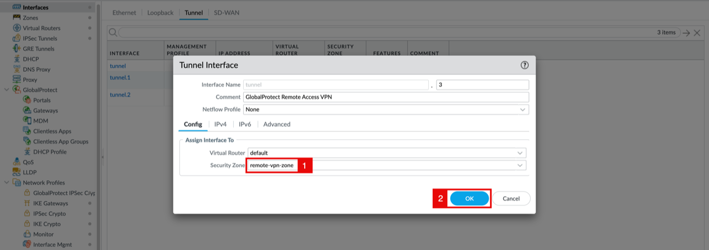

    - Notice that the tunnel is created successfully.

    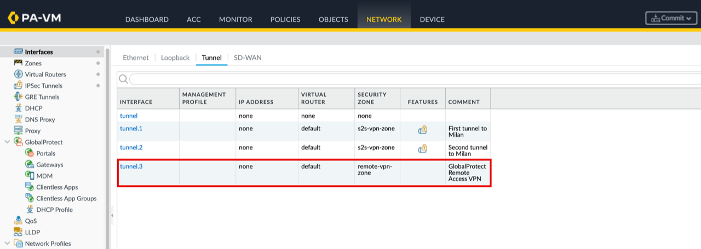

## Task 2: Create and Assign Management Profile to Untrust Interface

In this task, you create and assign an Interface Management Profile to the untrust interface on the Palo Alto firewall. Interface Management Profiles control which administrative and diagnostic services -such as HTTPS, SSH, or ICMP- are permitted on a given interface.

By default, data interfaces do not allow any management traffic. Applying a management profile explicitly enables only the services you need while keeping everything else blocked, which supports a least-privilege security posture.

In this workshop, the profile enables two services on the untrust interface:

- **ICMP**: to validate basic connectivity and reachability with `ping` when testing the Remote Access VPN from your PC.
- **HTTP**: to allow `curl` testing from your PC, and **for Active/Active**: to pass the VPN NLB health check.

- Navigate to the **Network** tab.

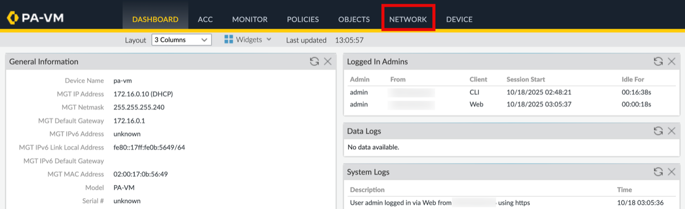

1. Click on **Interface Mgmt**.
2. Click on the **Add** button.

    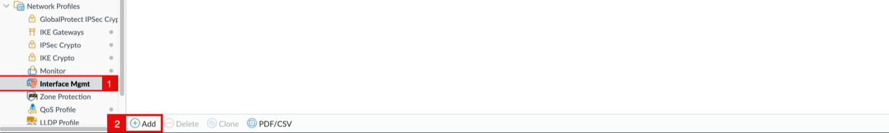

<!-- -->

1. Specify a **Name** for the Interface Management Profile.
2. Check the **HTTP** Administrative Management Services box.
3. Check the **Ping** Network Services box.
4. Click on the **Add** button.
5. Specify the **CIDR block** or **IP address** that will be allowed to ping the firewall’s Untrust interface, which is `192.168.1.0/28` and represents the address pool assigned to VPN clients. This IP pool will be configured in Lab 4, Task 2, while setting up the GlobalProtect Gateway.
6. Click on the **OK** button.

    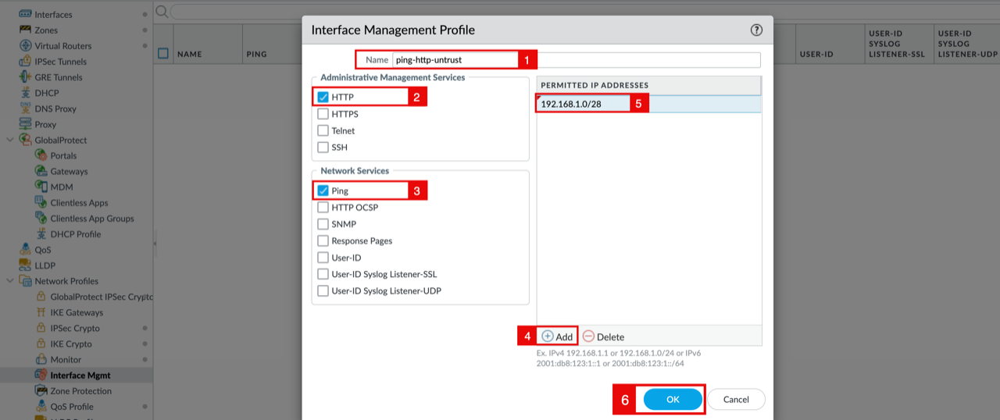

<!-- -->

1. Notice that the Interface Management Profile is now created.
2. Click on **Interfaces**.

    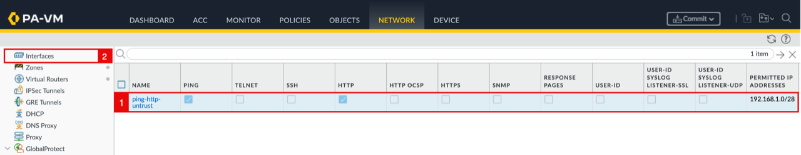

    - Click on interface **ethernet1/1**.

    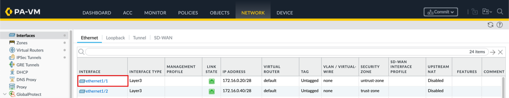

<!-- -->

1. Click on the **Advanced** tab.
2. Select the **Interface Management Profile** we just created.
3. Click on the **OK** button.

    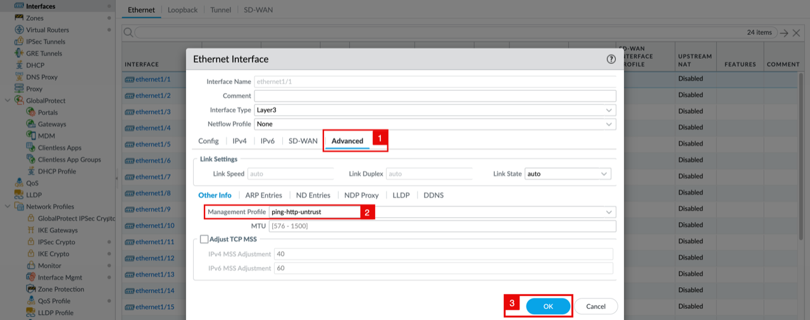

    - Click on **Yes**.

    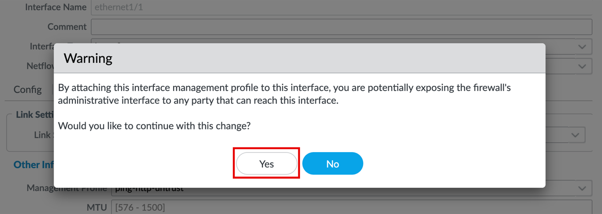

    - Notice that the **Interface Management Profile** is assigned to interface ethernet1/1.

    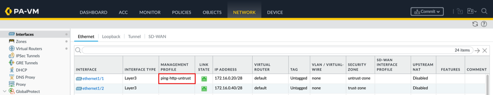

    - **For Active/Active only:** add the LB Subnet CIDR `172.16.0.48/28` to the `http-untrust` interface management profile created in Part 3 of the workshop. Without this, the VPN NLB health checks (Lab 1) originating from the LB Subnet will be denied by the firewall, causing the backends to be marked unhealthy.

    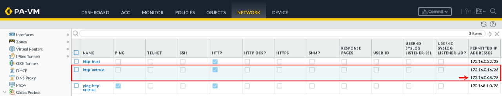

## Task 3: Configure User Authentication

In this task, you configure how the GlobalProtect Portal and Gateway authenticate remote users. To keep the lab self-contained, you will use the firewall's **Local User Database** rather than an external identity provider (LDAP, RADIUS, SAML, etc.). The flow is:

1. Create a **local user** with a password.
2. Create an **Authentication Profile** that points to the Local User Database and limits access to that user.

<!-- -->

1. Navigate to the **Device** tab.

    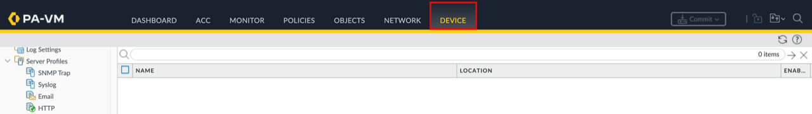

<!-- -->

1. Click on **Users** under **Local User Database**.
2. Click on the **Add** button.

    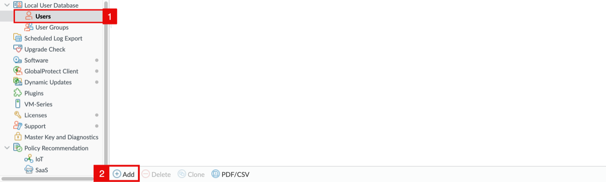

<!-- -->

1. Specify a **Name** for the user (e.g. `Anas`).
2. Set the **Mode** to **Password**.
3. Specify a **Password**.
4. **Confirm Password**.
5. Make sure the **Enable** box is checked.
6. Click on the **OK** button.

    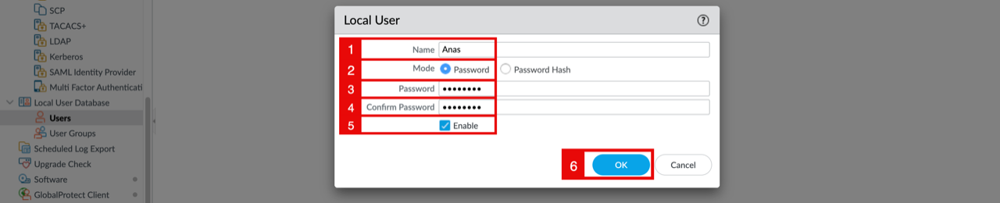

<!-- -->

1. Notice that the user has been created.
2. Click on **Authentication Profile**.

    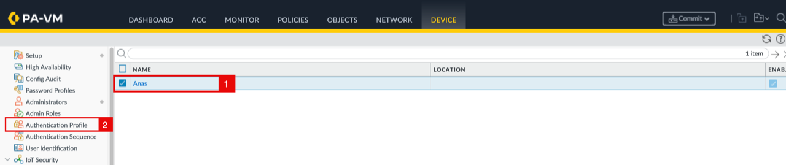

    - Click on the **Add** button.

    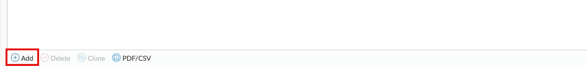

<!-- -->

1. Specify a **Name** for the Authentication Profile (e.g. `GP-AuthN-Profile`).
2. Click on the **Authentication** tab.
3. Set the **Type** to **Local Database**.
4. Click on the **Advanced** tab.

    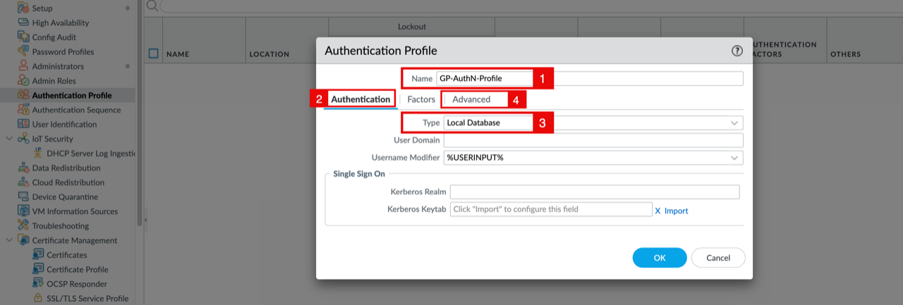

<!-- -->

1. Click on the **Add** button to add an entry to the Allow List.
2. Select the local user we just created (`Anas`).
3. The **Account Lockout** section can be configured to lock user accounts after a number of failed login attempts. We will leave it empty for this workshop.
4. Click on the **OK** button.

    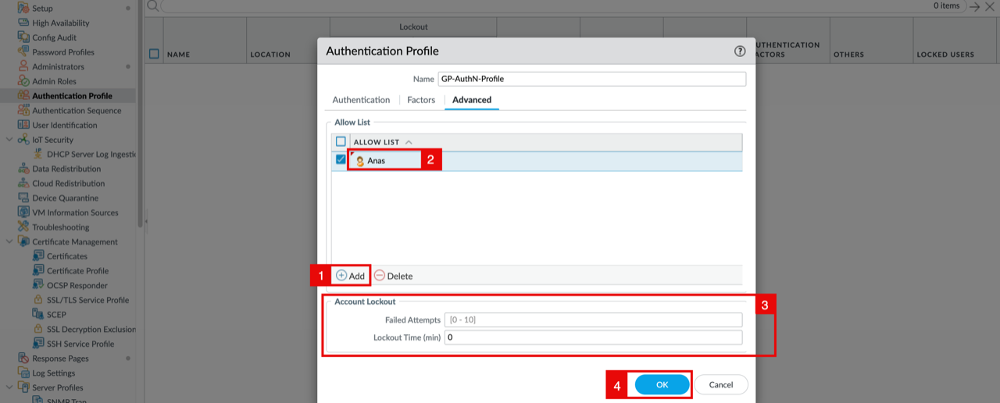

    - Notice that the Authentication Profile is created and references the Local Database with `Anas` in the allow list.

    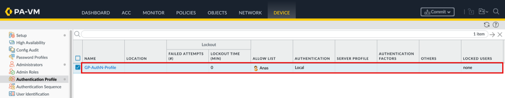

## Learn More

- [Create Interfaces and Zones for GlobalProtect](https://docs.paloaltonetworks.com/globalprotect/administration/get-started/create-interfaces-and-zones-for-globalprotect)
- [GlobalProtect User Authentication](https://docs.paloaltonetworks.com/globalprotect/administration/globalprotect-user-authentication)
- [Set Up External Authentication](https://docs.paloaltonetworks.com/globalprotect/administration/globalprotect-user-authentication/set-up-external-authentication)

## Acknowledgements

- **Authors** - Anas Abdallah, Iwan Hoogendoorn (Cloud Networking Black Belts)
- **Contributor** - Antonio Gámir (Cloud Networking Black Belt)
- **Last Updated By/Date** - Anas Abdallah, August 2026

You may now **proceed to the next lab**.
