# Configure Certificates and TLS

## Introduction

This lab creates and prepares the certificates and TLS profile that secure communication between GlobalProtect clients and the Portal and Gateway.

Estimated time: 25 minutes

### Objectives

In this lab, you will:
- Create the self-signed CA certificate.
- Create the Portal/Gateway server certificate.
- Trust the CA certificate on the client.
- Replicate the certificates for the Active/Active deployment.
- Create the SSL/TLS Service Profile.

### Prerequisites

Before you begin, ensure you have completed the preceding required labs in this workshop.

## Task 1: Create the Self-Signed CA Certificate

- Click on the **Device** tab.

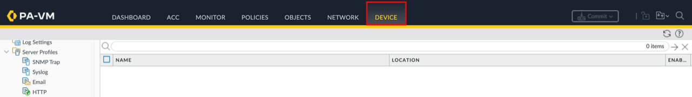

1. Click on **Certificates** under **Certificate Management**.
2. Click on the **Generate** button.

    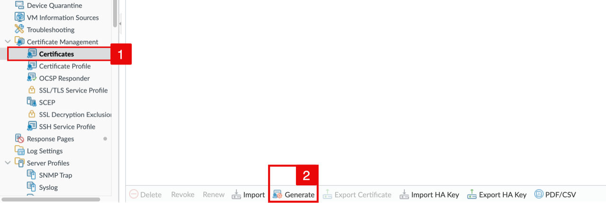

<!-- -->

1. Set the **Certificate Type** to **Local**.
2. Specify a **Certificate Name** (e.g. `GP-CA-Cert`).
3. Specify a **Common Name** (e.g. `GP-CA-Cert`).
4. Check the **Certificate Authority** box (this is what makes it a CA).
5. Leave the **Cryptographic Settings** at their default values.
6. Click on the **Generate** button.

    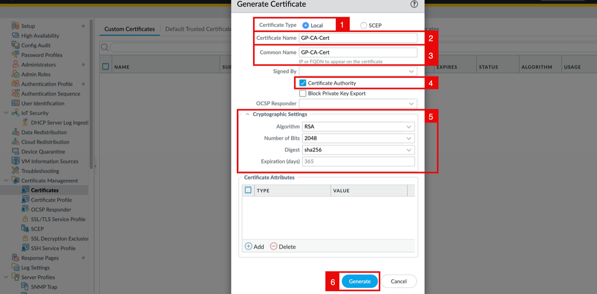

    - Click on the **OK** button to acknowledge that the certificate and key pair have been generated successfully.

    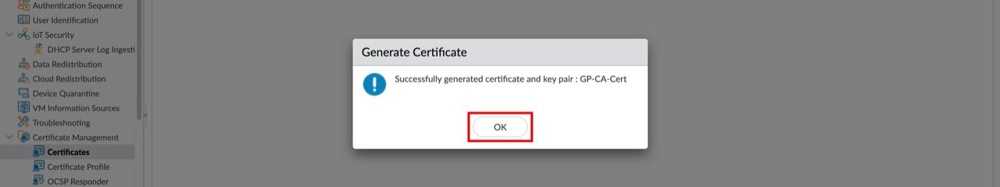

## Task 2: Create the Portal/Gateway Server Certificate

1. Notice that the CA certificate (`GP-CA-Cert`) is now listed.
2. Click on the **Generate** button to create the second certificate.

    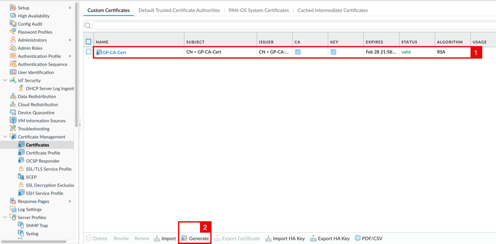

<!-- -->

1. Set the **Certificate Type** to **Local**.
2. Specify a **Certificate Name** (e.g. `GP-Portal-Gateway-Cert`).
3. Set the **Common Name** as follows:
    - **Single Instance:** Untrust primary public IP.
    - **Active/Passive:** Untrust secondary/floating public IP.
    - **Active/Active:** VPN NLB public IP.
4. Set **Signed By** to the CA we just created (`GP-CA-Cert`).
5. Leave **Certificate Authority** unchecked (this is a server certificate, not a CA).
6. Leave the **Cryptographic Settings** at their default values.
7. Click on the **Generate** button.

    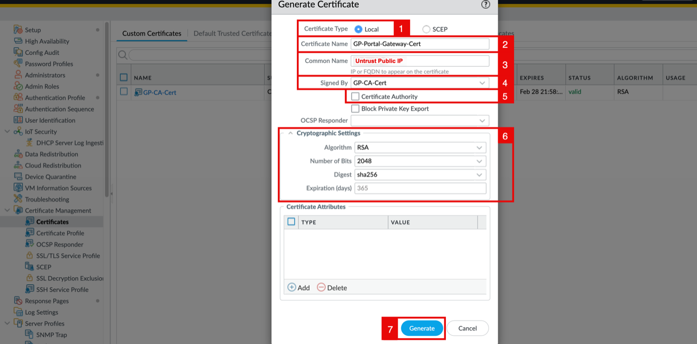

    - Click on the **OK** button to acknowledge that the certificate and key pair have been generated successfully.

    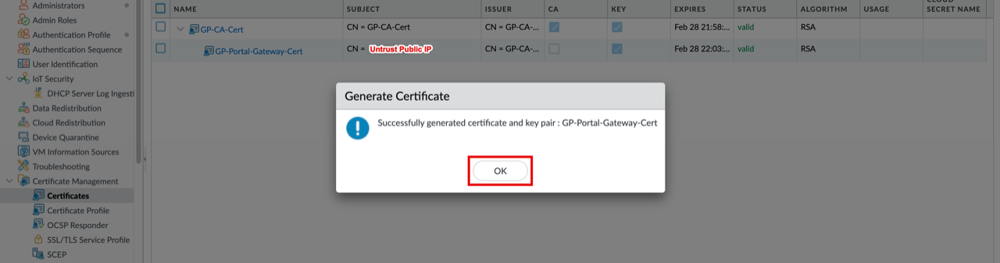

## Task 3: Export the CA Certificate and Trust it on Your PC

The CA certificate is self-signed, so the client PC will not trust it by default. Export the CA from the firewall and install it in the local trust store. This step is optional for testing but recommended so the GlobalProtect agent does not throw certificate warnings. PC Client here is macOS.

1. Notice the **GP-Portal-Gateway-Cert** is created.
2. Select the **GP-CA-Cert** row.
3. Click on the **Export Certificate** button.

    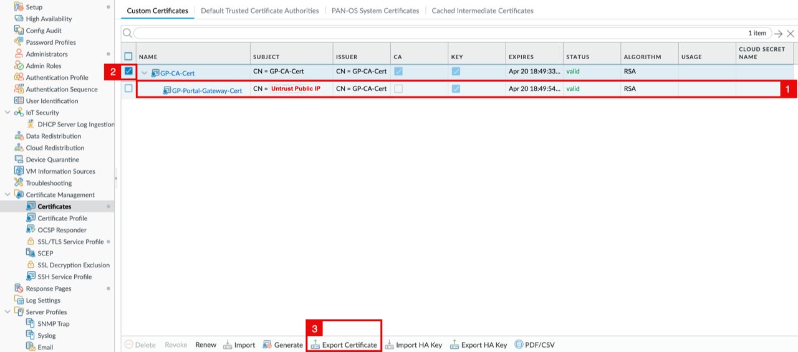

<!-- -->

1. Set the **File Format** to **Base64 Encoded Certificate (PEM)**.
2. Click on the **OK** button.

    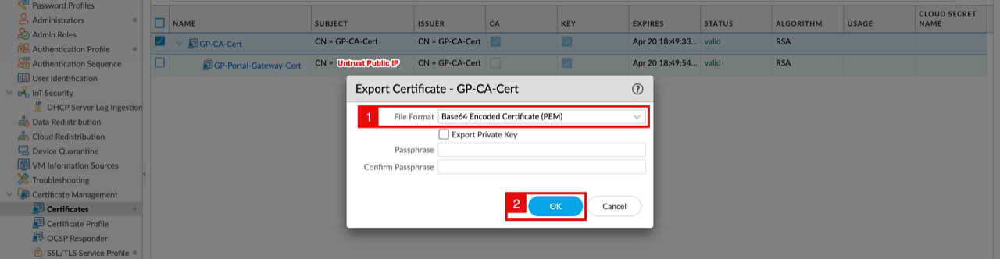

<!-- -->

1. Open the browser's downloads list.
2. Verify that the CA certificate file **`cert_GP-CA-Cert.crt`** appears in the list and shows **Done**, confirming the export was successful. Click the file to open it.

    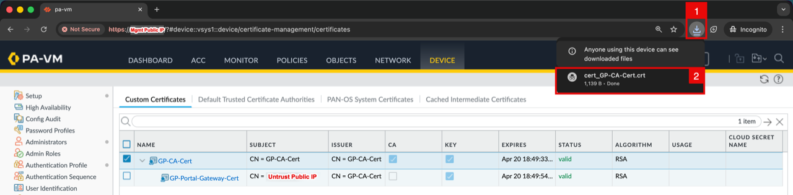

    - **Keychain Access** opens and prompts for authentication to modify the System keychain.

    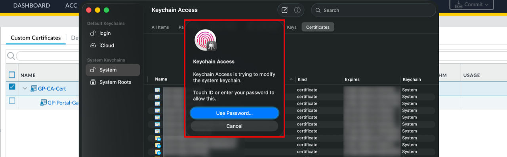

    - The CA certificate is added to the System keychain.

    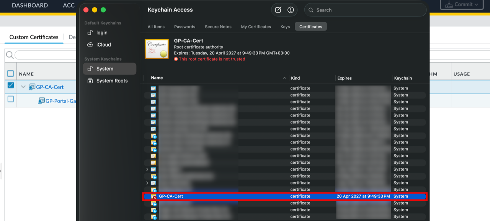

<!-- -->

1. Notice the warning **This root certificate is not trusted**.
2. Expand the **Trust** section.

    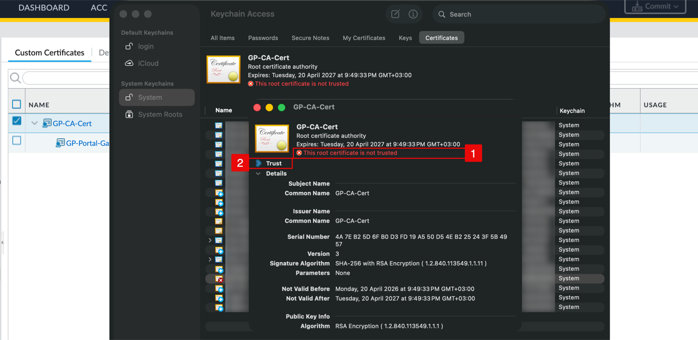

    - Open the **When using this certificate** dropdown.

    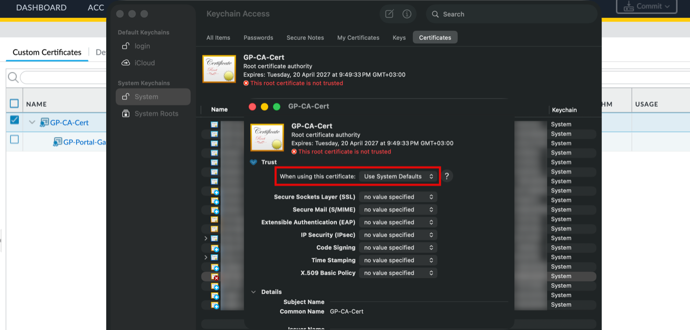

    - Select **Always Trust**.

    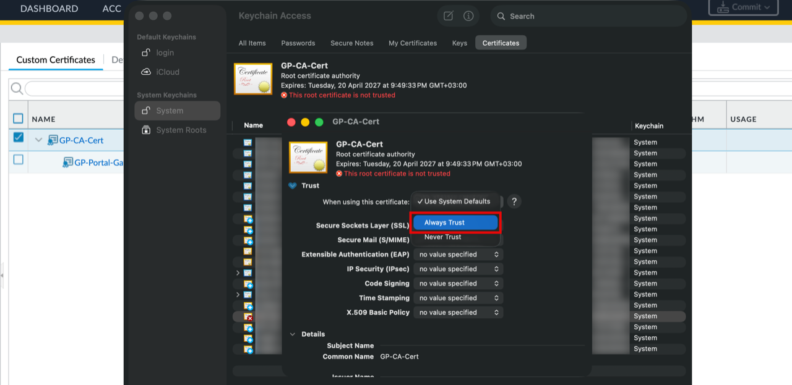

<!-- -->

1. All trust settings switch to **Always Trust**.
2. Close the certificate window to apply the changes.

    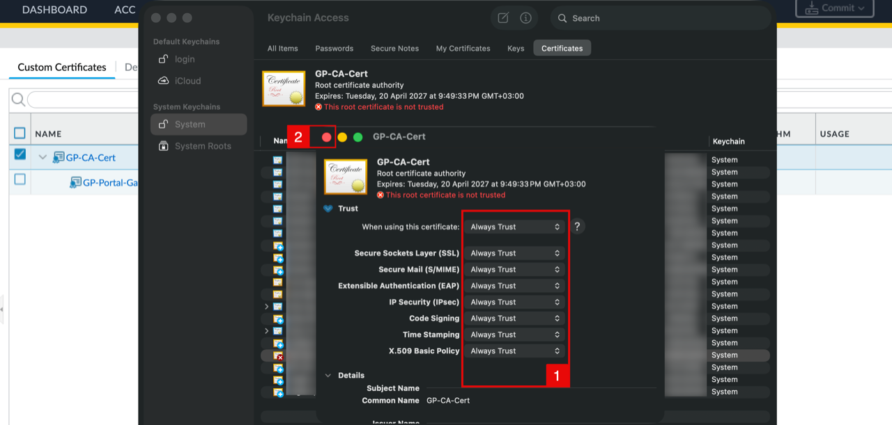

    - macOS prompts for authentication again to confirm the change to the System keychain.

    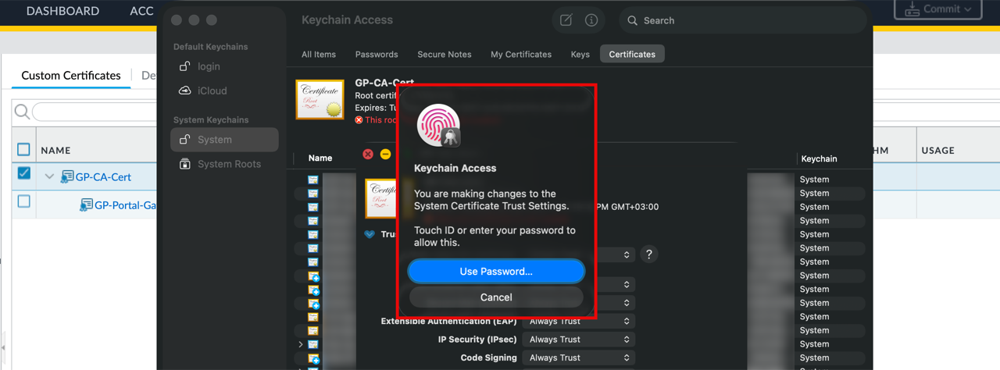

    - Notice that the certificate is now marked as **trusted for all users**.

    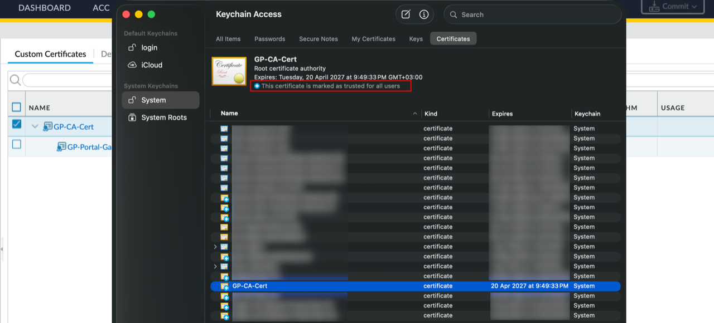

## Task 4: Replicate Certificates to PA-VM-02 (Active/Active only)

In an Active/Active setup, both firewalls must present the **same TLS identity** to clients connecting through the VPN NLB. Since certificates do not sync automatically between A/A peers, you need to export the CA and server certificates from PA-VM-01 and import them into PA-VM-02.

### On PA-VM-01: Export the Certificates

1. Select the **GP-CA-Cert** row.
2. Click on the **Export Certificate** button.

    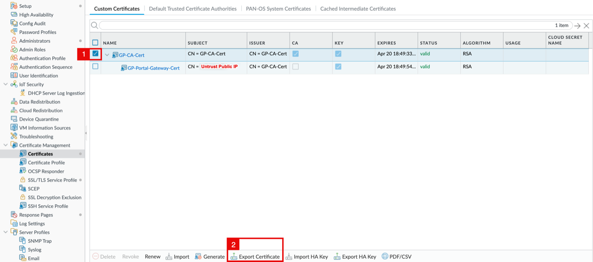

<!-- -->

1. Set the **File Format** to **Base64 Encoded Certificate (PEM)**.
2. Check the **Export Private Key** box.
3. Specify a **Passphrase**.
4. Re-enter the same value in **Confirm Passphrase**.
5. Click on the **OK** button.

    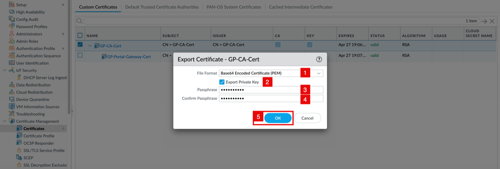

<!-- -->

1. Open the browser's downloads list.
2. Verify that the CA certificate file **`cert_GP-CA-Cert.pem`** appears in the list and shows **Done**, confirming the export was successful.

    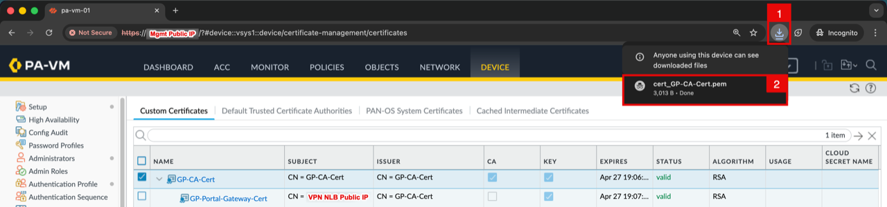

<!-- -->

1. Select the **GP-Portal-Gateway-Cert** row.
2. Click on the **Export Certificate** button.

    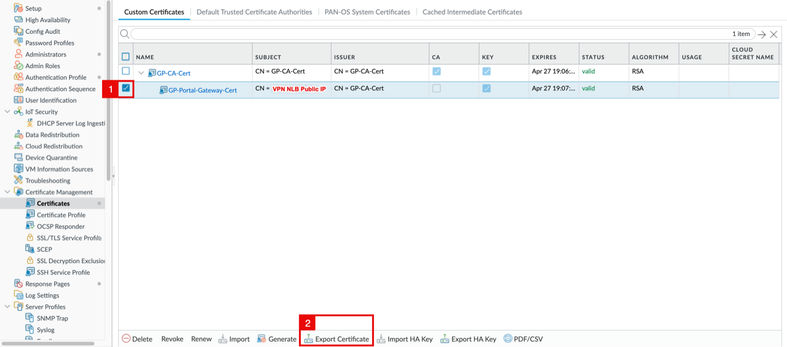

<!-- -->

1. Set the **File Format** to **Base64 Encoded Certificate (PEM)**.
2. Check the **Export Private Key** box.
3. Specify a **Passphrase**.
4. Re-enter the same value in **Confirm Passphrase**.
5. Click on the **OK** button.

    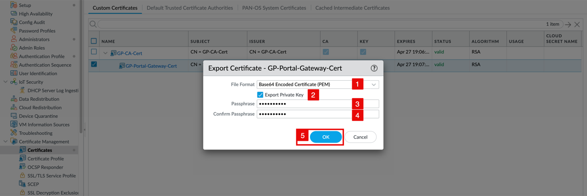

<!-- -->

1. Open the browser's downloads list.
2. Verify that the CA certificate file **`cert_GP-Portal-Gateway-Cert.pem`** appears in the list and shows **Done**, confirming the export was successful.

    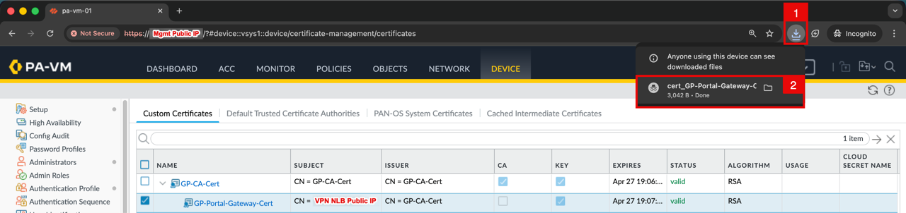

    - Confirm that both `.pem` files are present in your Downloads folder.

    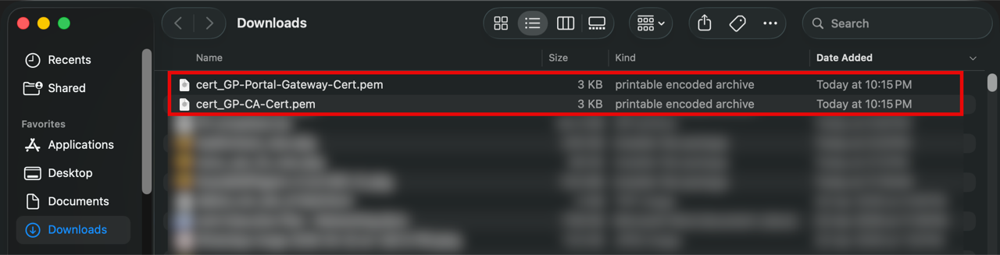

### On PA-VM-02: Import the Certificates

- Click on the **Import** button at the bottom of the Certificates page.

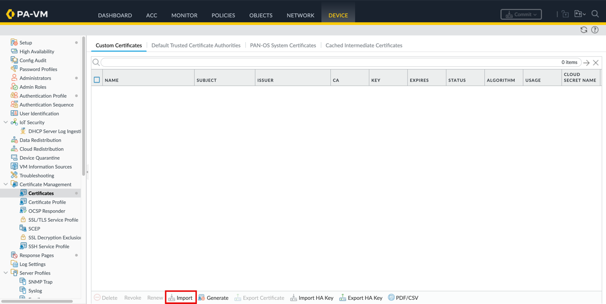

<!-- -->

1. Set the **Certificate Type** to **Local**.
2. Set the **Certificate Name** to `GP-CA-Cert` (must match the name used on PA-VM-01).
3. Set the **File Format** to **Base64 Encoded Certificate (PEM)**.
4. **Browse** and select `cert_GP-CA-Cert.pem`.
5. Check the **Import Private Key** box.
6. Enter the **Passphrase** used during export.
7. Re-enter the same value in **Confirm Passphrase**.
8. Click on the **OK** button.

    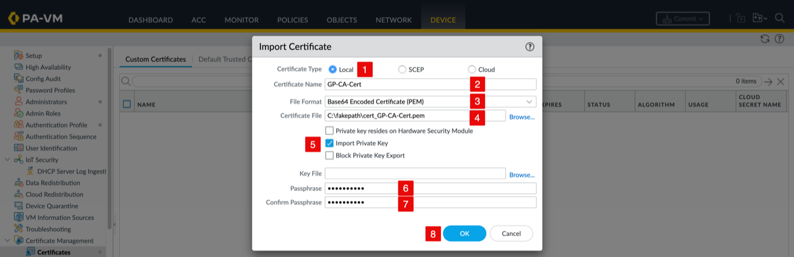

<!-- -->

1. Notice that **GP-CA-Cert** is now listed.
2. Click on the **Import** button.

    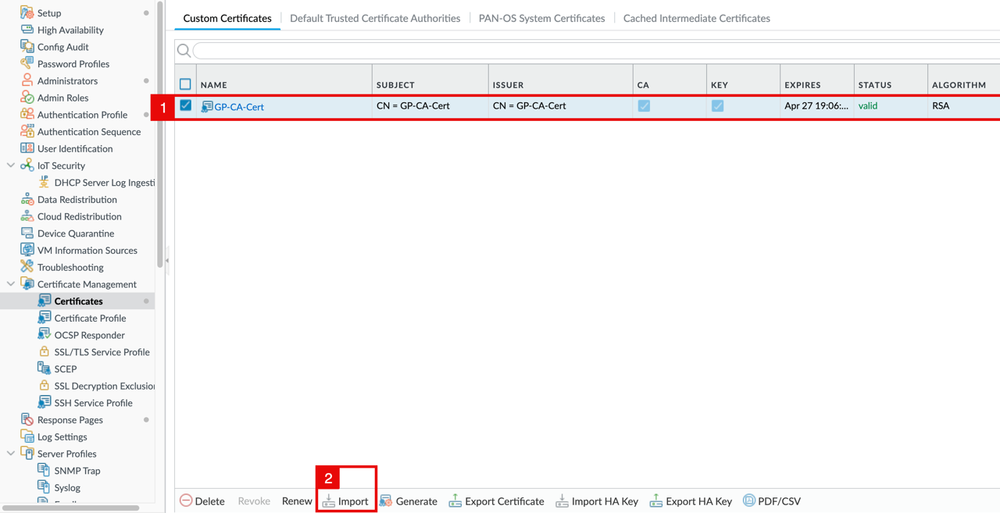

<!-- -->

1. Set the **Certificate Type** to **Local**.
2. Set the **Certificate Name** to `GP-Portal-Gateway-Cert` (must match the name used on PA-VM-01).
3. Set the **File Format** to **Base64 Encoded Certificate (PEM)**.
4. **Browse** and select `cert_GP-Portal-Gateway-Cert.pem`.
5. Check the **Import Private Key** box.
6. Enter the **Passphrase** used during export.
7. Re-enter the same value in **Confirm Passphrase**.
8. Click on the **OK** button.

    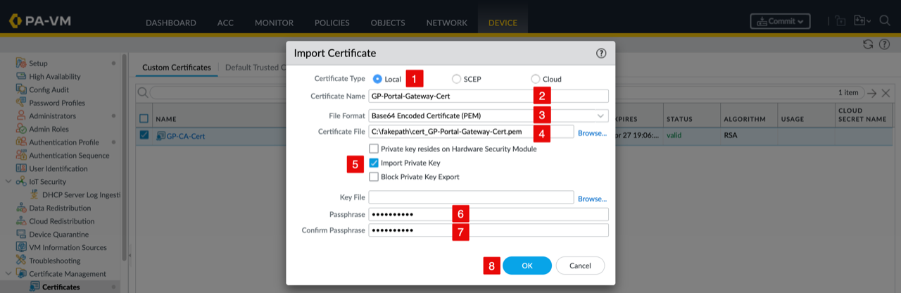

    - Confirm that both **GP-CA-Cert** and **GP-Portal-Gateway-Cert** are now listed on PA-VM-02 with the same attributes as on PA-VM-01.

    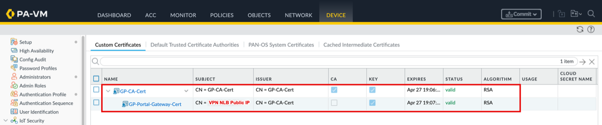

## Task 5: Create SSL/TLS Service Profile

In this task, you create an **SSL/TLS Service Profile** on the firewall and bind it to the server certificate created in Task 2. The GlobalProtect Portal and Gateway will use this profile to present a TLS endpoint to remote users when they connect.

1. Click on **SSL/TLS Service Profile** under **Certificate Management**.
2. Click on the **Add** button.

    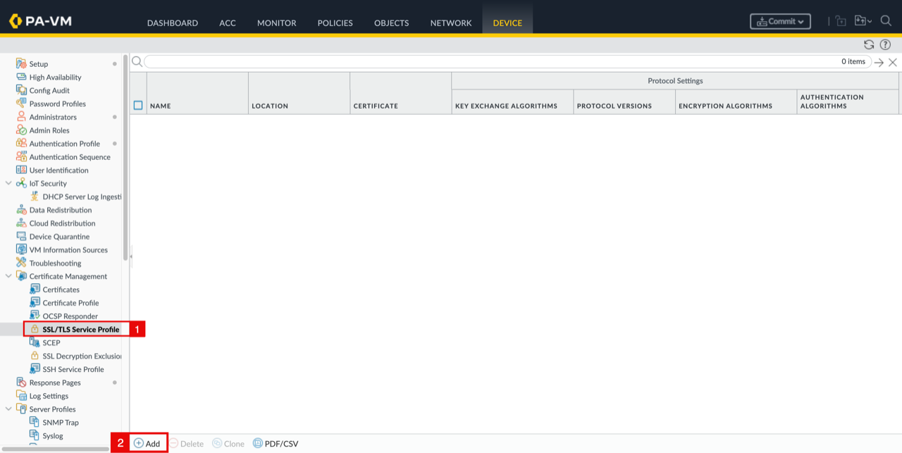

<!-- -->

1. Specify a **Name** for the profile (e.g. `GP-SSL/TLS-Profile`).
2. Select the **Certificate** created in Task 2 (`GP-Portal-Gateway-Cert`).
3. Click on the **OK** button.

    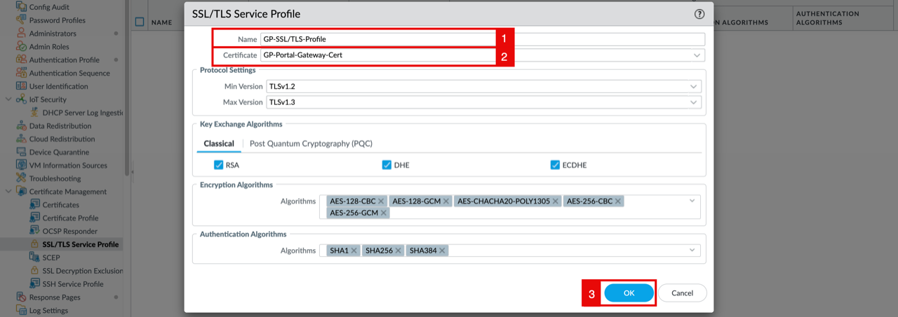

    - Notice that the SSL/TLS Service Profile is created and uses the certificate `GP-Portal-Gateway-Cert`.

    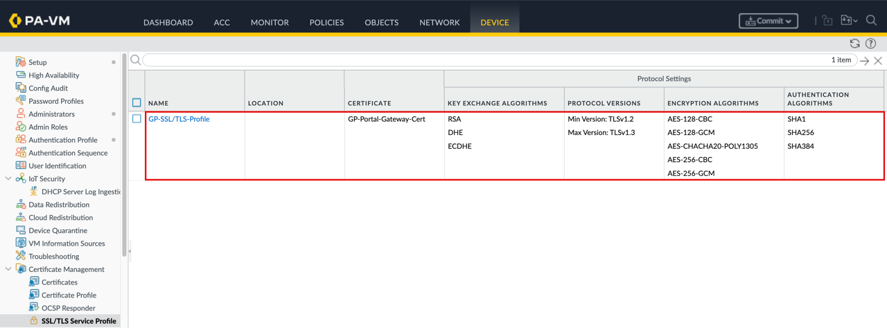

## Learn More

- [GlobalProtect Certificate Best Practices](https://docs.paloaltonetworks.com/globalprotect/administration/get-started/enable-ssl-between-globalprotect-components/globalprotect-certificate-best-practices)
- [Deploy Server Certificates to the GlobalProtect Components](https://docs.paloaltonetworks.com/globalprotect/administration/get-started/enable-ssl-between-globalprotect-components/deploy-server-certificates-to-the-globalprotect-components)
- [Export a Certificate and Private Key](https://docs.paloaltonetworks.com/pan-os/11-1/pan-os-admin/certificate-management/export-a-certificate-and-private-key)
- [Import a Certificate and Private Key](https://docs.paloaltonetworks.com/ngfw/administration/certificate-management/certificate-deployment/import-certificate-and-private-key)
- [Import a Trusted Root Certificate on Windows](https://learn.microsoft.com/en-us/system-center/scom/obtain-certificate-windows-server-and-operations-manager?view=sc-om-2025#import-the-trusted-root-certificate-from-the-ca-on-the-client)
- [Change Certificate Trust Settings on Mac](https://support.apple.com/en-gb/guide/keychain-access/kyca11871/mac)

## Acknowledgements

- **Authors** - Anas Abdallah, Iwan Hoogendoorn (Cloud Networking Black Belts)
- **Contributor** - Antonio Gámir (Cloud Networking Black Belt)
- **Last Updated By/Date** - Anas Abdallah, August 2026

You may now **proceed to the next lab**.
