# Configure GlobalProtect

## Introduction

This lab configures the GlobalProtect Portal and Gateway that provide client configuration and terminate remote-access VPN sessions. You configure authentication, client IP address pools, and client settings for remote users.

Estimated time: 15 minutes

### Objectives

In this lab, you will:
- Configure the GlobalProtect Portal.
- Configure the GlobalProtect Gateway.

### Prerequisites

Before you begin, ensure you have completed the preceding required labs in this workshop.

## Task 1: Configure GlobalProtect Portal

- Click on the **Network** tab.

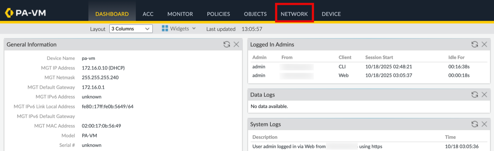

1. Click on **Portals** under **GlobalProtect**.
2. Click on the **Add** button.

    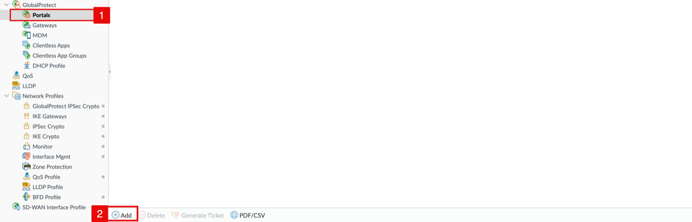

<!-- -->

1. Click on the **General** tab.
2. Specify a **Name** for the Portal (e.g. `GP-Portal`).
3. Set the **Interface** to `ethernet1/1` (the Untrust interface).
4. Set the **IP Address Type** to **IPv4 Only**.
5. Set the **IPv4 Address** as follows:
    - **Single Instance:** `172.16.0.20/28` (Untrust primary private IP).
    - **Active/Passive:** `172.16.0.22/32` (Untrust secondary/floating private IP).
    - **Active/Active:**
        - For PA-VM-01: `172.16.0.20/28` (Untrust primary private IP).
        - For PA-VM-02: `172.16.0.21/28` (Untrust primary private IP).
6. Click on the **Authentication** tab.

    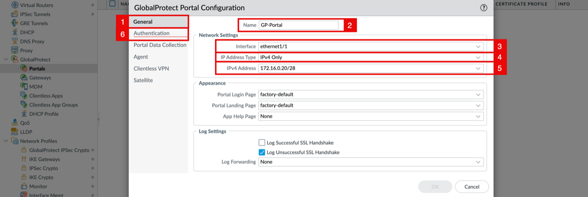

<!-- -->

1. Set the **SSL/TLS Service Profile** to the profile created in Lab 3, Task 5 (`GP-SSL/TLS-Profile`).
2. Under **Client Authentication**, click on the **Add** button.

    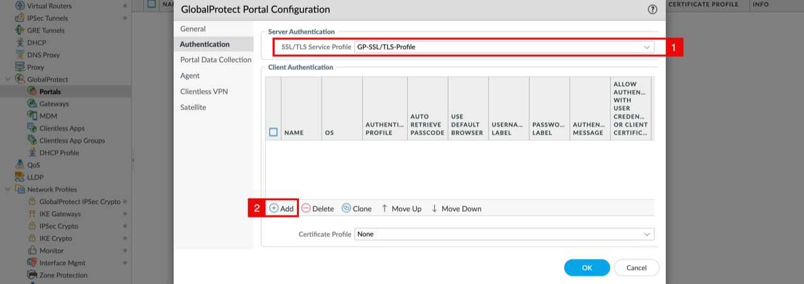

<!-- -->

1. Specify a **Name** for the client authentication entry (e.g. `GP-Client-AuthN`).
2. Set the **Authentication Profile** to the profile created in Lab 2, Task 3 (`GP-AuthN-Profile`).
3. Set **Allow Authentication with User Credentials OR Client Certificate** to **Yes (User Credentials OR Client Certificate Required)**.
4. Click on the **OK** button.

    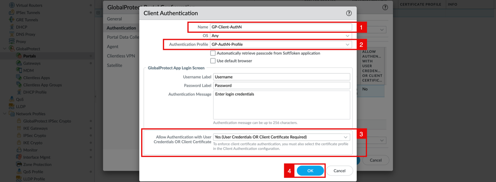

    > **Note:** For stronger security in production, you can require **both user credentials AND a client certificate** by setting this to **No** and configuring a Certificate Profile. This is out of scope for this workshop.

<!-- -->

1. Notice that the client authentication entry is now listed.
2. Click on the **Agent** tab.

    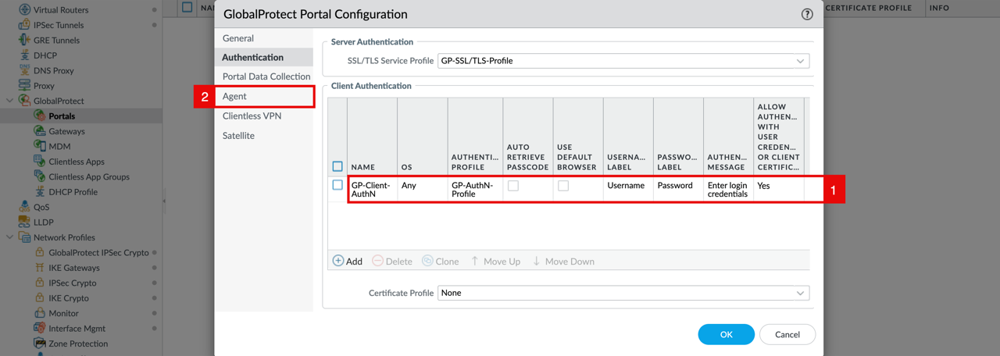

<!-- -->

1. Click on the **Add** button under the **Trusted Root CA** section.
2. Select the CA certificate created in Lab 3, Task 1 (`GP-CA-Cert`).
3. Check the **Install in Local Root Certificate Store** box, so the agent automatically pushes the CA into the client's local trust store.
4. Click on the **Add** button to add a new agent config.

    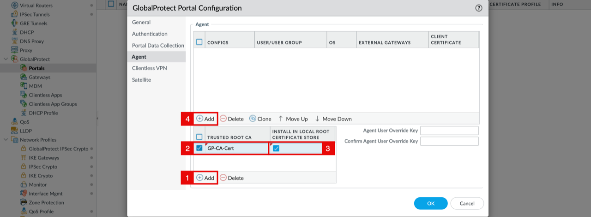

<!-- -->

1. Click on the **Authentication** tab.
2. Specify a **Name** for the agent config (e.g. `GP-Agent`).
3. Click on the **External** tab.

    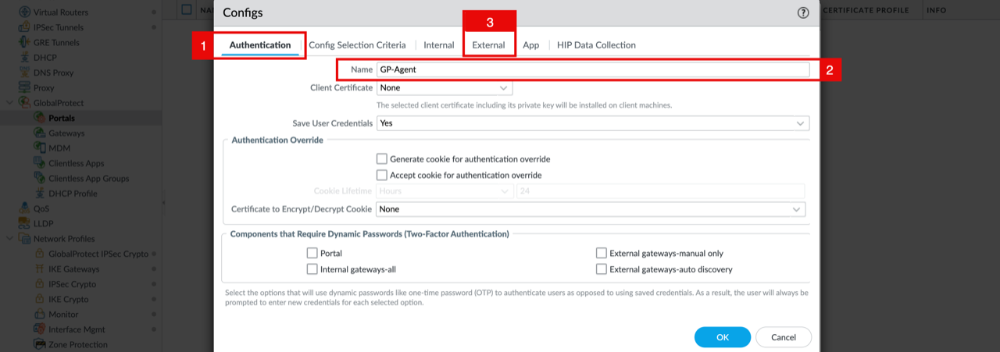

    - Under **External Gateways**, click on the **Add** button.

    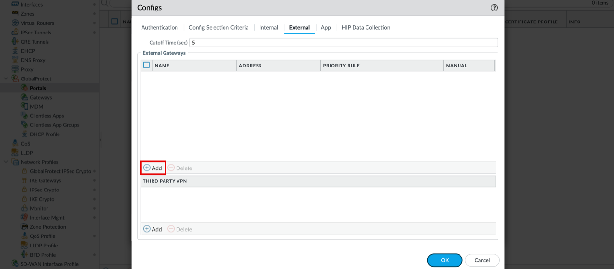

<!-- -->

1. Specify a **Name** for the external gateway entry (e.g. `GP-Ext-GW`).
2. Set the **Address** type to **IP**.
3. Set **IPv4** as follows:
    - **Single Instance:** Untrust primary public IP.
    - **Active/Passive:** Untrust secondary/floating public IP.
    - **Active/Active:** VPN NLB public IP.
4. Click on the **Add** button under **Source Region**.
5. Select **Any** with **Highest** priority - this means the agent will always pick this gateway regardless of where it is connecting from.
6. Click on the **OK** button.

    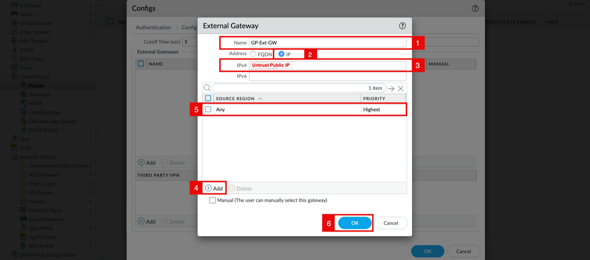

<!-- -->

1. Notice that the external gateway is now listed.
2. Click on the **HIP Data Collection** tab.

    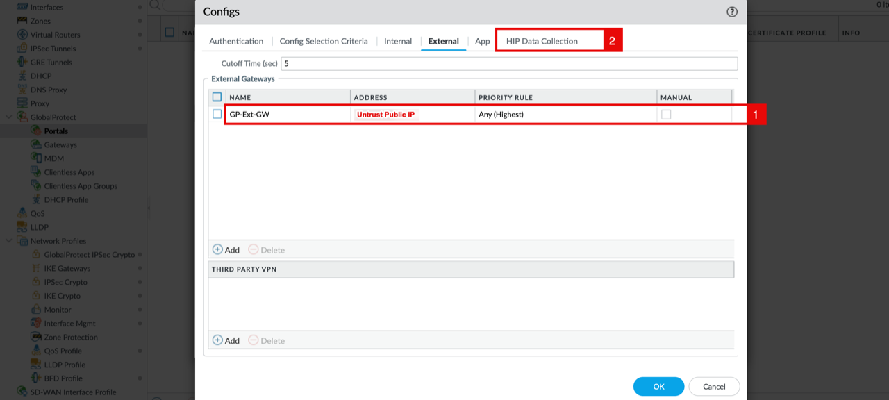

<!-- -->

1. Uncheck the **Collect HIP Data** box. Host Information Profile (HIP) checks require a GlobalProtect subscription license and are out of scope for this workshop.
2. Click on the **OK** button.

    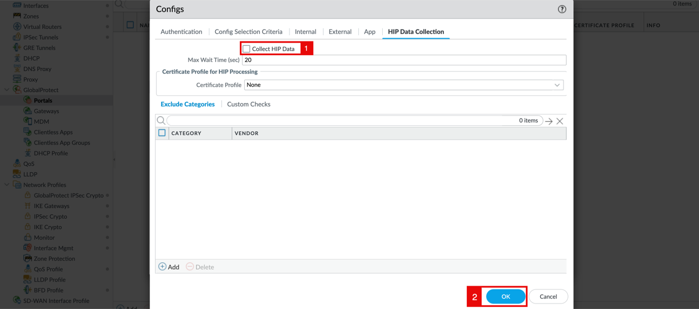

<!-- -->

1. Notice that the agent config (`GP-Agent`) is now listed under the Portal, pointing to the external gateway and trusting the GP-CA-Cert.
2. Click on the **OK** button.

    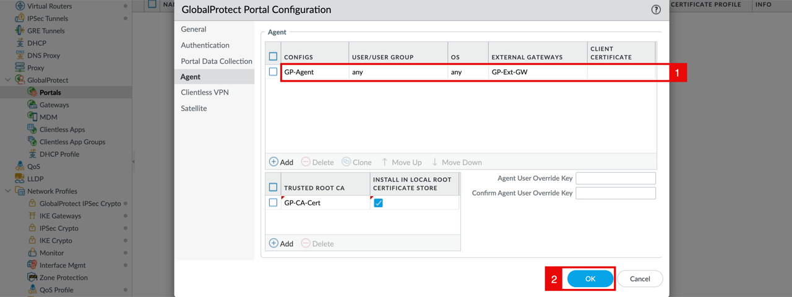

    - Notice that the GlobalProtect Portal is created and bound to ethernet1/1, with the SSL/TLS and Authentication profiles attached.

    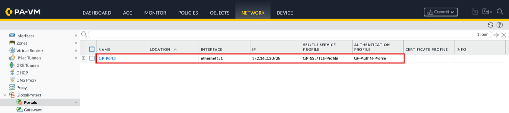

## Task 2: Configure GlobalProtect Gateway

- Click on the **Network** tab.

1. Click on **Gateways** under **GlobalProtect**.
2. Click on the **Add** button.

    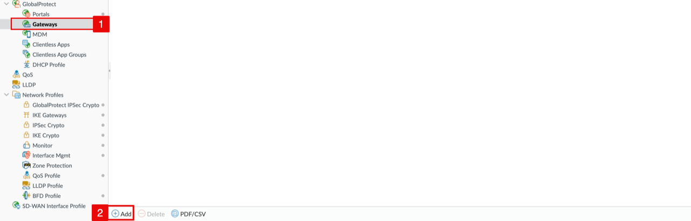

<!-- -->

1. Click on the **General** tab.
2. Specify a **Name** for the Gateway (e.g. `GP-Gateway`).
3. Set the **Interface** to `ethernet1/1`.
4. Set the **IP Address Type** to **IPv4 Only**.
5. Set the **IPv4 Address** as follows:
    - **Single Instance:** `172.16.0.20/28` (Untrust primary private IP).
    - **Active/Passive:** `172.16.0.22/32` (Untrust secondary/floating private IP).
    - **Active/Active:**
        - For PA-VM-01: `172.16.0.20/28` (Untrust primary private IP).
        - For PA-VM-02: `172.16.0.21/28` (Untrust primary private IP).
6. Click on the **Authentication** tab.

    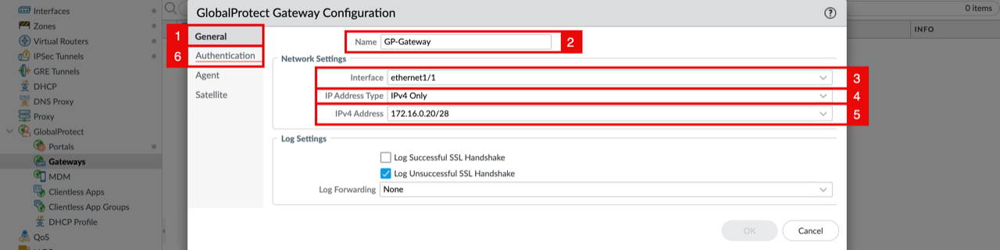

<!-- -->

1. Set the **SSL/TLS Service Profile** to the profile created in Lab 3, Task 5 (`GP-SSL/TLS-Profile`).
2. Under **Client Authentication**, click on the **Add** button.

    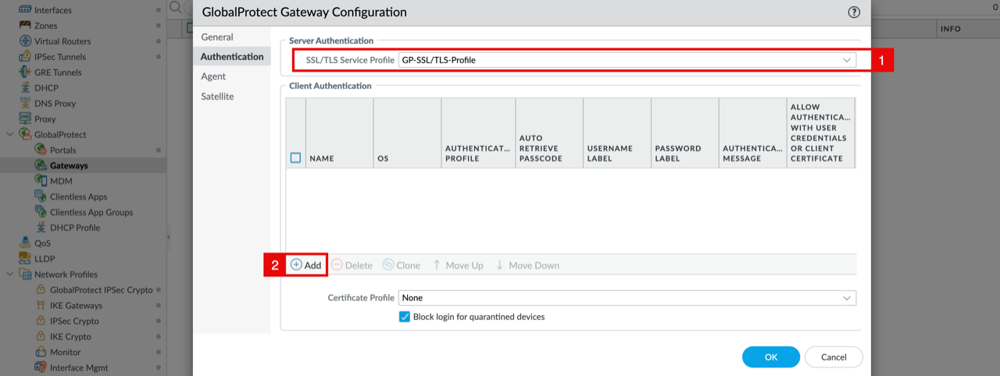

<!-- -->

1. Specify a **Name** for the client authentication entry (e.g. `GP-Client-AuthN`).
2. Set the **Authentication Profile** to the one created in Lab 2, Task 3 (`GP-AuthN-Profile`).
3. Set **Allow Authentication with User Credentials OR Client Certificate** to **Yes (User Credentials OR Client Certificate Required)**.
4. Click on the **OK** button.

    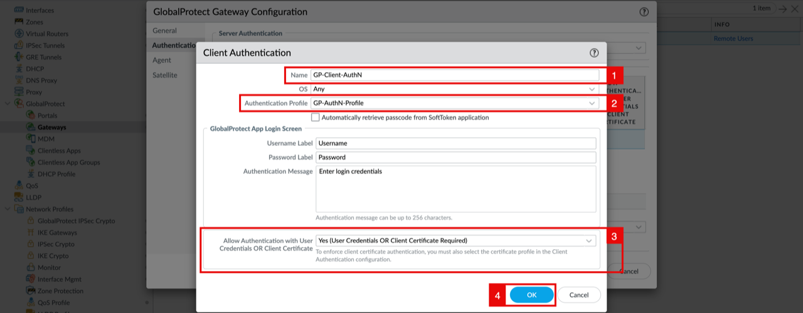

    > **Note:** For stronger security in production, you can require **both user credentials AND a client certificate** by setting this to **No** and configuring a Certificate Profile. This is out of scope for this workshop.

<!-- -->

1. Notice that the client authentication entry is now listed.
2. Click on the **Agent** tab.

    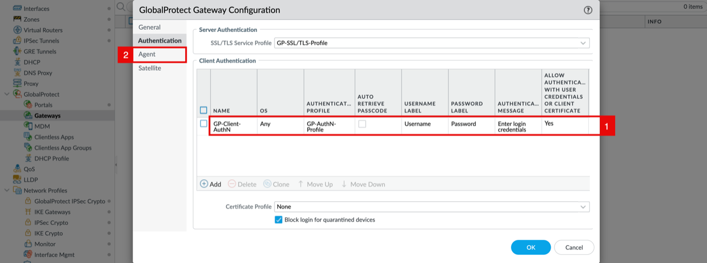

<!-- -->

1. Click on the **Tunnel Settings** sub-tab.
2. Check the **Tunnel Mode** box.
3. Set the **Tunnel Interface** to the tunnel interface created in Lab 2, Task 1 (`tunnel.3`).
4. Check the **Enable IPSec** box. This makes the GlobalProtect data plane run over IPSec (UDP/4501) once the SSL handshake completes, which is more efficient than running everything over SSL.
5. Click on the **Client Settings** sub-tab.

    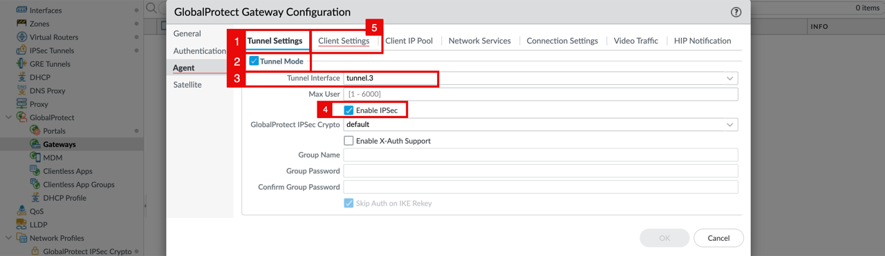

    - Click on the **Add** button.

    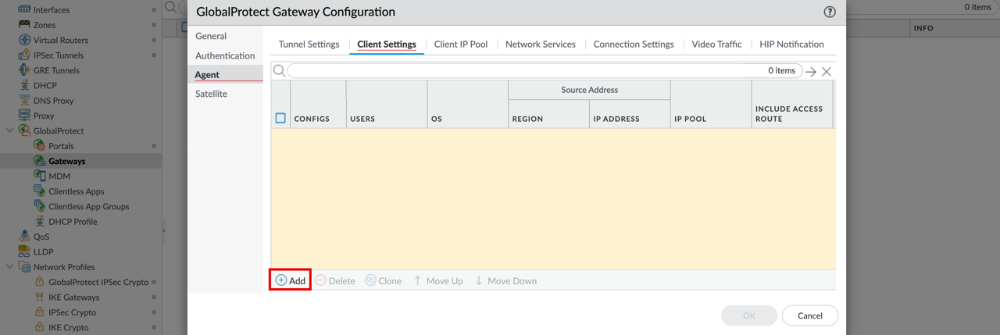

<!-- -->

1. Specify a **Name** for the client settings (e.g. `GP-Client-Settings`).
2. Click on the **IP Pools** sub-tab.

    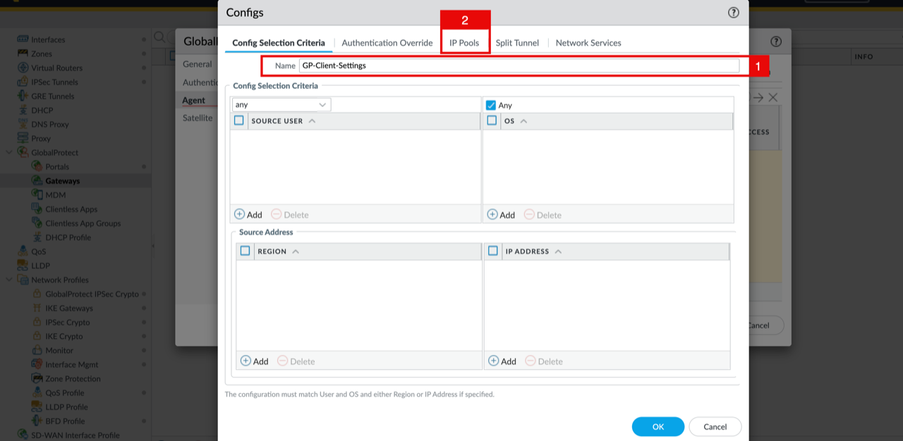

<!-- -->

1. Under **IP Pool**, click on the **Add** button.
2. Specify the IP pool that will be assigned to remote users - `192.168.1.0/28`. This is the same range allowed in the Interface Management Profile in Lab 2, Task 2.
3. Click on the **OK** button.

    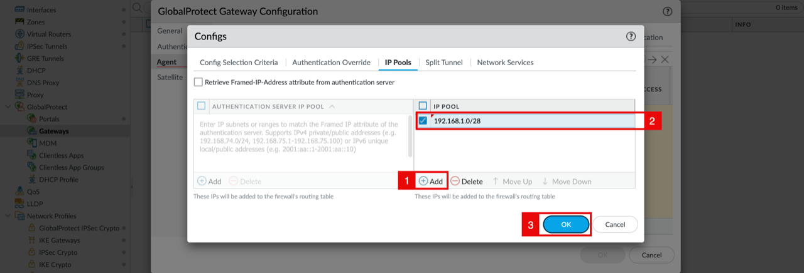

<!-- -->

1. Notice that the client settings (`GP-Client-Settings`) are now listed with the `192.168.1.0/28` IP pool.
2. Click on the **OK** button.

    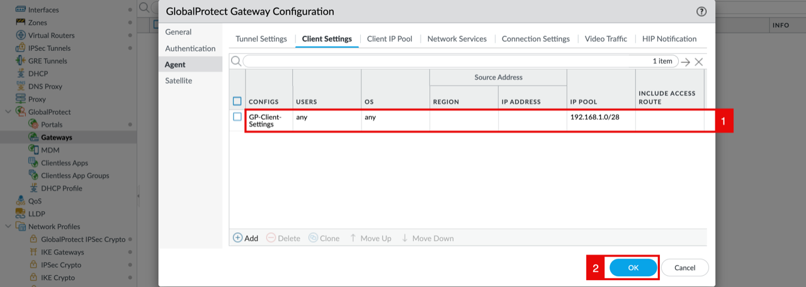

<!-- -->

1. Notice that the Gateway (`GP-Gateway`) is now listed, bound to `ethernet1/1`, using `tunnel.3`, and the **Info** column shows **Remote Users**.
2. Click on the **Commit** button.

    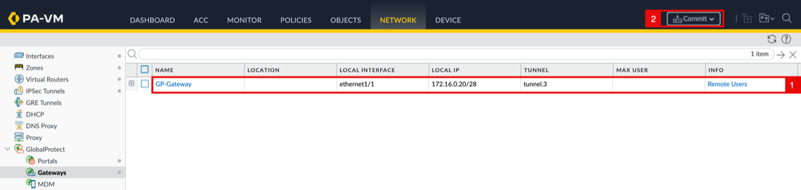

<!-- -->

1. Notice the message that commit will overwrite the running configuration.
2. Click on the **Commit** button.

    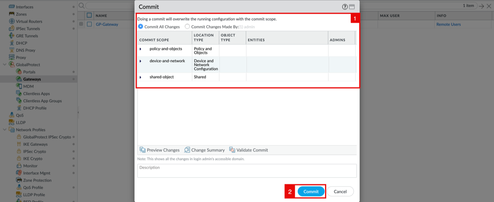

    - Wait for the **Commit** to complete.

    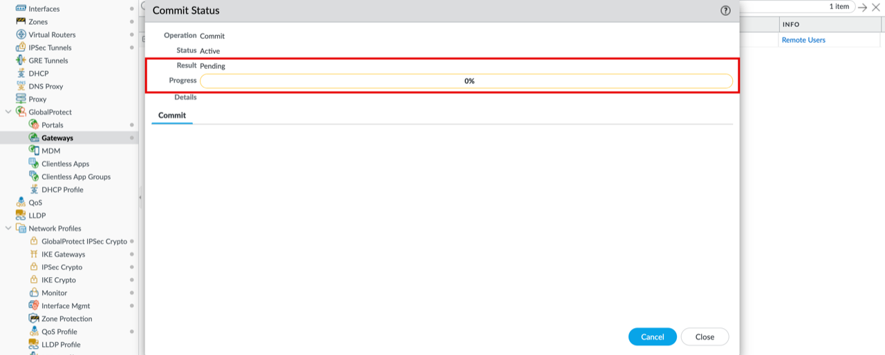

    - Notice that the **Commit** has completed successfully.

    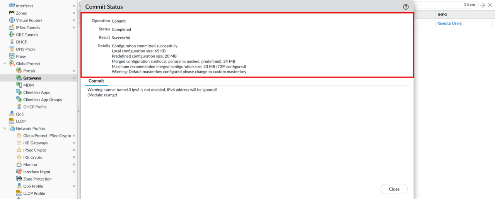

## Learn More

- [Configure GlobalProtect Portals](https://docs.paloaltonetworks.com/ngfw/help/12-1/globalprotect/network-globalprotect-portals)
- [Configure GlobalProtect Gateways](https://docs.paloaltonetworks.com/ngfw/help/12-1/globalprotect/network-globalprotect-gateways)

## Acknowledgements

- **Authors** - Anas Abdallah, Iwan Hoogendoorn (Cloud Networking Black Belts)
- **Contributor** - Antonio Gámir (Cloud Networking Black Belt)
- **Last Updated By/Date** - Anas Abdallah, August 2026

You may now **proceed to the next lab**.
