# Download and Install GlobalProtect

## Introduction

This lab prepares the GlobalProtect client package on the firewall and installs the GlobalProtect agent on the remote client. The agent is then ready to connect to the Portal and Gateway configured in the previous lab.

Estimated time: 10 minutes

### Objectives

In this lab, you will:
- Download and activate the GlobalProtect client package on the firewall.
- Download and install the GlobalProtect agent on the client computer.

### Prerequisites

Before you begin, ensure you have completed the preceding required labs in this workshop.

## Task 1: Download GlobalProtect Client Software on the Firewall

1. Click on the **Device** tab.
2. Click on **GlobalProtect Client**.

    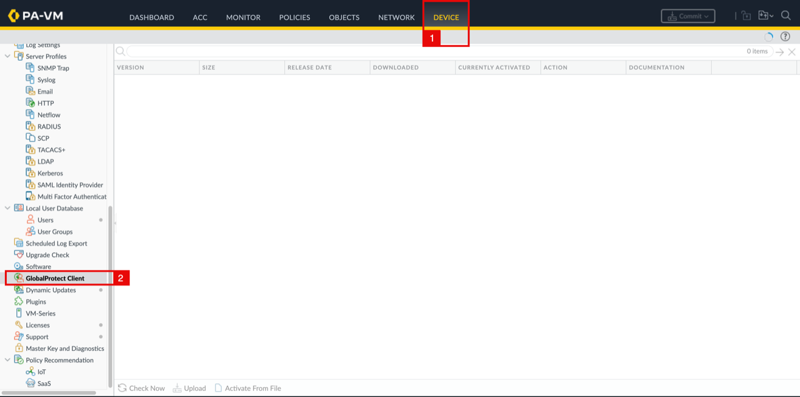

<!-- -->

1. The first time you open this page, you may see **Operation Failed – No update information available** because the firewall hasn't checked for available versions yet.
2. Click on the **Close** button.

    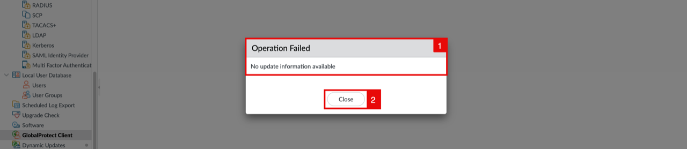

    - Click on the **Check Now** button at the bottom of the page.

    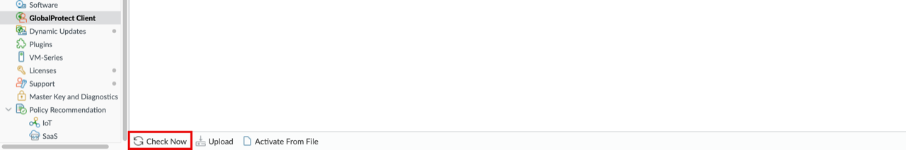

    - The firewall contacts the Palo Alto update server to retrieve the list of available GlobalProtect versions.

    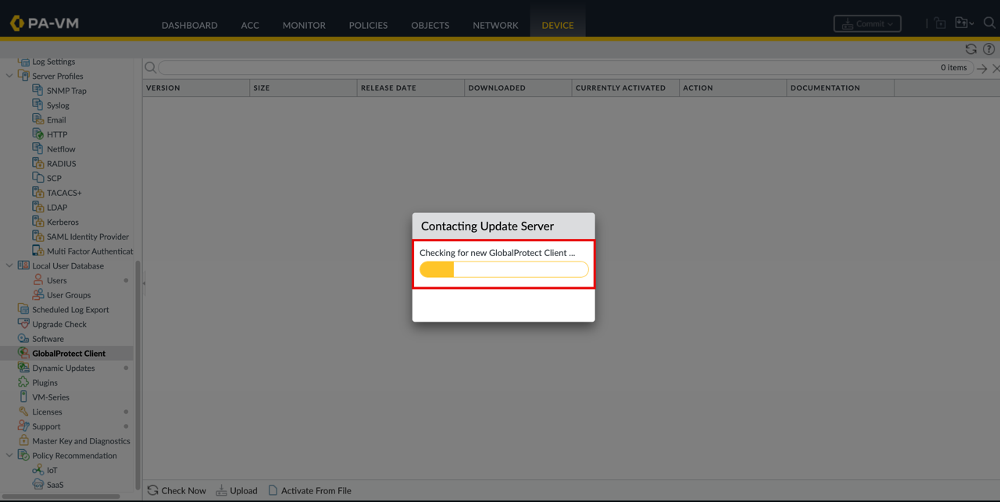

    - After the list is retrieved, pick a recent version and click on the **Download** link.

    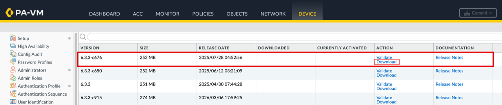

    - Wait for the download to complete.

    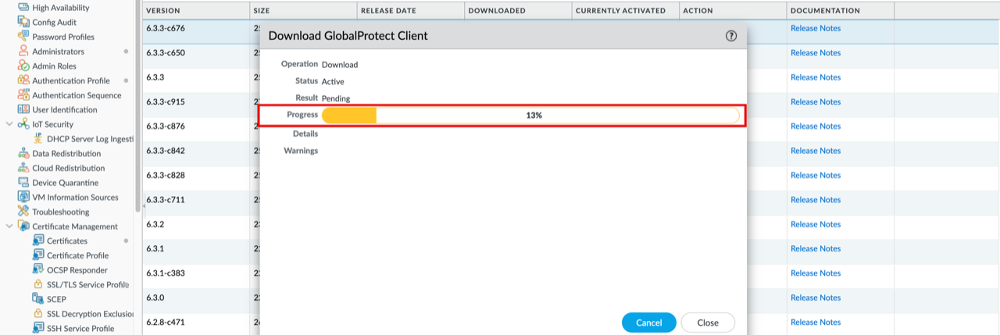

<!-- -->

1. Notice that the download status is **Successful**.
2. Click on the **Close** button.

    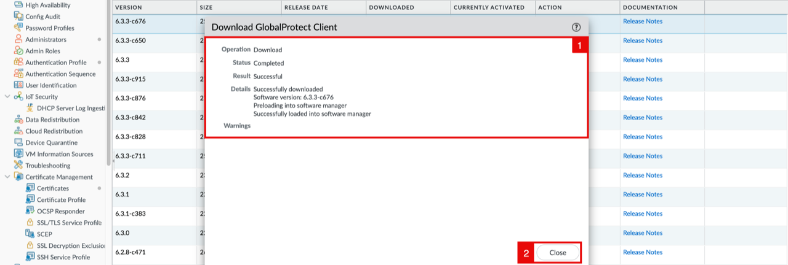

<!-- -->

1. Notice that the version is now marked as **Downloaded**.
2. Click on the **Activate** link.

    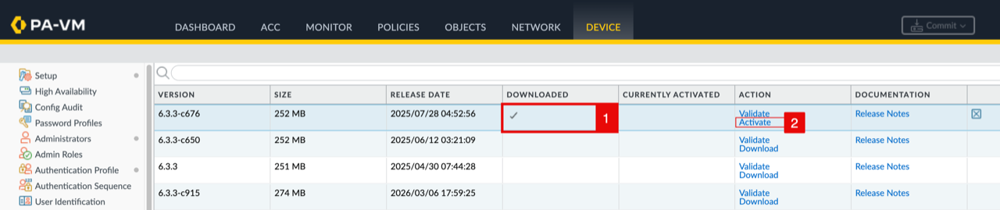

    - A System health check report prompt may appear, click **No** to skip the health check and proceed with the activation.

    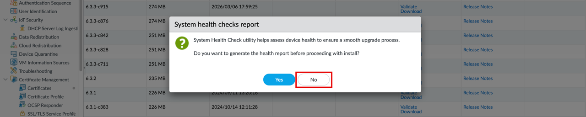

    - Confirm the activation by clicking **Yes**.

    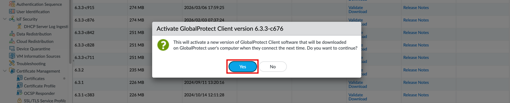

    - Wait for the activation to complete.

    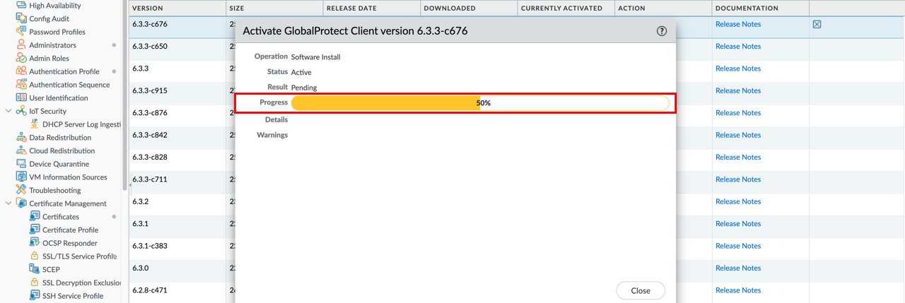

<!-- -->

1. Notice that the activation is **Successful**.
2. Click on the **Close** button.

    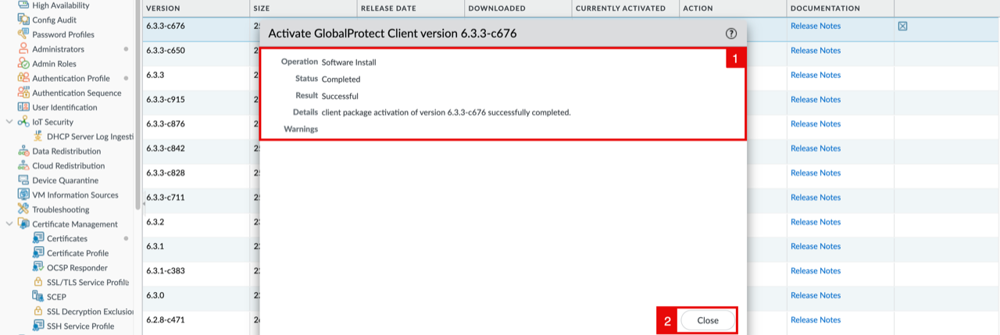

    - Notice that the version is now as **Currently Activated**.

    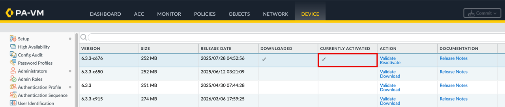

> **Note:** A valid GlobalProtect license is required. Without it, you will encounter an "Operation Failed – An active license is required for this feature" error when accessing the GlobalProtect Client software section.
>
> 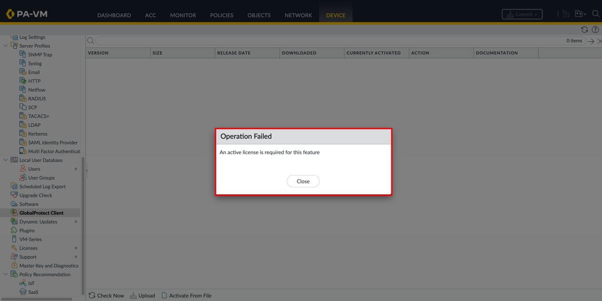

## Task 2: Install GlobalProtect Agent on Your PC

1. Open a **web browser** and use your public IP address to connect to the web interface of the Palo Alto GlobalProtect Portal:
    - **Single Instance:** Untrust primary public IP.
    - **Active/Passive:** Untrust secondary/floating public IP.
    - **Active/Active:** VPN NLB public IP.
2. Depending on your browser (settings) you might need to allow the connection as the Palo Alto Firewall does not have a signed certificate deployed yet. Click on **Advanced**.

    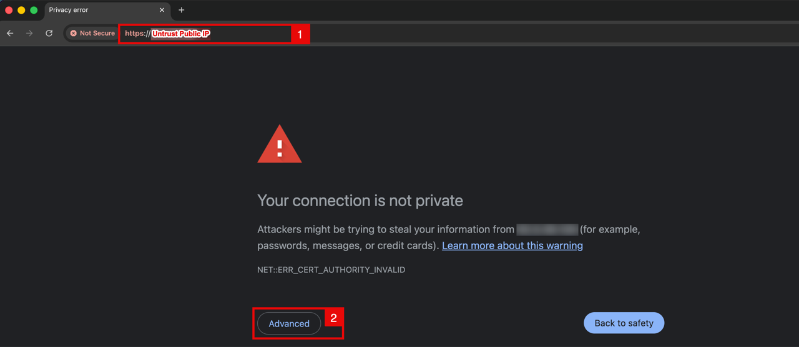

    - Click on **Proceed**.

    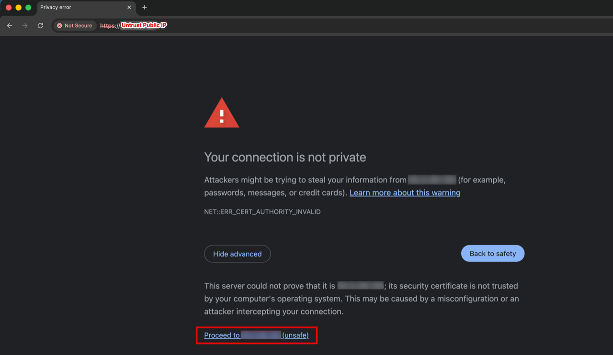

<!-- -->

1. Enter the **username** of the local user created in Lab 2, Task 3 (e.g. `Anas`).
2. Enter your **password**.
3. Click on the **LOG IN** button.

    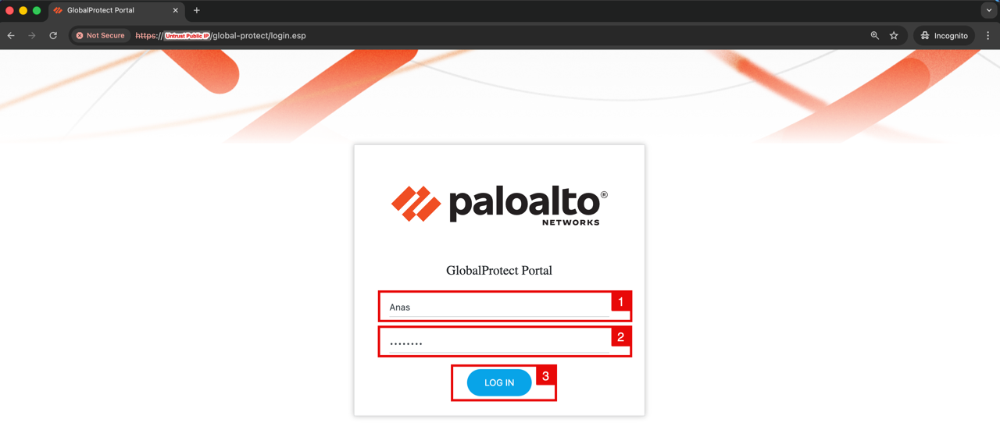

    - After login, the Portal serves a page with download links for each OS. Click on the link that matches your client OS - in my case, **Download Mac 32/64 bit GlobalProtect agent**.

    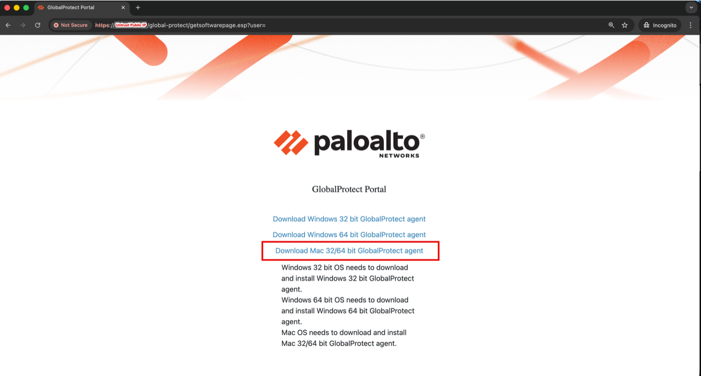

<!-- -->

1. Set the **Save As** name (default `GlobalProtect`).
2. Choose the destination folder (e.g. **Downloads**).
3. Click on the **Save** button.

    

<!-- -->

1. Open the browser's downloads list.
2. Click on the **GlobalProtect.pkg** file to launch the installer.

    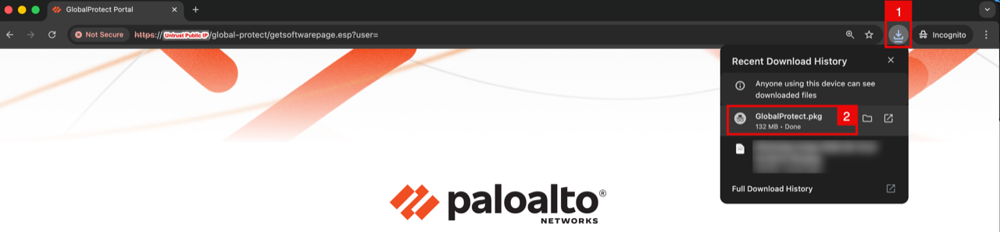

    - The GlobalProtect installer opens. Click on the **Continue** button.

    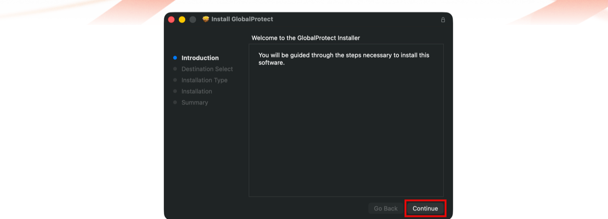

<!-- -->

1. Make sure only the **GlobalProtect** package is checked.
2. Click on the **Continue** button.

    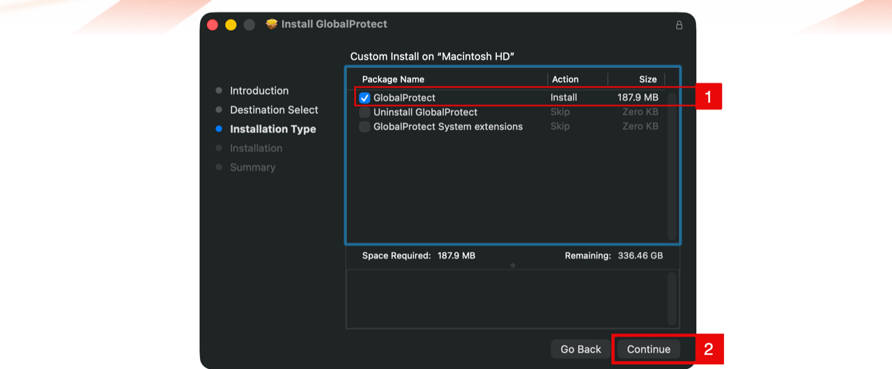

    - Click on the **Install** button.

    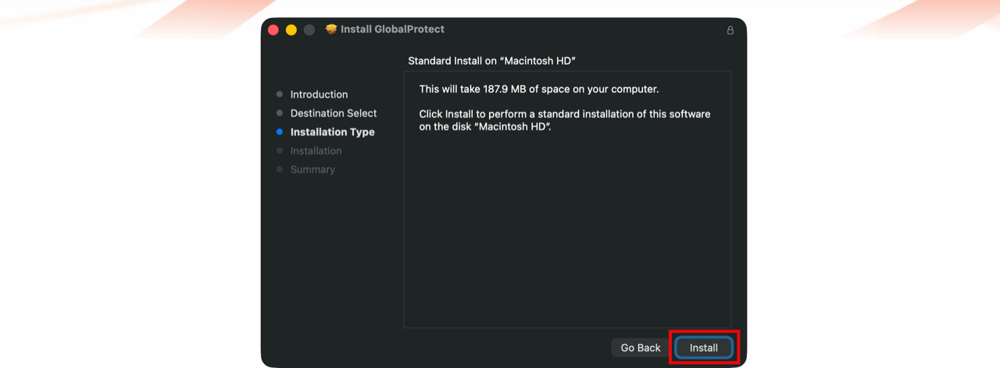

    - Wait for the installation to complete.

    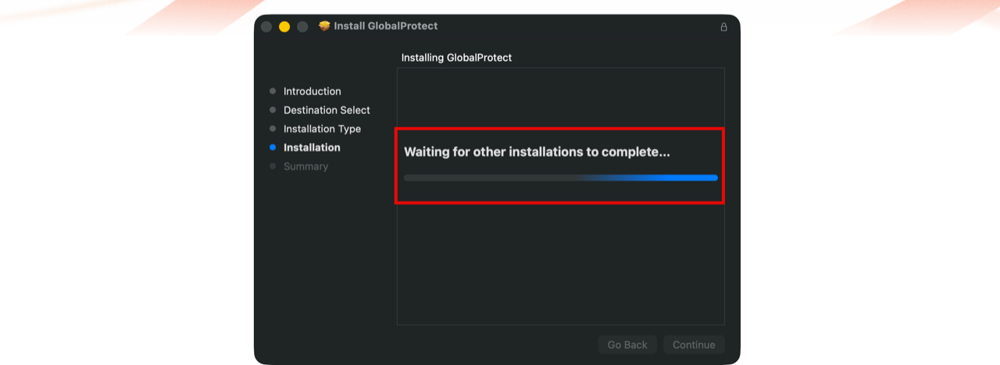

<!-- -->

1. Notice the message **The installation was successful**.
2. Click on the **Close** button.

    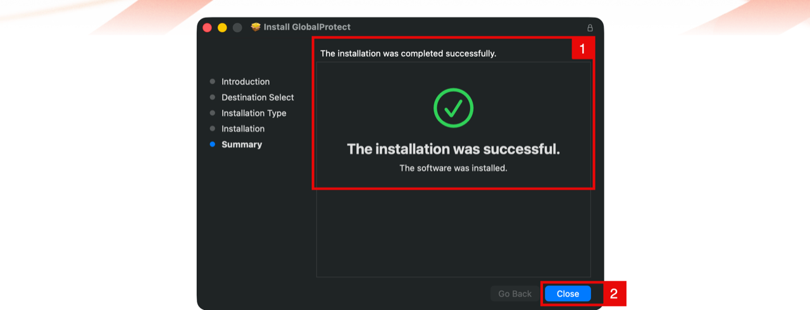

> **Note:** Ensure Task 1 (Download GlobalProtect Client Software on the Firewall), is completed first. Skipping it will result in a 404 error when attempting to download the agent from the portal.
>
> 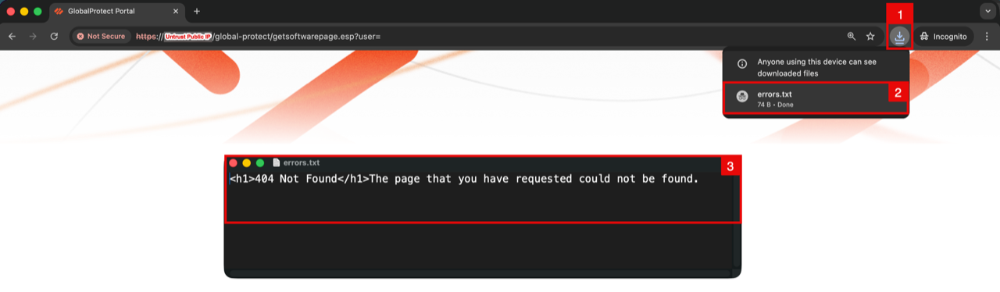

## Learn More

- [Download and Install the GlobalProtect App for macOS](https://docs.paloaltonetworks.com/globalprotect/user-guide/6-2/globalprotect-app-for-mac/download-and-install-the-globalprotect-app-for-mac)
- [Download and Install the GlobalProtect App for Windows](https://docs.paloaltonetworks.com/globalprotect/6-3/globalprotect-app-user-guide/globalprotect-app-for-windows/download-and-install-the-globalprotect-app-for-windows)

## Acknowledgements

- **Authors** - Anas Abdallah, Iwan Hoogendoorn (Cloud Networking Black Belts)
- **Contributor** - Antonio Gámir (Cloud Networking Black Belt)
- **Last Updated By/Date** - Anas Abdallah, August 2026

You may now **proceed to the next lab**.
