# Test and Validate

## Introduction

This lab validates the remote-access experience from the client perspective. You connect to the portal, establish a VPN session, and test access to OCI resources.

Estimated time: 10 minutes

### Objectives

In this lab, you will:
- Connect to the GlobalProtect portal and establish a VPN session.
- Validate client access to the intended OCI resources.

### Prerequisites

Before you begin, ensure you have completed the preceding required labs in this workshop.

## Task 1: Connect to GlobalProtect

In this task, you connect with the freshly installed GlobalProtect agent and validate that the tunnel is up, that an IP from the pool was assigned, and that traffic is logged on the firewall.

1. Click on the **GlobalProtect** icon in the macOS menu bar.
2. Click on **Get Started** in the welcome panel.

    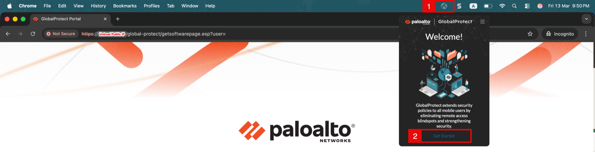

<!-- -->

1. In the **Portal** field, enter the public IP of the Palo Alto firewall:
    - **Single Instance:** Untrust primary public IP.
    - **Active/Passive:** Untrust secondary/floating public IP.
    - **Active/Active:** VPN NLB public IP.
2. Click on the **Connect** button.

    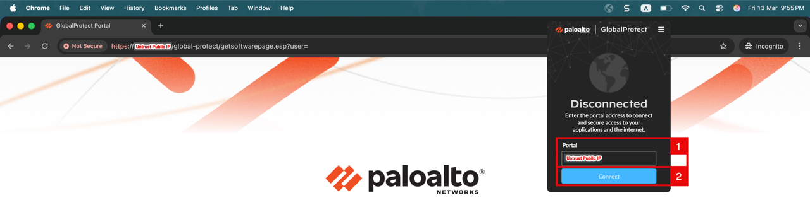

    > **Note:** If the CA certificate from Lab 3, Task 3 was not installed in your local certificate store, the GlobalProtect agent will warn that the portal certificate is not signed by a trusted authority. You can proceed anyway for lab purposes, but in production this should be resolved.
    >
    > 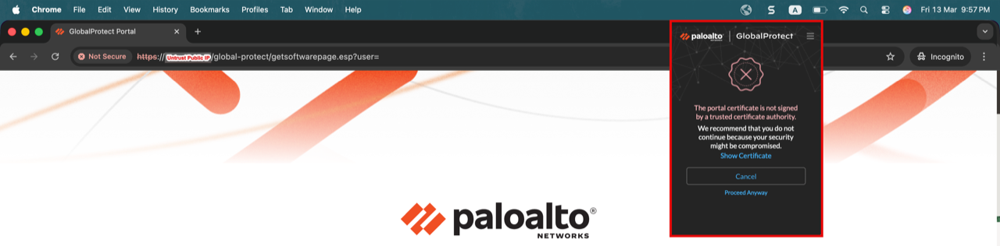

<!-- -->

1. Enter the **username** of the local user (e.g. `Anas`).
2. Enter your **password**.
3. Click on the **Connect** button.

    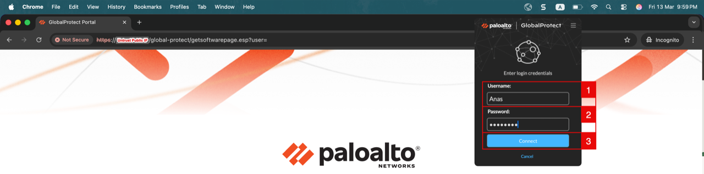

    - The agent contacts the Portal, retrieves the agent configuration, and starts negotiating the tunnel with the Gateway.

    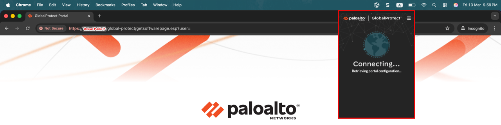

<!-- -->

1. Notice that the agent shows **Connected** to `GP-Ext-GW` with the **Best Available Gateway** label.
2. Click on the menu icon to open the agent options.

    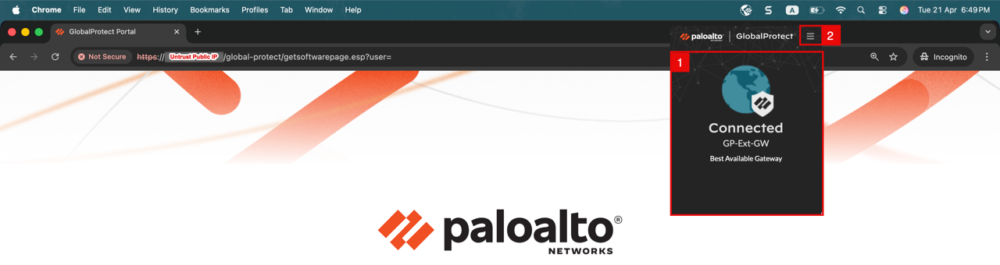

    - Click on **Settings** to open the agent's status panel.

    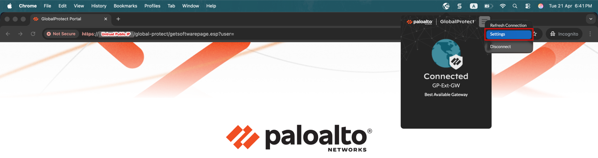

    - GlobalProtect assigned the IP `192.168.1.1`, the first address from the configured pool `192.168.1.0/28`.

    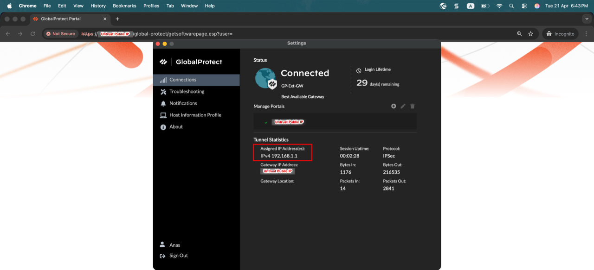

## Task 2: Validate Traffic and Logs

 - From a terminal on the client, run the following tests. Both confirm that traffic is reaching the firewall over the tunnel and that the management profile created in Lab 2, Task 2 is permitting HTTP and ICMP on the Untrust interface:

<!-- -->

1. Run a `curl` against the Untrust private IP of the firewall (`172.16.0.20`), the firewall returns an HTTP 301.
2. Run a `ping` to the same Untrust IP, replies confirm reachability.

    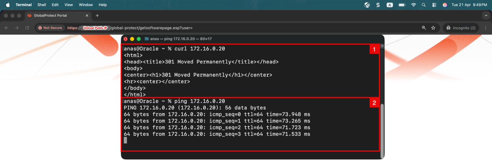

    - Return to the Palo Alto Web GUI and navigate to the logs to verify the traffic.

<!-- -->

1. Click on the **Monitor** tab.
2. Click on **Traffic** under **Logs**.
3. The traffic log confirms the GlobalProtect connection sequence from the client's public IP to the firewall, capturing the GlobalProtect SSL negotiation on TCP/443 and the IPSec tunnel establishment on UDP/4501, proving the VPN tunnel is up and running.

    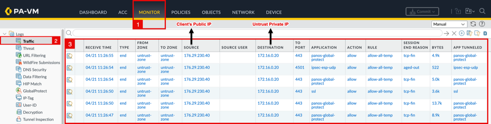

<!-- -->

1. Filter the traffic log on `( addr.src in 192.168.1.1 ) and ( addr.dst in 172.16.0.20 )` so you only see traffic coming from the assigned VPN IP toward the Untrust interface.
2. Click on the **Apply Filter** icon.
3. Notice the **web-browsing** entries on TCP/80 corresponding to the `curl` test.
4. Notice the **ping** entries on ICMP corresponding to the `ping` test.

    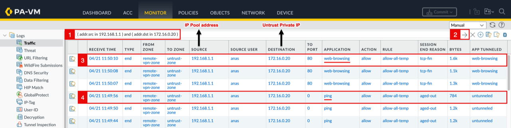

    - Both flows are tagged with **remote-vpn-zone** as the source zone, confirming that the firewall is correctly mapping the VPN user `anas` to the dedicated security zone created in Lab 2, Task 1.

## Learn More

- [Use the GlobalProtect App for macOS](https://docs.paloaltonetworks.com/globalprotect/user-guide/6-3/globalprotect-app-for-mac/use-the-globalprotect-app-for-mac)
- [GlobalProtect User Authentication](https://docs.paloaltonetworks.com/globalprotect/administration/globalprotect-user-authentication)

## Acknowledgements

- **Authors** - Anas Abdallah, Iwan Hoogendoorn (Cloud Networking Black Belts)
- **Contributor** - Antonio Gámir (Cloud Networking Black Belt)
- **Last Updated By/Date** - Anas Abdallah, August 2026

You may now **proceed to the next lab**.
