# Configure Remote Access VPN via GlobalProtect

## Introduction

In this lab, you configure the routing side of GlobalProtect remote access. Remote users receive controlled access to selected spoke resources through the Palo Alto firewall. Split tunneling sends only approved spoke prefixes through the VPN, also keeps general Internet traffic on the local connection, and prevents access through the VPN to resources that are not included.

Estimated Time: 40 minutes

### Objectives

In this lab, you will:

- Configure the OCI and Palo Alto routes required to reach spoke resources from the GlobalProtect client pool.
- Configure split tunneling so only intended OCI prefixes use the GlobalProtect tunnel.
- Validate remote-client access to spoke resources and confirm the traffic path in Palo Alto logs.

### Prerequisites

Before following the routing steps below, complete the items that are out of scope for this workshop. They are not part of the routing configuration itself, but they have to exist before any of the routes you are about to create are useful.

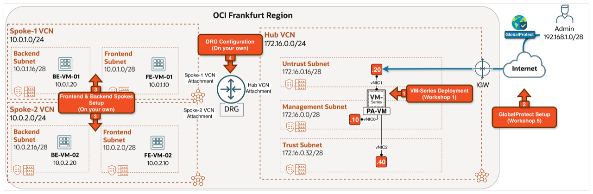

<!-- -->

1. Complete [Deploy Palo Alto NGFW in OCI (Standalone)](https://livelabs.oracle.com/ords/dbpm/r/livelabs/view-workshop?wid=4487). This workshop deploys the baseline Palo Alto VM-Series firewall in OCI Frankfurt, including the Hub VCN, subnets, Internet Gateway, and base firewall configuration.

2. Complete [Configure GlobalProtect Remote Access VPN](https://livelabs.oracle.com/ords/dbpm/r/livelabs/view-workshop?wid=4501). This workshop configures the **GlobalProtect Portal and Gateway** on the Palo Alto. Ensure that a GlobalProtect client can connect before configuring routing for this lab.

3. Provision two Spoke VCNs with Oracle Linux 9 VMs (or use an existing workload or application in your environment):

    | VCN | VCN CIDR | Subnet | VM |
    | --- | --- | --- | --- |
    | Spoke-1 | `10.0.1.0/24` | Frontend `10.0.1.0/28` | FE-VM-01 `10.0.1.10` |
    |  |  | Backend `10.0.1.16/28` | BE-VM-01 `10.0.1.20` |
    | Spoke-2 | `10.0.2.0/24` | Frontend `10.0.2.0/28` | FE-VM-02 `10.0.2.10` |
    |  |  | Backend `10.0.2.16/28` | BE-VM-02 `10.0.2.20` |

4. Attach the Hub, Spoke-1, and Spoke-2 VCNs to the DRG. Then, assign the DRG and VCN route tables according to the table below:

| Attachment             | DRG Route Table | VCN Route Table |
| ---------------------- | --------------- | --------------- |
| Hub VCN Attachment     | rt-hub          | rt-drg-ingress  |
| Spoke-1 VCN Attachment | rt-spoke        | -               |
| Spoke-2 VCN Attachment | rt-spoke        | -               |

A **VCN Route Table** is assigned to a DRG attachment (also called an **Ingress** or **Transit Route Table**) when traffic entering the Hub VCN through the DRG needs to be steered to a destination other than what the VCN's local routing would pick. In this scenario, it steers traffic from the DRG to the Palo Alto Trust interface for inspection instead of allowing local VCN routing to bypass the firewall. The same principle applies to other gateways (IGW, SGW, NAT GW): you assign an Ingress Route Table to them when the default VCN routing is not what you want.

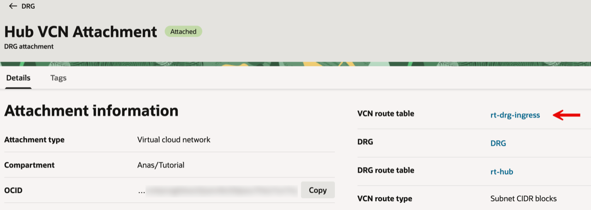

## Task 1: Review the Use Case

In this design, which builds on **Part 5 (GlobalProtect)** of the workshop series, a remote administrator connects to the Palo Alto with the GlobalProtect agent and receives an IP from the tunnel pool (`192.168.1.0/28`). Only the Spoke-1 CIDR is included in the GlobalProtect Include list, so the client installs a route to Spoke-1 but not to Spoke-2, even though both are attached to the DRG. This is a **split-tunnel** design: only the Spoke-1 CIDR is sent through the VPN, while general Internet traffic, such as access to `oracle.com`, stays on the local connection.

### This is the right choice when:

- A remote administrator or operator needs **targeted access** to a subset of VCNs (one tenant, one environment, one application) without granting access to the rest of the estate.
- You want to **enforce scope at the route level** (Include / Exclude list on the GlobalProtect Gateway) so the client can never accidentally route to other spokes - much easier to reason about than firewall rules alone.
- You want **split tunnel** for normal Internet use, with only the in-scope corporate CIDR sent through the firewall.

### Traffic Flow:

Only traffic for Spoke-1 uses the VPN. The dotted path to Spoke-2 shows that access is not allowed, and general Internet traffic stays on the administrator's local connection. The following steps trace the permitted Spoke-1 VPN flow.

1. The remote administrator initiates a GlobalProtect connection over the Internet.
2. The connection terminates on the **Palo Alto Untrust public IP** through the IGW. The Palo Alto authenticates the user, assigns an IP from the tunnel pool (`192.168.1.0/28`), and the admin's VPN traffic enters the firewall on `tunnel.3`.
3. Traffic destined for the Spoke-1 CIDR (`10.0.1.0/24`) exits the Palo Alto through its Trust interface (`172.16.0.40`) and is sent to the DRG through the Hub VCN attachment.
4. The DRG forwards the traffic through the **Spoke-1 VCN Attachment** to the permitted Spoke-1 resources (**FE-VM-01** and **BE-VM-01**).
5. Return traffic from Spoke-1 travels through the DRG to the Spoke VCN attachment, to Hub VCN attachment, where `rt-drg-ingress` routes the tunnel pool (`192.168.1.0/28`) to the Palo Alto Trust interface (`172.16.0.40`). The firewall then sends the reply to the administrator through `tunnel.3`, keeping the VPN flow symmetric.

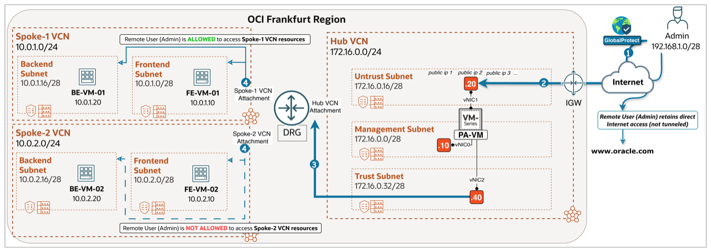

## Task 2: Configure Routing

The diagram below summarises the routing plan for Lab 4.

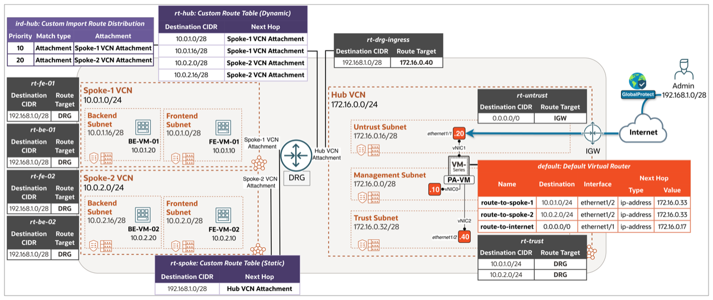

> **Note:** Routing has three parts: OCI VCN route tables control traffic leaving each subnet, OCI DRG route tables control traffic between attachments, and the Palo Alto virtual router controls forwarding through the firewall.

#### Step 1: Open the Hub VCN Routing view

1. Select the correct **region**.
2. Click on the **hamburger menu** in the top left corner.

    

<!-- -->

1. Click on **Networking**.
2. Click on **Virtual cloud networks**.

    

- Click on the **Hub VCN**.

    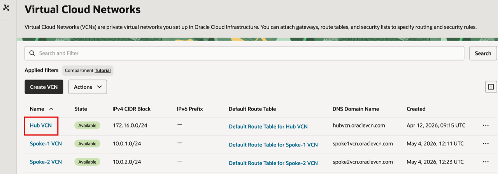

- Click on the **Routing** tab.

    

#### Step 2: Configure `rt-drg-ingress` (Hub VCN - DRG attachment ingress route table)

Route return traffic from Spoke-1 to GlobalProtect clients through the Palo Alto Trust interface.

- Click on the route table **rt-drg-ingress**.

    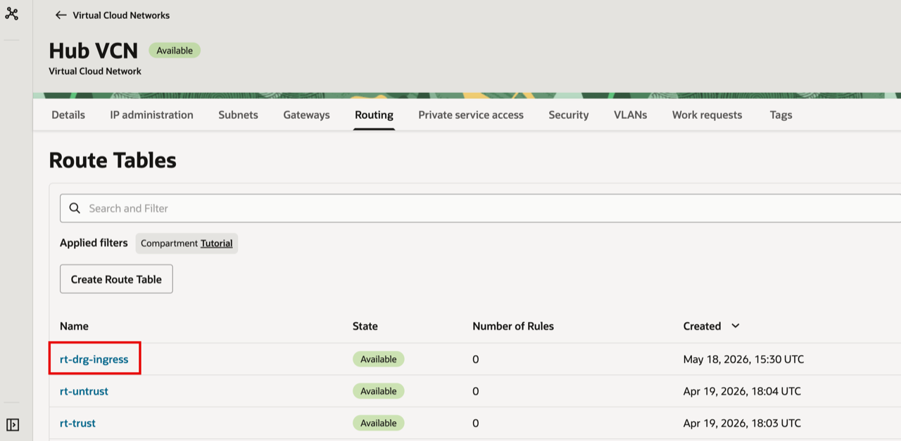

<!-- -->

1. Click on the **Route Rules** tab.
2. Add the route rule `192.168.1.0/28 → 172.16.0.40` (target type **Private IP**, pointing at the Palo Alto Trust interface). This forces return traffic destined to the GlobalProtect IP pool back through the firewall.
3. Click the back arrow to return to the Hub VCN route tables list.

    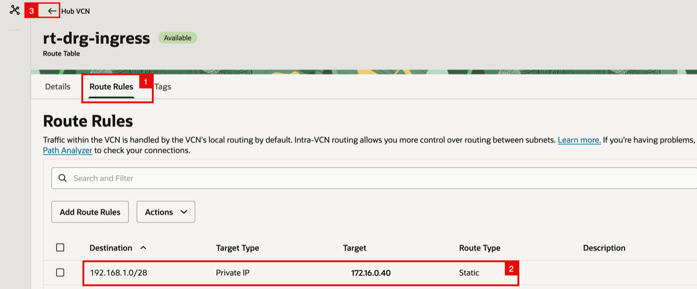

#### Step 3: Configure `rt-untrust` (Hub VCN - Untrust subnet route table)

The Untrust subnet route table needs `0.0.0.0/0 → IGW` so the firewall's Untrust interface can terminate inbound GlobalProtect connections from the Internet.

- Click on the route table **rt-untrust**.

    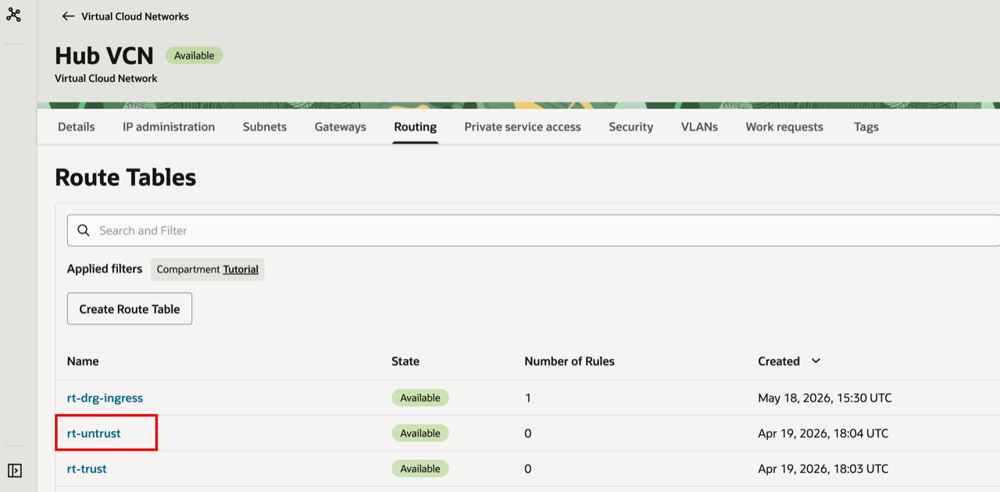

<!-- -->

1. Click on the **Route Rules** tab.
2. Add the route rule `0.0.0.0/0 → IGW`.
3. Click the back arrow to return to the Hub VCN route tables list.

    

#### Step 4: Configure `rt-trust` (Hub VCN - Trust subnet route table)

The Trust subnet route table needs to send the two Spoke CIDRs to the DRG so that return packets from the GlobalProtect client (heading back out of the Palo Alto Trust interface towards either spoke) reach the right destination.

- Click on the route table **rt-trust**.

    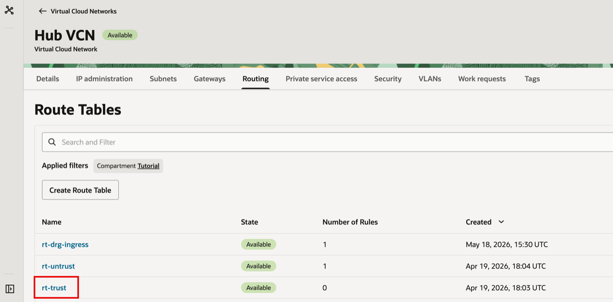

<!-- -->

1. Click on the **Route Rules** tab.
2. Add the two route rules `10.0.1.0/24 → DRG` and `10.0.2.0/24 → DRG`.
3. Click the back arrow to return to the Hub VCN route tables list.

    

<!-- -->

1. Notice the three Hub VCN route tables: `rt-drg-ingress` and `rt-untrust` each have one rule, while `rt-trust` has two.
2. Click the back arrow to return to the **Virtual cloud networks** list.

    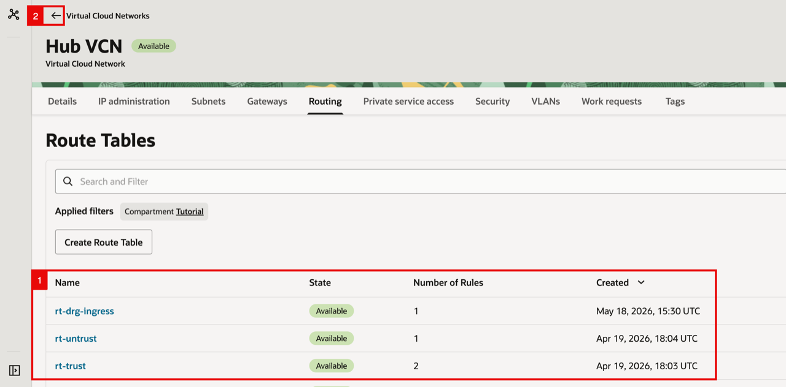

#### Step 5: Configure Spoke subnet route tables (`rt-fe-01`, `rt-be-01`, `rt-fe-02`, `rt-be-02`)

Each spoke needs routes for the GlobalProtect client address range (`192.168.1.0/28`) through the DRG, so return traffic is sent back to the hub for firewall inspection.

- Click on the **Spoke-1 VCN**.

    

- Click on the **Routing** tab.

    

- Click on the route table for the **Frontend Subnet** (`rt-fe-01`).

    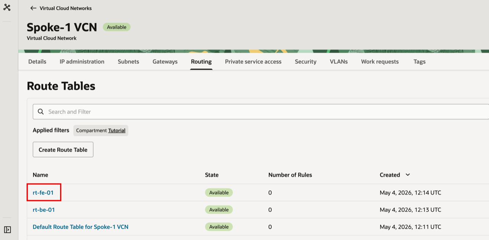

<!-- -->

1. Click on the **Route Rules** tab.
2. Add the route rule `192.168.1.0/28 → DRG`.
3. Click the back arrow to return to the Spoke-1 VCN route tables list.

    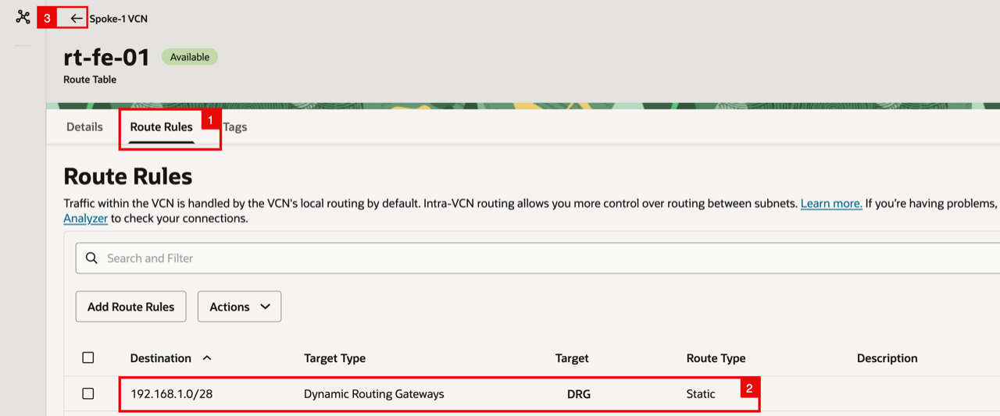

- Click on the route table for the **Backend Subnet** (`rt-be-01`).

    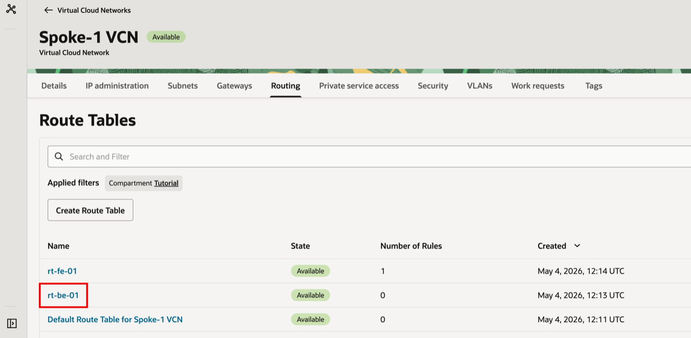

<!-- -->

1. Click on the **Route Rules** tab.
2. Add the route rule `192.168.1.0/28 → DRG`.
3. Click the back arrow to return to the Spoke-1 VCN route tables list.

    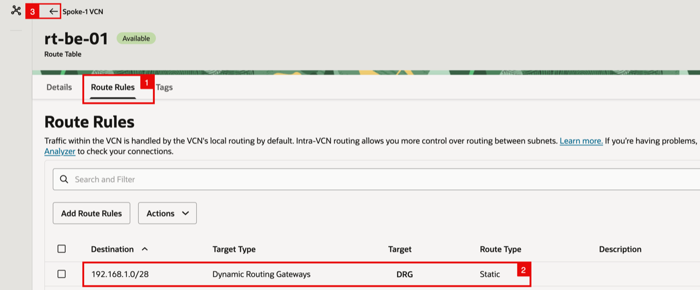

- Notice that both `rt-fe-01` and `rt-be-01` now have 1 rule each. Click the back arrow to return to the **Virtual Cloud Networks** list. 

    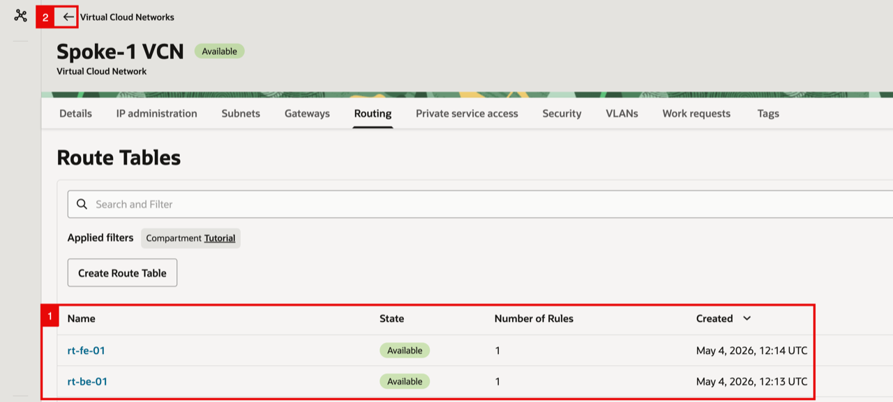

- Click on the **Spoke-2 VCN**.

    

- Click on the **Routing** tab.

    

- Click on the route table for the **Frontend Subnet** (`rt-fe-02`).

    

<!-- -->

1. On the **Route Rules** tab
2. Add the route rule `192.168.1.0/28 → DRG`.
3. Click the back arrow to return to the Spoke-2 VCN route tables list.

    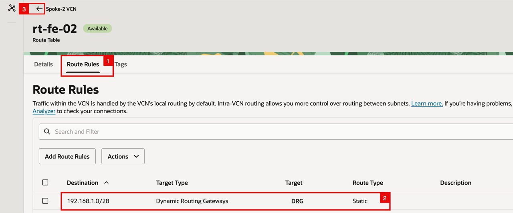

- Click on the route table for the **Backend Subnet** (`rt-be-02`).

    

<!-- -->

1. On the **Route Rules** tab
2. Add the route rule `192.168.1.0/28 → DRG`.
3. Click the back arrow to return to the Spoke-2 VCN route tables list.

    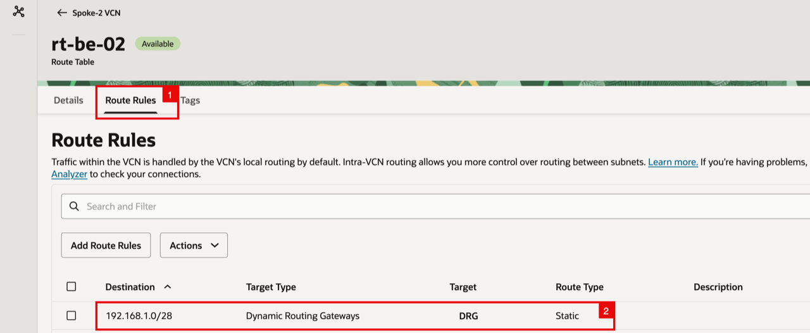

> **Note:** Spoke-2 subnets are configured with the same return route even though Spoke-2 is **NOT** in the GlobalProtect Include list. This is intentional: it keeps the spoke routing symmetric for any **future** access decision, while the actual access control happens at the Palo Alto / GlobalProtect Include list.

#### Step 6: Configure DRG route tables (`ird-hub`, `rt-hub`, `rt-spoke`)

The DRG holds two route tables: **`rt-hub`** (used by the Hub VCN attachment) and **`rt-spoke`** (used by the Spoke VCN attachment). `rt-hub` is populated dynamically from an **Import Route Distribution** (`ird-hub`), so it always reflects the current set of spokes without manual updates. `rt-spoke` carries a static route for the GlobalProtect pool (`192.168.1.0/28`) back to the Hub VCN attachment.

1. Click on the **hamburger menu**.
2. Click on **Networking**.
3. Click on **Dynamic routing gateway**.

    

- Click on the **DRG** that is already deployed.

    

- Click on the **Attachments** tab.

    

<!-- -->

1. Make sure you are in the VCN attachments section.
2. Notice the **VCN attachments** table: the **Hub VCN Attachment** uses DRG route table `rt-hub`; the **Spoke-1 VCN Attachment** and **Spoke-2 VCN Attachment** use `rt-spoke`.

    

- Click on the **rt-hub** link in the **DRG route table** column for the **Hub VCN Attachment**.

    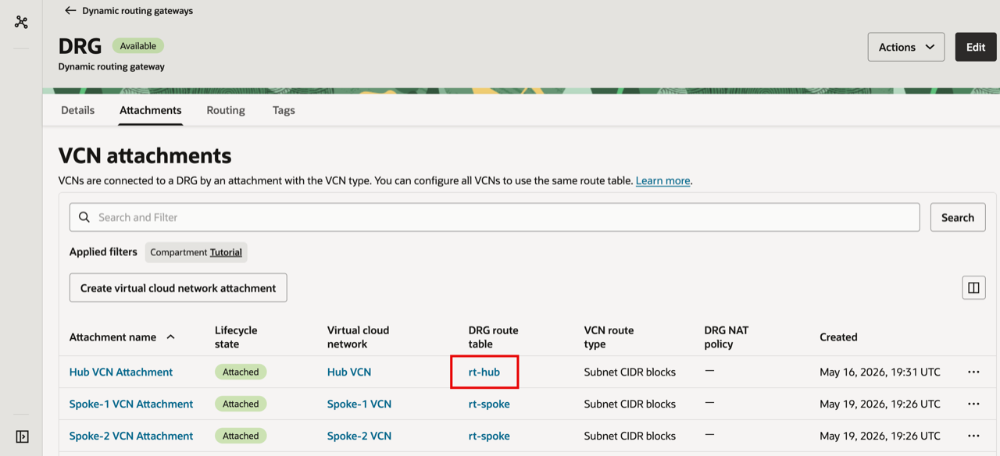

- On the **rt-hub** Details page, click on the **ird-hub** link in the **Import route distribution** field.

    

- Click on the **Statements** tab.

    

<!-- -->

1. Confirm two statements: priority `10` Spoke-1 VCN Attachment and priority `20` Spoke-2 VCN Attachment. You can instead use match type **Attachment type** and select **Virtual Cloud Network** to import future spokes automatically.
2. Click the back arrow to return to the DRG.

    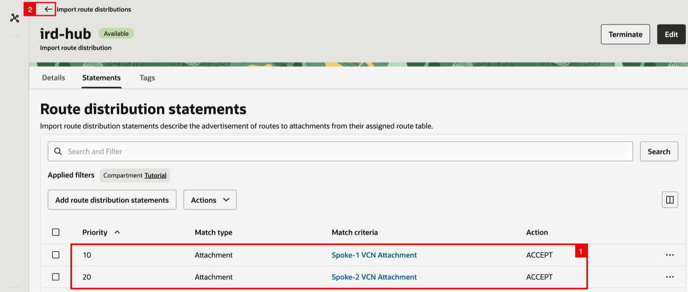

- On the DRG, click on the **Routing** tab and notice both `rt-hub` and `rt-spoke` are present. Click on the route table **rt-hub**.

    

- On the **rt-hub** Details page, click on the **Get all route rules** button.

    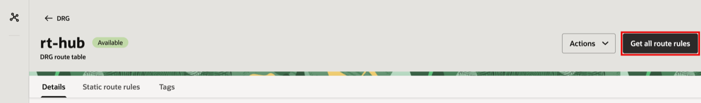

<!-- -->

1. Notice the **four DYNAMIC entries**: 
    - `10.0.1.0/28` and `10.0.1.16/28` (Spoke-1 FE/BE subnets) via **Spoke-1 VCN Attachment**, 
    - `10.0.2.0/28` and `10.0.2.16/28` (Spoke-2 FE/BE subnets) via **Spoke-2 VCN Attachment**. 
2. Click **Close** when done.

    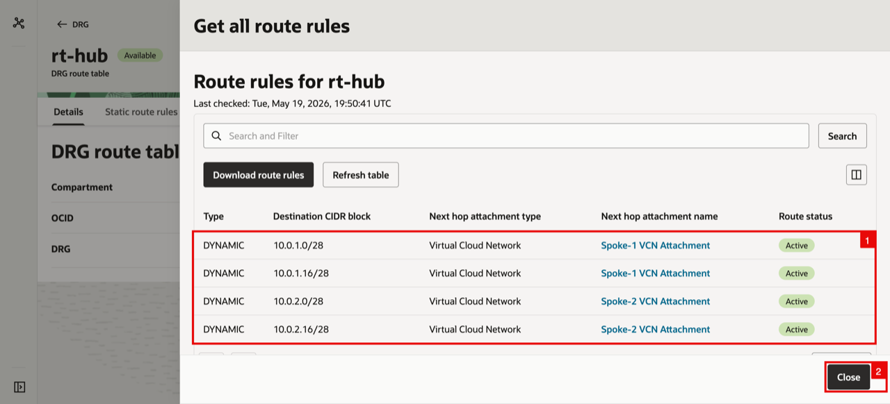

- Click the back arrow to return to the DRG route tables list.

    

- Click on the route table **rt-spoke**.

    

<!-- -->

1. Notice the **rt-spoke** Details page: **Import route distribution** is `-` (no dynamic routing).
2. Click on the **Static route rules** tab.

    

- Notice the single static rule in `rt-spoke`: `192.168.1.0/28 → Hub VCN Attachment`. This sends return traffic to GlobalProtect clients back through the Hub for firewall inspection.

    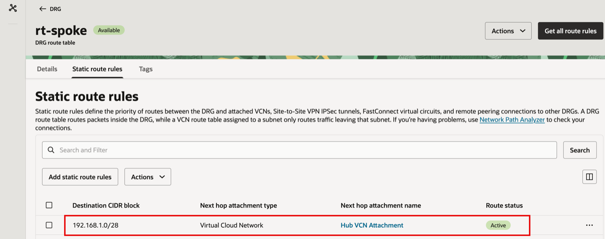

#### Step 7: Configure Palo Alto VR static routes

The OCI DRG and VCN route tables deliver traffic to the correct Palo Alto interface, but the firewall's default Virtual Router still needs static routes to forward each destination CIDR. The next-hop addresses used below are the OCI **default gateways** for the firewall subnets: `172.16.0.33` for the Trust subnet and `172.16.0.17` for the Untrust subnet. For Lab 4 the firewall needs:

- `10.0.1.0/24` — `ethernet1/2`, next hop `172.16.0.33`
- `10.0.2.0/24` — `ethernet1/2`, next hop `172.16.0.33`
- `0.0.0.0/0` — `ethernet1/1`, next hop `172.16.0.17`

Open the Palo Alto Web GUI, then:

1. Sign in to the Palo Alto Web GUI, then click on the **Network** tab.
2. Click on **Virtual Routers**.
3. Click on the **default** virtual router.

    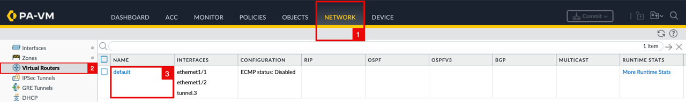

- In the **Virtual Router - default** dialog, click on **Static Routes** in the left-hand menu.

    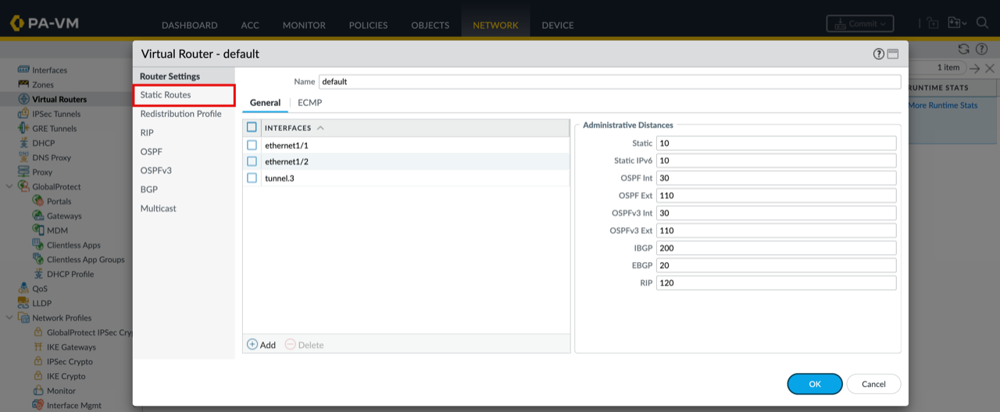

<!-- -->

1. On the **IPv4** sub-tab, click on the **Add** button and create each of the three static routes in turn:

    - `route-to-spoke-1` → Destination `10.0.1.0/24`, Interface `ethernet1/2`, Next Hop **IP Address** `172.16.0.33`.
    - `route-to-spoke-2` → Destination `10.0.2.0/24`, Interface `ethernet1/2`, Next Hop **IP Address** `172.16.0.33`.
    - `route-to-internet` → Destination `0.0.0.0/0`, Interface `ethernet1/1`, Next Hop **IP Address** `172.16.0.17`.

2. Once all three routes are listed in the IPv4 table, click on the **OK** button to save the Virtual Router configuration.

    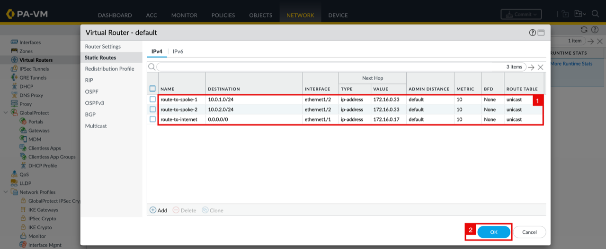

#### Step 8: Commit the Palo Alto configuration

- Notice that the **default** Virtual Router now shows **Static Routes: 3**. Click on the **Commit** button at the top right.

    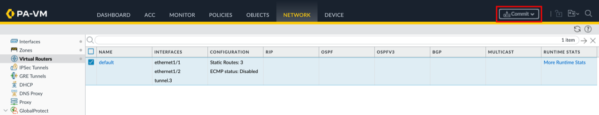

<!-- -->

1. Select **Commit All Changes**.
2. In the **Commit** dialog, click the **Commit** button to confirm.

    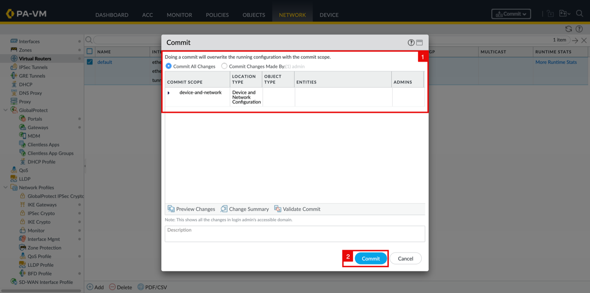

- The **Commit Status** dialog shows the operation as **Pending** while the configuration is applied.

    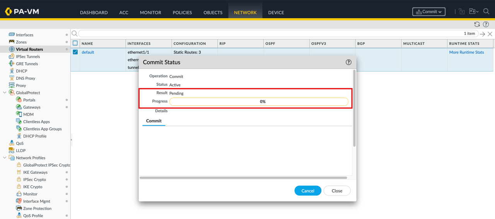

- Notice the **Commit Status** shows **Completed** and **Successful**.

    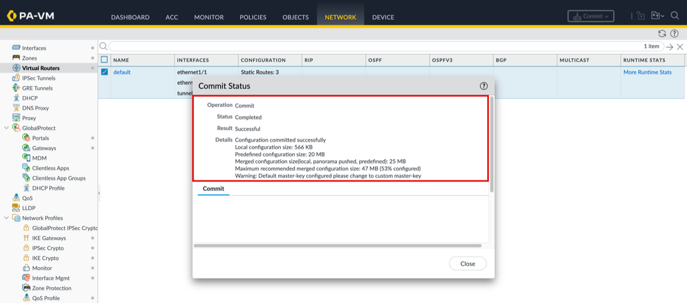

- Back on the **Virtual Routers** list. Click on **More Runtime Stats** to inspect the runtime route table.

    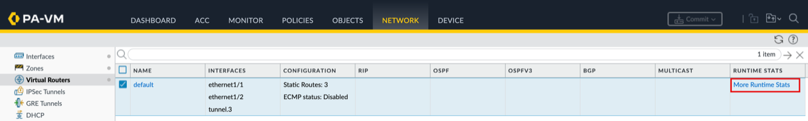

- In the **Virtual Router - default → Routing → Route Table** view, notice the three static routes (`10.0.1.0/24` and `10.0.2.0/24` via `172.16.0.33`, `0.0.0.0/0` via `172.16.0.17`) **alongside the connected interface routes and the GlobalProtect pool route `192.168.1.0/28` on `tunnel.3` (installed when a client is connected).**

    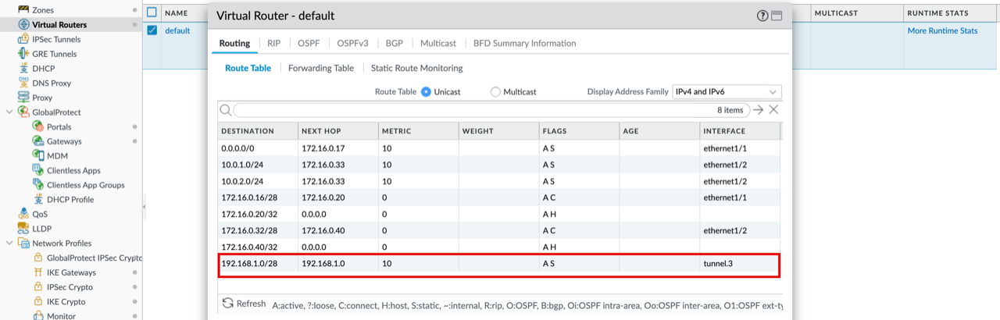

## Task 3: Configure Split Tunnel

In **full-tunnel** mode, GlobalProtect makes PA-VM the client’s default gateway. Traffic for both spokes is sent to the Palo Alto through the VPN. Public Internet traffic is also sent to PA-VM instead of remaining on the client’s local Internet connection, so public websites, such as `oracle.com`, time out.

In a **split-tunnel** configuration, the GlobalProtect Gateway Include list installs a tunnel route only for Spoke-1 (`10.0.1.0/24`). The client’s default route stays on its local interface, so Spoke-2 traffic does not enter the VPN and Internet traffic stays local.

The diagram below shows the intended split-tunnel routing. The following steps compare the full-tunnel and split-tunnel results, configure the Include list, and verify the client routing table.

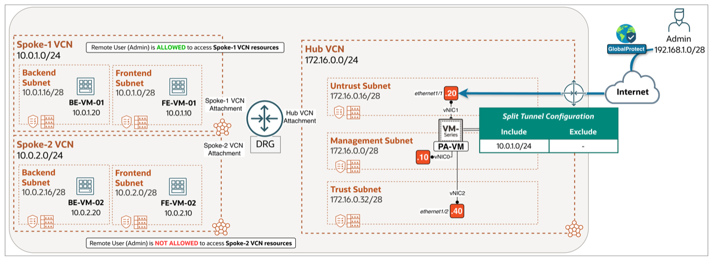

#### Step 1: Confirm initial reachability (client without GlobalProtect)

- From a terminal on the client, ping all four spoke VMs (`10.0.1.10`, `10.0.1.20`, `10.0.2.10`, `10.0.2.20`). 
- All four pings **fail** because the client has no route into OCI without the VPN.

    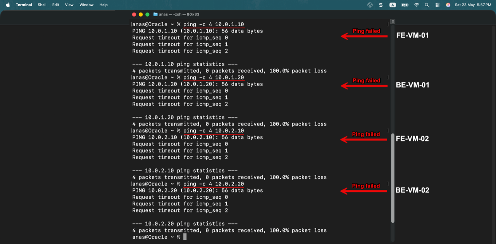

#### Step 2: Connect GlobalProtect in full tunnel mode

- Open the **GlobalProtect** agent and connect. 
- Notice that the agent shows **Connected** to `GP-Ext-GW` (Best Available Gateway).

    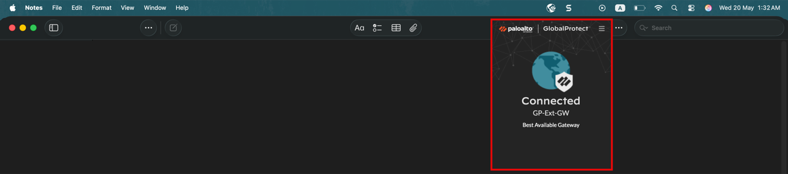

<!-- -->

1. Run `route -n get default` (macOS) or `route print` (Windows). 
2. Notice the `gateway` field shows `192.168.1.1`, the address assigned to the client from the GlobalProtect pool (`192.168.1.0/28`).
3. Notice the interface is `utun4`, the GlobalProtect tunnel interface. This confirms that the default route uses the VPN tunnel.

    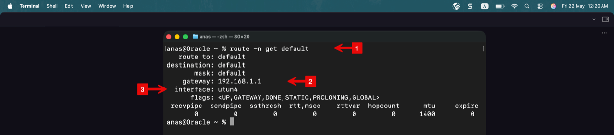

- Ping all four spoke VMs again. All of them now **succeed**, because the full tunnel sends everything into the firewall and the firewall has routes to both Spoke-1 and Spoke-2.

    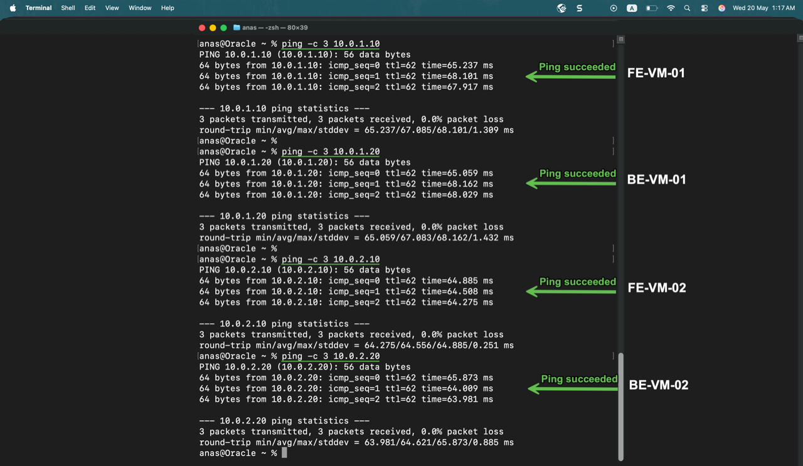

<!-- -->

1. Open a browser and try to reach `https://www.oracle.com`. 
2. The page fails to load because full tunnel sends public Internet traffic into OCI through GlobalProtect. OCI is not intended to act as the client’s Internet provider; public Internet traffic should use the client’s local connection instead of traversing the firewall.

    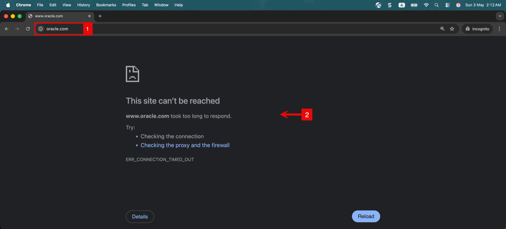

#### Step 3: Collect GlobalProtect debug logs to inspect the client routing table

To prove that the full tunnel is what is hijacking the default route, collect the GlobalProtect agent's debug logs and read the `RoutePrint.txt` file from the bundle.

1. Click on the **GlobalProtect** icon in the menu bar.
2. Click on the **hamburger menu** in the top-right of the agent panel.
3. Click on **Settings**.

    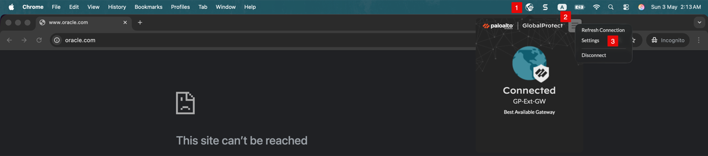

<!-- -->

1. On the **Connections** tab, notice the **Tunnel Statistics** showing **Assigned IP Address** `IPv4 192.168.1.1` (your tunnel pool IP).
2. Click on the **Troubleshooting** tab.

    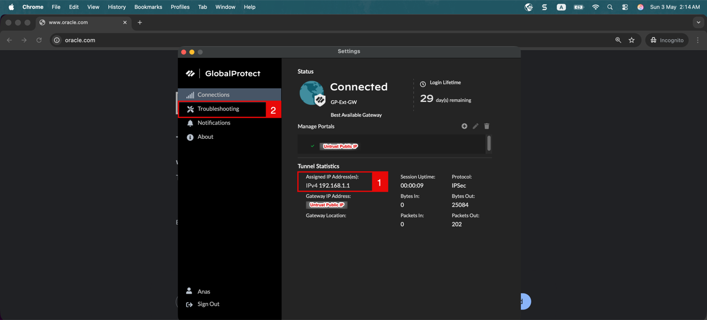

<!-- -->

1. Select **Debug Level Logs**.
2. Click on the **Collect Logs** button.

    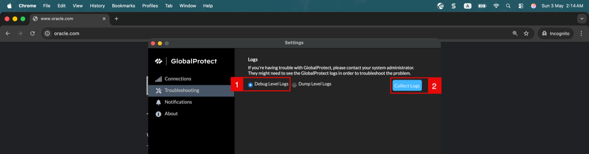

- Wait for the **Collecting Logs** dialog to finish.

    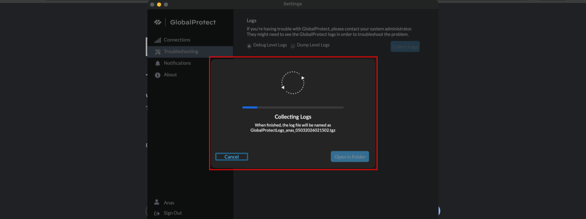

<!-- -->

1. In the folder picker, select **Downloads** as the destination.
2. Click on the **Open** button.

    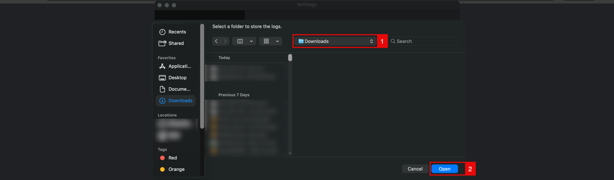

<!-- -->

1. Notice the **Collected Logs** dialog showing the log archive path. 
2. Click on the **Open in Folder** button.

    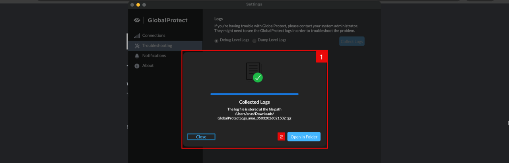

- In Finder, locate the downloaded `GlobalProtectLogs_<user>_<timestamp>.tgz` archive in **Downloads**.

    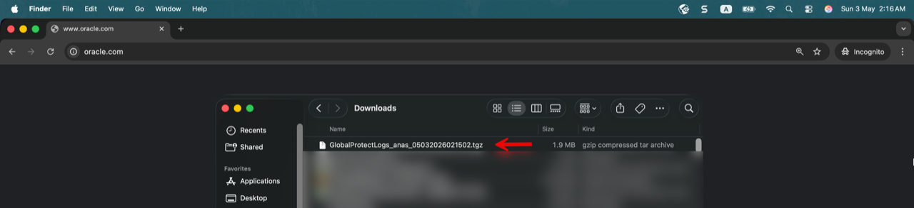

<!-- -->

1. Extract the archive. Inside the resulting folder.
2. Find and double-click **`RoutePrint.txt`**.

    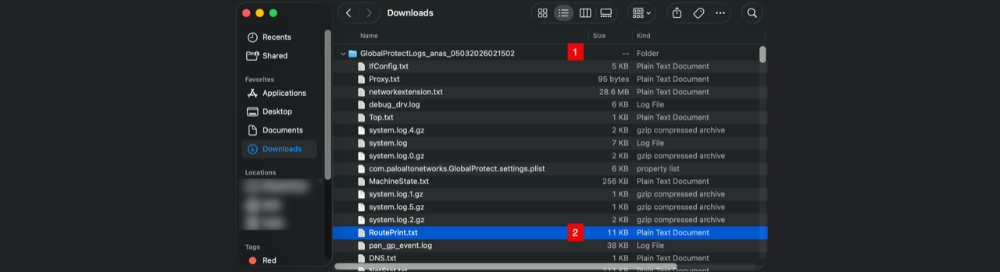

- Notice two default routes. The GlobalProtect default route uses `192.168.1.1` on `utun8`; this is the route selected for full-tunnel traffic. The client retains a local default route through `192.168.100.1` on `en0`. The host route for the firewall’s Untrust public IP also uses `192.168.100.1` on `en0`, keeping the GlobalProtect connection on the local network.

    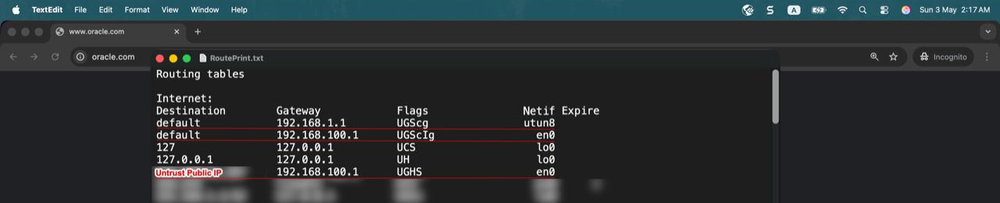

#### Step 4: Configure Split Tunnel on the GlobalProtect Gateway

Edit the GlobalProtect Gateway created in Part 5 of the workshop series and add `10.0.1.0/24` to the **Include Access Route** list so only Spoke-1 is routed through the tunnel.

1. Click on the **Network** tab.
2. Click on **Gateways** under **GlobalProtect**.
3. Click on the existing **GP-Gateway** entry.

    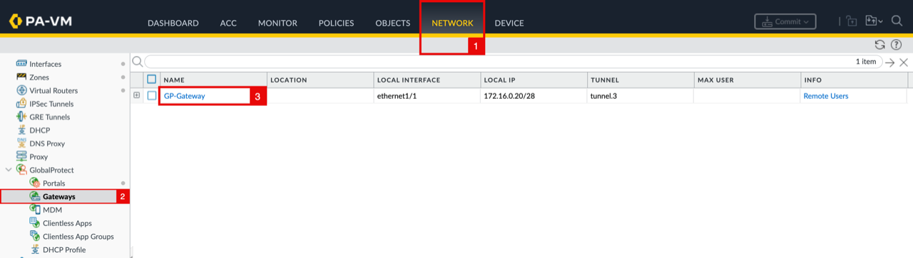

- In the **GlobalProtect Gateway Configuration** dialog, click on the **Agent** entry in the left-hand menu.

    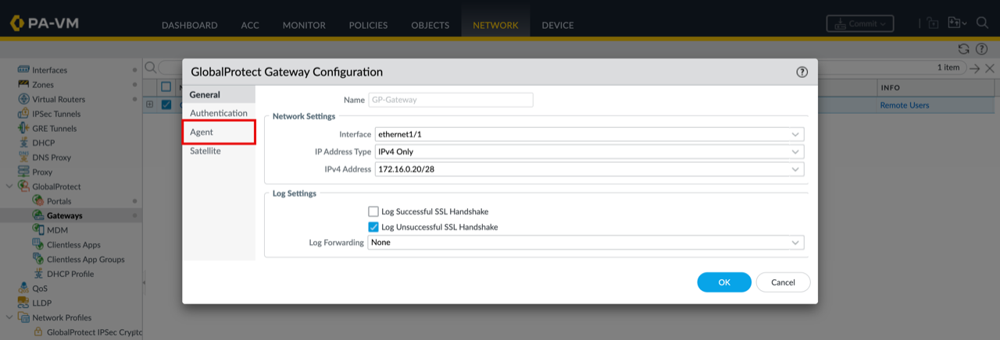

- On the **Agent** page, click on the **Client Settings** sub-tab (the **Tunnel Settings** sub-tab is shown by default).

    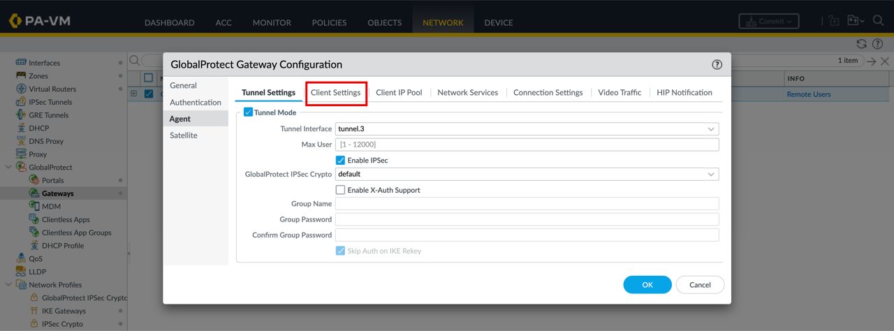

- Click on the existing **GP-Client-Settings** entry to edit it.

    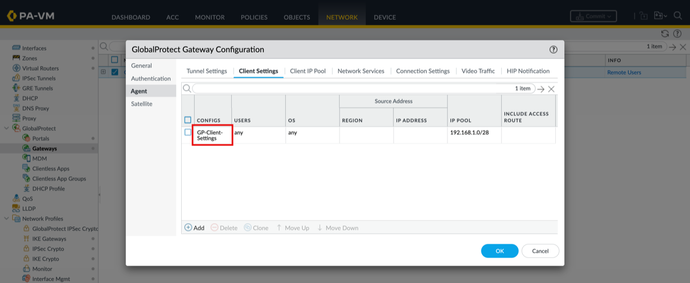

- In the **Configs** dialog, click on the **Split Tunnel** sub-tab.

    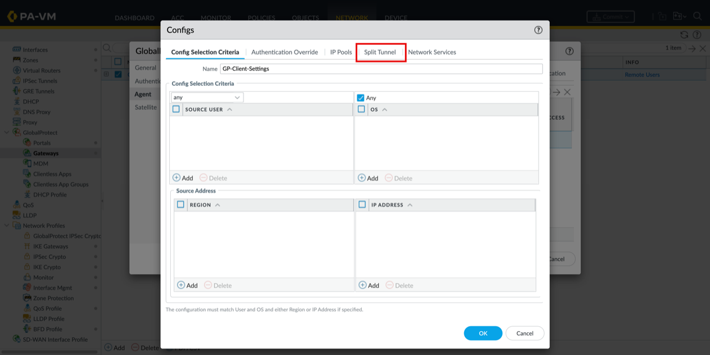

<!-- -->

1. On the **Access Route** sub-tab, click on the **Add** button under **INCLUDE**.
2. Specify `10.0.1.0/24` in the new INCLUDE entry.
3. Click on the **OK** button.

> **Note:** Including only `10.0.1.0/24` sends Spoke-1 traffic through the VPN. The client receives no VPN route for Spoke-2, so Spoke-2 is unreachable in this lab.

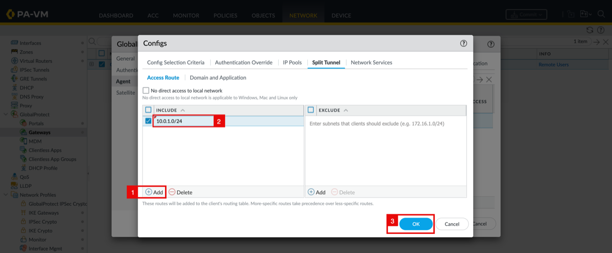

- Back on the **Client Settings** sub-tab, notice that the `GP-Client-Settings` row now shows `10.0.1.0/24` in the **INCLUDE ACCESS ROUTE** column. 
- Click on the **OK** button to save the Gateway.

    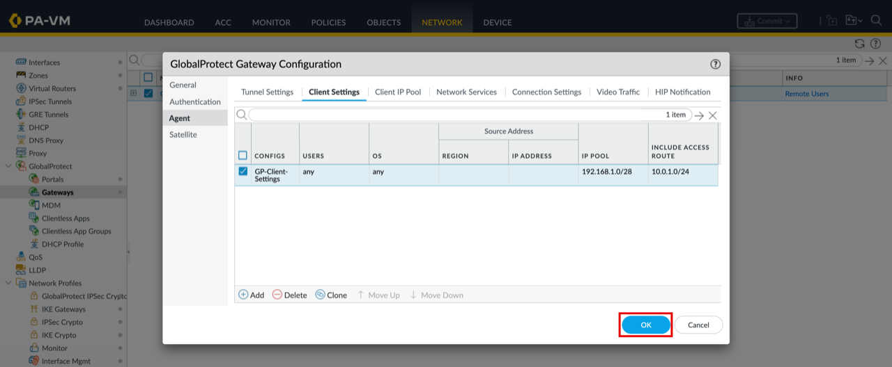

#### Step 5: Commit the Palo Alto configuration

- Click on the **Commit** button in the upper-right corner of the Palo Alto Web GUI.

    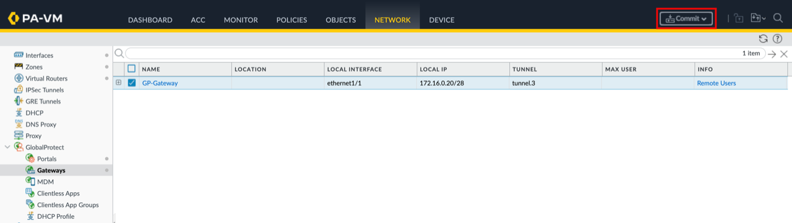

<!-- -->

1. Select **Commit All Changes**.
2. In the **Commit** dialog, click the **Commit** button to confirm.

    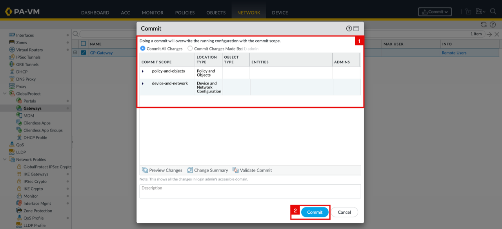

- The **Commit Status** dialog shows the operation as **Pending** while the configuration is applied.

    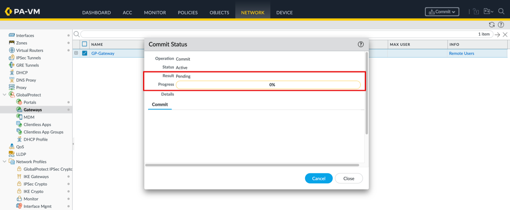

- Notice the **Commit Status** shows **Completed** and **Successful**.

    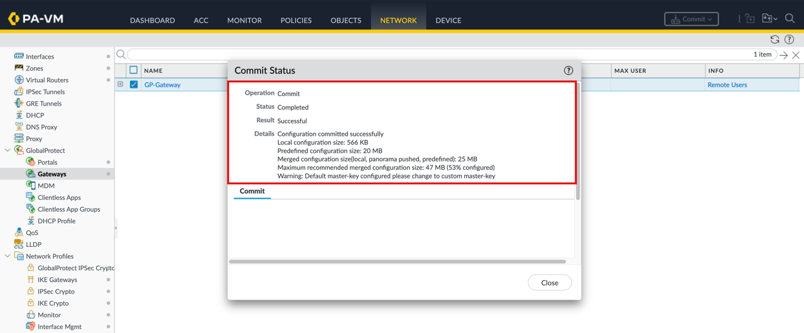

## Task 4: Test and Validate

- On the client, reconnect GlobalProtect so it picks up the updated Split Tunnel configuration. 

These fields show that split tunneling moves the client’s default route from GlobalProtect IP back to the client’s local network.

1. Then run `route -n get default` (macOS) or `route print` (Windows).
2. Before split tunneling, the GlobalProtect tunnel was the default gateway (`192.168.1.1`). The gateway is now the client’s local gateway, `192.168.100.1`.
3. The default route now uses `en0`, the physical Wi-Fi/Ethernet interface, instead of `utun4`, the GlobalProtect tunnel.

 - Split tunnel is in effect.

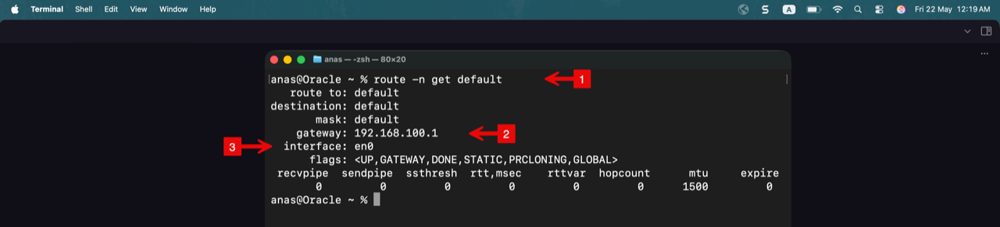

- Ping all four spoke VMs from the client. 
- The pings to Spoke-1 (`10.0.1.10`, `10.0.1.20`) **succeed**, and the pings to Spoke-2 (`10.0.2.10`, `10.0.2.20`) **fail** - the client never even sends the Spoke-2 packets into the tunnel because `10.0.2.0/24` is not in the Include list. 
- The firewall is not blocking Spoke-2; the client routing is enforcing the access decision.

    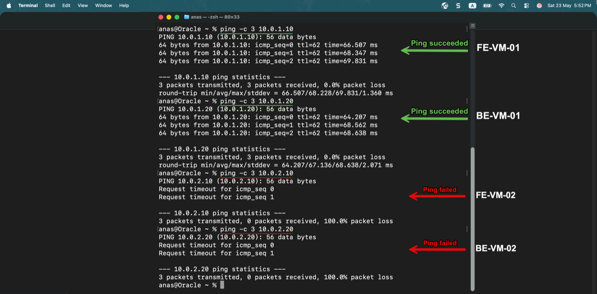

<!-- -->

1. Open a browser and reach `https://www.oracle.com`. 
2. The page now **loads** because Internet traffic is no longer being sent into the tunnel.

    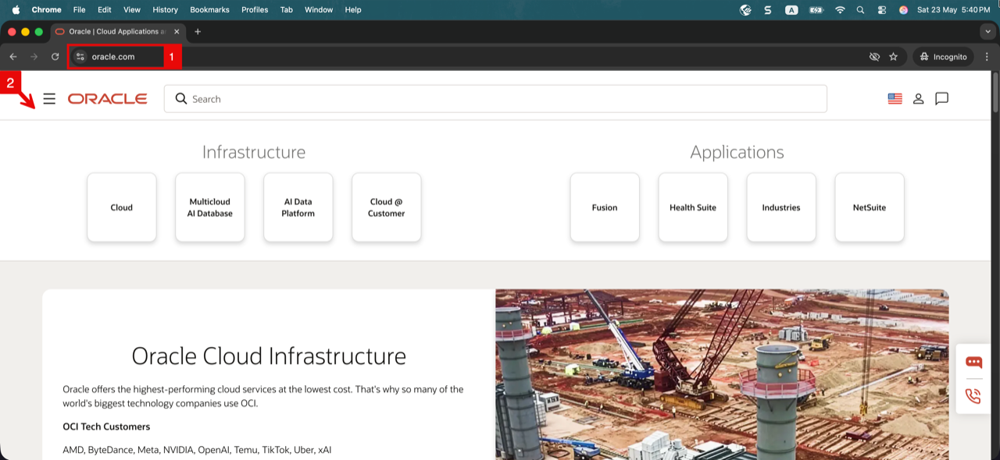

- Collect a fresh set of GP debug logs (Task 3 - Step 3) and open the new `RoutePrint.txt`. 
- Notice the routing table now shows `10.0.1/24 → 192.168.1.1 (utun4)` and the default route on `192.168.100.1 (en0)` - split tunnel confirmed.

    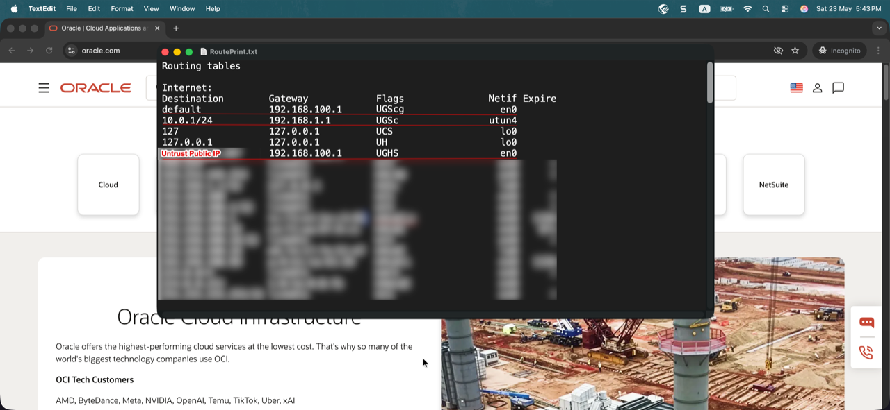

<!-- -->

1. On the Palo Alto, navigate to **Monitor**.
2. Click **Traffic**.
3. Notice that the only sessions logged are from the GlobalProtect pool to Spoke-1 destinations (`10.0.1.10`, `10.0.1.20`) with zones `remote-vpn-zone → trust-zone` and application `ping`. There are **no** sessions to `10.0.2.x` - the firewall confirms the access control is being enforced at the client (the packets never arrive at the firewall in the first place).

    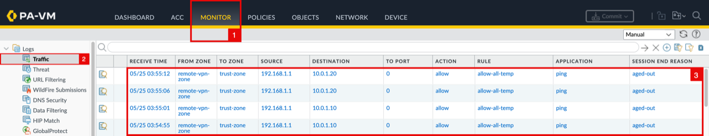

## Learn More

- [OCI VCN Route Tables](https://docs.oracle.com/en-us/iaas/Content/Network/Tasks/managingroutetables.htm)
- [OCI Dynamic Routing Gateway (DRG)](https://docs.oracle.com/en-us/iaas/Content/Network/Tasks/managingDRGs.htm)
- [Palo Alto GlobalProtect Overview](https://docs.paloaltonetworks.com/globalprotect/getting-started/globalprotect-overview)
- [Palo Alto GlobalProtect Split Tunnel Traffic](https://docs.paloaltonetworks.com/globalprotect/administration/globalprotect-gateways/split-tunnel-traffic-on-globalprotect-gateways)
- [Palo Alto Static Routes](https://docs.paloaltonetworks.com/ngfw/networking/static-routes)
- [Palo Alto View and Manage Logs](https://docs.paloaltonetworks.com/ngfw/administration/monitoring/view-and-manage-logs)

## Acknowledgements

- **Authors** - Anas Abdallah, Iwan Hoogendoorn (Cloud Networking Black Belts)
- **Contributor** - Antonio Gámir (Cloud Networking Black Belt)
- **Last Updated By/Date** - Anas Abdallah, October 2026

You may now **proceed to the next lab**.
