# Configure OSN Access - Distributed SGW with No Firewall Inspection

## Introduction

In this lab, each spoke VCN uses its own Service Gateway to access Oracle Services Network services directly. OSN traffic remains within the spoke and bypasses the Hub VCN and Palo Alto firewall, providing a lower-latency path without firewall inspection.

Estimated Time: 15 minutes

### Objectives

In this lab, you will:

- Configure a Service Gateway and route to Oracle Services Network in each spoke VCN.
- Validate direct Oracle Services Network access from each spoke without routing traffic through the Palo Alto firewall.

### Prerequisites

Before following the routing steps below, complete the items that are out of scope for this workshop. They are not part of the routing configuration itself, but they have to exist before any of the routes you are about to create are useful.

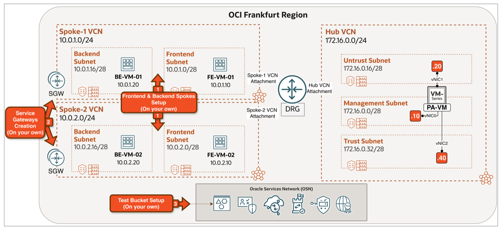

<!-- -->

1. Provision two Spoke VCNs with Oracle Linux 9 VMs (or use an existing workload or application in your environment):

    | VCN | VCN CIDR | Subnet | VM |
    | --- | --- | --- | --- |
    | Spoke-1 | `10.0.1.0/24` | Frontend `10.0.1.0/28` | FE-VM-01 `10.0.1.10` |
    |  |  | Backend `10.0.1.16/28` | BE-VM-01 `10.0.1.20` |
    | Spoke-2 | `10.0.2.0/24` | Frontend `10.0.2.0/28` | FE-VM-02 `10.0.2.10` |
    |  |  | Backend `10.0.2.16/28` | BE-VM-02 `10.0.2.20` |

2. Create a **Service Gateway (SGW)** in **each spoke VCN** (one per spoke). Each SGW provides direct OSN access for that spoke.

    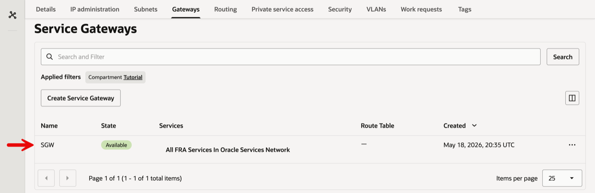

3. Create a test bucket in OCI Object Storage and a **Pre-Authenticated Request (PAR)** for a test object. A PAR is a time-limited URL that provides access to the object without requiring IAM authentication; you use it for end-to-end testing.

    - Create a text file named `Test-Object.txt` with a short line, such as `This is a test object...`, and upload it to the bucket.

    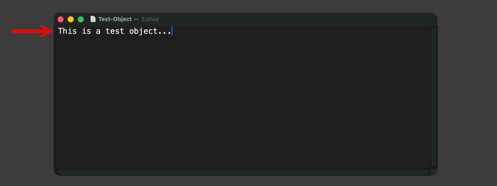

<!-- -->

1. In the **Test-Bucket** Objects view.
2. Locate the uploaded `Test-Object.txt`.
3. Open the row's **Actions** menu
4. and click **Create pre-authenticated request**.

    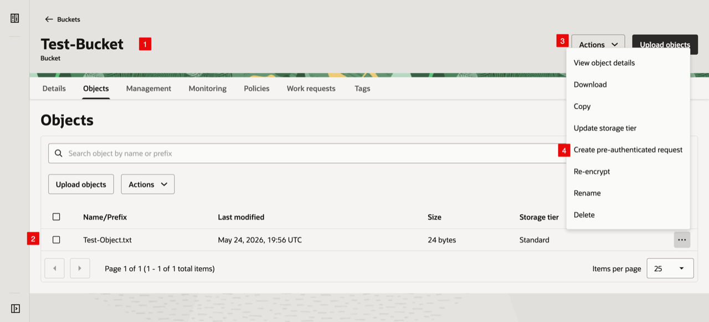

<!-- -->

1. In the **Create pre-authenticated request** dialog, give the PAR a name.
2. Leave the target as **Object** 
3. with **Object name** `Test-Object.txt`.
4. Set the access type to **Permit object reads**.
5. Choose an expiration date/time.
6. Click **Create pre-authenticated request**.

    

<!-- -->

1. Notice the warning.
2. In the **Pre-authenticated request details** dialog, copy the **Pre-authenticated request URL** and save it - you will `curl` it in the Test & Validate step. The URL is only shown once.

    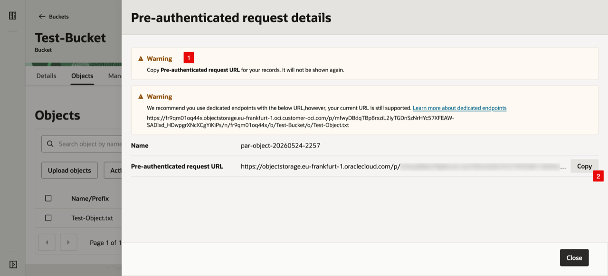

## Task 1: Review the Use Case

In this design, **each spoke has its own Service Gateway** and OSN traffic leaves the spoke directly, without going through the hub or the firewall. This minimises latency and removes the firewall as a bottleneck for OSN access, at the cost of not inspecting that traffic.

### This is the right choice when:

- OSN traffic is **high-volume** (Object Storage backups, Streaming, or data-processing workloads) and the latency or throughput cost of the centralized model is unacceptable.
- The OSN destinations are **already trusted** (your own buckets, your own databases) and you do not need NGFW inspection for compliance.
- You want **per-spoke autonomy**: each team manages its own SGW for its own services.

### Traffic Flow:

1. A VM in either spoke initiates a connection to an OSN service, such as Object Storage. Its subnet route table sends the OSN destination to the **local SGW**.
2. The SGW carries the packet over OCI's private OSN fabric to the target Oracle service.
3. Return traffic comes back through the same local SGW to the originating VM. The flow does not use the DRG, Hub VCN, or Palo Alto firewall.

    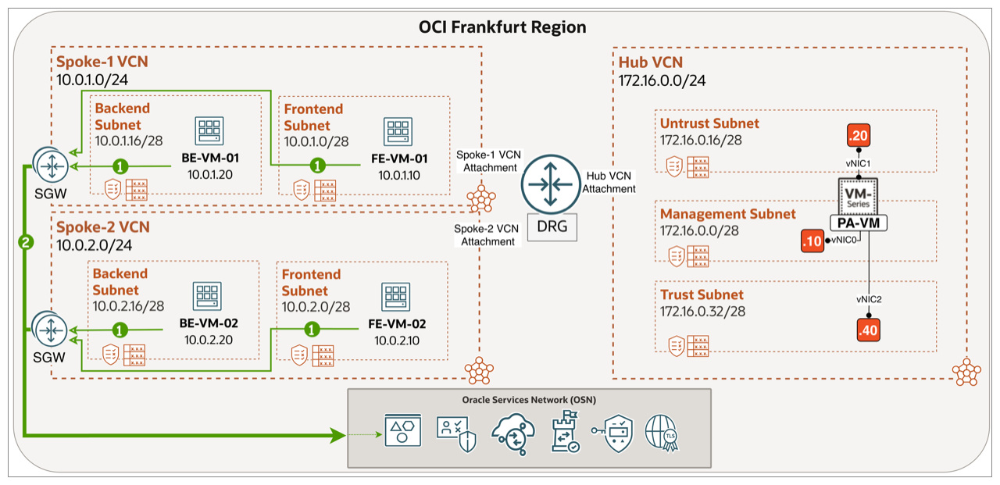

## Task 2: Configure Routing

The diagram below summarises the routing plan for Lab 6.

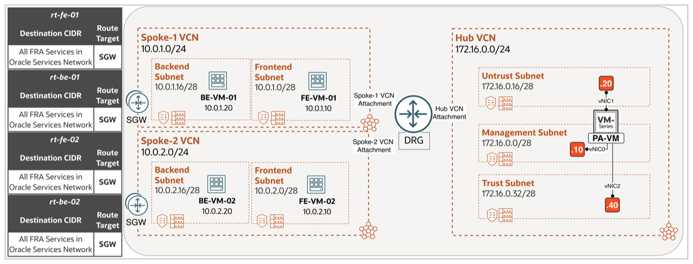

> **Note:** This design uses only OCI VCN route tables: each subnet sends OSN traffic to its local SGW. The DRG and Palo Alto virtual router are not part of this path.

#### Step 1: Open the Spoke-1 Routing view

1. Select the correct **region** and click on the **hamburger menu**.

    

<!-- -->

1. Click on **Networking**.
2. Click on **Virtual cloud networks**.

    

- From the **Virtual Cloud Networks** list, click on **Spoke-1 VCN**.

    

- Click on the **Routing** tab.

    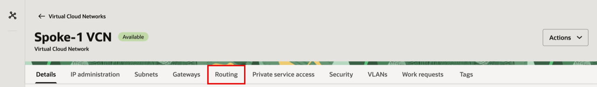

#### Step 2: Configure Spoke subnet route tables (`rt-fe-01`, `rt-be-01`, `rt-fe-02`, `rt-be-02`)

- Click on the route table for the **Frontend Subnet** (`rt-fe-01`).

    

<!-- -->

1. Click on the **Route Rules** tab.
2. Add the route rule `All FRA Services In Oracle Services Network → SGW`.
3. Click the back arrow to return to the Spoke-1 VCN route tables list.

    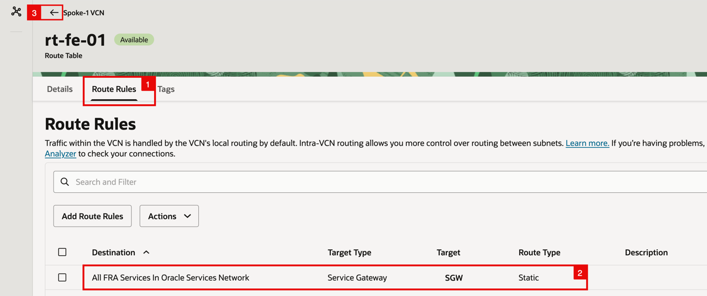

- Click on the route table for the **Backend Subnet** (`rt-be-01`).

    

<!-- -->

1. Click on the **Route Rules** tab.
2. Add the route rule `All FRA Services In Oracle Services Network → SGW`.
3. Click the back arrow to return to the Spoke-1 VCN route tables list.

    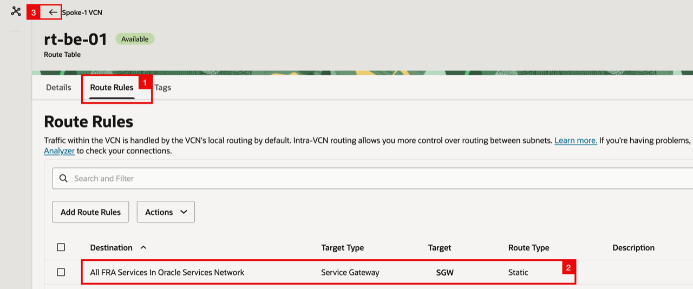

- Notice that both `rt-fe-01` and `rt-be-01` now have 1 rule each. Click the back arrow to return to the **Virtual Cloud Networks** list. 

    

- Navigate to **Spoke-2 VCN**

    

- Click on the **Routing** tab.

    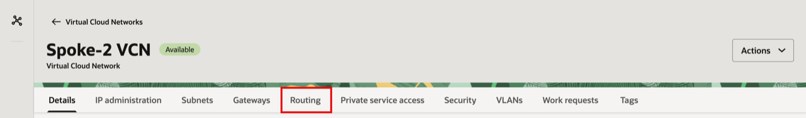

- Click on the route table for the **Frontend Subnet** (`rt-fe-02`).

    

<!-- -->

1. Click on the **Route Rules** tab.
2. Add the route rule `All FRA Services In Oracle Services Network → SGW`.
3. Click the back arrow to return to the Hub VCN route tables list.

    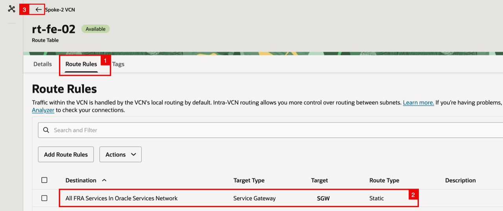

- Click on the route table for the **Backend Subnet** (`rt-be-02`) to add the same rule.

    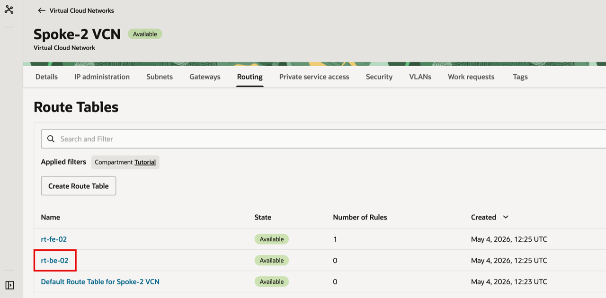

<!-- -->

1. Click on the **Route Rules** tab.
2. Add the route rule `All FRA Services In Oracle Services Network → SGW`.

    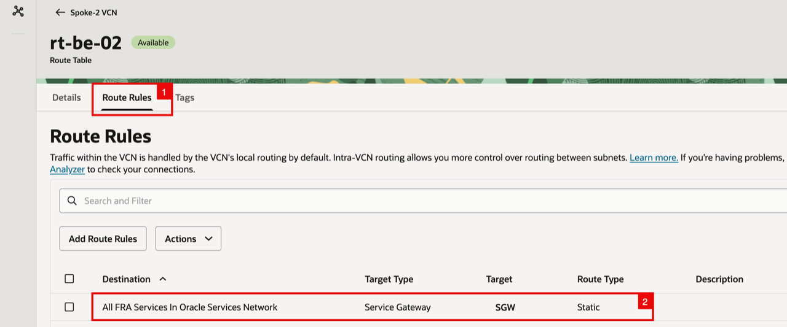

## Task 3: Test and Validate

1. From **FE-VM-01** (Spoke-1) and **FE-VM-02** (Spoke-2), `curl` the PAR URL. 
2. Both downloads succeed directly through their local SGWs.

    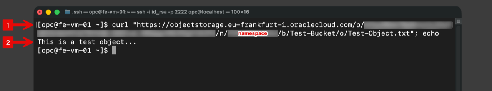

## Learn More

- [OCI VCN Route Tables](https://docs.oracle.com/en-us/iaas/Content/Network/Tasks/managingroutetables.htm)
- [OCI Service Gateway (SGW)](https://docs.oracle.com/en-us/iaas/Content/Network/Tasks/service-gateway_management.htm)

## Acknowledgements

- **Authors** - Anas Abdallah, Iwan Hoogendoorn (Cloud Networking Black Belts)
- **Contributor** - Antonio Gámir (Cloud Networking Black Belt)
- **Last Updated By/Date** - Anas Abdallah, October 2026

You may now **proceed to the next lab**.
