# Configure Inter-VCN Spoke-to-Spoke Communication

## Introduction

In this lab, you route traffic between workloads in two spoke VCNs through the Palo Alto firewall. This creates a centralized inspection point for inter-VCN traffic without building direct peering between the spokes.

Estimated Time: 20 minutes

### Objectives

In this lab, you will:

- Configure VCN and DRG route tables to steer east-west traffic between the spoke VCNs through the Palo Alto firewall.
- Configure Palo Alto virtual-router routes and security policy for the two spoke VCNs.
- Validate inspected inter-VCN connectivity and confirm the traffic path in Palo Alto logs.

### Prerequisites

Before following the routing steps below, complete the items that are out of scope for this workshop. They are not part of the routing configuration itself, but they have to exist before any of the routes you are about to create are useful.

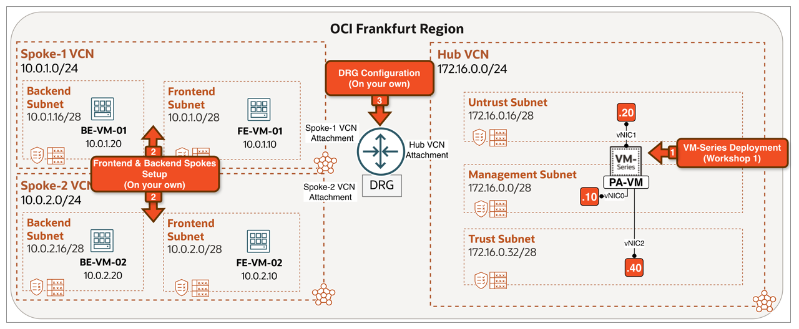

<!-- -->

1. Complete [Deploy Palo Alto NGFW in OCI (Standalone)](https://livelabs.oracle.com/ords/dbpm/r/livelabs/view-workshop?wid=4487). This workshop deploys the baseline Palo Alto VM-Series firewall in OCI Frankfurt, including the Hub VCN, subnets, and base firewall configuration.

2. Provision two Spoke VCNs with Oracle Linux 9 VMs (or use an existing workload or application in your environment):

    | VCN | VCN CIDR | Subnet | VM |
    | --- | --- | --- | --- |
    | Spoke-1 | `10.0.1.0/24` | Frontend `10.0.1.0/28` | FE-VM-01 `10.0.1.10` |
    |  |  | Backend `10.0.1.16/28` | BE-VM-01 `10.0.1.20` |
    | Spoke-2 | `10.0.2.0/24` | Frontend `10.0.2.0/28` | FE-VM-02 `10.0.2.10` |
    |  |  | Backend `10.0.2.16/28` | BE-VM-02 `10.0.2.20` |

3. Attach the Hub, Spoke-1, and Spoke-2 VCNs to the DRG. Then, assign the DRG and VCN route tables according to the table below:

| Attachment             | DRG Route Table | VCN Route Table |
| ---------------------- | --------------- | --------------- |
| Hub VCN Attachment     | rt-hub          | rt-drg-ingress  |
| Spoke-1 VCN Attachment | rt-spoke        | -               |
| Spoke-2 VCN Attachment | rt-spoke        | -               |

A **VCN Route Table** is assigned to a DRG attachment (also called an **Ingress** or **Transit Route Table**) when traffic entering the Hub VCN through the DRG needs to be steered to a destination other than what the VCN's local routing would pick. In this scenario, it steers traffic from the DRG to the Palo Alto Trust interface for inspection instead of allowing local VCN routing to bypass the firewall. The same principle applies to other gateways (IGW, SGW, NAT GW): you assign an Ingress Route Table to them when the default VCN routing is not what you want.

## Task 1: Review the Use Case

In this design, traffic between **two different spokes** is routed through the Palo Alto for inspection. **BE-VM-01** in Spoke-1 needs to reach **BE-VM-02** in Spoke-2. The DRG and Hub routing direct both the request and return traffic through the firewall, where security policy can be applied and validated.

### This is the right choice when:

- You need to inspect traffic and apply security policy between workloads in different VCNs.
- You need visibility and logging for inter-VCN east-west traffic.

### Traffic Flow:

1. **BE-VM-01** (`10.0.1.20`) initiates a connection to **BE-VM-02** (`10.0.2.20`). The Spoke-1 Backend Subnet route table sends the Spoke-2 CIDR (`10.0.2.0/24`) to the **DRG**.
2. The DRG forwards the packet to the **Hub VCN attachment**, where `rt-drg-ingress` routes it to the **Palo Alto Trust** interface (`172.16.0.40`).
3. The Palo Alto inspects the packet and sends it out of its **Trust** interface. The Hub **`rt-trust`** route table routes the Spoke-2 CIDR to the **DRG**.
4. The DRG forwards the packet through the **Spoke-2 VCN Attachment** to the Backend Subnet, where **BE-VM-02** receives it.
5. Return traffic follows the same path in reverse: Spoke-2 Backend Subnet sends the Spoke-1 CIDR (`10.0.1.0/24`) to the DRG, through the Hub and Palo Alto, and back to **BE-VM-01**. This keeps the flow symmetric.

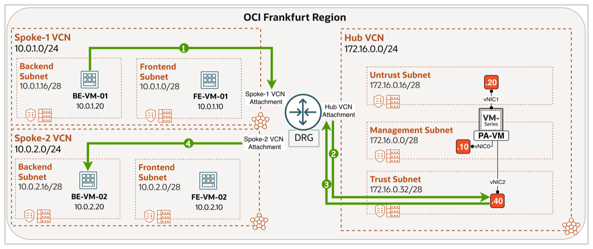

## Task 2: Configure Routing

The diagram below summarises the routing plan for Lab 8.

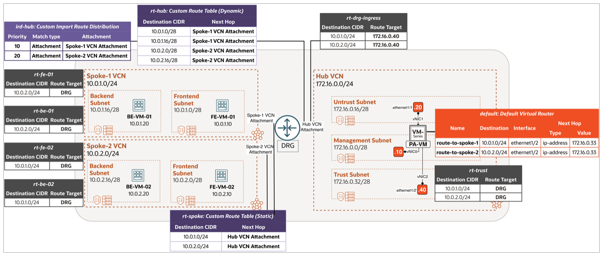

> **Note:** Routing has three parts: OCI VCN route tables control traffic leaving each subnet, OCI DRG route tables control traffic between attachments, and the Palo Alto virtual router controls forwarding through the firewall.

#### Step 1: Open the Hub VCN Routing view

1. Select the correct **region**.
2. Click on the **hamburger menu** in the top left corner.

    

<!-- -->

1. Click on **Networking**.
2. Click on **Virtual cloud networks**.

    

- Click on the **Hub VCN**.

    

- Click on the **Routing** tab.

    

#### Step 2: Configure `rt-drg-ingress` (Hub VCN - DRG attachment ingress route table)

The lab's `rt-drg-ingress` routes both spoke CIDRs to the Palo Alto Trust interface (`172.16.0.40`) so traffic between Spoke-1 and Spoke-2 VCNs is inspected. The `10.0.1.0/24` rule supports Spoke-1-to-Spoke-2 traffic, and the `10.0.2.0/24` rule supports Spoke-2-to-Spoke-1 traffic.

- Click on the route table **rt-drg-ingress**.

    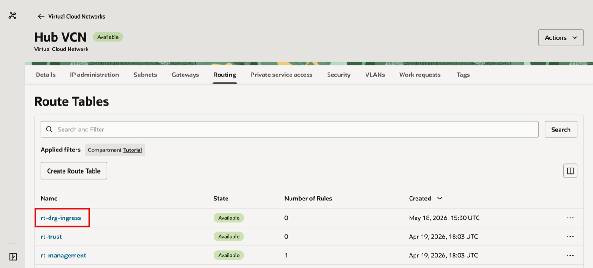

<!-- -->

1. Click on the **Route Rules** tab.
2. Add the two route rules `10.0.1.0/24 → 172.16.0.40` and `10.0.2.0/24 → 172.16.0.40` (target type **Private IP**).
3. Click the back arrow to return to the Hub VCN route tables list.

    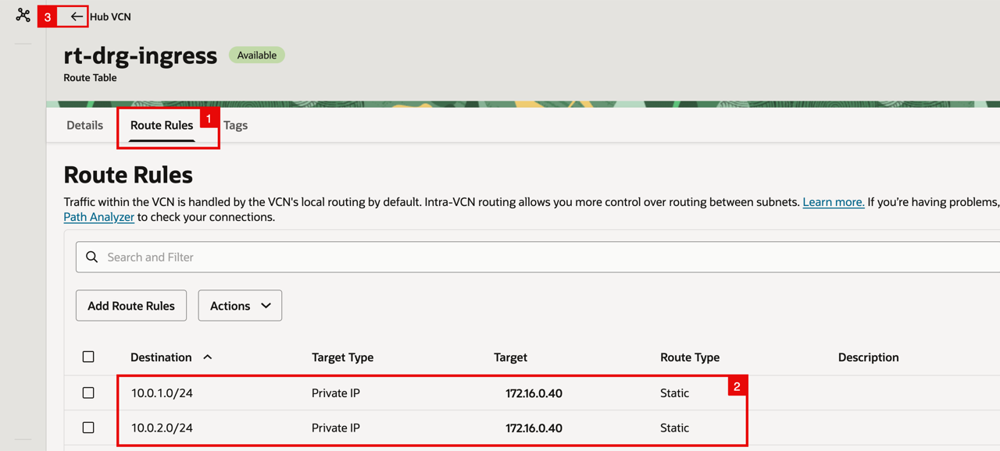

#### Step 3: Configure `rt-trust` (Hub VCN - Trust subnet route table)

The Trust subnet route table sends both spoke CIDRs back to the DRG so the Palo Alto can route return packets to the correct spoke after inspecting them.

- Click on the route table **rt-trust**.

    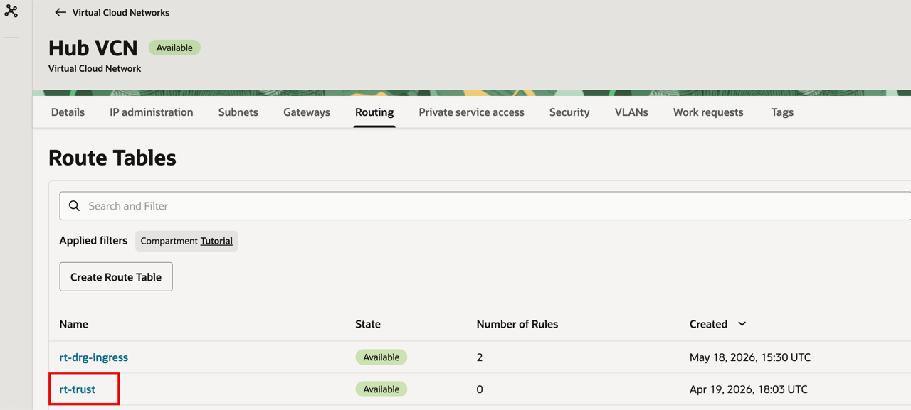

<!-- -->

1. Click on the **Route Rules** tab.
2. Add the two route rules `10.0.1.0/24 → DRG` and `10.0.2.0/24 → DRG`.
3. Click the back arrow to return to the Hub VCN route tables list.

    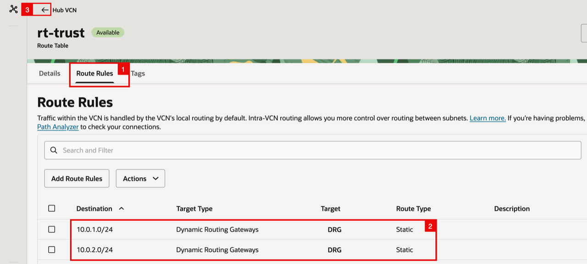

<!-- -->

1. Notice that `rt-drg-ingress` and `rt-trust` each have two rules.
2. Click the back arrow to return to the **Virtual cloud networks** list.

    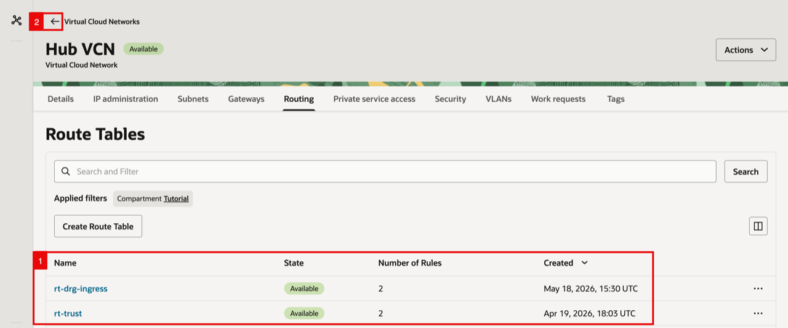

#### Step 4: Configure Spoke subnet route tables (`rt-fe-01`, `rt-be-01`, `rt-fe-02`, `rt-be-02`)

Each spoke must send the **other spoke's CIDR** to the DRG so the cross-spoke flow is forced into the Hub and inspected by the firewall. In this lab, both the Frontend and Backend subnets on each spoke get the rule so any VM in either spoke can reach the other spoke.

- Click on **Spoke-1 VCN**.

    

- Click on the **Routing** tab.

    

- Click on the route table **rt-fe-01**. 

    

<!-- -->

1. Click on the **Route Rules** tab.
2. Add the route rule `10.0.2.0/24 → DRG`. 
3. Click the back arrow to return to the Spoke-1 Routing tab.

    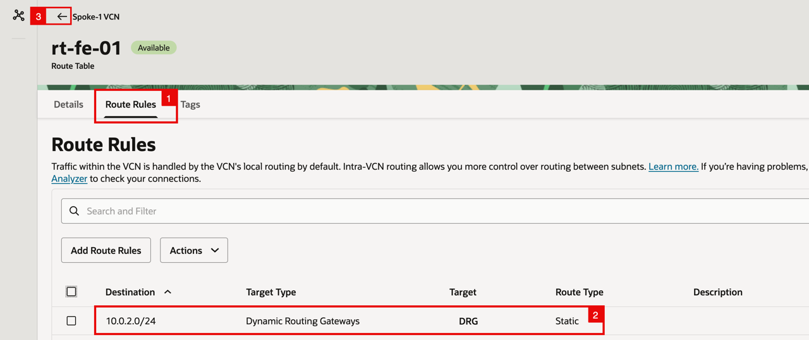

- Back on the Spoke-1 **Routing** tab, click on the route table **rt-be-01**.

    

<!-- -->

1. Click on the **Route Rules** tab.
2. Add the route rule `10.0.2.0/24 → DRG`. 
3. Click the back arrow to return to the Spoke-1 Routing tab.

    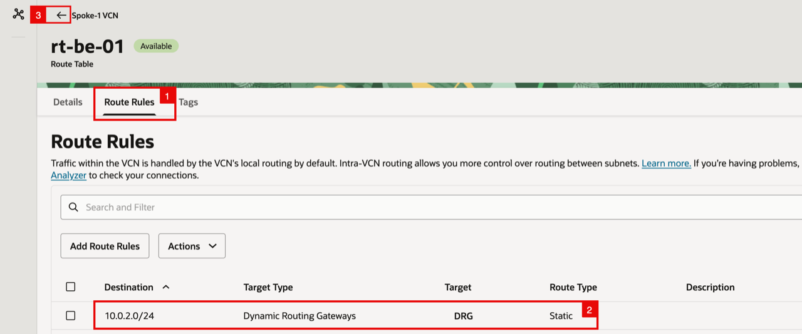

<!-- -->

1. Notice that both `rt-fe-01` and `rt-be-01` now have one rule.
2. Click the back arrow to return to the **Virtual cloud networks** list.

    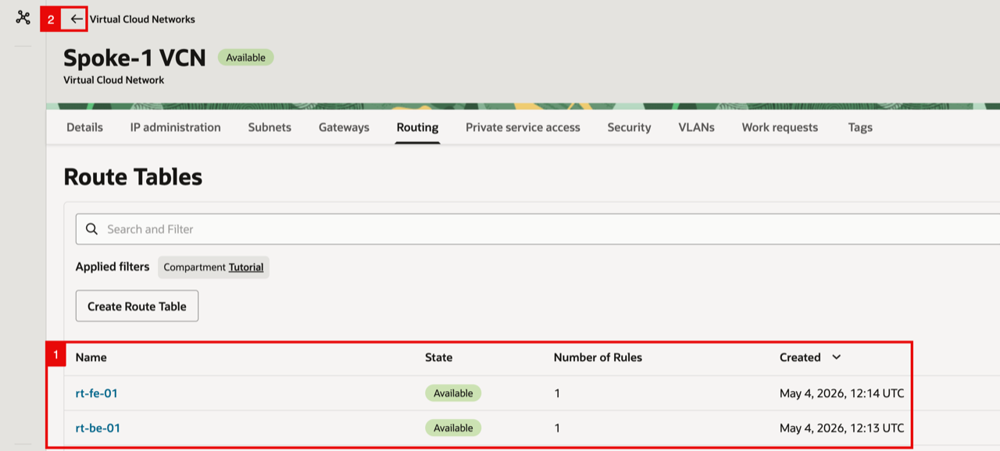

- Click on **Spoke-2 VCN**.

    

- Click on the **Routing** tab.

    

- Click on the route table **rt-fe-02**. 

    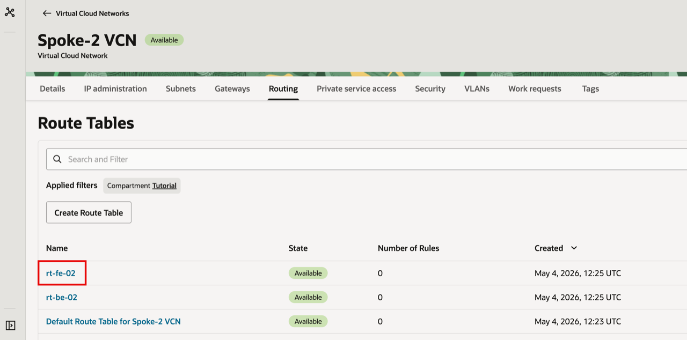

<!-- -->

1. Click on the **Route Rules** tab.
2. Add the route rule `10.0.1.0/24 → DRG`. 
3. Click the back arrow to return to the Spoke-2 Routing tab.

    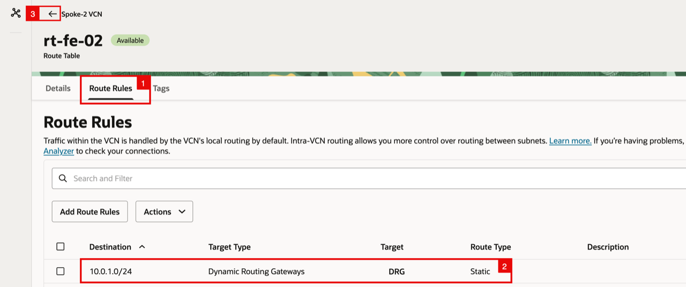

- Back on the Spoke-2 **Routing** tab, click on the route table **rt-be-02**.

    

<!-- -->

1. Click on the **Route Rules** tab.
2. Add the route rule `10.0.1.0/24 → DRG`. 
3. Click the back arrow to return to the Spoke-2 Routing tab.

    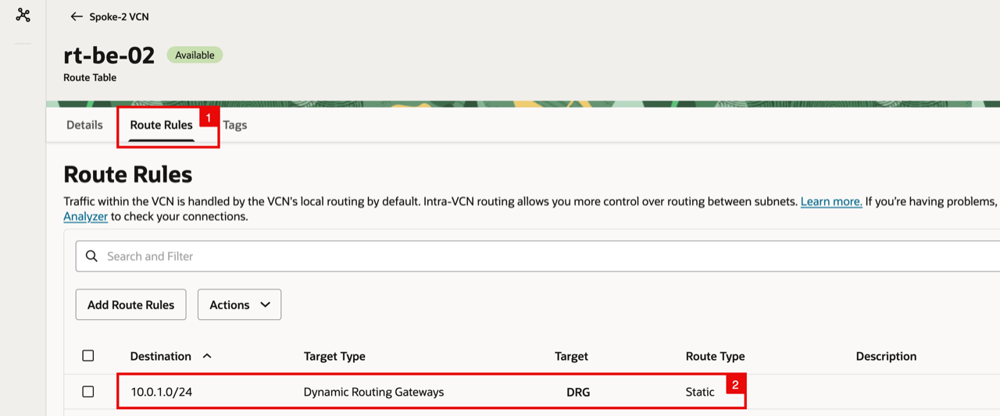

#### Step 5: Configure DRG route tables (`ird-hub`, `rt-hub`, `rt-spoke`)

The DRG holds two route tables: **`rt-hub`** (used by the Hub VCN attachment) and **`rt-spoke`** (used by the Spoke VCN attachment). `rt-hub` is populated dynamically from an **Import Route Distribution** (`ird-hub`), so it always reflects the current set of spokes without manual updates. `rt-spoke` carries static routes back to the Hub VCN attachment for cross-spoke traffic.

1. Click on the **hamburger menu**.
2. Click on **Networking**.
3. Click on **Dynamic routing gateway**.

    

- Click on the **DRG**.

    

- Click on the **Attachments** tab.

    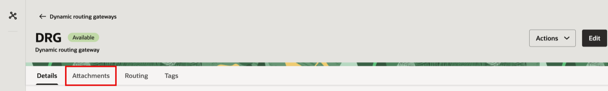

<!-- -->

1. Make sure you are in the VCN attachments section.
2. Notice the **VCN attachments** table: the **Hub VCN Attachment** uses DRG route table `rt-hub`; the **Spoke-1 VCN Attachment** and **Spoke-2 VCN Attachment** use `rt-spoke`.

    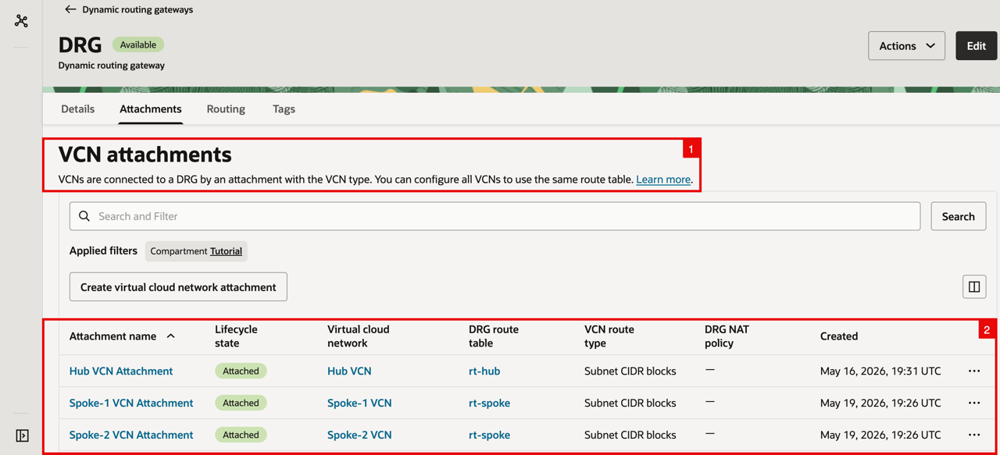

- Click on the **rt-hub** link in the **DRG route table** column for the **Hub VCN Attachment**.

    

- On the **rt-hub** Details page, click on the **ird-hub** link in the **Import route distribution** field.

    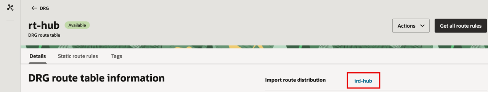

- Click on the **Statements** tab.

    

<!-- -->

1. Confirm two statements: priority `10` Spoke-1 VCN Attachment and priority `20` Spoke-2 VCN Attachment. You can instead use match type **Attachment type** and select **Virtual Cloud Network** to import future spokes automatically.
2. Click the back arrow to return to the DRG.

    

- On the DRG, click on the **Routing** tab and notice both `rt-hub` and `rt-spoke` are present. Click on the route table **rt-hub**.

    

- On the **rt-hub** Details page, click on the **Get all route rules** button to view the dynamic routes learned via `ird-hub`.

    

<!-- -->

1. Notice the **four DYNAMIC entries**: 
    - `10.0.1.0/28` and `10.0.1.16/28` (Spoke-1 FE/BE subnets) via **Spoke-1 VCN Attachment**.
    - `10.0.2.0/28` and `10.0.2.16/28` (Spoke-2 FE/BE subnets) via **Spoke-2 VCN Attachment**. 
2. Click **Close**.

    

- Click the back arrow to return to the DRG.

    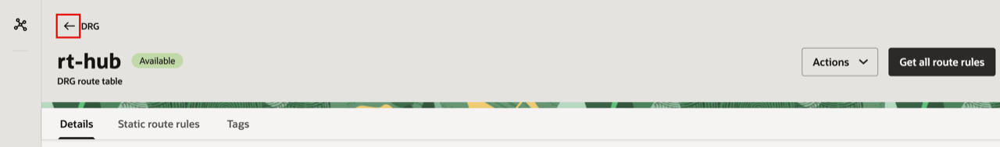

- Click on the route table **rt-spoke**.

    

<!-- -->

1. Notice the **rt-spoke** Details page: **Import route distribution** is `-` (no dynamic routing).
2. Click on the **Static route rules** tab.

    

- Notice the **two static routes** in `rt-spoke`: `10.0.1.0/24 → Hub VCN Attachment` and `10.0.2.0/24 → Hub VCN Attachment`. The `10.0.1.0/24` route sends Spoke-2-to-Spoke-1 traffic through the Hub for firewall inspection. The `10.0.2.0/24` route does the same for Spoke-1-to-Spoke-2 traffic.

    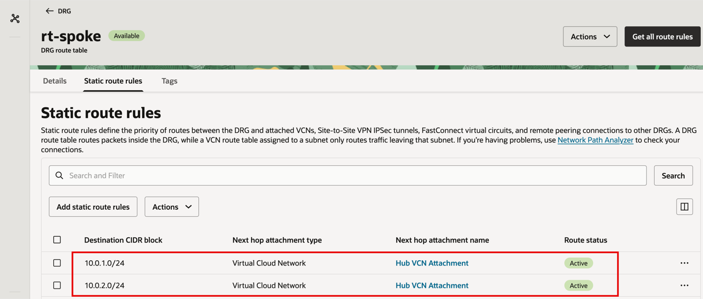

#### Step 6: Configure Palo Alto VR static routes

The OCI DRG and VCN route tables deliver traffic to the correct Palo Alto interface, but the firewall's default Virtual Router still needs static routes to forward each destination CIDR. The next-hop address used below, `172.16.0.33`, is the OCI **default gateway** for the Trust subnet. For Lab 8 the firewall needs:

- `10.0.1.0/24` — `ethernet1/2`, next hop `172.16.0.33`
- `10.0.2.0/24` — `ethernet1/2`, next hop `172.16.0.33`

Open the Palo Alto Web GUI, then:

1. Sign in to the Palo Alto Web GUI, then click on the **Network** tab.
2. Click on **Virtual Routers**.
3. Click on the **default** virtual router.

    

- In the **Virtual Router - default** dialog, click on **Static Routes** in the left-hand menu.

    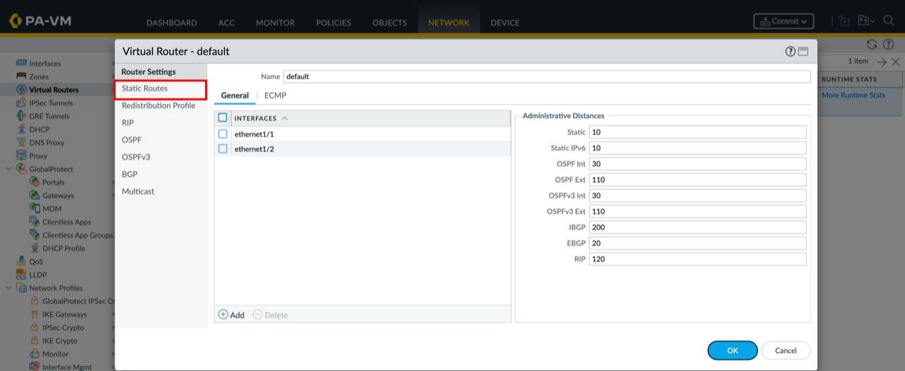

<!-- -->

1. On the **IPv4** sub-tab, click **Add** and create the required routes for this scenario:

    - `route-to-spoke-1` (Destination `10.0.1.0/24`, Interface `ethernet1/2`, Next Hop `172.16.0.33`)
    - `route-to-spoke-2` (Destination `10.0.2.0/24`, Interface `ethernet1/2`, Next Hop `172.16.0.33`)

2. Click on the **OK** button to save the Virtual Router configuration.

    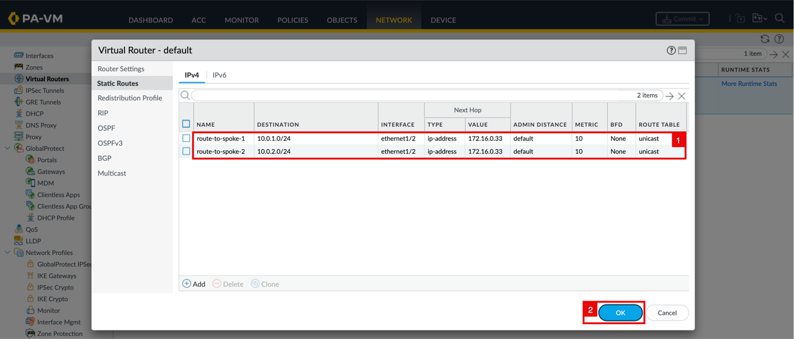

#### Step 7: Commit the Palo Alto configuration

- Notice that the **default** Virtual Router now shows **Static Routes: 2**. Click on the **Commit** button at the top right.

    

<!-- -->

1. Select **Commit All Changes**.
2. In the **Commit** dialog, click the **Commit** button to confirm.

    

- The **Commit Status** dialog shows the operation as **Pending** while the configuration is applied.

    

- Notice the **Commit Status** shows **Completed** and **Successful**.

    

## Task 3: Test and Validate

- From **BE-VM-01**, `ssh` or `ping` **BE-VM-02** (`10.0.2.20`). The session works.

    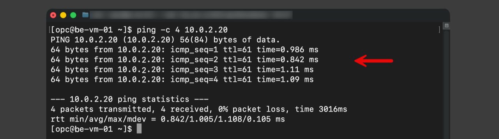

- The firewall logs the session end-to-end.

1. Open the Palo Alto **Monitor**.
2. Click on **Traffic** log.
3. Notice the matching session: source = `10.0.1.20`, destination = `10.0.2.20`, source zone = **trust**, destination zone = **trust**. Confirms the inter-VCN traffic was forced through the firewall.

    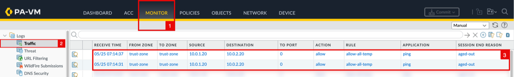

## Learn More

- [OCI VCN Route Tables](https://docs.oracle.com/en-us/iaas/Content/Network/Tasks/managingroutetables.htm)
- [OCI Dynamic Routing Gateway (DRG)](https://docs.oracle.com/en-us/iaas/Content/Network/Tasks/managingDRGs.htm)
- [Palo Alto Static Routes](https://docs.paloaltonetworks.com/ngfw/networking/static-routes)
- [Palo Alto View and Manage Logs](https://docs.paloaltonetworks.com/ngfw/administration/monitoring/view-and-manage-logs)

## Acknowledgements

- **Authors** - Anas Abdallah, Iwan Hoogendoorn (Cloud Networking Black Belts)
- **Contributor** - Antonio Gámir (Cloud Networking Black Belt)
- **Last Updated By/Date** - Anas Abdallah, October 2026

You may now **proceed to the next lab**.
