# Configure Public Application Access - Palo Alto Firewall First

## Introduction

In this lab, you publish an application through the Palo Alto firewall pair before it reaches a private Application Load Balancer. You configure the routing and destination NAT needed to keep inbound application traffic inspected and symmetric.

Estimated Time: 30 minutes

### Objectives

In this lab, you will:

- Review the firewall-first application publishing design, in which the reserved public IP associated with the floating Palo Alto Untrust address fronts a Private ALB.
- Verify the OCI VCN and DRG routes, and configure the required Palo Alto virtual-router static routes.
- Configure a combined SNAT and DNAT rule to publish the Private ALB through the Palo Alto firewall pair.
- Validate application access, NAT translation, and symmetric sessions in Palo Alto Traffic logs.

### Prerequisites

Before following the routing steps below, complete the items that are out of scope for this workshop. They are not part of the routing configuration itself, but they have to exist before any of the routes you are about to create are useful.

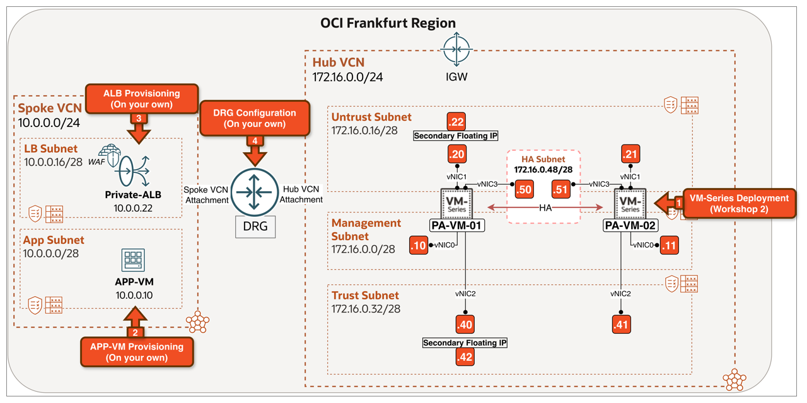

<!-- -->

1. Complete [Deploy Palo Alto NGFW in OCI with Active/Passive HA](https://livelabs.oracle.com/ords/dbpm/r/livelabs/view-workshop?wid=4492). This workshop deploys the baseline Active/Passive Palo Alto VM-Series pair in OCI Frankfurt, including the Hub VCN, subnets, Internet Gateway, and base firewall configuration.

2. Provision the APP-VM in the Spoke VCN (or use an existing workload or application in your environment):
    - Create a **Spoke VCN** `10.0.0.0/24` with an **App Subnet** `10.0.0.0/28`.
    - Deploy an **APP-VM** in the App Subnet with private IP `10.0.0.10`, running **Oracle Linux 9**.
    - Install and configure NGINX on the APP-VM using the script below.


```bash
<copy>
# Install Nginx
sudo dnf install -y nginx

# Enable and start Nginx
sudo systemctl enable --now nginx

# Open firewall ports (firewalld is enabled by default on OL9)
sudo firewall-cmd --permanent --add-service=http
sudo firewall-cmd --reload

# Create the APP-VM page
sudo tee /usr/share/nginx/html/index.html &gt; /dev/null &lt;&lt;'EOF'
&lt;!DOCTYPE html&gt;
&lt;html&gt;
&lt;head&gt;
    &lt;title&gt;APP-VM&lt;/title&gt;
    &lt;style&gt;
        body { font-family: Arial, sans-serif; text-align: center; padding: 50px; background: #1e3a5f; color: white; }
        h1 { font-size: 48px; }
        .info { background: rgba(255,255,255,0.1); padding: 20px; border-radius: 10px; display: inline-block; margin-top: 20px; }
        .label { color: #88c0d0; font-weight: bold; }
    &lt;/style&gt;
&lt;/head&gt;
&lt;body&gt;
    &lt;h1&gt;This is the APP VM&lt;/h1&gt;
    &lt;div class="info"&gt;
        &lt;p&gt;&lt;span class="label"&gt;Source IP of request:&lt;/span&gt; &lt;!--# echo var="remote_addr" --&gt;&lt;/p&gt;
    &lt;/div&gt;
&lt;/body&gt;
&lt;/html&gt;
EOF

# Configure Nginx with SSI enabled
sudo tee /etc/nginx/conf.d/default.conf &gt; /dev/null &lt;&lt;'EOF'
server {
    listen 80 default_server;
    listen [::]:80 default_server;
    server_name _;
    root /usr/share/nginx/html;

    location / {
        ssi on;
        index index.html;
    }
}
EOF

# Restart Nginx
sudo systemctl restart nginx
</copy>
```

The script installs and enables NGINX, opens TCP/80 on the OL9 firewalld, drops in a simple HTML page that displays the source IP of the incoming request using NGINX's Server-Side Includes (SSI), and reloads NGINX so the new config takes effect. The page is used in **Task 3: Test & Validate** to confirm which IP the application actually sees as the source.


3. Provision a **Private Application Load Balancer** in the Spoke VCN with the following settings:

    - Subnet: LB Subnet (Private).
    - Private IP is 10.0.0.22
    - Load balancing policy: Weighted round robin.
    - Listener: listener-http (HTTP/80)
    - Backend set: be-set-app (APP-VM as backend listening on port 80).
    - Health check policy: HTTP/80
    - WAF: Assign a policy if ready.

    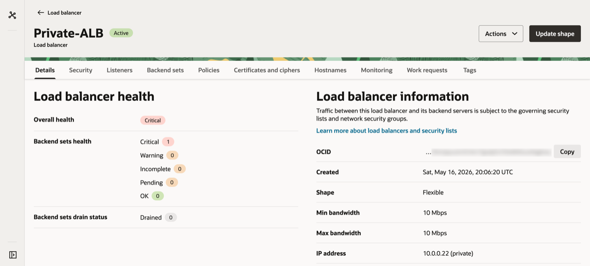

4. Attach the Hub VCN and Spoke VCN to the DRG. Then, assign the DRG and VCN route tables according to the table below:

| Attachment           | DRG Route Table | VCN Route Table |
| -------------------- | --------------- | --------------- |
| Hub VCN Attachment   | rt-hub          | -               |
| Spoke VCN Attachment | rt-spoke        | -               |


In this lab, **no Ingress Route Table is needed on the Hub VCN attachment**, because the active firewall SNATs the source to its floating Trust IP. The return traffic from the Private ALB naturally comes back through the firewall pair without any DRG-level rewriting (transit RT).

## Task 1: Review the Use Case

In this design, the **Active/Passive Palo Alto pair sits at the edge** with the reserved public IP associated with floating Untrust IP `172.16.0.22` as the front door. The active firewall forwards the inbound connection (after L4-L7 inspection) to a **Private Application Load Balancer (ALB)** in the spoke VCN. It performs both **Destination NAT** (rewriting the destination from the Untrust public IP to the Private ALB IP) and **Source NAT** (rewriting the source from the original client to floating Trust IP `172.16.0.42`), so the reply comes back to the active firewall instead of being asymmetric.

### This is the right choice when:

- You want the NGFW to inspect traffic before any load balancing decision is made.
- You want multiple applications behind a single firewall public IP, distinguished by destination port and DNAT-rewritten to different private ALBs in different spokes.
- You want a single public attack surface (the firewall pair) instead of one public IP per ALB.
- You do not need the OCI-native WAF at the edge (the NGFW provides threat prevention, URL filtering, etc.) and the WAF needs to be applied behind the firewall pair on the Private ALB.

### Traffic Flow:

1. The end user sends a request to the reserved public IP associated with floating Untrust IP `172.16.0.22`.
2. Traffic enters the Hub VCN through the IGW and arrives at the Palo Alto Untrust interface.
3. The active firewall inspects the request and applies a NAT rule: DNAT rewrites the destination from the Untrust public IP to the Private ALB IP (`10.0.0.22`), and SNAT rewrites the source from the end user's public IP to the floating Trust IP (`172.16.0.42`). The active firewall then sends the request out of the Trust interface towards the DRG (hub attachment).
4. The DRG sends the request to Private-ALB in the Spoke VCN.
5. The Private ALB applies its policy (and any WAF if configured), selects a backend, and forwards the request to the APP-VM (`10.0.0.10`).
6. The APP-VM replies. Because the source was SNAT'd to the active firewall's floating Trust IP, the reply naturally returns to the active firewall (no `rt-drg-ingress` needed). The active firewall reverses the NAT and sends the reply back to the original end user through the IGW.

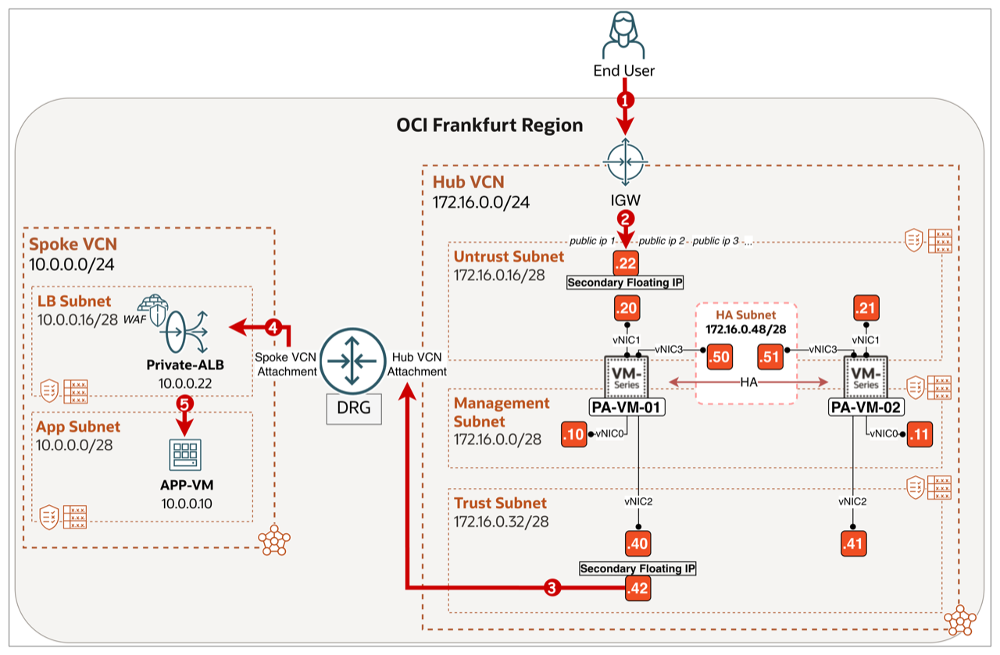

## Task 2: Configure Routing

The diagram below summarises the routing plan for Lab 2.

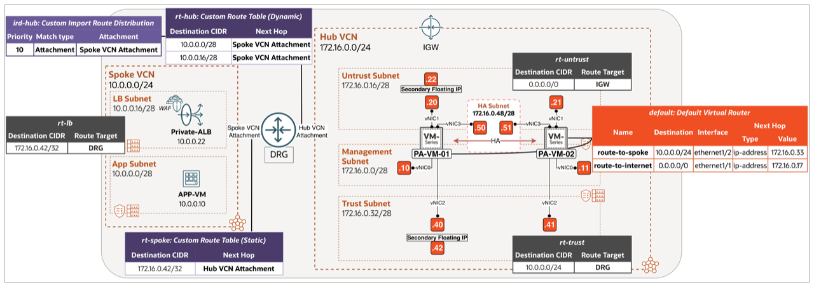

> **Note:** Routing has three parts: OCI VCN route tables control traffic leaving each subnet, OCI DRG route tables control traffic between attachments, and the active Palo Alto virtual router controls forwarding through the firewall pair.

#### Step 1: Open the Hub VCN Routing view

1. Select the correct **region**.
2. Click on the **hamburger menu** in the top left corner.

    

<!-- -->

1. Click on **Networking**.
2. Click on **Virtual cloud networks**.

    

- Click on the **Hub VCN**.

    

- Click on the **Routing** tab.

    

#### Step 2: Configure `rt-untrust` (Hub VCN - Untrust subnet route table)

Configure `0.0.0.0/0 → IGW` in the Untrust subnet route table so the active firewall's Untrust interface can reach the Internet for inbound and outbound flows.

- Click on the route table **rt-untrust**.

    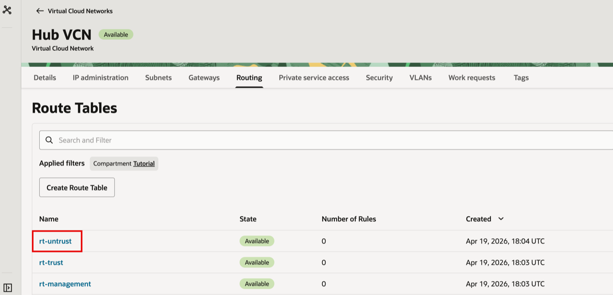

<!-- -->

1. Click on the **Route Rules** tab.
2. Add the route rule `0.0.0.0/0 → IGW`.
3. Click the back arrow to return to the Hub VCN route tables list.

    

#### Step 3: Configure `rt-trust` (Hub VCN - Trust subnet route table)

The Trust subnet route table sends Spoke VCN traffic (`10.0.0.0/24`) to the DRG so packets leaving the Palo Alto Trust interface can reach the Private ALB.

- Click on the route table **rt-trust**.

    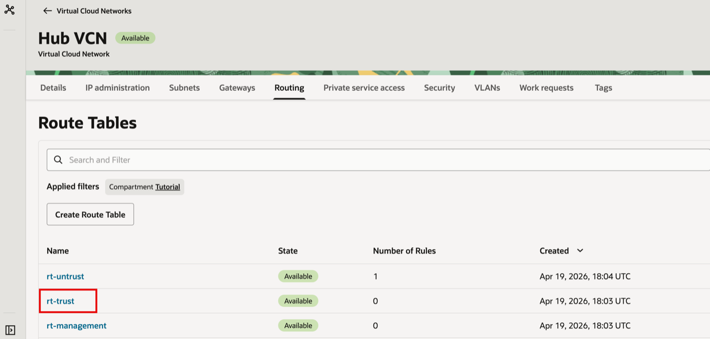

<!-- -->

1. Click on the **Route Rules** tab.
2. Add the route rule `10.0.0.0/24 → DRG`.
3. Click the back arrow to return to the Hub VCN route tables list.

    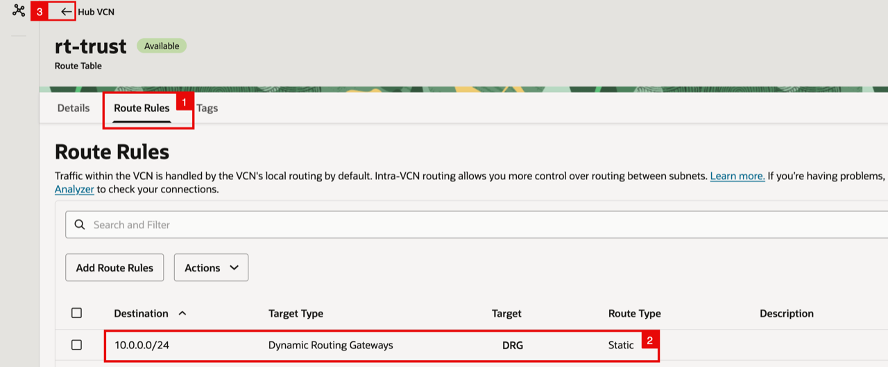

<!-- -->

1. Notice that `rt-untrust` and `rt-trust` each have one rule, while `rt-management` has none.
2. Click the back arrow to return to the **Virtual cloud networks** list.

    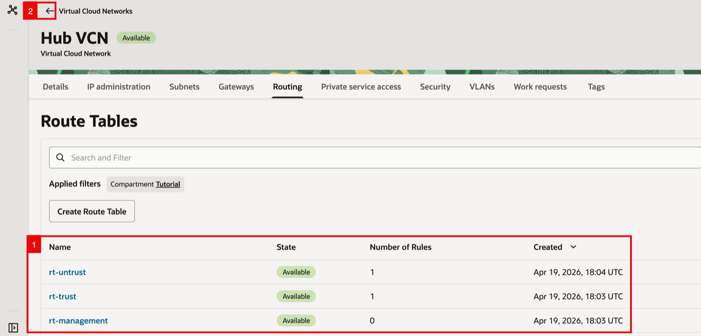

#### Step 4: Configure `rt-lb` (Spoke VCN - LB Subnet route table)

The Private ALB sits in the Spoke LB Subnet. Its route table sends return traffic destined for the **floating Trust IP** (`172.16.0.42/32`) to the DRG, so the active firewall receives the reply on its Trust zone.

- Click on the **Spoke VCN**.

    

- Click on the **Routing** tab.

    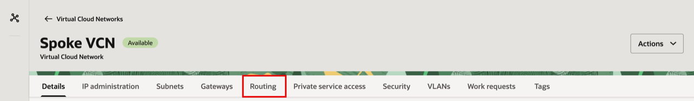

- Click on the route table **rt-lb**.

    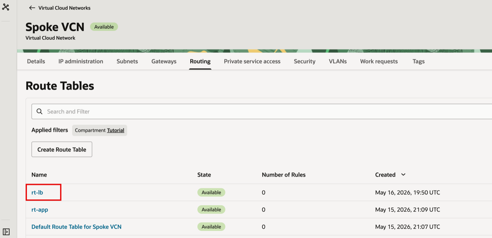

<!-- -->

1. Click the **Route Rules** tab.
2. Add the route rule `172.16.0.42/32 → DRG` for the Palo Alto Trust floating IP.

    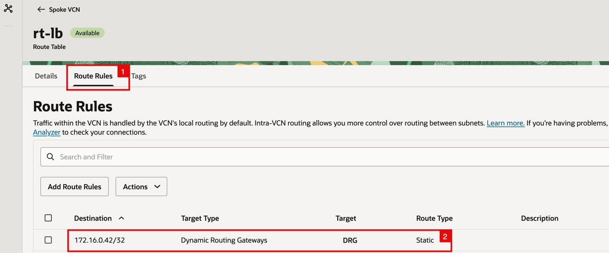

#### Step 5: Configure DRG route tables (`ird-hub`, `rt-hub`, `rt-spoke`)

The DRG holds two route tables: **`rt-hub`** (used by the Hub VCN attachment) and **`rt-spoke`** (used by the Spoke VCN attachment). `rt-hub` is populated dynamically from an **Import Route Distribution** (`ird-hub`), so it always reflects the current set of spokes without manual updates. `rt-spoke` carries a static route back to the Hub VCN attachment for the Palo Alto Trust floating IP return path.

1. Click on the **hamburger menu**.
2. Click on **Networking**.
3. Click on **Dynamic routing gateway**.

    

- Click on the **DRG** that is already deployed.

    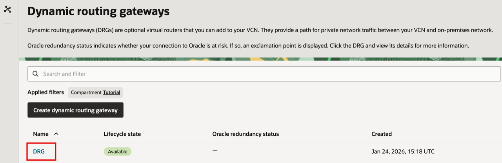

- Click on the **Attachments** tab.

    

<!-- -->

1. Make sure you are in the VCN attachments section.
2. Notice the **VCN attachments** table: the **Hub VCN Attachment** uses DRG route table `rt-hub` and the **Spoke VCN Attachment** uses `rt-spoke`.

    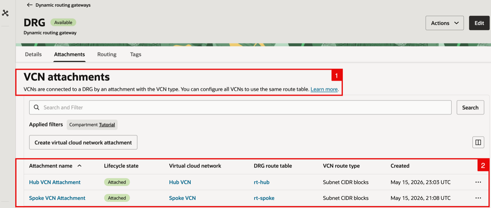

- Click on the **rt-hub** link in the **DRG route table** column for the **Hub VCN Attachment**.

    

- On the **rt-hub** Details page, click on the **ird-hub** link in the **Import route distribution** field.

    

- Click on the **Statements** tab.

    

<!-- -->

1. Notice the single statement in `ird-hub`: priority `10`, match type **Attachment**, match criteria **Spoke VCN Attachment**. You can instead use match type **Attachment type** and select **Virtual Cloud Network** to import future spokes automatically.
2. Click the back arrow to return to the DRG.

    

- Click on the route table **rt-hub**.

    

- On the **rt-hub** Details page, click on the **Get all route rules** button to view the dynamic routes learned via `ird-hub`. 

    

<!-- -->

1. Notice the **DYNAMIC** entries, both learned via the `ird-hub` import distribution:
   - Destination `10.0.0.0/28` (the Spoke's App Subnet CIDR), next hop **Virtual Cloud Network → Spoke VCN Attachment**.
   - Destination `10.0.0.16/28` (the Spoke's LB Subnet CIDR), next hop **Virtual Cloud Network → Spoke VCN Attachment**.
2. Click on the **Close** button.

    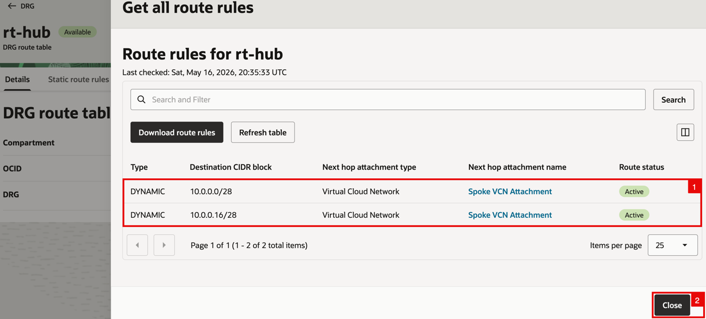

- Click the back arrow to return to the DRG route tables list.

    

- Click on the route table **rt-spoke**.

    

<!-- -->

1. Notice the **rt-spoke** Details page: **Import route distribution** is `-` (no dynamic routing).
2. Click on the **Static route rules** tab.

    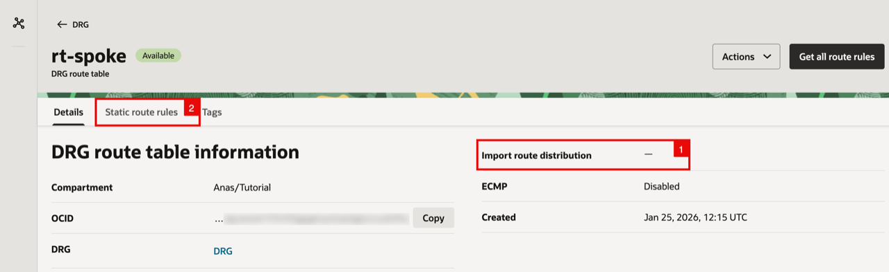

- Notice the single static route in `rt-spoke`: `172.16.0.42/32 → Hub VCN Attachment`. This carries return traffic destined for the Palo Alto Trust floating IP back to the Hub VCN for firewall inspection.

    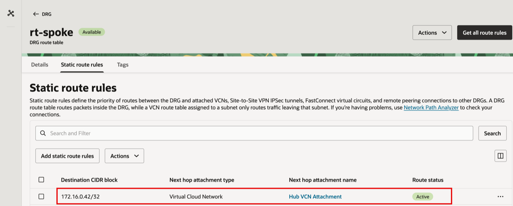

#### Step 6: Configure Palo Alto VR static routes

The OCI DRG and VCN route tables deliver traffic to the correct Palo Alto interface, but the active firewall's default Virtual Router still needs static routes to forward each destination CIDR. The next-hop addresses used below are the OCI **default gateways** for the firewall subnets: `172.16.0.33` for the Trust subnet and `172.16.0.17` for the Untrust subnet. For Lab 2 the active firewall needs:

- `10.0.0.0/24` — `ethernet1/2`, next hop `172.16.0.33`
- `0.0.0.0/0` — `ethernet1/1`, next hop `172.16.0.17`

Open the active firewall's management Web GUI, then:

1. Sign in to the active firewall's Web GUI, then click on the **Network** tab.
2. Click on **Virtual Routers**.
3. Click on the **default** virtual router.

    

- In the **Virtual Router - default** dialog, click on **Static Routes** in the left-hand menu.

    

Make sure this is configured:
- On the **IPv4** sub-tab, click **Add** and create the first route `route-to-spoke` (Destination `10.0.0.0/24`, Interface `ethernet1/2`, Next Hop **IP Address** `172.16.0.33`).
- Click **Add** again and create the second route `route-to-internet` (Destination `0.0.0.0/0`, Interface `ethernet1/1`, Next Hop **IP Address** `172.16.0.17`).

1. Notice both routes are listed in the IPv4 table.
2. Click on the **OK** button to save the Virtual Router configuration.

    

#### Step 7: Commit the Palo Alto configuration

- Notice that the **default** Virtual Router now shows **Static Routes: 2**. Click on the **Commit** button at the top right.

    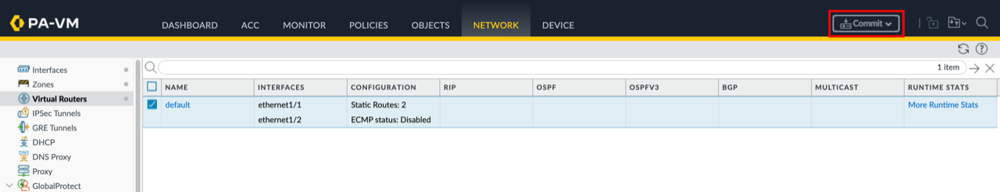

<!-- -->

1. Select **Commit All Changes**.
2. In the **Commit** dialog, click the **Commit** button to confirm.

    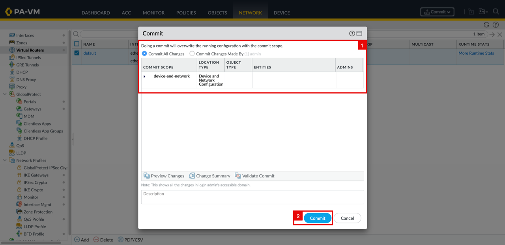

- The **Commit Status** dialog shows the operation as **Pending** while the configuration is applied.

    

- Notice the **Commit Status** shows **Completed** and **Successful**.

    

## Task 3: Configure NAT

NAT is what makes this scenario work end-to-end:

- **Destination NAT (DNAT)** rewrites the destination from the reserved public IP associated with floating Untrust IP `172.16.0.22` to the **Private ALB IP** (`10.0.0.22`), so users on the Internet can reach a private resource through the Active/Passive pair.
- **Source NAT (SNAT)** rewrites the source from the original client public IP to the **floating Trust IP** (`172.16.0.42`), so the return traffic from the Private ALB comes back to the active firewall (which holds the session state) instead of going out somewhere else and creating an asymmetric flow.

    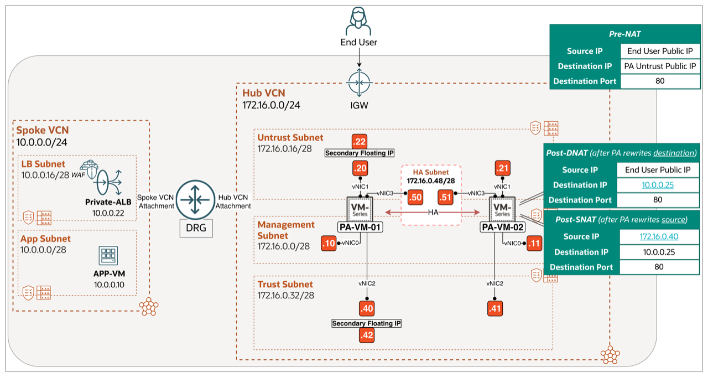

Both happen in a single NAT rule. Without SNAT specifically, the Private ALB would receive a packet with the original Internet source IP and try to reply directly out of the Spoke VCN through the DRG, which is exactly the asymmetric path you want to avoid. Open the active firewall's GUI:

1. Click on the **Policies** tab.
2. Click on **NAT** in the left-hand menu.

    

- Click on the **Add** button at the bottom to create a new NAT rule.

    

In the **NAT Policy Rule** dialog, configure the **General** tab:

1. Click on the **General** tab.
2. Specify a **Name** for the NAT rule (e.g. `NAT-Inbound-to-ALB`).
3. Add a **Description**.
4. Select **NAT Type** to be ipv4.
5. Click on the **Original Packet** tab.

    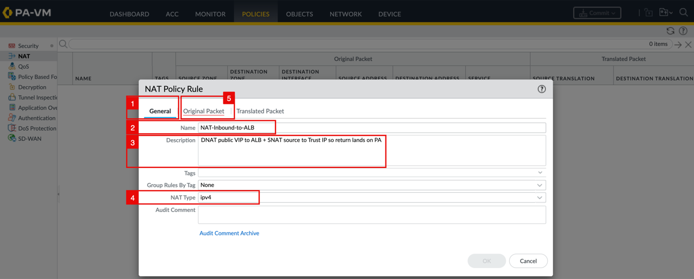

On the **Original Packet** tab (this is the **Pre-NAT** view - the packet fields as the active firewall first receives the packet):

1. Set the **Source Zone** to **untrust**.
2. Set the **Destination Zone** to **untrust**.
3. Set the **Destination Interface** to `ethernet1/1`.
4. Set the **Service** to service-http.
5. Click on "Any" for **Source Address**.
6. Add the Untrust floating IP `172.16.0.22` to **Destination Address**.
7. Click on the **Translated Packet** tab.

    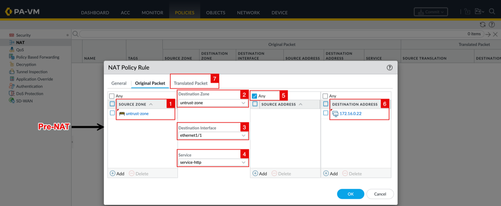

On the **Translated Packet** tab, configure the **SNAT** (Source Address Translation) and **DNAT** (Destination Address Translation)

1. Under **Source Address Translation**, set the **Translation Type** to **Dynamic IP And Port**.
2. Set **Address Type** to **Interface Address**.
3. Selecting `ethernet1/2` (Trust) .
4. So the source is SNAT'd to the Trust floating IP `172.16.0.42/32`.
5. Under **Destination Address Translation**, set the **Translation Type** to **Static IP**.
6. Set the **Translated Address** to `10.0.0.22` (the Private ALB IP).
7. Set the **Translated Port** to `80`.

    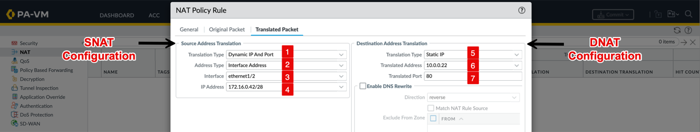

- Click on the **OK** button.

    

<!-- -->

1. Confirm that the new NAT rule appears in the list.
2. Click on **Commit**.

    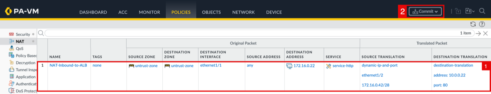

<!-- -->

1. Select **Commit All Changes**.
2. Click on the **Commit** button.

    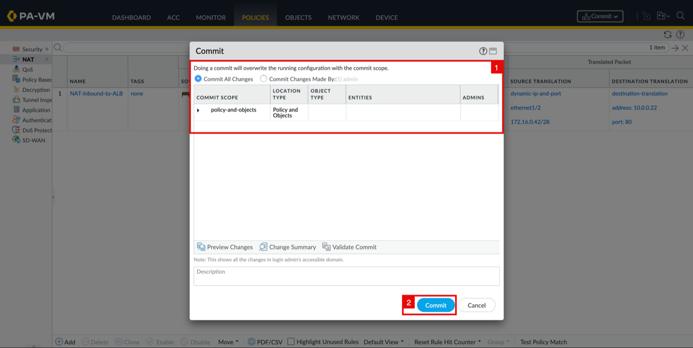

- Notice that the change is pushed.

    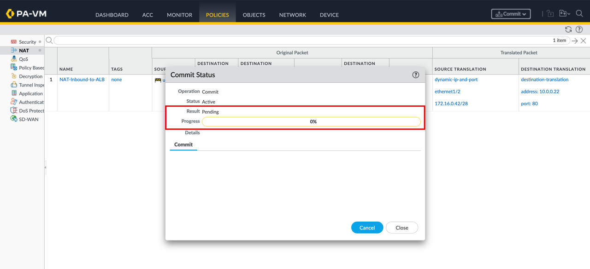

- Wait for the **Commit** to complete successfully.

    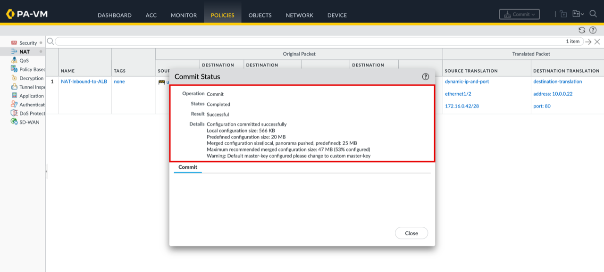

## Task 4: Test and Validate

- In the OCI Console, open the **Private-ALB** load balancer details. 

1. Notice the **Overall health** is **OK** and the 
2. **IP address** shows `10.0.0.22 (private)`. This is the IP that the active firewall's NAT rule rewrites the destination to.

    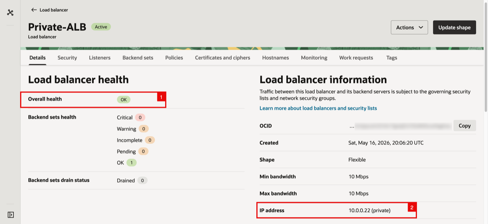

<!-- -->

1. From a browser on your local machine, enter the **reserved public IP associated with floating Untrust IP `172.16.0.22`** in the address bar.
2. Verify that the APP-VM web page loads. The OCI Console shows `10.0.0.22` as the Private ALB frontend IP, while **Source IP of request** on the APP-VM shows `10.0.0.21` in this lab. This is expected: the ALB uses a another private service IP when connecting to the backend, so the APP-VM sees the ALB rather than the original Internet client.

    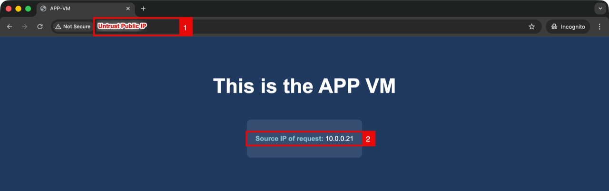

<!-- -->

1. On the active firewall, open **Monitor**.
2. Click on **Traffic**.
3. Verify the matching sessions:
   - **Source:** the original client public IP (for example, `176.29.230.40`).
   - **Destination:** `172.16.0.22` (Palo Alto Untrust floating IP).
   - **NAT Applied:** `yes`.
   - **NAT Source IP:** `172.16.0.42` (Trust floating IP; SNAT).
   - **NAT Destination IP:** `10.0.0.22` (Private ALB; DNAT).

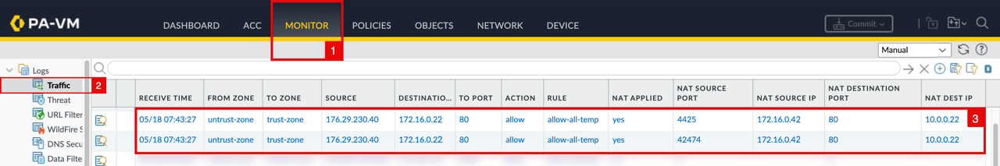

## Learn More

- [OCI Load Balancer Overview](https://docs.oracle.com/en-us/iaas/Content/Balance/)
- [OCI Web Application Firewall](https://docs.oracle.com/en-us/iaas/Content/WAF/)
- [OCI VCN Route Tables](https://docs.oracle.com/en-us/iaas/Content/Network/Tasks/managingroutetables.htm)
- [OCI Dynamic Routing Gateway (DRG)](https://docs.oracle.com/en-us/iaas/Content/Network/Tasks/managingDRGs.htm)
- [Palo Alto Static Routes](https://docs.paloaltonetworks.com/ngfw/networking/static-routes)
- [Palo Alto Source and Destination NAT Example](https://docs.paloaltonetworks.com/ngfw/networking/nat/source-and-destination-nat-example)
- [Palo Alto View and Manage Logs](https://docs.paloaltonetworks.com/ngfw/administration/monitoring/view-and-manage-logs)

## Acknowledgements

- **Authors** - Anas Abdallah, Iwan Hoogendoorn (Cloud Networking Black Belts)
- **Contributor** - Antonio Gámir (Cloud Networking Black Belt)
- **Last Updated By/Date** - Anas Abdallah, October 2026

You may now **proceed to the next lab**.
