# Configure Outbound Internet Access

## Introduction

In this lab, you route Internet-bound traffic from a spoke workload through the Palo Alto firewall pair. The active firewall applies centralized security policy and source NAT before traffic leaves OCI through its Untrust interface.

Estimated Time: 30 minutes

### Objectives

In this lab, you will:

- Configure the spoke and Hub VCN routing required to steer Internet-bound traffic through the Palo Alto firewall pair, entering through Trust and exiting through Untrust.
- Configure the Palo Alto virtual-router routes and source NAT policy for centralized Internet egress.
- Validate outbound connectivity from a spoke workload and confirm source NAT in Palo Alto Traffic logs.

### Prerequisites

Before following the routing steps below, complete the items that are out of scope for this workshop. They are not part of the routing configuration itself, but they have to exist before any of the routes you are about to create are useful.

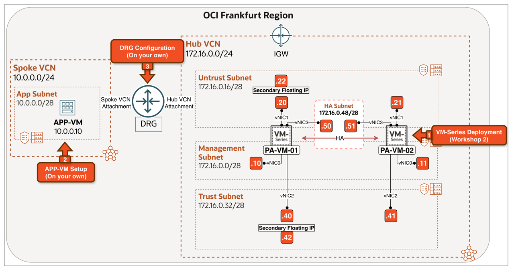

<!-- -->

1. Complete [Deploy Palo Alto NGFW in OCI with Active/Passive HA](https://livelabs.oracle.com/ords/dbpm/r/livelabs/view-workshop?wid=4492). This workshop deploys the baseline Active/Passive Palo Alto VM-Series pair in OCI Frankfurt, including the Hub VCN, subnets, Internet Gateway, and base firewall configuration.

2. Provision the APP-VM in the Spoke VCN (or use an existing workload or application in your environment):
    - Create a **Spoke VCN** `10.0.0.0/24` with an **App Subnet** `10.0.0.0/28`.
    - Deploy an **APP-VM** in the App Subnet with private IP `10.0.0.10`, running **Oracle Linux 9**.

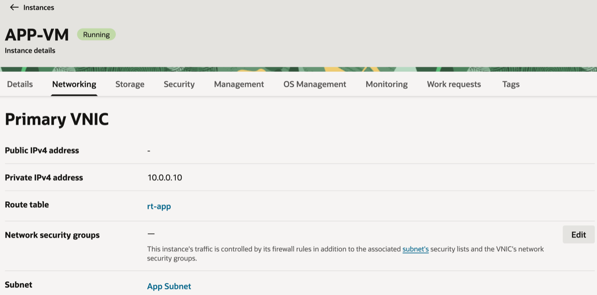

3. Attach the Hub VCN and Spoke VCN to the DRG. Then, assign the DRG and VCN route tables according to the table below:

| Attachment           | DRG Route Table | VCN Route Table |
| -------------------- | --------------- | --------------- |
| Hub VCN Attachment   | rt-hub          | rt-drg-ingress  |
| Spoke VCN Attachment | rt-spoke        | -               |

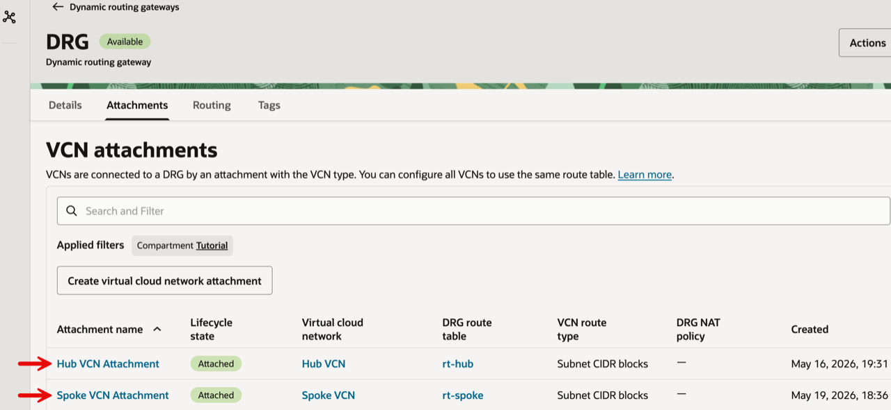

A **VCN Route Table** is assigned to a DRG attachment (also called an **Ingress** or **Transit Route Table**) when traffic entering the Hub VCN through the DRG needs to be steered to a destination other than what the VCN's local routing would pick. In this scenario, it forces Internet-bound traffic from the spoke through the firewall pair for inspection and source NAT, instead of allowing it to bypass inspection. The same principle applies to other gateways (IGW, SGW, NAT GW): you assign an Ingress Route Table to them when the default VCN routing is not what you want.

## Task 1: Review the Use Case

In this design, workloads in a spoke VCN need to reach the Internet (for example, OS updates, package downloads, calls to a SaaS API), and every packet must go through the firewall pair for inspection, URL filtering, and threat prevention before leaving OCI. The pair provides **centralized egress** for the spoke, while the active firewall performs **Source NAT** so the workload's private IP is hidden behind the reserved public IP associated with floating Untrust IP `172.16.0.22`.

### This is the right choice when:

- You want **one egress point** for many spokes, with shared NGFW policies and logging.
- You want **SNAT to a fixed public IP** (or pool of public IPs) so external services can whitelist your egress instead of every spoke's NAT GW.
- You want **outbound DPI** (URL filtering, threat prevention, App-ID) on traffic that would otherwise leave through a per-spoke NAT GW with no inspection.

### Traffic Flow:

1. The **APP-VM** (`10.0.0.10`) in the Spoke VCN initiates a connection to an Internet destination. The Spoke's app subnet route table sends `0.0.0.0/0` to the **DRG**.
2. The DRG (using `rt-spoke`) forwards the packet to the **Hub VCN attachment**, where the **`rt-drg-ingress`** Ingress Route Table on the Hub DRG attachment routes it to the **Palo Alto Trust floating IP (`172.16.0.42`)**.
3. The active firewall inspects the packet, applies a **Source NAT** rule (`source: 10.0.0.10` → the reserved public IP associated with floating Untrust IP `172.16.0.22`), and routes it out of its **Untrust interface (`172.16.0.22`)** towards the IGW.
4. The packet leaves OCI through the IGW by using the reserved public IP associated with floating Untrust IP `172.16.0.22`.
5. Return traffic comes back to that same public IP, hits the active firewall's NAT state table, and is reversed back through Trust → DRG → spoke.

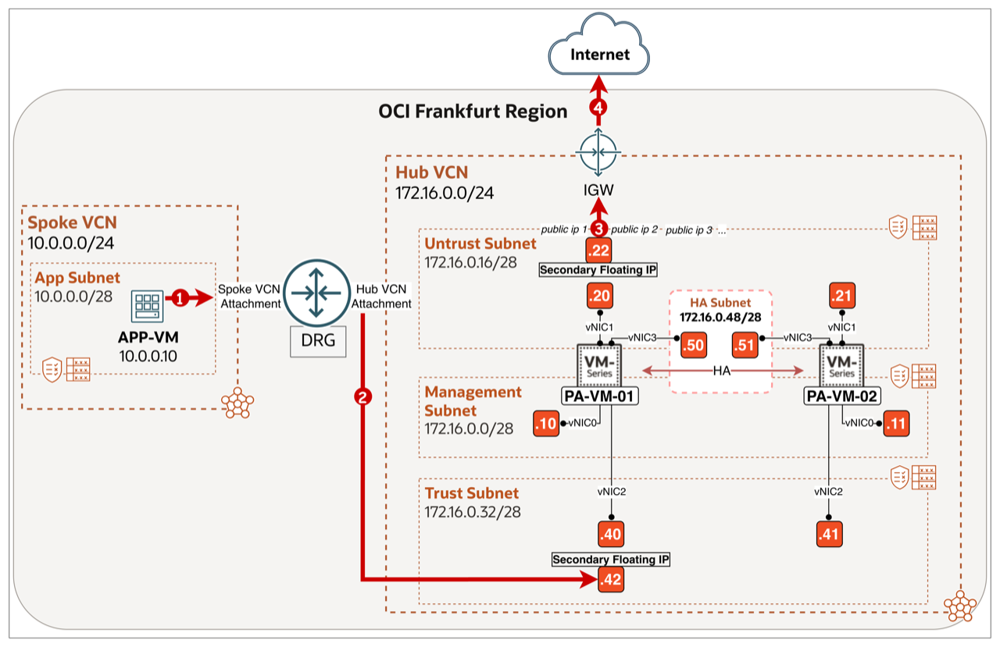

## Task 2: Configure Routing

The diagram below summarises the routing plan for Lab 3.

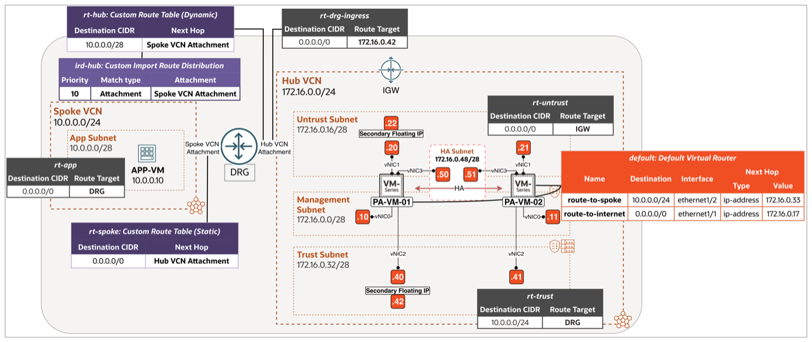

> **Note:** Routing has three parts: OCI VCN route tables control traffic leaving each subnet, OCI DRG route tables control traffic between attachments, and the active Palo Alto virtual router controls forwarding through the firewall pair.

#### Step 1: Open the Hub VCN Routing view

1. Select the correct **region**.
2. Click on the **hamburger menu** in the top left corner.

    

<!-- -->

1. Click on **Networking**.
2. Click on **Virtual cloud networks**.

    

- Click on the **Hub VCN**.

    

- Click on the **Routing** tab.

    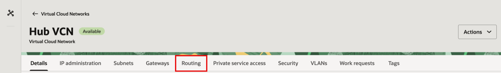

#### Step 2: Configure `rt-drg-ingress` (Hub VCN - DRG attachment ingress route table)

This Ingress Route Table catches outbound spoke traffic that arrives in the Hub VCN through the DRG and steers it to the Palo Alto Trust floating IP (`172.16.0.42`). Because the spoke sends its default route (`0.0.0.0/0`) to the DRG, the matching `rt-drg-ingress` rule is also `0.0.0.0/0 → 172.16.0.42` so every spoke packet entering the Hub is forced into the firewall pair.

- Click on the route table **rt-drg-ingress**.

    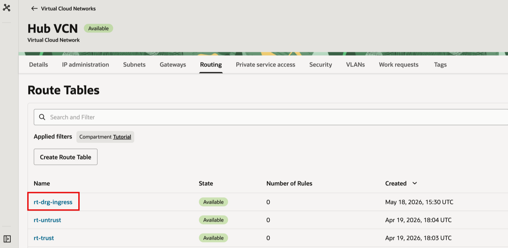

<!-- -->

1. Click on the **Route Rules** tab.
2. Add the route rule `0.0.0.0/0 → 172.16.0.42` (target type **Private IP**, pointing at the Palo Alto Trust floating IP).
3. Click the back arrow to return to the Hub VCN route tables list.

    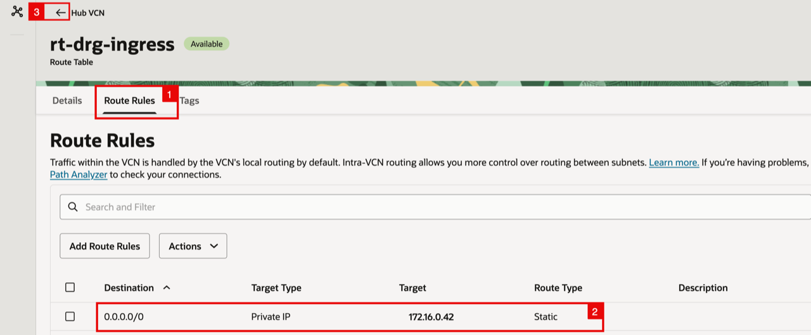

#### Step 3: Configure `rt-untrust` (Hub VCN - Untrust subnet route table)

Configure `0.0.0.0/0 → IGW` in the Untrust subnet route table so traffic leaving the active firewall's Untrust interface can reach the Internet.

- Click on the route table **rt-untrust**.

    

<!-- -->

1. Click on the **Route Rules** tab.
2. Add the route rule `0.0.0.0/0 → IGW`.
3. Click the back arrow to return to the Hub VCN route tables list.

    

#### Step 4: Configure `rt-trust` (Hub VCN - Trust subnet route table)

Configure `10.0.0.0/24 → DRG` in the Trust subnet route table so return traffic leaving the active firewall's Trust interface can reach the spoke.

- Click on the route table **rt-trust**.

    

<!-- -->

1. Click on the **Route Rules** tab.
2. Add the route rule `10.0.0.0/24 → DRG`.
3. Click the back arrow to return to the Hub VCN route tables list.

    

#### Step 5: Configure `rt-app` (Spoke VCN - App subnet route table)

The Spoke's App Subnet route table needs a default route to the DRG so all Internet-bound traffic leaves the spoke through the hub.

- Click on the **Spoke VCN**.

    

- Click on the **Routing** tab.

    

- Click on the route table **rt-app**.

    

<!-- -->

1. Click on the **Route Rules** tab.
2. Add the route rule `0.0.0.0/0 → DRG`.

    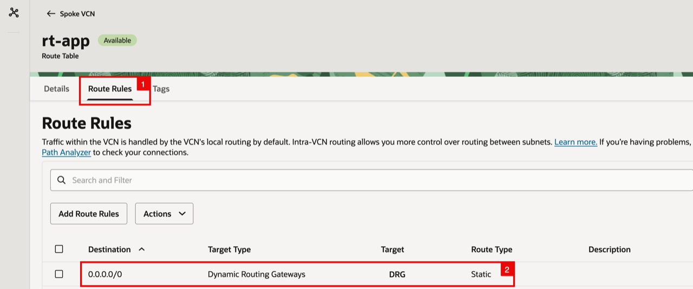

<!-- -->

1. Notice the three Hub VCN route tables (`rt-drg-ingress`, `rt-untrust`, `rt-trust`) are listed with the rule counts you just verified.
2. Click the back arrow to return to the **Virtual cloud networks** list.

    

#### Step 6: Configure DRG route tables (`ird-hub`, `rt-hub`, `rt-spoke`)

The DRG holds two route tables: **`rt-hub`** (used by the Hub VCN attachment) and **`rt-spoke`** (used by the Spoke VCN attachment). `rt-hub` is populated dynamically from an **Import Route Distribution** (`ird-hub`), so it always reflects the current set of spokes without manual updates. `rt-spoke` carries the spoke's default route back to the Hub VCN attachment for Internet-bound traffic.

1. Click on the **hamburger menu**.
2. Click on **Networking**.
3. Click on **Dynamic routing gateway**.

    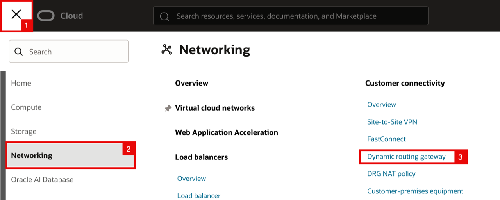

- Click on the **DRG** that is already deployed.

    

- Click on the **Attachments** tab.

    

<!-- -->

1. Make sure you are in the VCN attachments section.
2. Notice the **VCN attachments** table: the **Hub VCN Attachment** uses DRG route table `rt-hub` and the **Spoke VCN Attachment** uses `rt-spoke`.

    

- Click on the **rt-hub** link in the **DRG route table** column for the **Hub VCN Attachment**.

    

- On the **rt-hub** Details page, click on the **ird-hub** link in the **Import route distribution** field.

    

- Click on the **Statements** tab.

    

<!-- -->

1. Notice the single statement in `ird-hub`: priority `10`, match type **Attachment**, match criteria **Spoke VCN Attachment**. You can instead use match type **Attachment type** and select **Virtual Cloud Network** to import future spokes automatically.
2. Click the back arrow to return to the **Import route distributions** list (then navigate back to the DRG).

    

- Click on the route table **rt-hub**.

    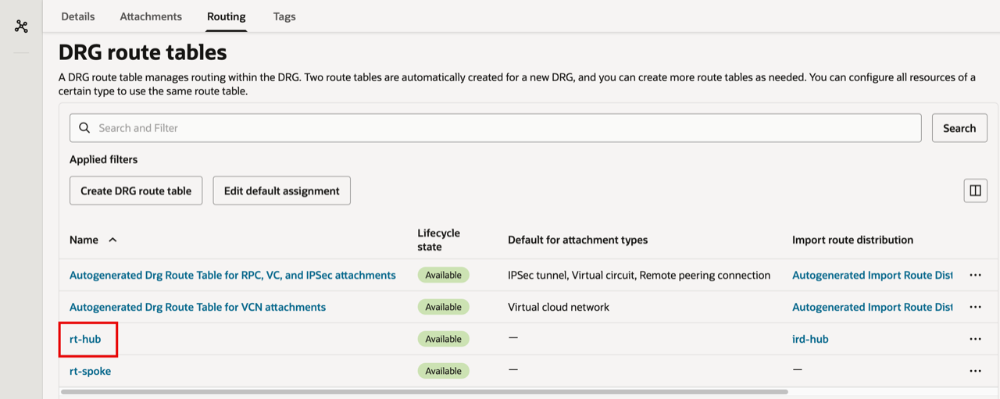

- On the **rt-hub** Details page, click on the **Get all route rules** button to view the dynamic routes learned via `ird-hub`.

    

<!-- -->

1. Notice the **DYNAMIC** entry: destination `10.0.0.0/28` (the Spoke App Subnet CIDR), next hop **Virtual Cloud Network → Spoke VCN Attachment**.
2. Click **Close**.

    

- Click the back arrow to return to the DRG route tables list.

    

- Click on the route table **rt-spoke**.

    

<!-- -->

1. Notice the **rt-spoke** Details page: **Import route distribution** is `-` (no dynamic routing).
2. Click on the **Static route rules** tab.

    

- Notice the single static route in `rt-spoke`: `0.0.0.0/0 → Hub VCN Attachment`. This is the spoke's default route that sends all egress traffic back to the Hub for firewall inspection.

    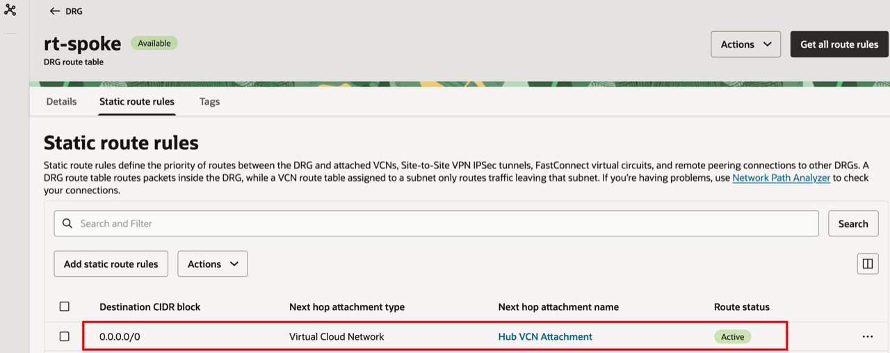

#### Step 7: Configure Palo Alto VR static routes

The OCI DRG and VCN route tables deliver traffic to the correct Palo Alto interface, but the active firewall's default Virtual Router still needs static routes to forward each destination CIDR. The next-hop addresses used below are the OCI **default gateways** for the firewall subnets: `172.16.0.33` for the Trust subnet and `172.16.0.17` for the Untrust subnet. For Lab 3 the active firewall needs:

- `10.0.0.0/24` — `ethernet1/2`, next hop `172.16.0.33`
- `0.0.0.0/0` — `ethernet1/1`, next hop `172.16.0.17`

Open the active firewall's management Web GUI, then:

1. Sign in to the active firewall's Web GUI, then click on the **Network** tab.
2. Click on **Virtual Routers**.
3. Click on the **default** virtual router.

    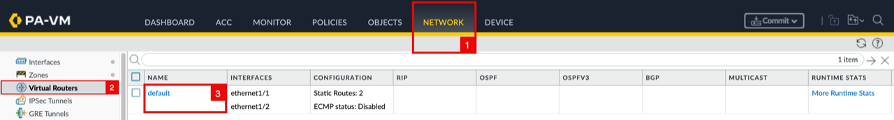

- In the **Virtual Router - default** dialog, click on **Static Routes** in the left-hand menu.

    

- On the **IPv4** sub-tab, click **Add** and create the first route `route-to-spoke` (Destination `10.0.0.0/24`, Interface `ethernet1/2`, Next Hop **IP Address** `172.16.0.33`).
- Click **Add** again and create the second route `route-to-internet` (Destination `0.0.0.0/0`, Interface `ethernet1/1`, Next Hop **IP Address** `172.16.0.17`).

1. Notice both routes are listed in the IPv4 table.
2. Click on the **OK** button to save the Virtual Router configuration.

    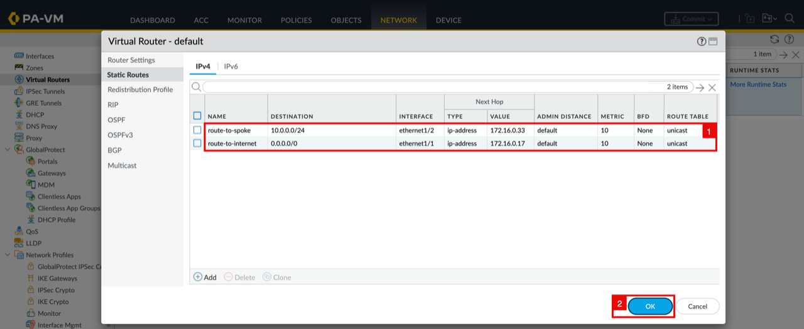

#### Step 8: Commit the Palo Alto configuration

- Notice that the **default** Virtual Router now shows **Static Routes: 2**. Click on the **Commit** button at the top right.

    

<!-- -->

1. Select **Commit All Changes**.
2.  In the **Commit** dialog, click the **Commit** button to confirm.

    

- The **Commit Status** dialog shows the operation as **Pending** while the configuration is applied.

    

- Notice the **Commit Status** shows **Completed** and **Successful**.

    

## Task 3: Configure NAT

NAT enables spoke workloads to reach the Internet:

- **Source NAT (SNAT)** rewrites the workload source IP (`10.0.0.10`) to the reserved public IP associated with floating Untrust IP `172.16.0.22` as traffic leaves through `ethernet1/1`. Replies return to that public IP, and the active firewall reverses the translation before sending them back to the spoke.

This provides NAT Gateway-like egress while keeping every flow inspected and logged on the active firewall; spoke workloads do not need public IPs.

The diagram below shows the translation: the source changes from `10.0.0.10` to the reserved public IP associated with floating Untrust IP `172.16.0.22` before the packet leaves through the IGW.

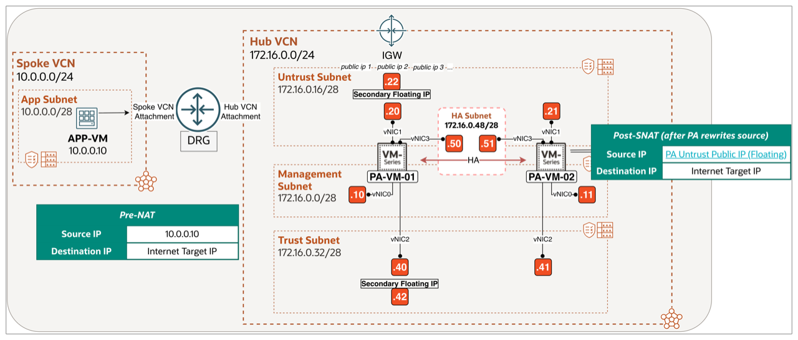

Open the active firewall's management Web GUI, then:

1. Click on the **Policies** tab.
2. Click on **NAT** in the left-hand menu.

    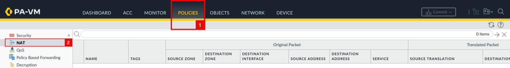

- Click on the **Add** button at the bottom to create a new NAT rule.

    

In the **NAT Policy Rule** dialog, configure the **General** tab:

1. Notice the **General** tab is selected.
2. Specify a **Name** (e.g. `NAT-Outbound-to-Internet`).
3. Set a **Description** (e.g. `SNAT for Spoke App subnet egress to Internet`).
4. Leave **NAT Type** as `ipv4`.
5. Click on the **Original Packet** tab.

    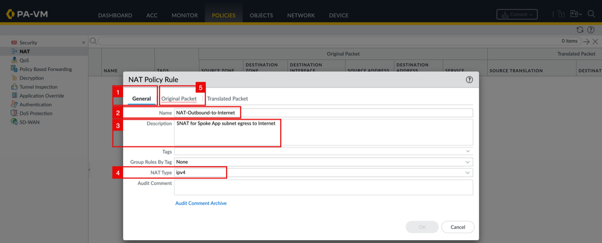

On the **Original Packet** tab (this is the **Pre-NAT** view - the packet fields as the active firewall first receives the packet):

1. Set the **Source Zone** to `trust-zone`.
2. Set the **Destination Zone** to `untrust-zone`.
3. Leave the **Destination Interface** as `any`.
4. Leave the **Service** as `any`.
5. Add the spoke CIDR `10.0.0.0/24` to **Source Address** so only spoke traffic matches this rule.
6. Click on "Any" for **Destination Address**.
7. Click on the **Translated Packet** tab.

    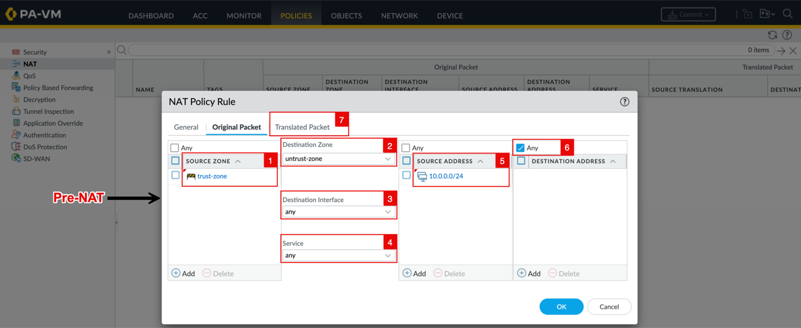

On the **Translated Packet** tab, configure the **SNAT** side (Source Address Translation) - the **DNAT** side stays disabled:

1. Set the **Translation Type** to `Dynamic IP And Port`.
2. Set the **Address Type** to `Interface Address`.
3. Set the **Interface** to `ethernet1/1` (the Untrust interface).
4. Notice the **IP Address** is `172.16.0.22/32` (the floating Untrust private IP). The active firewall SNATs to this address, and OCI's IGW maps it to the reserved public IP on the way out.
5. Leave the **Destination Address Translation** **Translation Type** as `None` (no DNAT for outbound).
6. Click on the **OK** button.

    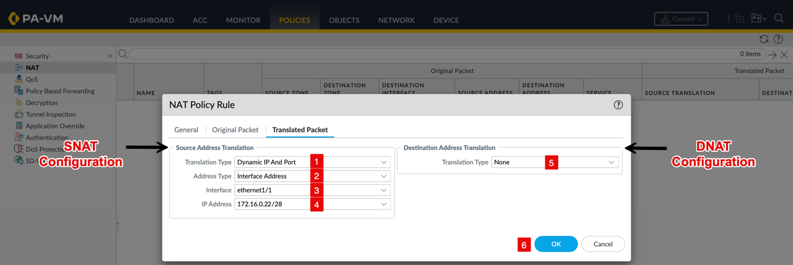

<!-- -->

1. Confirm that the new NAT rule appears in the list.
2. Click on the **Commit** button.

    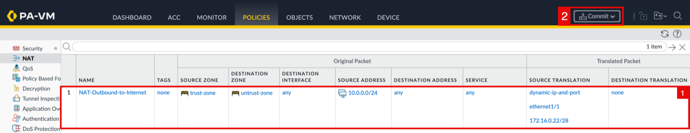

<!-- -->

1. In the **Commit** dialog, notice the **Commit Scope** is `policy-and-objects` (because only the NAT policy changed).
2. Click on the **Commit** button to confirm.

    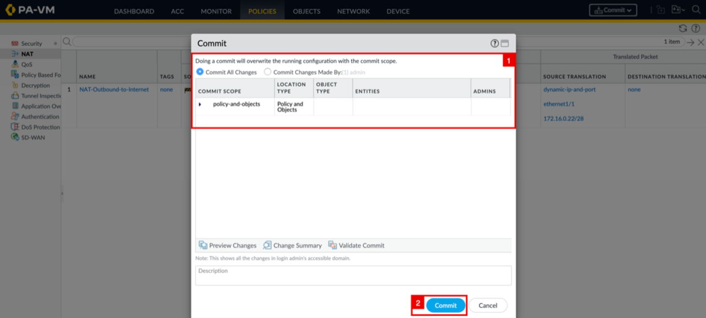

- The **Commit Status** dialog shows the operation as **Pending** while the configuration is applied.

    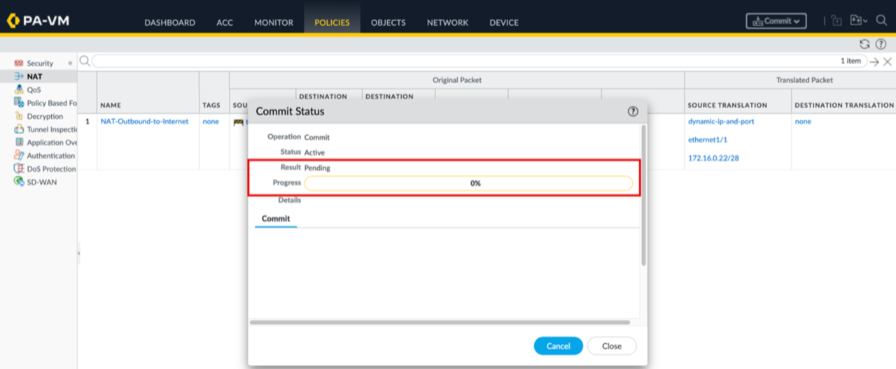

- Notice the **Commit Status** shows **Completed** and **Successful**.

    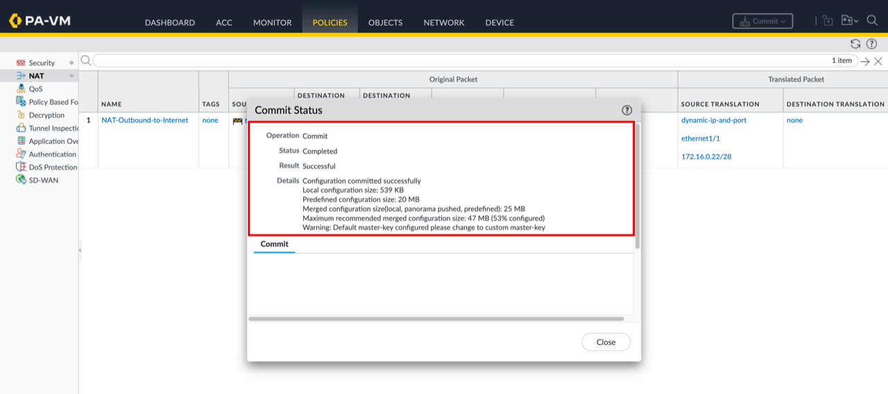

## Task 4: Test and Validate

- Connect to the **APP-VM** in the spoke through a bastion or jump host, then run `ping 1.1.1.1`. Confirm that replies are received, showing that ICMP traffic is forwarded to the Internet through the firewall pair and returns through the same path.

    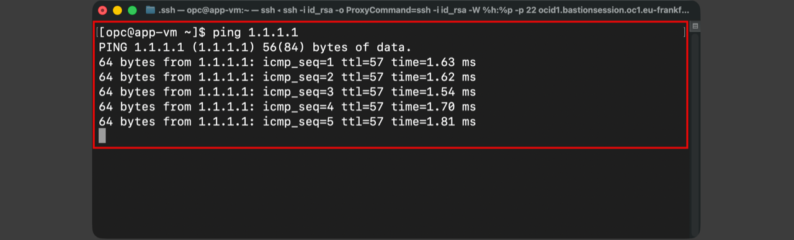

<!-- -->

1. In the active firewall's Web GUI, click on the **Monitor** tab.
2. Under **Logs**, click on **Traffic**.
3. Verify the matching sessions for the ping:
   - **Source:** `10.0.0.10`
   - **Destination:** `1.1.1.1`
   - **Zones:** `trust-zone` to `untrust-zone`
   - **Action:** `allow`
   - **NAT Applied:** `yes`
   - **NAT Source IP:** `172.16.0.22` (Untrust floating IP)

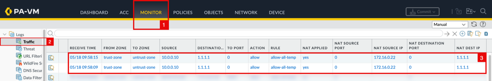

## Learn More

- [OCI VCN Route Tables](https://docs.oracle.com/en-us/iaas/Content/Network/Tasks/managingroutetables.htm)
- [OCI Dynamic Routing Gateway (DRG)](https://docs.oracle.com/en-us/iaas/Content/Network/Tasks/managingDRGs.htm)
- [Palo Alto Static Routes](https://docs.paloaltonetworks.com/ngfw/networking/static-routes)
- [Palo Alto Source NAT](https://docs.paloaltonetworks.com/ngfw/networking/nat/source-nat)
- [Palo Alto View and Manage Logs](https://docs.paloaltonetworks.com/ngfw/administration/monitoring/view-and-manage-logs)

## Acknowledgements

- **Authors** - Anas Abdallah, Iwan Hoogendoorn (Cloud Networking Black Belts)
- **Contributor** - Antonio Gámir (Cloud Networking Black Belt)
- **Last Updated By/Date** - Anas Abdallah, October 2026

You may now **proceed to the next lab**.
