# Configure OSN Access - Centralized SGW with Firewall Inspection

## Introduction

In this lab, you use a centralized Service Gateway in the hub VCN to provide Oracle Services Network access for spoke workloads. Routing forces the OSN traffic through the Palo Alto firewall pair for inspection and policy enforcement.

Estimated Time: 25 minutes

### Objectives

In this lab, you will:

- Configure the spoke, DRG, and Service Gateway ingress routes that steer OSN traffic through the Palo Alto firewall pair.
- Configure Palo Alto virtual-router routes for the Oracle Services Network service CIDR.
- Validate inspected Oracle Services Network access and confirm the symmetric traffic path in Palo Alto logs.

### Prerequisites

Before following the routing steps below, complete the items that are out of scope for this workshop. They are not part of the routing configuration itself, but they have to exist before any of the routes you are about to create are useful.

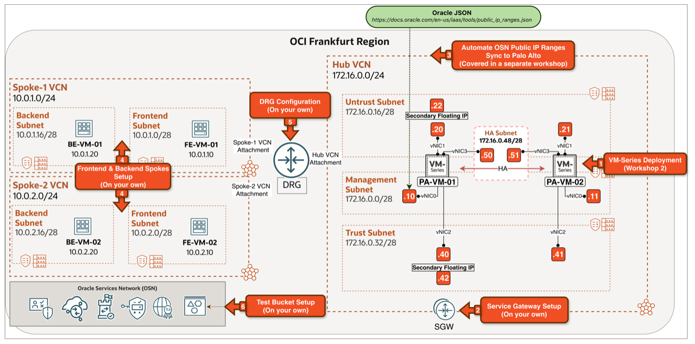

<!-- -->

1. Complete [Deploy Palo Alto NGFW in OCI with Active/Passive HA](https://livelabs.oracle.com/ords/dbpm/r/livelabs/view-workshop?wid=4492). This workshop deploys the baseline Active/Passive Palo Alto VM-Series pair in OCI Frankfurt, including the Hub VCN, subnets, and base firewall configuration.

2. Create a **Service Gateway (SGW)** in the **Hub VCN** and assign `rt-sgw-ingress` to it. Open the Hub VCN and click the Gateways tab.

    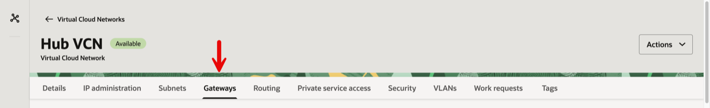

- Verify that **SGW** is **Available** and that `rt-sgw-ingress` appears in the **Route Table** column.
  
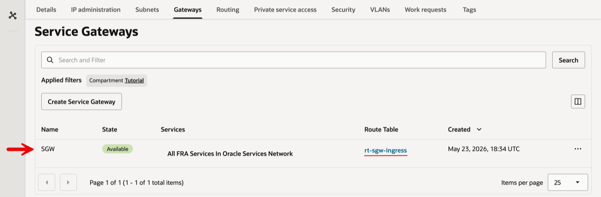

An **SGW ingress route table** controls traffic returning from OSN into the VCN. In this lab, it sends the return traffic to the Palo Alto Trust floating IP (`172.16.0.42`) for inspection, instead of allowing it to return directly to the spoke through normal VCN routing. This keeps the flow symmetric.

3. Complete [Automate OSN Public IP Synchronization to Palo Alto](https://livelabs.oracle.com/ords/dbpm/r/livelabs/view-workshop?wid=4443). This workshop automatically synchronizes Oracle Services Network public IP ranges with a Palo Alto address group.

The active firewall needs a current list of OSN service public IPs in order to apply policy and security rules to traffic destined for OSN. Oracle publishes this list as a [JSON file](https://docs.oracle.com/iaas/tools/public_ip_ranges.json), and it changes over time. The referenced workshop sets up a small automation that periodically pulls the JSON and pushes the IPs into a Palo Alto address group, with HA synchronization keeping the passive peer in sync.

4. Provision two Spoke VCNs with Oracle Linux 9 VMs (or use an existing workload or application in your environment):

    | VCN | VCN CIDR | Subnet | VM |
    | --- | --- | --- | --- |
    | Spoke-1 | `10.0.1.0/24` | Frontend `10.0.1.0/28` | FE-VM-01 `10.0.1.10` |
    |  |  | Backend `10.0.1.16/28` | BE-VM-01 `10.0.1.20` |
    | Spoke-2 | `10.0.2.0/24` | Frontend `10.0.2.0/28` | FE-VM-02 `10.0.2.10` |
    |  |  | Backend `10.0.2.16/28` | BE-VM-02 `10.0.2.20` |

5. Attach the Hub, Spoke-1, and Spoke-2 VCNs to the DRG. Then, assign the DRG and VCN route tables according to the table below:

| Attachment             | DRG Route Table | VCN Route Table |
| ---------------------- | --------------- | --------------- |
| Hub VCN Attachment     | rt-hub          | rt-drg-ingress  |
| Spoke-1 VCN Attachment | rt-spoke        | -               |
| Spoke-2 VCN Attachment | rt-spoke        | -               |

A **VCN Route Table** is assigned to a DRG attachment (also called an **Ingress** or **Transit Route Table**) when traffic entering the Hub VCN through the DRG needs to be steered to a destination other than what the VCN's local routing would pick. In this scenario, it steers traffic from the DRG to the Palo Alto Trust floating IP for inspection instead of allowing local VCN routing to bypass the firewall pair. The same principle applies to other gateways (IGW, SGW, NAT GW): you assign an Ingress Route Table to them when the default VCN routing is not what you want.

6. Create a test bucket in OCI Object Storage and a **Pre-Authenticated Request (PAR)** for a test object. A PAR is a time-limited URL that provides access to the object without requiring IAM authentication; you use it for end-to-end testing.

    - Create a text file named `Test-Object.txt` with a short line, such as `This is a test object...`, and upload it to the bucket.

    

<!-- -->

1. In the **Test-Bucket** Objects view.
2. Locate the uploaded `Test-Object.txt`.
3. Open the row's **Actions** menu
4. and click **Create pre-authenticated request**.

    

<!-- -->

1. In the **Create pre-authenticated request** dialog, give the PAR a name.
2. Leave the target as **Object** 
3. with **Object name** `Test-Object.txt`.
4. Set the access type to **Permit object reads**.
5. Choose an expiration date/time.
6. Click **Create pre-authenticated request**.

    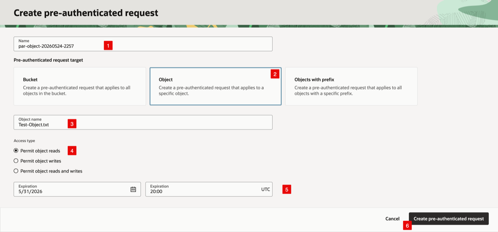

<!-- -->

1. Notice the warning.
2. In the **Pre-authenticated request details** dialog, copy the **Pre-authenticated request URL** and save it - you will `curl` it in the Test & Validate step. The URL is only shown once.

    

## Task 1: Review the Use Case

In this design, a single SGW resides in the **Hub VCN** with its own Ingress Route Table (`rt-sgw-ingress`). All spoke traffic destined for OSN is routed through the DRG to the Hub, into the Palo Alto Trust, back out of Trust toward the SGW, and through the SGW into OSN. Return traffic comes back through the SGW, hits `rt-sgw-ingress` (which steers it to the Palo Alto Trust), through the firewall pair, back out of Trust, into the DRG, and back to the spoke.

### This is the right choice when:

- OSN traffic must be **logged and inspected** (URL filtering, threat prevention, compliance).
- You want **one SGW** for many spokes - simpler to manage, single OSN egress point.

### Traffic Flow:

1. A VM in either spoke initiates a connection to an OSN service, such as the Object Storage. Its subnet route table sends the OSN destination to the **DRG**.
2. The DRG forwards the packet to the **Hub VCN attachment**, where `rt-drg-ingress` routes it to the **Palo Alto Trust floating IP** (`172.16.0.42`).
3. The active firewall inspects the packet and sends it out of its **Trust** interface. The Hub **`rt-trust`** route table forwards the OSN destination to the **SGW**.
4. The SGW carries the packet over OCI's private OSN fabric to the target Oracle service.
5. Return traffic enters the Hub VCN through the SGW. `rt-sgw-ingress` routes it to the floating Trust IP for inspection; the active firewall forwards it out of Trust, and `rt-trust` sends the destination spoke CIDR to the DRG for delivery to the originating spoke. This keeps the flow symmetric.

    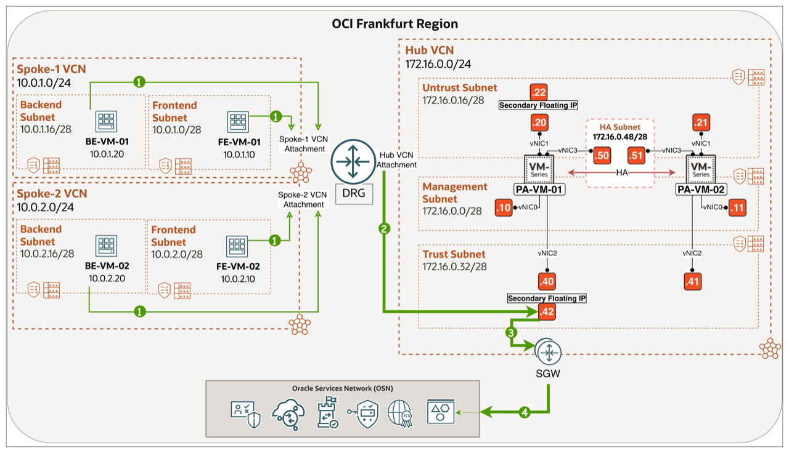

## Task 2: Configure Routing

The diagram below summarises the routing plan for Lab 5.

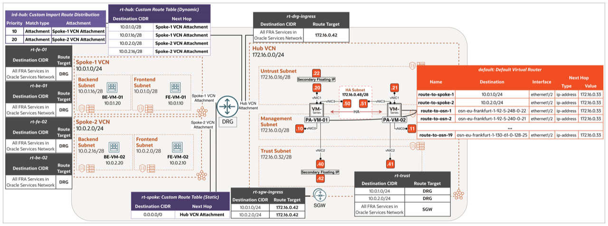

> **Note:** Routing has three parts: OCI VCN route tables control traffic leaving each subnet, OCI DRG route tables control traffic between attachments, and the active Palo Alto virtual router controls forwarding through the firewall pair.

#### Step 1: Open the Hub VCN Routing view

1. Select the correct **region**.
2. Click on the **hamburger menu** in the top left corner.

    

<!-- -->

1. Click on **Networking**.
2. Click on **Virtual cloud networks**.

    

- Click on the **Hub VCN**.

    

- Click on the **Routing** tab.

    

#### Step 2: Configure `rt-sgw-ingress` (Hub VCN - SGW ingress route table)

The SGW Ingress Route Table steers return traffic from OSN back to the Palo Alto Trust floating IP (`172.16.0.42`) for inspection. The destination CIDRs are the spoke CIDRs (`10.0.1.0/24` and `10.0.2.0/24`) because those are the original source IPs of the spoke workloads that initiated the OSN request.

- Click on the route table **rt-sgw-ingress** (this is the route table attached to the SGW you created in the Prerequisites).

    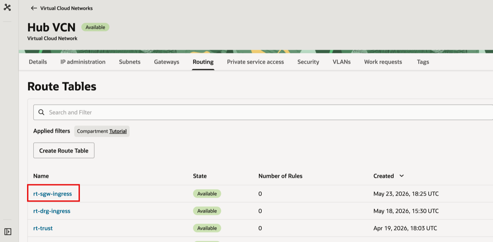

<!-- -->

1. Click on the **Route Rules** tab.
2. Add the two route rules `10.0.1.0/24 → 172.16.0.42` and `10.0.2.0/24 → 172.16.0.42` (target type **Private IP**, pointing at the Palo Alto Trust floating IP).
3. Click the back arrow to return to the Hub VCN route tables list.

    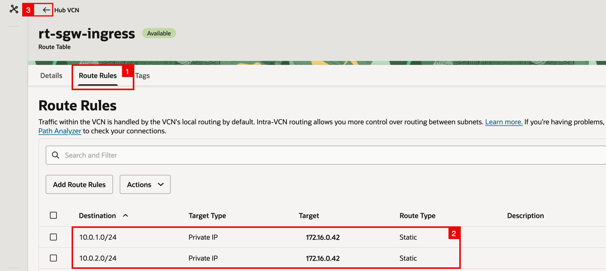

#### Step 3: Configure `rt-drg-ingress` (Hub VCN - DRG attachment ingress route table)

The DRG Ingress Route Table catches outbound spoke-to-OSN traffic that enters the Hub VCN through the DRG and steers it to the Palo Alto Trust floating IP for inspection.

- Click on the route table **rt-drg-ingress**.

    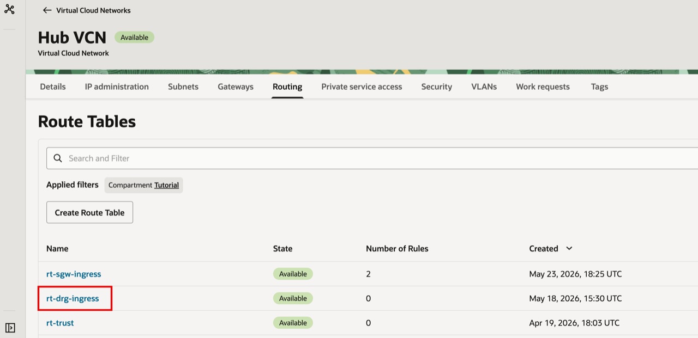

<!-- -->

1. Click on the **Route Rules** tab.
2. Add the route rule `All FRA Services In Oracle Services Network → 172.16.0.42` (the Palo Alto Trust floating IP as a **Private IP** target).
3. Click the back arrow to return to the Hub VCN route tables list.

    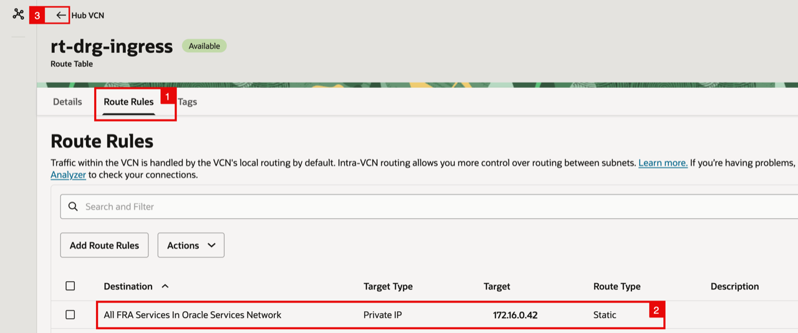

#### Step 4: Configure `rt-trust` (Hub VCN - Trust subnet route table)

The Trust subnet route table in this scenario has **three** rules: the two spoke CIDRs go to the DRG (so the active firewall's return traffic to spokes is delivered correctly), and the OSN service CIDR goes to the **SGW** (so the active firewall's forward-path OSN traffic exits via the SGW).

- Click on the route table **rt-trust**.

    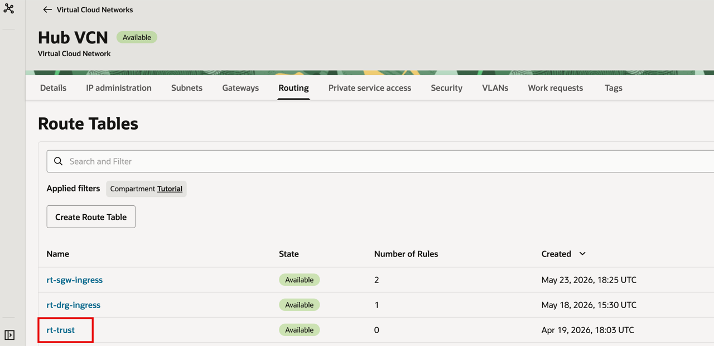

<!-- -->

1. Click on the **Route Rules** tab.
2. Add the three route rules: `10.0.1.0/24 → DRG`, `10.0.2.0/24 → DRG`, and `All FRA Services In Oracle Services Network → SGW`.
3. Click the back arrow to return to the Hub VCN route tables list.

    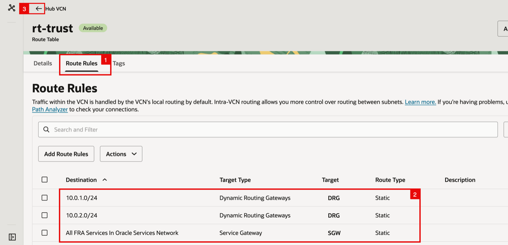

<!-- -->

1. Notice the three Hub VCN route tables: `rt-sgw-ingress` has two rules, `rt-drg-ingress` has one rule, and `rt-trust` has three rules.
2. Click the back arrow to return to the **Virtual cloud networks** list.

    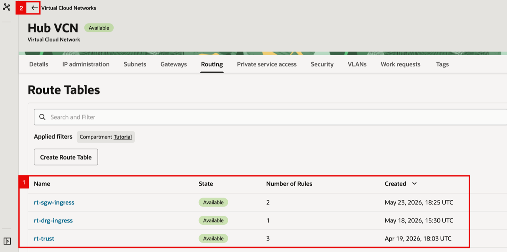

#### Step 5: Configure Spoke subnet route tables (`rt-fe-01`, `rt-be-01`, `rt-fe-02`, `rt-be-02`)

Each spoke subnet needs the OSN service CIDR routed to the DRG so OSN-bound traffic leaves the spoke and reaches the Hub for inspection.

- From the **Virtual Cloud Networks** list, click on **Spoke-1 VCN**.

    

- Click on the **Routing** tab.

    

- Click on the route table for the **Frontend Subnet** (`rt-fe-01`).

    

<!-- -->

1. Click on the **Route Rules** tab.
2. Add the route rule `All FRA Services In Oracle Services Network → DRG`.
3. Then click the back arrow.

    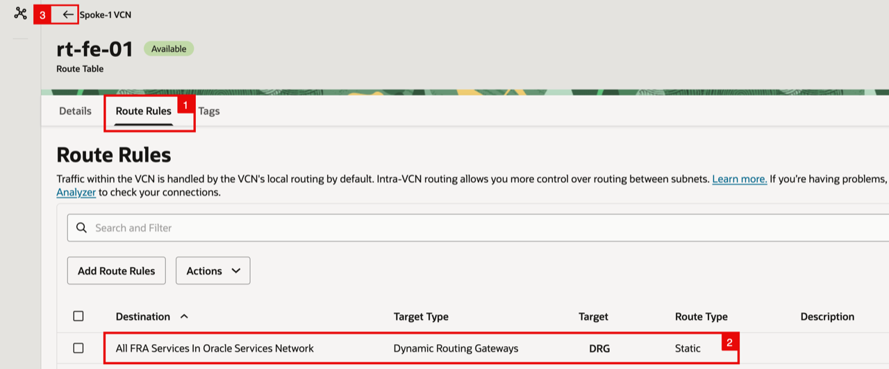

- Click on the route table for the **Backend Subnet** (`rt-be-01`) and add the same OSN → DRG rule.

    

<!-- -->

1. Click on the **Route Rules** tab.
2. Add the route rule `All FRA Services In Oracle Services Network → DRG`.
3. Then click the back arrow.

    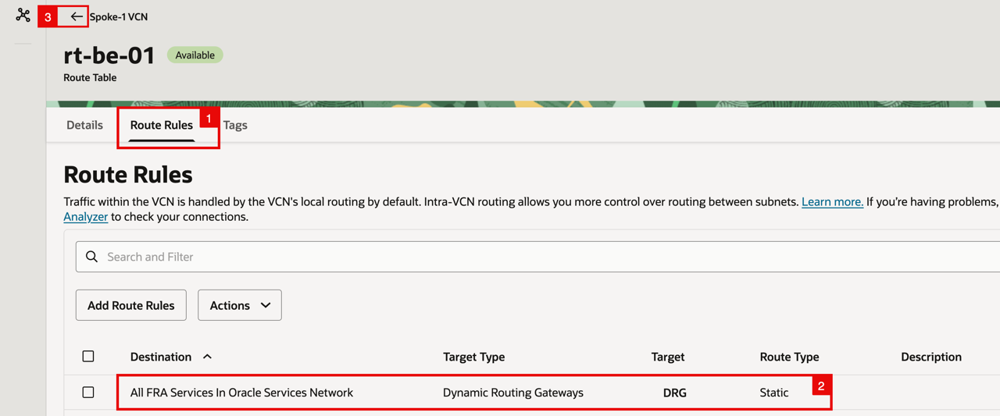

<!-- -->

1. Notice that both `rt-fe-01` and `rt-be-01` now have one rule.
2. Click the back arrow to return to the **Virtual cloud networks** list.

    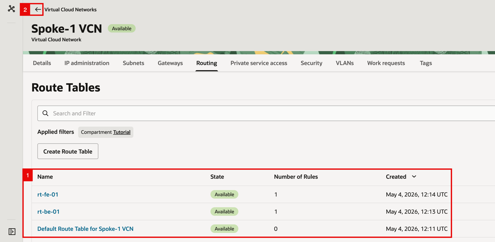

- Click on **Spoke-2 VCN**.

    

- Click on the **Routing** tab.

    

- Click on the route table for the **Frontend Subnet** (`rt-fe-02`).

    

<!-- -->

1. Click on the **Route Rules** tab.
2. Add the route rule `All FRA Services In Oracle Services Network → DRG`.
3. Then click the back arrow.

    

- Click on the route table for the **Backend Subnet** (`rt-be-02`) and add the same OSN → DRG rule.

    

<!-- -->

1. Click on the **Route Rules** tab.
2. Add the route rule `All FRA Services In Oracle Services Network → DRG`.

    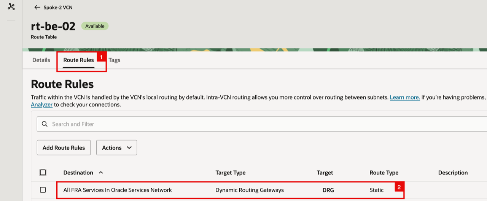

#### Step 6: Configure DRG route tables (`ird-hub`, `rt-hub`, `rt-spoke`)

The DRG holds two route tables: **`rt-hub`** (used by the Hub VCN attachment) and **`rt-spoke`** (used by the Spoke VCN attachment). `rt-hub` is populated dynamically from an **Import Route Distribution** (`ird-hub`), so it always reflects the current set of spokes without manual updates. `rt-spoke` carries a default route back to the Hub VCN attachment for OSN-bound traffic.

1. Click on the **hamburger menu**.
2. Click on **Networking**.
3. Click on **Dynamic routing gateway**.

    

- Click on the **DRG**.

    

- Click on the **Attachments** tab.

    

<!-- -->

1. Make sure you are in the VCN attachments section.
2. Notice the **VCN attachments** table: the **Hub VCN Attachment** uses DRG route table `rt-hub`; the **Spoke-1 VCN Attachment** and **Spoke-2 VCN Attachment** use `rt-spoke`.

    

- Click on the **rt-hub** link in the **DRG route table** column for the **Hub VCN Attachment**.

    

- On the **rt-hub** Details page, click on the **ird-hub** link in the **Import route distribution** field.

    

- Click on the **Statements** tab.

    

<!-- -->

1. Confirm two statements: priority `10` Spoke-1 VCN Attachment and priority `20` Spoke-2 VCN Attachment. You can instead use match type **Attachment type** and select **Virtual Cloud Network** to import future spokes automatically.
2. Click the back arrow to return to the DRG.

    

- On the DRG, click on the **Routing** tab and notice both `rt-hub` and `rt-spoke` are present. Click on the route table **rt-hub**.

    

- Click on the **Get all route rules** button.

    

<!-- -->

1. Notice the **four DYNAMIC entries**: 
    - `10.0.1.0/28` and `10.0.1.16/28` (Spoke-1 FE/BE subnets) via **Spoke-1 VCN Attachment**, 
    - `10.0.2.0/28` and `10.0.2.16/28` (Spoke-2 FE/BE subnets) via **Spoke-2 VCN Attachment**. 
2. Click **Close**.

    

- Click the back arrow to return to the DRG route tables list.

    

- Click on the route table **rt-spoke**.

    

<!-- -->

1. Notice the **rt-spoke** Details page: **Import route distribution** is `-` (no dynamic routing).
2. Click on the **Static route rules** tab.

    

- Notice the single static route in `rt-spoke`: `0.0.0.0/0 → Hub VCN Attachment`. This sends all spoke traffic (including OSN-bound) to the Hub for firewall inspection.

    

#### Step 7: Configure Palo Alto VR static routes

The OCI DRG and VCN route tables deliver traffic to the correct Palo Alto interface, but the active firewall's default Virtual Router still needs static routes to forward each destination CIDR. The next-hop address used below, `172.16.0.33`, is the OCI **default gateway** for the Trust subnet. For Lab 5 the active firewall needs:

- `10.0.1.0/24` — `ethernet1/2`, next hop `172.16.0.33`
- `10.0.2.0/24` — `ethernet1/2`, next hop `172.16.0.33`
- OSN Address Objects — `ethernet1/2`, next hop `172.16.0.33`

Open the active firewall's Web GUI, then:

1. Sign in to the active firewall's Web GUI, then click on the **Network** tab.
2. Click on **Virtual Routers**.
3. Click on the **default** virtual router.

    

- In the **Virtual Router - default** dialog, click on **Static Routes** in the left-hand menu.

    

<!-- -->

1. On the **IPv4** sub-tab, click **Add** and create the required routes for this scenario: 

    - `route-to-spoke-1` (Destination `10.0.1.0/24`, Interface `ethernet1/2`, Next Hop `172.16.0.33`)
    - `route-to-spoke-2` (Destination `10.0.2.0/24`, Interface `ethernet1/2`, Next Hop `172.16.0.33`)
    - `route-to-osn-<n>` for each OSN **Address Object** (Destination OSN Address Object, Interface `ethernet1/2`, Next Hop `172.16.0.33`)

The prerequisite automation retrieves Oracle's JSON file and updates the IP ranges in the OSN **Address Objects** and their address group; it does not create the static routes.
2. Click on the **OK** button to save the Virtual Router configuration.

    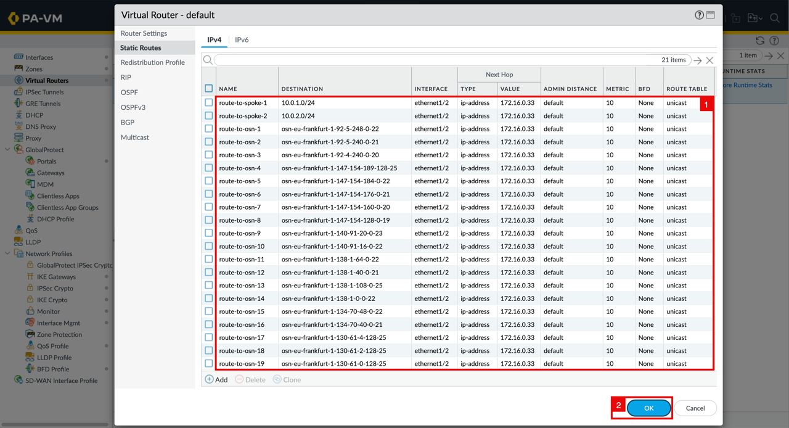

#### Step 8: Commit the Palo Alto configuration

- Notice that the **default** Virtual Router now shows **Static Routes: 21**. Click on the **Commit** button at the top right.

    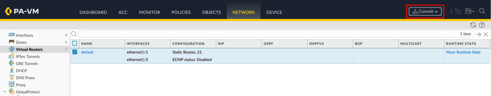

<!-- -->

1. Select **Commit All Changes**.
2. In the **Commit** dialog, click the **Commit** button to confirm.

    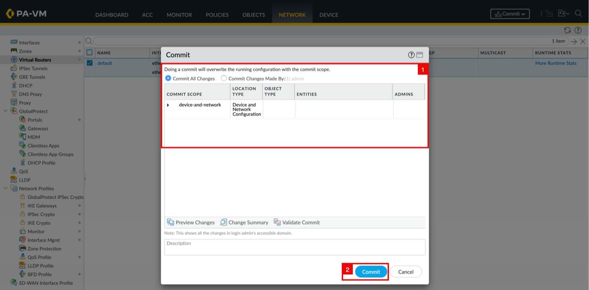

- The **Commit Status** dialog shows the operation as **Pending** while the configuration is applied.

    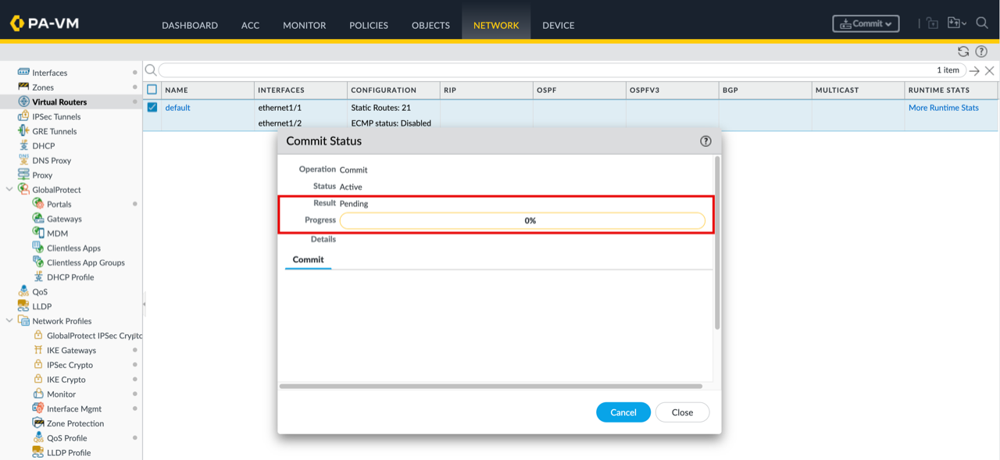

- Notice the **Commit Status** shows **Completed** and **Successful**.

    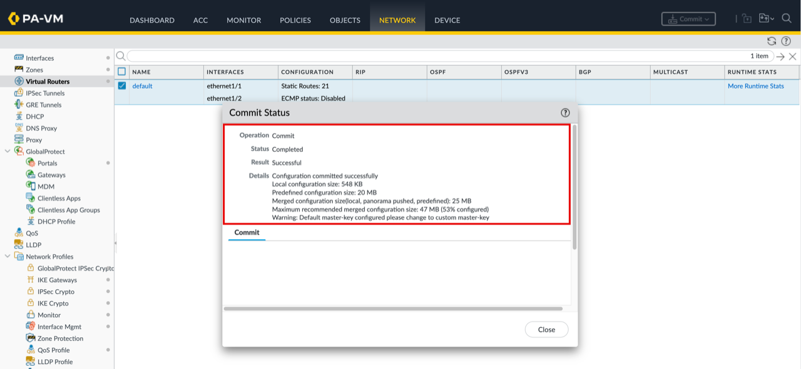

## Task 3: Test and Validate

1. From **FE-VM-01** (Spoke-1) or any other VM, `curl` the **PAR URL** for the test object in Object Storage. For example: `curl "<PAR_URL>"; echo`.
2. Initially the request might **stall or fail intermittently** - see the NOTE below for the cause and the fix.

    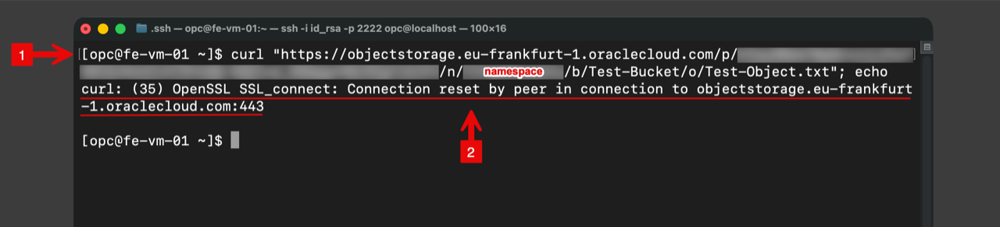

> **Note:** Why this fails?
>  OCI VNICs default to MTU 9000 (jumbo frames), but the PA-VM's dataplane interfaces are set to MTU 1500 by default. Small packets like pings and the TCP handshake pass through fine, but the large TLS handshake response coming back from Object Storage exceeds 1500 bytes and gets silently dropped at the active firewall. No error reaches the sender, so the spoke VM keeps retrying with oversized packets until TCP resets the connection. The failure is intermittent because TLS handshake size varies between requests; smaller responses occasionally slip through.
>  
>  The fix used in this workshop is to enable **TCP MSS clamping** on the PA-VM, which lowers the maximum segment size negotiated for each TCP session so both sides send packets small enough to fit through. It's a one-time firewall change with no reboot and no VM-side work, and it applies to every spoke VM automatically. This is the approach Palo Alto and Oracle both recommend for OCI VM-Series in hub-and-spoke designs.
>  
>  **An alternative solution** is to lower the spoke VM's NIC MTU to 1500 (`sudo ip link set dev enp0s5 mtu 1500`). It works for one or two VMs, but must be repeated on every VM, persisted across reboots, and sacrifices jumbo-frame performance inside the VCN.

1. Click the **Network** tab.
2. Click **Interfaces**.
3. Edit `ethernet1/2` (Trust).
4. Click the **Advanced** tab.
5. Select **Adjust TCP MSS**.
6. Set **IPv4 MSS Adjustment** to `40`.
7. Click **OK**.
8. Click **Commit** in the upper-right corner.

    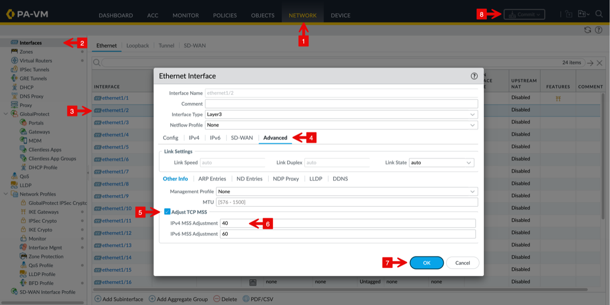

<!-- -->

1. Re-run the `curl` to the PAR URL from **FE-VM-01**. 
2. The object now downloads successfully.

    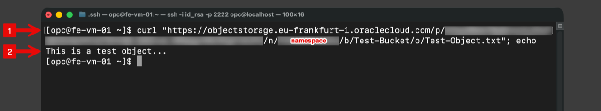

- The active firewall logs the session end-to-end

1. Open the active firewall's **Monitor**.
2. Click on **Traffic** log.
3. Notice the matching session from the spoke source IP to the OSN destination.

    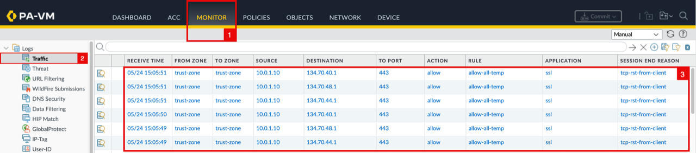

## Learn More

- [OCI VCN Route Tables](https://docs.oracle.com/en-us/iaas/Content/Network/Tasks/managingroutetables.htm)
- [OCI Service Gateway (SGW)](https://docs.oracle.com/en-us/iaas/Content/Network/Tasks/service-gateway_management.htm)
- [OCI Dynamic Routing Gateway (DRG)](https://docs.oracle.com/en-us/iaas/Content/Network/Tasks/managingDRGs.htm)
- [Palo Alto Policy Objects](https://docs.paloaltonetworks.com/network-security/security-policy/administration/objects)
- [Palo Alto Static Routes](https://docs.paloaltonetworks.com/ngfw/networking/static-routes)
- [Palo Alto View and Manage Logs](https://docs.paloaltonetworks.com/ngfw/administration/monitoring/view-and-manage-logs)

## Acknowledgements

- **Authors** - Anas Abdallah, Iwan Hoogendoorn (Cloud Networking Black Belts)
- **Contributor** - Antonio Gámir (Cloud Networking Black Belt)
- **Last Updated By/Date** - Anas Abdallah, October 2026

You may now **proceed to the next lab**.
