# Configure Public Application Access - ALB (WAF) First

## Introduction

In this lab, you configure a public Application Load Balancer with Web Application Firewall protection in front of the Palo Alto firewall pair. The selected firewall then inspects traffic before it reaches an application workload in a spoke VCN.

Estimated Time: 25 minutes

### Objectives

In this lab, you will:

- Review the ALB/WAF-first ingress design and its traffic flow through the Palo Alto firewall pair.
- Configure the OCI VCN, DRG, and ingress route tables that steer the request and return paths symmetrically through the firewall pair.
- Configure Palo Alto virtual-router static routes.
- Validate application access and confirm the inspected session in Palo Alto Traffic logs.

### Prerequisites

Before following the routing steps below, complete the items that are out of scope for this workshop. They are not part of the routing configuration itself, but they have to exist before any of the routes you are about to create are useful.

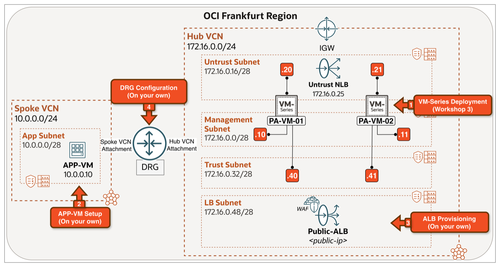

<!-- -->

1. Complete [Deploy Palo Alto NGFW in OCI with Active/Active HA](https://livelabs.oracle.com/ords/dbpm/r/livelabs/view-workshop?wid=4493). This workshop deploys the baseline Active/Active Palo Alto VM-Series pair in OCI Frankfurt, including the Hub VCN, subnets, Internet Gateway, and base firewall configuration.

2. Provision the APP-VM in the Spoke VCN (or use an existing workload or application in your environment):
    - Create a **Spoke VCN** `10.0.0.0/24` with an **App Subnet** `10.0.0.0/28`.
    - Deploy an **APP-VM** in the App Subnet with private IP `10.0.0.10`, running **Oracle Linux 9**.
    - Install and configure NGINX on the APP-VM using the script below.


```bash
<copy>
# Install Nginx
sudo dnf install -y nginx

# Enable and start Nginx
sudo systemctl enable --now nginx

# Open firewall ports (firewalld is enabled by default on OL9)
sudo firewall-cmd --permanent --add-service=http
sudo firewall-cmd --reload

# Create the APP-VM page
sudo tee /usr/share/nginx/html/index.html &gt; /dev/null &lt;&lt;'EOF'
&lt;!DOCTYPE html&gt;
&lt;html&gt;
&lt;head&gt;
    &lt;title&gt;APP-VM&lt;/title&gt;
    &lt;style&gt;
        body { font-family: Arial, sans-serif; text-align: center; padding: 50px; background: #1e3a5f; color: white; }
        h1 { font-size: 48px; }
        .info { background: rgba(255,255,255,0.1); padding: 20px; border-radius: 10px; display: inline-block; margin-top: 20px; }
        .label { color: #88c0d0; font-weight: bold; }
    &lt;/style&gt;
&lt;/head&gt;
&lt;body&gt;
    &lt;h1&gt;This is the APP VM&lt;/h1&gt;
    &lt;div class="info"&gt;
        &lt;p&gt;&lt;span class="label"&gt;Source IP of request:&lt;/span&gt; &lt;!--# echo var="remote_addr" --&gt;&lt;/p&gt;
    &lt;/div&gt;
&lt;/body&gt;
&lt;/html&gt;
EOF

# Configure Nginx with SSI enabled
sudo tee /etc/nginx/conf.d/default.conf &gt; /dev/null &lt;&lt;'EOF'
server {
    listen 80 default_server;
    listen [::]:80 default_server;
    server_name _;
    root /usr/share/nginx/html;

    location / {
        ssi on;
        index index.html;
    }
}
EOF

# Restart Nginx
sudo systemctl restart nginx
</copy>
```

The script installs and enables NGINX, opens TCP/80 on the OL9 firewalld, drops in a simple HTML page that displays the source IP of the incoming request using NGINX's Server-Side Includes (SSI), and reloads NGINX so the new config takes effect. The page is used in **Task 3: Test & Validate** to confirm which IP the application actually sees as the source.


3. Provision a **Public Application Load Balancer** in the Hub VCN with the following settings:

    - Subnet: LB Subnet (Public).
    - Public IP is generated: x.x.x.x
    - Load balancing policy: Weighted round robin.
    - Listener: listener-http (HTTP/80)
    - Backend set: be-set-app (APP-VM as backend listening on port 80).
    - Health check policy: HTTP/80
    - WAF: Assign a policy if ready.

    

4. Attach the Hub VCN and Spoke VCN to the DRG. Then, assign the DRG and VCN route tables according to the table below:

| Attachment           | DRG Route Table | VCN Route Table |
| -------------------- | --------------- | --------------- |
| Hub VCN Attachment   | rt-hub          | -               |
| Spoke VCN Attachment | rt-spoke        | -               |


The Hub VCN attachment has no VCN ingress route table in this scenario. The DRG delivers APP-VM return traffic to the LB Subnet through normal VCN routing; `rt-lb` then directs Internet-bound return traffic through the Untrust NLB for firewall inspection.


## Task 1: Review the Use Case

In this design, public traffic enters the **Untrust NLB** first and is inspected by the selected firewall before reaching OCI's **Public Application Load Balancer (ALB)**. The ALB applies any attached **Web Application Firewall (WAF)** policy, selects the backend, and forwards the request to the application VM in the spoke.

### This is the right choice when:

- You want WAF protection for the application (SQLi, XSS, OWASP Top-10) - the ALB/WAF performs these checks closer to the edge and at lower cost than the NGFW.
- You want TLS termination at the OCI edge for HTTP-based services.
- The application's logs can show the ALB's private IP as the source instead of the original client IP (which is normal for path-based-routed or session-affinity apps).

### Traffic Flow:

#### Forward Traffic Flow

1. The end user opens the public service URL. Traffic enters the Hub VCN through the Internet Gateway (IGW).
2. The IGW forwards the request to the public Untrust NLB (`172.16.0.25`).
3. The Untrust NLB uses symmetric hashing to select PA-VM-01 or PA-VM-02 through its Untrust interface.
4. The selected firewall inspects the request and forwards it to the Public ALB/WAF in the LB Subnet.
5. The ALB applies its WAF policy, selects the APP-VM backend, and sends the request towards the DRG.
6. The DRG forwards the request through the Spoke VCN attachment to the APP-VM (`10.0.0.10`).

    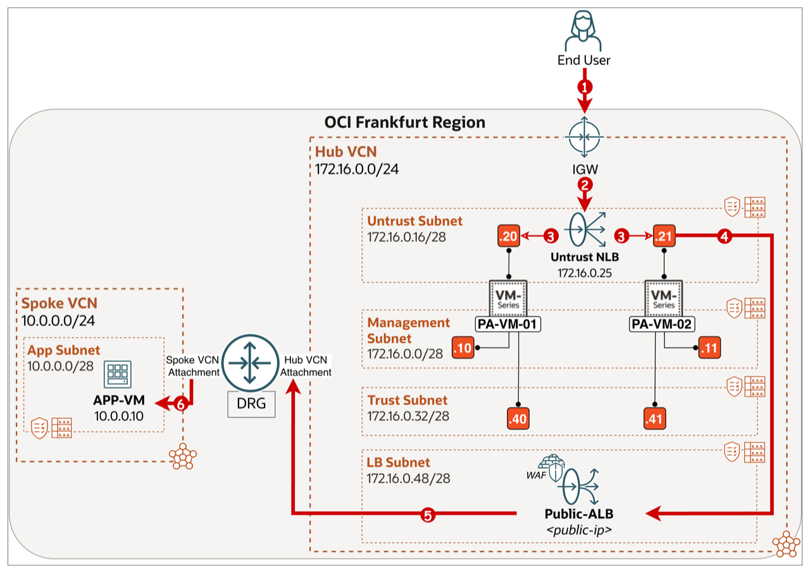

#### Return Traffic Flow

1. APP-VM (`10.0.0.10`) sends its reply towards the DRG.
2. The DRG forwards the reply to the Public ALB/WAF in the Hub LB Subnet.
3. The Public ALB/WAF forwards the reply to the Untrust NLB (`172.16.0.25`).
4. The Untrust NLB uses symmetric hashing to select the firewall through its Untrust interface.
5. The selected firewall inspects the reply and forwards it to the Untrust NLB (`172.16.0.25`).
6. The Untrust NLB forwards the reply through the IGW to the end user.

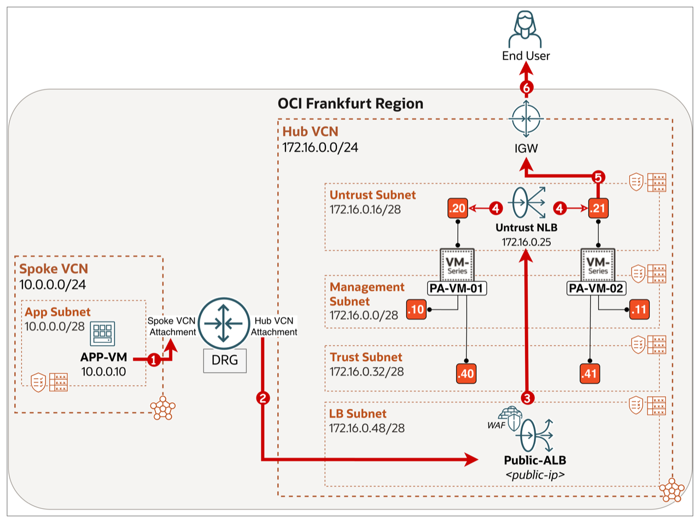


## Task 2: Configure Routing

The diagram below summarises the routing plan for Lab 1.

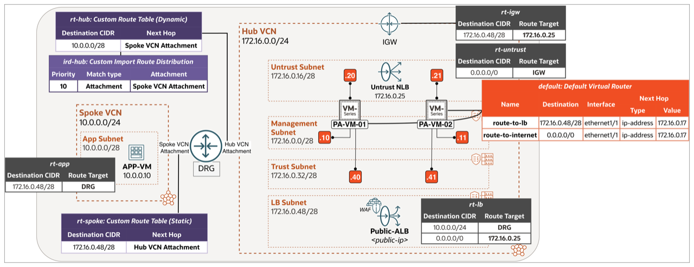

> **Note:** Routing has three parts: OCI VCN route tables control traffic leaving each subnet, OCI DRG route tables control traffic between attachments, and the virtual router on the firewall selected by the NLB controls forwarding for that flow.

#### Step 1: Open the Hub VCN Routing view

1. Select the correct **region**.
2. Click on the **hamburger menu** in the top left corner.

    

<!-- -->

1. Click on **Networking**.
2. Click on **Virtual cloud networks**.

    

    - Click on the **Hub VCN**.

    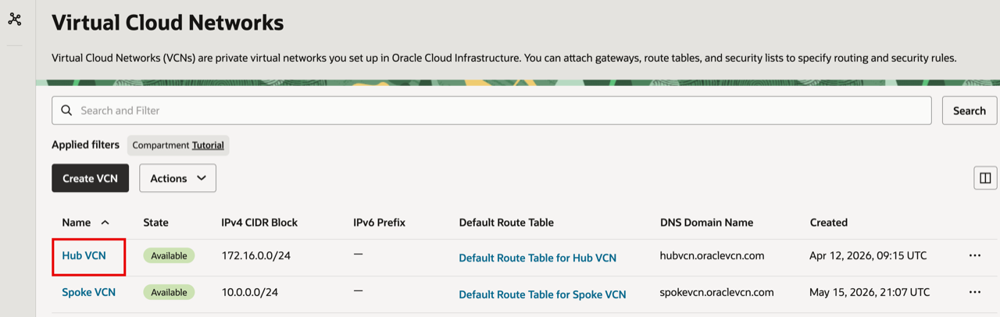

    - Click on the **Routing** tab.

    

#### Step 2: Configure `rt-lb` (Hub VCN - LB Subnet route table)

This route table is attached to the **LB Subnet** in the Hub VCN. It sends spoke-bound application traffic (`10.0.0.0/24`) to the DRG and Internet-bound return traffic to the **Untrust NLB** (`172.16.0.25`) for firewall inspection before it reaches the IGW.

- Click on the route table **rt-lb**.

    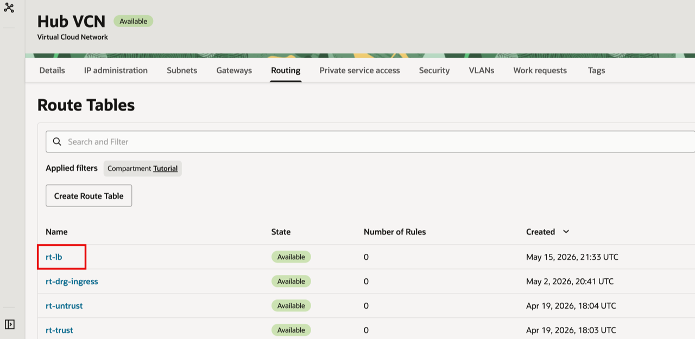

<!-- -->

1. Click on the **Route Rules** tab.
2. Add the two route rules: `10.0.0.0/24 → DRG` (for the APP-VM path) and `0.0.0.0/0 → 172.16.0.25` (the Untrust NLB as a **Private IP** target for Internet return traffic).
3. Click the back arrow to return to the Hub VCN route tables list.

    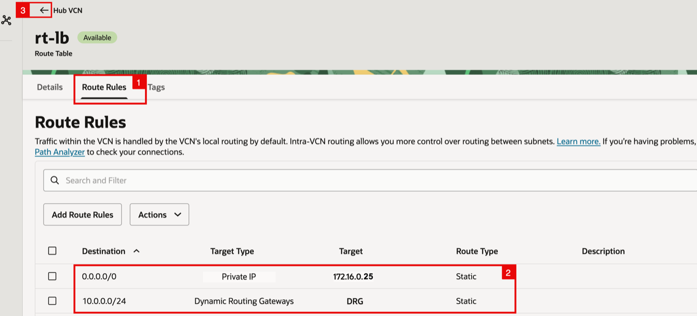

<!-- -->

1. Notice `rt-lb` includes the two route rules you just configured.
2. Click the back arrow to return to the **Virtual cloud networks** list.

    

#### Step 3: Configure `rt-app` (Spoke VCN - App Subnet route table)

This route table is attached to the **App Subnet** in the Spoke VCN. It sends return traffic destined for the LB Subnet (`172.16.0.48/28`) to the DRG, where `rt-spoke` then takes over.

- Click on the **Spoke VCN**.

    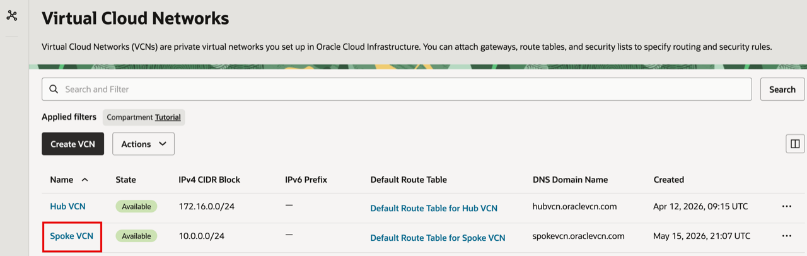

- Click on the **Routing** tab.

    

- Click on the route table **rt-app**.

    

<!-- -->

1. Click on the **Route Rules** tab.
2. Add the route rule `172.16.0.48/28 → DRG`.

    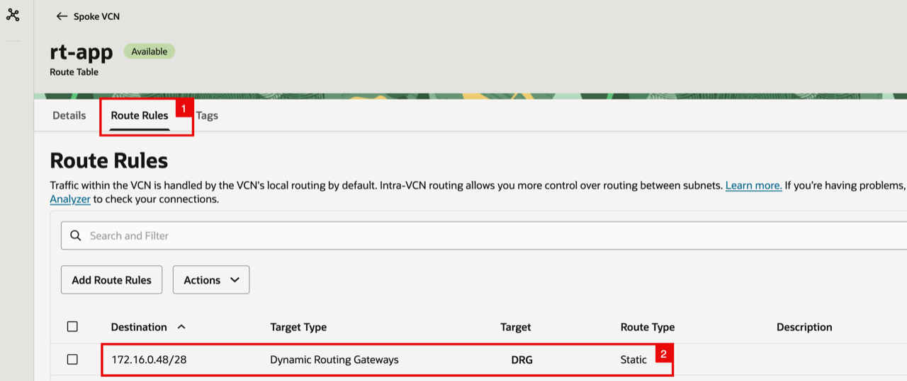

#### Step 4: Configure DRG route tables (`ird-hub`, `rt-hub`, `rt-spoke`)

The DRG holds two custom route tables: **`rt-hub`** (used by the Hub VCN attachment) and **`rt-spoke`** (used by the Spoke VCN attachment). `rt-hub` is populated dynamically from an **Import Route Distribution** (`ird-hub`), so it always reflects the current set of spokes without manual updates. `rt-spoke` carries a static route back to the Hub VCN attachment for the LB Subnet return path.

1. Click on the **hamburger menu**.
2. Click on **Networking**.
3. Click on **Dynamic routing gateway**.

    

    - Click on the **DRG** that is already deployed.

    

    - Click on the **Attachments** tab.

    

<!-- -->

1. Make sure you are in the VCN attachments section.
2. Notice the **VCN attachments** table: the **Hub VCN Attachment** uses DRG route table `rt-hub` and the **Spoke VCN Attachment** uses `rt-spoke`.

    

    - Click on the **rt-hub** link in the **DRG route table** column for the **Hub VCN Attachment**.

    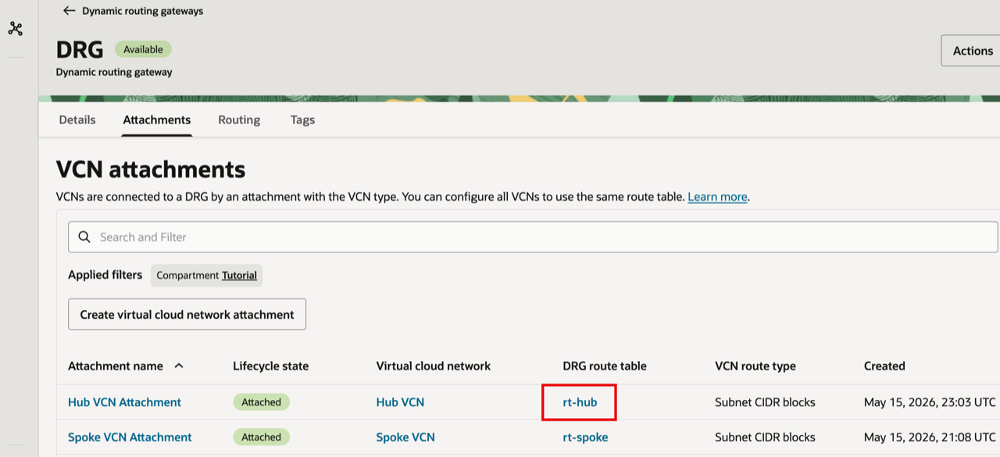

    - On the **rt-hub** Details page, click on the **ird-hub** link in the **Import route distribution** field.

    

    - Click on the **Statements** tab.

    

<!-- -->

1. Notice the single statement in `ird-hub`: priority `10`, match type **Attachment**, match criteria **Spoke VCN Attachment**. This is what makes the DRG dynamically import the Spoke VCN's CIDRs into `rt-hub`. You can instead use match type **Attachment type** and select **Virtual Cloud Network** to import future spokes automatically.
2. Click the back arrow to return to the DRG.

    

    - Click on the route table **rt-hub**.

    

    - On the **rt-hub** Details page, click on the **Get all route rules** button to view the dynamic routes learned via `ird-hub`. 

    

<!-- -->

1. Notice the **DYNAMIC** entry: destination `10.0.0.0/28` (the Spoke's App Subnet CIDR), next hop **Virtual Cloud Network → Spoke VCN Attachment**, learned via the `ird-hub` import distribution. 
2. Click on the **Close** button.

    

    - Click the back arrow to return to the DRG route tables list.

    

    - Click on the route table **rt-spoke**.

    

<!-- -->

1. Notice the **rt-spoke** Details page: **Import route distribution** is `-` (no dynamic routing).
2. Click on the **Static route rules** tab.

    

    - Notice the single static route in `rt-spoke`: `172.16.0.48/28 → Hub VCN Attachment`. This is what carries the spoke's LB-Subnet-bound return traffic back to the Hub for firewall inspection.

    

#### Step 5: Configure Palo Alto routes routes

The selected firewall needs a specific static route for the ALB subnet and a default route for Internet egress. The APP-VM route is handled by the ALB and DRG, not by the firewall virtual router. The next hop `172.16.0.17` is the OCI default gateway for the Untrust subnet.

- `172.16.0.48/28` — `ethernet1/1`, next hop `172.16.0.17`
- `0.0.0.0/0` — `ethernet1/1`, next hop `172.16.0.17`

Open the selected firewall's management Web GUI, then:

1. Sign in to the selected firewall's Web GUI, then click on the **Network** tab.
2. Click on **Virtual Routers**.
3. Click on the **default** virtual router.

    

    - In the **Virtual Router - default** dialog, click on **Static Routes** in the left-hand menu.

    

    Make sure this is done:
    - On the **IPv4** sub-tab, click **Add** and create `route-to-lb` (Destination `172.16.0.48/28`, Interface `ethernet1/1`, Next Hop **IP Address** `172.16.0.17`).
    - Click **Add** again and create `route-to-internet` (Destination `0.0.0.0/0`, Interface `ethernet1/1`, Next Hop **IP Address** `172.16.0.17`).

<!-- -->

1. Notice both routes are listed in the IPv4 table.
2. Click on the **OK** button to save the Virtual Router configuration.

    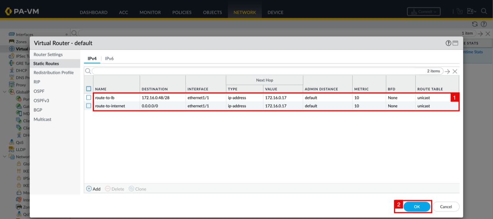

#### Step 6: Commit Palo Alto config

- Notice that the **default** Virtual Router now shows **Static Routes: 2**. Click on the **Commit** button at the top right.

    

<!-- -->

1. Select **Commit All Changes**.
2. In the **Commit** dialog, click the **Commit** button to confirm.

    

- The **Commit Status** dialog shows the operation as **Pending** while the configuration is applied.

    

- Notice the **Commit Status** shows **Completed** and **Successful**.

    

## Task 3: Test and Validate

- In the OCI Console, open the **Public-ALB** load balancer details. 

1. Notice the **Overall health** is **OK**.
2. And the **IP address** shows the assigned public IP. 

    This confirms the ALB is up and the backend (APP-VM) is healthy.

    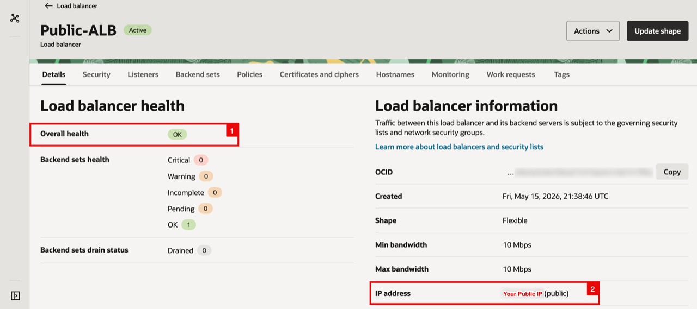

<!-- -->

1. From a browser on your local machine, enter the **public IP address assigned to Public-ALB** in the address bar.
2. Verify that the APP-VM web page loads and that **Source IP of request** shows the ALB private IP (`172.16.0.50` in this lab). This is expected: the APP-VM sees the ALB as the source, not the original Internet client. The `172.16.0.50` address is from the LB Subnet CIDR (`172.16.0.48/28`) and is the source IP the public ALB uses when connecting to the APP-VM.

    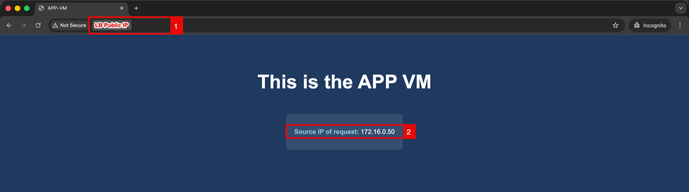

<!-- -->

1. On the selected firewall, open **Monitor**.
2. Click on **Traffic**.
3. Verify the matching sessions:
   - **Source:** `172.16.0.50` (ALB private IP)
   - **Destination:** `10.0.0.10` (APP-VM)
   - **Port:** `80`
   - **Application:** `web-browsing`
   - **Rule:** `allow-all-temp`
   - **Action:** `allow`
   - **Zones:** `untrust-zone` to `untrust-zone`

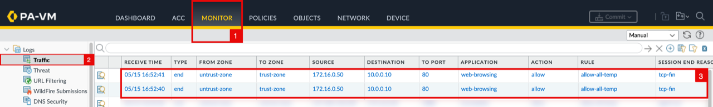

## Learn More

- [OCI Load Balancer Overview](https://docs.oracle.com/en-us/iaas/Content/Balance/)
- [OCI Web Application Firewall](https://docs.oracle.com/en-us/iaas/Content/WAF/)
- [OCI VCN Route Tables](https://docs.oracle.com/en-us/iaas/Content/Network/Tasks/managingroutetables.htm)
- [OCI Dynamic Routing Gateway (DRG)](https://docs.oracle.com/en-us/iaas/Content/Network/Tasks/managingDRGs.htm)
- [Palo Alto Static Routes](https://docs.paloaltonetworks.com/ngfw/networking/static-routes)
- [Palo Alto View and Manage Logs](https://docs.paloaltonetworks.com/ngfw/administration/monitoring/view-and-manage-logs)

## Acknowledgements

- **Authors** - Anas Abdallah, Iwan Hoogendoorn (Cloud Networking Black Belts)
- **Contributor** - Antonio Gámir (Cloud Networking Black Belt)
- **Last Updated By/Date** - Anas Abdallah, October 2026

You may now **proceed to the next lab**.
