# Configure Hybrid Connectivity via IPSec VPN

## Introduction

In this lab, you configure routing for Site-to-Site IPSec connectivity between **one selected Palo Alto firewall** in OCI and a remote site. Although the Active/Active deployment contains two firewalls, a single OCI IPSec connection and its two tunnels terminate directly on only one firewall; the firewall owns the IKE/IPSec SAs, tunnel interfaces, and session state.

The worked example uses **PA-VM-01**. To use **PA-VM-02** instead, create a separate CPE and a separate OCI IPSec connection with its own two tunnels that terminates directly on PA-VM-02. Do not place one IPSec connection behind, or load-balance it through, either NLB.

This lab uses an OCI native DRG in Milan as the demonstration remote site. The same design applies when the IPSec peer is on-premises, in another cloud, or in another OCI environment.

Estimated Time: 30 minutes

### Objectives

In this lab, you will:

- Configure Frankfurt VCN and DRG route tables to steer traffic to the selected IPSec-terminating Palo Alto firewall.
- Configure Palo Alto virtual-router static routes and ECMP for the redundant IPSec tunnels.
- Configure Milan VCN and DRG routes for return connectivity through the IPSec tunnels.
- Validate IPSec connectivity and confirm inspected traffic in Palo Alto logs.

### Prerequisites

Before following the routing steps below, complete the items that are out of scope for this workshop. They are not part of the routing configuration itself, but they have to exist before any of the routes you are about to create are useful.

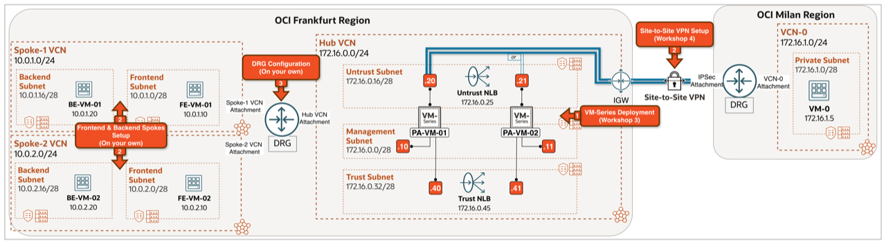

<!-- -->

1. Complete [Deploy Palo Alto NGFW in OCI with Active/Active HA](https://livelabs.oracle.com/ords/dbpm/r/livelabs/view-workshop?wid=4493). This workshop deploys the baseline Active/Active Palo Alto VM-Series pair in OCI Frankfurt, including the Hub VCN, subnets, Internet Gateway, and base firewall configuration.

2. Complete [Setup IPSec Site-to-Site VPN on Palo Alto NGFW in OCI](https://livelabs.oracle.com/ords/dbpm/r/livelabs/view-workshop?wid=4500). Configure the **Site-to-Site IPSec VPN** between the OCI native DRG in Milan and the firewall selected to terminate this connection. In this worked example, configure PA-VM-01 only. Ensure that Phase 1 and Phase 2 are up before configuring routing for this lab.

Palo Alto IPSec endpoint in OCI Frankfurt:

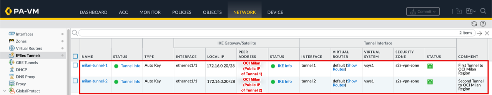

OCI native Site-to-Site VPN endpoint in Milan:

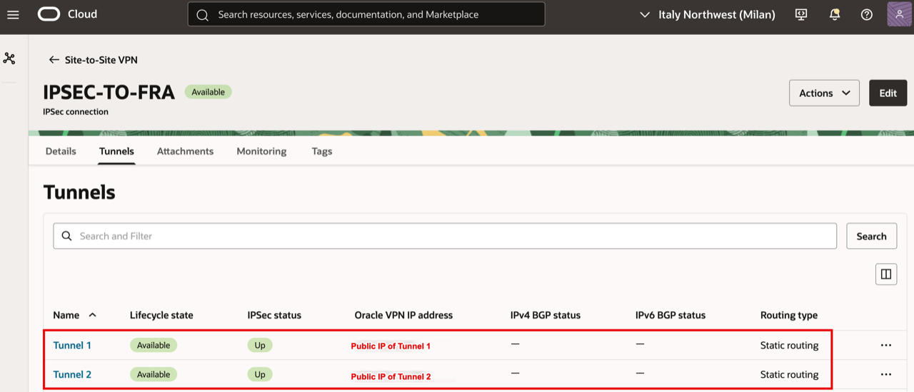

3. Provision two Spoke VCNs with Oracle Linux 9 VMs (or use an existing workload or application in your environment):
    
    |VCN|VCN CIDR|Subnet|VM|
    |---|---|---|---|
    |Spoke-1|`10.0.1.0/24`|Frontend `10.0.1.0/28`|FE-VM-01 `10.0.1.10`|
    |||Backend `10.0.1.16/28`|BE-VM-01 `10.0.1.20`|
    |Spoke-2|`10.0.2.0/24`|Frontend `10.0.2.0/28`|FE-VM-02 `10.0.2.10`|
    |||Backend `10.0.2.16/28`|BE-VM-02 `10.0.2.20`|

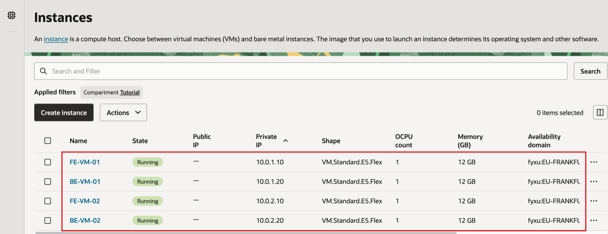

4. Attach the Hub, Spoke-1, and Spoke-2 VCNs to the DRG. Then, assign the DRG and VCN route tables according to the table below:

| Attachment             | DRG Route Table | VCN Route Table |
| ---------------------- | --------------- | --------------- |
| Hub VCN Attachment     | rt-hub          | rt-drg-ingress  |
| Spoke-1 VCN Attachment | rt-spoke        | -               |
| Spoke-2 VCN Attachment | rt-spoke        | -               |

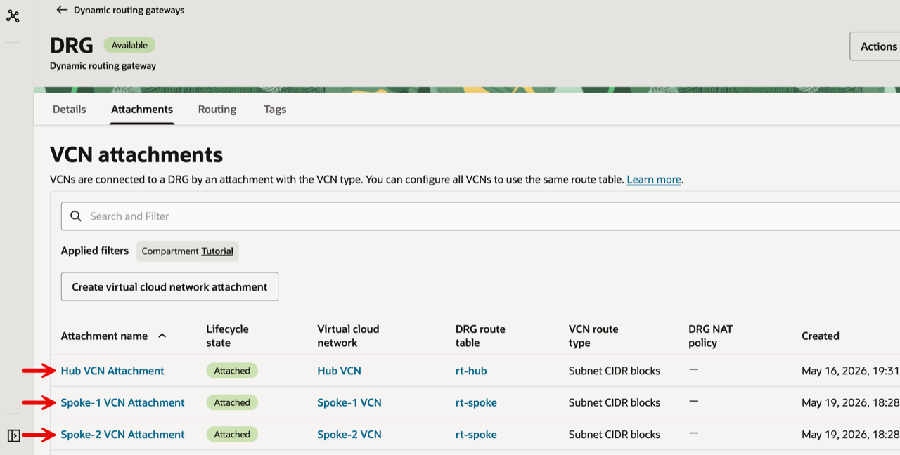

A **VCN Route Table** is assigned to a DRG attachment (also called an **Ingress** or **Transit Route Table**) when traffic entering the Hub VCN through the DRG needs to be steered to a destination other than what the VCN's local routing would pick. In this scenario, it steers Milan-bound return traffic directly to the Trust private IP of the firewall that terminates the IPSec connection, instead of allowing local VCN routing to bypass that firewall. The same principle applies to other gateways (IGW, SGW, NAT GW): you assign an Ingress Route Table to them when the default VCN routing is not what you want.

## Task 1: Review the Use Case

In this design, which builds on **Part 4 (Site-to-Site VPN)**, traffic from the Frankfurt spoke VCNs reaches a remote site through the directly connected IPSec tunnels on PA-VM-01. PA-VM-01 inspects both the request and return traffic before it enters or leaves the tunnels.

> **Worked example:** PA-VM-01 terminates this connection, using its Untrust interface `172.16.0.20` and Trust interface `172.16.0.40`. PA-VM-02 can be used instead only with its own CPE, OCI IPSec connection, and tunnel pair; then replace the direct Trust target with `172.16.0.41`. Do not configure both Trust targets for this one Milan CIDR.

This lab uses an OCI native DRG and VCN in Milan as the demonstration remote site. The same routing pattern applies to an on-premises network, another cloud, or another OCI environment.

### This is the right choice when:

- You need inspected Site-to-Site IPSec connectivity between OCI workloads and a remote site.
- You need security-policy enforcement and traffic logs for traffic crossing the IPSec tunnels.

### Traffic Flow:

1. A workload at the remote site initiates a connection to an OCI workload. In this lab, **VM-0** (`172.16.1.5`) in OCI Milan connects to **FE-VM-01** (`10.0.1.10`) in Frankfurt Spoke-1. The Milan Private Subnet route table sends `10.0.1.0/24` to the **DRG**.
2. The Milan DRG forwards the packet through PA-VM-01's Site-to-Site IPSec tunnels. The IKE and ESP traffic terminates directly on PA-VM-01's Untrust interface; this lab uses `tunnel.1` and `tunnel.2` with ECMP for redundancy.
3. PA-VM-01 inspects the packet and forwards it through its Trust private IP (`172.16.0.40`) to the Hub VCN attachment. The Hub **`rt-trust`** route table routes the Spoke-1 CIDR to the **DRG**.
4. The Frankfurt DRG forwards the packet through the appropriate spoke VCN attachment. In this example, **FE-VM-01** receives it in the Spoke-1 Frontend Subnet. The same inspected path is available to both Spoke-1 and Spoke-2 subnets.
5. Return traffic follows the same path in reverse: **FE-VM-01** sends the Milan CIDR to the DRG, whose ingress route directs it to PA-VM-01's Trust private IP (`172.16.0.40`). PA-VM-01 sends it through its Untrust interface and the IGW to its IPSec VPN, then back to **VM-0**. This path does not use either NLB.

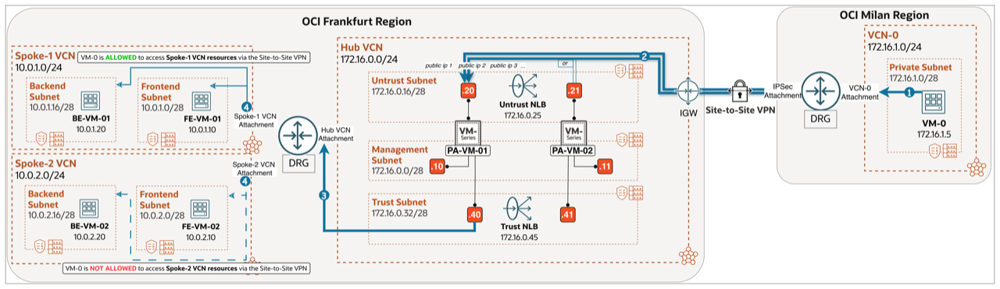

## Task 2: Configure Routing

The diagram below summarises the routing plan for Lab 7.

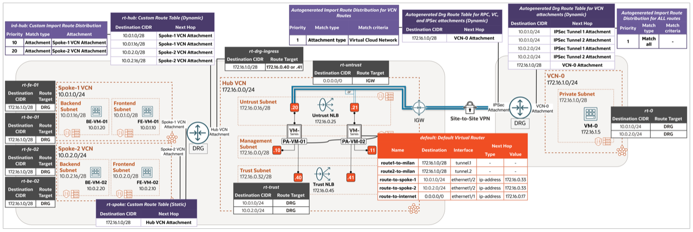

> **Note:** Routing has three parts: OCI VCN route tables control traffic leaving each subnet, OCI DRG route tables control traffic between attachments, and the virtual router on the IPSec-terminating firewall controls forwarding through that firewall.

#### Step 1: Open the Hub VCN Routing view

1. Select the correct **region**.
2. Click on the **hamburger menu** in the top left corner.

    

<!-- -->

1. Click on **Networking**.
2. Click on **Virtual cloud networks**.

    

- Click on the **Hub VCN**.

    

- Click on the **Routing** tab.

    

#### Step 2: Configure `rt-drg-ingress` (Frankfurt Hub VCN - DRG attachment ingress route table)

For this worked example, route traffic destined for Milan (`172.16.1.0/28`) directly to PA-VM-01's Trust private IP (`172.16.0.40`). Do not send this return path through either NLB and do not add `172.16.0.41` as another target for the same Milan CIDR.

If you instead deploy the separate PA-VM-02 IPSec connection and tunnel pair, use `172.16.0.41` here and configure its corresponding CPE and tunnels. Use one direct target per IPSec connection.

- Click on the route table **rt-drg-ingress**.

    

<!-- -->

1. Click on the **Route Rules** tab.
2. Add the route rule `172.16.1.0/28 → 172.16.0.40` (target type **Private IP**), which targets PA-VM-01, the firewall that terminates this connection's IPSec tunnels.
3. Click the back arrow to return to the Hub VCN route tables list.

    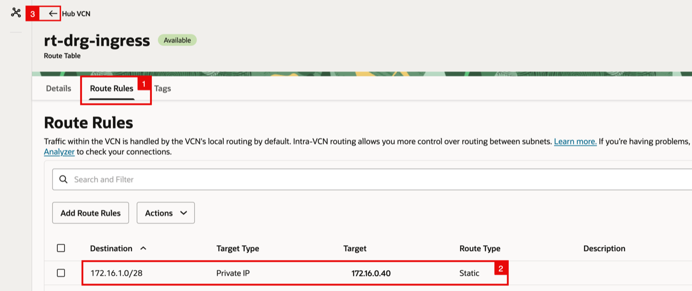

#### Step 3: Configure `rt-untrust` (Frankfurt Hub VCN - Untrust subnet route table)

The Untrust subnet route table needs `0.0.0.0/0 → IGW` for PA-VM-01's Internet egress and for terminating this IPSec connection.

- Click on the route table **rt-untrust**.

    

<!-- -->

1. Click on the **Route Rules** tab.
2. Add the route rule `0.0.0.0/0 → IGW`.
3. Click the back arrow to return to the Hub VCN route tables list.

    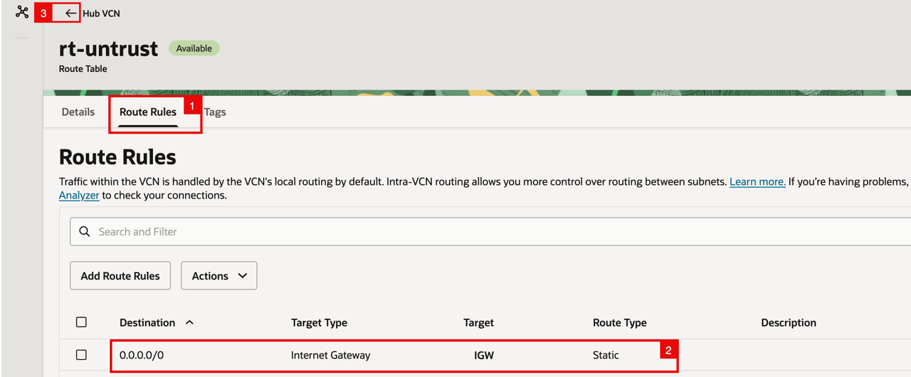

#### Step 4: Configure `rt-trust` (Frankfurt Hub VCN - Trust subnet route table)

The Trust subnet route table sends both spoke CIDRs back to the DRG so PA-VM-01 can deliver inspected packets to either spoke.

- Click on the route table **rt-trust**.

    

<!-- -->

1. Click on the **Route Rules** tab.
2. Add the two route rules `10.0.1.0/24 → DRG` and `10.0.2.0/24 → DRG`.
3. Click the back arrow to return to the Hub VCN route tables list.

    

<!-- -->

1. Notice that `rt-drg-ingress` and `rt-untrust` each have one rule, and `rt-trust` has two rules.
2. Click the back arrow to return to the **Virtual cloud networks** list.

    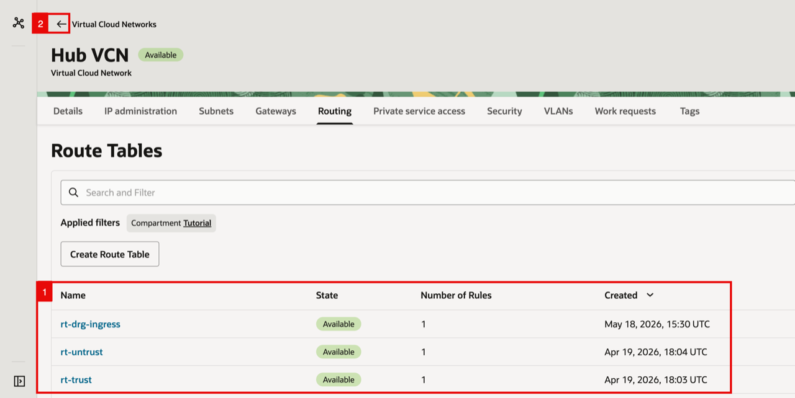

#### Step 5: Configure Spoke subnet route tables (`rt-fe-01`, `rt-be-01`, `rt-fe-02`, `rt-be-02`)

Each spoke subnet sends traffic for the Milan subnet (`172.16.1.0/28`) to the DRG, so Milan-bound traffic is routed through the Hub.

- Click on **Spoke-1 VCN**.

    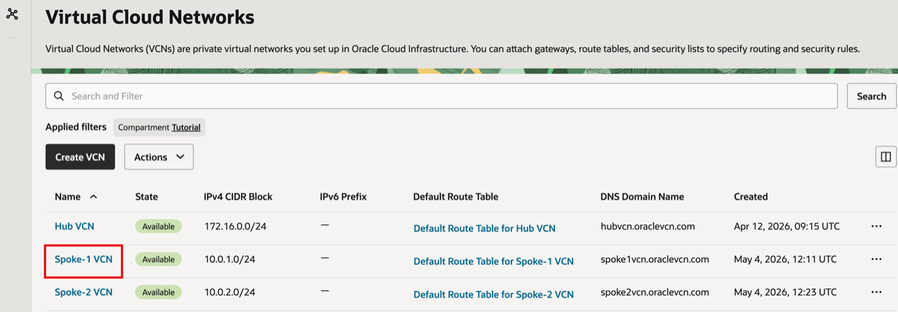

- Click on the **Routing** tab.

    

- Click on the route table for the **Frontend Subnet** (`rt-fe-01`).

    

<!-- -->

1. Click on the **Route Rules** tab.
2. Add the route rule `172.16.1.0/28 → DRG`.
3. Then click the back arrow.

    

- Click on the route table for the **Backend Subnet** (`rt-be-01`).

    

<!-- -->

1. Click on the **Route Rules** tab.
2. Add the route rule `172.16.1.0/28 → DRG`.
3. Then click the back arrow.

    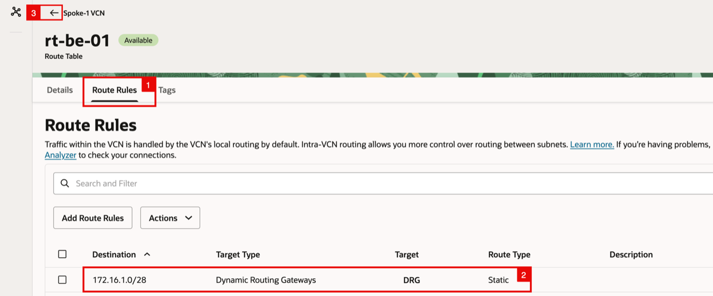

<!-- -->

1. Notice that both `rt-fe-01` and `rt-be-01` now have one rule.
2. Click the back arrow to return to the **Virtual cloud networks** list.

    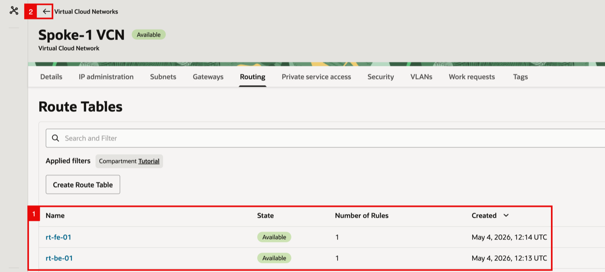

- Click on **Spoke-2 VCN**.

    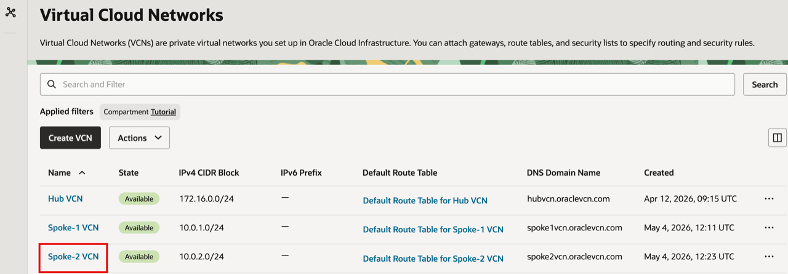

- Click on the **Routing** tab.

    

- Click on the route table for the Spoke-2 **Frontend Subnet** (`rt-fe-02`).

    

<!-- -->

1. Click on the **Route Rules** tab.
2. Add the route rule `172.16.1.0/28 → DRG`.
3. Then click the back arrow.

    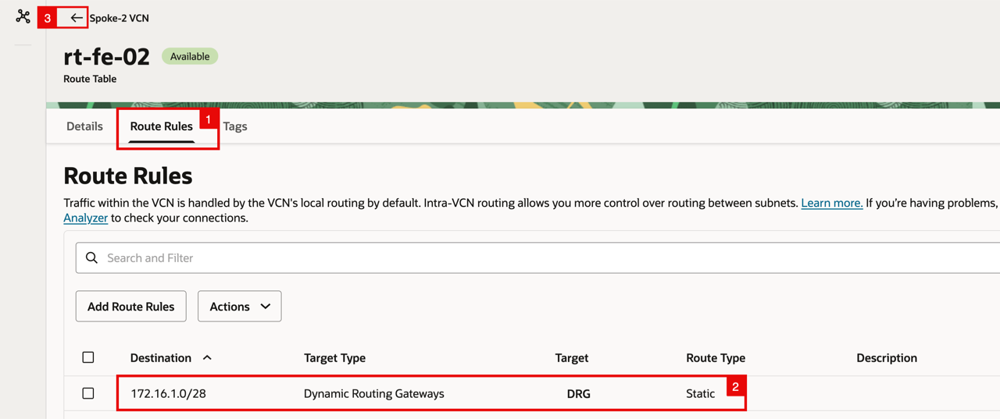

- Click the back arrow, then click on the route table for the Spoke-2 **Backend Subnet** (`rt-be-02`).

    

<!-- -->

1. Click on the **Route Rules** tab.
2. Add the route rule `172.16.1.0/28 → DRG`.

    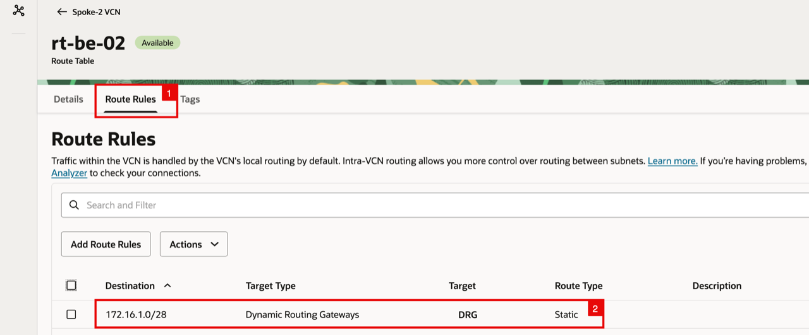

- All four spoke subnet route tables now carry `172.16.1.0/28 → DRG`, so any spoke workload can reach Milan through the Hub and PA-VM-01's IPSec tunnel pair.

#### Step 6: Configure DRG route tables (`ird-hub`, `rt-hub`, `rt-spoke`)

The DRG holds two route tables: **`rt-hub`** (used by the Hub VCN attachment) and **`rt-spoke`** (used by the Spoke VCN attachment). `rt-hub` is populated dynamically from an **Import Route Distribution** (`ird-hub`), so it always reflects the current set of spokes without manual updates. `rt-spoke` carries a static route back to the Hub VCN attachment for the Milan VCN-0 return path.

1. Click on the **hamburger menu**.
2. Click on **Networking**
3. Click on **Dynamic routing gateway**.

    

- Click on the **DRG**.

    

- Click on the **Attachments** tab.

    

<!-- -->

1. Make sure you are in the VCN attachments section.
2. Notice the **VCN attachments** table: the **Hub VCN Attachment** uses DRG route table `rt-hub`; the **Spoke-1 VCN Attachment** and **Spoke-2 VCN Attachment** use `rt-spoke`.

    

- Click on the **rt-hub** link in the **DRG route table** column for the **Hub VCN Attachment**.

    

- On the **rt-hub** Details page, click on the **ird-hub** link in the **Import route distribution** field.

    

- Click on the **Statements** tab.

    

<!-- -->

1. Confirm two statements: priority `10` Spoke-1 VCN Attachment and priority `20` Spoke-2 VCN Attachment. You can instead use match type **Attachment type** and select **Virtual Cloud Network** to import future spokes automatically.
2. Click the back arrow.

    

- On the DRG, click on the **Routing** tab and notice both `rt-hub` and `rt-spoke` are present. Click on the route table **rt-hub**.

    

- On the **rt-hub** details page, click the **Get all route rules** button to view the dynamic routes.

    

<!-- -->

1. Notice the **four DYNAMIC entries**: 
    - `10.0.1.0/28` and `10.0.1.16/28` (Spoke-1 FE/BE subnets) via **Spoke-1 VCN Attachment**, 
    - `10.0.2.0/28` and `10.0.2.16/28` (Spoke-2 FE/BE subnets) via **Spoke-2 VCN Attachment**. 
2. Click **Close**.

    

- Click the back arrow to return to the DRG route tables list.

    

- Click on the route table **rt-spoke**.

    

<!-- -->

1. Notice the **rt-spoke** Details page: **Import route distribution** is `-` (no dynamic routing).
2. Click on the **Static route rules** tab.

    

- Notice the single static route `172.16.1.0/28 → Hub VCN Attachment` (next hop attachment type **Virtual Cloud Network**). 
- This is what carries Milan-bound spoke traffic back into the Hub for Palo Alto inspection.

    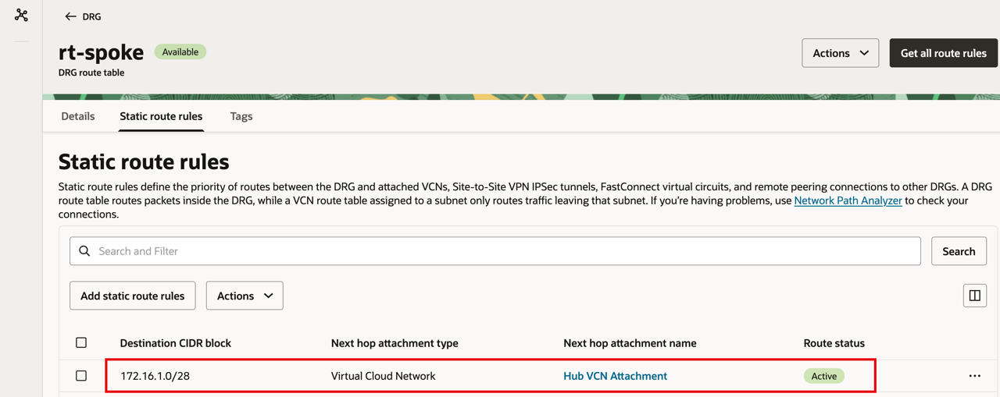

#### Step 7: Configure Palo Alto routes routes

The OCI DRG and VCN route tables deliver traffic to the correct Palo Alto interface, but PA-VM-01's default Virtual Router still needs static routes to forward each destination CIDR. The next-hop addresses used below are the OCI **default gateways** for the firewall subnets: `172.16.0.33` for the Trust subnet and `172.16.0.17` for the Untrust subnet. For this Lab 7 connection, configure PA-VM-01 with:

- `172.16.1.0/28` — `tunnel.1`
- `172.16.1.0/28` — `tunnel.2`
- `10.0.1.0/24` — `ethernet1/2`, next hop `172.16.0.33`
- `10.0.2.0/24` — `ethernet1/2`, next hop `172.16.0.33`
- `0.0.0.0/0` — `ethernet1/1`, next hop `172.16.0.17`

The two Milan routes use ECMP across PA-VM-01's IPSec tunnels for redundancy. Do not configure PA-VM-02 as an alternate endpoint for this same connection. If PA-VM-02 is selected instead, create its separate CPE, OCI IPSec connection, and tunnel pair, then configure the equivalent routes on PA-VM-02.

Open **PA-VM-01**'s Web GUI, then:

1. Sign in to PA-VM-01's Web GUI, then click on the **Network** tab.
2. Click on **Virtual Routers**.
3. Click on the **default** virtual router.

    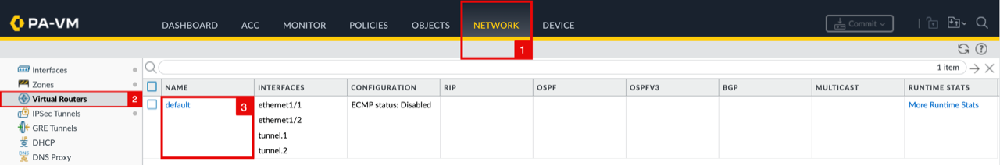

- In the **Virtual Router - default** dialog (Router Settings → General), verify that `ethernet1/1`, `ethernet1/2`, `tunnel.1`, and `tunnel.2` are listed.
- Click on the **ECMP** tab to enable load-sharing across the two IPSec tunnels.

    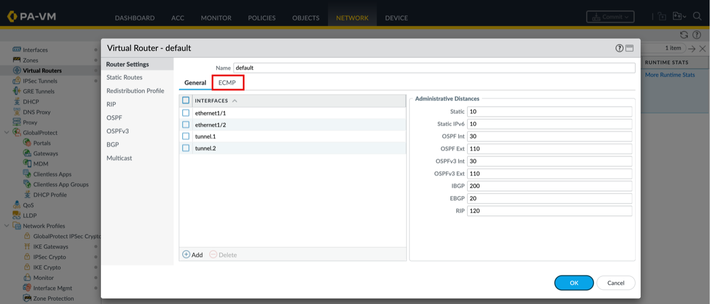

<!-- -->

1. Check **Enable** to turn ECMP on.
2. Set **Method** to `Weighted Round Robin` (and leave **Max Path** at `2` for the two tunnels).
3. Click on **Static Routes** in the left-hand menu to start adding routes.

    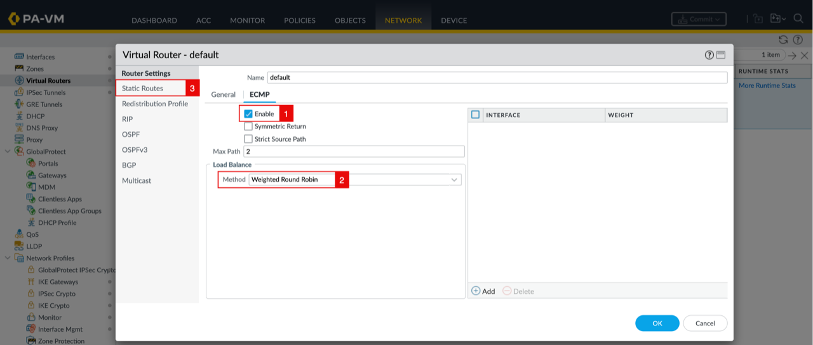

<!-- -->

1. On the **IPv4** sub-tab, click **Add** and create the required routes for this scenario:

    - `route1-to-milan` (Destination `172.16.1.0/28`, Interface `tunnel.1`)
    - `route2-to-milan` (Destination `172.16.1.0/28`, Interface `tunnel.2`)
    - `route-to-spoke-1` (Destination `10.0.1.0/24`, Interface `ethernet1/2`, Next Hop `172.16.0.33`)
    - `route-to-spoke-2` (Destination `10.0.2.0/24`, Interface `ethernet1/2`, Next Hop `172.16.0.33`)
    - `route-to-internet` (Destination `0.0.0.0/0`, Interface `ethernet1/1`, Next Hop `172.16.0.17`)

2. Click on the **OK** button to save the Virtual Router configuration. In the **ECMP Configuration Change** dialog, click **Yes**. The virtual router restarts and re-converges in a few seconds.

    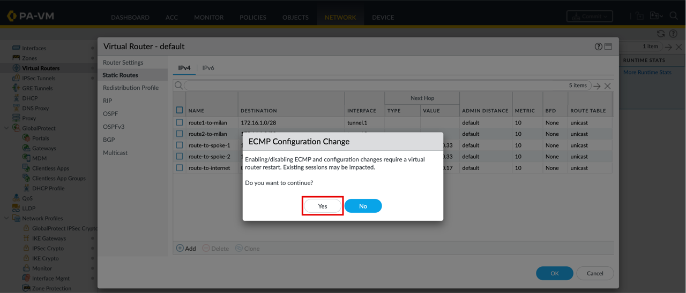

<!-- -->

1. Confirm the five static routes in the IPv4 table.
2. Click on **OK**.

    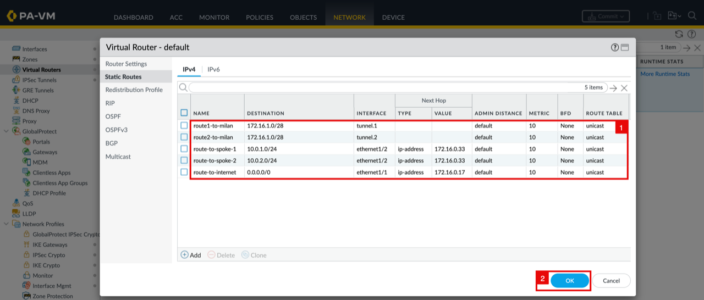

- Notice that the **default** Virtual Router now shows **Static Routes: 5** and **ECMP status: Enabled**. Click on the **Commit** button at the top right.

    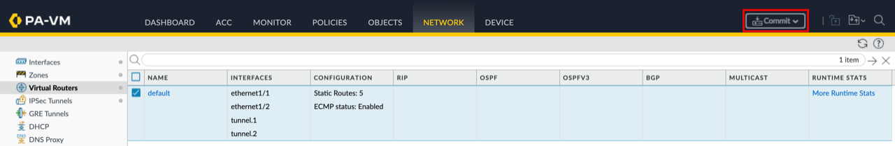

<!-- -->

1. Select **Commit All Changes**.
2. In the **Commit** dialog, click the **Commit** button to confirm.

    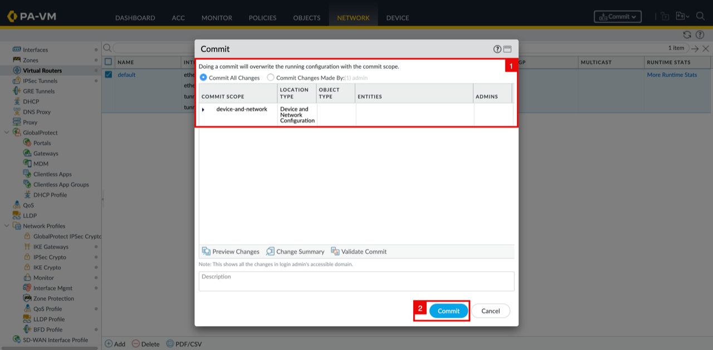

- The **Commit Status** dialog shows the operation as **Pending** while the configuration is applied.

    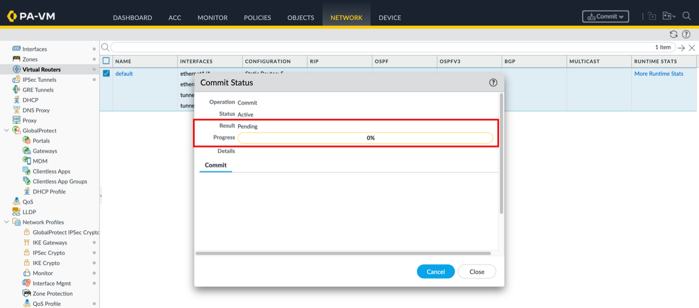

- Notice the **Commit Status** shows **Completed** and **Successful**.

    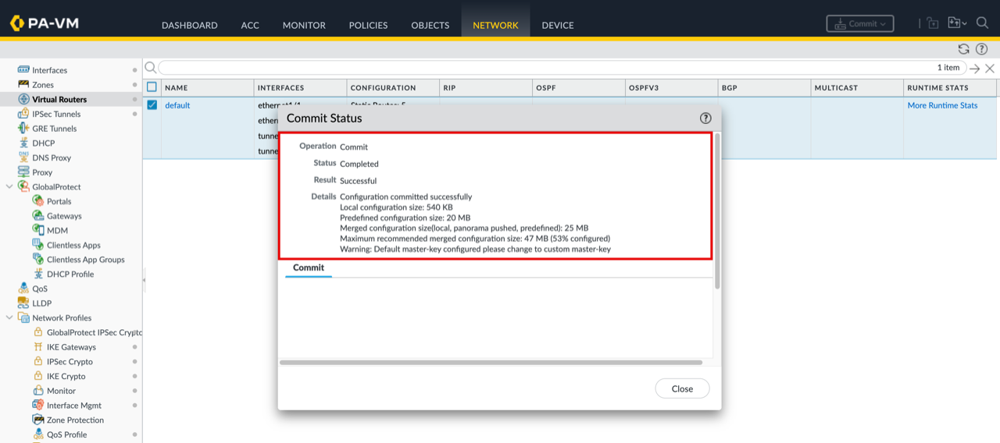

#### Step 8: Configure `rt-0` (Milan VCN-0 - Private subnet route table)

The Milan Private Subnet needs `10.0.1.0/24` routed to the **DRG**, so VM-0 can reach the permitted Frankfurt Spoke-1 workload through the tunnel.

- Switch the region to **Italy Northwest (Milan)** and click on the **hamburger menu**.

    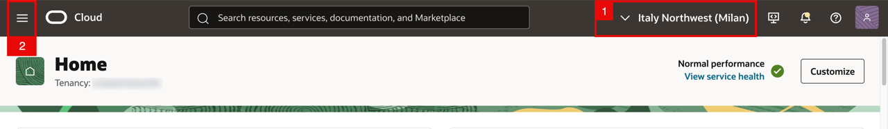

<!-- -->

1. Click on **Networking**.
2. Click on **Virtual cloud networks**.

    

- Click on **VCN-0** (CIDR `172.16.1.0/24`).

    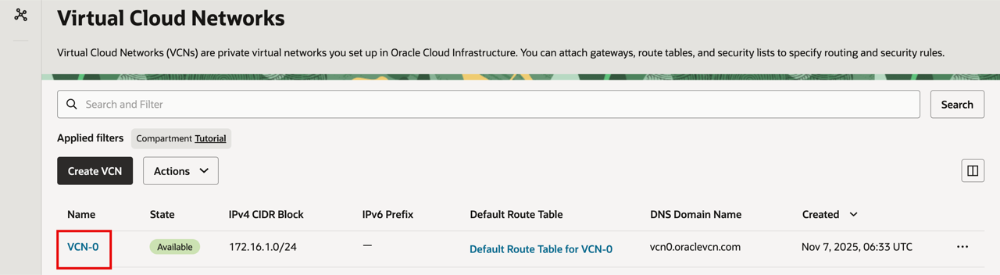

- Click on the **Routing** tab.

    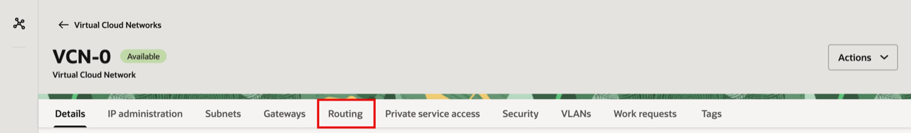

- Click on the route table attached to the Private Subnet (`rt-0`).

    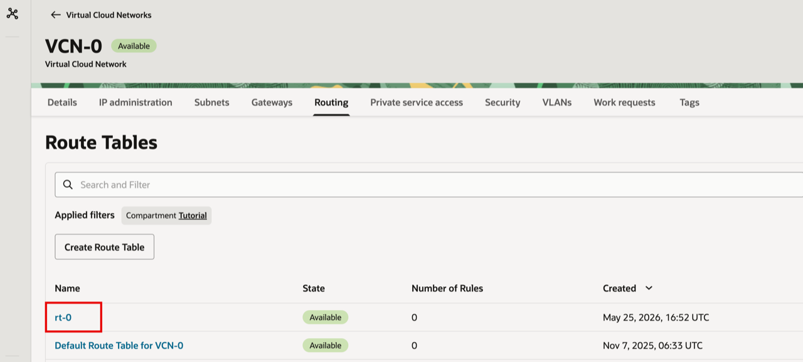

<!-- -->

1. Click on the **Route Rules** tab.
2. Add the route rule `10.0.1.0/24 → DRG`.

    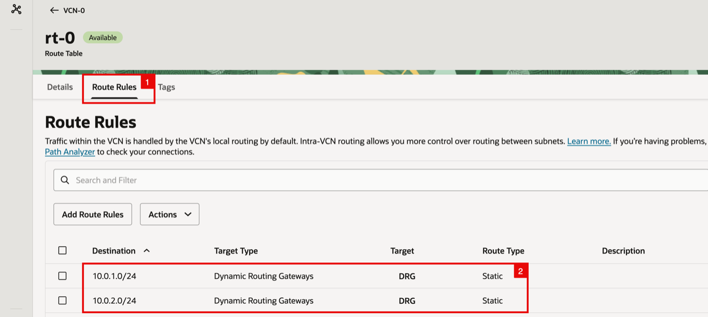

#### Step 9: Configure Milan DRG route tables

This lab keeps OCI's two default DRG route tables and import distributions:

- The VCN attachment uses **Autogenerated Drg Route Table for VCN attachments**. It routes traffic entering the DRG from Milan VCN-0. Its **Autogenerated Import Route Distribution for ALL routes** imports routes learned from all attachment types, including the IPSec tunnels, so Milan traffic can reach the remote site.
- Both IPSec tunnels use **Autogenerated Drg Route Table for RPC, VC, and IPSec attachments**. It routes traffic entering the DRG from the remote site. Its **Autogenerated Import Route Distribution for VCN Routes** imports the Milan VCN route, so return traffic can reach Milan VCN-0.
- No custom DRG route tables or distributions are created. Use them in real designs to control route propagation explicitly.

1. Click on the **hamburger menu**.
2. Click on **Networking**
3. Click on **Dynamic routing gateway**.

    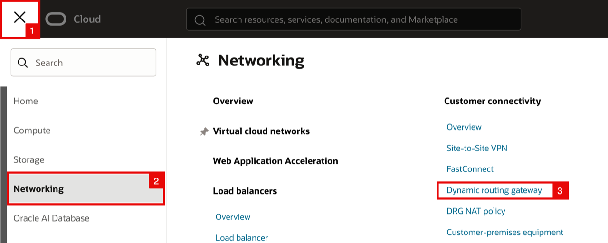

- Click on the Milan **DRG**. Notice that **Oracle redundancy status** is **Redundant**, reflecting the two IPSec tunnels configured in Part 4 of this workshop series.

    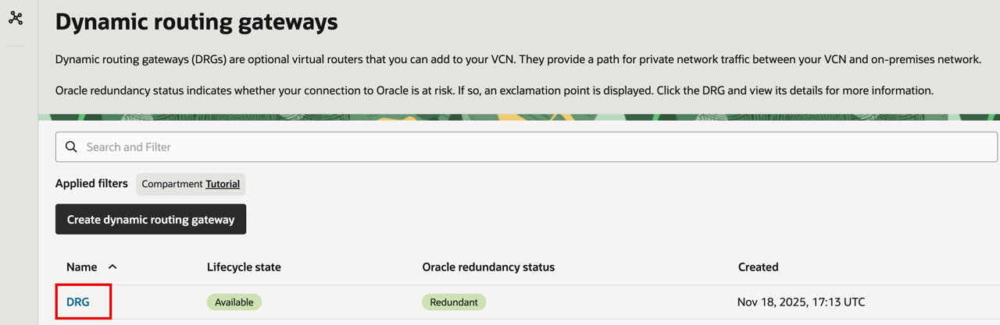

- Click on the **Attachments** tab.

    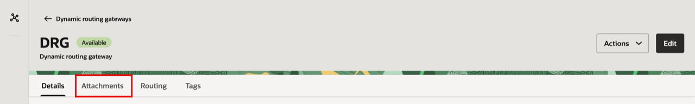

<!-- -->

1. In the **VCN attachments** section.
2. Notice the single attachment **VCN-0 Attachment** uses the **Autogenerated Drg Route Table for VCN attachments**.

    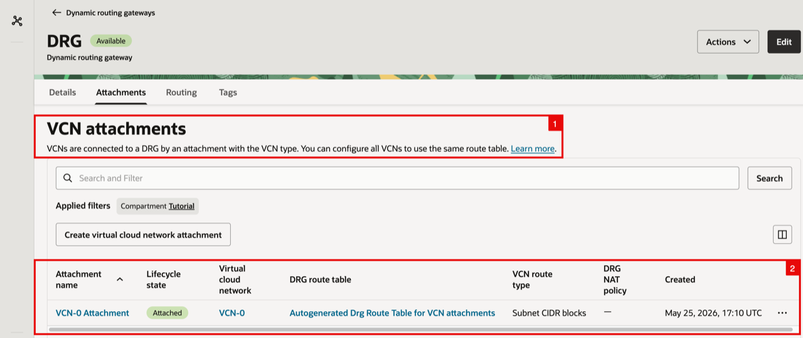

- Click on the **Autogenerated Drg Route Table for VCN attachments** link.

    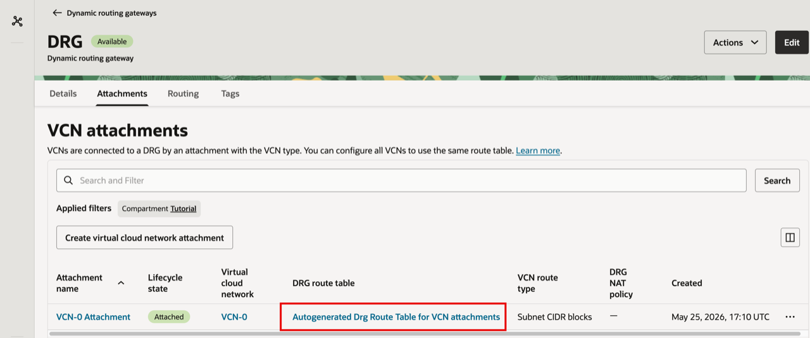

<!-- -->

1. Confirm the route table has **ECMP Enabled** and **Import route distribution = Autogenerated Import Route Distribution for ALL routes**.
2. Click on the **Get all route rules** button.

    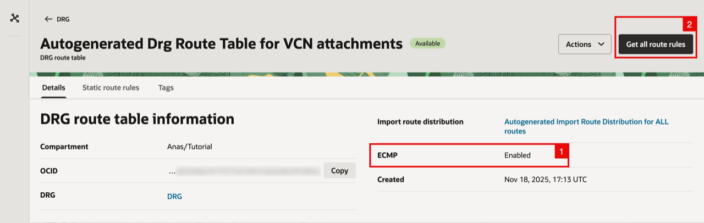

<!-- -->

1. Confirm the dynamic routes in the popup: each Frankfurt spoke CIDR (`10.0.1.0/24` and `10.0.2.0/24`) has two equal-cost paths—one through **Tunnel 1** and one through **Tunnel 2**, so ECMP can use both IPSec tunnels. The Milan VCN-0 CIDR (`172.16.1.0/28`) has one path through the **VCN-0 Attachment**.
2. Click **Close**.

    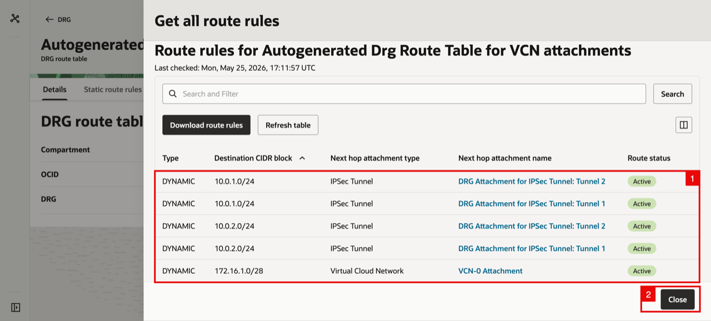

- Click the back arrow to return to the DRG.

    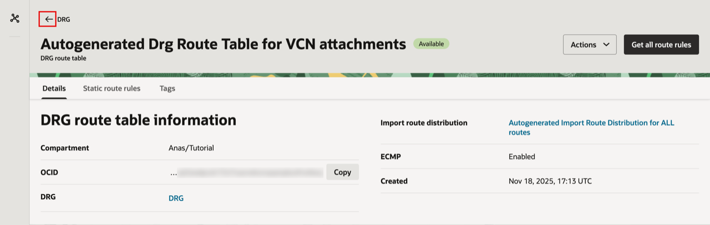

- On the DRG **Routing** tab, notice the two autogenerated tables (**Autogenerated Drg Route Table for RPC, VC, and IPSec attachments** and **Autogenerated Drg Route Table for VCN attachments**). Click on the **Attachments** tab to inspect the IPSec attachments next.

    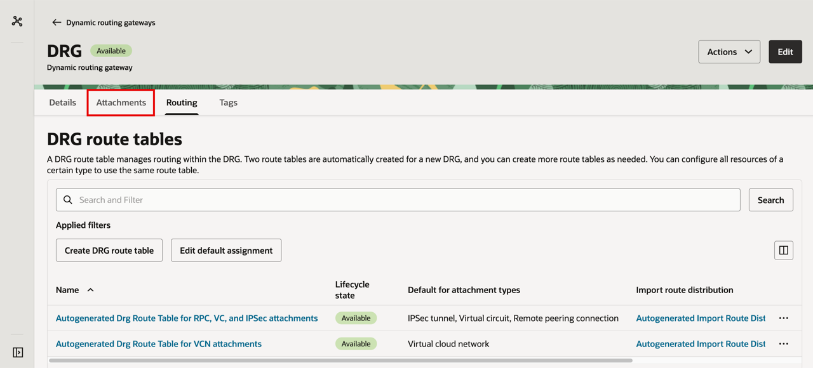

<!-- -->

1. Scroll down on the Attachments page to the **IPSec tunnel attachments** section. 
2. Notice the two IPSec attachments (one per tunnel - **DRG Attachment for IPSec Tunnel: Tunnel 1** and **DRG Attachment for IPSec Tunnel: Tunnel 2**), both pointing to **CPE-PANW-FRA** (the CPE for PA-VM-01 in this worked example) and both using the **Autogenerated Drg Route Table for RPC, VC, and IPSec attachments**.

    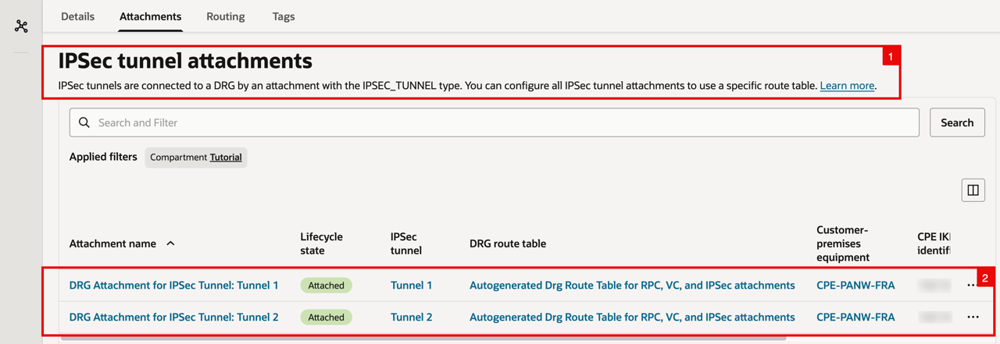

- Click on the **Autogenerated Drg Route Table for RPC, VC, and IPSec attachments** link.

    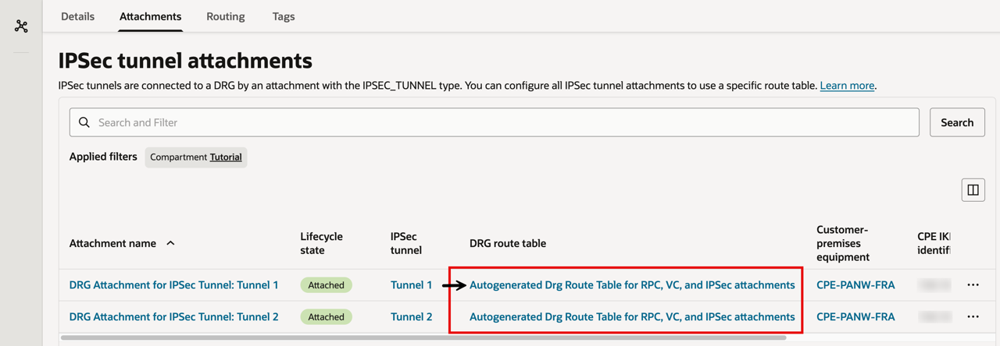

- On the route table details page, notice **Import route distribution = Autogenerated Import Route Distribution for VCN Routes** (so the tunnel side learns the Milan VCN-0 CIDR). Click on **Get all route rules**.

    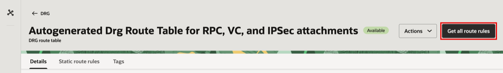

- Confirm the single dynamic entry: `172.16.1.0/28 → VCN-0 Attachment` (next hop attachment type **Virtual Cloud Network**). This is what lets Frankfurt-originated packets arriving over either tunnel reach Milan VM-0.

    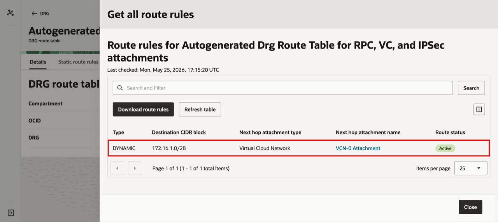

The Milan side is fully configured and all tunnel-learned routes are in place. Inter-region traffic between Frankfurt spokes and Milan VM-0 now flows over the IPSec tunnels with Palo Alto inspection on the Frankfurt side.

## Task 3: Test and Validate

- From **VM-0** in Milan (`172.16.1.5`), `ping` **FE-VM-01** in Frankfurt Spoke-1 (`10.0.1.10`). The session traverses PA-VM-01's Site-to-Site IPSec tunnel pair and is inspected by PA-VM-01.

    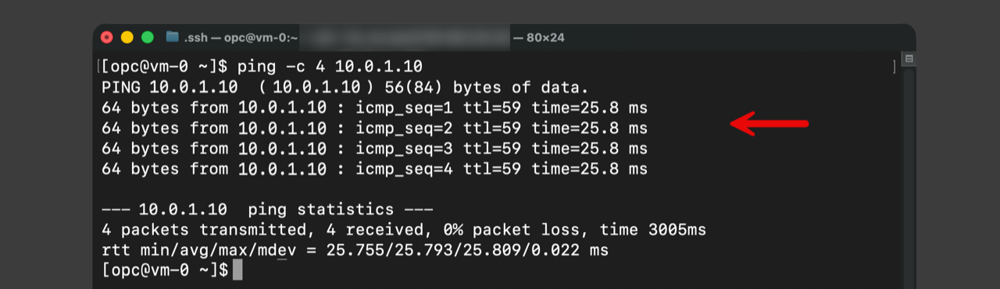

<!-- -->

1. Open **PA-VM-01**'s **Monitor**.
2. Click on **Traffic** log.
3. Notice the matching session: source = `172.16.1.5`, destination = `10.0.1.10`, source zone = **s2s-vpn-zone**, destination zone = **trust-zone**, application = `ping`, action = **allow**. This confirms that traffic from the remote site traversed PA-VM-01's IPSec tunnels and was inspected by PA-VM-01 before reaching Frankfurt Spoke-1. If you deploy the separate PA-VM-02 design, validate its own tunnel and session on PA-VM-02 instead.

    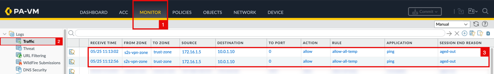

## Learn More

- [OCI VCN Route Tables](https://docs.oracle.com/en-us/iaas/Content/Network/Tasks/managingroutetables.htm)
- [OCI Dynamic Routing Gateway (DRG) and ECMP](https://docs.oracle.com/en-us/iaas/Content/Network/Tasks/managingDRGs.htm)
- [OCI Site-to-Site VPN Overview](https://docs.oracle.com/en-us/iaas/Content/Network/Tasks/overviewIPsec.htm)
- [Palo Alto Site-to-Site VPN with Static Routing](https://docs.paloaltonetworks.com/network-security/ipsec-vpn/administration/site-to-site-vpn-quick-configs/site-to-site-vpn-with-static-routing)
- [Palo Alto ECMP Settings](https://docs.paloaltonetworks.com/ngfw/help/12-1/network/network-virtual-routers/ecmp/ecmp-settings)
- [Palo Alto View and Manage Logs](https://docs.paloaltonetworks.com/ngfw/administration/monitoring/view-and-manage-logs)

## Acknowledgements

- **Authors** - Anas Abdallah, Iwan Hoogendoorn (Cloud Networking Black Belts)
- **Contributor** - Antonio Gámir (Cloud Networking Black Belt)
- **Last Updated By/Date** - Anas Abdallah, October 2026

You may now **proceed to the next lab**.
