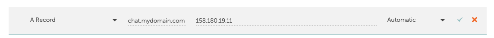

# Lab 3: Configure DNS and Deploy Open WebUI with Ansible

## Introduction

In this lab, you will configure DNS, prepare environment variables, configure region-specific models, provision host dependencies, and deploy Open WebUI + OCI gateway services.

Estimated Time: 40 minutes

### Objectives

In this lab, you will:
* Configure an `A` record for your chatbot domain
* Prepare environment variables for deployment
* Configure region-specific LLM and embedding models in `models.yaml`
* Provision Podman runtime dependencies with Ansible
* Deploy Open WebUI, OCI gateway, and Traefik containers

### Prerequisites

This lab assumes you have:
* Labs 1 and 2 completed
* Source repository cloned locally
* Public VM IP from OpenTofu output
* Access to your DNS provider

## Task 1: Configure DNS A record

This task maps your chatbot domain name to the OCI VM you created in Lab 2. DNS screens differ by provider, so the exact UI and field names may vary. The goal is always the same: route incoming requests for your domain to the VM public IP where the Open WebUI frontend is running.

1. Open your DNS provider portal.
2. Create an `A` record for your chatbot hostname (example: `chat.example.com`).
3. Point the record to the VM `public_ip` from Lab 2 (the value returned by OpenTofu output).

    

## Task 2: Prepare deployment environment file

This task prepares the runtime configuration used by the application containers.
Run the commands from the root directory of the cloned `oci_open-webui-livelab` repository.

1. In your local project root, create `.env` from the existing `.env_template` file.

    ```bash
    <copy>cp .env_template .env</copy>
    ```

2. Update key values in `.env`:

    | Variable | Purpose |
    | --- | --- |
    | `OCI_COMPARTMENT_ID` | Target compartment for model access |
    | `OCI_REGION` | OCI region used by gateway |
    | `OPENAI_API_KEYS` | Internal API key between Open WebUI and gateway |
    | `WEBUI_SECRET_KEY` | Session security key |
    | `WEBUI_URL` | Public HTTPS URL |
    | `WEBUI_HOST` | Hostname used by Traefik routing |

3. Keep using the repository root (`oci_open-webui-livelab`) for all Ansible commands below.

## Task 3: Configure region-specific models in `models.yaml`

This task defines which LLM and embedding models are available to your deployment for the selected OCI region.
Run the commands from the root directory of the cloned `oci_open-webui-livelab` repository.

1. Open `models.yaml` in your repository.

2. Ensure `region` and `compartment_id` align with values in your `.env` file.

3. The default region in `.env_template` is `eu-frankfurt-1`, but you can change it to another OCI region if required.

4. Add or remove model IDs in `models.yaml` based on your regional model availability and tenancy entitlements.

5. Model availability differs by region. Validate supported model endpoints here:
    - [Oracle Generative AI model endpoint regions](https://docs.oracle.com/en-us/iaas/Content/generative-ai/model-endpoint-regions.htm)

6. Example 1 (non-multimodal model) from `models.yaml`:

    ```yaml
    - name: openai.gpt-oss-120b
      model_id: openai.gpt-oss-120b
      description: "gpt-oss-120b"
      "tool_call": True
      "stream_tool_call": True
    ```

7. Example 2 (multimodal model with vision support) from `models.yaml`:

    ```yaml
    - name: google.gemini-2.5-pro
      model_id: google.gemini-2.5-pro
      description: "google.gemini-2.5-pro"
      "tool_call": True
      "stream_tool_call": True
      "multimodal": True
    ```

8. For multimodal models such as Gemini, `"multimodal": True` must be set, as shown above.

## Task 4: Provision host dependencies

This task installs and configures host dependencies on the OCI VM so containers can be deployed with Podman.
Run this command from your local machine in the cloned repository root.

1. Run the Podman setup playbook from your local machine.
2. Keep the trailing comma in the inventory value.
3. Replace `xxx.xxx.xxx.xxx` with the `public_ip` from the OpenTofu output in Lab 2.

    ```bash
    <copy>ansible-playbook -u ubuntu ansible/podman_deployment/podman_setup.yml -i xxx.xxx.xxx.xxx,</copy>
    ```

## Task 5: Deploy Open WebUI stack

This task deploys the full application stack (Traefik, OCI gateway, and Open WebUI) on the VM using Ansible and Podman.
Run the command from your local machine in the cloned repository root.

1. Run the deployment playbook:

    ```bash
    <copy>ansible-playbook -u ubuntu ansible/podman_deployment/deploy_openwebui.yml -i xxx.xxx.xxx.xxx,</copy>
    ```

2. This deploys:
    - Traefik reverse proxy
    - `oci-openai-gateway`
    - Open WebUI

## Task 6: Verify services on the VM

This task verifies that all containers are running and the HTTPS endpoint is ready.

1. SSH to the VM and check running containers:

    ```bash
    <copy>ssh ubuntu@xxx.xxx.xxx.xxx</copy>
    <copy>sudo su</copy>
    <copy>podman ps</copy>
    ```

2. Wait about 2 minutes for TLS certificate provisioning.
3. Continue to Lab 4 for functional validation.

## Acknowledgements
- Author - Dario Mandic | Principal Account Cloud Engineer
- Last Updated By/Date - Dario Mandic, March 2026
