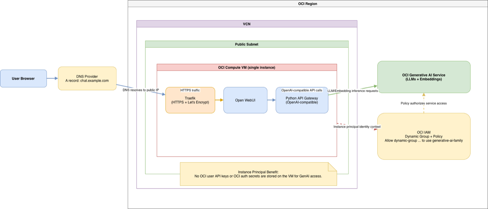

# Introduction

Deploy your own Open WebUI LLM chat interface integrated with Oracle Generative AI Service in a secure, scalable, and automated way.

You will build this end to end on Oracle Cloud Infrastructure (OCI): create IAM resources for instance principal authentication, provision infrastructure with **OpenTofu for easy infrastructure deployment**, and deploy the runtime as **Podman containers for easy application deployment** (automated with Ansible), with Open WebUI behind Traefik and TLS certificates from Let's Encrypt.

This workshop provides a practical, low-barrier blueprint for running a private GenAI chat interface in your own OCI tenancy on a single lightweight compute instance. The primary Oracle technology showcased is **Oracle Generative AI Service**, integrated and deployed on **Oracle Cloud Infrastructure**.

The implementation is based on the original source repository:

- [oci_open-webui-livelab](https://github.com/dariomanda/oci_open-webui-livelab)

Estimated Workshop Time: 2 hours

### Objectives

In this workshop, you will:
* Deploy Open WebUI and connect it to Oracle Generative AI Service
* Configure IAM for instance principal access using dynamic groups and policies
* Provision OCI infrastructure with OpenTofu
* Configure and deploy the application stack with Ansible, Podman, and Traefik
* Validate secure chatbot access to OCI-hosted LLMs and embeddings

### Prerequisites

This lab assumes you have:
* Access to an Oracle Cloud Infrastructure (OCI) account with sufficient privileges
* OCI CLI installed and configured locally
* OpenTofu and Ansible installed on your local system
* Basic knowledge of cloud concepts, DevOps, and containerization (Podman)
* A domain name configured for your deployed web application

### Products and Technologies Used

* Oracle Cloud Infrastructure (Compute, Networking, IAM)
* Oracle Generative AI Service
* Open WebUI
* OpenTofu
* Ansible
* Podman
* Traefik
* Let's Encrypt
* Python API Service Gateway (OpenAI-compatible)

## High-level architecture

The deployed solution includes:

- A public OCI compute VM for the application runtime
- Open WebUI as the chat interface
- A Python OpenAI-compatible API gateway to OCI Generative AI Service
- Traefik as reverse proxy with automated Let's Encrypt TLS certificates
- OCI IAM dynamic group and policy for instance principal authorization

### Instance Principal Security Model

The dynamic group and policy setup is required to use **instance principals**.

With this model, the OCI compute instance authenticates to OCI Generative AI Service **without storing OCI user API keys or OCI auth secrets on the VM**. Authorization is managed through IAM policy attached to the instance identity context.

## Workshop flow

1. Configure IAM access (compartment, dynamic group, policy)
2. Provision infrastructure with OpenTofu
3. Configure DNS and deploy with Ansible playbooks
4. Validate Open WebUI

## Acknowledgements
- Author - Dario Mandic | Principal Account Cloud Engineer
- Last Updated By/Date - Dario Mandic, March 2026
