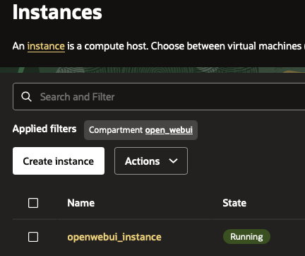

# Lab 2: Provision Infrastructure with OpenTofu

## Introduction

In this lab, you will prepare `terraform.tfvars`, deploy OCI resources with OpenTofu, and verify SSH access to the provisioned VM.

Estimated Time: 35 minutes

### Objectives

In this lab, you will:
* Validate local tooling and OCI CLI access
* Configure OpenTofu variables
* Deploy OCI infrastructure
* Verify compute instance SSH access

### Prerequisites

This lab assumes you have:
* Lab 1 completed
* Source repository cloned locally
* OCI CLI configured locally
* OpenTofu installed locally
* SSH public key ready

## Task 1: Validate local prerequisites

This task confirms your local tooling and OCI access are working before you provision infrastructure.
Run the local commands in this lab from the root directory of your cloned `oci_open-webui-livelab` repository unless stated otherwise.

1. Verify required tools are available:

    ```bash
    oci --version
    tofu version
    ansible --version
    ```

2. Validate OCI CLI access with a simple command:

    ```bash
    <copy>oci iam region list --output table</copy>
    ```

## Task 2: Prepare `terraform.tfvars`

This task creates your local OpenTofu variable file using the template that is already included in the cloned source repository.
Execute the commands from the root directory of the cloned repository.

1. Copy the template file from the source repository:

    ```bash
    <copy>cp opentofu/terraform.tfvars.template opentofu/terraform.tfvars</copy>
    ```

2. Update `opentofu/terraform.tfvars` with your tenancy, user, region, compartment, and SSH key values.

3. Default compute configuration in the template is a good starting point:

    | Parameter | Default value |
    | --- | --- |
    | `shape` | `VM.Standard.E5.Flex` |
    | `ocpus` | `2` |
    | `memory_in_gbs` | `16` |
    | `boot_volume_size_in_gbs` | `100` |

4. You can adjust these values as needed, but do not go below:
    - `memory_in_gbs = 8`
    - `boot_volume_size_in_gbs = 60`

5. The `ssh_key` value must be the public key from your workstation. This key is used to log in to the OCI compute instance over SSH.

6. If you do not have a key pair yet (macOS/Linux), create one:

    ```bash
    <copy>ssh-keygen -t rsa -f ~/.ssh/id_rsa -C "your_email@example.com"</copy>
    <copy>cat ~/.ssh/id_rsa.pub</copy>
    ```

7. Copy the output of `id_rsa.pub` into the `ssh_key` field in `terraform.tfvars`.

## Task 3: Deploy OCI resources with OpenTofu

In this task, you initialize OpenTofu and apply the configuration to provision OCI networking and compute resources.

1. Run these commands from the cloned `oci_open-webui-livelab` repository root, then change to the OpenTofu folder:

    ```bash
    <copy>cd opentofu</copy>
    <copy>tofu init</copy>
    ```

2. `tofu init` downloads required provider plugins and initializes the working directory.

3. Apply the configuration:

    ```bash
    <copy>tofu apply</copy>
    ```

4. Review the plan, then type `yes` when prompted.

5. After a successful run, note the output values, especially:

    - `public_ip` (required for SSH, DNS, and Ansible in later labs)

6. You should see an output similar to:

    ```
    Apply complete! Resources: 6 added, 0 changed, 0 destroyed.
    ```

7. Verify the new instance is running in OCI Console.

    

## Task 4: Verify SSH access to the VM

This task validates that the new instance is reachable and stores its host key locally for smooth Ansible execution in the next lab.
From your workstation terminal in the cloned repository root, connect to the new instance.

1. SSH into the VM (replace with your public IP):

    ```bash
    <copy>ssh ubuntu@xxx.xxx.xxx.xxx</copy>
    ```

2. Exit SSH after the first successful login if needed. This ensures the host key is saved in `known_hosts`, which helps Ansible runs in Lab 3.

## Acknowledgements
- Author - Dario Mandic | Principal Account Cloud Engineer
- Last Updated By/Date - Dario Mandic, March 2026
