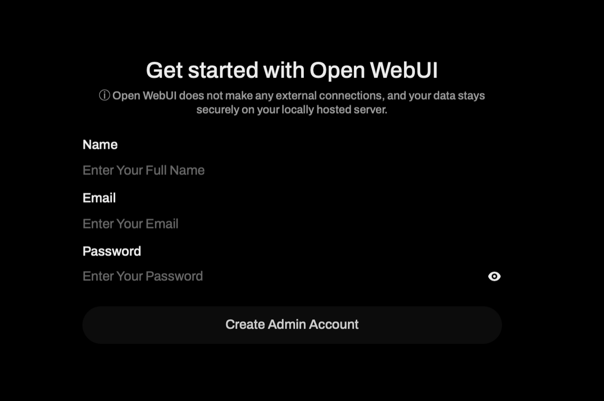
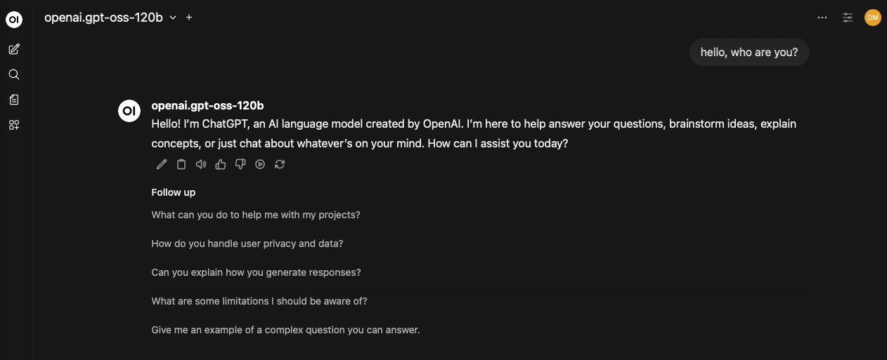

# Lab 4: Validate Open WebUI

## Introduction

In this lab, you will log in to Open WebUI, create an administrator account, and validate chatbot functionality.

Estimated Time: 20 minutes

### Objectives

In this lab, you will:
* Access Open WebUI over HTTPS
* Create the initial administrator account
* Validate chat responses through OCI Generative AI

### Prerequisites

This lab assumes you have:
* Labs 1 to 3 completed
* A working DNS record and reachable HTTPS endpoint

## Task 1: Create the Open WebUI administrator account

This task completes first-time application setup by creating the initial administrator user in Open WebUI.

1. Open the domain URL you configured in Lab 3 Task 1 (the DNS `A` record that points to your VM `public_ip`) in a browser.
2. Complete the first-time Open WebUI administrator registration.
3. Sign in with the created account.

    

## Task 2: Validate end-to-end chatbot flow

This task confirms that Open WebUI can successfully call OCI Generative AI models through the deployed gateway.

1. Open a new chat in Open WebUI.
2. Select one of the available OCI-backed models.
3. Send a test prompt and verify response generation.

    

## Learn More

- [Open WebUI Documentation](https://docs.openwebui.com/)
- [OCI Generative AI Documentation](https://docs.oracle.com/en-us/iaas/Content/generative-ai/home.htm)
- [OpenTofu Documentation](https://opentofu.org/docs/)

## Acknowledgements
- Author - Dario Mandic | Principal Account Cloud Engineer
- Last Updated By/Date - Dario Mandic, March 2026
