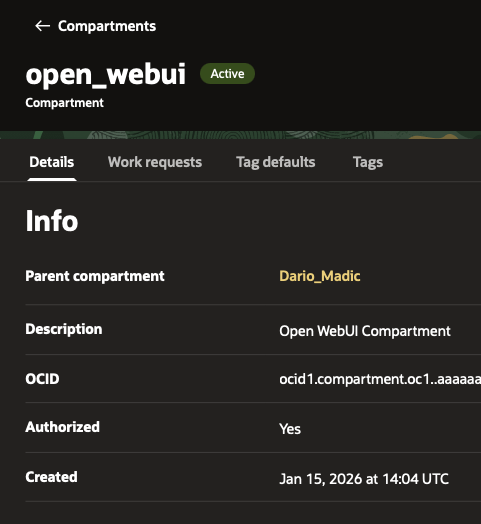
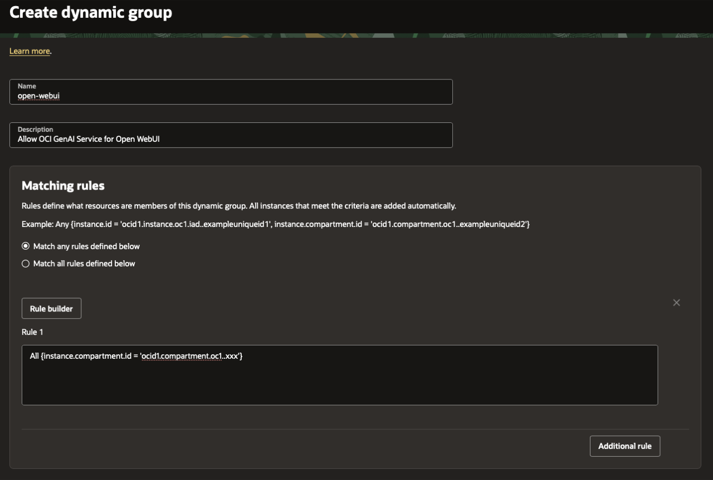
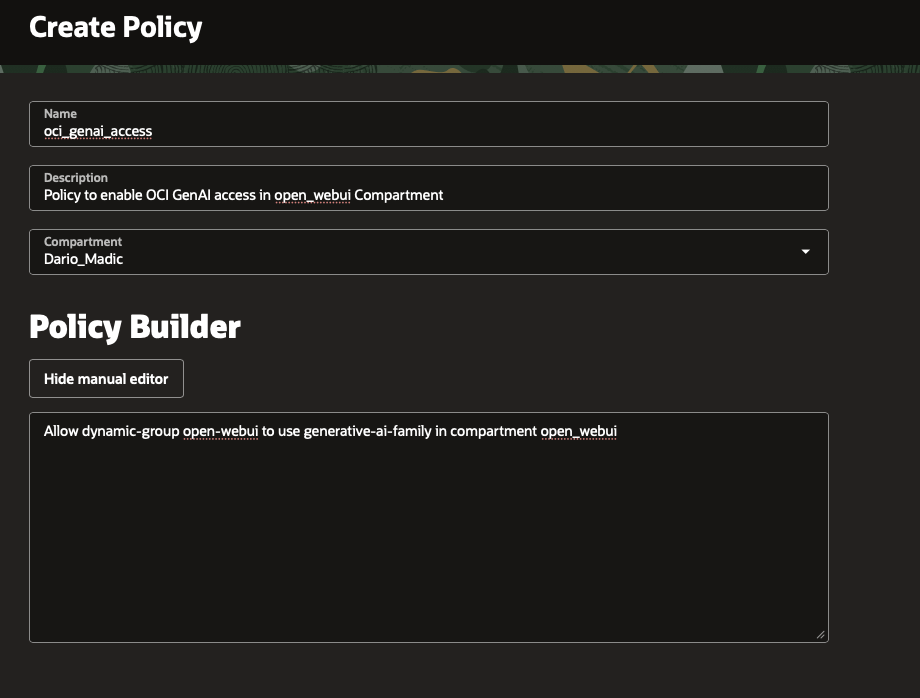

# Lab 1: Setup Project and OCI IAM for Open WebUI

## Introduction

This lab prepares your local project workspace and sets up OCI identity resources required for secure instance principal access to OCI Generative AI Service.

Estimated Time: 25 minutes

### Objectives

In this lab, you will:
* Clone the source repository used in this workshop
* Install local prerequisites (OCI CLI, OpenTofu, and Ansible)
* Create a dedicated compartment for Open WebUI resources
* Create a dynamic group for your compute instance(s)
* Create a policy that allows Generative AI access from that dynamic group

### Prerequisites

This lab assumes you have:
* Access to OCI Console with IAM permissions
* A target parent compartment where you can create child compartments

## Task 1: Clone the source repository

This workshop uses source code and deployment automation from a separate GitHub repository. In this task, you clone that repository to your local machine.

1. Verify Git is available:

    ```bash
    git --version
    ```

2. Clone the original project repository:

    ```bash
    <copy>git clone https://github.com/dariomanda/oci_open-webui-livelab.git</copy>
    ```

3. Move into the cloned project:

    ```bash
    <copy>cd oci_open-webui-livelab</copy>
    ```

## Task 2: Install local prerequisites

These tools are required to deploy the complete solution, including OCI infrastructure provisioning and application deployment automation.

1. Install required tools on macOS with Homebrew:

    ```bash
    <copy>brew update</copy>
    <copy>brew install ansible opentofu oci-cli</copy>
    ```

2. If you are on Linux or Windows, use the official installation guides:
    - [OCI Command Line Interface](https://docs.oracle.com/en-us/iaas/Content/API/SDKDocs/cliinstall.htm)
    - [OpenTofu installation](https://opentofu.org/docs/intro/install/)
    - [Ansible installation guide](https://docs.ansible.com/projects/ansible/latest/installation_guide/installation_distros.html)

## Task 3: Create a dedicated compartment

In this task, you create a dedicated OCI compartment so all workshop infrastructure is grouped and managed in one isolated location.

1. Sign in to OCI Console.
2. Open the navigation menu and go to **Identity & Security** -> **Compartments**.
3. Click **Create Compartment**.
4. Create a compartment for this workshop (for example, `open_webui`).
5. Save the compartment OCID. You will use it later in OpenTofu and environment configuration.

    

## Task 4: Create a dynamic group

This task is required for instance principal authentication. The dynamic group identifies which compute instances are allowed to request OCI API access.

1. Open **Identity & Security** -> **Domains** -> **Dynamic Groups**.
2. Click **Create Dynamic Group**.
3. Use a matching rule that includes instances in your new compartment:

    ```
    <copy>All {instance.compartment.id = 'ocid1.compartment.oc1..xxx'}</copy>
    ```

4. Save the dynamic group.

    

5. Optional stricter alternative for a single instance:

    ```
    <copy>Any {instance.id = 'ocid1.instance.oc1..<unique_id>'}</copy>
    ```

## Task 5: Create policy for OCI Generative AI access

This task completes the instance principal setup by granting the dynamic group permission to call OCI Generative AI Service APIs.

1. Open **Identity & Security** -> **Policies**.
2. Create a policy in the correct parent compartment.
3. Add the statement below (replace names with your own values):

    ```
    <copy>Allow dynamic-group open-webui to use generative-ai-family in compartment open_webui</copy>
    ```

4. If your target compartment is nested deeper, use the full compartment path syntax.

    

## Task 6: Validate your setup values

These values are required in later labs to populate deployment environment files (for example `terraform.tfvars` and `.env`).

1. Collect and store the values below for the next labs:

    | Required value | Notes |
    | --- | --- |
    | Compartment OCID | Used by `terraform.tfvars` and `.env` |
    | Region | Used by OpenTofu and OCI gateway |
    | Dynamic group name | Referenced by policy |
    | Policy statement | Must allow `generative-ai-family` |

2. Continue to Lab 2 to provision infrastructure.

## Acknowledgements
- Author - Dario Mandic | Principal Account Cloud Engineer
- Last Updated By/Date - Dario Mandic, March 2026
