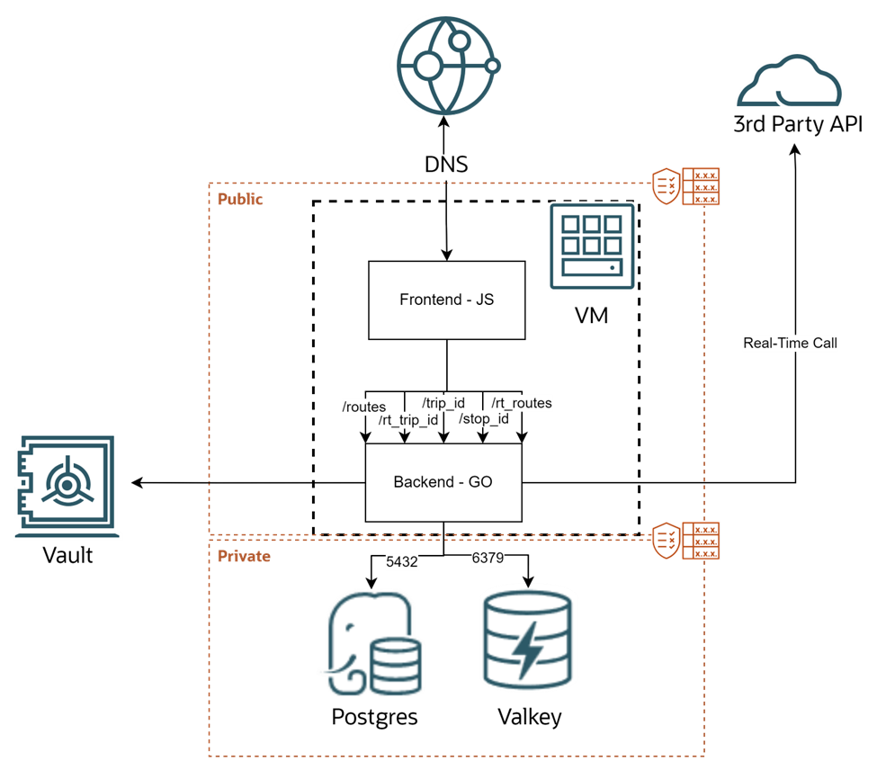

# Introduction

## About This Workshop

Welcome to Accelerating IoT applications with OCI Cache and OCI PostgreSQL Workshop!

This workshop walks you step by step through creating a full stack  functional application including OCI Compute, OCI Cache, OCI PostgreSQL and the necessary core OCI components.

### Objectives

The core focus is on the deployment and integration of cache and database working together to deliver high performance. The application requires minimal setup, allowing you to spend more time exploring key integration concepts and observing the real-world impact of caching through a dynamic, visual interface.

### Prerequisites

To complete this lab you need:
* An Oracle Cloud Account(Tenancy)
* Basic familiarity with Core OCI Services
* Must have an Administrator Account or Permissions to manage several OCI Services: OCI Database with PostgreSQL, OCI Cache, Compute, Network, Dynamic Groups, Policies, Vault

### Architecture

The key components are:
* OCI Database with PostgreSQL
* OCI Cache
* OCI Compute (Hosting the application)

Additionally OCI Vault is used for storing the database credentials.

Typical request flow:
* User opens the web frontend. (map)
* Frontend sends an API request (e.g., /route).
* Request reaches the Go backend service which
    - fetches cached data from Valkey or
    - queries PostgreSQL.
* Backend returns the response to the frontend.
* Frontend updates the UI.

## Acknowledgements

- **Created By/Date** - Piotr Kurzynoga, Andriy Dorohkin, April 2026
- **Last Updated By** - Piotr Kurzynoga, April 2026