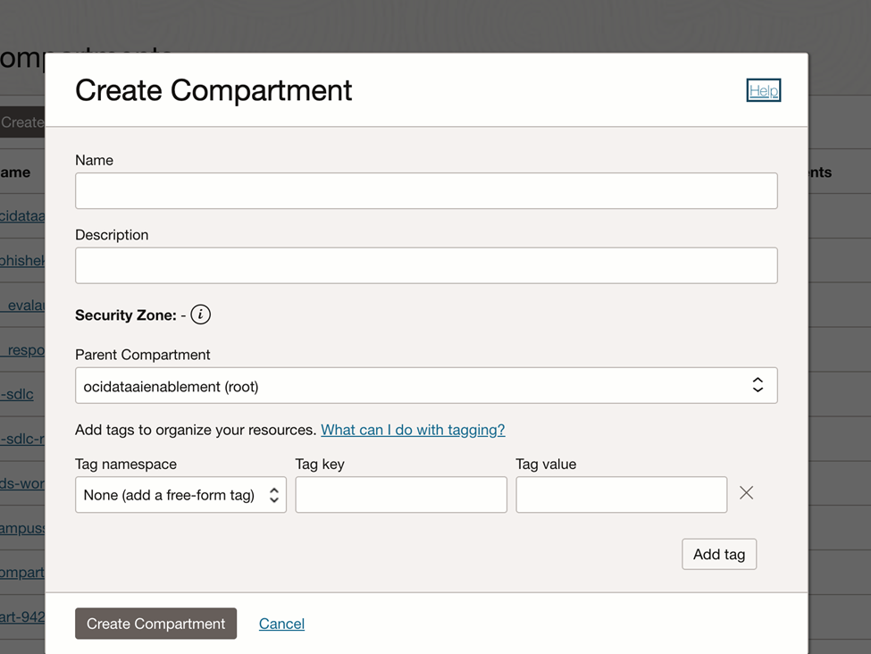
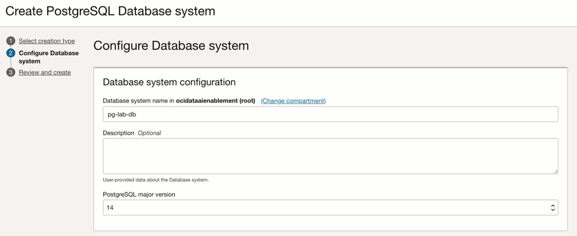

# Provision OCI Database with PostgreSQL

## Introduction
In this lab, you will learn how to provision a PostgreSQL database on Oracle Cloud Infrastructure (OCI). You'll also become familiar with other enterprise options such as adding read replicas, configuring backups, and enabling cross-region backups—without actually setting them up.

Estimated time: 30-40 min

### Objectives
- Deploy a PostgreSQL database system on OCI.
- (Explore only) See where to configure:
- Read Replicas
- Backups and cross-region backups

### Prerequisites
- OCI Account with sufficient permissions (some features may not be available under "Always Free").
- Your tenancy must have access to a supported region (e.g., Chicago, Frankfurt).
- [How to manage subscription to cloud regions](https://docs.oracle.com/en-us/iaas/Content/General/Concepts/regions.htm)
- [Optional] Use the OCI Cloud Shell with Public Network access.
- See instructions for enabling Cloud Shell public network [here](https://docs.oracle.com/en-us/iaas/Content/API/Concepts/cloudshellintro_topic-Cloud_Shell_Networking.htm) .

## Task 1: Create or Choose a Compartment
1.	Login to the [OCI Console](https://cloud.oracle.com/) 
2.	Menu → Identity & Security → Compartments.
3.	Create a new compartment (recommended) or select one you can use.
- Name Example: pg-lab-compartment
- Copy and save the Compartment OCID for later use.

 
## Task 2: Provision a PostgreSQL Database
1.	Navigate to: Menu → Databases → Oracle Cloud Databases for PostgreSQL.
- If not visible, use Search box to find "PostgreSQL".
2.	Click Create PostgreSQL database system.

3.	Follow the guided steps:
- Compartment: Select your compartment.
- Display Name: Enter a name (e.g., pg-lab-db).
- Database Version: Choose version 15.
- DB System Shape: Choose a compute shape (the default is often sufficient for labs).
- Storage Setting: Accept default (can be adjusted later).
- Networking: Choose a Virtual Cloud Network (VCN) and subnet within your compartment.
- Administrator Credentials: Set a strong password and save it securely.
4.	Click Create.
The provisioning process will begin. It may take a few minutes.

## Task 3: Connecting to your PostgreSQL DB
1.	Wait for the DB system status to become Available.
2.	In the database details page, find the Connection information section.
- Record the hostname, port (default: 5432), and username.
3.	You can connect using any standard PostgreSQL client, such as psql from OCI Cloud Shell or your local machine:
Example command:
`` psql -h <hostname> -U <username> -d postgres``
You may need to update your security list to allow inbound access from your IP or Cloud Shell.
Tip: Review [Connecting to a PostgreSQL DB System](https://docs.oracle.com/en-us/iaas/Content/postgresql/develop/connect.htm)

## Task 4: Explore Additional Features (No Configuration Required)
A. Adding Read Replicas
- PostgreSQL on OCI can provide read replicas for scaling out read-heavy workloads or enhancing availability.
- To add a replica, from your database system's details page, scroll down and click Add Node
- Review the [Managing Nodes Documentation](https://docs.oracle.com/en-us/iaas/Content/postgresql/manage-nodes.htm#top) for further details.

B. Setting Up Automatic Backups
- Backups are important for disaster recovery and compliance.
- From your database system's details page, click the Backups tab.
- Automatic daily backups are supported and can be managed through this section.
- Learn more: [PostgreSQL Backups on OCI](https://docs.oracle.com/en-us/iaas/Content/postgresql/backups.htm)

C. Configuring Cross-Region Backups
- For business continuity, OCI supports cross-region backup copies.
- In the Backups area, you can enable Cross-Region Automatic Backups.
- Learn more: [Cross-Region Backups](https://docs.oracle.com/en-us/iaas/Content/postgresql/Tasks/postgresql-cross-region-backups.htm)

### References & Further Reading
- [PostgreSQL on Oracle Cloud Infrastructure Documentation](https://docs.oracle.com/en-us/iaas/Content/postgresql/home.htm)
- [First Principles: Optimizing PostgreSQL for the Cloud](https://blogs.oracle.com/cloud-infrastructure/post/first-principles-optimizing-postgresql-for-the-cloud)

## Summary & Next Steps
You have provisioned a PostgreSQL database on OCI and are aware of key management features for enterprise deployments. For production use, consider exploring read replicas, automatic and cross-region backups, and monitoring features as described in the PostgreSQL on OCI documentation.

## Acknowledgments

- **Created By/Date** - Devneel Vadiya, Piotr Kurzynoga, Andriy Dorohkin, April 2026
- **Last Updated By** - Piotr Kurzynoga, April 2026