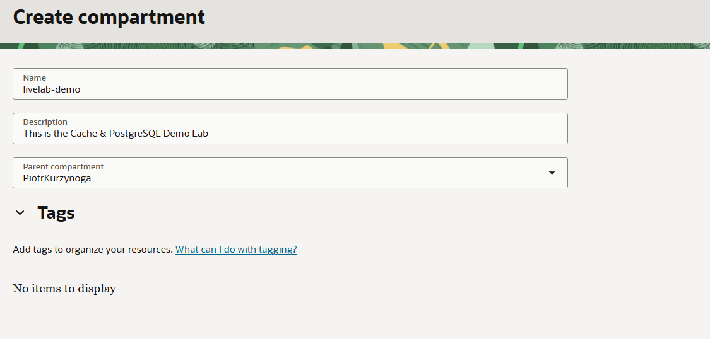
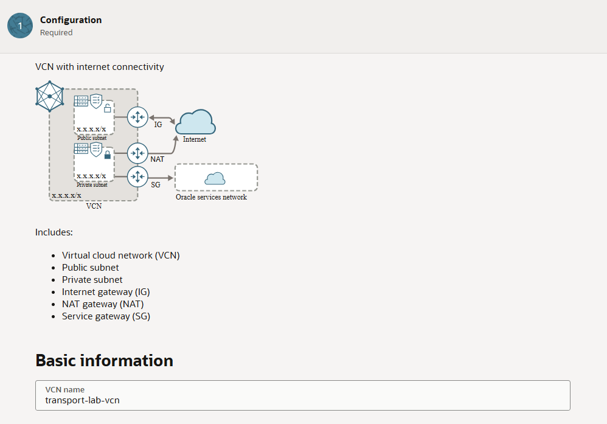
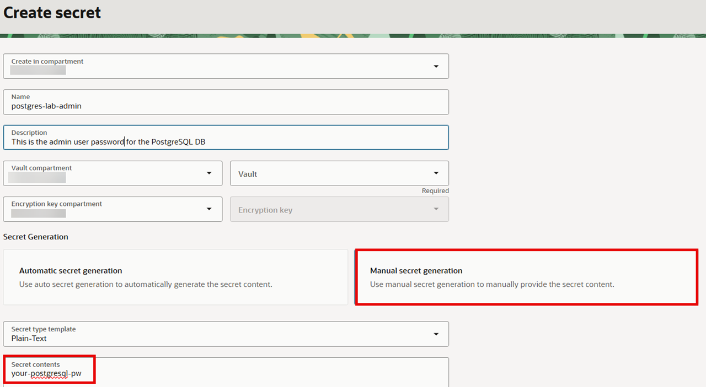
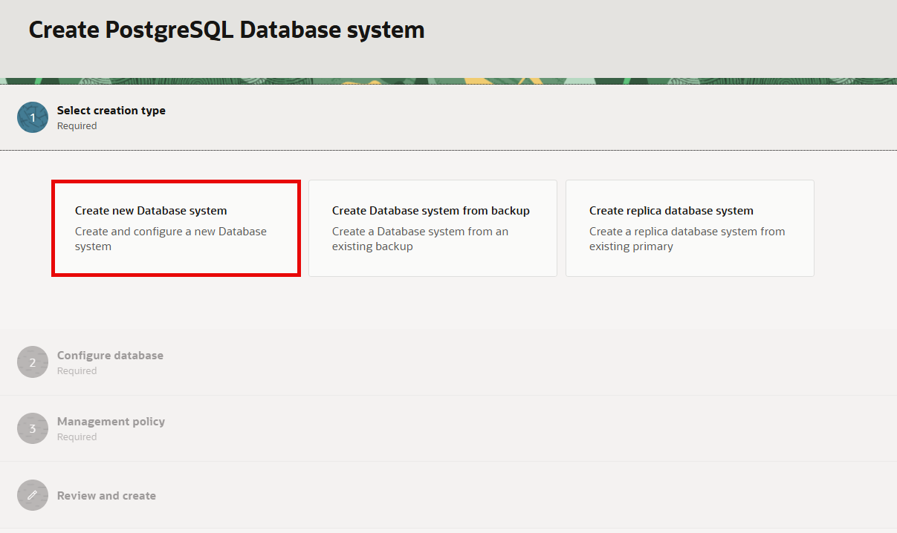
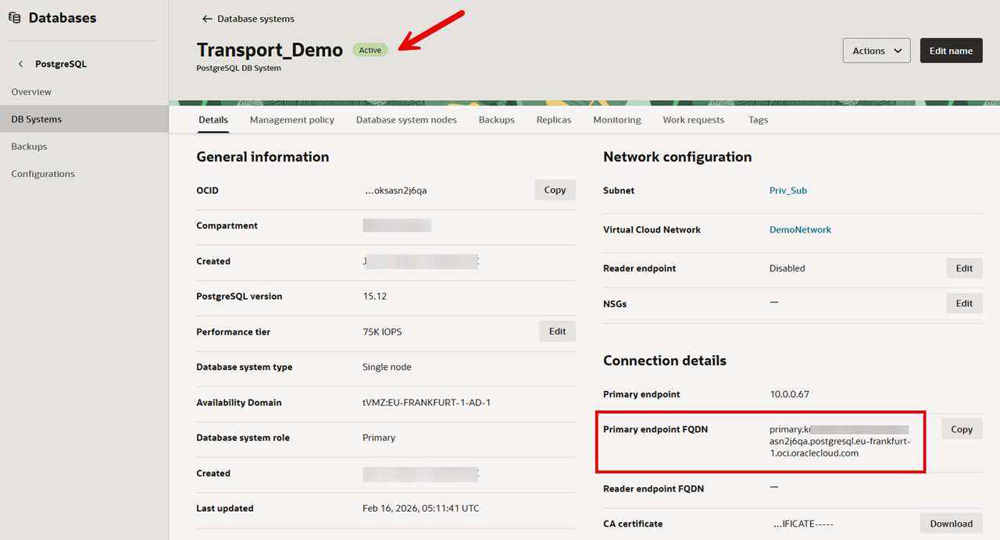
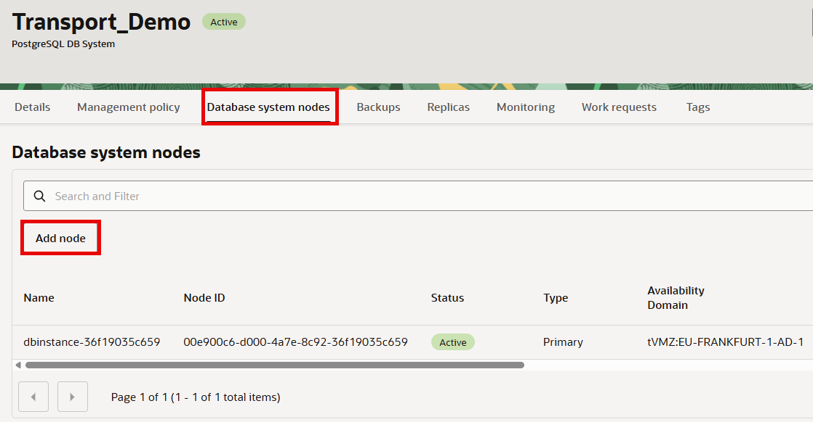
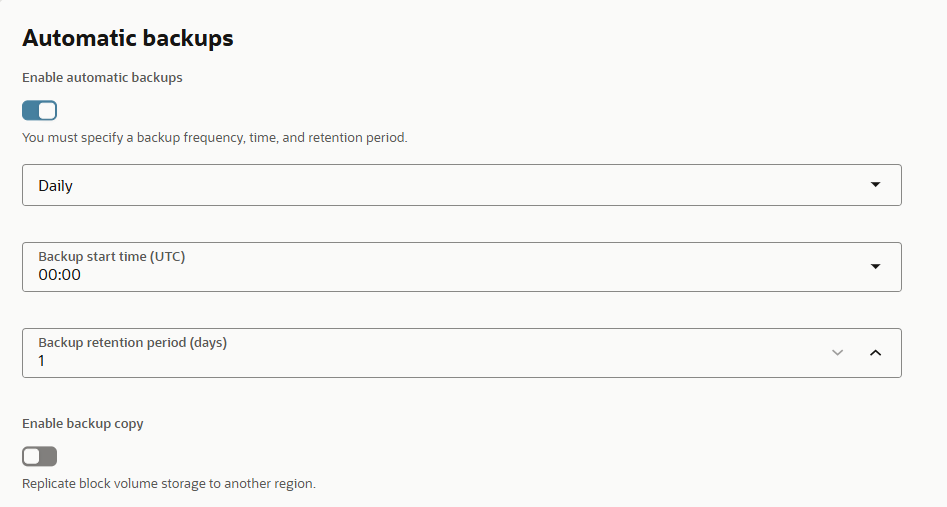

# Provision OCI Database with PostgreSQL

## Introduction
In this lab, you will learn how to provision a PostgreSQL database on Oracle Cloud Infrastructure (OCI). You'll also become familiar with other enterprise options such as adding read replicas, configuring backups, and enabling cross-region backups—without actually setting them up.

**Estimated time:** 30-40 minutes

### Objectives
- Create the core resources
    - Compartment structure
    - Networking
    - Secrets Vault
- Deploy a PostgreSQL database system on OCI.
- See where to configure:
    - Read Replicas
    - Backups and cross-region backups

### Prerequisites
- OCI Account with sufficient permissions.
- Have a Virtual Cloud Network(VCN) in place (e.g transport-lab-vcn)
- Your tenancy must have access to a supported region (e.g., Chicago, Frankfurt).
- [How to manage subscription to cloud regions](https://docs.oracle.com/en-us/iaas/Content/General/Concepts/regions.htm)
- [Optional] Use the OCI Cloud Shell with Public Network access.
- See instructions for enabling Cloud Shell public network [here](https://docs.oracle.com/en-us/iaas/Content/API/Concepts/cloudshellintro_topic-Cloud_Shell_Networking.htm) .

## Task 1: Create or Choose a Compartment
1.	Login to the [OCI Console](https://cloud.oracle.com/)
2.	Menu → Identity & Security → Compartments.
3.	Create a new compartment (recommended) or select one you can use.
- Name Example: pg-lab-compartment
- Copy and save the Compartment OCID for later use.

## Task 2: Create the Virtual Cloud Network or use an existing one
1. Menu → Networking → Overview
2. Select 'Start VCN wizard' and choose 'Create VCN with Internet Connectivity'
3. You can name the network "transport-lab-vcn" as an example.

- Documentation
    - [Quick-Start](https://docs.oracle.com/en-us/iaas/Content/Network/Tasks/quickstartnetworking.htm)

## Task 3: Create the OCI Vault
1. Menu → Identity & Security → Key Management → Vault
2. Click 'Create Vault'.
3. Choose the compartment and give it a name e.g. lab-vault
4. Click 'Create Vault'
5. Open the Vault and go to the 'Master encryption keys' tab.
6. Click 'Create Key'
7. Ensure the correct compartment and choose the HSM protection mode.
8. Give the key a name e.g. transport-lab-mek.
9. For Key Shape Algorithm choose 'AES-256'.
10. Go to Menu → Identity & Security → Secret Management.
11. Click on 'Create Secret'.
12. Ensure the correct compartment and give it a name e.g. postgres-lab-admin
13. Select the created vault and choose the encryption key.
14. Provide the password via 'Manual secret generation'.
15. Click on 'Create Secret'.

You now have all the necessary components to proceed with database creation.

Documentation:
- [How to Create a Vault](https://docs.oracle.com/en-us/iaas/Content/KeyManagement/Tasks/managingvaults_topic-To_create_a_new_vault.htm)
- [How to Create a Secret](https://blogs.oracle.com/cloud-infrastructure/introducing-dedicated-secret-management-console)

## Task 4: Provision a PostgreSQL Database
1.	Navigate to: Menu → Databases → Oracle Cloud Databases for PostgreSQL.
- If not visible, use Search box to find "PostgreSQL".
2.	Click Create PostgreSQL database system and select "Create new Database system".

3.	Follow the guided steps:
- Compartment: Select your compartment.
- Display Name: Enter a name (e.g., pg-lab-db).
- Database Version: Choose version 15.
- DB System Shape: Choose a compute shape (the default is often sufficient for labs).
- Storage Setting: Accept default (can be adjusted later).
- Networking: Choose a Virtual Cloud Network (VCN) and subnet within your compartment.
- Administrator Credentials: Use the OCI Vault option and choose the created secret.
4.	Click Create.
The provisioning process will begin. It may take a few minutes.

## Task 4: Connecting to your PostgreSQL DB
1.	Wait for the DB system status to become Available.

2.	In the database details page, find the Connection information section.
- Record the hostname, port (default: 5432), and username.
3.	You can connect using any standard PostgreSQL client, such as psql from OCI Cloud Shell or your local machine:
Example command:
`` psql -h <hostname> -U <username> -d postgres``
You may need to update your security list to allow inbound access from your IP or Cloud Shell.
Tip: Review [Connecting to a PostgreSQL DB System](https://docs.oracle.com/en-us/iaas/Content/postgresql/develop/connect.htm)

## Task 5: Explore Additional Features (No Configuration Required)
A. Adding Read Replicas

- PostgreSQL on OCI can provide read replicas for scaling out read-heavy workloads or enhancing availability.
- To add a replica, from your database system's details page, scroll down and click Add Node
- Review the [Managing Nodes Documentation](https://docs.oracle.com/en-us/iaas/Content/postgresql/manage-nodes.htm#top) for further details.

B. Setting Up Automatic Backups

- Backups are important for disaster recovery and compliance.
- From your database system's details page, click the Backups tab.
- Automatic daily backups are supported and can be managed through this section.
- Learn more: [PostgreSQL Backups on OCI](https://docs.oracle.com/en-us/iaas/Content/postgresql/backups.htm)

C. Configuring Cross-Region Backups
- For business continuity, OCI supports cross-region backup copies.
- In the Backups area, you can enable Cross-Region Automatic Backups.
- Learn more: [Cross-Region Backups](https://docs.oracle.com/en-us/iaas/Content/postgresql/Tasks/postgresql-cross-region-backups.htm)

### References & Further Reading
- [PostgreSQL on Oracle Cloud Infrastructure Documentation](https://docs.oracle.com/en-us/iaas/Content/postgresql/home.htm)
- [First Principles: Optimizing PostgreSQL for the Cloud](https://blogs.oracle.com/cloud-infrastructure/post/first-principles-optimizing-postgresql-for-the-cloud)

## Summary & Next Steps
You have provisioned a PostgreSQL database on OCI and are aware of key management features for enterprise deployments. For production use, consider exploring read replicas, automatic and cross-region backups, and monitoring features as described in the PostgreSQL on OCI documentation.

You may now **proceed to the next lab**.

## Acknowledgements

- **Created By/Date** - Devneel Vaidya, Piotr Kurzynoga, Andriy Dorokhin, April 2026
- **Last Updated By** - Piotr Kurzynoga, April 2026