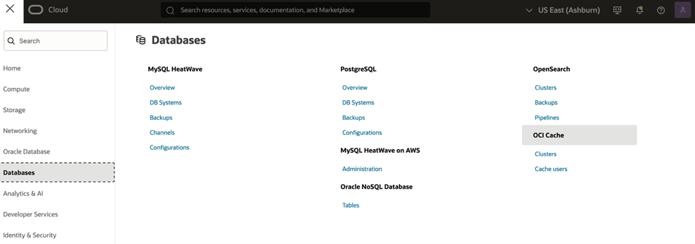
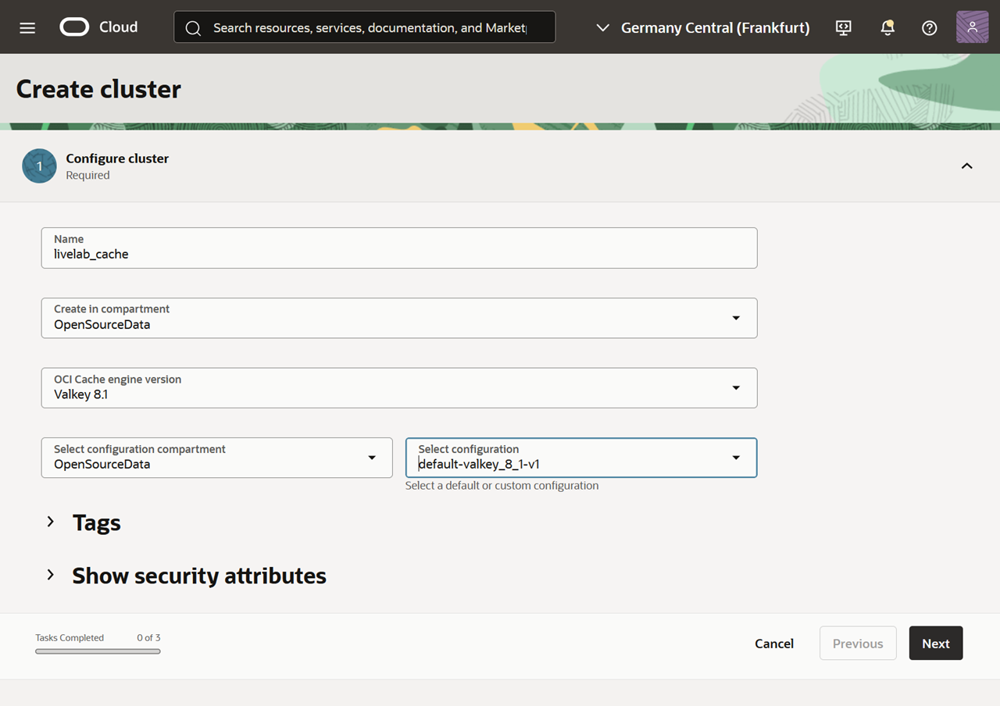
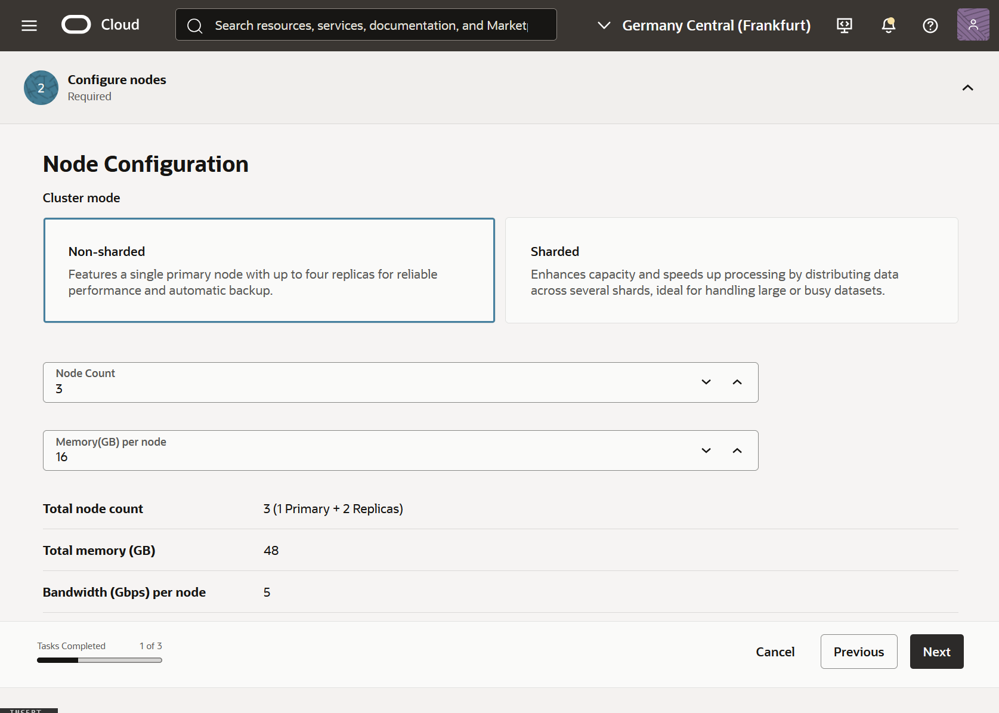
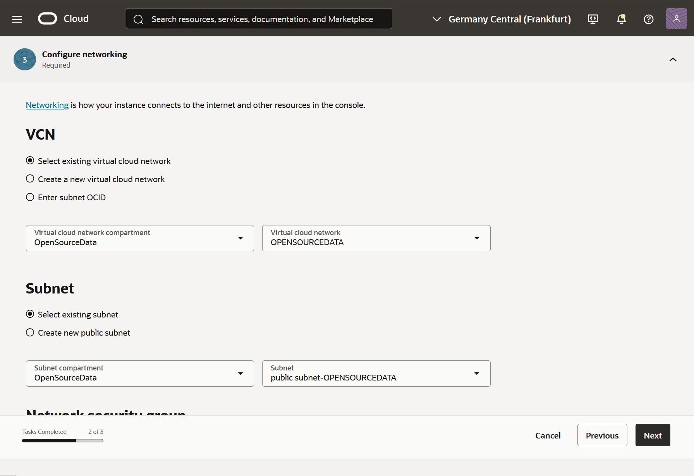
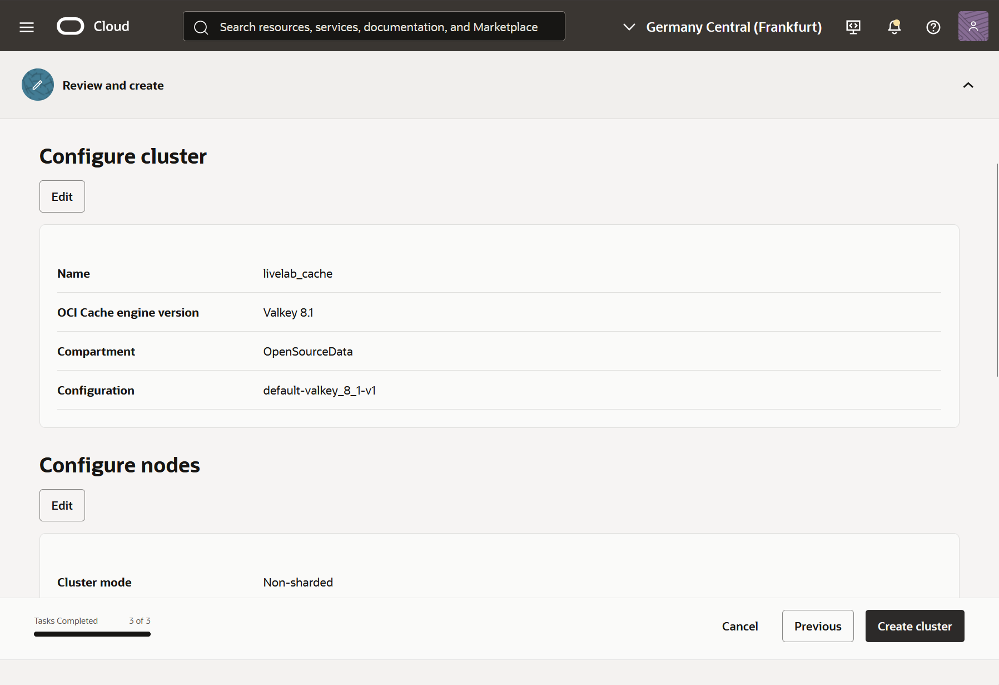
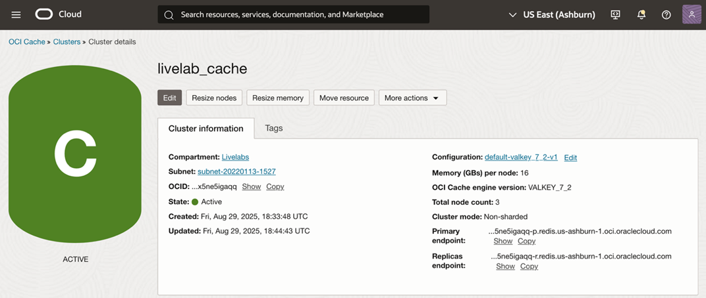

# Provisioning an OCI Cache Cluster

## Introduction
In this lab, you will learn how to provision an OCI Cache cluster in your tenancy. You will also learn about options to scale the cache cluster

**Estimated Time:** 15–20 minutes

### Objectives
- Deploy an OCI Cache cluster with the Valkey engine
- **(Explore only)** See where to configure:
    - Scaling and high availability
    - Cache users
    - Custom configurations

### Prerequisites
- IAM permissions to create OCI Cache instance in a compartment in the tenancy

## Task 1: Provision an OCI Cache Instance
1. Using the Navigation Menu at the top left, navigate to **Databases → OCI Cache**

2. Click **Create Cluster**
3. Follow the guided steps:
- **Name:** Enter a name (e.g. livelab-cache)
- **Compartment:** Select your compartment
- **OCI Cache engine version:** Choose `VALKEY_8_1`
- **Configuration:** Choose `default-valkey_8_1-v1`
4. Click **Next**

5. Choose the cluster node configuration
- **Node configuration:** Choose `Non-sharded`
- **Node count:** 3
- **Memory per node:** 16GB
6. Click **Next**

7. Configure Networking
- Choose a Virtual Cloud Network (VCN) and subnet
- (Optional) Add a Network security group
8. Click **Next**

9. Review the cluster configuration and click **Create cluster**

The cluster provisioning may take a few minutes. Once completed, the cluster shows to be in **Active** state

## Task 2: Connecting to Your OCI Cache Instance

1. On the cluster details page of a non-sharded cluster, find **Primary** and **Replicas** endpoints
2. You can connect using any compatible Redis or Valkey CLI tool or client from within the same subnet

### Example commands:

Non-sharded cluster: **Primary endpoint**
    `redis-cli --tls -h <ID>-p.redis.<region>.oci.oraclecloud.com`

Non-sharded cluster: **Replica endpoint**
    `redis-cli --tls -h <ID>-r.redis.<region>.oci.oraclecloud.com`

Sharded cluster: **Primary node of any shard**
    `redis-cli --tls -h <ID>-0.redis.<region>.oci.oraclecloud.com -c`

***Note:*** *Update any network security rules as needed to allow access from your IP or Cloud Shell*

## Task 3: Explore Additional Features (No Configuration Required)
A. Scaling cache memory
- OCI Cache allows you to increase memory per node without any downtime
- On your cluster’s details page, review the **Memory per node** and click on **Resize memory** to increase or decrease the memory size based on your application’s demand
- You can run only one resize operation at a time. During resizing the cluster may be in Updating state for a few seconds

B. Scaling replica nodes
- OCI Cache allows you to add replica nodes for read-heavy workloads or for high availability
- On your cluster’s detail page, review the node count and click on Resize nodes to add more replica nodes
- For high-availability, to allow seamless failover in the event of node failures:
    - Maintain one primary and at least 2 replica nodes in a non-sharded cluster
    - Maintain one primary and at least 2 replica nodes per shard in a sharded cluster

C. Securing access to cache
- OCI Cache supports configuring access control to data in the cache and running cache commands
- You can define access permissions by defining Access Control List strings for OCI Cache Users
- In the service page, go to **Cache Users** to create one or more users
- In the cluster details, see **Users** to associate one or more users to the cluster

D. Customizing cache configuration
- OCI Cache allows you to customize certain cluster parameters such as max-memory-policy, tcp-keepalive, client-query-buffer-limit based on your use cases
- In the service page, go to **Configurations** to create one or more custom configurations
- Choose a custom configuration when creating a new cache cluster or assign it to an existing cluster

E.	Metrics and Monitoring
- On your cluster’s detail page, explore the **Metrics** tab
- Review key metrics such as CPU and memory utilization, keyspace hits and misses, replication lag and count of connected clients
- For deeper monitoring, visit **Menu → Monitoring → Service Metrics**

## References & Further Reading
[OCI Cache Service Documentation](https://docs.oracle.com/en-us/iaas/Content/ocicache/home.htm)

## Summary & Next Steps
You have provisioned an OCI Cache cluster and explored key management and monitoring features that are important for enterprise workloads. For production use, consider deeper exploration of access control, monitoring, scaling and high availability strategies as described in the OCI Cache documentation

You may now **proceed to the next lab**.

## Acknowledgements

- **Created By/Date** - Rashmi Badan, Andriy Dorokhin, Piotr Kurzynoga / April 2026
- **Last Updated By** - Andriy Dorokhin, April 2026
