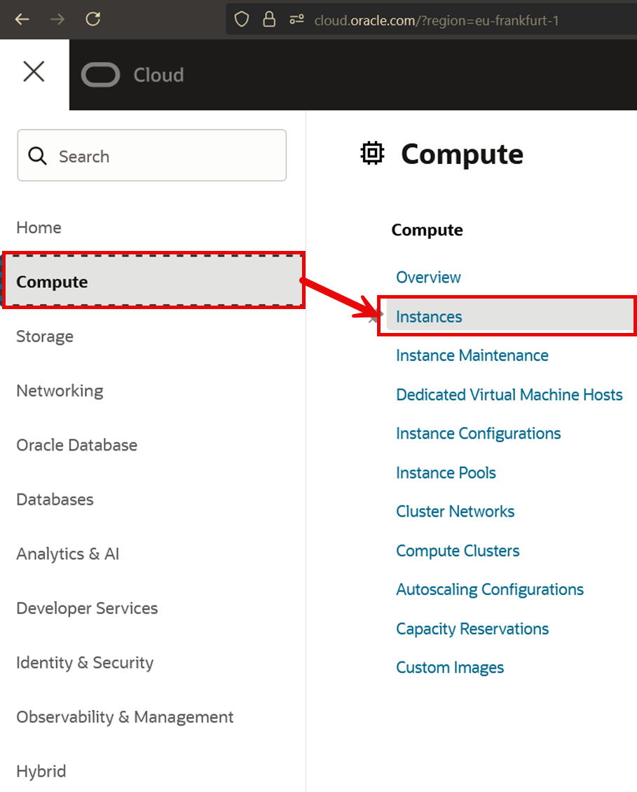
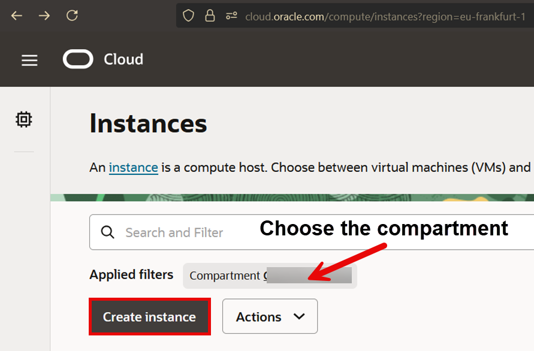
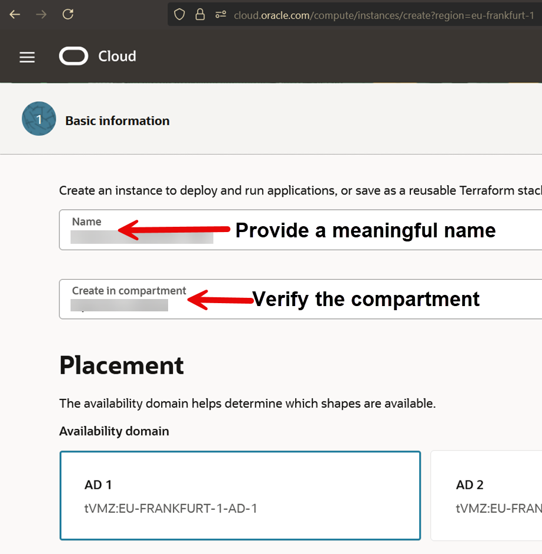
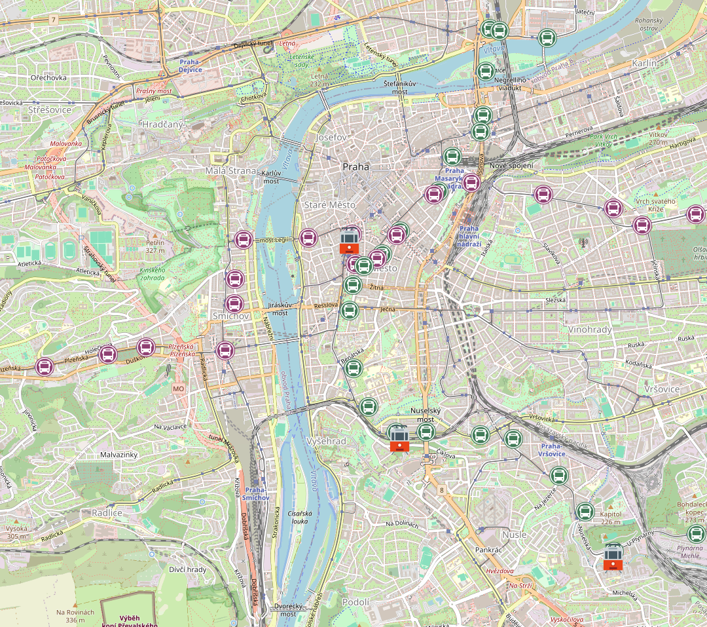
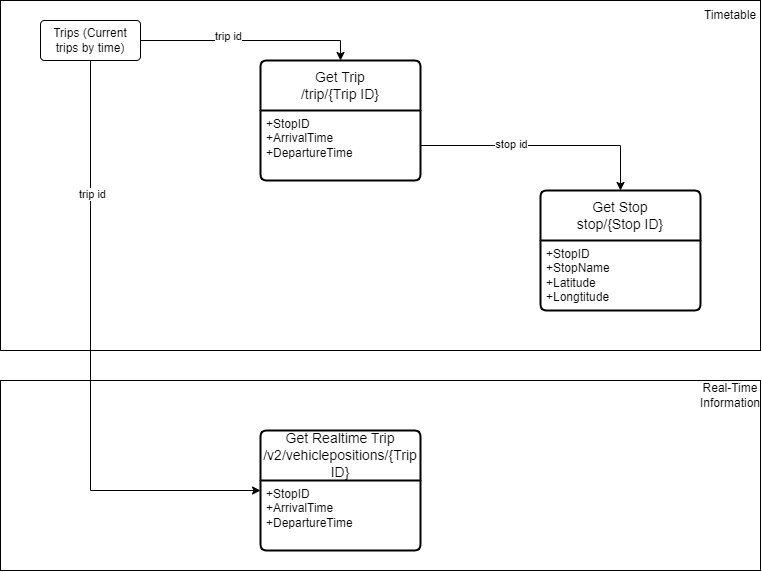

# Configure the frontend

## Introduction
In this lab, you will deploy an application that connects to the OCI Cache and the OCI Database with PostgreSQL instances you created earlier.

**Estimated Time:** 25-40 minutes

### Objectives:
- Create a compute instance for the application.
- Fetch the latest dataset using provided script.
- Deploy the application using provided script.
- Have fun with the demo!

### Prerequisites
- Completed the previous labs in this workshop.

## Task 1: Create the Compute Instance

1.	In the Cloud Console, navigate to Compute > Instances and click Create Instance


2.	Click on Create Instance. Ensure the transport-lab-demo compartment is selected for this lab.


3.	Configure the Compute instance to use Oracle Linux 9 and select the transport-lab-vcn VCN created earlier in this lab.


## Task 2: Configure the Virtual Cloud Network Security Rules
1. Navigate to Menu → Virtual Cloud Networks and select your VCN.
2. Open the 'Security' Tab
3. In the Private Security list add the entries for following destination ports *5432* and *6379* coming from the public subnet where the compute resides, for PostgreSQL and Cache respectively.
4. In the Public Security list repeat the same steps for ports *8585* and 8000* for all addresses *0.0.0.0/0* if you want to expose your application externally.

## Task 3: Deploy the Application

1.	Clone the GitHub repository using the link below and follow the instructions:
https://github.com/phantompete/LiveLab_WebApp_Demo

2.  Make the dataset script executable and then run it:
```sh
chmod +x refresh_dataset.sh
./refresh_dataset.sh
```
This will download the latest version of the transport dataset which includes:
- Stops
- Stop Times
- Routes

*Note:* It also installs the postgresql client

3. Initialize the PostgreSQL database with your user using `db_init.sql`.

Use the following command to execute the script:
```sh
psql -h oci_postgres_host -U phantompete -d postgres -a -f "db_init.sql"
```
This creates the necessary schema (`public_transport`) and table structures for the data to be imported.

4. In the `deploy_application_demo.sh` scipt, configure the following settings:
-	PostgreSQL host
-	Redis host
-	OCI Region (where the instances are created)
-	Database Secret OCID
-	Public Transport API key*


*To obtain a Public Transport API key, generate one on the Golemio API Keys Management page: https://api.golemio.cz/api-keys

Make the deployment script executable and then run it:
```sh
chmod +x deploy_application_demo.sh
./deploy_application_demo.sh
```

The deployment script performs the following actions:
- Unzip the compressed folder containing the necessary files.
- Automatically open the required firewall ports.
- Start the backend server on port 8585.
- Start the frontend server on port 8080.
- Install psql (required in later steps).
- Create the necessary database schema and tables.

5. In your browser, navigate to http://compute-ip:8080 using the public IP of your Compute instance to access the application.
6. Confirm that the map appears in your browser. The application is connected to an empty database, so no data points are displayed yet. Load the necessary data into the database before continuing to enable interactive map features.
7. Download the data set from the provided link. Use the psql command-line tool, installed by the deployment script, to load the SQL script.

Tip: To avoid manual transfers, use wget.

Connect to the Database with psql and run the following command to load the data:

Reminder, to connect use: `psql -h oci_postgres_host -U your_user -d postgres`.
```sql
\copy stop_times from 'public_transport.transport_data/stop_times.txt' WITH (FORMAT csv, HEADER true)
```
This command imports records into the stop_times table.

Use the same steps to import data into the stops and routes tables.
```sql
\copy stops from 'public_transport.transport_data/stops.txt' WITH (FORMAT csv, HEADER true)
\copy routes from 'public_transport.transport_data/routes.txt' WITH (FORMAT csv, HEADER true)
```

## Task 4: Testing

1.	Now that the data is loaded, vehicles move on the map every 30 seconds (the cache’s API refresh interval). 
- Inspect the backend logs to see when each operation is fetched: from the API, database, or cache and how long it takes.

You should expect to see a map with all the stops and trams as below:


2.	What happens in the background? The sequence below explains the flow:
- Query the cache. On a cache miss, proceed to the next step. 
- Query the database or, if necessary, the third-party API.
- The first request retrieves data from the database and caches it; subsequent requests hit the cache, significantly improving performance. Cached data expires after 5 minutes.
- For vehicle locations: data is fetched directly from the third-party API and cached for 30 seconds to throttle API calls while delivering near-live updates.

3.	What problem are we solving here?
- Caching is often misunderstood as a simple, temporary buffer before writing data to the primary database. In this lab, we’ll implement a hybrid caching strategy to improve performance and scalability:
Read-through cache for static data (e.g., stops) with a 5-minute TTL.
Cache-aside or write-through for real-time data (e.g., vehicle locations) with a 30-second TTL.
- Timing comparisons to quantify latency savings and load reduction.
By offloading repetitive queries and throttling API calls, this approach lowers response times, reduces database and API load, and scales more efficiently under high traffic.
4.	Here’s an overview of how the backend is structured, how it connects to the frontend, and the key components of our data model and API:



```json
GET /rt_routes/ 
[
  {
    "gtfs_trip_id": "X",
    "route_type": "Y",
    "gtfs_route_short_name": "Z"
  }
]

GET /rt_trip/${trip_id}
{
  "longitude": A,
  "latitude": B,
  "trip_id": "C",
  "start_timestamp": "D",
  "origin_timestamp": "E",
  "last_stop_id": "F",
  "last_stop_arrival": "G",
  "last_stop_departure": "H",
  "next_stop_id": "I",
  "next_stop_arrival": "J",
  "next_stop_departure": "K"
}

GET /trip/${trip_id}
[
  {
    "stop_id": "X",
    "arrival_time": "Y",
    "departure_time": "Z"
  }
]

GET /stop/${stop_id}
{
  "stop_id": "A",
  "stop_name": "B",
  "latitude": C,
  "longitude": D
}
```

5.	When you’ve completed the lab, delete the compute instance, database, and cache. If you’d like to continue exploring, keep those resources running.

## Summary

**Congratulations you have completed the workshop!**

You have successfully created and connected to OCI Database with PostgreSQL, OCI Cache and deployed an application that integrates the two solutions.

## Acknowledgements

- **Created By/Date** - Piotr Kurzynoga, Andriy Dorokhin, April 2026
- **Last Updated By** - Piotr Kurzynoga, April 2026