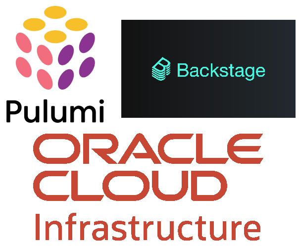

# Introduction

## Build a self-service IaC platform on OCI with Pulumi and Backstage

## About this workshop.

...

Estimated time: 2 hours

### Objectives

In this workshop, you will:

* Set up your environment and prepare the Pulumi + Backstage self-service platform
* Experiment with the simple static web page template
* Implement a more complex template for deploying an OKE cluster
* Clean up the infrastructure

### Prerequisites

1. An Oracle Free Tier(Trial), Paid or LiveLabs Cloud Account
2. [Familiarity with OCI console](https://docs.us-phoenix-1.oraclecloud.com/Content/GSG/Concepts/console.htm)
3. [Familiarity with the basics of Kubernetes](https://kubernetes.io/docs/tutorials/kubernetes-basics/)
4. [Get to know Pulumi](https://www.pulumi.com/)
5. [Get to know Backstage](https://backstage.io/)

## Infrastructure as Code overview

    Infrastructure as code is a mainstream pattern for managing infrastructure with configuration files rather than through a graphical user interface or through manual command line script sequences. It allows you to build, change, and manage your infrastructure in a safe, consistent, trackable, and repeatable way by defining resource configurations that you can version (in a version control system like GitHub), reuse, and share.

    Pulumi is an open-source infrastructure as code (IaC) tool that allows developers to define and manage cloud infrastructure using familiar programming languages. Unlike traditional IaC tools that require domain-specific languages, Pulumi supports general-purpose languages such as TypeScript, Python, Go, and .NET. This approach not only makes infrastructure code more accessible but also allows developers to leverage existing skills and tools to automate cloud environments.

## Why Backstage?

    Backstage.io is an open-source developer portal that can help organizations centralize information, streamline workflows, and build software components. It can be used by developers, engineers, product managers, and others to find information and collaborate. When joined with Pulumi (IaC), it can enable consumption of infrastructure templates for testing and validation purposes. The platform engineering team can create pre-defined templates that can easily be consumed by the development teams.

You may now **proceed to the next lab**.

## Learn More

* [Pulumi for Infrastructure as Code on OCI ](https://blogs.oracle.com/developers/post/pulumi-brings-universal-infrastructure-as-code-to-oracle-cloud)

## Acknowledgements

* **Author** - Eli Schilling - Technical Architect
* **Contributors** -
* **Last Updated By/Date** - August, 2024