# Prepare your tenancy

## Introduction

In this workshop you'll build out a working environment that you can use to deploy and manage the Pulumi and Backstage components. You'll need to be logged in your OCI tenancy (Free Trial recommended). You'll also need an SSH client so you can connect to an OCI Compute Instance.

Estimated time: 20 minutes

### Objectives

* Sign into your OCI tenancy
* Create new Compartment
* Create an API Signing Key
* Sign up for a free Pulumi account
* Generate a GitHub personal access token
* Create a compute instance


## Task 1: Create a new compartment for the workshop

1. Navigate to **`Identity and Security`** -> **`Compartments`**.

2. Click **`[Create Compartment]`**, then provide a **Name** and **Description**. **Parent Compartment** should be *(root)*.

    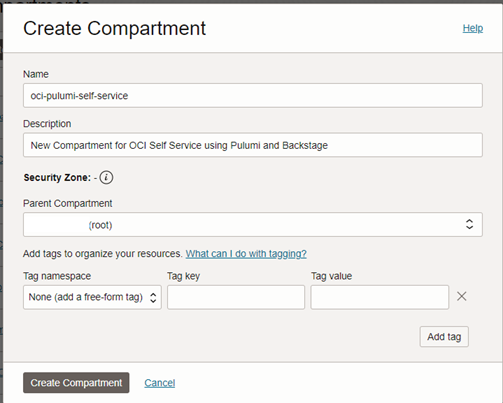

3. Click **[`Create Compartment`]** to provision the resource.

4. Once the Compartment in task 2 has been created, it will appear in the list of compartments.

5. Locate the **OCID** column for the compartment you just created. Hover over the partially displayed OCID and click the <ins>Copy</ins> link.  Store the value in a text file for later use.

    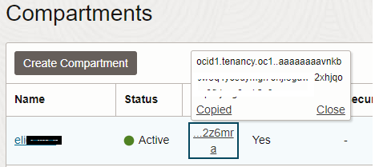

## Task 2: Create an Auth token and collect info

1. Click the profile avatar in the top right corner of the console and select **My profile**

    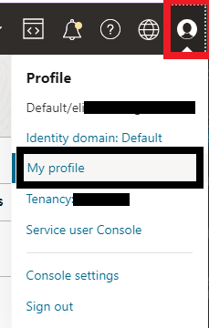

2. Scroll down to the **Resources** Menu on the left side and view the available options. This is where you would create API Keys (for CLI, Terraform, SDK access) and Auth Tokens (i.e. access to OCI Container Registry).

3. Click **Auth tokens**

4. Click **`[Generate token]`**, provide a description (i.e. *oci-pulumi-workshop*), and click **`[Generate token]`** once more.

5. The generated token will be displayed. Click the <ins>Copy</ins> link and paste the value into a text file for use later.

    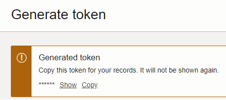

    >Note: As the dialog says, if you don't save it now, you won't be able to see the token after closing the window.

6. Scroll back to the top of the page and locate the **OCID:** for your user account. Click the <ins>Copy</ins> link and safe it in a safe place.

7. Copy the value **Username** value and store it.

    >Note: For IAM users, you'll likely see an e-mail address or simple name. For OIDC users, it will be `oracleidentitycloudservice/<name or email>`.

## Task 3: Retrieve the Object storage namespace and OCID for your tenancy

1. Click the profile avatar in the top right corner once again and select **Tenancy: <your tenancy name>**

2. Locate the **Object storage namespace** item and copy the value. Store this 12-digit string in a safe place...you'll need it later.

    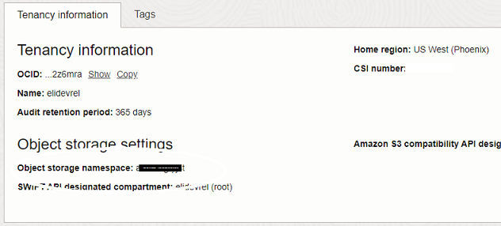

3. Click the <ins>Copy</ins> link to the right of **OCID:** just above the namespace. Store that value for later.

## Task 4: Sign up for a free Pulumi account

1. Navigate to https://www.pulumi.com

2. Click **Sign In** in the top right corner.

3. Under the **Sign In** banner, click <ins>Create an account</ins>. Fill in your desired usernam, email address, and password. Complete the Captcha, then click **[`Create account]`**.

    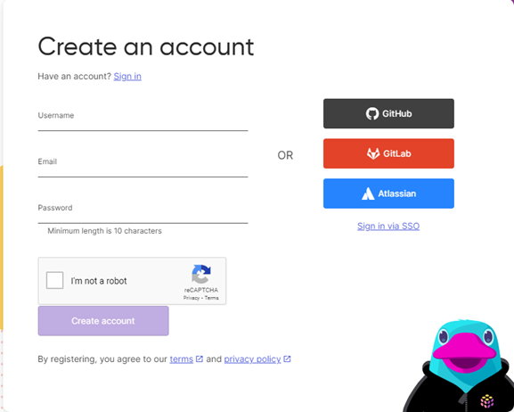

4. On the next page, you'll be prompted for why you signed up. Click "I want to set up Pulumi for my personal projects" and click **`[Next]`**.

    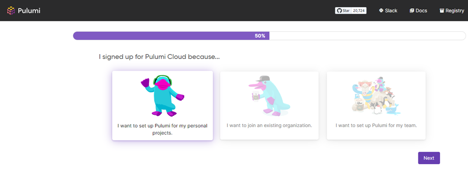

5. Welcome to the Pulumi dashboard! If it doesn't automatically take you here, click Next again.

    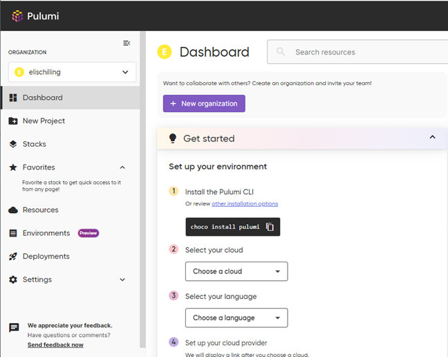

6. From the Pulumi dashboard, click your account menu button in the top right corner and select ** Personal access tokens**.

    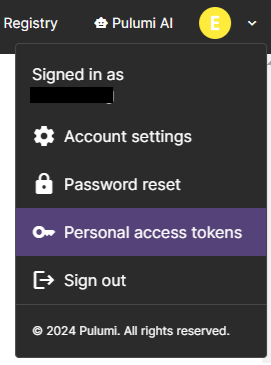

7. Click the **`[Create token]`** button. Provide a description and select an expiration period (30 days should suffice for the workshop).

    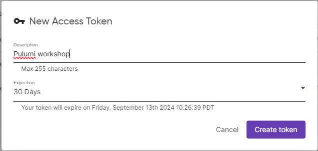

8. Click **`[Create token]`**.

9. Copy the new personal access token to a safe place to be used later in the wrokshop.

10. You can minimze the Pulumi dashboard for now. We'll come back to it in a future lab.

## Task 5: Generate a Github.com Personal Access Token (PAT)

1. Follow [these instructions](https://docs.github.com/en/authentication/keeping-your-account-and-data-secure/managing-your-personal-access-tokens) to create a personal access token.

2. When selecting the choice of PAT, choose `Personal access token (classic)`.

3. Under **Select scopes**, you just need **Repo**

    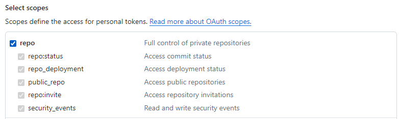

3. Save the generated PAT for use a bit later in the lab.

## Task 6: Launch an OCI Compute Instance (optional, but recommended)
To simplify the remaining steps in the workshop, we recommend using an OCI comupute instance. If you'd prefer to run the tasks locally on your laptop, you will need:
* Python 3.8 or newer
* Node.js 18 or newer
* Yarn, g++, gcc, and make
* Docker
* Git
* Pulumi
* OCI CLI

1. Create the instance and VCN

    * Use the console menu to navigate to **`Compute`** -> **`Instances`** and click **`[Create instance]`**.
    * Provide an instance name (e.g. oci-pulumi-workshop)
    * Change image shape and select `Canonical Ubuntu 22.04`
    * Under **Primary VNIC Information** select the radio button to *Create new virtual cloud network*
    * Under **Add SSH keys** you can either click **`[Save private key]`** to retrieve a new SSH key, or you can click one of the radio buttons to upload or paste your existing key.
    * At the bottom of the page, click **`[Create]`**

3. Locate the public IP address of the instance when available.

2. SSH into the instance using your favorite SSH client.

    ```bash
    <copy>ssh -i <rivate key path> ubuntu@<public ip address></copy>
    ```

    >Note: If you use Putty, you'll need to use `puttygen` to convert the private key from PEM format to PPK.

3. Install pre-requisites.

    ```bash
    <copy>
    sudo apt install apt-transport-https ca-certificates curl software-properties-common
    curl -fsSL https://download.docker.com/linux/ubuntu/gpg | sudo gpg --dearmor -o /usr/share/keyrings/docker-archive-keyring.gpg
    echo "deb [arch=$(dpkg --print-architecture) signed-by=/usr/share/keyrings/docker-archive-keyring.gpg] https://download.docker.com/linux/ubuntu $(lsb_release -cs) stable" | sudo tee /etc/apt/sources.list.d/docker.list > /dev/null
    sudo mkdir -p /etc/apt/keyrings
    curl -fsSL https://deb.nodesource.com/gpgkey/nodesource-repo.gpg.key | sudo gpg --dearmor -o /etc/apt/keyrings/nodesource.gpg
    NODE_MAJOR=20
    echo "deb [signed-by=/etc/apt/keyrings/nodesource.gpg] https://deb.nodesource.com/node_$NODE_MAJOR.x nodistro main" | sudo tee /etc/apt/sources.list.d/nodesource.list
    sudo apt install -y ca-certificates curl gnupg
    sudo apt update
    sudo apt install docker-ce -y
    sudo usermod -aG docker ubuntu
    bash -c "$(curl -L https://raw.githubusercontent.com/oracle/oci-cli/master/scripts/install/install.sh)"
    curl -fsSL https://get.pulumi.com | sh
    sudo apt install -y nodejs
    sudo apt install gcc g++ make -y
    sudo npm install --global yarn
    </copy>
    ```

    >Note: You can copy the entire block of commands and paste it in your terminal. You might be prompted a few times to press enter to accept the defaults, or type `Y` to agree.

4. Restart the shell session.

    ```bash
    <copy>
    source ~/.profile
    </copy>
    ```

    >Note: The best way to check permissions is to run `docker ps` - if you get an error, you'll need to disconnect from the server, then reconnect (to fully recycle your user session)

5. Configure the OCI CLI.

    ```bash
    <copy>oci setup config</copy>
    ```

    >Note: You will be prompted to enter the User OCID, Tenancy OCID, and region. You'll also be prompted to create a new API key, which is recommended.

    **Example**

    ```bash
    Enter a location for your config [/home/ubuntu/.oci/config]:
    Enter a user OCID: ocid1.user.oc1..axxxxxxxma
    Enter a tenancy OCID: ocid1.tenancy.oc1..aaxxxxxza
    Enter a region by index or name(e.g.
    1: af-johannesburg-1, 2: ap-chiyoda-1, 3: ap-chuncheon-1, 4: ap-dcc-canberra-1, 5: ap-dcc-gazipur-1,
    ===truncated===
    66: us-sanjose-1): us-ashburn-1
    Do you want to generate a new API Signing RSA key pair? (If you decline you will be asked to supply the path to an existing key.) [Y/n]: Y
    Enter a directory for your keys to be created [/home/ubuntu/.oci]:
    Enter a name for your key [oci_api_key]:
    Public key written to: /home/ubuntu/.oci/oci_api_key_public.pem
    Enter a passphrase for your private key ("N/A" for no passphrase):
    Repeat for confirmation:
    Private key written to: /home/ubuntu/.oci/oci_api_key.pem
    Fingerprint: 3a:b-redacted-c:bc
    Config written to /home/ubuntu/.oci/config


    If you haven't already uploaded your API Signing public key through the
    console, follow the instructions on the page linked below in the section
    'How to upload the public key':

        https://docs.cloud.oracle.com/Content/API/Concepts/apisigningkey.htm#How2
    ```

6. After the CLI setup is complete, you will need to add the API key to your OCI user profile. [Click here](https://docs.cloud.oracle.com/Content/API/Concepts/apisigningkey.htm#How2) to read the instructions.

    ```bash
    <copy>
    cat ~/.oci/oci_api_key_public.pem
    </copy>
    ```

7. Test the CLI.

    ```bash
    <copy>
    oci iam availability-domain list
    </copy>
    ```

    The output should look something like:
    ```bash
    {
    "data": [
        {
        "compartment-id": "ocid1.tenancy.oc1..aaaaaaaa2=======5za",
        "id": "ocid1.availabilitydomain.oc1..aaaaaaaat========7mxsfdq",
        "name": "aaaa:US-ASHBURN-AD-1"
        },
        {
        "compartment-id": "ocid1.tenancy.oc1..aaaaaa======5za",
        "id": "ocid1.availabilitydomain.oc1..aaaaaaaa=====l2n3a",
        "name": "aaaa:US-ASHBURN-AD-2"
        },
        {
        "compartment-id": "ocid1.tenancy.oc1..aaaaaaa=======4xlrz5za",
        "id": "ocid1.availabilitydomain.oc1..aaaaaaaau======hta",
        "name": "aaaa:US-ASHBURN-AD-3"
        }
    ]
    }
    ```


You may now **proceed to the next lab**.


## Acknowledgements

* **Author** - Eli Schilling - Technical Architect
* **Contributors** -
* **Last Updated By/Date** - August, 2024