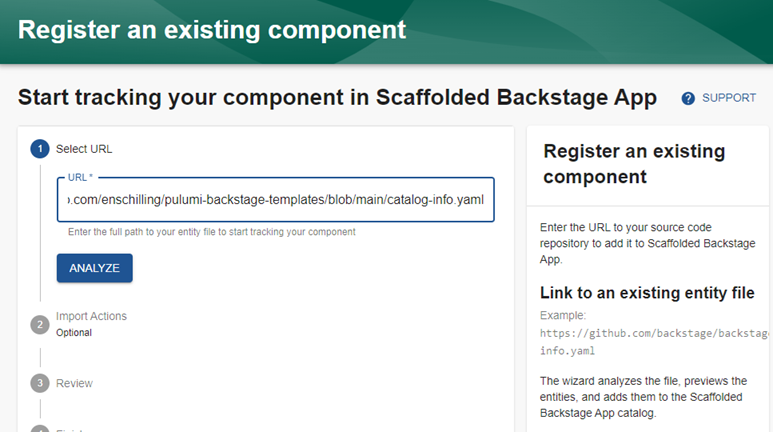
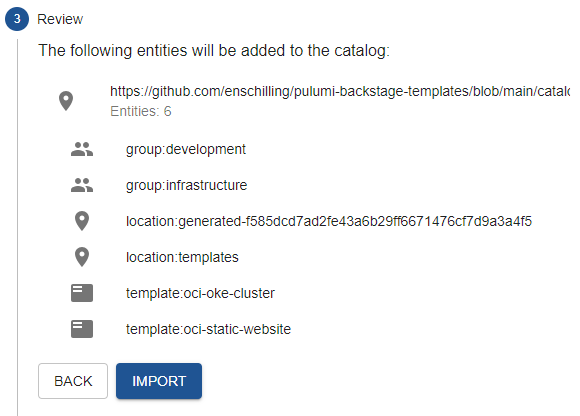
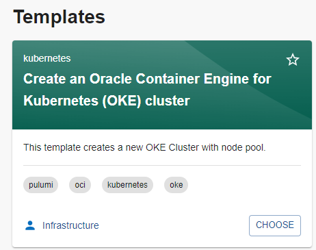
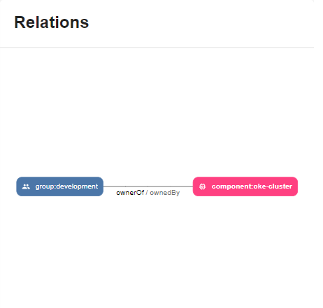

# Add a second template for deploying OKE

## Introduction

The first template you deployed was configured within the Backstage container that was built in lab 2 (using Pulumi). Backstage leverages a `catalog-info.yaml` file to define which compoments are avaialable, and where they reside. It just so happens we've created another Github repo with some samples, including one for deploying Oracle Container Engine for Kubernetes (OKE). Let's go check it out!

Estimated time: 30 minutes

### Objectives

In this lab you will register additional templates from a Github repository, then deploy an OKE cluster.

## Task 1: Register existing components in Backstage

1. Return to the Backstage dashboard and click **`[Create...]`** from the left nave menu.

2. Click **`[REGISTER EXISTING COMPONENT]`** in the upper right corner. 

  

3. Paste the full URL to the `catalog-info.yaml` file in the sample templates repo.

  ```
  <copy>
  https://github.com/enschilling/pulumi-backstage-templates/blob/main/catalog-info.yaml
  </copy>
  ```

4. Click **`[ANALYZE]`** and watch as it evaluates the contents of the catalog file. You'll see it has identified a number of components to import, including groups, locations, and templates.

  

5. Click **`[IMPORT]`**, then return to the **Create a new component** page. You should see the new template added.

  

## Task 2: Deploy the OKE template

1. Choose the OKE template and fill in the details like you did in the las lab. 

2. For **Owner** this time, enter `development` as the name. 

  >Note: The app-catalog that was just imported contained two group entities. One for `development` and another for `infrastructure`.

3. On the final page before you review, enter a new repository name. Again, Backstage copies all of the rendered IaC to a new GitHub repo.

4. Review and create!

5. The process to create a new OKE cluster and node pool can around 15 minutes. Feel free to grab a beverage and take a quick break.

## Task 3: View the newly created component

1. If you now view the catalog info component, you'll see a [slightly] more useful graph.

  

2. Given the addition of two entities in the first task, we can now track component ownership. As you provision additional components related to particular groups, it is easy to explore the relationships between the different entities.

3. 

You may now **proceed to the next lab**.

## Learn More

* [Oracle Container Engine for Kubernetes (OKE)](https://backstage.io/docs/features/software-templates/writing-templates/#outputs)
* [Managing stack output within Backstage templates](https://backstage.io/docs/features/software-templates/writing-templates/#outputs)


## Acknowledgements

* **Author** - Eli Schilling - Technical Architect
* **Contributors** -
* **Last Updated By/Date** - August, 2024