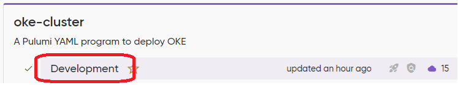

# [Optional] Clean up your OCI environment

## Introduction

The following includes instructions for removing all resources created during the workshop. You may choose to do this immediately, or come back later after you've had more time to explore the features and capabilities covered here.

Estimated time: 10 minutes

### Objectives

* Use `pulumi destroy` to remove all components deployed in the second lab
* Follow Pulumi instructions to identify and delete each stack with its corresponding resources.
* Delete the compute instance (if you created one in the first lab)

## Task 1: Destroy Backstage deployment

1. Return to the server you used in lab 1. If your connection was interrupted since, you'll need to navigate back to `~/oci-pulumi-self-service/00-backstage` and run `source venv/bin/activate` to return to the virtual environment.

2. Destroy the resources

    ```bash
    <copy>
    pulumi destroy
    </copy>
    ```

3. When prompted, use the up arrow to select **Yes** and press enter. It will take just a minute or two to delete the resources.

    ```bash
    Do you want to perform this destroy? yes
    Destroying (OCW-2024)

    View in Browser (Ctrl+O): https://app.pulumi.com/elischilling/ocw2024/OCW-2024/updates/5

        Type                                      Name                          Status              Info
    -   pulumi:pulumi:Stack                       ocw2024-OCW-2024              deleted (0.74s)     4 messages
    -   ├─ oci:ContainerEngine:ContainerInstance  backstageContainerInstance    deleted (35s)
    -   ├─ oci:Core:Subnet                        backstageSubnet               deleted (1s)
    -   ├─ oci:Core:RouteTable                    backstageRouteTable           deleted (0.54s)
    -   ├─ oci:Core:SecurityList                  backstageSecurityList         deleted (1s)
    -   ├─ oci:Core:InternetGateway               backstageInternetGateway      deleted (0.90s)
    -   ├─ docker:index:Image                     backstageImage                deleted (0.17s)
    -   ├─ command:local:Command                  backstageBuild                deleted (0.50s)
    -   ├─ oci:Artifacts:ContainerRepository      backstageContainerRepository  deleted (0.53s)
    -   └─ oci:Core:Vcn                           backstageVcn                  deleted (0.95s)

    Diagnostics:
    pulumi:pulumi:Stack (ocw2024-OCW-2024):
        INFO 2024/08/27 15:02:38.118685 Time elapsed for retry: 0s;  Expected retry duration: 0s
        INFO 2024/08/27 15:02:40.106721 Time elapsed for retry: 2s;  Expected retry duration: 0s
        INFO 2024/08/27 15:02:42.142271 Time elapsed for retry: 4s;  Expected retry duration: 0s
        INFO 2024/08/27 15:02:54.474365 Time elapsed for retry: 17s;  Expected retry duration: 0s

    Outputs:
    - backstageUrl: "http://150.136.81.63:7007"
    - image       : "us-ashburn-1.ocir.io/idsssssssssway/backstage@sha256:ee1d70abbde9badc8a46566sssss01ba4963c8520bd16222c071d986"

    Resources:
        - 10 deleted

    Duration: 44s

    The resources in the stack have been deleted, but the history and configuration associated with the stack are still maintained.
    If you want to remove the stack completely, run `pulumi stack rm OCW-2024`.
    ```

4. Run the suggested command to remove the stack complete.

    ```bash
    <copy>
    pulumi stack rm OCW-2024
    </copy>
    ```

5. When prompted, type the name of the stack once more to confirm delete.

## Task 2: Clean up additional resources deployed by Pulumi

1. Return to app.pulumi.com and click on **Stacks**

2. For each remaining stack:

    * Click on the name

        

    * Click on the settings tab
    * Follow the instructions to create a dummy config for the stack (using the server you created in Lab 1)
    * Use the dummy configu to destroy all resources
    * Remove the stack

3. Once there are no more stacks in the Pulumi console, all but a single resource has been cleaned up.

## Task 3: Delete the compute instance if you created one in the first lab

1. Return to the OCI Console

2. Use the menu to navigate to **Compute** -> **Instances**

3. Locate the compute instance you created and click on the name

4. Within the Instance details page, click the **`[Terminate]`** button, click the check box to permanently delete the boot volume, then click **`[Terminate instance]`**.


You've come to the end of the workshop. **Congrats!!**


## Acknowledgements

* **Author** - Eli Schilling - Technical Architect
* **Contributors** -
* **Last Updated By/Date** - August, 2024