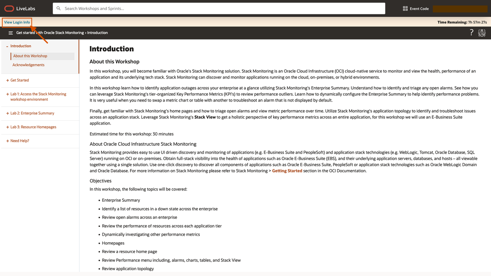
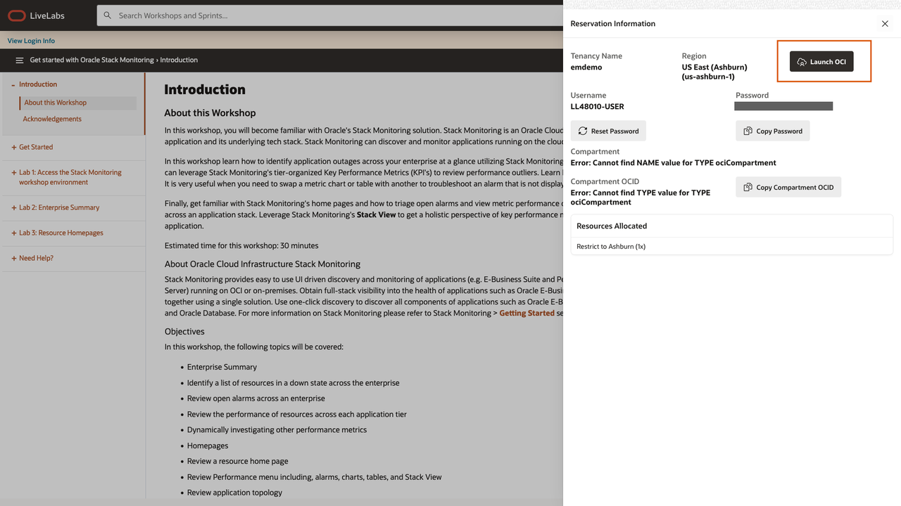
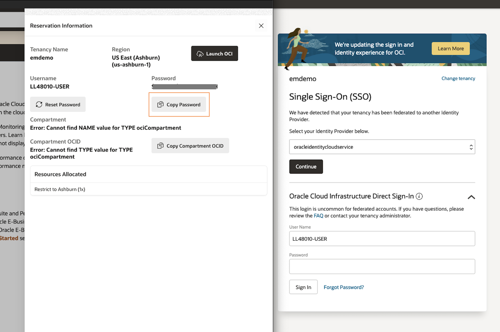
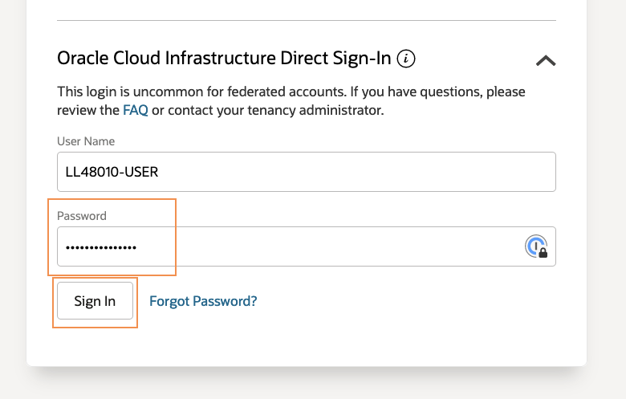
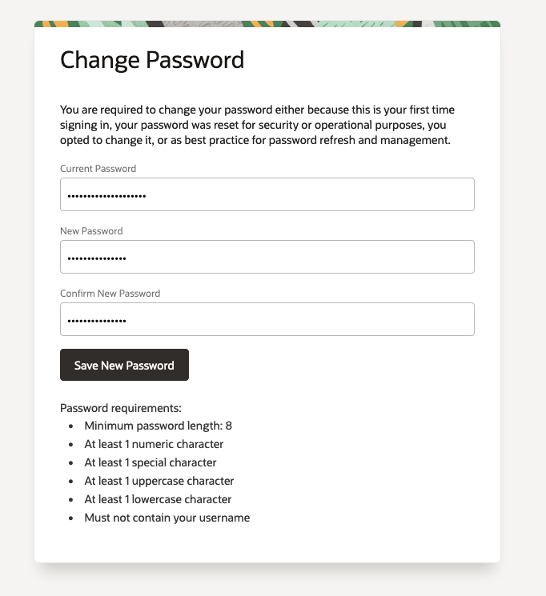
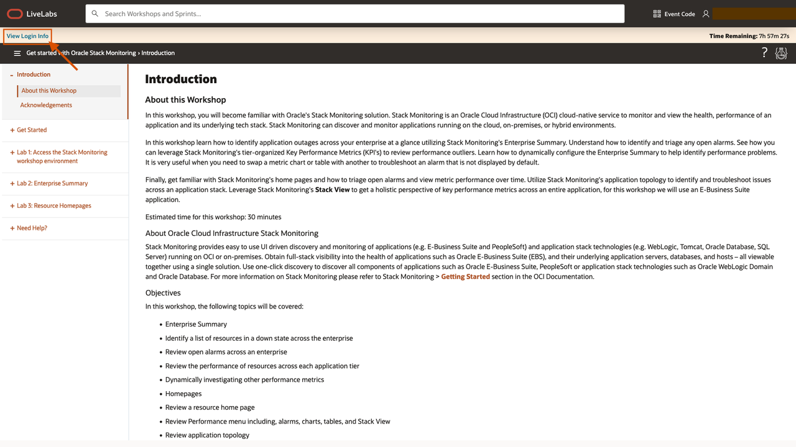
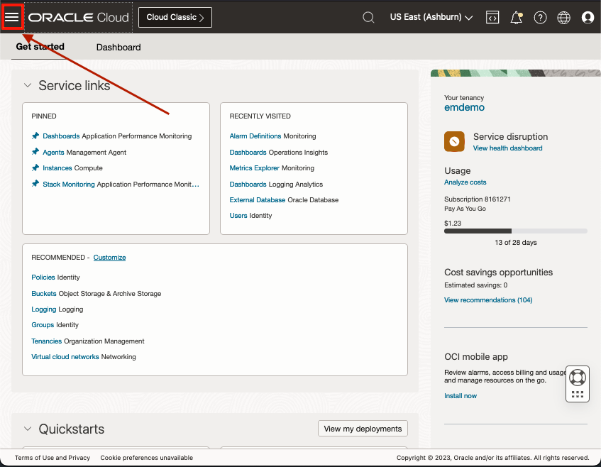
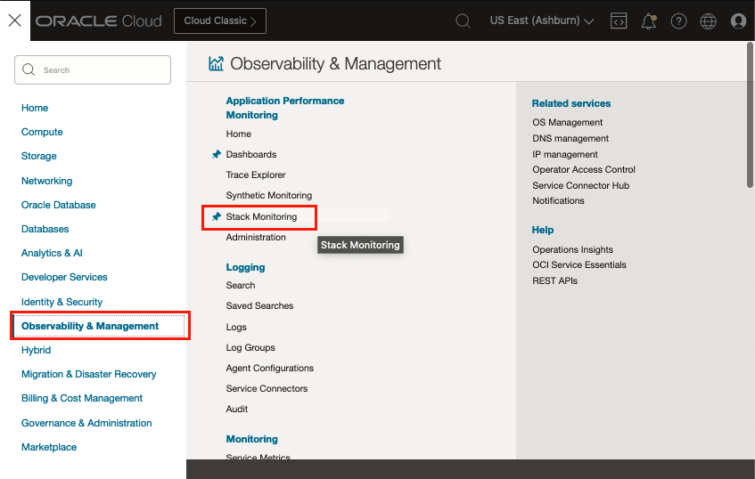
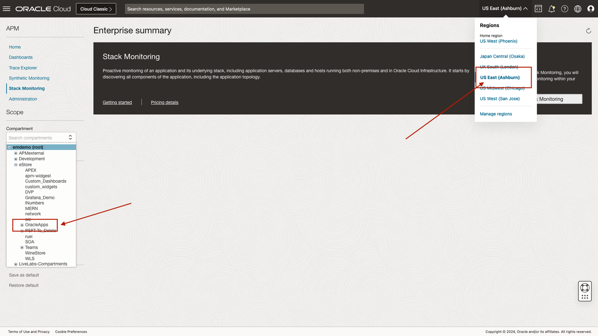
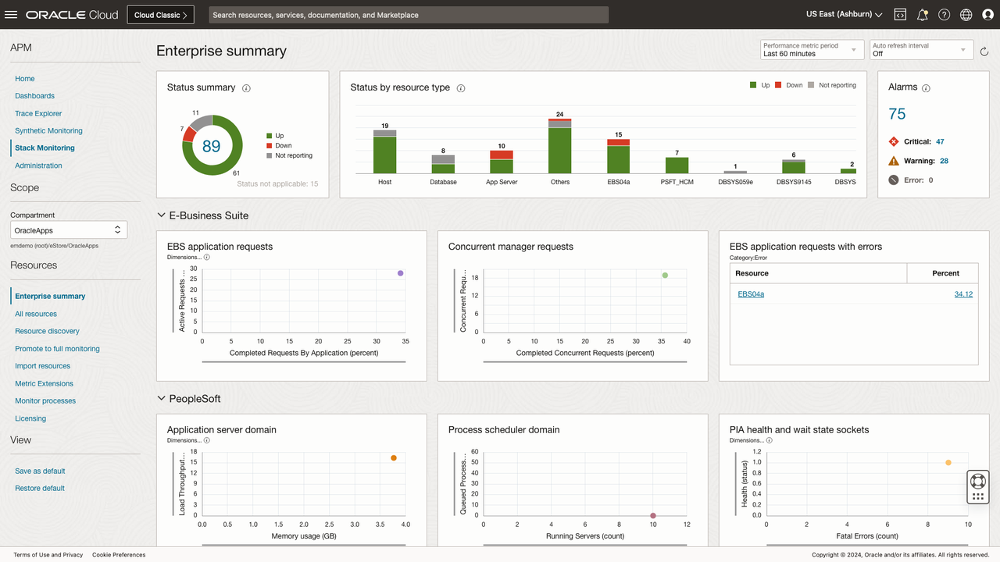

# Access the Workshop environment

## Introduction

In this workshop, you use a username and login provided by the LiveLabs workshop system. 

Estimated time: 5 minutes

### Objectives

* Access the workshop environment

### Prerequisites

* Internet access from a laptop/device with a chrome browser (preferred) and Oracle Single Sign On account to use a LiveLabs workshop. An Oracle LiveLabs Event code or Green Button assigned account and tenancy

## Task 1: Log in to the workshop tenancy

After you successfully log into the workshop tenancy using the View Login Info link located in the upper left of your LiveLabs workshop landing page, you will find the Stack Monitoring Enterprise Summary page using the Oracle Cloud console navigation icon (looks like a hamburger). It is located in the Observability and Management area, and in the Application Performance Monitoring section.

1. Click **View Login info** on **Get Started with Oracle Cloud Stack Monitoring** landing page to log in to the workshop tenancy in the Oracle Cloud.

   

2. Reservation Information pane opens. Click the **Launch OCI** button.

   

3. A new browser tab opens and loads the Oracle Cloud Infrastructure Sign-In page. Copy the Password from the Reservation Information pane on the LiveLab screen.

  
  >***Note:*** In the example image, two browser screens are opened side by side.

4. Paste the copied password onto the OCI Sign-In screen. Note that your user name is already pre-set in the **Direct Sign-In** section.

   

5. **Change Password** screen opens. Enter the new password that you can use to re-sign-in to the workshop tenancy, in case you closed your browser during the workshop reservation time.

   

6. **Oracle Cloud Get started** page opens. You can proceed to the next task to begin the workshop.

   

## Task 2: Access the Enterprise Summary page

1. Navigate to Stack Monitoring
   
   Open the navigation menu from the top left corner (aka. hamburger menu) in the Oracle Cloud console.

   

   Now, select **Observability & Management** > **Stack Monitoring** under **Application Performance Monitoring**.

   

   Stack Monitoring Enterprise Summary page opens.

2. Connect to the appropriate **Region** and **Compartment**

   For this workshop, from the Stack Monitoring Enterprise Summary page, select these following from the drop-down menus:
    - Region: **US East (Ashburn)**
    - Compartment : **root/eStore/OracleApps**

   

When the correct region and compartment is chosen, the Enterprise Summary page will be populated. If you find the Enterprise Summary is empty or you see an error message, double-check to confirm you have selected the correct region and compartment.

   

You may now **proceed to the next lab**.

## Acknowledgements

* **Author** - Aaron Rimel, Principal Product Manager, Enterprise and Cloud Manageability
* **Contributors:** 
   * Ana McCollum, Senior Director of Product Management, Enterprise and Cloud Manageability,  
   * Steven Lemme, Senior Principal Product Manager,  
   * Anand Prabhu, Sr. Member of Technical Staff
* **Last Updated By/Date** - Aaron Rimel, June 2023
