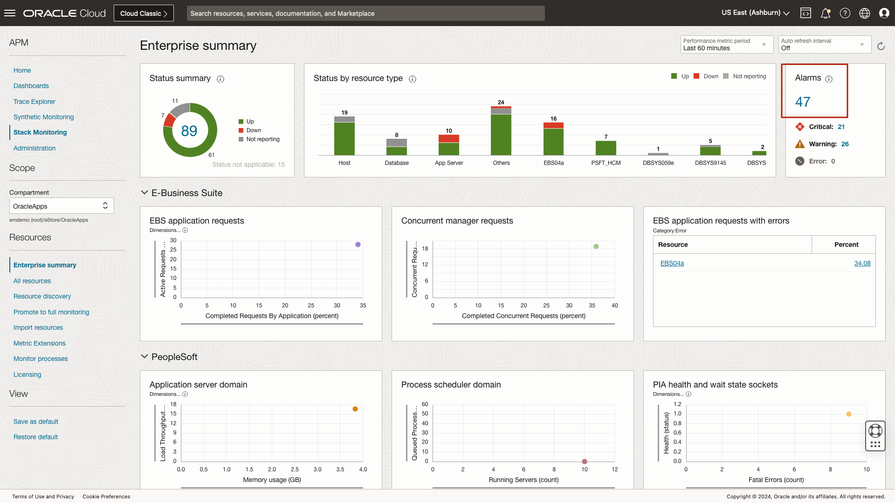
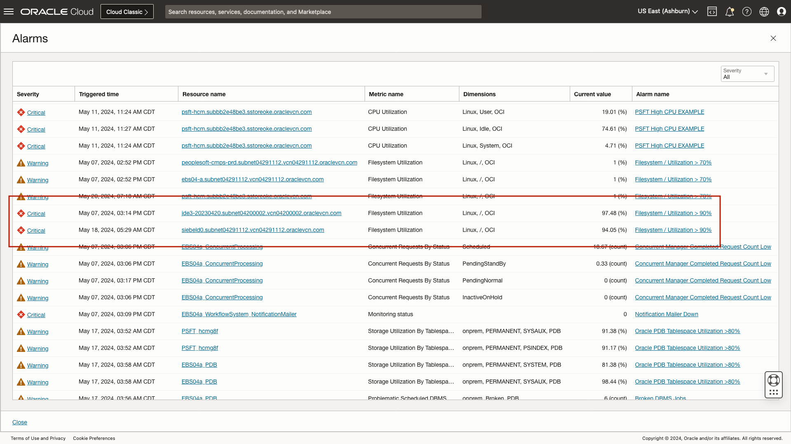
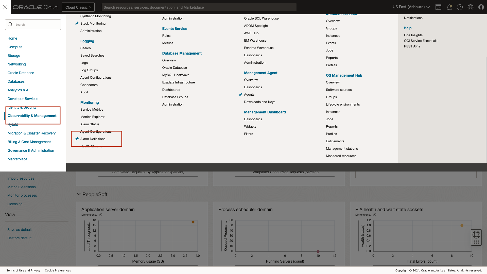
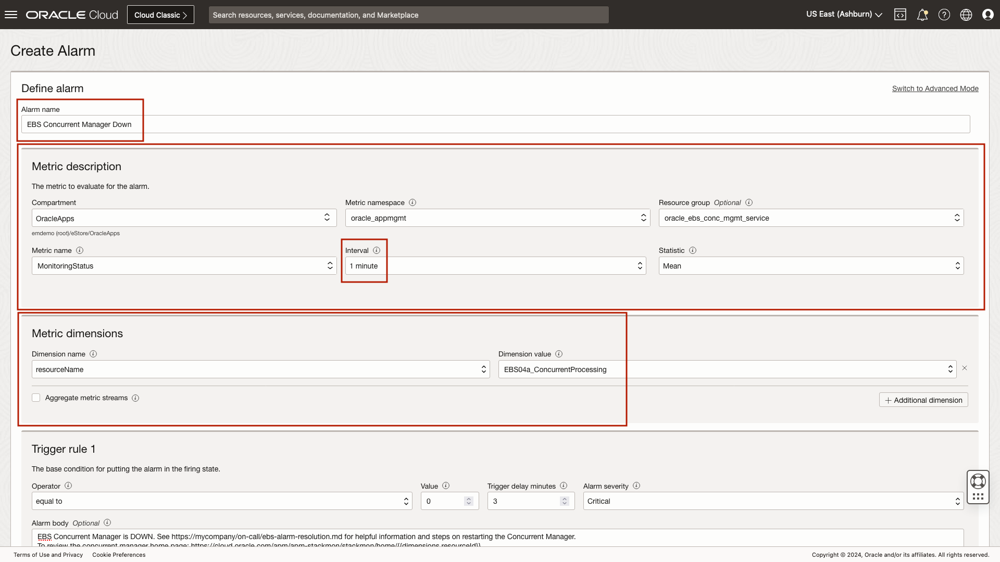
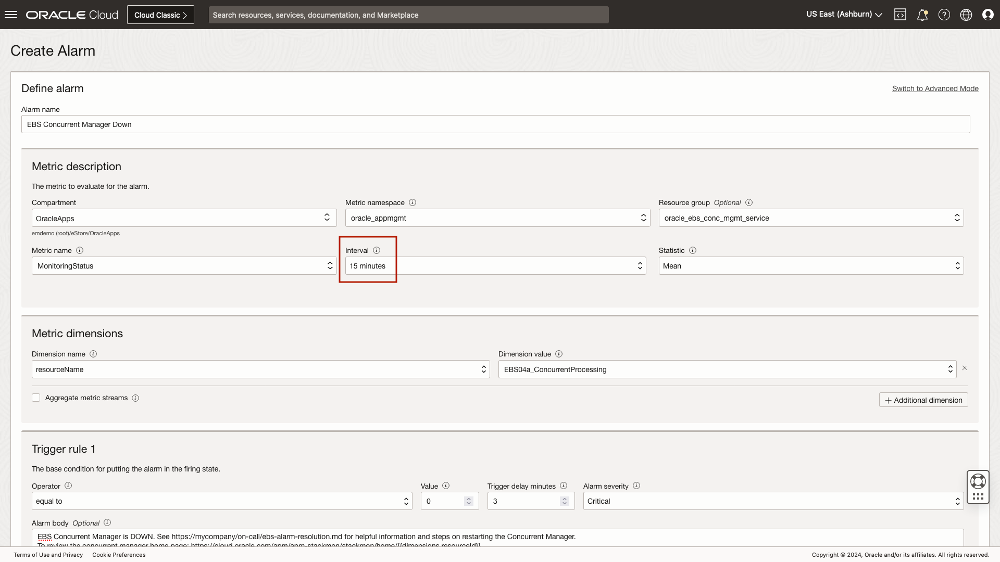
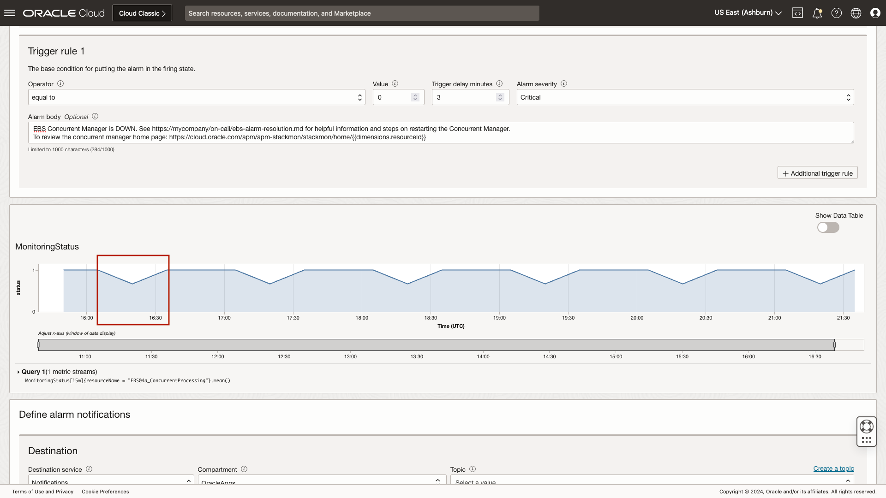

# How to View and Create Alarms

## Introduction

In this workshop, you will review an open filesystem utilization alarm. You will also review the process to create a new alarm. 

Estimated time: 10 minutes

### Objectives

* Review open alarms by severity
* Review an open filesystem alarm
* Review the alarm creation process

### Prerequisites

* Access to the environment as covered in the prior lab.

## Task 1: Review open alarms by severity

1. Navigate to Stack Monitoring

	Open the navigation menu in the Oracle Cloud console, and select **Observability & Management** > **Stack Monitoring** under Application Performance Monitoring.

	

	Once you arrive at the Enterprise Summary, select the compartment OracleApps under eStore.

		

2. Locate the **Alarms** region at the top right of the Enterprise Summary. 

	Stack Monitoring provides quick access to all open alarms on your monitored resources. The **Alarms** region provides a total count of open alarms, as well as a count of alarms by severity. 

	Let's review the open alarms. Begin by clicking the **Total** count of open alarms, in the **Alarms** region. 

 	

	The slide-out provides greater details of the open alarms and is filtered by the severity count selected. As we reviewed earlier, these details include severity, trigger time, resource name, metric name, dimension, current value, and alarm name. The results can be ordered by selecting the column title. DevOps teams can use this information to help prioritize their work, for example they would likely address the JD Edwards host root filesystem that is 97% utilized before investigating the siebel host 93% utilized filesystem. Clicking the resource name will take you to that resource's home page to investigate further, while clicking the alarm name will open a new tab to provide more details of the open alarm.
	
	

3. Refine a list of open alarms

 	Next, filter the list to focus on only the **Critical** alarms. Using the **Severity** filter, change the severity from **All** to **Critical**. The table now displays only the open alarms with a severity of **Critical**. 

 	Select the alarm **Filesystem / Utilization > 90%**. Clicking the alarm name opens a new tab in your browser to further investigate and work the alarm within Oracle Cloud Infrastructure's Monitoring Service.

 	

## Task 2: Review an open filesystem alarm

With the new browser tab open, let's review this example alarm. The OCI Monitoring Service provides critical details into the firing state for this specific metric. 
 	
1. Review an open alarm
	
	At the top of the page, we can see the name of the alarm, **Filesystem / Utilization > 90%**. Reviewing the **Alarm state** we can see the alarm is in a firing state with the severity of **Warning**. 
	
	OCI Monitoring allows each alarm definition to have up to two **trigger rules**, or thresholds. A trigger rule can be used to define an alarm definition such as filesystem > 80 as warning, and filesystem > 90 as critical. Each trigger rule can have it's own alarm body defined. An alarm body should be brief and contain information on the alarm and a link to source controlled troubleshooting steps. Since each trigger rule can have its own alarm body, you can define unique troubleshooting steps for warning and critical thresholds. 
	
	The OCI Monitoring Service provides the ability to **suppress** an alarm. Suppressing an alarm allows you to stop sending notifications for a period of time. When working an issue, it may be necessary to suppress the alarm to reduce notification noise while resolving an incident or during a known maintenance period.
 	
 	

 	Additional details included in the Alarm details section, the compartment where the alarming resource resides, **OracleApps**, the OCID of the resource, and the namespace **oracle\_appmgmt**. Stack Monitoring places all metric data into the following namespaces, **oracle\_appmgmt** (primary namespace for out-of-the-box resource types), **oracle\_oci\_database** (Oracle Database), **oracle\_oci\_database\_cluster** (Oracle Database system, ASM, Cluster, etc), **oracle\_appmgmt\_prometheus** (*Prometheus based resources imported into Stack Monitoring), and **oracle\_metric\_extensions\_appmgmt** (custom metrics created using **Metric Extensions**. For more information on Metric Extensions see **Lab 7: Metric Extensions**). Stack Monitoring utilizes **Resource groups** to organize the large number of metrics provided out-of-the-box. Examples of Resource groups include: host, apache\_tomcat, weblogic\_j2eeserver, elastic_search, and ASM to name a few. In this alarm, the Resource group is **host**. 
 	
 	
 	
	The OCI Monitoring Service provides a variety of ways to notify users an alarm is firing. In this example, we can see this alarm is defined to notify using the Topic, **StackMonDemo**. A topic is a reusable grouping of notifications. A Topic can include a mix of subscription protocols that include Slack, PagerDuty, email addresses, or a custom function. 

	This particular alarm is configured to **Group notifications across metric streams**. Grouping notifications within a metric stream reduces the number of alarms a user would receive. Using this alarm as an example, root filesystem utilization > 90%, was configured to fire if any host's root filesystem within this compartment, OracleApps, goes above 90%. The members of the Topic StackMonDemo notification group will be notified via email. Should more than one host's root filesystem utilization go above 90%, a single email will be sent to each member of the group, and the notification and alarm status page will denote multiple hosts in a firing state.

	

	By default when the **Alarm Definition** browser tab opens, the last hour of firing history will be displayed. The time period can easily be adjusted using the drop-down. Using the **Quick selects** drop-down, choose **Last 7 days**. The status timeline now shows the historical violations over the last 7 days. Additionally, the table view provides details of the metric moving between states, such as Firing, Reset and OK, as well as the date and time the metric transitioned between states.
 	
 	

 	Once you are done reviewing the alarm details, close your browser tab displaying the OCI Monitoring Service to return to Stack Monitoring. Once you have returned to Stack Monitoring, click **Close** to return to the Enterprise Summary.

 	
 	
 	Now let's understand how an alarm is created.

\* For more information on monitoring Prometheus-based resources see [**Importing Prometheus-based resource**.](https://docs.oracle.com/en-us/iaas/stack-monitoring/doc/expand-monitoring-capability-custom-resources.html#GUID-FC195BED-DA68-4EBD-92F0-54E358C0A8B2)

## Task 3: Review the alarm creation process

1. Navigate to the OCI Monitoring Service page

	In this task you will walk through the process of creating an alarm. While your user does not have the necessary privileges to create an alarm, the overall process remains the same. Information covered in this lab is based off of Stack Monitoring's comprehensive list of recommended alarms provided within the [documentation](https://docs.oracle.com/en-us/iaas/stack-monitoring/doc/setting-alarms.html). Let's begin by selecting the navigation menu from the top left of the Enterprise Summary.

	

	From within the navigation menu, select **Observability & Management**, then select **Alarm Definitions** located under the **Monitoring** menu.

	

	The Alarm Definitions page provides a list of all created alarms in a compartment. From this page you can see the Alarm name, the status of the alarm, severity for which the alarm is configured, the namespace related to the alarm, the destination (such as email notification), and suppression details. When creating an alarm rule, it is important you verify the compartment you wish to create the alarm in. Here we want to ensure we are in the compartment **OracleApps**. Having verified the compartment, now select **Create Alarm** to walk through the alarm creation process.

 	

2. Review the alarm creation process

	Creating an alarm rule is simple. Alarms should be actionable and contain a meaningful name. Let's create an availability alarm rule to notify on E-Business Suite Concurrent Manager down. The alarm name will be used in the alarm summary, such as an email summary, when the alarm fires. Enter the alarm name **EBS Concurrent Manager Down**. 
	
	The **Metric description** section provides easy to use drop-down menu items. You will first begin by ensuring the compartment listed is the compartment where the resource resides that you wish to be monitored. Here we will verify the compartment is **OracleApps**. Next select the Stack Monitoring namespace. As we reviewed earlier, Stack Monitoring places all metric data in the **oracle\_appmgmt** namespace. This is true except for Oracle Database metric data, as this data is stored in the **oracle\_oci\_database** metric namespace. Here you will select **oracle\_appmgmt**. Stack Monitoring uses resource groups to help organize the large amount of out-of-the-box metrics provided. Here we will select **oracle\_ebs\_conc\_mgmt_service**. Once a resource group is chosen, the drop-down for **Metric name**, well filter to only show metrics related to the Concurrent Manager. To alert on availability status choose **MonitoringStatus**. Monitoring Status is collected every minute, we will leave the interval set to 1m, and the statistic as mean. 

	The **Metric dimensions** section allows you to refine the metric chosen previously. For example, when defining an alarm for filesystem, using metric dimensions you can define an alarm to only evaluate /u01 filesystem. In this example, for monitoring status, we will define an alarm specific to a concurrent manager. To do so select **resourceName** and the dimension value of **EBS04a\_ConcurrentProcessing**.

	

	We discussed earlier how **trigger rules** allow you to define the thresholds the metrics will be evaluated against. Stack Monitoring provides alarm best practices for all of the out-of-the-box resource types. For more information on best practices see [**Setting alarms**.](https://docs.oracle.com/en-us/iaas/stack-monitoring/doc/setting-alarms.html) In OCI monitoring, the equivalent of a resource state of up is 1. To alarm when the concurrent manager is down, choose the operator **equal to**, the value **0**, and trigger delay minutes to **3**.
	
	The alarm severity should match the criticality and state of the resource. This alarm will notify if the concurrent manager is down, select the severity of **Critical** from the drop-down. The alarm body should contain details of the alarm or possibly a link to your source controlled alarm documentation and resolution. An example alarm body message is: EBS Concurrent Manager is DOWN. See https://an-example-company/on-call/ebs-alarm-resolution.md for helpful information and steps on restarting the Concurrent Manager.

	If you had additional trigger rules, or thresholds, you would select **Additional trigger rule**.

	

	Moving down the page, reviewing the MonitoringStatus chart, you can see valleys when the monitoring status value drops from 1 (available) to 0 (down). If you were to create an alarm with an interval of 1, this alarm would fire every hour. This is a demo environment, and we expect the Concurrent Manager to shut down once an hour and reviewing this data we can see when the Concurrent Manager went down and we know this alarm will be noisy.

	

	Let's update the interval from **1 minute** to **15 minutes** to provide a buffer.
	
	

	With the interval set to 15 minutes, the valleys no longer reach 0, and as a result will not generate an alarm.

	

	Defining an alarm notification is easy. First begin by selecting how you would like to be notified, notifications or streaming. Here we will choose **Notifications**. Next select the compartment where your topic resides. For this example, select **OracleApps**, and select **StackMonDemo** as the topic.
	
	Group notifications allow multiple firing alarms, for example, if many hosts go down, only a single notification for all hosts down will be sent. If notifications are split per metric stream, a notification will be sent for every host that is down. Select **Group notifications across metric streams**.

	Since this is an email notification for human consumption, select **Send formatted messages**. Click the check-box for **Repeat notifications**, and select a frequency of **10 minutes**. If you wish to immediately begin monitoring for the concurrent manager down, ensure the box is checked **Enable this alarm**. 

	Once again, your access within this environment does not have sufficient privileges to create an alarm. As such, once you are done reviewing the alarm creation process, click **Cancel**.

	

	You have learned about using Stack Monitoring's Enterprise Summary, reviewed a resource's homepage, and understanding alarms. In the next lab we will apply all that you have learned, in **Putting it all together**.

	You may now **proceed to the next lab**.

## Acknowledgements

* **Author** - Aaron Rimel, Principal Product Manager, Enterprise and Cloud Manageability
* **Contributors:** 
	* Ana McCollum, Senior Director of Product Management, Enterprise and Cloud Manageability,  
	* Steven Lemme, Senior Principal Product Manager,  
	* Anand Prabhu, Sr. Member of Technical Staff
* **Last Updated By/Date** - Aaron Rimel, June 2024